# AI 大模型商业调查报告
## 海外文生图生音
### riffusion **
- 技术需求方
- 技术展示+随机文生音
- 官方网站
		
		https://www.riffusion.com/

	[介绍](https://www.riffusion.com/about)

		
	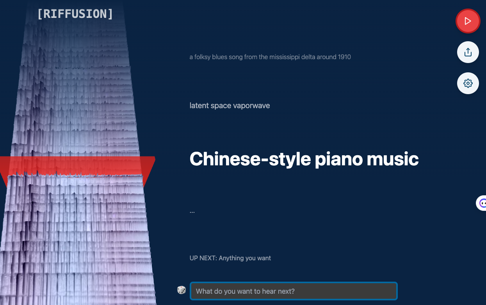 
- 付费模式
- 优缺点
	- 优点
		- 简单
	- 缺点
		- 效果不是很好
- 技术底层
	- Stable Diffusion
	
## 海外文生图
### Stable Diffusion (算法类)
- 技术需求方
- 技术展示+随机生图
- 官方网站
		
		https://stability.ai/blog/stable-diffusion-public-release
- 产品网站

		https://dreamstudio.ai/
		
	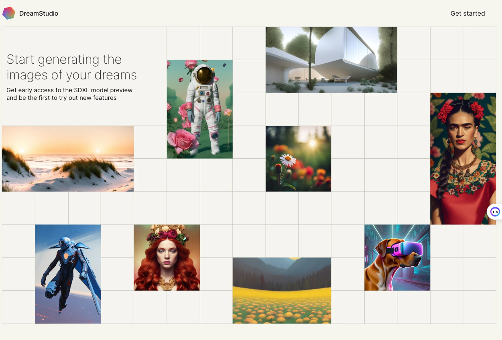 
- 付费模式
	- 购买积分 
- 优缺点
	- 优点
		- 简单
	- 缺点
		- 功能少
		- 贵
- 技术底层
	- Stable Diffusion
	
### DALL.E (算法类)
- 技术需求方
- 技术展示+随机生图
- 产品网站

		https://labs.openai.com/
		
	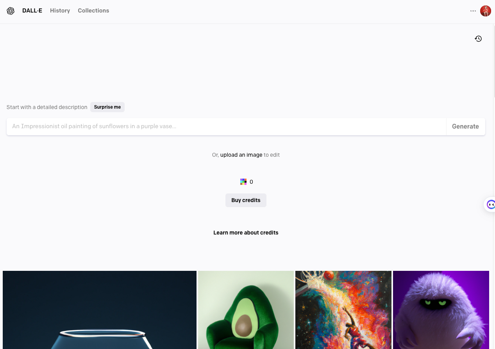 
- 付费模式
	- 购买积分 
- 优缺点
	- 优点
		- 简单
	- 缺点
		- 功能少
		- 贵
- 技术底层
	- DALL.E
	 	
### lexica (算法类)
- 技术需求方
- 技术展示+随机生图
- 产品网站

		https://lexica.art/

	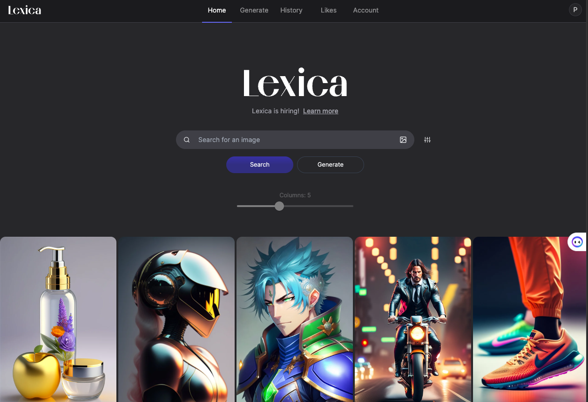 
- 付费模式
	- 根据生成公开私密性
	- 生成数量
	- 生成并发数
	- 按年/月交钱 	
- 优缺点
	- 优点
		- 简单
		- 价格相对便宜
	- 缺点
		- 功能少
- 技术底层
	- Stable Diffusion

### dreamlike.art **** (工具类)
-  AI 艺术家？
-  AI 绘图
- 产品网站

		https://dreamlike.art/

	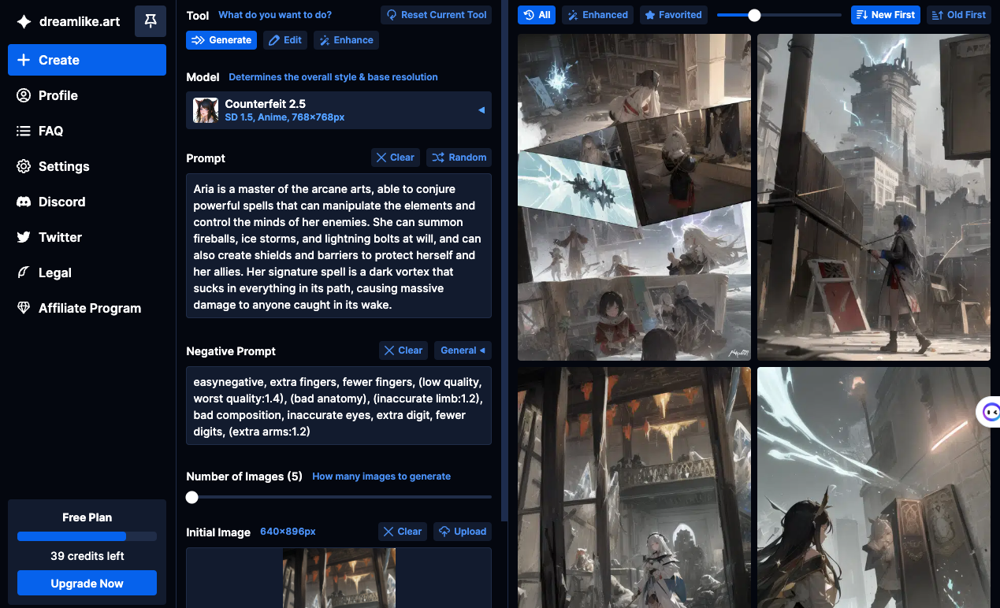 
- 付费模式
	- 按月/年支付
	- 增加生图数量
- 优缺点
	- 优点
		- 有免费额度/每天 
		- 绘图流程做的不错
		- 选择模型比较直观
- 技术底层
	- Stable Diffusion
	- Kandinsky

### leonardo.ai (工具类)
- 技术需求方
- 社区、文生图、训练、模型微调
- 产品网站

		https://app.leonardo.ai/

	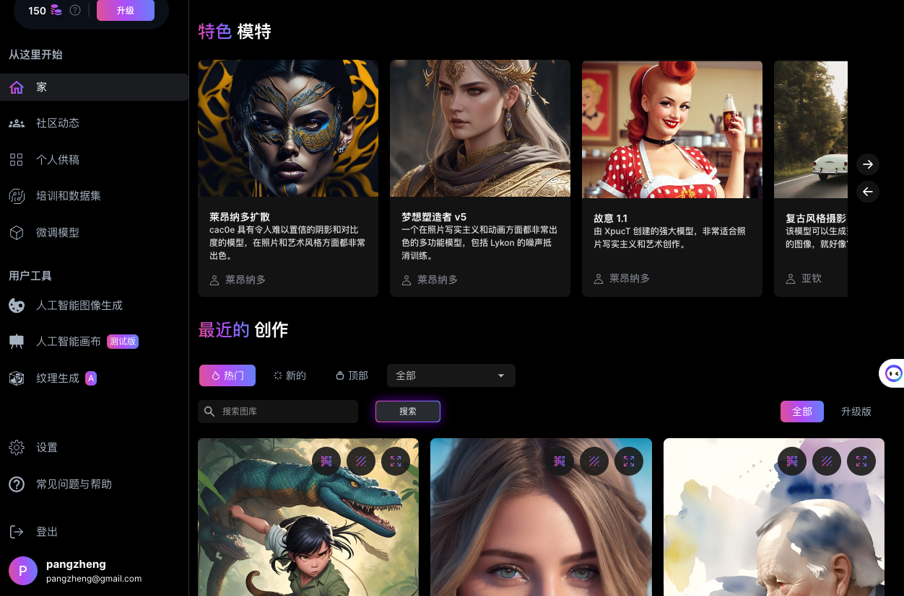 
	
	类似
	
		https://getimg.ai/editor
- 付费模式
	- 不同的训练模型数量
	- 不同的保存模型的数量 
	- 按需求按月支付
	- 并行计算数量
	- 算力数量
- 优缺点
	- 优点
		- 有免费额度/每天 
		- 简单
		- 支持训练
- 技术底层
	- Stable Diffusion

### pollinations.ai (工具类)
- 产生视频
- 文视频
- 产品网站

		https://pollinations.ai/

	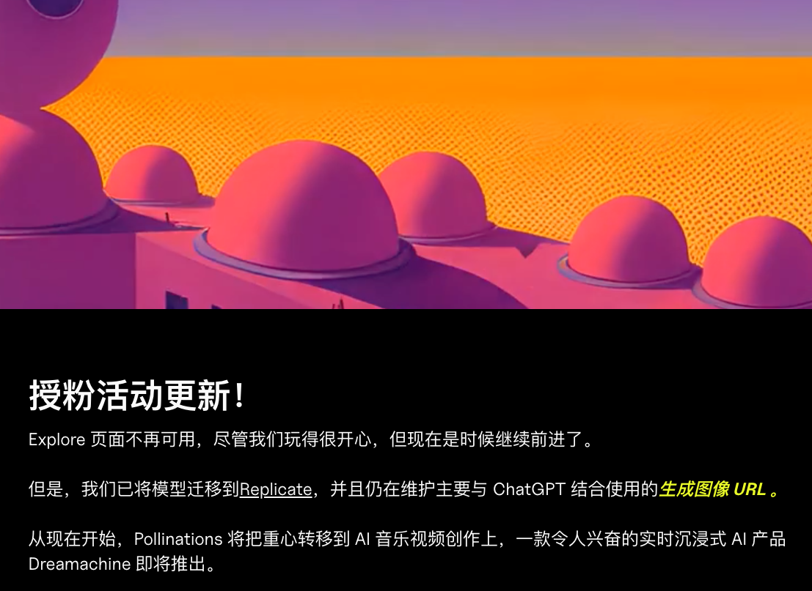 
- 付费模式
	- 无
- 优缺点
	- 已经关闭，产品重心从Ai 视频转为 AI 音乐视频 
- 技术底层
	- SD?
	
### Microsoft Designer (工具类)
- 目标客户平面设计师
- AI 设计工具 
- 产品网站

		https://designer.microsoft.com/

	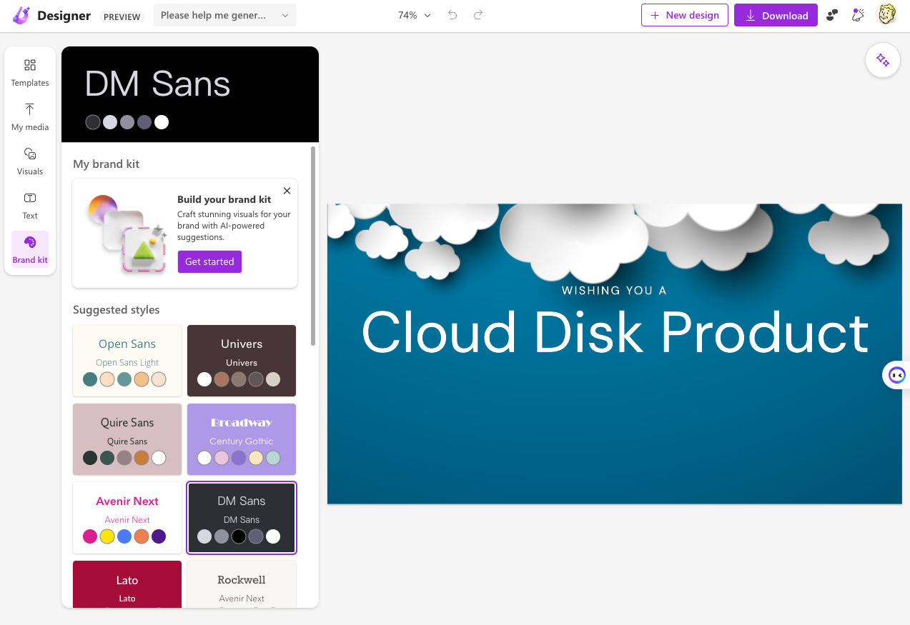 
- 付费模式
	- 测试免费 	
- 优缺点
	- 优点
		- 免费 
		- 简单易上手、易于使用和流畅的设计语言。
	- 缺点
		- 它的功能不算多，可能无法满足专业设计师的需求。 
- 底层技术包装未知 

### synthesia.io (工具类)
- 制作产品、公司等介绍视频的用户
- 提供介绍文字用 AI  合成介绍视频
	- 15分钟视频
	- 120种语言
	- 125种头像
	- 60多种模版
	- 自定义头像 
- 产品网站

		https://www.synthesia.io/

	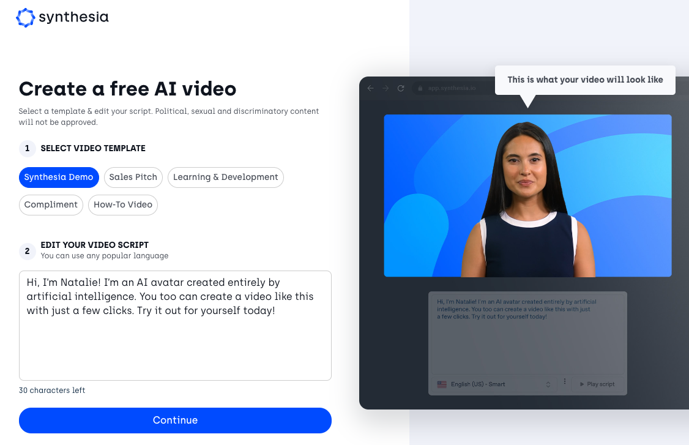 
- 付费模式
	- 测试免费
	- 个人、企业(更多功能) 	
- 优缺点
	- 优点
		- 免费 
		- 简单易上手
	- 缺点
		- ？ 

		
## 国内文生图
### 无界(工具类)
- 目标客户平面设计师 
- 新一代 AI 生图服务+传统版权设计
- 产品网站
	- AI
	
			https://www.wujieai.com/
			
		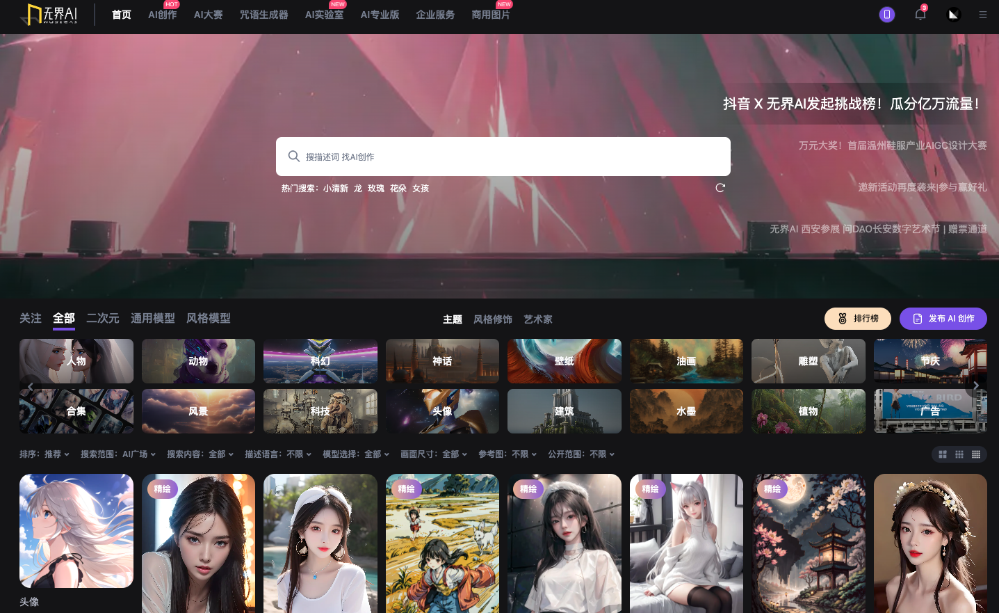 
	- 商用

			https://www.wujiebantu.com/
		
		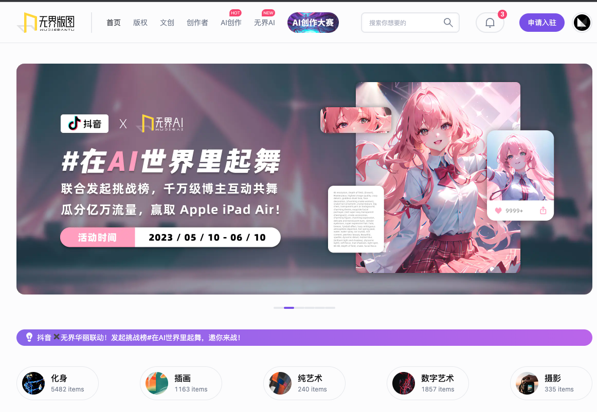 
 - 付费模式
	- AI
		- 专用服务器
			- 按照服务器配置
			- 按时间，时、天、周、月租赁
		- 生图按积分购买
	- 画
		- 按张收费   	
- 优缺点
	- 优点
		- 将生图简单化
		- 符合国内风格
	- 缺点
		- 它的功能不算多，可能无法满足专业设计师的需求。 但可以通过租用或者 API 解决
		- 出售市场需要法律保护，需要上传身份证
- 技术底层
	- Stable Diffusion
- AI 提供功能
	- [首页展示](https://www.wujieai.com/?l_1=%E4%BA%8C%E6%AC%A1%E5%85%83&l_2=0&themeid=&artistid=&modeltype=)
	- [生图](https://www.wujieai.com/ai)
	- [标签分类](https://www.wujieai.com/tag-generator)
	- [高级功能生图](https://www.wujieai.com/lab/openpose)
	- [企业API 对接](https://www.wujieai.com/enterprise-service)

	 
### 花瓣(工具类)
- 目标客户平面设计师 
- 传统平面设计素材网站转型，融合 AI 生图
- 产品网站

		https://huaban.com/
	同类型产品
		
		https://www.gaoding.com/	

	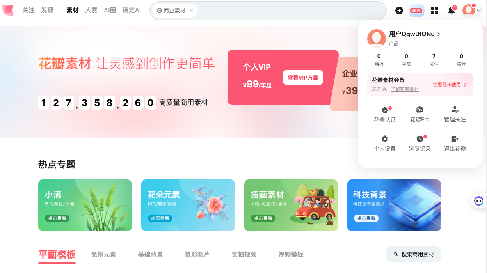 
 - 付费模式
	- 个人
		- 月、季、年
		- 每天下载量5-15 
	- 企业
		- 年、多年
		- 每天下载 10-50 	
- 优缺点
	- 优点 
		- 传统资源提供商 
		- 版权保证
		- 提供发票
		- 已有客户
- 技术底层
	- Stable Diffusion
- AI 提供功能
	- [圈展示](https://huaban.com/ai)
	- [生成结果展示](https://huaban.com/pins/5465159643)
		- 免费生成信息 
			- 提示词
			- 反提示词
			- 运行工具
				- Stable Diffusion
				- Midjourney
				- Lexica
				- DALL-E
			- 模型
			- 尺寸
			- 种子
			- 迭代数
			- 引导系数   

## 海外文生文
### reccap *** (工具类)
- 目标客户
	- 尽快获取视频信息的人
- 提供 AI 总结视频内容的能力
- 产品网站

		https://reccap.it/
		
	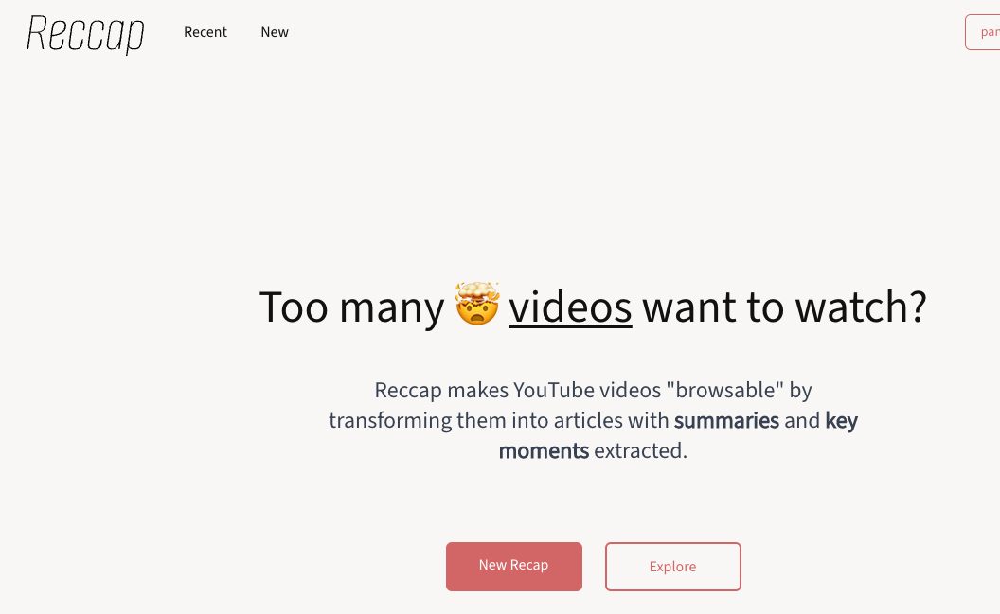 
- 付费模式
	- 免费体验
	- 月付费获取积分
- 优缺点
	- 简单直观 
- 底层技术
	- 音频识别？ 
	- GPT  			
 - 产品说明
 
### CognosysAI ****
- 目标客户
	- 想使用 AI 代理完成任务的人
- 提供 AI 个人助理
- 产品网站

		https://www.cognosys.ai
	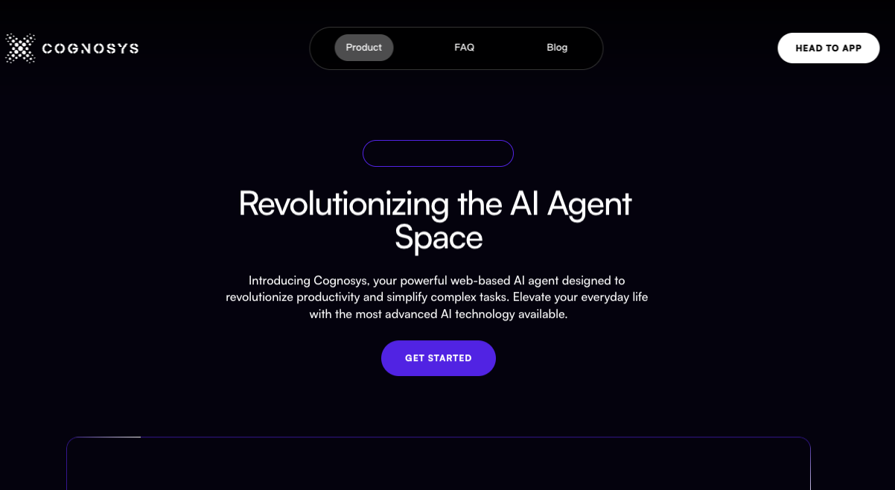 
	同类产品
	
		https://www.aomni.com/ 要付费	
		
- 付费模式
	- 暂时没找到付费的地方
- 优缺点
	- 待观察 
- 底层技术
	- GPT  			
 - 产品说明

	 CognosysAI是一家致力于简化复杂任务、提供卓越用户体验的创新型基于Web的AI代理服务提供商，旨在通过其独特的自有软件和受到babyAGI和autoGPT等突破性技术发展启发的创新代码库，为您提供个人助手服务，以轻松完成复杂任务。该服务目前处于测试版阶段，旨在通过创新的功能流水线，将生产力和效率提升到新的高度，从而改变AI工具空间，成为AI代理行业的无可争议的领导者。
	
	Cognosys致力于为客户提供无缝直观的用户体验，通过与社区保持沟通，提供Discord服务器以分享新闻、提供即将推出的功能的独家测试版访问权限，以及从用户那里获取有价值的反馈意见，来维护开放的沟通渠道。使用Cognosys非常简便，只需要输入目标、添加可选任务并获取结果，输出格式可以是格式化代码、表格或整理得井井有条的文本，并可以轻松复制或下载输出结果以进行进一步使用。
	
### HOTOKE AI ***
- 目标客户有缘人？
- 利用 LLM 模拟佛说话
- 产品网站

		https://hotoke.ai/
	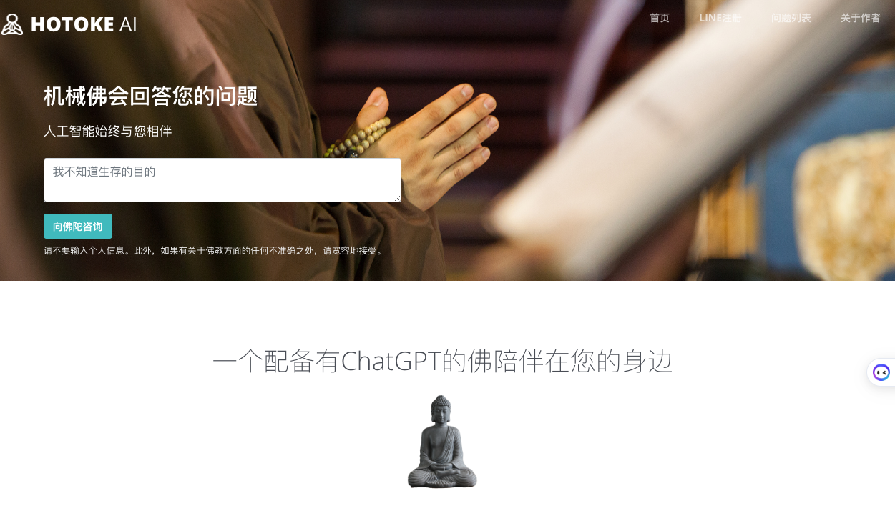 
- 付费模式
	- 免费	
- 优缺点
	- 优点 
		- 免费
		- 想法有意思
		- 有一定的社会价值
	- 缺点
		- 免费
		- 速度慢  
- 底层技术
	- GPT 
- 产品说明

	PromptPerfect 是一个提示词优化工具，旨在提升大型语言模型和大型模型结果的质量。要使用 PromptPerfect，用户输入提示词并根据需要自定义各种设置。这些设置包括最大提示词长度、要优化的迭代次数和输出质量。调整设置后，PromptPerfect 会立即生成优化的提示词。
	
## 国内文生文
### PMAI(工具类) ** 可以画流程图，需要进一步测试
- 产品经理、测试、程序员
- 利用 AI 写文档，PRD、SQL、流程图等等，加速使用者效率
- 产品网站

		https://www.pm-ai.cn/ 
		
	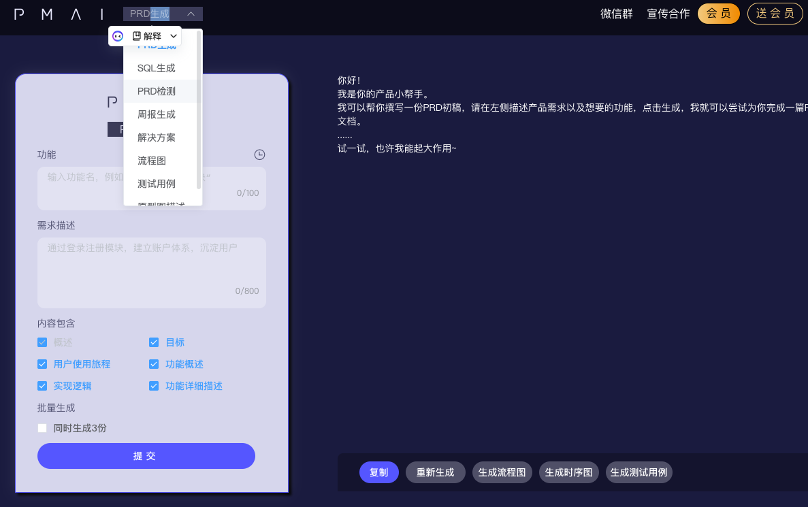 
- 付费模式
	- 会员制根据时间长短按月收费
- 优缺点
	- 优点 
		- 简单
- 底层技术
	- GPT类 

### Midjourney 学习导航 * 教学网站
- 想学习 Midjourney 绘图的用户 
- 整理的心得
- github 网站

		https://github.com/thinkingjimmy/Learning-Prompt
- book		
		
		https://learningprompt.wiki/docs/midjourney-learning-path

- 付费模式
	- 免费
- 优缺点
	- 免费
 		
### promptperfect
- 目标客户使用大模型的人
- 利用 LLM 优化提示词的优化工具
- 产品网站

		https://promptperfect.jinaai.cn/
	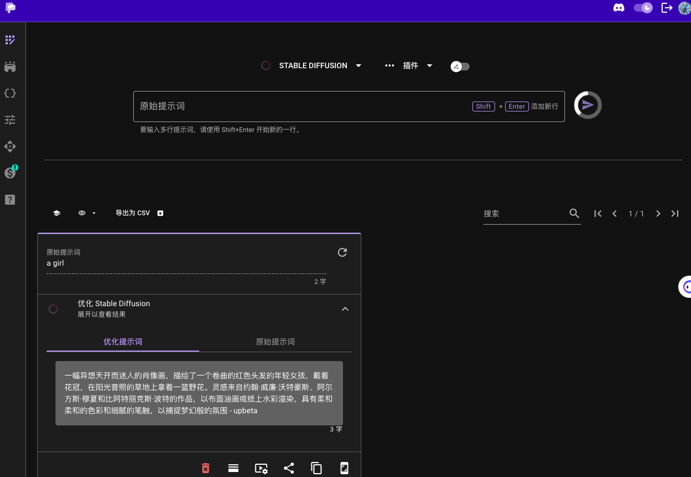 
- 付费模式
	- 3个订阅等级结合送积分 		
- 优缺点
	- 优点 
		- 集成模型多，包括文生文模型和文生图模型
		- 支持 API
- 底层技术
	- ?
- 产品说明

	PromptPerfect 是一个提示词优化工具，旨在提升大型语言模型和大型模型结果的质量。要使用 PromptPerfect，用户输入提示词并根据需要自定义各种设置。这些设置包括最大提示词长度、要优化的迭代次数和输出质量。调整设置后，PromptPerfect 会立即生成优化的提示词。	 
## AI 整合方案国外
### phygital.plus
- 想使用 AI 工作流的生成图像用户
- 整合了GPT + SD + 其他模型
- 产品网站
		
		https://phygital.plus/
	
	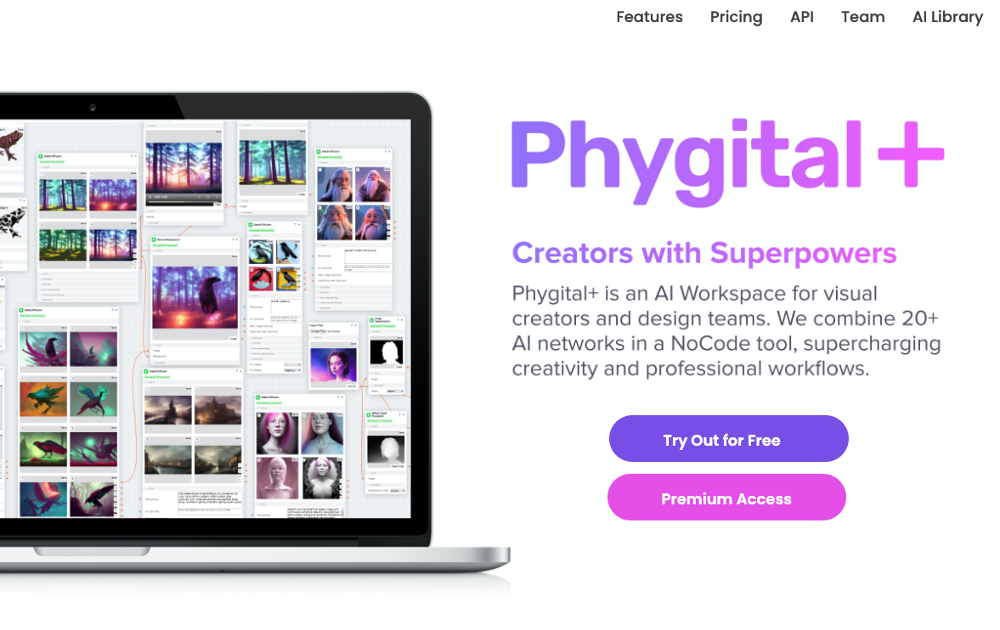 
	
	- 提供一个AI 工具博物馆 ******
	
			https://library.phygital.plus/
- 付费模式
	- 会员等级 		
- 优缺点
	- 优点 
		- 免费试用 
		- 简单
		- 集成了GPT 模版
	- 缺点
- 底层技术
	- GPT +SD
	
## AI 整合方案国内
### 智造喵(工具类)** 有开源
- 想使用图和文大模型的人
- 整合了GPT 3.5+4.0+SD 接口加上优化的用户提问上下文给出更精确的回答
	- [从正经指南开始看](https://github.com/PlexPt/awesome-chatgpt-prompts-zh) 
- 产品网站
	- 付费版
		
			https://chat.plexpt.com/
	- 开源版

			https://github.com/PlexPt/awesome-chatgpt-prompts-zh
	
	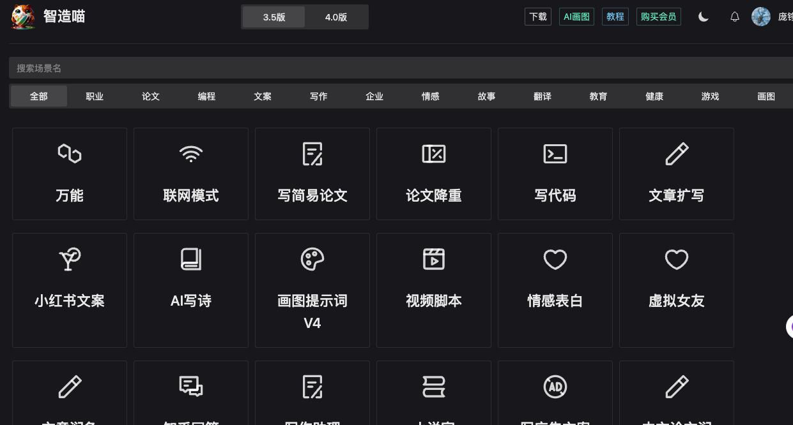 
- 付费模式
	- 会员等级 		
- 优缺点
	- 优点 
		- 简单
		- 集成了多模态模型
		- 集成了GPT 模版
	- 缺点
		- 有点贵
- 底层技术
	- GPT +SD
			
## 非大模型
### clipdrop.co ***
- 目标客户专业修图人员
- 使用 AI 扣图、修图、配光等小功能
- 产品网站

		https://clipdrop.co/
	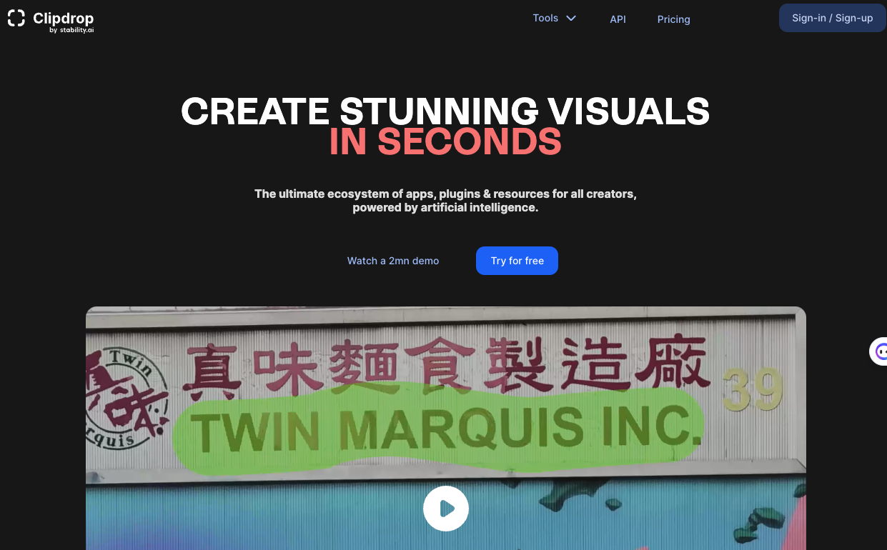 
- 付费模式
	- 2种模式按月付
	- API 单独付费	
- 优缺点
	- 优点 
		- 免费试用
		- API
		- 专业
		- 简便
		- 便宜
- 底层技术
	- ?
- 产品说明

### soundraw ****
- 目标客户专业设计师，需要配乐
- 使用 AI 生成配乐
- 产品网站

		https://soundraw.io/
	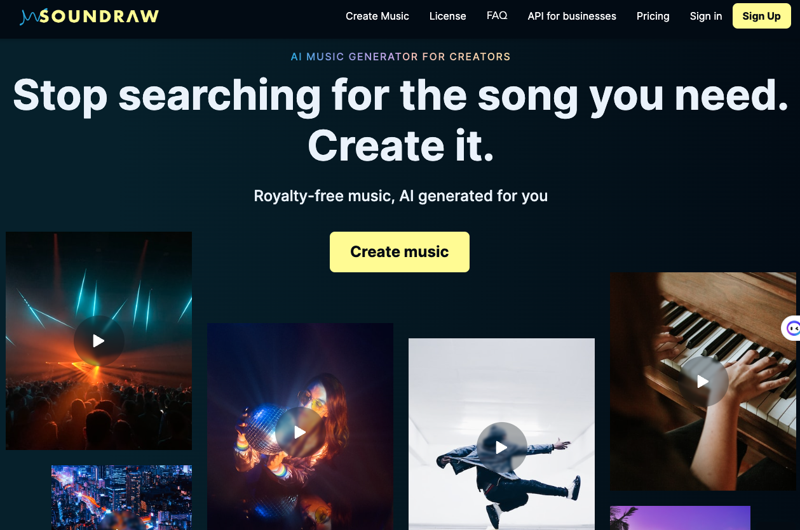 
- 付费模式
	- 3种模式按月付	
- 优缺点
	- 优点 
		- 免费试用
		- 演示配乐非常专业
- 底层技术
	- ?
- 产品说明

### murf.ai **
- 目标客户专业设计师，需要使用各种文字转阅读
- 使用 AI 文字转声音、声音克隆、变音等，支持多种语言
- 产品网站

		https://murf.ai/
	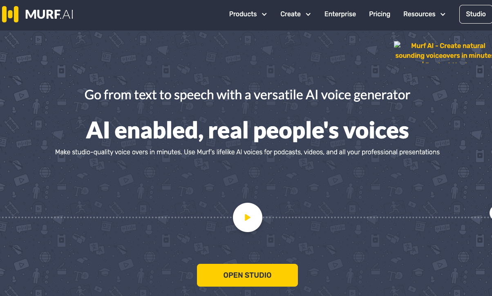 
- 付费模式
	- 按月付费
	- 分4种不同级别	
- 优缺点
	- 优点 
		- 免费试用
		- 演示声音非常专业
- 底层技术
	- ?
- 产品说明

### lalal.ai **
- 目标客户专业设计师，需要使用各种文字转阅读
- 使用 AI 从任何音频里拆分或者清洁一种声音
- 产品网站

		https://www.lalal.ai/
		
	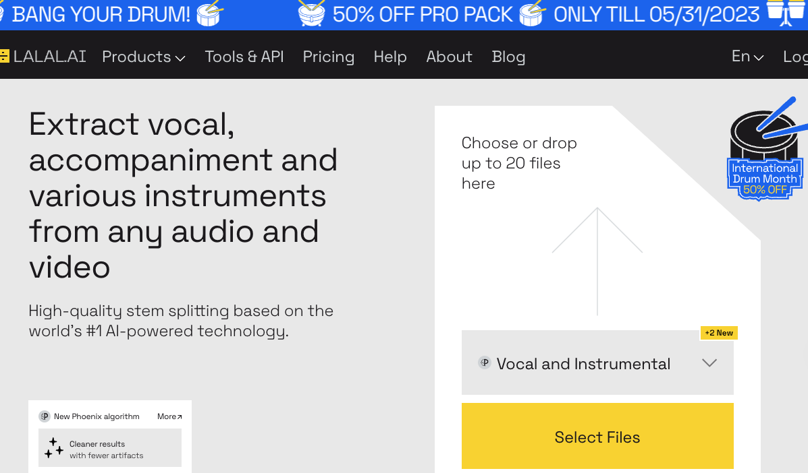 
- 付费模式
	- 按处理分钟收费
- 优缺点
	- 优点 
		- 各种插件即成
		- API 集成
- 底层技术
	- ?
- 产品说明

### cascadeur 
- 目标客户
	- 专业的制作视频和动画渲染工作人员
- 提供 AI 辅助动画角色动作调节
- 产品网站

		https://cascadeur.com/
		
	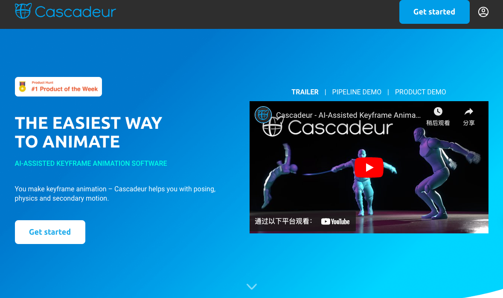 
- 付费模式
- 优缺点
	- 纸娃娃的工作非常容易生成
- 底层技术
 - 产品说明

### wonderdynamics
- 目标客户导演？
- AI VFX和CGI动画 工具
- Wonder Dynamics 是一家新的媒体技术初创公司
- 公司网站

		https://wonderdynamics.com/#features
	
	 
	
- 简介

	Wonder Dynamics是一家新的媒体技术初创公司，由演员Tye Sheridan和视觉效果艺术家Nikola Todorovic共同创立。该公司使用人工智能和机器学习技术，开发出一款新的AI生产工具，旨在让独立艺术家能够以远低于现有成本的价格制作出高水平的VFX和CGI动画。该工具能够显著降低VFX艺术家创作CG角色等视觉效果所需的步骤和工作量。
	
	Wonder Dynamics的顾问委员会包括斯皮尔伯格（Steven Spielberg）、乔·卢索（Joe Russo）、Terry Dougas、Joshua Baer、Angjoo Kanazawa、Antonio Torralba和Robert Schwab等好莱坞和科技领域的名人。
	
	该公司已推出两款产品：Wallace Interactive和Wallace PROduction。前者是一项专利技术，让观众可以与电视节目或电影中的角色进行AI对话；后者可以加速和降低创作视觉效果的成本。
		
### getmunch
- 视频网红、主播
- 主要功能
	- 长视频利用 AI 生成短视频
	- 自动剪切功
	- 人工智能字幕
	- 关键词分析
	- 用集成工具进行各平台分发
	- 数据统计
	- ...
- 产品网站
	
		https://app.getmunch.com/
		
	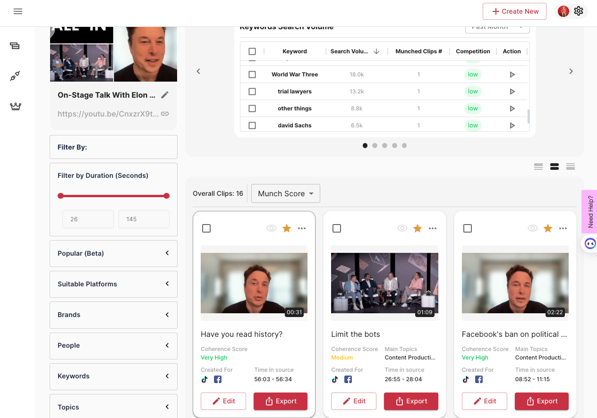 
	同类型
	
		https://zubtitle.com/
- 付费模式
	- 根据上传视频分钟收费
	- 按月份3个等级 		
- 优缺点
	- ？
- 底层技术
	- ?
- 产品说明

	AI提取视频中的最引人入胜、最流行和最有影响力的片段
