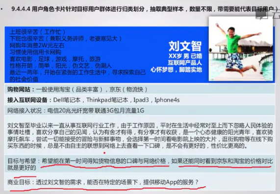
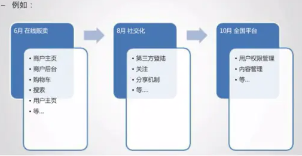

# 市场需求MRD文档
## 目的
MRD就是经过一系列分析后，拿出一套最合理的干某件事的方法和指导实时文档。
## MRD 的汇报对象
- 各个层次的人都会阅读
- 是产品的衍生文档、产品依据、团队判断的参考依据
- 参与人员需要了解产品的各种背景、数据、方法依据

## MRD 文档内容
- 文档说明
	- 文档基本信息

		公司名称、产品名称、文档创建日期、创建人、创建人联系方式、部门、职务
	- 文档修改记录

		日期、版本、修改人、修改内容、审核人
	- 文档目的

		用于说明相关市场、用户、产品规划、核心目标、产品思路图、项目规划等
	- 文档概要
		- 文档说明
		- 市场说明
		- 用户说明
		- 产品说明
- 市场分析
	- 摘要（可选）
	- 描述现有市场存在的问题与机会（可以用sowt分析）
		
		例如互联网分析：
		
		- 产品方法（产品形态复杂、用户体验差）
		- 技术方面（语言压缩技术不成熟，外资搜索引擎中文理解不够深刻）
		- 运营方面（产业链偏下游，重实体，造成瓜分线下旅行社利润，形成对立）
		- 用户方面（用户需要可替代的产品尚未出现，需求明显）
		- 商业模式方面（金山毒霸和360安全卫士对比）

	- 目标市场分析（基于该机会点下的市场分析说明）
		- 市场规模（多少钱，成功的可能性大不大，往往是正比）
		- 市场特性（现有市场表现出来的典型特征）
		- 发展趋势（未来2-5年的发展评测，搜索市场的语言搜索，体感携带设备）
		- 时间边界（这个市场的持续时间预估）
- 用户分析
	- 目标用户群体

		一般维度：年龄段、收入、学历、地区
	- 目标用户特征

		这个群体的共性特征与非共性特征分析
	- 建立虚拟用户角色（形象化）
		- 用户特征：年龄、性别、出生日期、收入、职业、居住地、兴趣爱好、性格特征
		- 用户名称：张三、李四、王五
		- 用户技能：熟练电脑办公、熟练使用app
	- 相关产品特征：
		- 电子商务类： 购物习惯、年度消费预算
		- 交友类：是否单身 择偶标准
		- 游戏类： 是否喜爱3D游戏 是否有同类游戏经验

	
	
- 用户地图
	- 将典型用户卡片放到实际的使用场景中去。（演示场景）
	- 时间+地点+人物+做了什么事
- 用户动机总结（读懂表象）

	线下的在线商品比较与查询渠道
- 用户目标总结（明确实质）

	获得性价比高的购物体验
- 影响用户使用的主要因素（重要，分析）
	- 是否随时携带接入设备
	- 网络是否顺畅
	- 查询速度
	- 设备对商品信息的获取是否会对用户造成不便
- 产品说明
	- 产品定位（一定时间内的刚性要求）

		说明：产品可能越来越复杂，但是一定时间内，定位决定了产品的一切
	- 产品定位与市场定位：
		- 市场定位：我们对用户或者用户市场的选择，例如白领或者移动通讯设备市场
		- 产品定位：我们用什么样的产品满足用户或用户市场
		- 例如	
			- 陌陌：基于地理位置的移动社交工具
			- qq空间：一个异步信息分享和交流的平台
			- 用户定位的描述：针对什么目标群体，作什么事情，最本质，无修饰的语言表述
		- 产品核心目标（产品本身要达到什么一个目标）
			- 互联网产品核心更多是解决目标市场（目标用户）一个具体问题
			- 问题分析的越透彻，产品核心目标越准确
			- 确定好核心目标，避免在茶产品迭代中迷失
			- 例如
				- 360安全卫士解决用户使用电脑的安全问题。
				- 微信核心目标是为用户提供流畅语言沟通的移动应用
- 产品结构（注意，不是功能结构，是产品的整体结构）

	产品的市场定位，产品定位，核心目标的直接表现
- 产品结构与功能结构区别（例子如下）
	- 产品结构：为了让客人吃的舒服的同时又完成我们的核心目标，我们需要哪菜品，事先规划
		- 凉菜：夫妻肺片
		- ​热菜：红烧热
		- 主菜：宫保鸡丁
	- 功能结构：如何实现上述各种菜品
		- 加热：热菜
		- 爆炒：主菜、热菜
		- 材料：肺片
		- 人员：厨师
	- 产品结构说明的注意事项
		- 不需要扣细节，产品表述到位即可
		- 可配合 流程图 和 简单的页面线框图
- 产品路线图

	产品路线图是产品成长过程中每个任务节点组合而成，一任务为导向的时间节点图

	
- 产品功能性需求

	在线留言板举例：

	- 注册与登陆：直接注册、第三方注册，直接登陆、第三方登陆
	- 交流：留言、回复、图片上传、文字发布
	- 管理：查看、删除、修改
- 产品非功能性需求
	- 有效性需求：功能有效率一般要求99.5%
	- 性能需求：并发数1000时响应速度、容错率多少
	- 扩展性需求：预留可扩展功能
	- 安全性需求
	- 健壮性需求：不会出现崩溃的情况
	- 兼容性需求：兼容不同的浏览器、移动系统等
	- 可用性需求
	- 运营需求
	- 用户体验需求
- 优秀 MRD 的特点
	- 逻辑性强：有论点，有论据，有论证
	- 把抽象的东西形象化的讲出来
	- 数据可靠，分析有理
	- 有把握的主观、无把握的客观
	- 惜字如金，能把问题表述清除、绝不多一个字
	- 合理的产品进度分配有利于研发人员工作
	- 重视非功能需求
	- 如果方案中出现很多专业名词，记得在文章的开通呈现给读者者一个名字解释表
- MRD 撰写建议
	- MRD文档不是套模板，而是要把事情和想法说清楚
	- 简洁明了、言简意赅
	- MRD文档需要较多的分析与论证，撰写时间建议不要过短