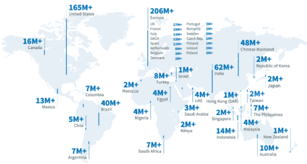
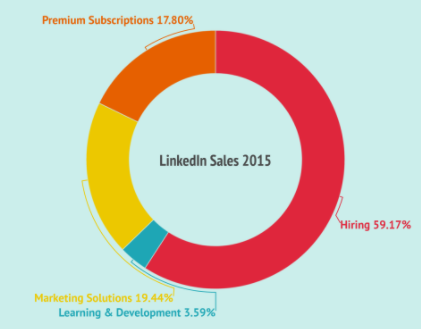
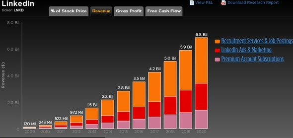
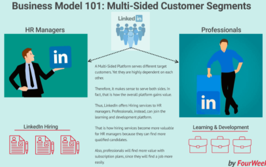
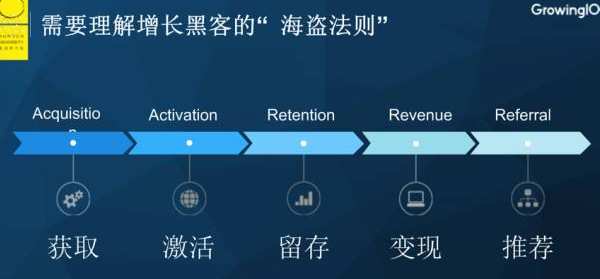
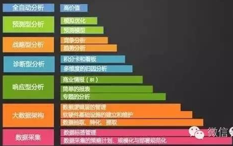

# Linkedin 商业价值分析
## 简介
LinkedIn 既不是 Facebook 那样的通用社交网络，也不是智联招聘那样的招聘门户网站，它是针对专业人士的职场社交平台，结合了这两者的优点。用户可以通过发送请求与 LinkedIn 上的其他专业人士联系，其他人（包括企业）可以通过用户的个人资料看到他的工作经历、工作技能和经验以及对工作的愿景和目标；用户可以通过 LinkedIn Pulse 了解专业信息，并发布自己的专业见解，由此建立个人品牌。另外 LinkedIn 还拥有超过900万家公司提供的数百万个工作岗位，可以供专业人士们选择。

LinkedIn 的独特之处在于人们使用它时抱着更加明确的目的，它使用户们拥有更成功的职业生涯，过上更好的生活，商业模式之所以优于其他社交网络平台，是因为它有更清晰的收入模式，并且不完全依赖于广告。

LinkedIn 是一个在免费增值上运行双面性的平台模型，高级功能如解锁无限搜索等功能，需要切换到付费账号。

- 商业价值
	- 微软收购价格 27 亿美元
	- 2017年收入 2.3 亿美元，2018年收入 5.2 亿美元，主要收入来自 linkedin 的人才解决方案
	- 拥有6.6亿用户,200 个国家

	
- 创始人
	- paypal 创造的职场社交网络
	- 收购后的一句话，我们将创造领先的专业云和世界领先的专业人士融合的网络
- 理念

	所有商业模式，最终要让效率更高，人与人之间的关系是产生社会价值最重要的原则，这个认知的基础上买了六度人脉的专利，成为领英发展的理念基石
	
	终生效忠于一家公司已经成为历史”，既然现实这么残酷，那么我们作为用人单位，怎么样更好的招人和留人呢
	
	- 三个任期制(轮转期、转变期、基础期)

		不同时期公司和员工制定不同的目标，到期前考核目标完成度并考虑是否续，如果续，则制定下一个时期的目标。双方的目标设定是建立在充分信任和公平的基础上，因此理论上不存在领导给个不靠谱的KPI指标，员工边做边怨，到期不达标被开除或者主动辞
		
		当然这种方法对领导的综合要求特别高，在制定任期的目标时，既要满足员工的述求，同时也要保证公司的目标能完成。
	- 公司员工联络网

		既然终身制不可能，那么早晚有离开的一天。天下没有不散的筵席，但是不能人走茶凉！公司应该主动投资运营同事联络网（类似大学的同学会），书中就前员工联盟（或者说联络网）举了PayPal、宝洁公司、 LinkedIn 公司的例子。
	- 员工本身建立连接、形成联盟的好处
		- 前员工有可能回来，或者前员工会推荐优秀的员工加入公司，如此可以大幅度节约招聘成本
		- 现任员工遇到问题，可以快速找到靠谱的前员工进行求助
		- 形成口碑效应，大家都说这个公司好，那么招聘的时候就更有吸引力了！

## 如何赚钱
LinkedIn 的主要发展工具是它的免费增值模型. 作为职场社交网络, 任何人都可以加入平台从而使其病毒式传播发展。而它的成功取决于3点

- 基于人们通过专业的社交网络将他们自己作为品牌进行管理，从而帮助招牌人员方便快速的找到对应岗位的人来弥补空缺。
- 它还有一个与教育和技能发展有关的平台
- 最后它还提供机会，通过付费广告活动赞助平台部分的产品或服务

### linkedin 商业模式围绕四个支柱
- 人才解决方案
	- 宣传
	
		招聘、学习和发展的产品，通过提供创新招牌工具，帮助客户在人才招聘和专业发展取得更大成功。
	
		- 招聘产品宗旨在为企业和专业组织有效识别和获取适合其需求的人才的最有效的方式。
		- 在线教育的宗旨在让专业的人士更容易的通过学习新技能来加速他们的直接生涯并发挥他们的潜力
	- 人才解决方案拆解分析
		- 招聘

			它分解了流程，允许企业和专业组织根据三个主要特征寻找、联系和雇用高素质的被动和主动候选人 
			
			- 高级搜索

				通过搜索引擎可以找到包含该专业人士的任何专业资料，通过网络对搜索应用过滤器
			- 邮件服务

				允许用户向网络上的任何人发送消息的服务
			- 人才管道管理

				一种供招聘人员使用的仪表板，可将他们所有潜在的客户集中一起
			
			在招聘过程中，还有其他功能和产品，例如推荐、职位空缺、职位发布等。 这是首要的《商业模式》订阅。
- 学习与发展

	LinkedIn 花了 1.5亿美元购买了一个在线学习公司，并将其整合到自己的产品中，作为专业人士的学习和发展平台。订阅会员可以访问数以千计的专业课程。商业模式也是基于订阅。
- 营销解决方案

	营销解决方案是利用其会员的用户群，让其他企业宣传他们的产品或服务的地方，允许公司向会员群做广告。该领域有六种产品
	
	- 赞助更新
	- 广告
	- 赞助的 inmail
	- 展示广告
	- 广告 api
	- 提升
- 高级订阅

	LinkedIn 的付费高级账户允许用户解锁免费用户无法使用的某些功能，满足他们更加个性化的需求。这些功能包括职业解决方案、求职解决方案、销售解决方案、招聘解决方案。使专业人士能够管理他们的品牌推广，在高级订阅中，可以访问设置广告功能，如 inmail 消息。所以，即使 linkedin 的主要商业模型是基于订阅的，但职业社交网络的一部分影响力来源于这些需要投放广告的企业对会员群体的影响力。

#### 2016 年提供的四个领域收入占比

- 人才解决方案 59.17%
- 学习与发展 3.59%
- 营销解决方案 19.44%
- 高级订阅 17.8%

#### 2009-2020年增长曲线

## 提供什么价值
### 为用户提供的价值
- 企业
	- 提供将所有符合条件的人集中在一起，并快速定位该人是否符合初筛的能力
	- 提供广告价值
- 职场人
	- 被招聘的机会
	- 新的培训学习、发展的机会 

事实上，一个关键的方面之一商业模型客户群是你的组织供应。 简而言之，您向谁销售您的产品或服务。虽然 LinkedIn 服务的目标客户不同。 他们彼此高度依赖。

关于商业模型，LinkedIn 可以定义为多面平台.  事实上，LinkedIn 的整体价值通过

- 为需要合格候选人的人力资源经理提供服务，这将帮助找到合格的候选人。
-  和寻找职业机会的专业人士服务
- 通过学习与发展平台让更多的会员获得更多的资格，这样随时合格的人才可以提供给招聘人事选择 ，形成闭环 

	

### 为 linkedin 提供的价值
生产收入来自两个模式

- 订阅
	
	基于招聘、学习和发展
- 广告

	营销解决方案
			 
## 何时何地创建类 linkedin 样的平台
### 大数据
- 关注用户体验

	运营过程中会产生大量的数据
- 关注运营数据

	通过运营数据分析，找到业绩和收入增长点
- 关注变现

	基于变现的需求，进一步推升用户体验
	
	领英背后是一个非常大的精细化数据运营平台，这个平台在驱动着领英的发展；数据分析的基本原则：数据收集过程中一定会产生杂音和失真，最终的结果不能 100% 的反映业务的过程，所以这就需要有业务经验与业务直觉的人来做判断；数据可以不准，但需要具有可持续性，不能一会准一会不准，这样就不具有可分析性。

### 马太效应
互联网马太效应明显，前20%的应用占据 71%的用户。所以创公司需要跑的更快、更有效率、商业模式更好。在美国来说，目前其整体的用户增长已经在个位数上，“流量为王”的世界中看的是增量世界，但现在所有的竞争都是基于存量市场的竞争，那就是比拼速度和效率。

在存量的竞争过程中，所有的商业模式都需要回归“用户为王”，以用户为核心，以产品为表现，以数据运营为指南针，在存量世界中“拧毛巾”，最终实现做的效率更高。

### 增长效应
增长是王道！如果一家公司全员都要关注的话，那应该是什么事情呢？是增长！为什么要关注增长呢，主要有三个因素：

- 估值，只有快速的增长才能保证市场表现；
- 只有增长才能持续为越来越多的客户提供优质服务；
- 社会需要企业持续增长创造社会价值。
		
### 客户探索
- 客户探索
- 客户检验
	- 如果检验不成功，返回第一步 
- 客户培养
- 组建公司

客户发展方法中客户探索流程的四步走

- 第一步，提出假设
- 第二步，验证假设
- 第三步，检验有关产品假设
- 第四步，阶段小结

### 用户增长，海盗法则

数据是一种连接。它连接4个最基本的象限

- 时间
- 地点
- 任务
- 事件

美国数据分析框架和方法论：在美国，已经形成了非常系统的数据分析方法论。

 