# Shopify 2021 商业分析
## 基础统计
- 2017年渗透率：一个国家中通过网络购买商品或服务的人口在总人口中所占比例

	
- 2018-2022年复合年增长率最高的6个市场

	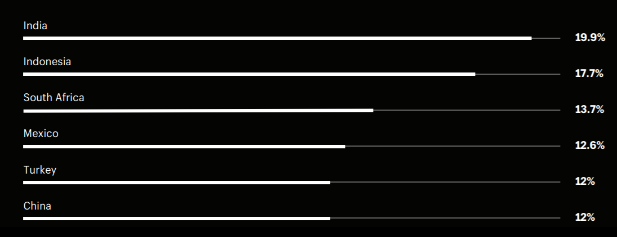
- 2018 年各国网络购物用户数量及每用户收入

	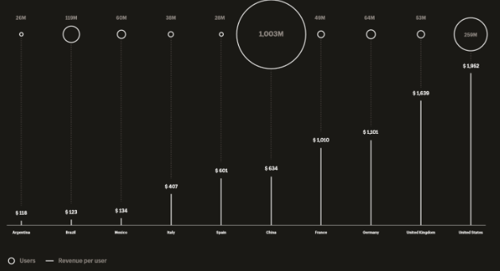		
## 融资历史
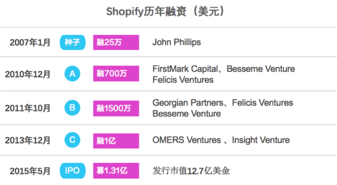
## 2021 北美电商 GMV(Gross Merchandise Volume)  占比分析
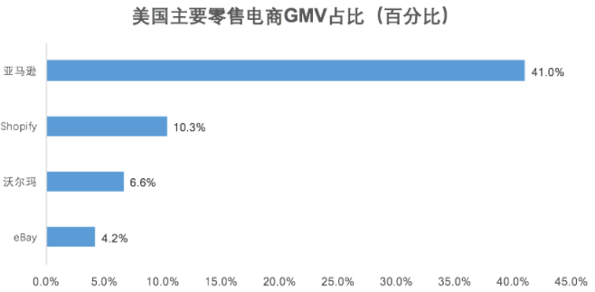
## 用户合作伙伴员工数量统计
商家可使用 Shopify 仪表板（有21种语言）来

- 管理产品
- 库存
- 处理订单
- 付款
- 完成
- 发货订单
- 发现新买家并建立客户关系
- 采购产品
- 利用分析
- 报告管理现金
- 支付
- 交易及获得融资。

前端销售渠道覆盖网店、实体零售店、快闪店、社交媒体、本地移动应用程序、购买按钮等，超过三分之二 Shopify 商家已安装两个或更多销售渠道

截至 2021 年底，Shopify平台有来自175个国家的206万商户，超过10000名全球员工和承包商，40000多家合作伙伴，Shopify应用商店有8000多个应用程序。

从单一建站工具起家，经过十几年的发展，Shopify已构建了一个围绕服务商家电商业务提供各种工具的SaaS生态。但自建Shop和SFN后，Shopify开始走向前端，直接触达消费者，从服务2B商家走向满足消费者体验。

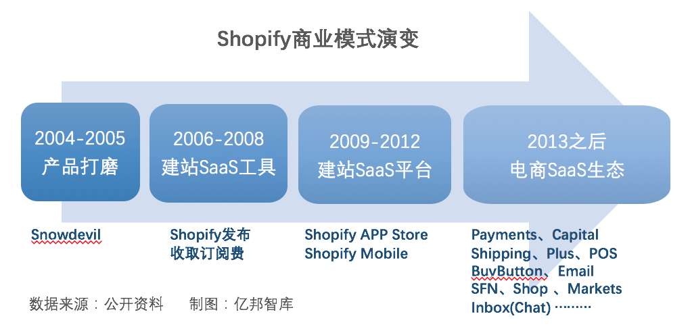

- 商业模式

	“商业模式”一词是指一家公司实现盈利运营并为顾客提供价格的核心框架。
	
	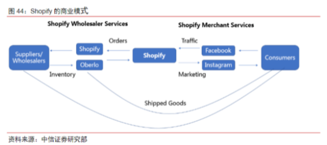

## 收入分析
Shopify收入来自订阅解决方案和商家解决方案。

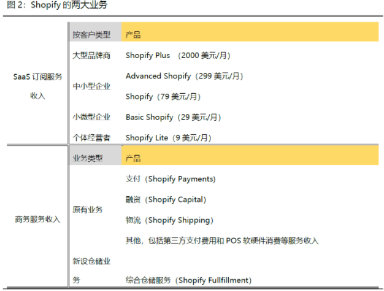

- 订阅解决方案- 应用市场收入在这里

	包括SaaS建站软件订阅、POS Pro产品订阅、个性化店铺主题销售、应用程序销售和域名注册等。
	
	2021年, Shopify 订阅解决方案收入为 13.4 亿美元，同比增长 48%，占营业收入的 29.1%。

	订阅解决方案有两类收费模式。
	
	- 针对中小商户软件使用价格有三个级别，分别为29美元/月、79美元/月和299美元/月，不同价格对应不同运费折扣、支付费率、账户数量及礼品卡、报告等功能模块。
	- 针对中大型商户，2015年推出的Shopify Plus，最低价格约为2000美元或每月销量的0.25％（上限为40000美元），以较高者为准。相比基础版软件，Shopify Plus可以提供Shopify Flow、Launchpad等额外可扩展的功能和支持，客户有亨氏特百惠、FTD、网飞等。最新数据显示，Shopify中大型商户已超 10000 家。
- 商家解决方案

	是Shopify为商家提供的支付、物流、营销、融资等电商增值服务，收费方式为从商家交易额中提取一定比例服务费。

	2021年，Shopify商家解决方案收入32.695亿美元，同比增长61.8%，占营业收入的70.9%。主要包括来自 
	
	- Shopify Payments 的支付处理费和货币转换费
	- Shopify 应用商店的广告收入
	- Shopify Capital
	- Shopify Balance
	- Shopify Shipping
	- SFN
	- Shopify Email
	- Shopify Markets 
	- 等服务带来的收入。

据了解，Shopify商家解决方案的大部分收入来自支付手续费。2021年，通过Shopify支付促成的交易总额达858亿美元，渗透率为48.9%。2021年底，Shopify Payments在商家中的使用情况为：加拿大 92%；美国88%；可用的其他国家84%。

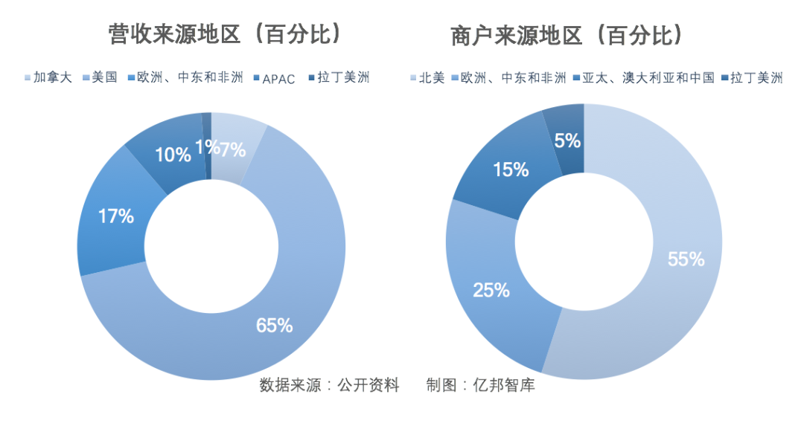

截止2021年末，Shopify平台有206万商户，来自175个国家和地区。

- 北美仍是其第一大收入和商户来源，55% 的商户贡献了 72% 的营收
	- 来自美国的收入占比65%，位居第一；
	- 欧洲第二，占比 17%；
	- 亚太地区收入快速增长，跃居第三，占比10%；
	- 公司所在地加拿大占比7%。
- 业绩分析
	- 2020年实现营收29.29亿美元，同比增长85.6%；净利润3.2亿美元，成立以来首次为正。
	- 2021年，实现营收46.12亿美元，同比增长57.4%；实现净利润29.15亿美元。

	股价则从2020年3月的低点346美元/股涨到最高1762.92美元/股，总市值最高达2220亿美元。

	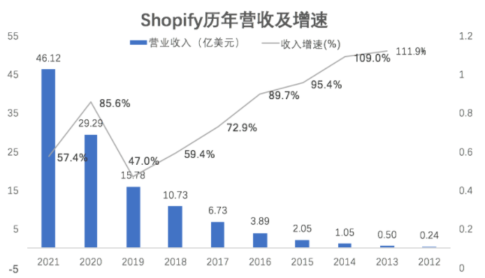
	
	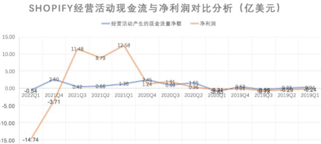
	
	2021年Shopify净利润突然大幅增长，源于投资的Affirm和Global-E两家企业上市后股价大涨，带来收益约28.598亿美元，非经营业绩带来的利润
	
	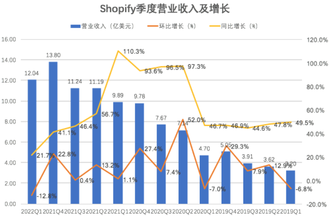
	
	2022年一季度Shopify实现营收12亿美元，环比下降12.78%；同比增长22%，增速较疫情前下降超一半。疫情前，2019年连续四个季度，Shopify营收增速均在40%以上。
	
	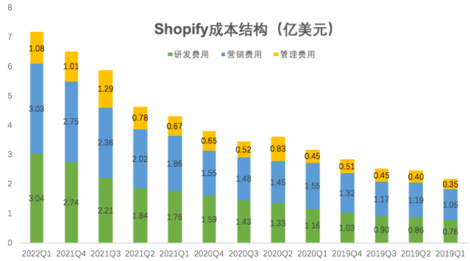
	
	Shopify2022年一季度净利润大幅亏损14.74亿美元，主要由于营收下降，但研发费用、营销费用和管理费用惯性增长，导致净利润变差。
	
	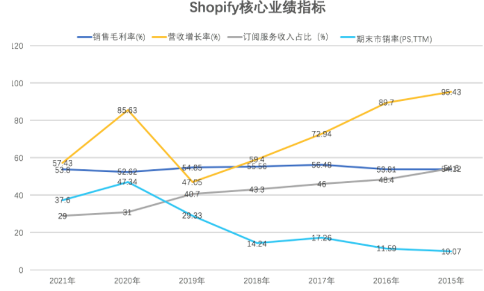
	
	Shopify的毛利率近几年维持在54%左右，SaaS老大哥Salesforce近十年的毛利率维持在70%以上，后起之秀BigCommerce近几年的毛利率也在70%以上。
	
	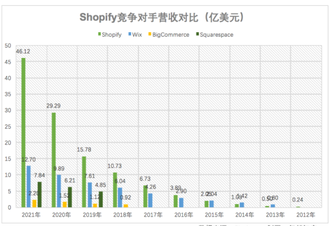
	
	对比目前上市的四家企业，Shopify营收远远领先一众竞争对手。
	
	- 2021年Shopify实现营收46.12亿美元
	- Wix实现营收12.7亿美元
	- 第三名Squarespace实现营收7.84亿美元。

	Shopify营收是第二名Wix的的3.6倍，是第三名Squarespace的5.88倍。

## 第三方服务信息
Shopify利用丰富的官方与第三方APP提供拓展工具（目前已经超过1800种拓展程序，累积700万次下载安装）

- 抽成比例

	它与开发者共享应用程序收入的80％，而苹果的收入则为70％，也赢得了大量的开发者入驻。
	
## 成功关键点
理解 Shopify 的几个关键点

- 1、初期瞄准中小个体商户建站开店需求，用个性化、简单好用、便宜的产品跑通了SaaS模式（Shopify 早期收费只有25美元/月）；
- 2、抓住了移动互联网浪潮，很早开始打通线上线下。2013年发布Shopify POS，2014年发布Shopify Mobile，通过硬件+软件的方式打通线上线下，使商家在移动端可以线上线下一体化的经营管理店铺；
- 3、很长时间内坚持开放合作战略。
	- 2009年上线的应用商店可以让开发者围绕商家开发个性化的应用产品；
	- 与Facebook、Instagram、Twitter、TikTok等流量巨头均形成了战略伙伴关系，通过BuyButton工具让商家在这些流量平台直接实现销售；
	- 与亚马逊甚至一度保持亲密的战略伙伴关系，让亚马逊心甘情愿拱手相让了一波商户。
- 4、围绕商户开店需求构建了一个极为丰富的工具生态，上线了十多个工具产品，帮助商家扩大销售的同时，从商家交易GMV中获得分成，带来商家服务收入的快速增长。
- 5、由于诞生于加拿大，Shopify 很早就开始全球化发展。除北美市场，进入了欧洲、中东、非洲、拉丁美洲、亚太等地区，已覆盖175个国家。Shopify Markets工具可以提供货币转换、商店内容翻译及关税、税款计算等，帮助商户开展跨境电商业务。作为SaaS工具服务商，横向扩张是Shopify营收增长的强劲动力。
- 6、自建物流（SFN）和流量平台（SHOP）是Shopify做深电商服务价值，提升GMV货币化率的核心战略，但与其原有的流量和第三方仓储物流战略合作伙伴直接形成了竞争关系。

## 参考
- [股价暴跌80%后，Shopify的模式演进和突围](https://www.techshidai.com/article-140397.html)
- [《全球电商白皮书》](https://www.ikjzd.com/articles/91054)
- [《Facebook X Shopify跨境电商白皮书》](https://www.sohu.com/a/323447511_115514)
- [2022 Shopify 收入、统计和使用数字](https://ecommerce-platforms.com/zh-CN/articles/shopify-revenue)
	
	
	
	
