# Shopify 最好的电子商务平台？ Shopify 利与弊
## 客户眼中的 shopify 
- 最适合刚开始开设在线商店的公司的电子商务平台
- Shopify 充满了在几分钟内启动网站的工具，而且您不必担心自托管或从第三方购买域名。 在这方面，人们可以称其为完美的开箱即用解决方案，构建于 定价计划 这适用于小型原型商店以及带来数百万美元销售额的商店。

## 什么是 shopify
Shopify 是

- Shopify 成立于2006年 由 TobiasLütke（加拿大年度首席执行官），Scott Lake 和 Daniel Weinand 共同创建。
- 该公司目前为超过 1,750,000 家在线零售商提供支持（2021 年 XNUMX 月）
- 在市场上保持了十多年的网络上最受欢迎的电子商务平台之一
- 它的主要优点是 Shopify 在易用性和功能性之间实现了很好的平衡
-  Shopify 即使对于没有操作过电子商务商店的初学者非常友好 
- 它提供了企业所有者可能需要的所有无代码功能。 
- 而更高级的用户可以访问 CSS 和 HTML 文件，并且可以升级他们的 Shopify 计划随着商店的增长而获得更强大的功能。
- 而它最受欢迎的付款方案是 $ 29 /月及有14天的免费试用期.
- 还可以建立一个 dropshipping  [代发货模式](https://www.shopify.com/zh/blog/what-is-dropshipping) 操作。

注册后将可以访问构建和管理软件所需的全部工具集。 电子商务网站. Shopify 使您可以自定义设计，创建产品目录，设置价格，付款方式，税金，甚至可以通过可安装的扩展程序添加其他功能。

Shopify 几乎可以卖任何东西

- 实物产品/可运输商品
- 数字产品
- 服务

## 它的客户
知名品牌使用 Shopify 包括： 

- 通用电气
- Amnesty International
- 特斯拉汽车
- 大英百科全书
- Foo Fighters
- GitHub 
- 等等

## Shopify 的优缺点
### 优点
- 对技术
	- Shopify 很好用并且不需要用户的任何技术技能。
	- Shopify 准备好应对用户可能遇到的任何问题。 您可以出售可运送的商品，数字产品，服务等。
	- Shopify 为您提供适用于 iOS 和 Android 的移动应用程序 – 因此您可以随时随地管理自己的商店。
	- 无需交易费的 Shopify Payments – Shopify 自己的付款处理模块.
	- 有超过2000个应用程序和 plugins 中可用 Shopify App Store。 这意味着您将能够集成您的 Shopify 存储着无数的第三方服务，还可以单击按钮添加新功能。
	- 有一个14天的免费试用版。
- 对营销
	- 如果您要做的就是在社交媒体上销售产品，例如 Facebook，Instagram 或 Pinterest，那么您可以用便宜的价格做到这一点 Shopify Starter 计划在 5 美元每月
	- 您可以通过多种渠道销售产品，而不仅仅是通过在线商店。 Shopify 甚至还可以将其系统集成到现有的实体店面中。
	- Shopify 为您提供多种商店设计选择。 它们看起来都很现代，漂亮，并且经过优化可以最大化销量。
- 对运营
	- Shopify 完全托管。 您完全不必担心任何与服务器相关的问题或任何维护。
	- 有 24/7 的客户支持。
	- Shopify 有很好的缩放能力，这意味着无论您的商店大小如何， Shopify 将能够处理.
	- 如果您恰巧在销售可运输的商品，它还有出色的库管模块。
	- 支持良好的 dropshipping [代发货模式](https://www.shopify.com/zh/blog/what-is-dropshipping).

### 缺点
- 基础
	- 您无法完全控制商店。 您的商店托管在拥有的服务器上 Shopify。 这意味着，如果他们在任何时候决定关闭您的商店，他们都可以。 如果您不违反任何许可协议，则可能不会发生。
- 收费问题解决方案
	- 如果您希望客户能够留下您产品的评论和评分，则可以通过扩展程序额外付费获得这些功能。
	- 专业报告仅在更高 Shopify 计划 级别上可用 .
	- 如果您不使用信用卡，则需支付高于标准信用卡处理费率的额外付款处理费 Shopify 自己的付款模块.
- 技术 
	- 博客模块，即使有，也没有最友好的用户界面，您可能会发现定期创建美观的博客内容具有挑战性。

##  Shopify 定价
Shopify 起初定价可能会有点混乱.要知道的主要事情是，有两个因素加起来 Shopify 法案：

 - Shopify 系统本身上的费用。
- 处理付款费用占收入的百分比。

可以通过[费用计算器](https://ecommerce-platforms.com/shopify-pricing-calculator)来进行推算

付费考虑以下因素：

计算器中有四个主要列。 每列对应一个特定的使用计划 Shopify。 每个计划都有其特定的特征和局限性，因此价格也不同。 我们将在审查中进一步讨论这些计划。 如果不确定应该选择哪个，请阅读以下内容。

Shopify 提供五种定价方案。 

- 最受欢迎 Shopify 新的在线商店所有者中的计划是 `Basic Shopify`  29 美元/月。 它具有新商店所有者所需的所有功能，并允许您在升级之前进行合理的增长。 
- 下一个计划-简称为 `Shopify` 是  79 美元/月并为增长和扩展业务提供了一个良好的平台。
- 此外，您还有机会 试用免费的14天试用版。

还值得指出的是 Shopify 不仅是您的“在线商店系统”，还可以使用 Shopify 您实际的实体营业地点或商店中的工具. Shopify 提供他们的 POS（销售点） 软件包，可让您快速进行设置，并将离线销售添加到主要交易中 Shopify 系统。 将所有内容都放在一个地方肯定会使做生意容易得多。

### 总结 Shopify 计划 
所有计划都允许无限数量的产品，无限的文件存储，运输标签打印以及必要时的零售包装。

- [Shopify Starter](https://ecommerce-platforms.com/ecommerce-reviews/shopify-starter-plan) 

	在这个计划中，您只会得到一个 Shopify “购买”按钮，您可以在 Facebook、Pinterest、Instagram、其他社交媒体或您自己的网站或博客等地方使用该按钮。Shopify Starter 没有实际上在线商店 – 只有一个购买按钮和在社交媒体上出售的选项。

	 - 提供功能
		 - 带有 POS 集成
		 - 欺诈分析
		 - 手动订单创建
		 - 嵌入代码
		 - 提供了一个工作人员帐户
	- 定价 
		- 5美元/月
		- 每次交易的信用卡费用为2.9％+ 30美分。
	- 介绍
		- 访问 Shopify 接口可以在其中创建新产品并设置其详细信息（价格，说明，颜色，尺寸等）
		- 可以将其放置在网络上任何地方的“购买”按钮–在您自己的网站之外 Shopify，在 Facebook，Instagram，Pinterest或其他任何地方
		- 使用方法 Shopify 的系统，用于处理进来的订单，管理您的销售，设置要执行的订单以及执行在线销售产品时所需的其他任何操作
		- 使用 Shopify 在活动期间或旅途中亲自销售的系统 
	- 将产品嵌入到您的网站上 Shopify Starter

		它允许在中创建产品 Shopify UI，并在 divi 双重购买按钮。 然后，您可以使用这些“购买”按钮并将其发布在网络上的任何位置。

		发布部分本身是通过一段简短的代码完成的。

		设置按钮时，您可以自定义按钮的外观，大小，颜色，旁边使用的图像等。然后，完成后， Shopify 给你一段代码 您可以在任何网站上发布。 代码看起来像这样
		
		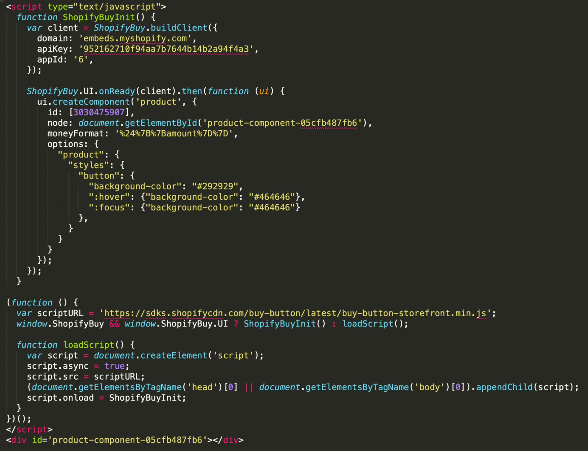
		
		此代码将允许您显示产品的图片，价格和说明。 单个产品没有限制，因此您可以添加任意数量的产品。如果您已经拥有博客网站（例如WordPress），则 Shopify Starter 将允许您在该网站上展示您的产品.

		此外，当您想在 Facebook 这样的社交媒体平台上使用“购买”按钮时，也会获得一个特殊的嵌入代码。 说到：
	- 在Facebook上出售 Shopify Starter
 
		如果您已经在 Facebook 上拥有良好的追随者，并且对创建单独的在线商店不感兴趣，那么 Shopify Starter 对你来说是个不错的选择.

		这些工具易于使用-您可以快速生成一个新的“购买”按钮并在您的 Facebook 页面上使用。

		此外，您还可以与客户聊天 有了 Shopify 将您的消息发布到 Facebook Messenger （销售渠道）。 客户甚至可以直接从聊天窗口购买您的产品。

		当销售给年轻的人群时，实时聊天尤其有效。 [数据表明](https://ecommerce-platforms.com/ecommerce-selling-advice/32-ways-solve-cart-abandonment-without-need-discounts) 在购物时，有71％的16-24岁购物者要求通过实时聊天/即时通讯应用程序做出快速反应。
	- 与销售数字产品 Shopify Starter

		其中一个 关于许多很棒的事情 Shopify 是它允许您 [销售数码产品](https://ecommerce-platforms.com/ecommerce-selling-advice/top-10-best-ways-sell-digital-goods-online) 也一样,考虑诸如电子书，有声读物，指南，课程，媒体文件等内容。

		你可以这样做 Shopify 启动器。 您可以像设置普通产品一样设置数字产品，然后为它们获得一个购买按钮。

		销售数字商品通常是通过 Shopify是的 [数字下载应用](https://shopify.pxf.io/c/1318841/1061744/13624?subId2=article&subId3=apps&u=https%3A%2F%2Fapps.shopify.com%2Fdigital-downloads)，但您也可以使用一些出色的第三方提供程序。 

		但是，值得一提的是，您无法在Facebook上销售数码产品 。
	- 运用 Shopify Starter 用于库存管理

		Shopify Starter 如果您在实体商店中出售商品，则可以处理付款并管理库存。
		
		Shopify Starter 允许您访问 Shopify 管理区域，因此您可以在需要时手动创建订单。 您也可以接受信用卡付款，并且 Shopify 将自动更新您的库存。
	- 其他须知

		Shopify Starter 是唯一不通过电话为客户提供支持的计划。 您将获得电子邮件和实时聊天支持。
		
		Dropshipping 可在 Shopify Starter 计划。 要开始使用，您需要从以下位置安装第三方应用程序： Shopify 应用商店。 
	- Shopify Starter 是以下业务的理想选择：
		- 想要将电子商务添加到现有的博客或网站
		- 想在 Facebook、Instagram、Pinterest 上销售
		- 对实时聊天和电子邮件支持感到满意
		- 需要一个后端系统来管理他们的库存和付款
		- 想看看如何 Shopify 工具与其离线商店活动集成
		- 想要从一个非常低的预算开始	
- Basic Shopify

	带有功能齐全的在线商店模块。 。

	- 提供功能
		- 获得24/7全天候支持
		- 欺诈分析
		- 手动订单创建
		- 折扣代码
		- 网站和博客模块以及免费的SSL证书
		- 放弃购物车
		-  提供了两个员工帐户
		-  放弃购物车恢复（联系留下详细信息但未完成购买的访客）
	- 定价 
		- 29 美元/月
		- 每次交易的信用卡费用为2.9％+ 30美分。
	- 功能描述
		- 模板
	
			可以使用Basic软件包访问 10个免费模板和50多个付费模板.
	
			下面展示的主题可能是该网站上使用最多的主题，称为布鲁克林。 尽管它非常吸引人，但是它也被过度使用了，因此，如果您希望与众不同，可以考虑其他选择。 付费主题的起价为每张100美元左右。 
			
			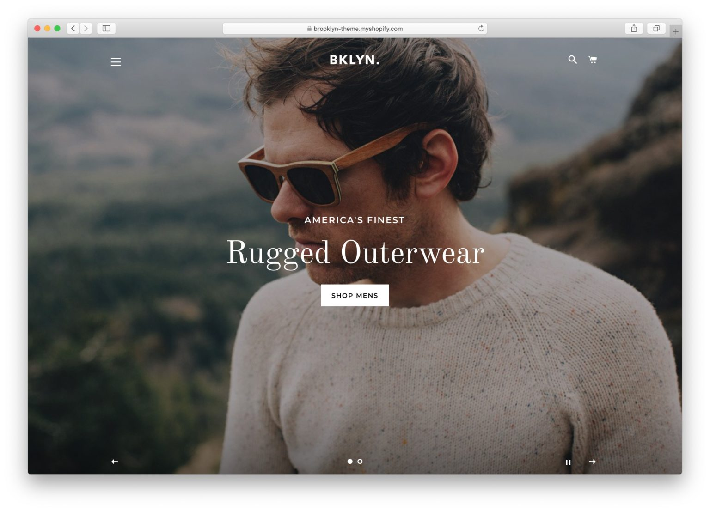
			大多数免费网站模板提供以下功能：
			
			- 您可以使用标题幻灯片显示 突出您的顶级产品
			- 动态产品网格，根据显示的产品数量而变化
			- 滑出式购物车，使访问者无需离开网站即可将产品添加到购物车
		- 写博客

			Shopify store带有内置博客模块。 这可能是一个很棒的工具，可以帮助您建立自己的受众群体并帮助您吸引更多流量 电子商务商店 –反过来，可以带来更多的销售。
			
			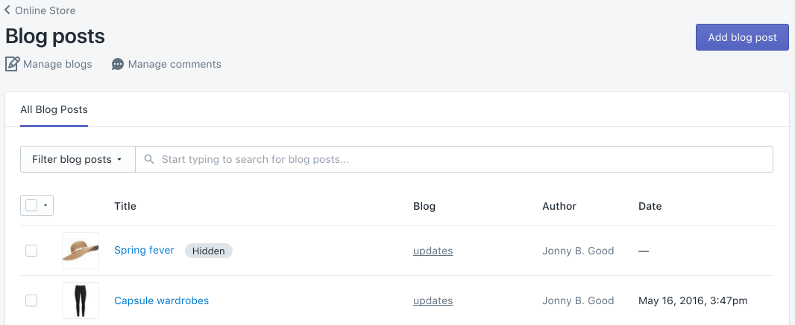 
			您可以使用此模块发布新帖子，向其中添加图像和其他媒体，设置标签，类别，还可以调整每个帖子的 SEO 参数。

			也就是说，与类似的解决方案相比，该模块的功能受到限制 WordPress –主要用于运行博客。 这是可以理解的，因为 Shopify 主要关注在线商店组件。
		- 废弃的购物车恢复

			放弃购物车可以让您识别将商品添加到购物车但未完成购买的人. 此功能过去仅适用于更高的计划，但现在的用户 Basic Shopify 也可以使用它。

			Shopify 使您可以手动向放弃购物车的人发送电子邮件或者您可以选择更加自动化的选项，其中 Shopify 代表您发送。

			然后，使用“放弃的结帐”屏幕，您可以跟踪收到哪些来自购物车的电子邮件后，哪些访客完成了购买交易 Shopify.

			这是一个非常棒的工具，可帮助您无需额外的营销费用即可实现销售，这是使 Shopify 是许多人的第一电子商务平台。 此功能通常不是 Shopify的竞争产品在这个价格范围内。
			
			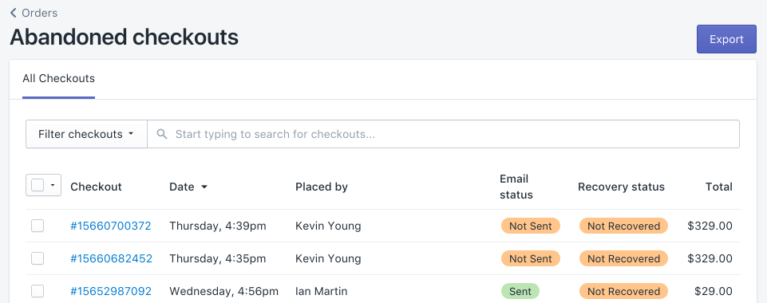
		- 欺诈分析

			欺诈分析来自 Shopify 帮助您识别您帐户中的任何欺诈活动，这将其他 wise 招致拒付或导致其他问题。

			Shopify 提供有关订单是否可能欺诈的指标。 指标可以包括：

			- AVS检查–信用卡是否通过了这些检查？
			- 客户是否从卡背面提供了正确的CVV代码？
			- 订单的IP地址是否有先前的欺诈行为？
			- 下订单的人是否尝试过一张或多张卡？
		- 其他须知 Basic Shopify
			
			Basic Shopify 只有有限 销售点 能力。 可以在弹出窗口或市场上亲自销售，但如果您想使用 Shopify 在您的主要商店位置，您可能要选择以下一种 Shopify 的更高层软件包。
			
			Basic Shopify 对于那些满足以下条件的卖家来说是一个绝佳选择：
			
			- 没有大量预算或正在开始
			- 想要建立一个功能齐全的在线商店网站
			- 想要在一个易于使用的界面中管理所有订单，销售和包裹
			- 有志于开始写博客，并希望在他们的商店周围建立一个社区
			- 希望能够以这种方式恢复废弃的购物车并产生额外的销售
			- 有价值的24/7电话支持
- Shopify
	- 提供功能
		- 包含 Basic Shopify 所有服务
		- 礼品卡
		- 专业报告
		- 完整的销售点功能
		- 提供了五个工作人员帐户
	- 定价 
		- 79 美元/月
		- 每次交易的信用卡费用为2.6％+ 30美分
	- 功能描述
		- POS系统具有许多定义功能：
			- 付款方式
	
				Shopify POS材料 允许您提供商店信用额度，而不是用他们使用的付款方式退还给客户。 结合礼品卡功能，您既可以在商店内也可以在网上接受。
			- 高级结帐
	
				在订单上附加注释，并跟踪特殊要求。 自定义收据，以便您可以推广品牌，在线商店，营业时间和促销活动。 此外，税款是根据您的位置自动计算的。
			- 折扣
	
				您在线创建的优惠券代码也可以在店内使用。 创建特定的店内折扣并运行报告以查看其效果如何。
			- Shopify 店铺管理
	
				查看过去在网上或店内所做的所有订单，可以按客户，产品或日期分类。 通过整合 Shopify POS材料 系统 的Quickbooks or Xero.
			- 客户管理
	
				创建客户资料并分析他们的购物习惯以及联系方式format和位置。 收集商店中的电子邮件地址以用于您的电子邮件营销。
			- 产品 
	
				跨实体和在线渠道跟踪库存，使您掌握库存情况。 对于 零售店，您也可以提供 批发 价格和 忠诚度计划.
			- 硬件
	
				下载 Shopify POS应用 在您的Apple或Android设备上。 随附的所有硬件都是免费的，并附带一个 30天退货政策.
			- 数据分析
	
				按位置，特定员工或客户查看，分析和导出销售报告。 导出产品报告以查看销售情况和不销售情况。
			- 电话
	
				在手机上查找您的客户资料，然后直接通过该应用与他们联系。 通过应用添加产品，并拍摄新产品照片。
			-  POS 系统方便
				-  登记轮班
				-  使用硬件包括条形码扫描仪，收据打印机和运输标签打印机
				-  员工别针，以便每个成员都有一个安全和独特的登录
				-  将第三方软件添加到 POS系统 （包括 Shopify POS材料)
				-  最多可以配置五个商店位置
	
				 POS系统是为偶尔出现在弹出窗口，活动和展览会上的卖家以及拥有自己的商店和多个员工的经验丰富的卖家而设计的。
		- 礼品卡

			礼品卡非常适合已经是知名品牌的大型在线业务。客户可以访问您的电子商务网站并为朋友或家人购买礼品卡。 这些非常适合生日和假日。 此外，您还可以发行礼品卡作为对客户的奖励。		 
			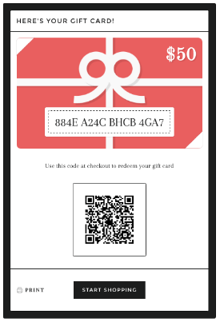
		- 专业报告

			在报告方面，每一个 Shopify 用户可以访问主仪表板，在其中可以查看商店中正在发生的事情的概述。 另外， 与 Shopify 计划，您可以访问以下类型的报告:

			- 销售报告

				销售报告让您进入 format 根据渠道、时间或员工来了解您的客户所下的订单。这些报告可以告诉您哪些区域带来了最多的销售额，因此对于您的营销而言可能非常有价值。
				
				您还可以通过添加以下功能来自定义销售报告：
				
				- 平均订单价值
				- 订购数量
				- 退货数量

				平均订单价值尤其重要，因为这可以告知您应该在哪里设置免费送货阈值。 假设您的平均订单金额为80美元，然后尝试将免费送货金额设置为100美元，然后观察平均订单价值的增长。
				
				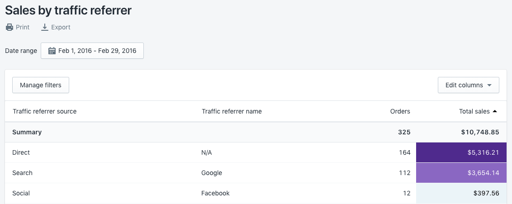
			- 利润报告
			
				利润报告计算产品的总成本，然后计算出利润。

				您可以根据多种因素查看利润报告，包括：
				
				- 产品展示
				- SKU号码
				- POS位置
				- 折扣和退款

				我们特别喜欢基于折扣和退款的利润报告。 假设您投放了一个广告系列并在整个网站上提供了10％的折扣，那么该报告将告知您在应用折扣后的利润率。
				
				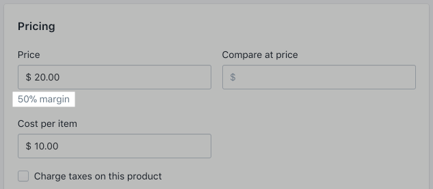
			- 客户报告（5中的7）
				
				客户报告确实深入了您的分析，并且可以为您提供有关客户行为的宝贵见解。

				这些报告包括以下信息：

				- 客户随着时间的流逝
				- 首次销售与回头客销售
				- 客户按国家
				- 回头客
				- 一次性客户

				这些报告可以帮助您将那些一次性购买者转变为回头客。 从仪表板上，您可以查看他们已经花费了多少，以及他们是否将接受您的电子邮件营销
				
				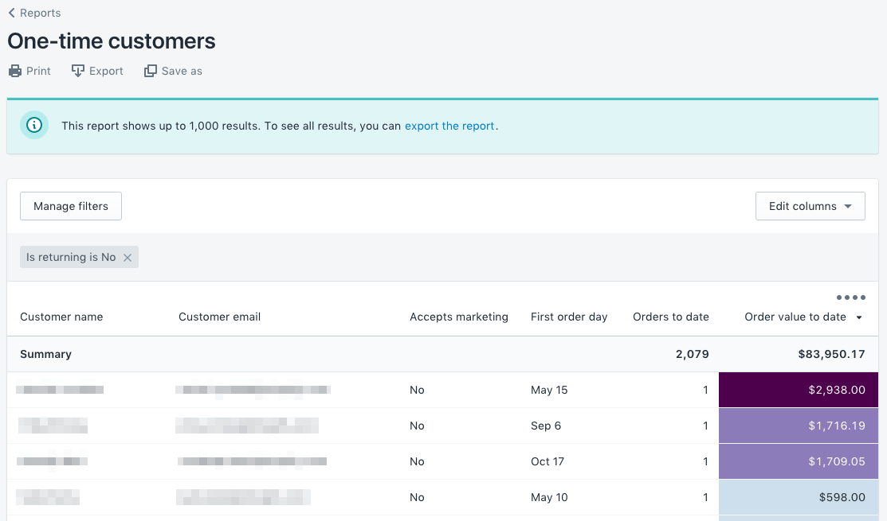
			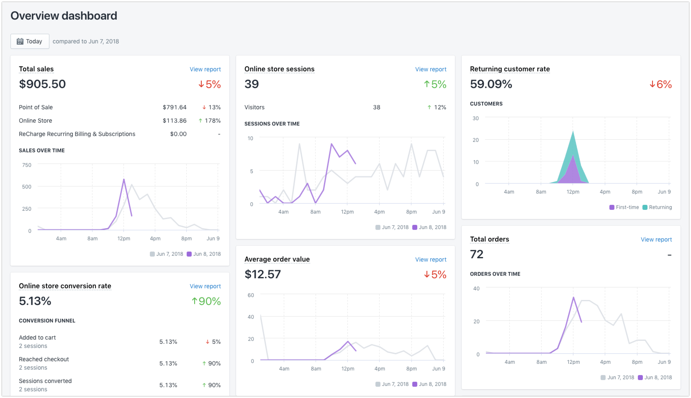	
		- 以下卖家的绝佳选择
			- 有或期望开始大批量销售
			- 想开始利用礼品卡和折扣代码
			- 需要对客户的购买习惯和利润进行更深入的报告
			- 有一个实体店位置或几个		
- Advanced Shopify
	- 提供功能
		- 包含 Shopify 所有服务
		- 高级报表生成器
		- 第三方计算的运费
		- 实时承运人运输
		- 提供了15个工作人员帐户
		- POS模块中多达八个商店位置
		- 降低交易费和信用卡处理费
	- 定价 
		- 299 美元/月
		- 每次交易的信用卡费用为2.4％+ 30美分
	- 功能描述
		- 高级报表生成器

			允许您创建自定义报告
			
			- 首先，您可以选择要设置的报告类型，然后可以编辑和过滤该报告中的列。 您也可以与团队成员共享。

				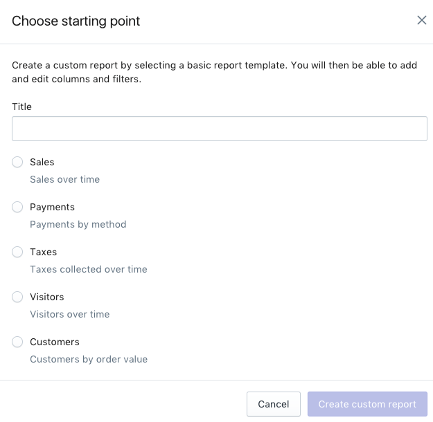 
			- 然后，您的所有自定义报告都会保存在您的报告部分中 Shopify 仪表板，以便您可以随时轻松访问它们。
		- 第三方计算的运费

			使用此功能，您可以使用您的运营商帐户在结帐时应用计算的运费。

			您还可以获得美国邮政或加拿大邮政提供的折扣运输标签。
			
			您可以访问 FedEx，UPS，USPS 和 Canada Post 的运费。 在您的送货管理区域内，您可以在计算的价格中添加百分比加价，以涵盖包装成本。
			
			您可以决定要提供特定承运商的哪些服务，例如加急包裹，优先级和 XpressPost。
	- 适合以下情况的卖家
		- 处理大量在线交易
		- 需要高级报告，特别关注利润和利润率等业务要素
		- 使用承运人运送产品并希望享受折扣价
		- 有更多的人在网上与商店合作
		- 有更多的商店位置			
- Shopify Plus

	这是 Shopify 的企业计划，正如您所想像的那样，大多数企业主在考虑推出一个企业计划时并不需要 Shopify 商店。
	
	- 提供功能
		- 包含 Advanced Shopify 所有服务
		- 带有高级企业功能
			- 专职的客户经理，他将在启动过程中为您提供帮助，并管理您的帐户并在整个旅程中提供支持。 
	- 定价 
		- 2000美元/月
		- 每次交易的信用卡费用为2.15％+ 30美分
	- 功能描述 
		- 多渠道销售
		
			Shopify Plus 允许您在企业仪表板中集成 20 多个渠道，包括 Facebook， Facebook Messenger、Instagram、亚马逊、eBay 等。
	
			您的客户还可以使用100多家支付服务提供商，这将帮助您产生更多的销售额，因为没有人会落后
		- 集成
	
			如果您有自己的自定义应用程序解决方案，或者您要 Shopify 的技术合作伙伴将您的想法变为现实 Shopify Plus 可以帮助你。 有 1,500 多个专业构建的应用程序和 plugin可用。
	- 用于满足以下条件的企业业务：
		- 销量极高
		- 订做 CRM系统 和需要 Shopify 对接
		- 想要为团队自动化工作流程
		- 有销售高峰期，需要保证 uptime 和安全
		- 想要他们可以在需要时与之交谈的客户经理	

##  Shopify 功能评论
### Shopify 最重要的功能
从网络中统计的客户认为 Shopify 最关键的组件列表：

- 被遗弃的购物车恢复

	今天在线平均购物车放弃率约为 68.81％。 这意味着每个7客户的 10 不买东西就离开商店。 幸好， Shopify 提供自动电子邮件触发器和其他工具，以帮助您恢复废弃的购物车。
- 自动发货计算

	将产品运送到世界各地的客户？ 不必担心计算那些复杂的运费-只需让 Shopify 实时承运人运输服务根据特定产品的重量和客户所在位置来计算特定产品的确切运输成本。
- Shopify POS

	您可以为您的付款 Shopify 在线或离线存储，这要归功于 Shopify 的销售点系统。 
- 客户资料

	确保您始终拥有最好的 format 通过自定义用户配置文件了解您的目标受众。 当您想要细分营销和销售活动时，这非常适合。
- 简单的折扣代码

	销售和折扣可以帮助增加收入。 Shopify 提供了一个奇妙的“批量折扣”解决方案，使您可以生成免费送货，百分比和美元金额的折扣代码。
- 社交媒体整合

	如果您拥有大量的社交粉丝，则可以重新创建自己的 Shopify 通过“商店”标签在 Facebook 上建立电子商务网站。 允许人们直接从您那里购买商品，而无需访问您的网站。
-  Shopify Fulfillment Services 

	 Shopify 提供 dropshipping 解决方案，因此您可以避免开店的耗时环节，例如运输，包装和装卸。
- Shopify Experts

	正如我们在其他地方提到的 Shopify 进行审核后，您可以访问专家以在设计，编程，营销等方面获得其他指导和支持。 这样可以确保您始终从网上商店获得最大收益。
	
它还包括数百个专业主题，完整的博客平台，唯一的域名和 SSL 证书，可供选择的 70 个支付网关，市场营销和 SEO 支持等。	

###  Shopify 产品主要优势特点
- 无论建立完全的在线运营商店还是从实体商店运营商店，都可以使用。 

	Shopify 设法实现强大的功能集是因为它们内置了一个工具。比如 税费和运费包含在 Shopify 接口中，而不需额外支付额外费用。
- 最完整的仪表板或控制面板之一

	从处理订单到管理库存的所有任务都可以轻松掌握。该平台还提供了一个名为 Shopify Partners，开发人员可以在其中玩转 新网站 无需每次都打开免费试用版。 
	
	这就像一个 sandbox 界面。可以安装新主题，自定义完整的网站，并从 Shopify Partners 网站到已启动的网站。 不仅如此，您还可以为加入 Shopify 的每个客户赚取佣金.
- 报告在 Shopify 是所有电子商务平台中用户最喜欢的。 

	它们井井有条，简洁明了，并提供了多种选择，例如按帐单地址查看销售，按引荐来源网址查看销售以及按产品标题查看销售总额。
- 在实际零售环境中销售产品，那么您可以选择 Shopify POS材料。 

	这包括在软件和硬件方面离线销售产品所需的一切。 该软件包括一个 iPad 应用程序，可以更轻松地在零售环境中销售您的产品。

	使用该应用程序，您可以使用信用卡读取器在当场刷卡客户的卡。 您甚至可以从公司购买其他硬件，例如收银机，收据打印机和条形码扫描仪。

	Shopify 提供一个移动应用 用户可以使用：

	- 在应用内直接回应拒付争议
	- 查看过去30天内对其产品进行的所有库存更改
	- 完成项目
- App Stores 在所有电子商务解决方案中最大的之一 ; 

	他们提供了数百种免费和付费应用程序，这些应用程序将改善用户的商店（大多数付费应用程序将要求用户每月支付费用）。 这些已经 divi 分为不同的类别，例如 市场营销，销售，社交媒体，运输和客户服务。

	强大 内容管理系统（CMS） 可以创建其他页面，以及可以方便客户与您联系的页面。 
- 一个仪表板处理超级轻松地运行自己的博客
- 每个主题商店中提供的主题是 responsive 支持移动结账.

	 responsive 结帐的网站可以自动适应客户屏幕的大小，无论是通过平板电脑还是智能手机。 除了直接与 Facebook 和Pinterest 集成，礼品卡，折扣代码和良好的客户资料外，该公司还非常完善了内置功能。

通常，如果您需要仅在应用商店中使用的功能，则可以随时对其进行测试，如果网站上无法正常使用，则可以移至其他选项。

### 库存管理功能			
库存管理是运营商店的重要部分， 准备好向商店添加库存后，您只需按下仪表板侧栏中的“产品”选项卡即可。 然后，您将自动转到以下页面：

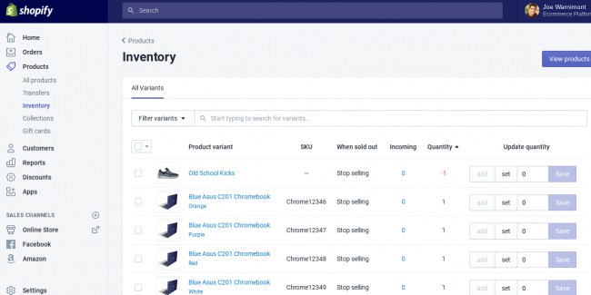

如上图所示，从产品标题到描述和价格的所有内容都是可定制的。 此外，您可以为每个产品提供独特的 SKU 以及条形码。

转移，库存，收藏和礼品卡也被视为该领域的标签。 我喜欢“库存”选项卡，因为它包含商店中的所有商品，所有商品都组织在一个干净且易于管理的列表中。 产品页面还提供了一些选项，例如搜索引擎优化，运输和用户在登录此产品页面时将会看到的图像。
### SEO和营销功能
如果您有一个了不起的商店，但您的客户无法找到它，那么您很可能会对销售数据感到非常失望。 Shopify 为 SEO和营销提供了很好的功能。 得益于内置的搜索引擎优化（SEO）功能，您的网站将很容易在所有主要搜索引擎上找到，例如 Google，Bing 和 Yahoo。

有趣的是，即使 SEO设置是自动化的，您也可以访问每个产品页面并自定义您自己的目标关键字，URL等。

如果您真的想进一步自定义商店，则该界面提供了可自定义的标题，标题和元标记。 这些网址都是 SEO 友好的. Shopify 与Google 合作，偶尔会给你 广告 也可以为新的 AdWords 帐户付费。 我当然不会根据哪个电子商务平台能给我钱在 Google 上投放广告做出决定，但是我认为这是一个不错的奖励。

礼品卡非常人性化，您无需外出寻找第三方应用程序以获得更好的礼品卡功能.

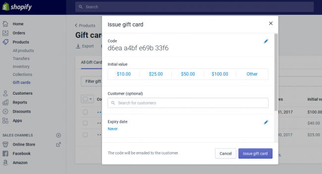

这取决于您的付款计划，但是一旦您激活所有功能，它就会在结帐区域提供礼品卡代码。

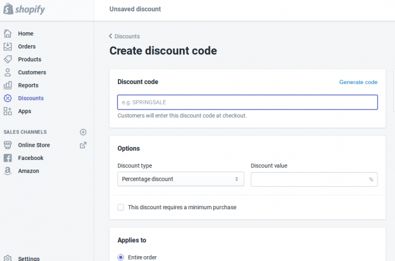

为了促进您的营销， Shopify 创建了一个折扣代码优惠券生成器，以在不同的社交网络上推广您的产品。

随着销售选项 Twitter，Facebook 和 Pinterest，您的营销游戏掌握得很好 Shopify. Shopify 还在 Instagram上推出了产品标签，它使您可以直接链接到产品页面。

最后，电子邮件收集表格非常简单。 它确实可以完成工作并与主要的电子邮件选项集成在一起，但是许多 电子商务商店 趋向于在应用商店中寻找更合适的附件。

[点击阅读](https://ecommerce-platforms.com/zh-CN/compare/best-ecommerce-platform-seo) 这篇文章是 SEO 电子商务商店的最佳实践。

## Shopify Payments
传统上如果想 接受付款，则必须使用第三方 支付处理器如 Stripe 、paypal，或对每笔交易收取一定费用的其他交易。而 Shopify 已经创建了自己的付款处理器 Shopify Payments （由Stripe提供支持）。 如果您决定注册此计划，则将免除所有交易费用。

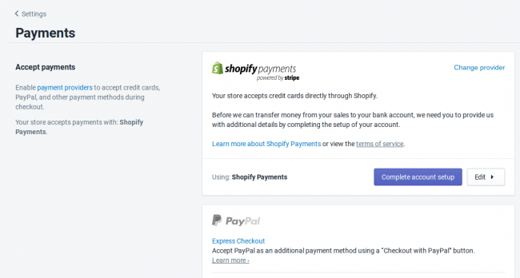

之前在定价区域介绍了信用卡费用，但值得注意的是您确实可以与70多种 支付网关。 其中包括接受信用卡付款， Google Checkout, 贝宝等等。

网关都有自己的交易费用. 由于这些可能会有些混乱，因此我强烈建议您在注册之前先熟悉它们，因为您可能会在其他 wise 对您需要支付的金额感到惊讶。

总之， Shopify 拥有支持支付网关的最大列表之一。 这并不意味着你将全部使用它们，但它为来自世界各地的人们提供了更多的机会。 它还使您有机会研究哪些支付网关将适用于您的特定业务。

Shopify Payments 优缺点分析

- 优点
	- Shopify 交易费用

		虽然预期您会在使用时遇到交易费用 Shopify Payments，您无需为其他支付方式支付额外的 0.5%-2% 交易费用。
	- Shopify 积分

		Shopify Payments 立即可用，无需单独集成到您的商店中，因此您可以立即开始接受付款。
	- Shopify 安全

		来自的付款服务 Shopify 是高度安全的，并可以检测欺诈性交易。 您可以在结帐单中选择按地址和值添加验证系统，以确保付款是真实的。
	- 已保存的客户详细信息 

		当客户访问您的 电子商务网站，他们可以将运费和账单保存在 format 供以后使用。 当他们回来时，所有这些信息都已经存在，这反过来又会导致更高的转化率。
	- Shopify 费用

		根据您产生的销售量，您将获得较低的交易费用作为奖励。
- 缺点
	- 退款

		如果您的客户提出太多退款，则 Shopify 可能会阻止您退还资金，或者更糟糕的是，您的帐户会被冻结。
	- 可疑活动

		如果您的帐户中发现可疑活动，那么再次 Shopify 可以扣留您的款项。 然后，这些费用可能会逐步增加，并且您可能会在一段时间内没有收到任何款项以解决争端。
	- 支付范围 – Shopify 的付款方式并非在每个国家/地区都可用，但在全球15个国家/地区（包括美国，加拿大，澳大利亚，新西兰，英国联合王国或新加坡）都可以使用。 你可以看到 [完整的国家名单](https://shopify.pxf.io/c/1318841/1061744/13624?subId2=article&subId3=help_centre&u=https%3A%2F%2Fhelp.shopify.com%2Fen%2Fmanual%2Fpayments%2Fshopify-payments%2Fshopify-payments-requirements) 这里。 除了一般可用性之外，如果您的业务被视为“高风险”，则可能会拒绝使用该服务。 Shopify 也有权终止您的服务，恕不另行通知。

最后，优点肯定超过缺点，并且使用 Shopify Payments 将减少您的整体运营成本。

## Shopify 与一般数据保护条例（GDPR）
2018 年 XNUMX 月，GDPR 生效并引入了关于公司需要如何处理个人信息的新规定。

这项规定使全球许多企业感到真正的问题。 

- （1）规则不明确
- （2）处以极高的罚款，甚至高达20万欧元，占全球年营业额的4％。 
- 对于大多数企业而言，这样的罚款意味着破产。

Shopify 但是，确实准备好了并做了一些出色的工作来保护他们的用户和客户。 简而言之，目前所有业务 Shopify 具有使其操作符合规定所需的工具。具体来说，这就是 Shopify 放置到位：

- 他们更新了服务条款，其中包括 [数据保护附录](https://www.shopify.com/legal/dpa?utm_source=blog&utm_medium=blog&utm_term=923140105&utm_content=gdpr&ref=ecomplatforms)，这解释了如何 Shopify 处理您的欧洲客户的 formation
- Shopify 更新了他们的隐私政策 明确说明哪些权利 divi 双重打击行为以及如何处理数据
- Information 已针对 cookie 在您店面的存储方式进行了修改
- 创建了一个免费的 [隐私政策生成器](https://ecommerce-platforms.com/go/PolicyGenerator) 您可以添加到您的商店
更改了行销选择，使您可以取消选中 Shopify 商店
- 制作了一个 [16页白皮书](https://shopify.pxf.io/c/1318841/1061744/13624?subId2=article&subId3=help_centre&u=https%3A%2F%2Fhelp.shopify.com%2Fpdf%2Fgdpr-whitepaper.pdf) 如何 Shopify 将符合法律要求
 
应用商店界面也已更新，以便显示特定客户在被保持在divi您商店中已安装的双应用程序。

	Shopify 建议您就数据保护问题与律师谈谈，以便您清楚这将如何影响您的特定业务.

Shopify 还提出了一种方法，您可以请求 divi 双重客户可以从您所有的应用中删除。 该选项在您的客户隐私区域中可用。 看起来像这样：

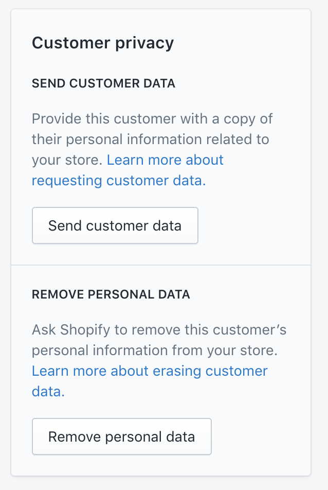	

## Shopify vs 移动电子商务
您可以通过 Shopify 移动应用程序执行的某些任务 包括：

- 拍摄并上传产品照片
- 编辑产品详细信息，例如定价
- 将产品添加到商店
- 履行订单以及提供退款
- 购买和打印运输标签
- 获取转化统计信息
- 查看实时销售format和查看实时交通
- 接收订单通知（见下文）
- 联系您团队的成员
- Shopify 通过手机捐款

该应用程序适用于 iPhone 和 Android。

您可以履行订单的事实对于您正在参加的活动或展览会来说是一个绝佳的选择。 Shopify 应用程序还与第三方市场集成，例如 Amazon, ebay 和 Etsy 因此用户可以通过多个平台有效地管理其销售和库存。

## 易用性展示
- 改善新的配色方案来改善用户体验

	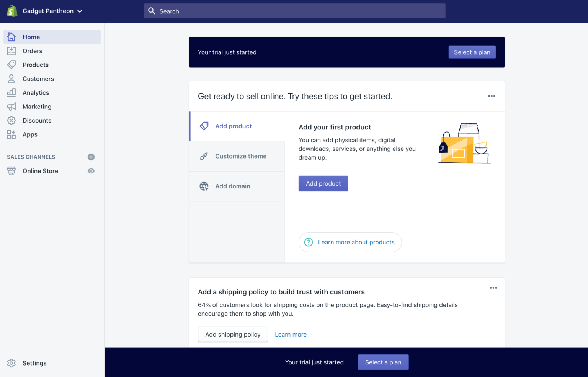
- 增加搜索栏

	例如，您可能想找到某个产品或客户。 在这种情况下，您要做的就是打上正确的字样，然后 Shopify 将返回匹配的所有内容 –是产品，订单，客户等。
	
	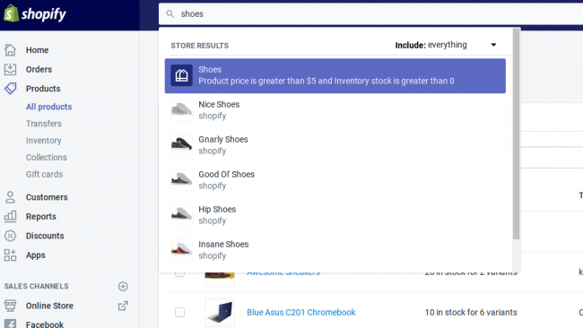	
- 将产品添加到目录中

	所有必需的字段都在那里，并且所有内容都很好地布置在屏幕上。
	
	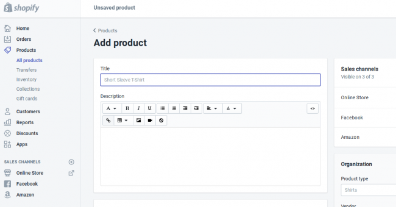
- 商店设置新设计主题

	模板目录根据利基，目的，设计风格和 Shopify 还可以让用户知道哪些模板最受欢迎。 然后，安装主题只需单击几下。
	
	
- 手工制作站点的主页或About页面等

	可视编辑器提供了各种各样的内容部分，您可以将其插入到页面中。 例如，您可能想要在页面顶部放置幻灯片，按钮和产品轮播,单击按钮即可完成所有操作
	
	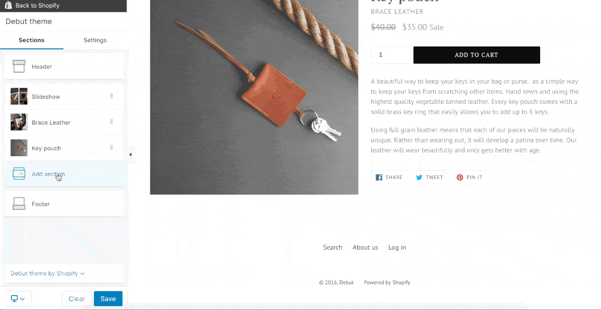
- 通过将各部分拖放到适当的位置来调整它们的顺序,操作设计面向所有初学者

	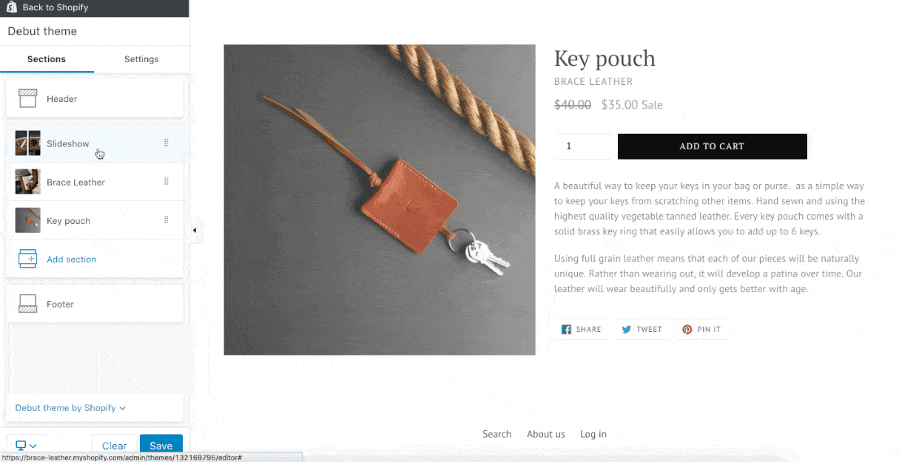
- 类似功能会转移到平台的其他区域	

	例如，当您准备安装新应用程序并扩展商店时，您会看到它们中的大多数只需要单击几次即可启用。
	
	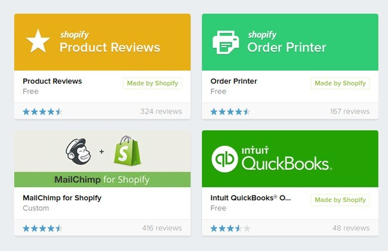

在发布前， Shopify 使您有机会在商店上市之前对其进行测试，实时编辑器非常适合在调整设置后立即查看更改。

该公司在使他们的界面成为业界最简单的方面几乎是屈指可数。 有趣的是，因为它仍然是一个平台，也可以满足那些有丰富编码经验的人。

##  Shopify 主题与设计
该公司提供了任何电子商务平台中最专业的主题，真正出色的是可用的主题和设计。有八个免费主题可用，并且有超过60个付费主题（每个主题在160美元至180美元之间）。以前在目录中有更多主题，但是 Shopify 决定清除旧内容，只保留针对现代受众和搜索引擎进行了优化的现代内容。

- 每个主题不仅是“单个主题”，而且实际上包含了几种样式。 例如，名为Icon的主题具有四种不同的样式，这些样式不仅在配色方案上不同，而且在页面上元素的显示方式上也不同。

	
- 在其中突出显示了多个馆藏和行业 Shopify 主题商店，因此我们非常有信心您将能够找到适合您的业务模型的东西。

	
- 每个主题都有其独特的功能集和能力，以及在每个主题中都可以找到的一组常规功能 Shopify 主题。

	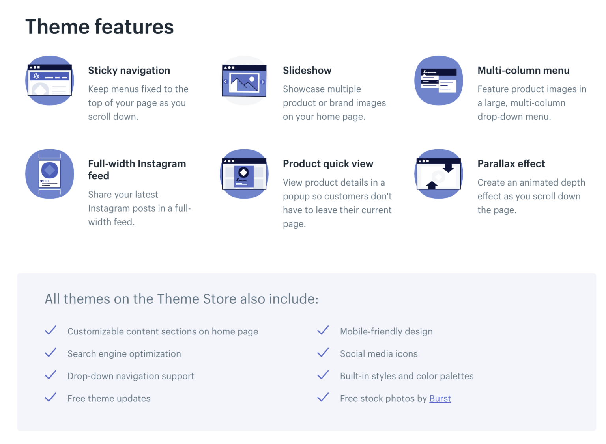
- 也可以使用相同主题查看其他商店的快速入围列表

	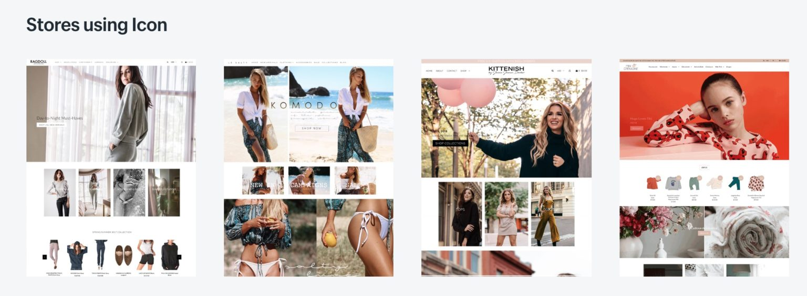
- 最后，每个主题都有多个用户评论，因此您始终可以看到其他人对主题的看法以及主题的优缺点。

	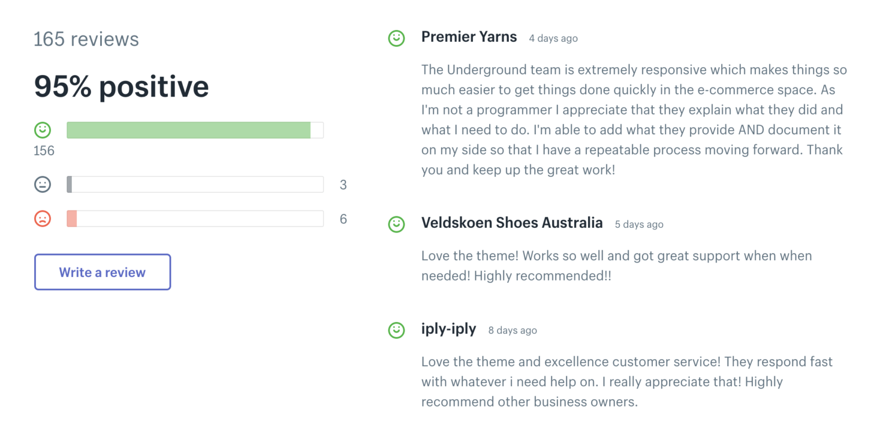

### 那些 Shopify 主题可以能为您带来销售？
对电子商务设计的主要关注是人们可以多久才能结帐并完成购物车流程。

Shopify 主题都有 [两步和三步结帐](https://ecommerce-platforms.com/ecommerce-selling-advice/12-e-commerce-sites-inspirational-checkouts)，并且您还可以使用其他工具来处理社交和访客结帐。

找到正确的主题后，您只需打开模板编辑器并编辑主题，直到感觉完全符合您的需求，就可以轻松地根据自己的需求自定义外观。 另一方面，“Shopify ”功能肯定会加快您的编辑速度，因为基本上它是一个相当简单的拖放式编辑器。

除此之外，如果您对此有信心，则可以通过HTML和CSS进行自己的修改。

没有任何一个 Shopify 主题有 Shopify 品牌推广。 实际上，要找到任何痕迹并不是一件容易的事 Shopify 您在线商店中的品牌。 对于初学者和其他不想在其在线商店中推广该技术的人来说，这是一件了不起的事情。

## 安全
### 安全性
当您运行电子商务网站时，应非常重视安全性。 毕竟，您将要处理客户的信用卡信息，他们的订单详细信息，您自己的产品详细信息以及更多敏感数据。

Shopify 知道这一点并了解责任。 Shopify 将其系统托管在符合1级PCI DSS的服务器上。 换句话说，您的数据以及客户的数据始终是安全的。 此外，所有定价计划（精简版除外）均免费提供128位免费SSL证书。

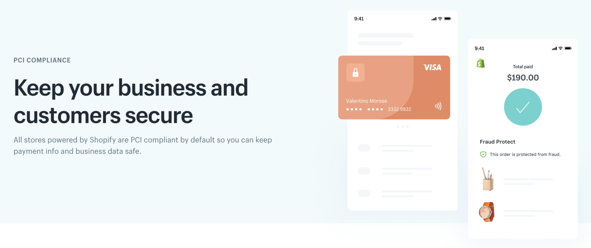

具体而言， Shopify:

- 维护安全的网络
- 保护持卡人数据
- 维护漏洞管理程序
- 具有强大的访问控制措施
- 监控和测试他们的网络
- 维护信息安全策略

### 可用性
此外，尽管数据安全性对零售商非常重要，但许多人还担心他们的商店始终可用。 例如， 据[报道](https://www.businessinsider.com/amazon-prime-day-website-issues-cost-it-millions-in-lost-sales-2018-7?IR=T)在 Prime Day 仅仅一小时的停机可能使亚马逊损失高达100亿美元的销售损失。

Shopify 为他们的客户提供 `99.98% uptime 保证` 并帮助您避免由于商店不可用而造成的损失。 此外， Shopify 负责安全备份存储，然后在需要时允许您访问这些备份。

与安全性相关的其他一些功能包括漏洞管理和访问控制。 这样，您就可以指定哪些用户可以访问商店后端的某些内容。

总体而言， Shopify 十分注重安全性，并且似乎始终与在线安全性世界保持同步，并实施所有最佳实践。

## Shopify 应用市场
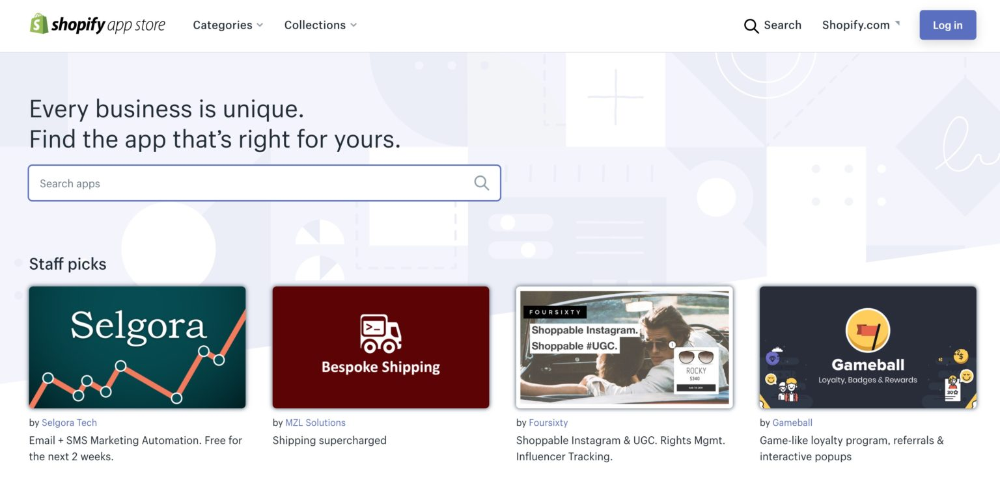

Shopify 曾有过 [应用商店](https://ecommerce-platforms.com/go/ShopifyAppStore) 在线上已有十多年了。

共有超过 2000 种应用程序可用，它们具有各种不同的形状，大小和 divi分为几个有用的类别。

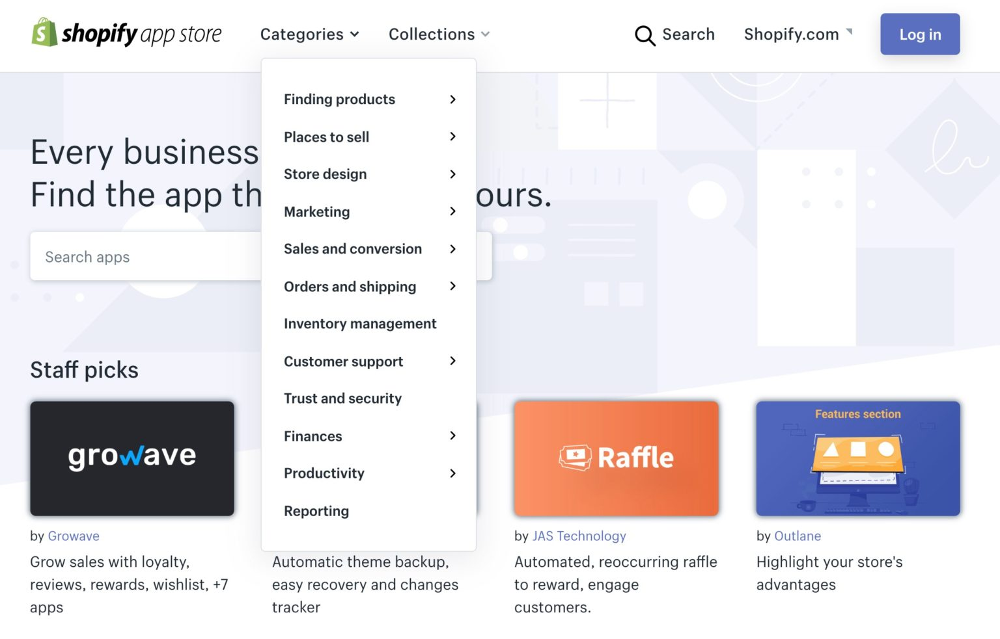
会找到可以帮助您进行商店营销的应用程序，用于电子邮件，推送通知，SEO，访问控制，财务等的应用程序。

此外，在2018年， Shopify 将重点转移到了新型的机器学习算法上，以便他们可以为当今的用户提供更加直观和身临其境的体验。 因此，应用商店现在可以帮助您发现最有可能吸引您的特定工具.

基本上， 应用商店是高级和免费应用程序的集合，旨在扩展和改进您的功能 Shopify 存储。

进行此评论时，我们最喜欢的一件事是 Shopify的应用商店是您无需成为开发人员即可使用在此找到的任何工具的事实。 一切都是即插即用。

话虽这么说，如果您碰巧是网站开发人员则可以成为 Shopify App Merchant，并加入市场中已有的数千个其他开发人员。

Shopify 甚至提供了一堆额外的资源来帮助你入门，包括一个 [高级概述](https://shopify.pxf.io/c/1318841/1061744/13624?subId2=article&subId3=developers&u=https%3A%2F%2Fdevelopers.shopify.com%2F) 的 Shopify 发展空间，并获得 Shopify 蜜蜂。

## 客户支持
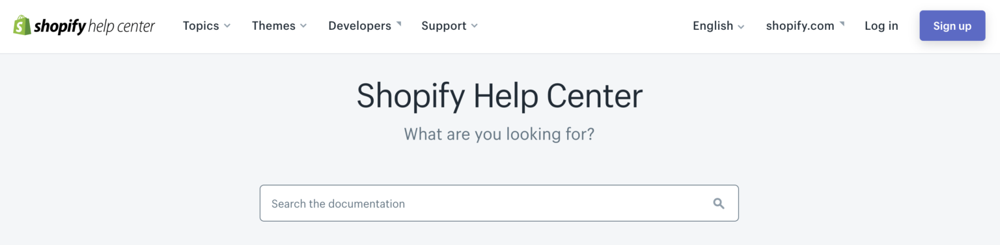
如果您发现自己很难在网上商店做某事，那么 Shopify 拥有业内最好的客户支持团队之一。

无论您选择哪种定价计划，该公司都会提供24/7全天候客户支持，其中包括电话支持（不在Lite计划中）以及聊天和电子邮件支持。 由...提供的另一种很棒的帮助形式 Shopify 可以直接通过他们的网站访问相当大的支持部分，包括用户论坛，教程和常见问题解答。

总体而言，您可以与专业人士交谈，也可以自己了解系统。 显然，有些人讨厌等待电话 Shopify 支持代表，因此我们认为论坛，课程和视频足以让您了解大多数情况。

#### 开发要求
在使用在线平台，应用程序或软件时，很高兴能够与开发人员或至少某种反馈系统联系，以使他们知道 Shopify 您将来希望获得的功能。

这样，我们希望看到 Shopify 开发人员实际上会以一致的方式发布新功能来响应请求。

我们认为这是一种支持，因为不听客户的最终必将失去他们。

Shopify 看到他们如何定期分享有关他们已听取并实现的功能请求的博客文章，就可以在这个部门蓬勃发展。

例如，许多电子商务专业人士担心图像会降低其网站速度，因为媒体通常是导致网站速度慢的原因。 好， Shopify 通过优化和更新所有先前上传的图像来响应，同时还提供了文件修改说明以用于将来的图像优化。 这不仅有助于SEO，还可以加快所有用户的用户界面。

## 参考
- [Shopify Review (Sep 2022): Is Shopify the Best Ecommerce Platform? Shopify Pros and Cons](https://ecommerce-platforms.com/ecommerce-reviews/the-ultimate-shopify-ecommerce-review)