# shopify 应用商店应用授权使用步骤
## [ARitize3D](https://apps.shopify.com/aritize3d?locale=zh-CN&search_id=8e34849c-bea4-4b57-8969-f0352e02ab6e&surface_detail=3D&surface_inter_position=1&surface_intra_position=3&surface_type=search)
- 第一步(shopify)

	进入指定 APP 商店商品地址，并点击应用添加如

	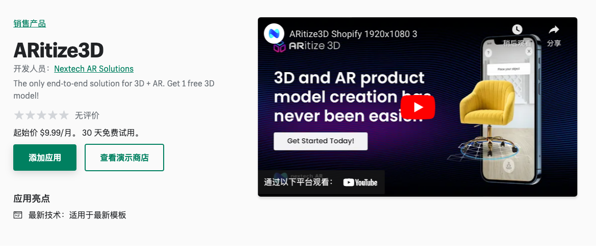
- 第二步(shopify)

	跳转到自己商店后台的应用安装界面，安装和授权
	
	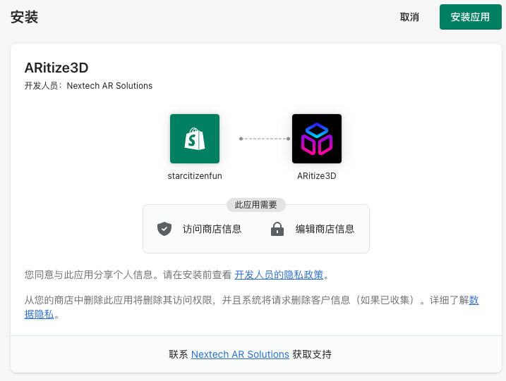	
- 第三步(第三方网站)

	跳转到了第三方网站提示登陆注册
	
	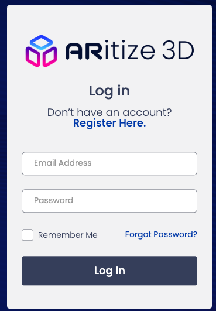	
	
	- 3.1 注册

		
	- 3.2 商店和应用自动链接	

		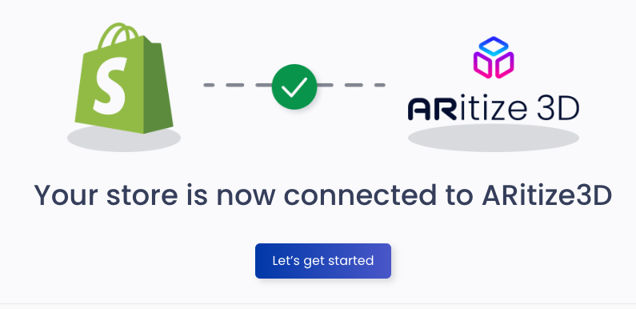
	- 3.3 可选填写用户信息

		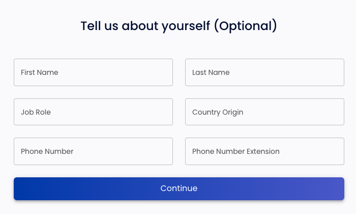
	- 3.4 选择应用购买计划

		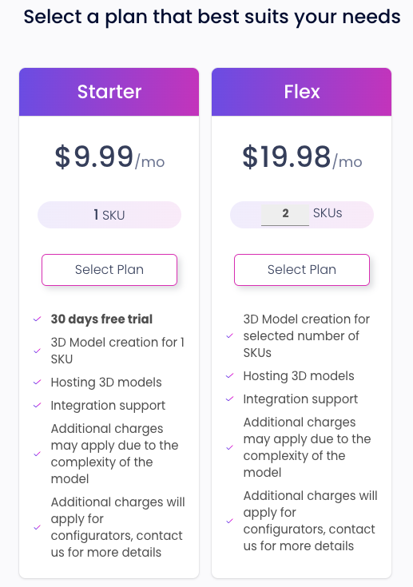
		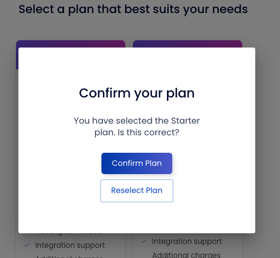
- 第四步(shopify)

	返回 shopify 进入订阅模式
	
	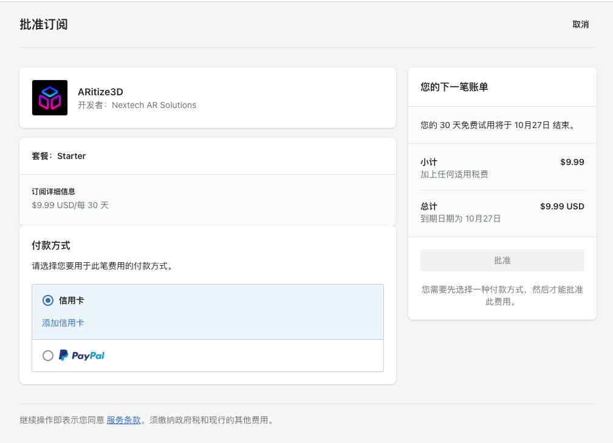
- 第五步(shopify)

	paypal 付款
- 第六步(shopify)

	跳转第三方网站验证支付
	
	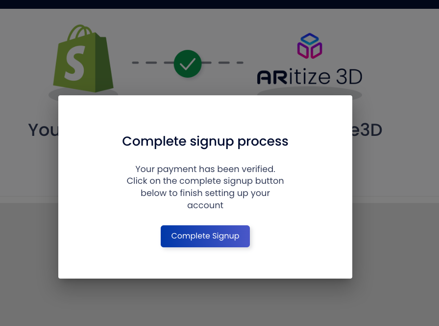
- 第七步(第三方网站)

	创建一个3D 模型
	
	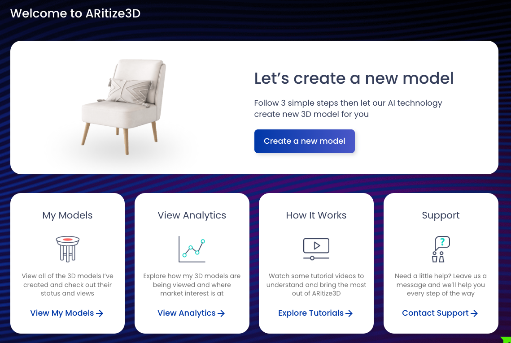
	
	- 7.1
	
		在你店里搜索要创建的商品，注意商品一定要有 sku
		
		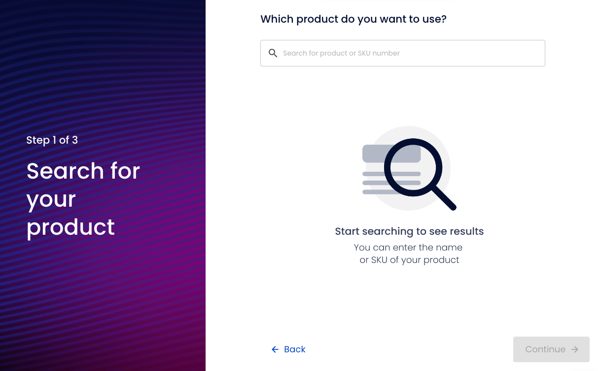
		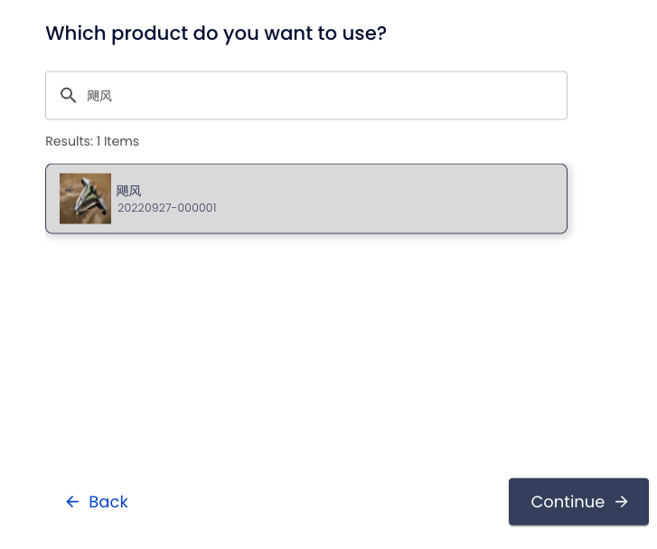			
	- 7.2 

		选择尺寸
		
		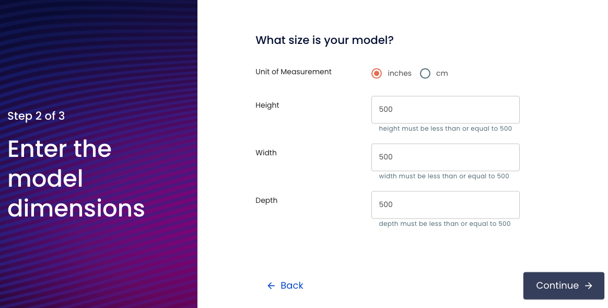
	- 7.3

		选择商品照片
		
		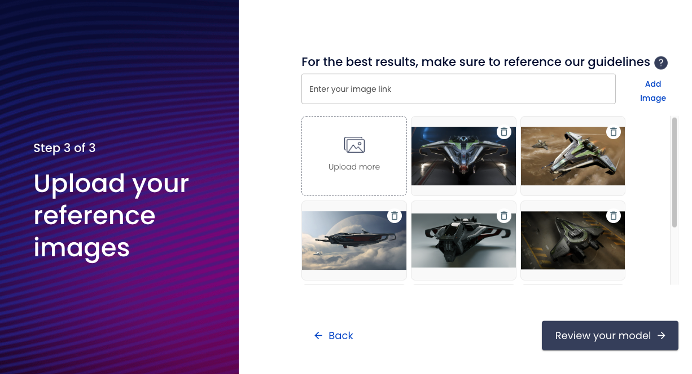
	- 7.4 

		生成模型
		
		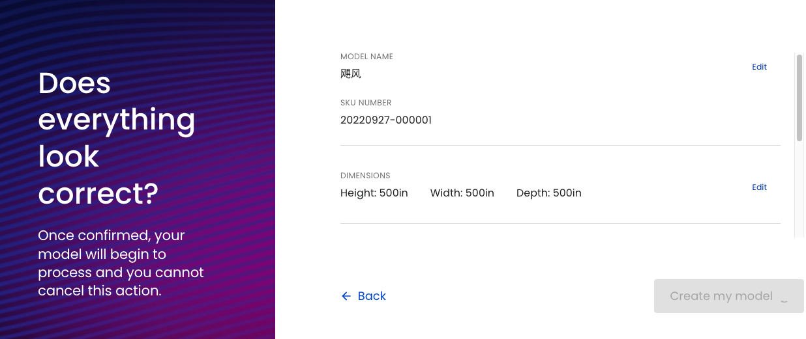
	- 7.5 

		生成模型订单成立
		
		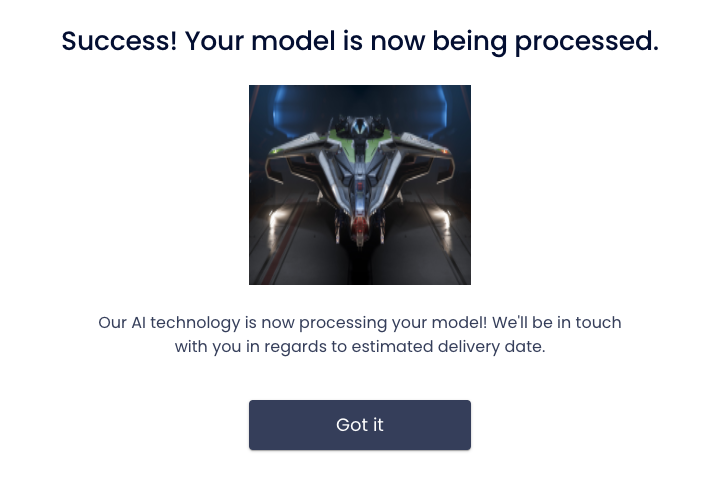
	 - 7.6 
	 
	 		[生成模型进度](https://ecommerce-api.nextechar.com/products)
	 	
	 		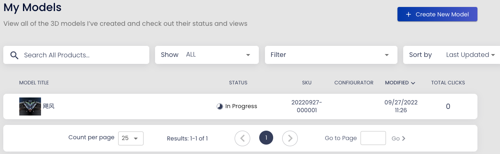
	 
- 从 shopify 同步的数据

	

 		
		
							
		
		
	
				
	
			
					