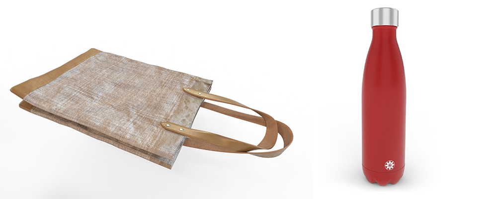
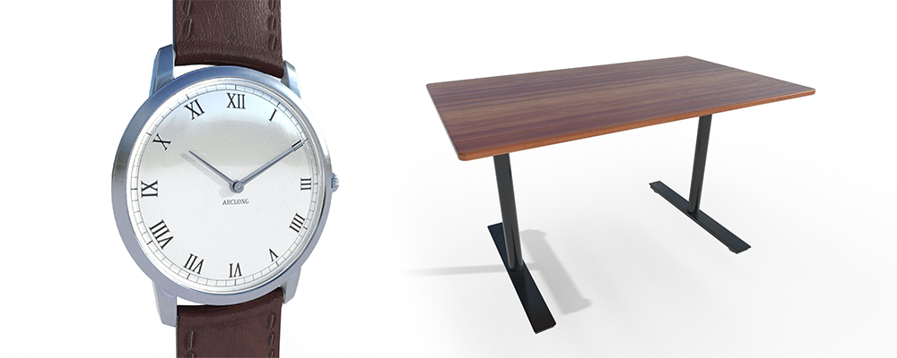
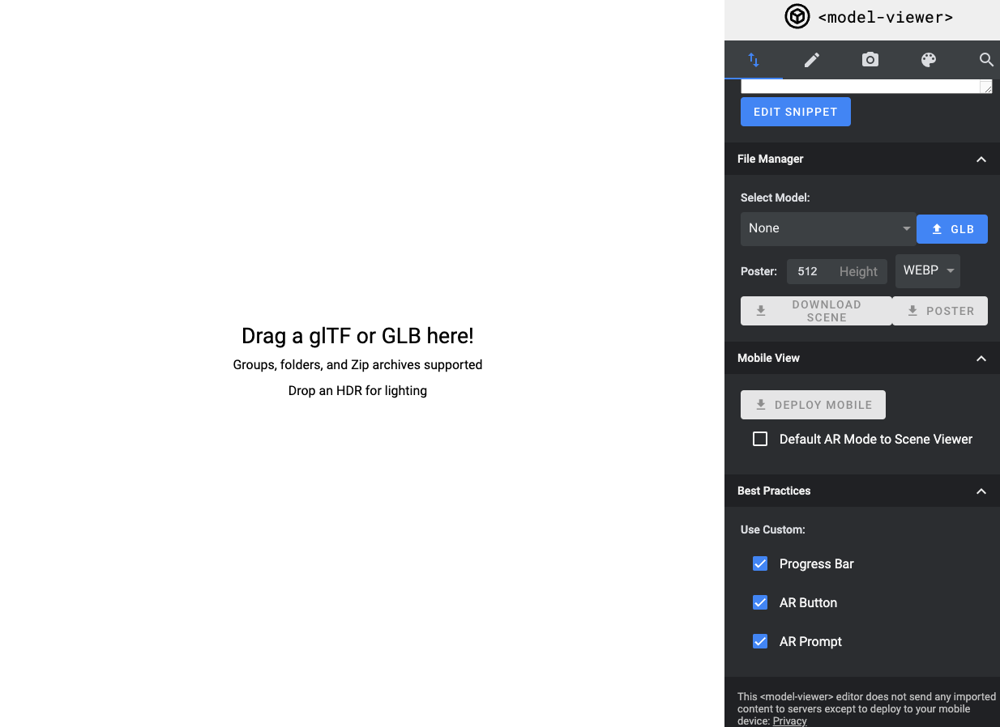

# shopify 当前 3D 相关
## [打造体验式零售的未来](https://www.shopify.com/3d)
通过为 Shopify 设计 3D 内容、​​AR 和 VR 应用程序，帮助商家打造身临其境的购物体验，[点击](https://www.shopify.com/partners)成为合伙人

### 与数百万商家合作
- 提供3D建模服务

	创建逼真的 3D 产品版本，帮助商家提高参与度和买家信心。将这些模型存储在 Shopify 上，并轻松将它们与产品和变体相关联
- 开发动态应用程序

	使用我们强大的 API 在运行时将 3D 产品模型和详细信息直接下载到您的可购买 AR、VR 和 3D 体验中。

## [帮助中心 3D 相关](https://help.shopify.com/zh-CN/partners/resources/creating-media)
### 使用媒体
不久之后，Shopify 商家便能够创建混合媒体图库，可将图片、视频和 3D 模型添加到自己的产品页面中。混合媒体图库有助于商家与客户之间进行互动。将图片、视频和 3D 模型结合可帮助商家讲述其产品的故事，还可让客户看到产品的实际情况或在自己的空间中直观呈现产品。

您可以创建模板、应用和媒体资产，帮助商家为其在线商店打造内容一致、引人注目并具有互动性的零售体验。
### 产品媒体 API 和 Liquid 语法
利用开发人员预览功能，合作伙伴可以访问产品的图片、视频和 3D 模型，以便使用产品媒体 Liquid 语法进行测试和开发。利用 GraphQL 后台 API，开发人员可以创建、检索、更新和删除媒体资产。

在启用了 Unite 开发人员预览的开发人员商店中，产品的视频和 3D 模型现已可供使用。
#### 产品媒体 Liquid 语法
如果您是模板开发人员，则可以使用 Liquid 将产品媒体文件（图片、视频、3D 模型）添加到商店的模板中。您可以在我们的 [Liquid](https://shopify.dev/api/liquid?shpxid=591c044d-99BA-4CC9-48AA-1F1D65F7C509) 参考中查找详细信息。

- [视频](https://shopify.dev/api/liquid/objects/external-video?shpxid=591c044d-99BA-4CC9-48AA-1F1D65F7C509)
- [型号](https://shopify.dev/api/liquid/objects/model?shpxid=591c044d-99BA-4CC9-48AA-1F1D65F7C509)
- [模型来源](https://shopify.dev/api/liquid/objects/model-source?shpxid=591c044d-99BA-4CC9-48AA-1F1D65F7C509)
- [视频](https://shopify.dev/api/liquid/objects/video?shpxid=591c044d-99BA-4CC9-48AA-1F1D65F7C509)
- [视频来源](https://shopify.dev/api/liquid/objects/video-source?shpxid=591c044d-99BA-4CC9-48AA-1F1D65F7C509)
- [媒体筛选器](https://shopify.dev/api/liquid/filters/media-filters?shpxid=591c044d-99BA-4CC9-48AA-1F1D65F7C509)

#### 产品媒体 GraphQL 后台 API
您可以使用 GraphQL 后台 API 来管理与商家产品关联的各类媒体文件。有关不同类型产品媒体文件的详细信息，以及如何使用 Shopify API 来对其进行处理，您可以参阅[使用产品媒体文件 API 的指南](https://shopify.dev/api/examples/product-media?shpxid=591c044d-99BA-4CC9-48AA-1F1D65F7C509)。

REST API 中无法使用产品媒体。如果使用 REST API 端点与产品图片进行交互，该功能就不会产生任何影响。

### 使用 3D 模型展示产品
3D 模型是采用三维模式呈现物体或表面的虚拟表现形式。通过 3D 模型，可以从任何角度观察物体。您可以使用 3D 建模软件获取产品的 3D 模型或自行创建模型。3D 模型可帮助商家讲述其产品的故事，还可让客户看到产品的实际情况或在自己的空间中直观呈现产品。
### 为商家创建 3D 模型
当您代表商家开发产品的 3D 模型时，这些模型需要符合特定的标准。如果您的模型符合这些标准，则商家会得到高质量的多功能模型，该模型可用于多种不同体验，包括增强现实 (AR)、虚拟现实 (VR)、产品渲染和营销。如果模型不符合这些标准，则商家可能会拒绝该模型。

本指南介绍了 3D 模型需要满足的建模标准，并强调可能导致一些商家拒绝模型的常见错误。
#### 常用的 3D 建模软件
以下 3D 软件通常用于为商家创建 3D 模型：

- Maya

	Autodesk Maya 是 3D 建模的行业标准。Maya 具有创建高质量 3D 模型所需的全部工具。
- Blender

	Blender 是一款免费的替代软件，并且是开始进行 3D 建模的绝佳选择。它还可以用于预览 3D 模型文件。
- 3ds Max

	3ds Max 是来自 Autodesk 的另一款 3D 建模软件。虽然 3ds Max 不像 Maya 那样以建模为主，但它仍具有您可能需要的所有工具。
- ZBrush

	Pixologic 的 ZBrush 是一款直观的雕刻程序。在 ZBrush 中，可以轻松创建柔和的曲面和高质量的细节，但它不是创建优化网格的理想选择。
- Substance Painter

	Substance Painter 是一款功能强大的工具，使您能够直接在 3D 空间中的模型上进行绘制来创建高质量的纹理。您还可以使用它导出 GLB 格式的模型。
- Photoshop

	Adobe Photoshop 是一种经济实惠的选择，但它在创建 3D 纹理方面不如 Substance Painter 优秀。

#### 高品质模型的特点
下面是为产品创建模型时应遵循的一些最佳做法。这些最佳做法可帮助您生成准确、优质的模型，这些模型可通过不同方式使用，包括 AR Quick Look、浏览器中的 3D 查看器、虚拟现实和产品呈现。

- 视觉准确性
	- 模型看起来与参考照片完全相同。
	- 模型是按实际规模开发的建模者应该使用正确的单位，从而按真实产品的确切尺寸开发模型：
- 网格质量
	- 该模型只有必要的几何结构：
	- 模型上没有黑色的多边形。如果模型上有黑色的多边形，则表示模型存在问题，例如有两面重叠或需要拆开的法线：
	- 单个部件分别建模，然后像组装真正的产品一样组装在一起：
	- 产品边缘可以平滑过渡的凸凹效果：
- 基于物理的渲染
	- 纹理是使用基于物理的渲染 (PBR) 工作流导出的。
- 材质质量
	- 分配给几何图形的材料与产品参考图片相匹配
	- 低质量的模型中存在一些经常被忽略的细微差别和微妙之处。小的磨损、划痕和瑕疵均有助于使模型看起来更加可信：
	- 模型的每个特征都只有一个纹理贴图，例如粗糙度贴图、金属性贴图和环境光遮蔽：
	- 在保持分辨率的同时纹理文件尽可能地小。
- 建模修正
	- 网格为四边形，意味着它使用四边几何体。四边形的几何体更佳，除非所需的文件格式更偏好于三角形的（三边）几何体：
	- 建模器已保存完好的工作文件。在冻结变换或删除历史记录之前保存一个模型文件版本有助于避免日后出现问题。
- 多边形数量
	- 模型的多边形数量应尽可能少，同时保留产品的所有细节。
	- 该模型符合可能使用该模型的不同媒体格式的多边形数量限制，例如 Facebook 3D 文章、AR Quick Look 和 VR。
- UV 布局 
	- 所有 UV 壳都映射到单个纹理贴图上。
	- 所有 UV 壳都位于 1:1 的空间内。
	- 无 UV 壳出现重叠。
	- UV 接缝位于 3D 模型的自然边界上。
	- 使用适当的展开技术手动打开 UV shell。未使用自动展开工具：
- 产品原点
	- 产品原点集中在产品底部：
- 导出实践
	- 所有对象都已合并为一个对象。
	- 所有边缘都已软化。
	- 模型底部放置在网格的原点。
	- 所有转换都已被冻结。
	- 所有历史记录都已删除。
	- 除非另有需要，否则只向模型分配一种材料。
- 技术要求
	- 将模型以 GLB 格式发送给商家。要了解详细信息，请参阅将已完成的模型交付给商家。
	- 文件总大小应为 4 MB 左右。一些媒介可能需要更小的文件。
	- 纹理需要尽可能采用优化后的 JPG 文件。

#### 示例模型
以下模型符合 [3D 建模标准清单](https://help.shopify.com/partners/resources/creating-media/3d-models/creating-3d-models/3d-modeling-checklist) 中的所有标准。您向商家提供的模型应具有类似的质量。您向商家提供的模型应具有相似质量。

[测试模型下载](https://help.shopify.com/zip/SampleModels.zip)

#### 软质产品和硬质产品
- 软质产品

	形状会受到触碰和重力的影响。例如衣物、毯子和枕头。软质产品看起来应该是柔软的。这类产品应具有折痕和褶皱，以增加真实度。在软质产品的模型上，应该能看出重力对它们的影响。请牢记商家希望展示商品的方式，例如整齐折叠、挂在衣架上或平放。
- 硬质产品

	形状不会受到触碰和重力的影响。例如花瓶、餐具和电子产品。此类产品应具有明晰的边界和几何形状。它们的表面通常都非常光滑且反光效果良好。纹理中存在缺陷，但几何形状中无缺陷。边缘应倾斜以增加真实感

说明:左：软质产品。右：硬质产品。

#### 高精度的产品和大型产品
高精度的产品具有需要特别注意的

- 纹理
- 标签
- logo
- 产品必须清晰明亮。

重要的是，它们的纹理空间已经过充分优化。必须为它们整齐地绘制纹理。开始以高分辨率绘制纹理，然后根据需要压缩文件。如有必要，允许带有 logo 和文本的几何结构部分在 UV 贴图上占用更多空间。

大型产品比一般产品占用的空间要多。例如沙发、汽车和自行车。重要的是，这些类型的产品的纹理已经过充分优化。这些产品在场景中会更大，因此拉伸的或低分辨率的纹理对用户而言会更加明显。大型产品的纹理通常需要至少为 2K。开始使用高分辨率纹理进行绘制，然后根据需要压缩文件。

说明:左：精细度很高的产品。右：大型产品

#### 时间预期
在开始建模流程之前，您应该与商家讨论模型完成的预期日期。您应该根据商家提供的照片，为他们预估建模所需的时长。以下因素可能会影响建模的时长：

- 模型复杂度
- 纹理复杂度
- 多属性选项的数量
- 商家提供的尺寸精度
- 商家提供的产品照片的质量和数量

#### 质量审核
如果您认为模型已经完成，在您向商家发送所有已完成的文件前，您和商家都应对其进行审核。商家最了解他们的产品，可以告知您模型是否精确展示了他们的产品。

要完成自己的审核工作，您应该使用标准清单。使用标准清单，您可以在将模型发送给商家之前尽可能地确保模型的准确度和精细度。这意味着您可以降低交付模型后返工的可能性，从而缩短模型的周转时间。

将模型发送给商家时，请确保完成以下工作：

- 发送可以 360 度检查的模型格式。
- 检查商家是否有能够预览模型的适当设备。
- 检查采用了所需格式的文件是否有效（如果适用）。

当标准清单上的所有项目都已符合并且商家对 3D 模型感到满意时，可以将此模型视为已批准。

下面是可导致商家拒绝模型的一些常见质量问题：

- 比例不正确

	模型与实际产品的大小不同。在增强现实中将此模型放置在实际产品旁边时，它们应该是相同的大小。
- 不成比例的组件

	3D 模型中的某个组件与该模型中的其他组件不成比例。请务必在开始建模之前充分收集产品部件的相关信息。具有多个角度的参考照片会对您有所帮助，以便您能够全方位地观察组件，而不会仅通过书面的测量结果开始操作。
- 错误的几何结构
	
	模型的几何结构中可能会存在影响模型展示效果的错误。以下示例是一些需要注意的常见错误：

	- 不够平滑
	- 斜面处理不恰当
	- 多边形具有五种而非四种尺寸，可能导致挤压
	- 深度冲突（同一位置具有重复多边形）
	- 减面或三角化（尽可能采用四边形）
	- 剪裁或互穿
	- 多个 UV 集
	- 导出时应用多种材料
- 未封口的几何体

	在增强现实或某些其他媒体中，可以轻松地看到几何结构中的孔洞和间隙。请确保密封所有边缘并连接这些点。
- 形状不正确

	模型的形状不符合产品的形状。请仔细检查比例和形状。模型的轮廓需要与产品参考照片相匹配。
- 材质不准确

	模型的材质不符合产品的材质。详细的材质信息是可信度的关键。请确保材质具有正确的反射率、光泽度和透明度。
- 低分辨率和模糊纹理

	纹理文件的分辨率低且模糊。创建纹理文件时，请首先满足高分辨率。您稍后可缩小分辨率，具体取决于您所需纹理文件的大小。对于移动网络，纹理文件不应大于 2048 x 2048 px。您可以将不同大小的纹理混合以优化大小。
- UV 变形

	模型的 UV 已变形。注意 UV 的拉伸或变形。确保已为需要更多细节或关注的项（例如应被看到的 logo 和文本）提供正确的空间量。
	
#### 将已完成的模型交付给商家
当模型完成并获得批准后，您可以使用最适合您和商家的任何方法将所有模型文件交付给商家。例如，您可以使用电子邮件、Dropbox 或专家市场。

以 GLB 文件格式交付所有 3D 模型。大多数 3D 查看器都使用 GLB 格式。GLB 文件是包含模型和纹理的单个文件。

以下三个指南介绍如何使用三种热门的 3D 建模程序创建 GLB 文件：

- [使用 Maya 和 Substance Painter 创建 GLB 文件](https://help.shopify.com/zh-CN/partners/resources/creating-media/3d-models/creating-3d-models/maya)
- [使用 3ds Max 和 Substance Painter 创建 GLB 文件](https://help.shopify.com/zh-CN/partners/resources/creating-media/3d-models/creating-3d-models/3ds-max)
- [使用 Blender 和 Substance Painter 创建 GLB 文件](https://help.shopify.com/zh-CN/partners/resources/creating-media/3d-models/creating-3d-models/blender)

注：商家可以使用 Shopify 的旧式 3D Warehouse 应用将 3D 模型添加到产品。3D Warehouse 专用于 USDZ 文件格式。如果商家需要 USDZ 文件，您可以使用 Apple 的 USDZ 工具创建文件。

### 面向 Shopify 合作伙伴的 3D 建模清单
使用此清单确保已准备好将 3D 模型交付给商家。有关正确建模方法的详细信息，请参阅为[商家创建 3D 模型](https://help.shopify.com/zh-CN/partners/resources/creating-media/3d-models/creating-3d-models)。

如果商家询问可以在哪里查看 3D 模型，请告诉他们通过将 GLB 文件拖放到网页中来使用[模型查看器](https://modelviewer.dev/editor/)。对于 USDZ 文件，请在 iOS 或 MacOS 设备上打开
### 交付强制性要求
为 Shopify 商家制作的所有 3D 模型都需要满足以下要求。
#### 技术检查清单
- 已向商家发送包含以下内容的 GLB 或 USDZ 文件
	- 模型几何结构
	- 1 份基色纹理
	- 1 份普通贴图纹理
	- 1 份包含分别映射到 RBG 渠道的 Ambient occlusion、粗糙度和金属性的纹理
	- 1 份自发光贴图（如果适用）
- 所有纹理都已经转换为 JPG 格式
- 文件小于 500MB 。
	- 通常超过 15MB 的模型会自动进行优化，以缩小文件大小。
	- 15MB 以下的模型不会自动优化)。通常模型文件大小应小于于 15 MB 。3D  模型的大小通常约为4 MB
- 视觉准确性
	- 模型能准确的展现商品
- 网络质量
	- 没有道置或重叠的多边形
	- 仅使用必要的几何图形
		- 3D 模型中的多边形能够确保准确性和轮廓流畅性即可。看起来不应该是一个集合体
- 基于物理渲染 (PBR)
	- 使用 PBR 工作流程
- 材质质量
	- 分配给几何图形的材料与产品参考信息匹配
	- 从 3D 软件导出时，只为模型分配了一种材料
	- 所有模型都在其 Ambient occlusion 贴图中包含烘培阴影。
		- 使用附加阴影是增加模型逼真度的简便方法，应始终使用此类阴影
- 建模修正
	- 建模器保留了有效的工作文件。
		- 商家可能希望在完成工作之前对 3D 模型进行一些更改。在需要对 3D 模型进行更改的情况下，保留具有高分辨率纹理的有序工作文件。
- 现实世界比例
	- 模型使用的是实际比例
		- AR 中进行比较时，3D 模型的尺寸应该与实际产品相同
		- 模型比例以米为单位。为了确保模型与实际产品匹配，模型所有的线形测量的比例均应以米为单位(如 glTF 标准中指定)。如果在建模期使用米以外的单位作为基本单位，请检查 GLB 或 USDZ 导出设置
- UV 布局
	- 模型的所有 UV shell 都映射到单个纹理贴图
	- 纹理贴图位于1:1 的空间内
	- UV 壳没有重叠
	- UV 接缝位于自然边界上
	- 已使用适当的展开技术手动打开 UV 壳

	不应该使用自动展开工具，因为你将获得未优化的结果
- 产品原点
	- 模型旋转点位于产品底座中心
- 导出实践
	- 所有对象都已合并为1个对象
	- 所有边缘都已软化
	- 模型底部放置在网络的原点
	- 所有转换都已被冻结
	- 所有历史记录都删除

#### 最佳实践
建模时，请记住以下最佳做法。它们可能因模型与模型的相关性而有所不同，但大多数情况下都应遵循。

- 纹理应尽可能为 JPG 文件
	- 如果不是 JPG ，那么在 PS 中打开，使用 save for web legacy 选项以 60% 为比例将它们另存为 2048*2048 像素的 JPG 。当 3D 模型具有一定透明度时，基色纹理应为 PNG 文件
- GLB 文件大小已优化
	- 3D 模型的文件大小应该与模型表示的对象的复杂度相关。通常，GLB/USDZ 文件不应该超过4MB
- 单独对各部分进行建模，向一个真正的产品一样将其组合在一起
- 边缘有正确的凹凸效果。
	- 在所有的边缘设计凹凸效果，确保各面之间的平滑过度
- 纹理不应超过 2K(2048*2048 px)
	- 纹理通常由文件较大导致，这可能会减慢商家网页相应速度。请向商家发送 3D 模型前优化
- 纹理不模糊或失真
	- 如果 3D 模型的某些部分模糊或失真，则需要在 UV 贴图上提供更多空间。请确保细节性强的部分(如拉链、logo)清晰且易于查看。
- UV 贴图上细节强的部分的大小应超过平滑、无特征的部件
	- 这确保细节性强的部分比简单的部分拥有更高分辨率

## Modeviewer 编辑器
使用地址:[https://modelviewer.dev/editor/](https://modelviewer.dev/editor/)

	         

	

	
	

		