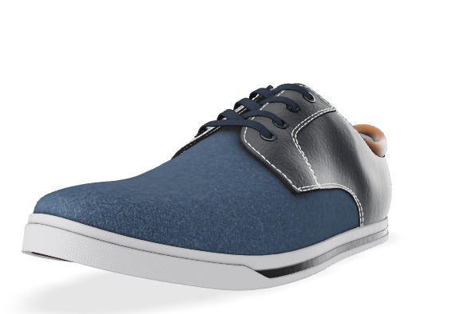
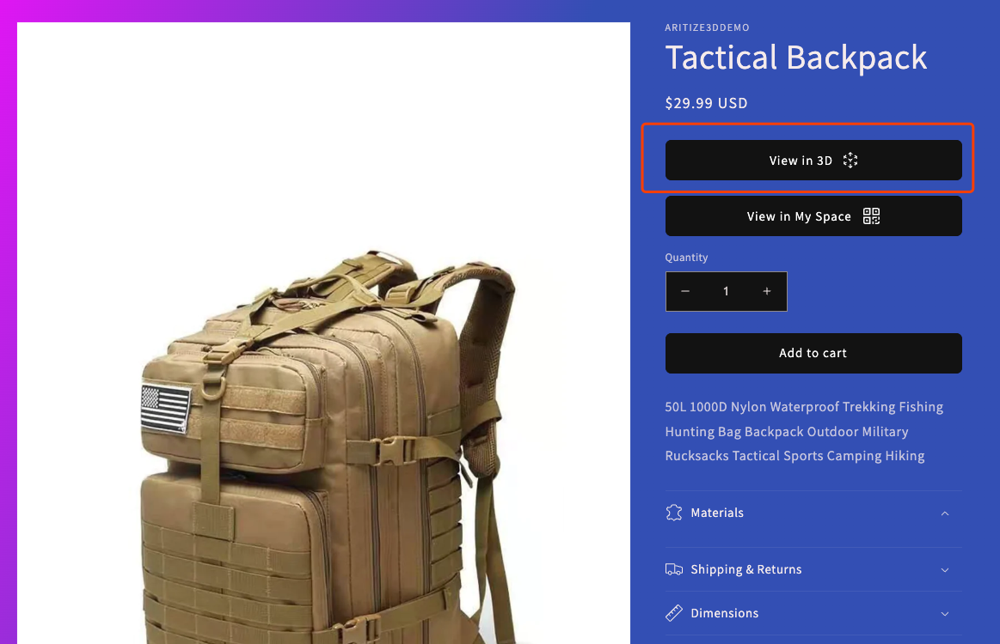
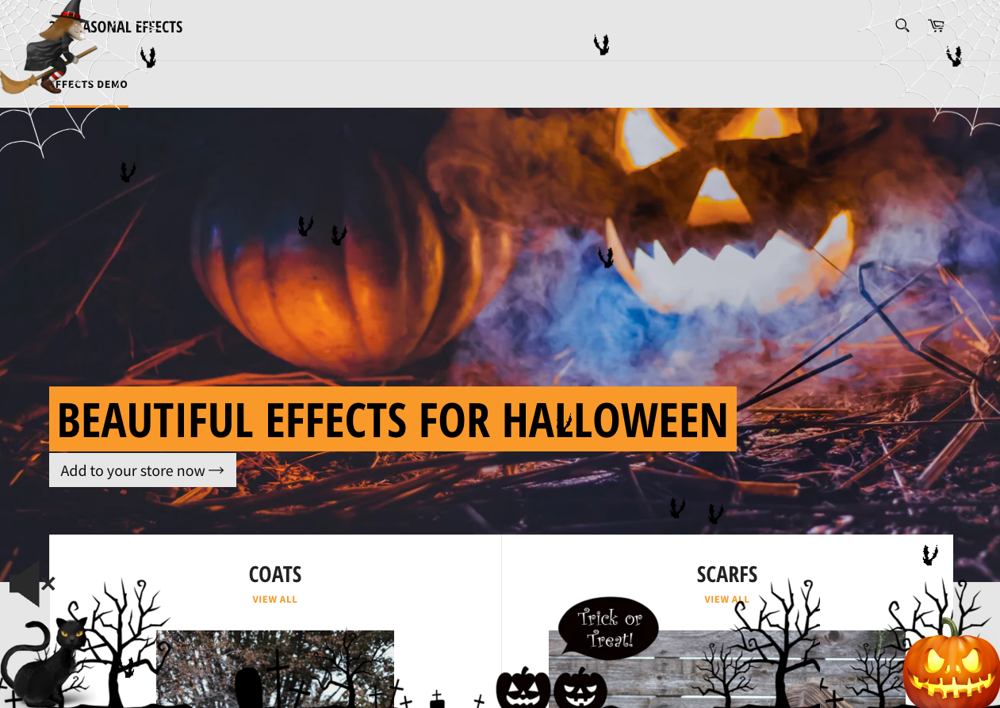
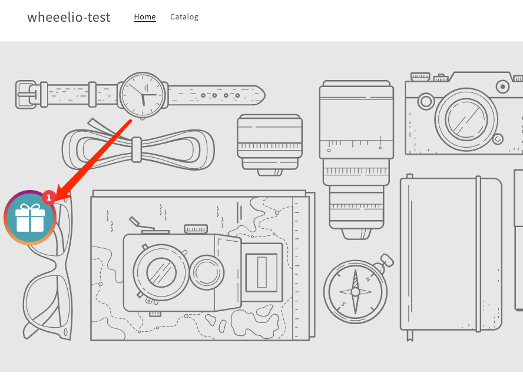
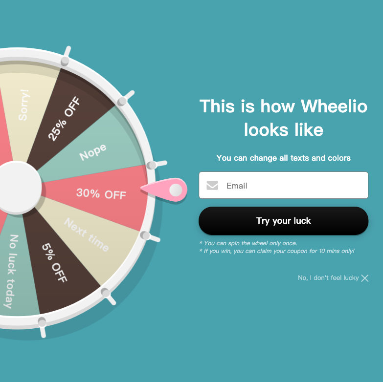

# 应用市场选出3个商业模型
## 0 精细模型 demo
[https://angle-3d-demo.myshopify.com/](https://angle-3d-demo.myshopify.com/)

## 1 ARitize3D - 3D/VR 单个商品展示和模型照片 AI 生成--view 按钮
 - 费用
	- 最低 9.99/月，可能因为模型复杂度额外收费。
		- 每个 SKU 9.99/月，最多 50个 SKU 
	- 30 天免费试用 
	- 3D 内容创作包含在每月托管费用中
- 有广告推荐
- 评论 0
- 演示商店
	- [https://aritize3ddemo.myshopify.com/](https://aritize3ddemo.myshopify.com/) 
	
	
### 使用 ARITIZE 3D 创建、参与和改造您的在线商店
ARitize 3D 是您的一站式 AR 解决方案，以无与伦比的价格自动创建和配置 3D 模型。我们的人工智能 (AI) 会将您现有的 2D 产品图像转换为高质量的 3D 和增强现实体验。这是转换您的 Shopify 网站的一种快速简便的方法！
### 自动化和可扩展性
Nextech AR Solutions 的 ARitize 3D 是第一个垂直集成的 AI 驱动的元宇宙 3D 模型工厂。

我们已经将 3D 模型创建从“工艺生产”转变为“批量生产”。

通过 4 个简单的步骤创建您的模型和 3D 配置器：

- 安装我们的市场应用程序
- 开始创建产品的 3D 模型
- 告诉我们您的产品变化
- 在产品页面上发布引人入胜的 3D 内容

## 2 3D Seasonal Effects: Halloween 商店页面节日渲染
- 费用
	- 7天免费
		- 季节性效果和装饰每 100 次独特印象 20 美分，每月最高 5 美元
	- 1.9/月 所有特效免费
- 评论 5 星 100评论
- 演示商店
	- [https://winter-mode-snowfall-effect.myshopify.com/?utm-source=christmas-listing](https://winter-mode-snowfall-effect.myshopify.com/?utm-source=christmas-listing)

### 可用的装饰品和坠落效果主题
- 万圣节 - 可怕/幽灵女巫、南瓜（南瓜灯）、蜘蛛网和黑猫
- 春天 - 美丽的蝴蝶（蝴蝶）和粉红色的樱花树叶飘落效果
- 圣帕特里克节（St. Patrick day）——三叶草、啤酒、帽子和三片叶子
- 复活节 - 可爱的兔子，复活节彩蛋
- 母亲节
- 情人节 - 爱心、亲吻、嘴唇、泰迪熊等
- 除夕 - 霓虹闪烁的灯光和落下的 2023 年代
- 夏季 - 落日、沙滩球等
- 冬季 - 下雪（降雪）、雨和雾
- 秋天 - 落叶
- 圣诞节 - 圣诞老人、雪人、冬季特卖等
- BFCM（黑色星期五网络星期一）-销售标志和气球墓地页脚
- 7 月 4 日-烟花和美国 (美利坚合众国) 国旗
- 骄傲月 (Gay / LGTB / LGTBQ) - 五颜六色的装饰品和坠落效果
- 英国女王白金禧年
- 加拿大独立日 - 7 月 1 日	

## Original Wheelio spin pop‑ups (打折卷互动游戏)
- 费用
	- 14.92/月
- 评论 4.8 星 405 评论
- 演示商店
	- [https://wheeelio-test.myshopify.com/](https://wheeelio-test.myshopify.com/) 

### 定价方案
- 基本
	- 14.92 
	- 每月 30.000 次展示 
- 2级
	- 29.92 
	- 每月 60.000 次展示 
- 3级
	- 54.92 
	- 每月 100.000 次展示 
- 4级
	- 109.92 
	- 每月 250.000 次展示 
	
### 互动/游戏化是什么意思？
这意味着您可以忘记经典的恼人退出弹出窗口，它为您提供毫无价值的 10% 优惠券以换取您的电子邮件。你是什​​么意思不值钱？很简单，您是否（个人）在其他网站上使用它们？不是真的，对吧？那么，为什么您认为其他用户会在您的网站上使用它们？

- 它是如何工作的
	Wheelio 背后的逻辑非常简单。游戏化是让用户更放松并更有可能参与我们的弹出窗口的关键。当访问者面对一个普通的弹出窗口时，他并不觉得他真的赢得了什么，或者他没有机会赢得一些东西来换取他的电子邮件。当访客面对 Wheelio 时，他觉得他有真正的机会赢得大奖，因此对优惠券的感知成倍增加，优惠券的价值飙升。

	因为获取用户的成本很高，而且一天比一天贵。如果您使用 Google Adwords、Facebook 或您为用户访问您的网站付费的任何其他广告渠道，这并不重要。您的最终目标不是访问，而是实际购买。如果您的最终目标没有在第一次访问中实现，那么您就是在浪费钱。

- 底线 - 为什么使用 Wheelio？
	你正在为流量买单，为什么你会把钱留在桌子上。您的大多数访问者不会在第一次互动时转换（购买），如果您让他们在没有电子邮件或信使选择加入的情况下离开，他们就会迷失方向。如果他们离开其中一个联系人，您就有更多机会向他们提供一些特别的东西并完成交易。让他们成为您的客户，即使他们想离开您的网站。
- 多种游戏化选项
	Wheelio、Rollie（老虎机）和 Scratchy（刮刮卡）
- 具有直接到结帐注入的动态优惠券以获得更高的转化率
- 电子邮件验证和重复预防
	我们以实惠的价格提供电子邮件验证。我们批量购买，因此我们可以提供这样的价格并使您的清单尽可能健康。
- Google 合规性和 GDPR
	完全符合谷歌的愿望，完全保存使用。完全符合 GDPR，并配备了一名数据保护官。

	触发器（应用程序的显示方式）- 迄今为止市场上最先进的 * 退出弹出式触发器（桌面和移动设备） * 时间触发器 * 选项卡触发器 * 滚动长度 * 关于点击或按钮等事件 * 弹出通知
- 自定义背景
- 活动
	管理和跟踪发生的一切。A/B 拆分测试。
- 展示位置
	
	网站上的任何地方。通过我们的管理界面控制
- 多个主题和集成（电子邮件服务、SMS 和 Messenger）

