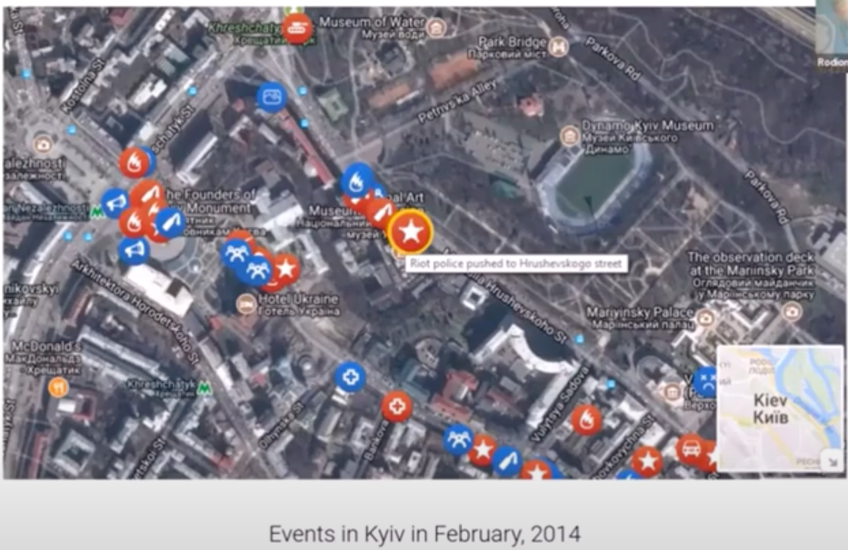
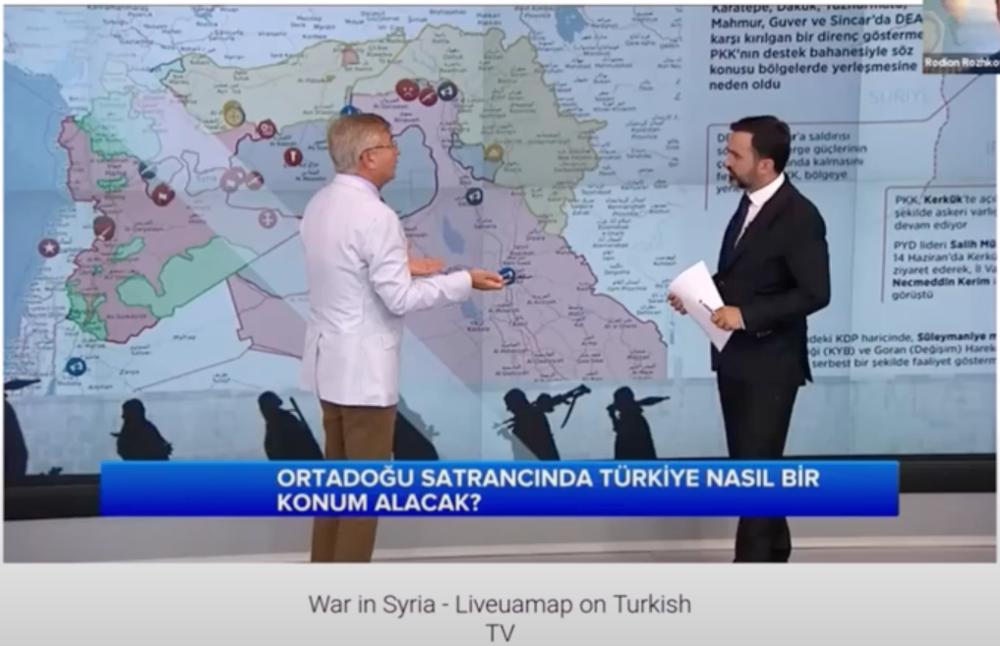
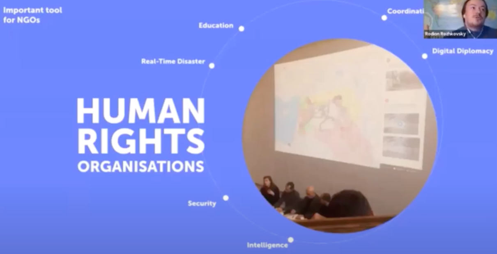
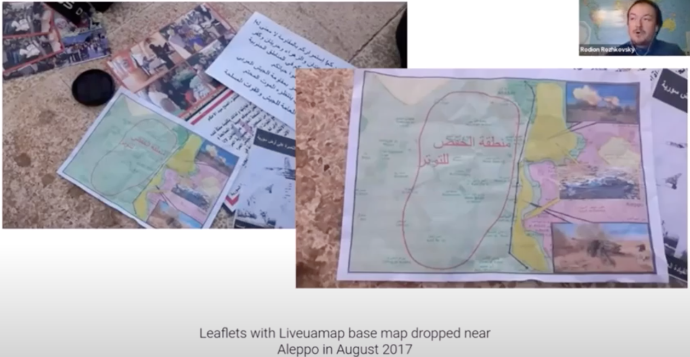
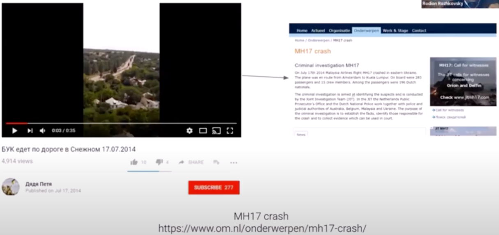
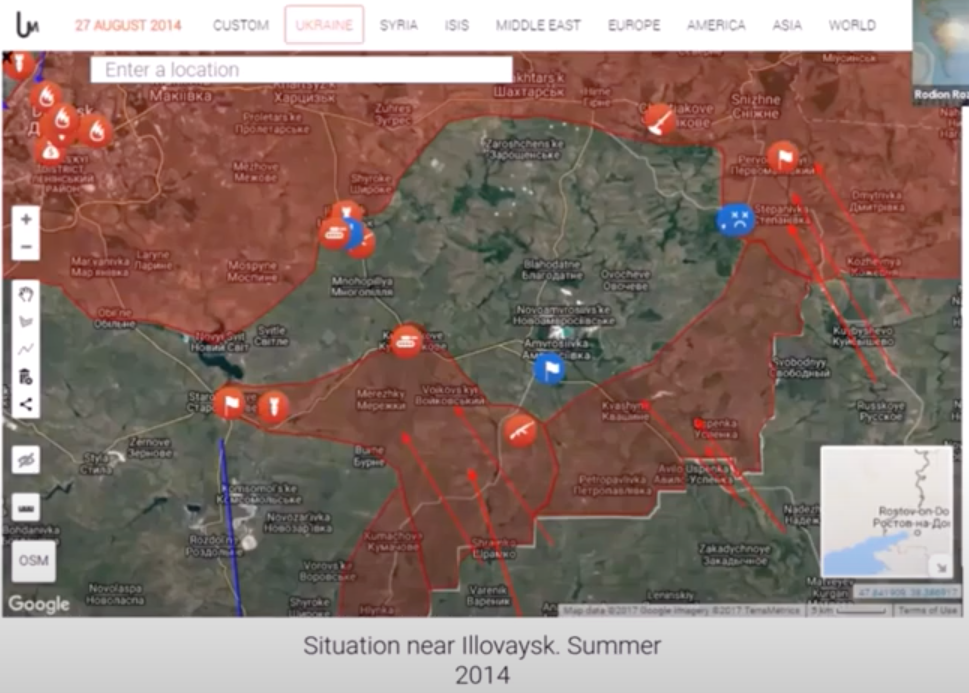

# liveuamap
## 简介
Liveuamap 是一款在线地图，提供有关世界各地冲突和安全事件的实时信息。也称为 `实时全民意识地图`

Liveuamap 用途55技术产品和服务包括 HTML5, jQuery, 和谷歌分析，根据 G2 Stack。
### 基础信息
- 行业
	- 新闻与媒体出版商 
- 公司成员
	- 11-50
- 公司等级
	- 645877
- 公司标签
	- 地理空间
	- 信息服务
	- 地图服务
	- 消息
- 组建于 2014 年-成立于 2016 年
	- 公司地点
		- 美国
- 产品支持
	- 网站
	- 移动端

### 网络流量统计
- 每月访问量
	- 36,049,722
- 每月访问增长
	- -27.62%   
- 全球流量排行
	- 2915
- 每月排行增长
	- 47.89%
- 参观时间
	- 967
- 跳出率
	- 72.6%
- 访问时长增长
	- -21.95%
- 页面浏览量/访问量增长
	- -3.39%
- 跳出率增长
	- 2.08%
- 年收入
	- 200-500万美元              
 
### 平台用户
- 非政府组织
- 人道主义组织
- 军队
- 政府

##  公司愿景
尽最大努力帮助世界各地的旅行者，在整个旅行过程中，就自己的所在地区安全做出有意识的决定，帮助预测和防御未来冲突，减少灾难

当前世界各地数百万人接受新闻和提高他们对冲突的认识方式，采集数据通过信息告诉人们，不要做什么

这个工具提供了一种蝴蝶效应的可能，让人类变得更好

## 网站技术分析
该公司是乌克兰公司，在俄乌冲突中，帮助乌克兰防范俄罗斯的信息作战带来的安全信息干扰，整个政府信息发布系统损坏。他们的想法是将乌克兰冲突事件提供在地图上，这样让人们更加直观的得到一手信息，通过 AI 对信息进行验证分析

### 数据采集
- 从当地的媒体头条收集并用 AI 进行验证
- 然后从社交媒体收集信息
- 信息收集先采集地区
	- 先是乌克兰本地热点信息
	- 然后扩大到叙利亚战争
	- 伊拉克战争
	- 世界各地的抗议活动
	- 各地的难民危机
	- 欧元危机
	- 白俄罗斯和波兰边境危机
- 学习处理不同语言的社交媒体数据采集和验证
	- 从乌克兰语和俄语开始
	- 类似的东西应用于世界各地
- 对于和平地区采集的数据略有不同
	- 所有关于犯罪
	- 灾难事件
		- 飓风袭击 

	
	 
### 产品被不同的组织引用
- 被土耳其电视台媒体采用，就类似天气预报来讨论发生了什么

	
- 人权组织引用

	
- 叙利亚政府投放了带有我们地图的传单，传单打印地图信息，并表示武装分子被包围，写着投降或者死亡

		
	
### 举例子
- 例子1 MH17 坠毁

	
	
	- 2014年7月17号，俄罗斯封锁了所有的信息的情况下，在 Twitter 上就可以找到关于 MH17 的信息
	- 所以相信在这个信息下，有非常强的放空系统就已经部署在那里
	- 俄罗斯宣传飞机被乌克兰击落
	- 在整个信息中，我们系统监控到了所有信息，最终判断他们击落了一架民航飞机
	- 这个事件还帮我们加入了调查小组，我们把我们收集到的数据提供给了调查组，调查组可以溯源找到证人 
- 例子2

	
	
	我们的数据从社交媒体中可以清晰看到在 2014 年通过事件展现了乌克兰军队在某地区被包围，但当时却没有其他信息显示如此，但接下来的几天验证了这点，这导致多名乌克兰军人丧生。虽然这不是军事情报，但很明显证明了整个系统的价值
				  

 
##  参考
- [公司信息统计来源](https://www.crunchbase.com/organization/liveuamap)
- [公司信息统计来源2](https://www.similarweb.com/website/liveuamap.com/#overview)