# UML 类图设计
## 1 类图概述
- UML: 统一建模语言(Unified Modeling Language，UML) 是用来设计软件的可视化建模语言。

	它的特点是简单`统一`、图形化、能表达软件设计中的动态与静态信息。UML 从目标系统的不同角度出发，定义了
	
	- `用例图`
	- `类图`
	- 对象图状态留
	- 活动图
	- `时序图`
	- 协作图
	- 构件图
	- 部署图等 9 种图。

	类图: 类图(Class diagram)是显示了模型的静态结构，特别是模型中存在的类、`类的内部结构`以及它们`与其他类的关系`等。类图是`面向对象建模`的主要组成部分，简化了人们对系统的理解，类图是`系统分析和设计阶段`的重要产物，是系统`编码和测试`的重要模型。
	
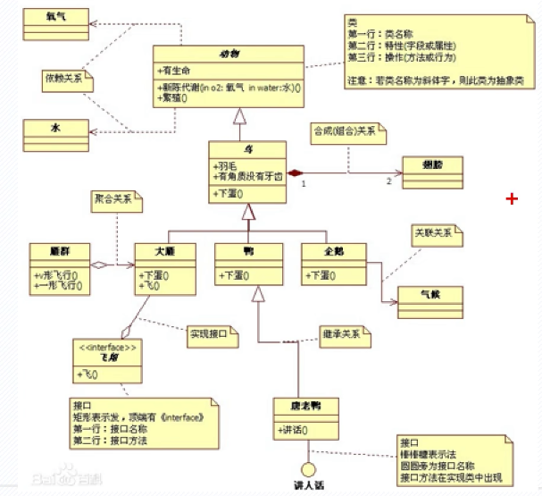

## 2 类的表示
- 普通类:

	在 UML 类图中，类使用包含 `类名、属性(field) 和方法(method)` 且带有分割线的矩形来表示，比如下图表示一个 Employee 类，它包含 nameage 和 address 这3个属性，以及 work() 方法

	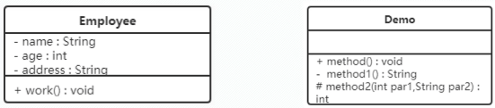

		- Employee
			- name : String
			- age : int
			- address : String
			+ work0 : void
		- Demo
			+ method0 : void
			- method10 : String
			# method2(int par1,String par2) :int

	- 访问权限
		- `+` 表示 public
		- `-` 表示 private

			属性的完整表示方式是: 可见性 名称 : 类型 [ = 缺省]
		- `#` 表示 protect

			方法的完整表示方式是: 可见性 名称(参数列表)[ : 返回类型]
- 抽象类

	在UML类图中

	1. `抽象类`类名称用`斜体`表示，`抽象方`法用`斜体`表示
	2. `抽象类图边框用虚线表示` (建议)

	图形表示
	
	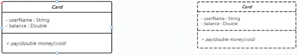
		
		- Card
			- userName : String
			- balance : Double
			+ pay(double money):vold
- 接口

	在 UML 类图中
	
	1. 接口名称用斜体表示，抽象方法用 `斜体` 表示
	2. `接口取消属性栏(建议)`
	
	图形表示
	
	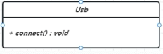
	
		- Usb 
			+ connect() : wold

## 3 类与类关系表示-关联
### 3.1 关联关系(Association)
关联关系是`对象之间的一种引用关系`，用于表示一类对象与另一类对象之间的联系，如老师和学生、学生和课程等。关联关系是类与类之间`最常用的一种关系，一般引用的对象，会作为另外一个类的成员变量来使用`。关联关系分为一般关联关系、聚合关系和组合关系。
	
#### 3.1.1 一般关联
又可以分为

- 单向关联
- 双向关联
- 自关联

1. 单向关联
	
	在UML类图中单向关联用 `一个带箭头的实线` 表示。下图表示每个顾客都有一个地址，这通过让 `Customer` 类持有一个类型为 `Address` 的成员变量类实现
	
	
	图形表示
	
	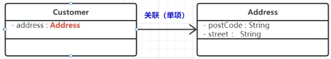
		
		- Customer
			- address : Address
		- Address
			- postCode : String
			- street :String		

	code表示
	
	- Customer
		
			public class Customer {
				private Address address;
				private Product product;
			}
	- Address	
		
			public class Address private {
				String postCode;
				private String street;
			}
2. 双向关联

	双向关联就是双方各自持有对方类型的成员变量
	
	在 UML 类图中，`双向关联用一个不带箭头的直线表示`。下图中在 `Customer` 类中维护一个 `Product`，表示一个顾客限定一个商品;
	
	在 Product 类中维护一个 Customer 类型的成员变量表示这个产品被哪个顾客所购买。
	
	图形表示

	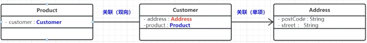
	
		- Product
			- customer: Customer
		- Customer
			- address : Address
			- product : Product
		- Address
			- postCode : String
			- street : String
	
	code表示
	
	- Customer
		
			public class Customer {
				private Address address;
				private Product product;
			}
	- Address	
		
			public class Address private {
				String postCode;
				private String street;
			}
	- Product

			public class Product {
				private Customer customer;
			}		
			
3. 自关联(描述树结构)

	自关联在 UML 类图中`用一个带有箭头且指向自身的线表示`。下图的意思就是 Node 类包含类型为 Node 的成员变量，也就是“自己包含自己”

	图形表示

	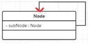
	
		- Node
			- subNode : Node
	code 表示
	
	- Node
	
			public class Node {
				private Node subNode;
			}		
							
#### 3.1.2 聚合关系
聚合关系 (aggregation)聚合关系是关联关系的一种，是强关联关系，是整体和部分之间的关系。

聚合关系也是通过成员对象来实现的，其中成员对象是整体对象的一部分，但是`成员对象可以脱离整体对象而独立存在`.

例如，在开发教务系统的时候，可以有两个单独的模块，`大学信息模块` 和 `教师信息模块`，都可以独立存在

图形表示

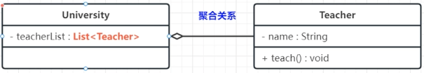

	- University
		- teacherlist : `List<Teacher>`
	- Teacher
		- name : String
		+ teach() : void

code 表示

- University(独立模块，可以增删改查)

		public class university {
			private List<Teacher> teacherList;
		}
- Teacher(独立模块，可以增删改查)

		public class Teacher {
			private string name;
			public woid teach(){
			
			}
		}	
 
#### 3.1.3 聚合关系补充:
聚合关系是关联关系的一种，是强关联关系，是整体和部分之间的关系，整理和部分并不是只表示1对多关系，1:1关系只要是表示整理包含部分，能代表强关联关系，就可以用聚合。

	程序中整体的类往往在加载的时候实例化部分的类

图形表示

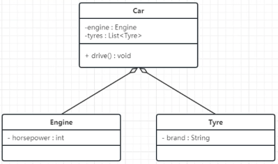

	- Car
		- engine : Engine
		- tyres : List<Tyre
		+ drive0 : void
	- Engine(也可以用关联关系，但聚合关系更贴切)
		- horsepower : int
	- Tyre
		- brand : String

code 表示

- Engine

		public class Engine {
			private int horsepower;
		}
- Tyre

		public class Tyre { 
			private string brand;
		}
- Car

		public class Car {
			//privote Engine engine = new Engine();
			// privote Tyre tyre = new Tyre();
			private Engine engine;
			private Tyre tyre;
		
			public car() {
				engine = new Engine();
				tyre = new Tyre();
			}
		}

#### 3.1.4 组合关系 (composition)
组合表示类之间的`整体与部分`的关系，但它是一种`更强烈的聚合关系`。在组合关系中，整体对象可以控制部分对象的生命周期，一旦整体对象不存在，部分对象也将不存在，`部分对象不能脱离整体对象而存在`。

	例如，订单表与订单项的关系，如果订单表不存在，订单项也不存在了。
	例如，在开发电商订单系统的时候，可以有订单信息模块单独存在，绝对不会存在订单项模块单独存在。

UML 类图中，`组合关系用带实心菱形的实线` 来表示，`菱形指向整体`。下图所示是订单表与订单项的关系图

图形表示

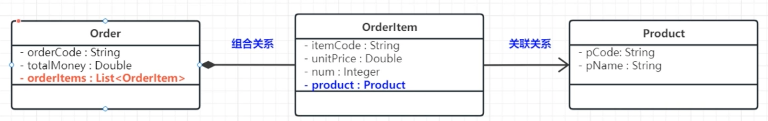

- Order
	- orderCode : String
	- totalMoney : Double
	- orderltems : List<Orderltem>
- Orderltem(组合关系，增删改查依赖 Order,与 Order 同生同死)
	- itemCode : String 
	- unitPrice : Double
	- num : Integer
	- product : Product
- Product(关联关系)
	- pCode: String
	- pName : String

code 表示

- Order

		public class Order {
			private string orderCode;
			private Double totalMoney;
			private Liste<0rderitem> orderItems;
		{
- Orderitem 

		public class Orderitem {
			private String itemCode;
			private Double unitPrice;
			private Integer num;
			private Product product;
		}
- Product 

		public class Product {
			private string pCode;
			private string pName;
		}

#### 3.1.5 依赖关系 (dependence)
依赖关系是一种`使用关系`，它是对象之间`耦合度最弱`的一种关联方式，是`临时性`的关联。在代码中，某个类的方法通过`局部变量、方法的参数或对静态方法的调用`来访问另一个类(被依赖类)中的某些方法来完成一些职责。

在 UML 类图中，依赖关系`使用带箭头的虚线`来表示，箭头从使用类指向被依赖的类。下图所示是人类和圆类的关系图人画圆:

图形表示

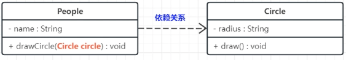

- People
	- name : String
	+ drawCircle(Circle circle) : void
- Circle
	- radius : String
	+ draw() : void						

code表示

- People
	- 通过方法参数调用
		
			public class People {
				private string name;
				private Integer age;
			
				public void drawCircle(Circle circle) { <- 方法参数
					systen.out.printin("人画圆");
					circle.draw();
				}
			}
	- 通过局部变量

			public class People {
				private string name;
				private Integer age;
			
				public void drawCircle() {
					Circle circle = new Circle(); <-局部 
					systen.out.printin("人画圆");
					circle.draw();
				}
			}	
- Circle
	- 动态
		
			public class Circle {
				private Integer radius;
				public void draw() { System.out.println( "画圆半径: "+this.radius+"的圆"); }
			}							
	- 静态

			public class Circle {
				private Integer radius;
				public static void draw() {
				}
			}

#### 3.1.6 继承(泛化)关系 (Inheritance) 
继承关系是对象之间 `耦合度最大` (父类改变，子孙类都要改变)的一种关系，表示一般与特殊的关系，是父类与子类之间的关系，是一种继承关系在UML 类图中，泛化关系用 `带空心三角箭头的实线`来表示，箭头从子类指向父类。在代码实现时，使用面向对象的继承机制来实现泛化关系。例如，Student 类和 Teacher 类都是 Person 类的子类，其类图如下图所示:

图形表示

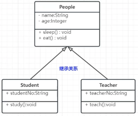

	- People
		- name:String
		- age:integer
		+ sleep() : void
		+ eat() : void
	- Student
		+ studentNo:String
		+ sludy():void
	- Teacher
		+ teacherNo:string
		+ teath():void
code 表示
	
- People

		public class People {
			private String name;
			private Integer age ;
			pubuic void eat() { system.out.println("吃饭"); }
			pubuic void sleep() { system,out.println("睡觉");}
		} 
- Student

		public class Student extends People {
			private string studentNo!
		
			public void study() { systen.out.println("学生学习"); }
		}	
- Teacher
	
		public class Teacher extends People {
		
			private String teacherCode;
			
			public void teach() { systen.out.println("上课 "); }
		}

#### 3.1.7 实现关系(Implementation)
实现关系是`接口与实现类`之间的关系。在这种关系中，类实现了接口，类中的操作实现了接口中所声明的所有的抽象操作。

在UML 类图中，实现关系`使用带空心三角箭头的虚线`来表示，箭头从实现类指向接口。例如，鼠标和键盘实现了USB接口，如图所示:

图形表示

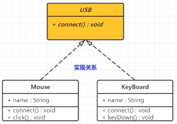

	- USB
		+ connect0 : void
	- Mouse
		+ name : String
		+ connect0 : woid
		+ click() : void
	- KeyBoard
		+ name : String
		+ connect() : void
		+ keyDown() : void
code 表示

- USB

		public interface USB {
			void connect();
		}	 			
- Mouse

		public class Mouse implements USB {
			private String name;

			public String getlame() { return name; }
			
			public void setName(String name) { this.name = name; }
			
			public Mouse() {
			
			}
	
			public Mouse(String name) { this.name = name; }

			@0verride
			public vold connect() { System.out.println(name + "成力的接入了设备了~~"); }

			public void click() { system.out.println(nane +"一键三连~~");}
		}	
- KeyBoard								

		public class KeyBoard implements USB {
			private String name;
	
			public String getNane() { return name; }
	
			public void setName(String name) { this.nane = name; }
	
			public KeyBoard(String nane) { this.name = name; }
	
			@override
			public vold connect() { system,out,println(name + "成力的接入了设备了~~");} 
	
			public vold keyDown() { system,out.println(name + "输入:老铁，6666--~"); ]
		}

### 3.2 总结
依赖、关联、聚合和组合，这4种关系所表现的强弱程度依次为:

Composite > Aggregation > Association > Dependency

组合>聚合>关联>依赖

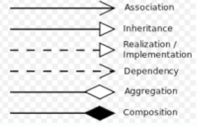

关联、聚合和组合是大家经常容易混淆的3种关系，这种关系最大的区别在于对象的生命周期。

1. 关联关系

	每个对象都有自己的生命周期，对象之间不存在从属关系
2. 聚合关系

	整体和部分是可以分离的，整体和部分都可以拥有各自的生命周期
3. 组合关系

	整体和部分是不可以分离的，整体的生命周期结束时，也意味着部分的生命周期结束.
	
## 4 实践-组装电脑
UML类图设计:

根据已完成的程序，重新还原 UML 类图设计.

- zcase
	- cpu
		- c AmdCpu(子类)
		- c IntelCpu(子类)
		- c Cpu(抽象类)
	- memory
		- c AmdMemory(子类)
		- c IntelMemory(子类)
		- c Memory(抽象类)
	- usb
		- c KeyBoard
		- c Mouse
		- i USB
	- c Computer
	- c MainTest

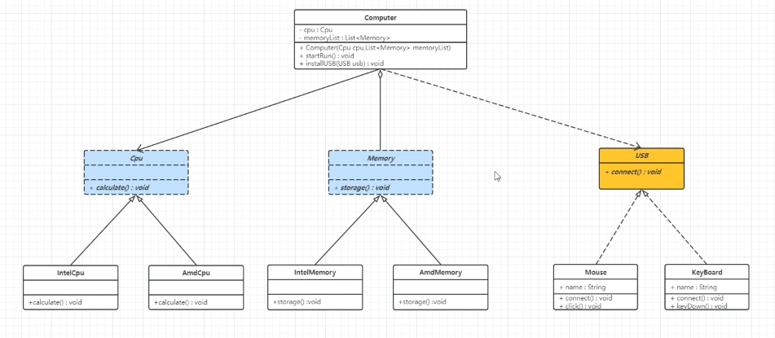

## 参考
[UML类图设计](https://www.bilibili.com/video/BV1H84y1j7HQ?p=12&spm_id_from=pageDriver&vd_source=f6f37263151dcfb42f0a8663116bb22b)
	