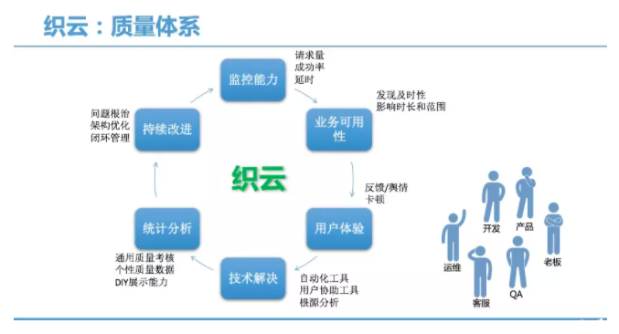
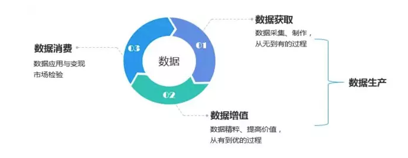
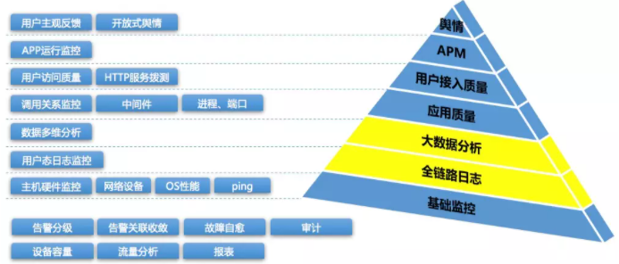
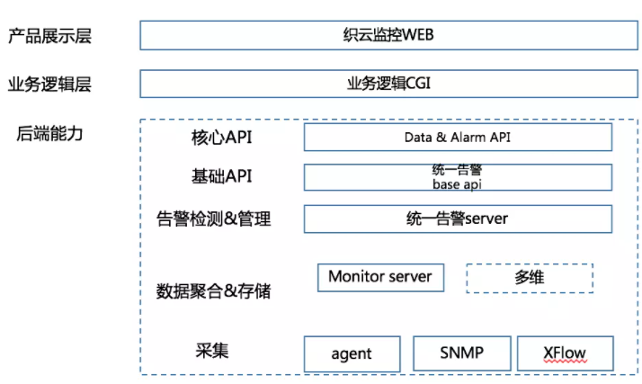
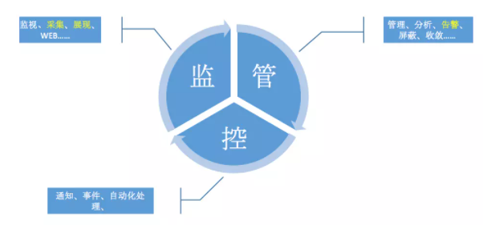
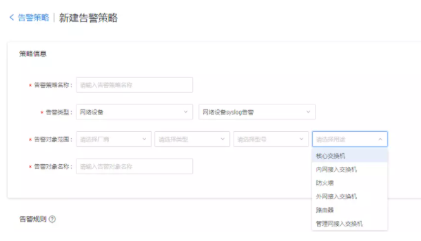

# 监控产品设计
## 产品定义
通过技术手段发现服务异常，持续优化业务可用性与用户体验。这句话的关键词是 

- 发现
- 持续优化
- 可用性与体验

## 监控的方式
- 主动

	程序内部埋点，服务主动上报自身的运行情况，一般都是具化为业务的各个属性或者指标，这种方式准、快，灵活性好，指标丰富。但是在非标准框架下会有一定的代码改造成本。
- 被动

	无需埋点，从外部探测或获取服务的运行情况，例如ping探测、日志采集分析等等。
- 旁路

	与程序逻辑无关，对服务质量与口碑的监控，例如舆情分析。

## 监控的类型
从大的对象范畴与层级关系来说，监控一般分为5种类型：

- 基础监控

	这里的基础监控囊括范围比较广主要指IAAS层(服务器、系统、网络等)
- 服务端监控

	一般指的是后台服务了，例如QQ的后台消息服务
- 客户端监控

	一般指app了，手Q的客户端与微信的客户端。
- WEB监控

	一般指站网站了，例如对网站域名的拨测。
- 用户端监控

	一般指用户舆情监控，例如某个APP的口碑好坏

## 监控的目标
一个好的监控体系应该要达到以下三点目标：

- 全：监控对象的广度，监控点的覆盖率，例如上文提到的5种对象类型是否都能覆盖到
- 快：监控的性能，数据流的处理能力
- 准：智能分析与收敛、监控对象收拢

## 监控的本质
在DevOps中，运维、开发、测试这三个角色应该视角统一，所有的业务监控都可以抽象出三个核心指标，用这三个关键指标来判断服务的可靠性，通过可靠性可以推算出可用性，并且可以间接反映用户使用产品的的体验：

- 请求量
- 成功率
- 耗时

		值 -> 请求量成功耗时 -> 对比波动阈值分布 -> 图表

## 监控的目的
持续优化业务服务质量，并建设质量体系

- 可靠性
- 可用性
- 用户体验

- 成本
- 效率
- 质量

质量体系

## 监控告警的产品属性
监控告警是一款数据类属性的产品，既然是数据类产品，那么在产品设计的时候一定要注意这样的路径闭环 
`数据生产-> 数据增值–>数据消费`，围绕着这样的路径我们就可以勾勒出很多的用户故事，用户故事就是针对具体的角色，会有什么具体的活动，这个活动所产生的价值。

举个例子，来说明数据生产与数据消费。随着后面详细的讲述产品建设过程中会更加详细的阐述这个闭环的路径。

- 数据生产

	例如一台服务器上报的各种基本的OS指标数据，例如CPU使用率，内存使用量等。这就产生了若干待消费的原始数据，那么我们能用这些数据干什么呢？
- 数据消费

	对这些上报的原始数据整理可以用作视图展示，例如图形化展示该服务在最近一个小时的 cpu 使用率。 又或者对这些原始数据设定阈值，当超过某个阈值的时候，就产生告警通知。这些都是最直接的消费的场景。

再延伸一步对于这些消费场景产生的告警数据，是否可以在进一步消费呢？例如对若干承载 Cpu 计算型业务的服务器所产生的 cup 使用率告警(生产)时间进行分析统计(消费)，是不是可以基本推导出该业务的服务高峰期是大概在那个时间范围呢？多数原子数据并无单一的消费或者生产的属性，而是要取决于在具体的场景与所处的数据链条中的角色。

	并且监控告警的数据加上特定的流程（ITSM）也可以驱动监控告警+自动化的大的业务逻辑交互闭环

## 监控体系
体系，泛指一定范围内或同类的事物按照一定的秩序和内部联系组合而成的整体，是不同系统组成的系统。其实这个描述是有些抽象的，咱们用大白话套用监控体系来解读下。

对于一个有一定体量的公司，需要一些不同的监控系统，通过系统与系统间的内部交互来组成一个大的整体，从而完成对不同场景下的监控需求即监控体系。用我们内部来举例说，我们内部在现网上跑的监控系统也有快10套了，同样在构建体系时关键的部分也是要用动态的视角去看待这些系统所产生的数据，而不是每个系统都是一个孤立的数据孤岛。下图是织云整体的监控体系。

根据公司体量建设监控体系，但三种系统必有

- 基础监控
- 应用监控
- 舆情监控

## IAAS 监控
- 状态的监控：通指设备的的状态，如设备的存活状态、网络设备的端口状态、电源、风扇状态等。
- 性能监控：通指设备内存大小，端口流量包量、CPU利用率 等等
- 质量监控：通指设备的丢包率、错包率、网络访问的延时等等
- 容量监控：通指设备的负载使用率、专线带宽使用率、网络设备的负载使用率、服务器的负载使用率等等。

## 监控分层

- 数据采集

	通常来说企业级的监控系统应该是支持多种采集方式与多种采集对象的，例如可以用 Agent 主动上报、也要能支持 SNMP、Xflow、IPMI 等多种协议。而针对于 IaaS 层具体支持的采集对象应该不少于 
	
	- 物理服务器
	- 操作系统指标（linux&windows）
	- 网络设备
	- 网络内会话信息
	- 物理专线
	- 网络出口等等

	不同的采集对象采用的采集方式也是不同的，例如 服务器系统指标可以用 Agent 上报、网络设备状态、流量、包量可以用 SNMP 采集等，具体采用哪种采集方式要看业务场景与所需场景的数据量与类别而定。织云同样也是支持多种采集方式与多种采集对象。

在大数据的时代背景下，数据采集这部分建议针对某一个具体的对象尽量采集的大而全，可能有些数据暂时看采集上来没有直接用途，但是随着数据量级与数据间关联性的变化，对大量的原始数据，清洗、分析、加工后便能催生更多的数据消费场景。

- 基础概念

	监控告警是对某一个具化的对象做采集、存储、分析、展示、告警、处理的过程。
	
	
	
	- 告警（监控）对象
		- 定义：CMDB 中管理的一个具体资源对象或者是一个自定义逻辑 CI
		- 示例：一台物理服务器、一个三级业务、一个TDSQL实例，这些均是对象
		- 备注：对象与对象之间也有是关联、包含、继承等关系
	- 告警（监控）指标
		- 定义：一个或多个特性 id（或特性间的四则运算产生的结果）的集合
		- 示例：CPU使用率、内存使用率均是特性id; 而 例如 成功率=（成功的请求总数/总请求数）*100 这个就是多个特性id的四则运算。
		- 备注：并不是所有监控指标都可以用来做有效的告警指标，这部分是按需所用。
	- 告警（监控）类型
		- 定义：确定了一部分的告警对象的告警指标采取一类的算法计算
		- 示例：单机性能告警（就包含了多个针对于服务器这个对象的监控告警指标，如 cpu使用率、内存使用率、应用程序内容使用量等）
	- 告警规则
		- 定义：告警对象+告警指标+告警产生条件+告警通知收敛规则（阈值、发生次数、统计时长等等），应用于告警策略
		- 示例：例如对某台交换机创建了，cpu使用率>80时的告警规则
	- 告警策略
		- 定义：告警对象+告警类型+告警规则（可多个） 对应一个告警策略
		- 示例：对一个三级业务下的全量服务器创建了一条基础告警策略，下图中的每一条都是一个告警规则
	- 告警
		- 定义：告警对象的告警指标满足告警产生条件后产生的对象
		- 示例：[腾讯织云] [ping告警] [15:38:10] [Ping 192.192.192.192 不可达]

- 网络流量

	对于网络出口与网络专线的有效监控与分析，即能有效的协助业务运维同学有效的定位业务异常、评估业务服务质量等，也能有效的度量业务整体运营成本，毕竟现在带宽的使用成本在整体运营成本中也是占比越来越大。相信运维同学多少都会遇到下面的场景

	- 例如这条专线当前利用率多少？
	- 在已经使用的流量中，某个ip使用了多少流量？
	- 这些所产生的流量是基于什么协议与方向？
	- 专线与网络出口的丢包率与时延是怎么样的？
	- 每条专线中主要是哪些业务在用？哪个是“”地主客户“”？
	- 等等较高频的使用场景。对于网络流量的监控与分析来说主要依靠的FLOW。

		那么什么是FLOW呢？

		Flow 是一种数据交换方式，其工作原理是：Flow利用标准的交换模式处理数据流的第一个IP包数据，生成Flow 缓存，随后同样的数据基于缓存信息在同一个数据流中进行传输，不再匹配相关的访问控制等策略，Flow缓存同时包含了随后数据流的统计信息。

		一个Flow流定义为在一个源IP地址和目的IP地址间传输的单向数据包流，且所有数据包具有共同的传输层源、目的端口号。

		相对于会话（“Session”）而言，“Flow”具备更细致的标识特征，在传统的TCP/IP五元组的基础上增加了一些新的域值，至少包括以下几个字段： 
		
			 | 源IP地址 | 目的IP地址 | 源端口 | 目的端口 | IP层协议类型 | ToS服务类型（dscp） | 输入物理端口（ifindex） |   
		以上七个字段可以唯一地确定任意一个数据包属于哪个特定的Flow，换而言之任何一个字段出现了差异都意味着一个新Flow的发生

		对于FLOW的分析展示同样也是要基于多维度的，ip（目的与源）、port（目的与源）、业务、网络架构、城市、IDC等等众多的维度，具体所需的维度依赖于自己的业务场景。

		FLOW是厂商的私有协议，业界也有多种的Flow格式。例如CISCO、华为、juniper等等的主流厂商的flow也是均有一定差异性与优劣的，所以这部分的后台能力是需要有异构性的，织云基于腾云复杂的网络运维经验，目前是支持CISCO、华为、juniper 的不同FLOW。	

- 网络设备

	对于网络设备的监控，也一般从设备性能、质量、状态等维度入手。对于每台网络设备来说运维同学一般会关注如下场景：

	- 网络设备的运行状态Syslog（设备运行日志）的监控与告警
	- 设备堆叠状态下的（例如交换机堆叠）的监控与告警
	- 网络设备上每个物理端口的、流量、包量、错包与端口状态的监控与告警。
	- 网络设备上逻辑端口（物理端口组合）的性能与状态
	- ……………

	对于网络设备的 syslog 告警来说，同样也会面临不同的厂商、设备类型与设备型号日志标准不统一，所以对于网络设备 syslog 监控告警来说，首先是将众多的网络设备进行逻辑分组，以便于在一个分组内的设备均可以响应同一个告警关键字，并且这个分组粒度建议较细，这样才能保障告警关键字的有效性与独立性。在这里根据多年的运维经验，建议syslog告警的分组模型由四个维度组成厂商+类型+型号+用途，例如 CISCO+交换机+EX43000-24T+内网接入层交换机，通过这个公式就描述出一个设备的逻辑分组。
	
	
- 服务器

	对于服务器的监控同样也是从状态、性能与容量这几个维度入手。虽然SNMP也可以用于服务器监控，但相对于agent主动上报指标与数据会少很多。服务器的状态监控主要包含 服务器是否ping的通、agent上报是否超时与电源运行状态等等。对于性能与容量这两类维度，主要依赖当前OS的数据捕获，一般来说对于服务器监控来说在通用场景下主要关注cpu、内存、流量与包量这四个指标即可，但是别的指标也建议尽量捕获。 单个监控对象的数据丰富了会有如下好处。

	- 避免对象的监控盲点
	- 不同的监控数据点可以部分对应出该服务器所承载的业务特性指标，例如存储类业务也会关注 disk_total_read、svctm_time_max、await_time_max 等等系统指标
	- 生产的数据足够丰富能够催生出更加丰富的运维数据消费场景。

 