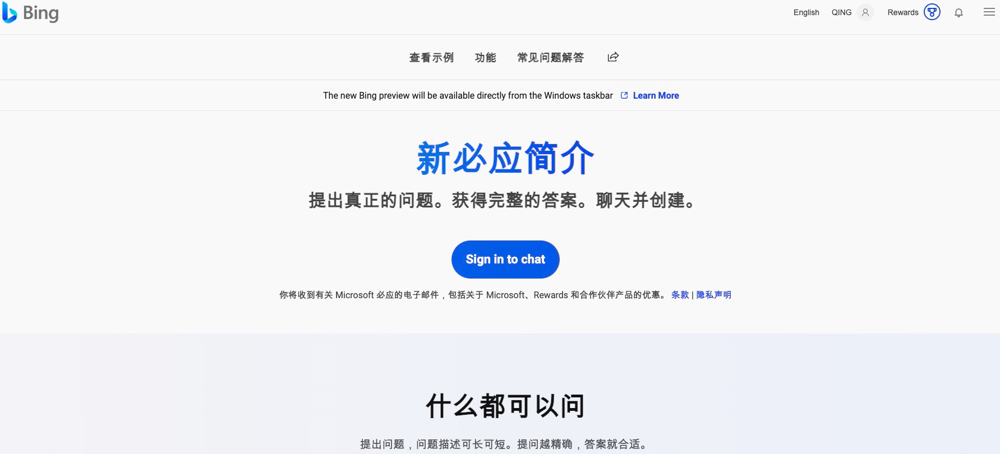
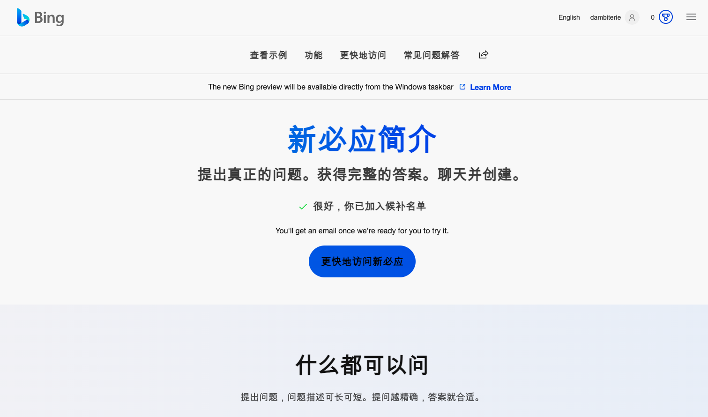
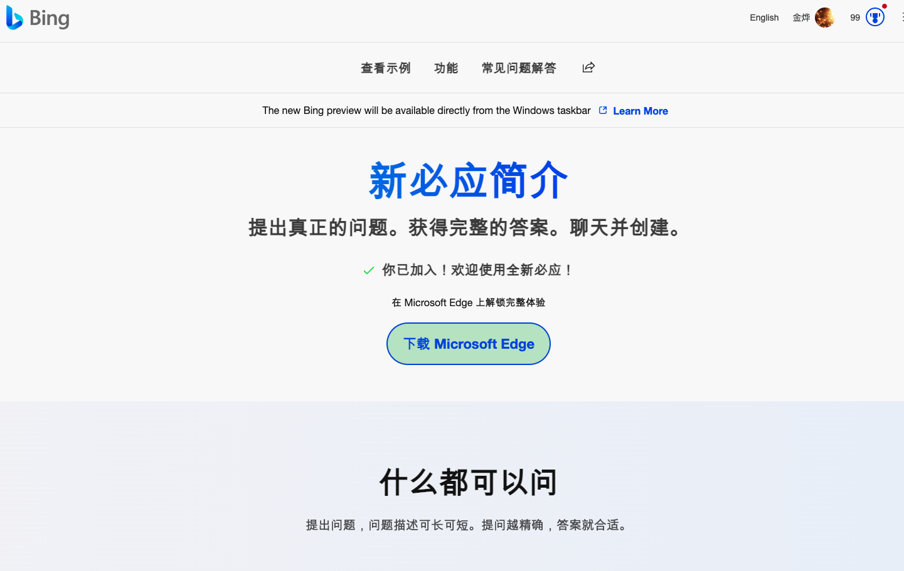
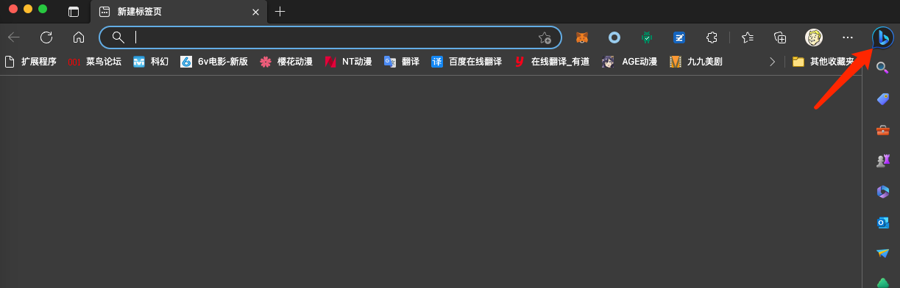
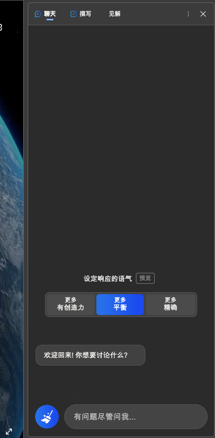
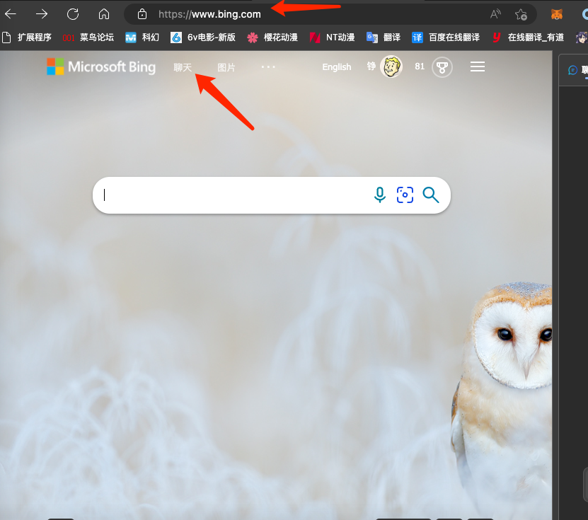
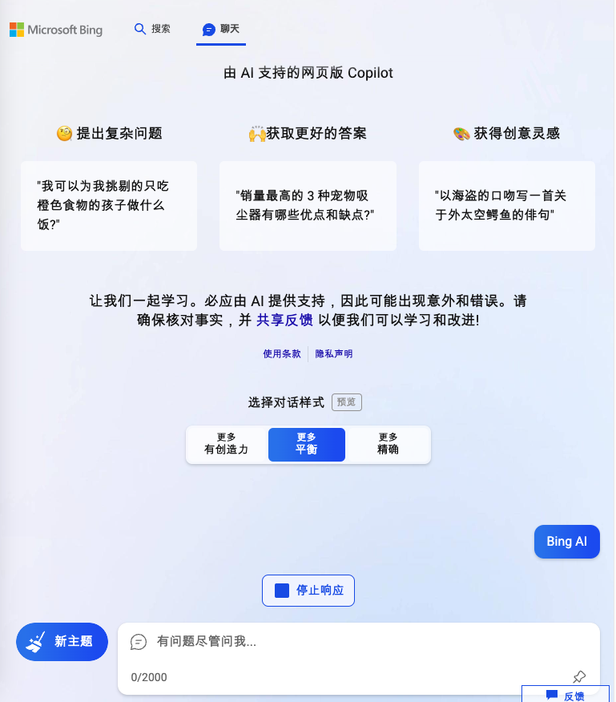

# 试用 BingAI 简单流程
## 安装新 Edge 游览器
- 卸载之前的游览器
- 安装新的 Edge
	- [选择自己系统版本下载安装](https://www.microsoft.com/en-us/edge/download?form=MA13FJ)

## 申请 BingAI 试用
- 设置魔法
	- 调整游览器系统代理
	- 设置魔法全局代理
- 注册
	- 注册微软账户 
	- 魔法打开 [www.bing.com/new](www.bing.com/new)
		- 如果模范设置问题，无法打开此账户 
	- 登陆微软账户
	- 点击 	Sign in to chat 申请

		
- 已经加入后补名单

		  
- 批准后

		

## 设置游览器
- 同步 Chrome 数据
- 打开设置 Edge 游览器
- 同步 Chrome 插件和标签
- 魔法
	- 全局魔法 
	- 或者 SwithchyOmega
		- 设置规则 *.bing.com
- 关闭 Edge 游览器重新打开，这步很重要

## BingAI 打开方法
### 方法1
- 重新打开点击 Bing 快捷键

	
- 打开这个界面后，就可以关闭魔法直接使用了

	

### 方法2
- 魔法打开 www.bing.com
- 等待
- 搜索出现聊天点击

	
- 打开 BingAI

	
	
## 试用心得
BingAI 和ChatGPT 并不相同，你可以理解成 BingAI 是属于 GPT 在搜索引擎里的应用

- BingAI 数据流程

	用户输入数据 -> 微软后台分析 -> 分析词句网络信息抓取 -> 用户输入信息与抓取信息同时打包 -> 送入 GPT 4 模型 -> 给出答案打上 url
- GPT 流程

	用户输入数据 ->	送入 GPT 3.5 模型 -> 信息输出
	
剩下的自己想象吧

		

	
		

		
		

	