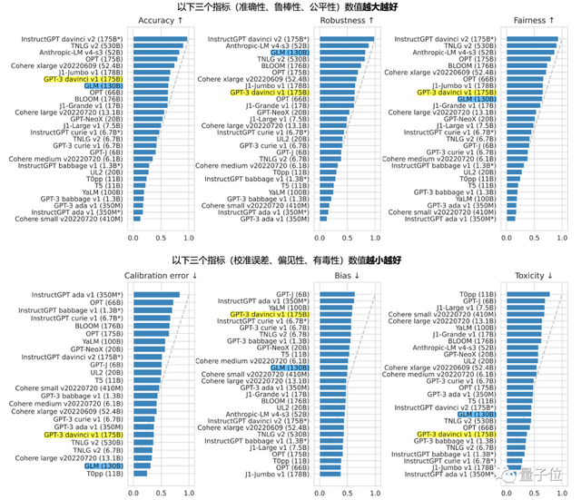
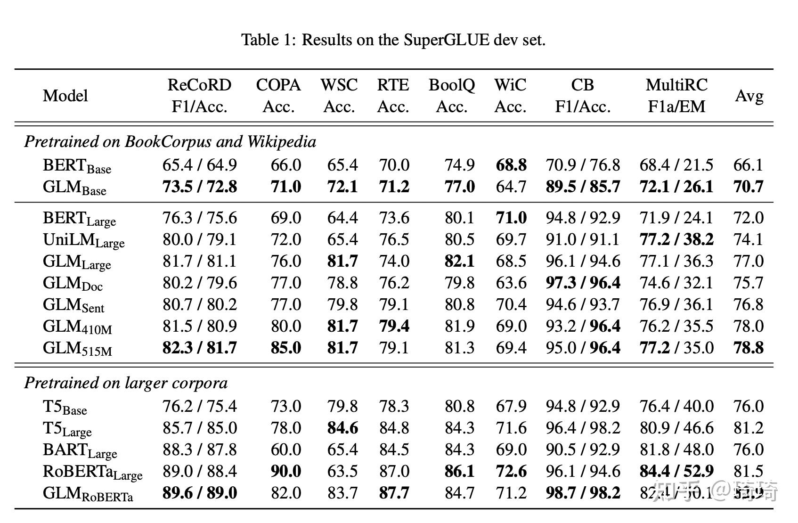

# ChatGLM-6B
2017 年，Google 提出了 Transformer 架构，随后 BERT 、GPT、T5等预训练模型不断涌现，并在各项任务中都不断刷新 SOTA 纪录。

2021 年 12 月，在清华大学知识工程实验室的一次内部头脑风暴会上提出的 GLM1（ACL'22）模型和 GLM-130B 项目的雏形。（[https://github.com/THUDM/GLM](https://github.com/THUDM/GLM)），不同于上述预训练模型架构，它采用了一种自回归的空白填充方法， 在 NLP 领域三种主要的任务（自然语言理解、无条件生成、有条件生成）上都取得了不错的结果。

清华基于 GLM 架构又推出了 GLM-130B ([https://keg.cs.tsinghua.edu.cn/glm-130b/zh/posts/glm-130b/](https://keg.cs.tsinghua.edu.cn/glm-130b/zh/posts/glm-130b/))，GLM-130B (ICLR'23) 是一个开源开放的双语（中文和英文）双向稠密模型，拥有 1300 亿参数，模型架构采用通用语言模型（GLM1）。

2022年5月6日开始在[智谱](http://zhipu.ai/)赞助 96 台 A100（40G*8）服务器上启动了 GLM-130B 模型的训练。在整个训练过程横跨两个月，在此期间，我们开始考虑训练完成后的推理解决方案，并在一台 V100（32G * 8）服务器上实现了合理速度的 130B 模型推理。目前，我们正与清华 NLP 实验室的 BMInf 团队一起探索在一台 RTX-3090 服务器（24G * 8）上使用 GLM-130B 推理的可能性，实现这一目标将可以使更多人用得起千亿模型。

截至 2022 年 7 月 3 日，GLM-130B 已完成 4000 亿个文本标识符（中文和英文各 2000 亿）的训练，它有以下独特优势：

- GLM-130B 大模型特点
	- 双语
		- 同时支持中文和英文。
	- 高精度(英文): 
		- 在公开的英文自然语言榜单 LAMBADA、MMLU 和 Big-bench-lite 上优于 GPT-3175B (API: davinci，基座模型) 、OPT-175B 和 BLOOM-176B 
	- 高精度(中文)
		- 在 7 个零样本 CLUE 数据集和5个零样本 FewCLUE 数据集上明显优于 ERNIE TITAN 3.0260B 和 YUAN 1.0.245B。
	- 快速推理
		- 首个实现 NT4 量化的千亿模型，支持用一台 4 卡 3090 或 8 卡 2080T 服务器进行快速且基本无损推理。
	- 可复现性
		- 所有结果(超过 30 个任务) 均可通过我们的开源代码和模型参数复现
	- 跨平台
		- 支持在国产的海光 DCU、华为异腾 910 和申威处理器及美国的英伟达芯片上进行训与造理位

在 Stanford 报告的30个世界主流大模型评测中，GLM-130B也成为了亚洲唯一入选的模型

ChatGLM 是由清华大学 KEG 实验室和智谱 AI 基于千亿基座模型 GLM-130B 开发的对话语言模型。ChatGLM 在 GLM-130B 的基础上持续进行文本和代码预训练并通过有监督微调等技术实现人类意图对齐，具备文案写作、信息抽取、角色扮演、问答、对话等能力。

ChatGLM-6B 是清华开源的一个小型对话模型,可以消费级显卡运行,  自 3 月 14 号发布以来受到了广大开发者和用户的喜爱，连续 12 天居 HuggingFace 全球大模型下载榜第一名。

- 优点特点
	- 充分的中英双语预训练
		- ChatGLM-6B 在 1:1 比例的中英语料上训练了 T 的 oken 量，兼具双语能力
	- 优化的模型架构和大小
		- 吸取 GLM-130B 训练经验，修正了二维 ROPE 位置编码实现，使用传统FFN结构。6B (62亿)的参数大小，也使得研究者和个人开发者自己微调和部署 ChatGLM-6B 成为可能
	- 较低的部署门槛
		- FP16 半精度下，ChatGLM-6B 需要至少 13GB 的显存进行推理，结合模型量化技术, 这一需求可以进一步降低到 10GB (INT8) 和 6GB (INT4) ， 使得 ChatGLM-6B 可以部署在消费级显卡
	- 更长的序列长度
		- 相比 LM-10B (序列长度 1024) ，ChatGLM-6B 序列长度达 2048，支持更长对话和应用。
	- 人类意图对齐训练
		- 使用了监督微调 (Supervised Fine-Tuning) 、反馈自助(Feedback Bootstrap)人类反馈强化学习 (Reinforcement Leamning from Human Feedback) 等方式，使模型初，理留人类指令意图的能力。输出格式为 markdown，方便展示。
- 缺点
	- 相对较弱的模型记忆和语言能力
		- 在面对许多事实性知识任务时，ChatGLM-6B 可能会生成不正确的信息，也不太擅长逻辑类问题（如数学、编程）的解答。
	- 可能会产生有害说明或有偏见的内容
		- ChatGLM-6B 只是一个初步与人类意图对齐的语言模型，可能会生成有害、有偏见的内容。
	- 较弱的多轮对话能力
		- ChatGLM-6B 的上下文理解能力还不够充分，在面对长答案生成和多轮对话的场景时，可能会出现上下文丢失和理解错误的情况。

## 训练原理
GLM-130B 利用自回归空白填充作为其主要的预训练目标，以图中的句子为例，它掩盖了随机的连续文本区间（例如，“complete unkown”），并对其进行自回归预测。

具体来说，GLM-130B 模型含有 70 层 Transformer，隐层维度 12,288，最大序列长度 2,048，以及一个基于 icetk 的 150,000 个标识符的双语分词器。

GLM-130B 对超过 4000 亿个双语标记（2000 亿英文和 2000 亿中文标记）进行了预训练。它的预训练目标由两部分组成：

- 第一部分（95%）是自监督的预训练，即在公开的大规模语料库以及其他一些较小的中文语料库上的自回归空白填充。
- 第二部分（5%）是在 T0++18 和 DeepStruct19 中 70 个不同数据集的抽样子集上进行多任务指令预训练，格式为基于指令的多任务多提示序列到序列的生成。

这种设计使 GLM-130B 可以在其他数据集上进行了零样本学习，以及从英文到中文的零样本迁移。

## 后续
- GLM-130B 的进一步训练

	最近的研究表明，大规模语言模型通常训练不足20。根据Chinchilla 的估计，一个 130B 语言模型的最佳训练标识符训练量应该是 4.0T 左右，比目前所训练的数量要大 10 倍。 
- INT8 量化

	GLM-130B 以 FP16 精度进行训练，总共需要 260G 的 GPU 内存来存储模型权重。DGX-A100 服务器提供了 320G 的 GPU 内存，所以可以天然地支持 GLM-130B。
	
	正在对 GLM-130B 模型进行 INT8 量化，以减少推理内存的需求，从而使 GLM-130B 有可能在具有较小 GPU 内存的服务器上运行（例如 8 卡 RTX 3090 GPU）。
- 混合专家（MoE）方法以扩展模型规模：

	混合专家模型（Mixture-of-Experts, MoE）已被证明是扩展模型参数的有效方法，然而，MoE 模型在相同规模下的表现并不如稠密模型好。正在尝试基于 MoE 技术对 GLM-130B 进行模型扩展，如通过 FastMoE23 及其加速版本 FasterMoE 来进一步扩大它的参数规模，以达到数万亿甚至百万亿规模的参数量，从而获得更高的性能表现。
- 参数高效 P-Tuning

	尽管大规模语言模型具有卓越的零样本和少样本学习能力，通过在下游数据集上对它们进行调整可以进一步提升在特定任务上的性能。然而，它们数量庞大的参数在微调中面临巨大的参数冗余和计算成本。基于我们以前的工作 P-Tuning24 和 P-Tuning v225，我们正在努力尝试将这些技术应用到 GLM-130B 中，以实现参数高效的迁移学习。

## ChatGLM-6B 2B 端任务优势和缺点
不同于C端任务的开放性和娱乐性，B端的任务具有领域性和标准性，要求能理解复杂 prompt，返回的结果必须准确且稳定。从任务上来看，B 端 NLP 任务主要有3个方面：

- 文本理解
- 文本生成
- 基于文本理解的生成

文本理解最主要的方面就是基于文档的问与答，回答往往要求结构化输出；文本生成最主要的方面就是任务型多轮对话，不仅要求准确理解用户意图，也要求严格遵守知识库准确回答，但话语又要丰富得体；基于文本理解的生成，最主要的方面就是基于长篇幅的文本理解，归纳总结返回目标信息，最常见的就是基于大规模文档的问答与推荐、基于功能块指令的文本生成。

不考虑结构化稳定输出，整体效果堪比 chatgpt3.5，如果 chatgpt4.0 是8分的水平，chatGLM也有5分的水平了。ChatGLM 目前主要的问题在于3个方面：

- 1) 可理解的文本长度有限，超过 1000 就很不稳定，超过 1700 基本就无能为力，这极大地限制了它可应用的场景，也是导致它在各类任务中不稳定的重要原因。
- 2) 在理解专业点的领域文本与 prompt 指令方面非常敏感，调试稳定的 prompt 非常困难，需要很专业的人小心谨慎调试 prompt中的用词和表述，这限制了它可适用的商业化落地场景，这可能与该团队缺乏相关训练语料积累有关。
- 3) 目前价格可真是太贵了，利润薄或者标的小的项目承受不了。

## 名词解释
时下主流的预训练框架及其区别。主要有三种：

- 1、自回归模型（autoregressive-AR模型）：代表作 GPT。

	本质上是一个 left-to-right 的语言模型。通常用于生成式任务，在长文本生成方面取得了巨大的成功，比如自然语言生成（NLG）领域的任务：摘要、翻译或抽象问答。当扩展到十亿级别参数时，表现出了少样本学习能力。缺点是单向注意力机制，在 NLU 任务中，无法完全捕捉上下文的依赖关系。
- 2、自编码模型（autoencoding-AE模型）：代表作 BERT。

	是通过某个降噪目标（比如MLM）训练的双向文本编码器。编码器会产出适用于 NLU 任务的上下文表示，但无法直接用于文本生成。
- 3、encoder-decoder（Seq2seq模型）：代表作 T5。

	采用双向注意力机制，通常用于条件生成任务，比如文本摘要、机器翻译等。

三种预训练框架各有利弊，没有一种框架同时在以下三种领域的表现都好

- 自然语言理解（NLU）
- 无条件生成
- 以及条件生成

## 参考
- [如何评价清华大学发布的GLM-130B](https://www.zhihu.com/question/554665350)
- [清华系ChatGPT发布！唐杰团队打造，专对中文优化，还能把握最新新闻动态](https://www.qbitai.com/2023/03/42940.html)
- [GLM-130B：开源的双语预训练模型](https://keg.cs.tsinghua.edu.cn/glm-130b/zh/posts/glm-130b/)
- [Demo](https://huggingface.co/spaces/THUDM/GLM-130B)