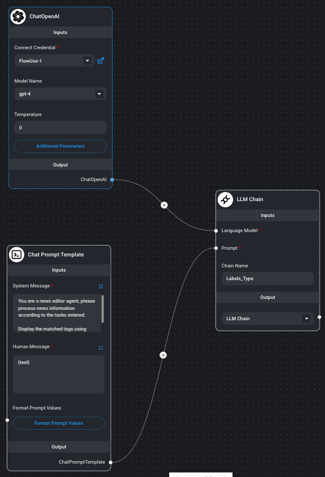
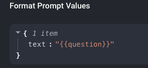

# Flowise 应用场景-文章模糊标签匹配
## 需求
给文章的标题进行模糊标签匹配，与之前不同之处在于标签可以动态增减。
## Flow 创建
- 创建 Flow 

	
- 配置 Flow
	- Chain 组件
		- 使用 LLM Chain
		- Chainname
			
				Label_type	 
	- Chat 模型
		- 模型配置 
			- gpt4
			
					注意 3.5 也可以，但结果不是很稳定
		- temperature

				0
	- 提示词模版
		- system message

				You are a news editor agent, please process news information according to the tasks entered.
				
				Display the matched label using only JSON format.
		- 提示词值格式

			
- 对话设计

		Title="$新闻标题内容"
		
		Label="$标题A,$标题B,...."
		
		Please identify the labels relevant to the headline,If there are no tags relevant to the headline, please display {"labels": "other information"}.
		
## 实验
### 实验方法
相同的语句，不同模型，重复跑多次,结果对比是否达到预期
### 测试1
- 语句

		Title="House prices in surprise October rise but still down on last year"
		
		Label="Social Security, Terrorist attacks, game,游戏,starcitizen"
	
		Please identify the labels relevant to the headline,If there are no tags relevant to the headline, please display {"labels": "other information"}.
- 结果
	- gpt 3.5 t-16k
		- {"labels": ["other information"]}
	- gpt4
		- {"labels": ["other information"]}

### 测试2
- 语句	
	
		Title="Sky and TalkTalk block suicide website linked to 50 deaths"
				
		Label="Social Security, Terrorist attacks, game,游戏,starcitizen"
				
		Please identify the labels relevant to the headline,If there are no tags relevant to the headline, please display {"labels": "other information"}.
- 结果
	- gpt 3.5 t-16k
		- {"labels": "Social Security"}
	- gpt4
		- {"labels": ["other information"]}
		
### 测试3
- 语句	
	
		Title="Covid inquiry: Read the private WhatsApp messages from inside Downing Street"
				
		Label="Social Security, Terrorist attacks, game,游戏,starcitizen"
				
		Please identify the labels relevant to the headline,If there are no tags relevant to the headline, please display {"labels": "other information"}.
- 结果
	- gpt 3.5 t-16k
		- {"labels": ["Social Security", "Terrorist attacks"]}
	- gpt4
		- {"labels": ["other information"]}

### 测试4
- 语句	
	
		Title="Star Citizen: trailer campagna singleplayer Squadron 42"
				
		Label="Social Security, Terrorist attacks, game,游戏,starcitizen"
				
		Please identify the labels relevant to the headline,If there are no tags relevant to the headline, please display {"labels": "other information"}.
- 结果
	- gpt 3.5 t-16k
		- {"labels": "game, starcitizen"}
	- gpt4
		-  {"labels": "game, starcitizen"}	
		
### 测试5
- 语句	
	
		Title="European shares hit two-week high on healthcare boost; Fed rate verdict eyed"
				
		Label="Social Security, Terrorist attacks, game,游戏,starcitizen"
				
		Please identify the labels relevant to the headline,If there are no tags relevant to the headline, please display {"labels": "other information"}.
- 结果
	- gpt 3.5 t-16k
		- {"labels": ["other information"]}
	- gpt4
		-  {"labels": ["other information"]}

### 测试6
- 语句	

		Title="Canadian Solar to build 5GW solar PV plant in the US - Investment Monitor"
						
		Label="solar photovoltaic,Home energy storage"
						
		Please identify the labels relevant to the headline,If there are no tags relevant to the headline, please display {"labels": "other information"}.
- 结果
	- gpt 3.5 t-16k
		- {"labels": ["solar photovoltaic", "Home energy storage"]}
	- gpt4
		- {"labels": ["solar photovoltaic", "Home energy storage"]}

### 测试7
- 语句	

		Title="Canadian Solar to build 5GW solar PV plant in the US - Investment Monitor"
						
		Label="太阳能行业相关"
						
		Please identify the labels relevant to the headline,If there are no tags relevant to the headline, please display {"labels": "other information"}.
- 结果
	- gpt 3.5 t-16k
		- {"labels": "太阳能行业相关"}
	- gpt4
		- {"labels": "太阳能行业相关"}
		
## 测试语句				
Title="Canadian Solar to build 5GW solar PV plant in the US - Investment Monitor"
				
Label="太阳能行业相关"
				
Please identify the labels relevant to the headline,If there are no tags relevant to the headline, please display {"labels": "other information"}.	 

		

		

			 

	 
	
		