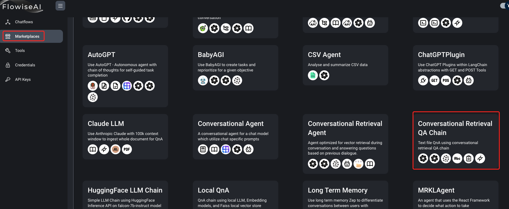
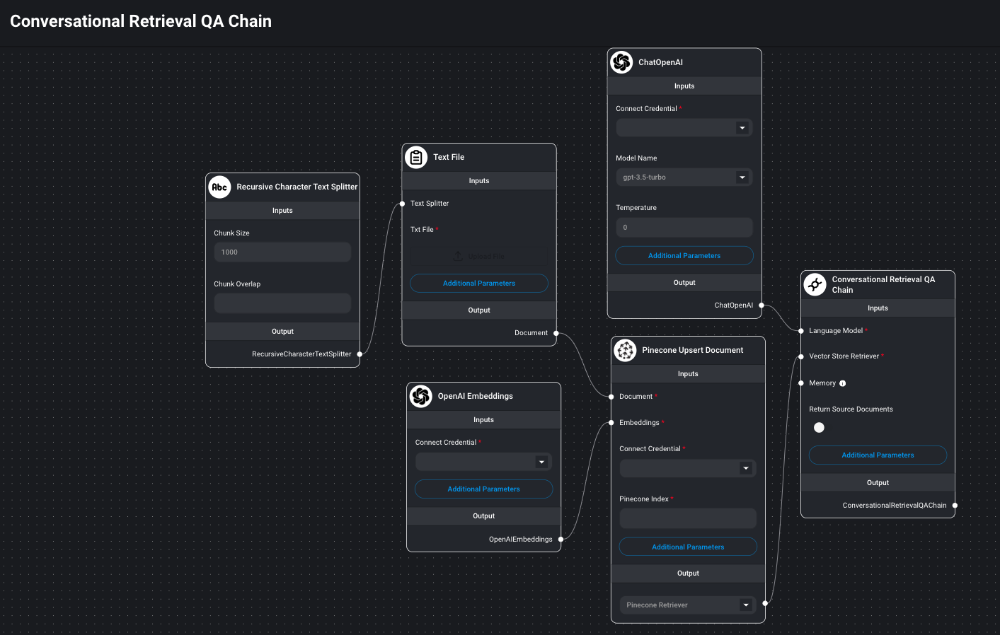

# Flowise 应用场景-智能客服(Chrome)
## 需求
[Flowise 应用场景-智能客服(内存向量数据库)
](https://github.com/pangzheng/BOOKS/blob/master/%E6%8A%80%E6%9C%AF/AI/FlowiseAI/Flowise%20%E5%BA%94%E7%94%A8%E5%9C%BA%E6%99%AF-%E6%99%BA%E8%83%BD%E5%AE%A2%E6%9C%8D(%E5%86%85%E5%AD%98%E5%90%91%E9%87%8F%E6%95%B0%E6%8D%AE%E5%BA%93).md) 方案使用的是内存向量数据库，仅作为测试使用。本次尝试将其替换成 Chrome 其他不变。
## 部署 Chrome 服务
- 下载代码

		git clone https://github.com/chroma-core/chroma.git
- 编译启动

		cd chroma/
		sudo docker-compose up -d --build
		 
		WARN[0000] The "CHROMA_SERVER_AUTH_PROVIDER" variable is not set. Defaulting to a blank string.
		WARN[0000] The "CHROMA_SERVER_AUTH_CREDENTIALS_FILE" variable is not set. Defaulting to a blank string.
		WARN[0000] The "CHROMA_SERVER_AUTH_CREDENTIALS" variable is not set. Defaulting to a blank string.
		WARN[0000] The "CHROMA_SERVER_AUTH_CREDENTIALS_PROVIDER" variable is not set. Defaulting to a blank string.
		[+] Building 111.3s (16/16) FINISHED
		 => [server internal] load build definition from Dockerfile                                                                                                                                                                              0.1s
		 => => transferring dockerfile: 771B                                                                                                                                                                                                     0.0s
		 => [server internal] load .dockerignore                                                                                                                                                                                                 0.1s
		 => => transferring context: 131B                                                                                                                                                                                                        0.0s
		 => [server internal] load metadata for docker.io/library/python:3.10-slim-bookworm                                                                                                                                                      3.7s
		 => [server internal] load build context                                                                                                                                                                                                 0.1s
		 => => transferring context: 1.41MB                                                                                                                                                                                                      0.1s
		 => [server builder 1/6] FROM docker.io/library/python:3.10-slim-bookworm@sha256:cc91315c3561d0b87d0525cb814d430cfbc70f10ca54577def184da80e87c1db                                                                                        2.2s
		 => => resolve docker.io/library/python:3.10-slim-bookworm@sha256:cc91315c3561d0b87d0525cb814d430cfbc70f10ca54577def184da80e87c1db                                                                                                       0.1s
		 => => sha256:2b8a9a2240c1224b34f6aafbc3310f9a3fe65bd6893050906d02e89fc8326aa9 3.50MB / 3.50MB                                                                                                                                           0.4s
		 => => sha256:ee3ff8104b647adfd7c95ac5a0c324f9d9146d46053c3e22dfd8eb740928f2be 12.38MB / 12.38MB                                                                                                                                         0.7s
		 => => sha256:4e6b4ab7744477f9b8d05daf9043d207d66656f70aed7995bdecf4af8e8ab1f4 245B / 245B                                                                                                                                               0.3s
		 => => sha256:cc91315c3561d0b87d0525cb814d430cfbc70f10ca54577def184da80e87c1db 1.65kB / 1.65kB                                                                                                                                           0.0s
		 => => sha256:83f353e03a40bbebc8d2fe1fcd2d7357d8613e92512c556b02483a670eeb7211 1.37kB / 1.37kB                                                                                                                                           0.0s
		 => => sha256:1488b8d1803ea7d8ea895950305fff529b88f36c2db6ed9a4391b265868f0d60 6.94kB / 6.94kB                                                                                                                                           0.0s
		 => => extracting sha256:2b8a9a2240c1224b34f6aafbc3310f9a3fe65bd6893050906d02e89fc8326aa9                                                                                                                                                0.2s
		 => => sha256:67f71c4528a9196bd1de0a14a51c1bc283cde782e4799dcb4ae926937f03d701 3.36MB / 3.36MB                                                                                                                                           0.9s
		 => => extracting sha256:ee3ff8104b647adfd7c95ac5a0c324f9d9146d46053c3e22dfd8eb740928f2be                                                                                                                                                0.7s
		 => => extracting sha256:4e6b4ab7744477f9b8d05daf9043d207d66656f70aed7995bdecf4af8e8ab1f4                                                                                                                                                0.0s
		 => => extracting sha256:67f71c4528a9196bd1de0a14a51c1bc283cde782e4799dcb4ae926937f03d701                                                                                                                                                0.4s
		 => [server builder 2/6] RUN apt-get update --fix-missing && apt-get install -y --fix-missing     build-essential     gcc     g++ &&     rm -rf /var/lib/apt/lists/*                                                                    34.7s
		 => [server final 3/7] RUN mkdir /chroma                                                                                                                                                                                                 0.6s
		 => [server builder 3/6] RUN mkdir /install                                                                                                                                                                                              0.6s
		 => [server builder 4/6] WORKDIR /install                                                                                                                                                                                                0.1s
		 => [server final 4/7] WORKDIR /chroma                                                                                                                                                                                                   0.2s
		 => [server builder 5/6] COPY ./requirements.txt requirements.txt                                                                                                                                                                        0.2s
		 => [server builder 6/6] RUN pip install --no-cache-dir --upgrade --prefix="/install" -r requirements.txt                                                                                                                               60.9s
		 => [server final 5/7] COPY --from=builder /install /usr/local                                                                                                                                                                           3.1s
		 => [server final 6/7] COPY ./bin/docker_entrypoint.sh /docker_entrypoint.sh                                                                                                                                                             0.0s
		 => [server final 7/7] COPY ./ /chroma                                                                                                                                                                                                   0.1s
		 => [server] exporting to image                                                                                                                                                                                                          3.8s
		 => => exporting layers                                                                                                                                                                                                                  3.7s
		 => => writing image sha256:51c72afd0cb4da5ba5b058da563c4b8b6b5aeefa20c13cb0010baf62f187d51d                                                                                                                                             0.0s
		 => => naming to docker.io/library/server                                                                                                                                                                                                0.0s
		[+] Running 3/3
		 ✔ Network chroma_net          Created                                                                                                                                                                                                   0.1s
		 ✔ Volume "chroma_index_data"  Created                                                                                                                                                                                                   0.0s
		 ✔ Container chroma-server-1   Started                                                                                                                                                                                                   0.4s

- 检查启动

		$ sudo docker ps
		CONTAINER ID   IMAGE               COMMAND                  CREATED          STATUS          PORTS                                       NAMES
		b97bb594ca98   server              "uvicorn chromadb.ap…"   43 minutes ago   Up 43 minutes   0.0.0.0:8000->8000/tcp, :::8000->8000/tcp   chroma-server-1
- 检查挂载点

		 vi docker-compose.yml
		 
		 ...
		     volumes:
			      - ./:/chroma
			      - index_data:/index_data
		 ...

		~/chroma$ ll
		total 128
		drwxrwxr-x 11 pangzheng pangzheng  4096 Sep  5 19:53 ./
		drwxr-xr-x  7 pangzheng pangzheng  4096 Sep  5 19:53 ../
		drwxrwxr-x  3 pangzheng pangzheng  4096 Sep  5 19:02 bin/
		drwxr-xr-x  2 root      root       4096 Sep  5 19:05 chroma/   <-- 挂点
		drwxrwxr-x 14 pangzheng pangzheng  4096 Sep  5 19:04 chromadb/
		-rw-r--r--  1 root      root       1049 Sep  5 19:05 chroma.log <-- 挂点
		drwxrwxr-x  4 pangzheng pangzheng  4096 Sep  5 18:58 clients/
            ....
- 检查监听

		$ netstat -antlp | grep 8000
		(Not all processes could be identified, non-owned process info
		 will not be shown, you would have to be root to see it all.)
		tcp        0      0 0.0.0.0:8000            0.0.0.0:*               LISTEN      -
		tcp6       0      0 :::8000                 :::*                    LISTEN      -
		
		
## Flowise 设置
- 模版选择 

		
	
- 替换里面组件
	- TextFile 替换成 PDF File
	- Pinecone Upsert Document 替换成 Chrome Upsert Document 			
			