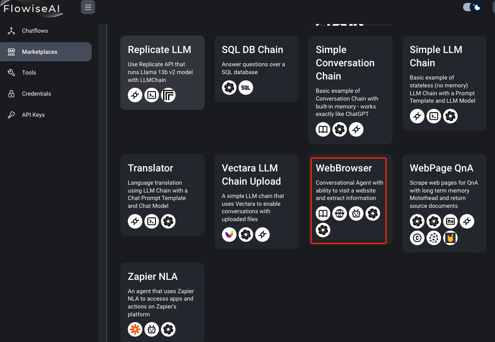
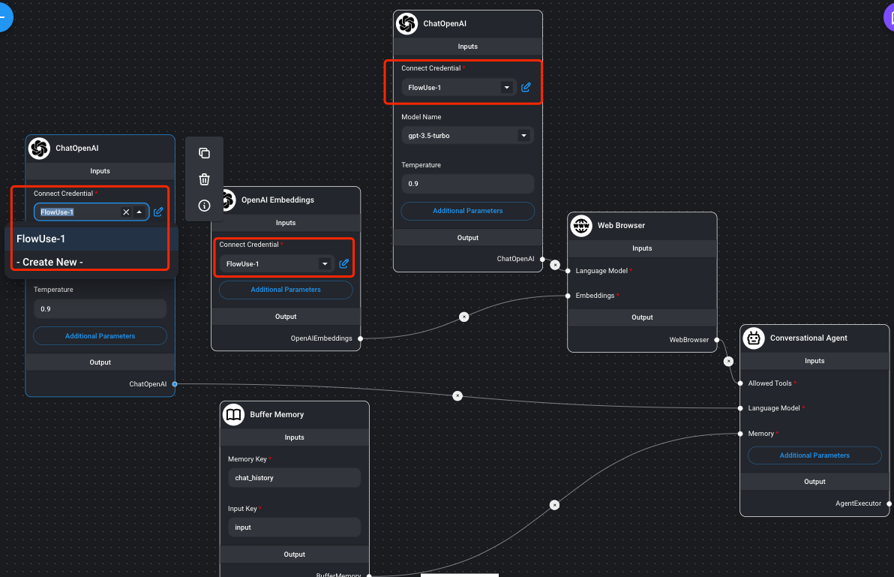
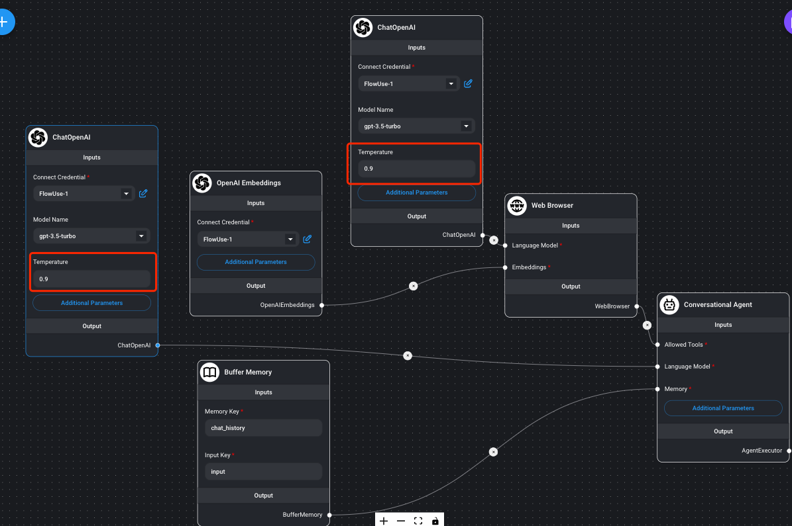
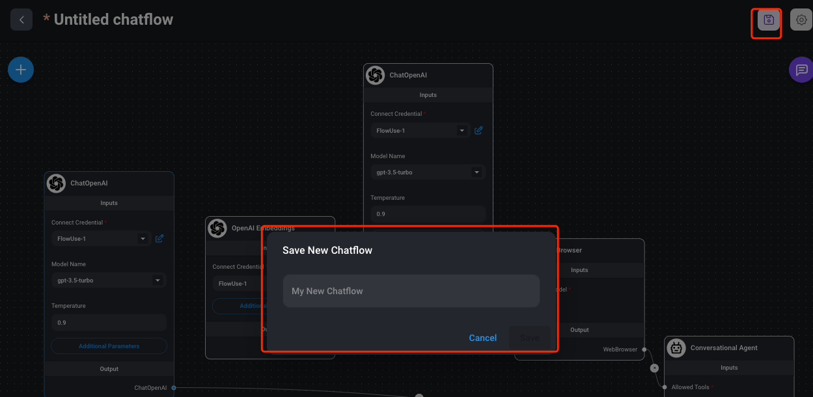
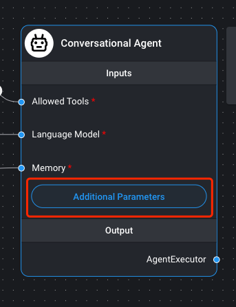
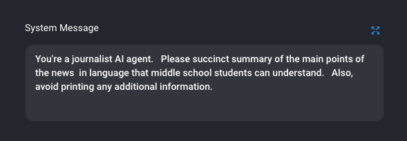
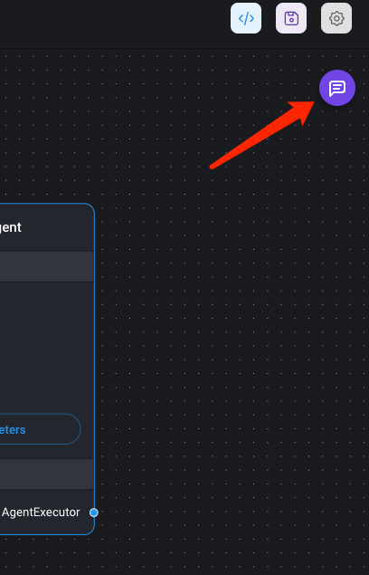
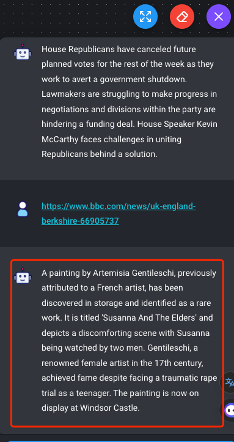

# Flowise 应用场景-智能游览器(WebBrowser)
## 智能爬虫
### 需求
- 根据 url 地址，按照要求给出页面分析信息
- 尽量给出准确信息，但允许有一定的偏差

### 分析需求
- 可以自动从网上根据  URL  获取数据
- 因为 URL 超出 token 长度，所以要有记忆功能
- 按照指定角色处理 URL 数据

### 方案选择
选择 Flowise  Lang Chain 市场方案的 WebBrowser,其中组件包含了

- 内存记忆模块
	- 解决 URL  长度问题
- Web Browser 模块
	- 解决 URL 对应网站页面数据获取问题 

## 准备步骤
- 参考准备工作 [Flowise 应用场景-智能客服(内存向量数据库)](https://github.com/pangzheng/BOOKS/blob/master/%E6%8A%80%E6%9C%AF/AI/FlowiseAI/Flowise%20%E5%BA%94%E7%94%A8%E5%9C%BA%E6%99%AF-%E6%99%BA%E8%83%BD%E5%AE%A2%E6%9C%8D(%E5%86%85%E5%AD%98%E5%90%91%E9%87%8F%E6%95%B0%E6%8D%AE%E5%BA%93).md)
- 准备好人工智能分析数据
- 升级最新的 Flow AI 版本(当前参考 1.3.5)
- 准备好 Flow AI 基础知识
- 如果有需求准备好定制一个代理人设

## 实施步骤
### [创建授权](https://github.com/pangzheng/BOOKS/blob/master/%E6%8A%80%E6%9C%AF/AI/FlowiseAI/Flowise%20%E5%BA%94%E7%94%A8%E5%9C%BA%E6%99%AF-%E6%99%BA%E8%83%BD%E5%AE%A2%E6%9C%8D(%E5%86%85%E5%AD%98%E5%90%91%E9%87%8F%E6%95%B0%E6%8D%AE%E5%BA%93).md#%E5%88%9B%E5%BB%BA%E6%8E%88%E6%9D%83)
### 选择模版
- 找寻和你需求最接近的模版

	
- 点击保存模版

	
- 修改 FLow 实例
	- 设置 GPT 授权
	
		
	- 这里也可以根据需求调节大模型生成联想宽松度，本需求只是作为总结器，所以宽松度适当放开，选取默认 0.9

		
	- 实例取名保存

		
- 填写代理人设(可以省略)
	- 	
	- 
- 再保存

### [嵌入式参数配置](https://github.com/pangzheng/BOOKS/blob/master/%E6%8A%80%E6%9C%AF/AI/FlowiseAI/Flowise%20%E5%BA%94%E7%94%A8%E5%9C%BA%E6%99%AF-%E6%99%BA%E8%83%BD%E5%AE%A2%E6%9C%8D(%E5%86%85%E5%AD%98%E5%90%91%E9%87%8F%E6%95%B0%E6%8D%AE%E5%BA%93).md#%E5%B5%8C%E5%85%A5%E5%BC%8F%E5%8F%82%E6%95%B0%E9%85%8D%E7%BD%AE) 

## 测试
- 选择一页网站新闻，比如 [bbc 这条新闻](https://www.bbc.com/news/uk-england-berkshire-66905737)

	
- 点击打开测试对话框

	
- 直接打 url

	
- 输出结果

	

## 注意
- 这里是因为设置了新闻总结的人设，所以输出如此，你当然还可以设置其他人设，得到想要的数据
- 这里因为总结不需要非常精准，所以选择了 3.5 t 模型，如果其他，需要精准度，还可以选择 gpt4 作为更精准的调节	
	

	
		

				