# Flowise 应用场景-智能翻译
## 智能翻译+模糊分类
### 需求
- 将文本按照特定的模糊分类要求进行模糊分类
- 将文本进行英译中翻译，翻译文本不能联想，要用原文
- 将特定分类数据获取地理位置信息
- 后台调用休要使用 API keys

### 需求拆解
简单需求分析有3类

1. 将信息进行按需求进行模糊分类

	这个问题方案有两种，是用标题信息分析以及使用标题和全文进行分析
	
	- 通过标题分析	
	
		该信息通过标题进行分类
		
		- 好处
			- 这样最大化的节省进入 token
		- 坏处
			- 如果标题写的不好，容易在丢失信息的情况下误判
	- 通过标题和内容分析
	
		该信息通过标题和原文内容进行分类
		
		- 好处
			- 信息完全更为精准
		- 坏处
			- 上下文带了更多的 token 费用
	- 方案选择
		- 先选择通过标题进行分析，如果达不到，再使用标题加原文进行分析 
- 英译中翻译，且翻译内容不能联想
- 获取分类后特定的地理位置数据

	2/3 需求都需要使用标题和原文，所以有两种方案进行处理，本质上都是从标题、原文获取需要的数据
	
	- 分别执行
		
		翻译和获取地理位置分别执行
		
		- 好处
	
			对于产品来说可以分别复用独立模块
		- 坏处
	
			严重浪费 token
	- 合并执行
	
		将 AI 处理参数化，整合用户需求
		
		- 好处
			- token节省
		- 坏处
			- 需要测试
			- 比较不灵活
				- 需要动态修改提示词格式，如果提示词修改错误，就会导致影响范围很大，新老 task 都会受到影响
	- 方案选择
		- 选择合并方案，主要为了节约成本，看测试结果  
		  
## 准备步骤
- 升级最新的 Flow AI 版本，老版本缺少新模版支持
- 准备好 Flow AI 基础知识
- 准备好智能客服的人格设定 

### 创建 API keys
- 登陆 Flow AI

	
- 点击 API keys

	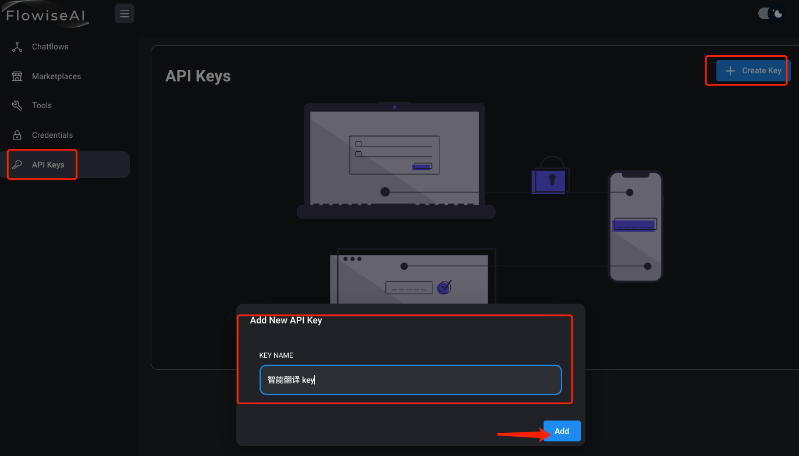
- 记录 key，后面使用

	
		
### 创建 openai 授权
- 登陆 Flow AI

	
- 创建第三方服务认证，这里我们只和 OpenAI 交互，所以只创建 OpenAI apikey 即可

 		
 		
		

## 模糊分类
### 选择模版
- 找寻和你需求最接近的模版

	这里就选择翻译模版

	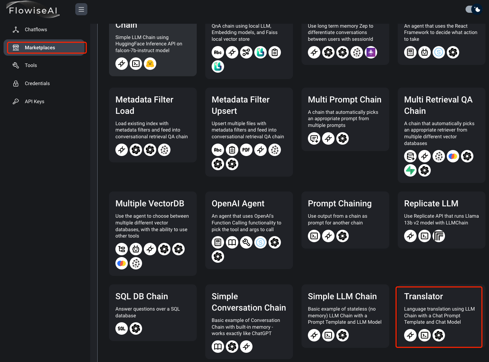	
- 点击保存模版	

	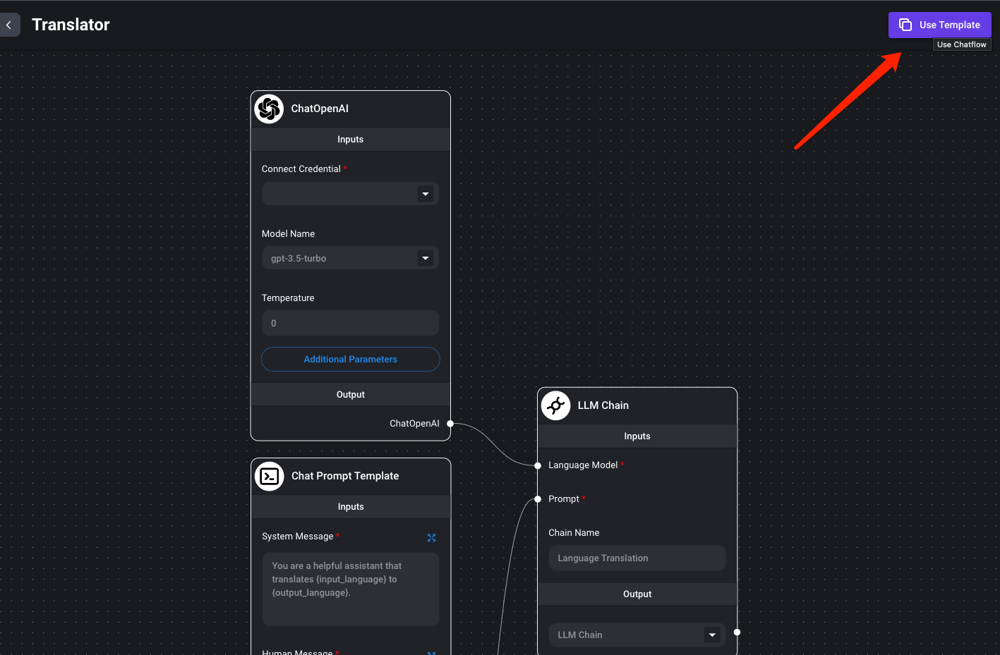	

###  配置 Flow 插件参数
- 聊天对话器
	- Connect Credential*
		- 选择刚才设置的 openai 授权
	- Model Name
		- gpt-3.5-turbo
		
			说明下为什么选择这个而不选择 turbo-16k ，因为这里分析标题便宜， token 不会超过 4K
	- Temperature
		- 0

		这里的这个温度，类似 sd 的幻想程度， 0 是没幻想 
			
	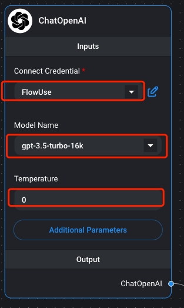

	- 对话模版设置
	
		通过这个对话模版，明确表达想要 AI 处理的结果
		
			System message:
			
			If you are an ai agent, Determine which tags of label the entered information belongs to?
			
			Tags include (Social security, terrorist attacks, government information, China-related information, international relations information, and other information)
			
			Output only the most likely one
			
			Format:
			"result"
			
			Only the format information is output,Never break character.
	- 输入格式

			{"title": "(2 Killed, Several Injured As Passenger Coach Overturns In Nawabshah)"}
	- 输出格式

			"other information"
		- 发送信息到 Poe 测试
	
			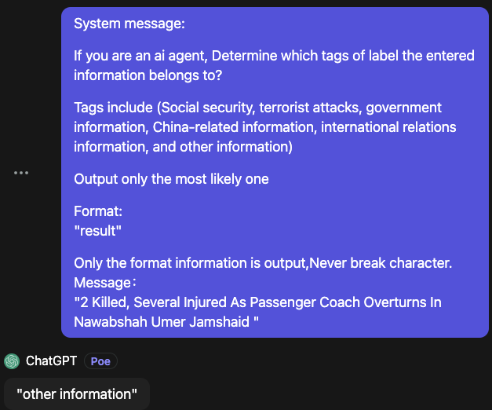

			```			
			System message:
			
			If you are an ai agent, Determine which tags of label the entered information belongs to?
			
			Tags include (Social security, terrorist attacks, government information, China-related information, international relations information, and other information)
			
			Output only the most likely one
			
			Format:
			"result"
			
			Only the format information is output,Never break character.
			
			Human Message：
			"2 Killed, Several Injured As Passenger Coach Overturns In Nawabshah Umer Jamshaid "
			```
- 点击保存，并输入 FLow 实例名字

	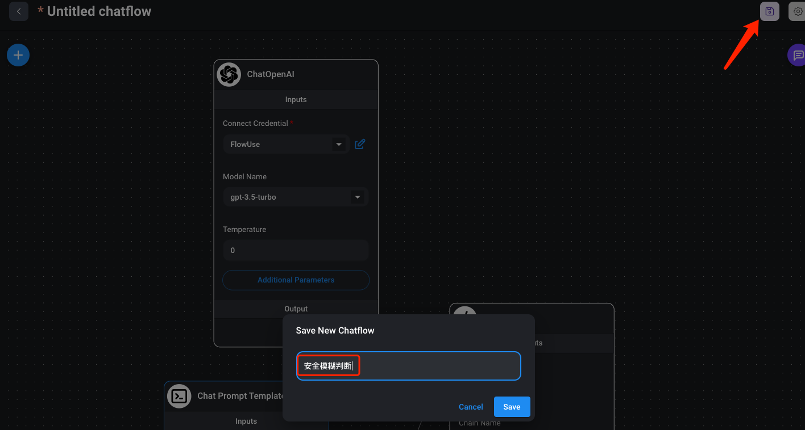
- 设置后台调用 api key 权限

	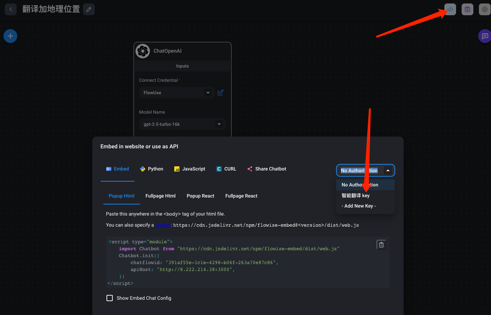
	
	
## 翻译+地理位置获取实施步骤
### 选择模版
- 找寻和你需求最接近的模版

	这里就选择翻译模版

		
- 点击保存模版	

		
	
###  配置 Flow 插件参数
- 聊天对话器
	- Connect Credential*
		- 选择刚才设置的 openai 授权
	- Model Name
		- gpt-3.5-turbo-16k

			说明下为什么选择这个而不选择 turbo ，因为这里的16k是 token 数量，如果使用 turbo 的化，虽然便宜，但是可能导致单文章过大而 token 不足，虽然可以通过分段2层总结解决，但是引入了复杂度，且不精确，所以不符合当前需求
	- Temperature
		- 0

		这里的这个温度，类似 sd 的幻想程度， 0 是没幻想 
			
	
- 设置提示词模版
	- 设置 System message:
		
		通过这个对话模版，明确表达想要 AI 处理的结果
		
		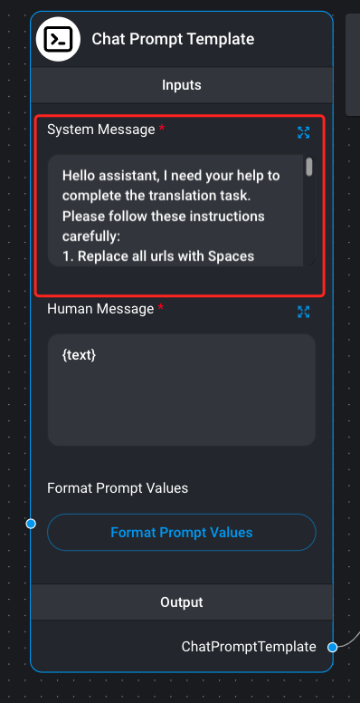
		
			Hello assistant, I need your help to complete the translation task. Please follow these instructions carefully:
			1. Replace all urls with Spaces
			
			2. Translate the title and content of the text from {input_language} to {output_language}. Do not translate any other information, including the information to the left of the equal sign.
			
			3. Extract publication time, author and location information from the text.
			
			4. Format the output as follows:
			
			"publishTime": YYYY-MM-DD HH: MM: SS,
			"author":"Author of this article",
			"location": "Content Location",
			"title": "Article Title",
			"content": "Content of this article"
			
			Please note the following:
			
			1. Translate the text strictly in the format provided.
			2. Do not include any information that is not part of the translated text.
			3. Provide translation information only in continuous format.
			4. The publication time of the article should be in the format YYYY-MM-DD HH: MM: SS.
			
			Thank you for your help!
	- 设置 Format Prompt Values 变量，这里设置翻译成中文		
		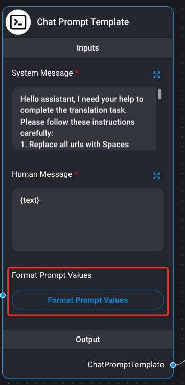
		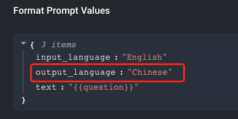
	- 点击保存，并输入 FLow 实例名字

		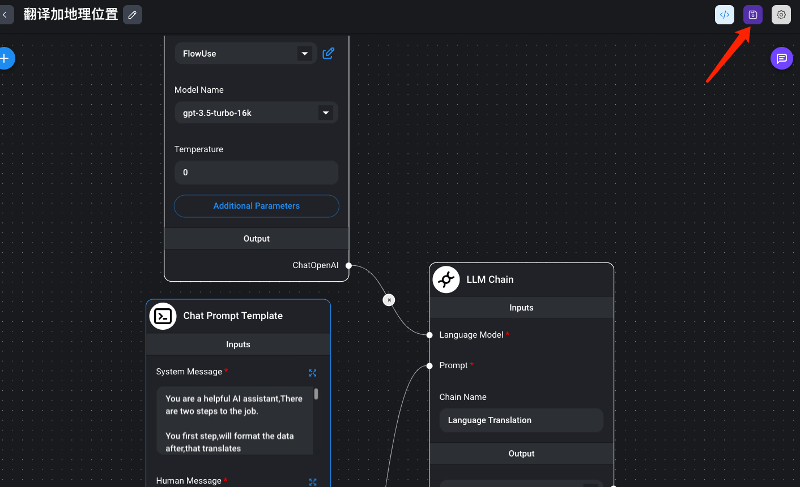	
	- 输入格式
			
			{"title": "(2 Killed, Several Injured As Passenger Coach Overturns In Nawabshah)" ,"content"=(2 Killed, Several Injured As Passenger Coach Overturns In Nawabshah Umer Jamshaid  Published August 15, 2023 | 10:00 AM 2 killed, several injured as passenger coach overturns in Nawabshah
			ISLAMABAD, (UrduPoint / Pakistan Point News - 15th Aug, 2023 ) :At least two people including a minor girl were killed and several others injured when a passenger bus turned turtle due to over-speeding in Nawabshah on Tuesday.
			According to the details, Rescue 1122 officials said that the passenger coach was going from Sargodha to Karachi when a terrible incident took place and two people died on the spot, private news channels reported.
			Reportedly, the accident occurred due to over-speeding.  Rescue sources further said that a minor girl was also among the deceased persons, whereas all the injured were shifted to a nearby hospital for medical aid.)}
	- 输出格式

			"publishTime": "2023-08-15 10:00:00", "author": "Umer Jamshaid", "location": "ISLAMABAD", "title": "2人死亡，数人受伤，客车在纳瓦布沙赫翻车", "content": "据报道，2023年8月15日，星期二，在纳瓦布沙赫，一辆客车因超速翻车，造成至少包括一名女童在内的两人死亡，多人受伤。据救援1122官员称，这辆客车从萨戈达前往卡拉奇，在一起可怕的事故中发生了翻车事故，两人当场死亡。据报道，事故是由于超速导致的。救援人员进一步表示，一名女童也是死者之一，而所有受伤者都被送往附近医院接受医疗援助。"
	- 发送信息到 Poe 测试
	
		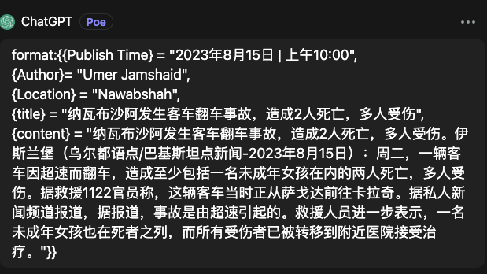

```			
System message:
Hello assistant, I need your help to complete the translation task. Please follow these instructions carefully:
1. Replace all urls with Spaces
2. Translate the title and content of the text from {input_language} to {output_language}. Do not translate any other information, including the information to the left of the equal sign.
3. Extract publication time, author and location information from the text.
4. Format the output as follows:
	
"publishTime": YYYY-MM-DD HH: MM: SS,
"author":"Author of this article",
"location": "Content Location",
"title": "Article Title",
"content": "Content of this article"
	
Please note the following:
1. Translate the text strictly in the format provided.
2. Do not include any information that is not part of the translated text.
3. Provide translation information only in continuous format.
4. The publication time of the article should be in the format YYYY-MM-DD HH: MM: SS.
	
Human Message：
{input_language:"English",output_language:"Chinese","title": "(2 Killed, Several Injured As Passenger Coach Overturns In Nawabshah)" ,"content"=(2 Killed, Several Injured As Passenger Coach Overturns In Nawabshah Umer Jamshaid  Published August 15, 2023 | 10:00 AM 2 killed, several injured as passenger coach overturns in Nawabshah ISLAMABAD, (UrduPoint / Pakistan Point News - 15th Aug, 2023 ) :At least two people including a minor girl were killed and several others injured when a passenger bus turned turtle due to over-speeding in Nawabshah on Tuesday.According to the details, Rescue 1122 officials said that the passenger coach was going from Sargodha to Karachi when a terrible incident took place and two people died on the spot, private news channels reported.Reportedly, the accident occurred due to over-speeding.  Rescue sources further said that a minor girl was also among the deceased persons, whereas all the injured were shifted to a nearby hospital for medical aid.)}
```

- 设置后台调用 api key 权限

	
- 点击保存，并输入 FLow 实例名字

		
	
## 遇到问题
### 问题1
- 问题
	
	在 system 设置 {} 内容属于变量，所以这里无法传输以 {} 为标识的参数
- 解决方案

	将大括号删除
	
### 问题2
- 问题

	在给定的内容中包含大量取消格式的 http url 地址，导致翻译失败
- 解决方案
	- 临时解决
	
		增加1条强规则, 1. Replace all urls with Spaces.
	- 完美解决(待处理)
	
		需要变更传输翻译的格式，去除 https url 或者带上 html 格式	
		
	
