# FlowiseAI 官方手册
## 1 什么是 Flowise?
Flowise 构建在 LangChainJS 之上，旨在让人们轻松可视化和构建 LLM 应用程序

[DEMO视频](https://youtu.be/d7vfUodP0c4)

## 2 准备第三方服务
- openAI 
	
	第三方大模型
	
	- API-key

		[https://platform.openai.com/account/api-keys](https://platform.openai.com/account/api-keys)
- pinecone

	第三方适量数据库
	
	- API-key

		[https://app.pinecone.io/organizations/-N_h3fa9ZZws20Phbkdt/projects/us-west1-gcp-free:faa43a7/keys](https://app.pinecone.io/organizations/-N_h3fa9ZZws20Phbkdt/projects/us-west1-gcp-free:faa43a7/keys)
- Serpapi

	Google 搜索 API
	
	[https://serpapi.com/manage-api-key](https://serpapi.com/manage-api-key)
							
## 3 ubuntu docker 安装
- apt update

		$ sudo apt update
- 更新apt包索引并安装包以允许apt通过 HTTPS 使用存储库

		$ sudo apt-get install ca-certificates curl gnupg
- 添加Docker官方GPG密钥

		$ sudo install -m 0755 -d /etc/apt/keyrings
		$ curl -fsSL https://download.docker.com/linux/ubuntu/gpg | sudo gpg --dearmor -o /etc/apt/keyrings/docker.gpg
		$ sudo chmod a+r /etc/apt/keyrings/docker.gpg
- 使用以下命令设置存储库

		$ echo \
		  "deb [arch="$(dpkg --print-architecture)" signed-by=/etc/apt/keyrings/docker.gpg] https://download.docker.com/linux/ubuntu \
		  "$(. /etc/os-release && echo "$VERSION_CODENAME")" stable" | \
		  
		  $ sudo tee /etc/apt/sources.list.d/docker.list > /dev/null
- 再 update

		$ sudo apt-get update
- 安装

		$ sudo apt-get install docker-ce docker-ce-cli containerd.io docker-buildx-plugin docker-compose-plugin
- 验证

		$ sudo docker run hello-world
- 添加守护进程
		
		$ sudo service docker start
		$ sudo docker run hello-world
- 检查

		$ sudo docker ps -a
				
		CONTAINER ID   IMAGE         COMMAND    CREATED         STATUS                     PORTS     NAMES
		1ed4252c4cf0   hello-world   "/hello"   3 minutes ago   Exited (0) 3 minutes ago             fervent_yalow

## 4 安装 Docker-compose
- 下载

		$ sudo curl -L "https://github.com/docker/compose/releases/download/v2.20.1/docker-compose-linux-x86_64" -o /usr/local/bin/docker-compose
- 授权

		$ sudo chmod 755 /usr/local/bin/docker-compose
		
## 5 安装&&设置 Nginx
- 安装 nginx

		sudo apt install nginx -y
- 设置密码
	- 安装工具
		
			sudo apt-get install apache2-utils -y
	- 设置登陆密码（修改密码记住重启才能生效）	
		
			$ sudo htpasswd -c /etc/nginx/.htpasswd $user
			
			New password:
			Re-type new password:
			Adding password for user $user
	- 设置代理配置
		 		
			$ sudo vi /etc/nginx/sites-available/default
			
			upstream Flowise_Node {
		      server 127.0.0.1:3000;
		      keepalive 64;
			  }
			
			server {
				listen 80 default_server;
				listen [::]:80 default_server;
			
			
				root /var/www/html;
			
				index index.html index.htm index.nginx-debian.html;
			
				server_name _;
			
			        location / {
			                  auth_basic           "Please input password";
			                  auth_basic_user_file /etc/nginx/.htpasswd;
			                  proxy_pass http://Flowise_Node/;
			          }
		
		
			}
	- 重启
			
			$ sudo systemctl stop nginx
			$ sudo systemctl start nginx
			$ sudo systemctl status nginx	
				
## 5 安装 FlowiseAI
- 下载源码

		$ git clone git@github.com:FlowiseAI/Flowise.git
- 进入 docker 目录

		$ cd Flowise/docker/
- 本地构建景象

		$ sudo docker build --no-cache -t flowise .
- 启动&关闭
	- docker 命令启动测试

			$ sudo docker run -d --name flowise -p 3000:3000 flowise
	- 厕所关闭

			$ sudo docker stop flowise
- 安装报错
	- 报错

			....
			 => [2/7] RUN apk add --no-cache git                                                                                                                                                                                                   345.9s
			 => ERROR [3/7] RUN apk add --no-cache python3 py3-pip make g++
			...
			3743.1 Executing busybox-1.36.1-r0.trigger
			3743.1 1 error; 192 MiB in 61 packages
			------
			Dockerfile:6
			--------------------
			   4 |
			   5 |     RUN apk add --no-cache git
			   6 | >>> RUN apk add --no-cache python3 py3-pip make g++
			   7 |     # needed for pdfjs-dist
			   8 |     RUN apk add --no-cache build-base cairo-dev pango-dev
	- 修改 Dockerfile

			FROM node:18-alpine
		
			USER root
			
			# 增加阿里云加速
			RUN sed -i 's/dl-cdn.alpinelinux.org/mirrors.aliyun.com/g' /etc/apk/repositories
			
			RUN apk add --no-cache git
			
			# 增加 cmake
			RUN apk add --no-cache python3 py3-pip make g++ cmake
			
			# needed for pdfjs-dist
			RUN apk add --no-cache build-base cairo-dev pango-dev
			
			# Install Chromium
			RUN apk add --no-cache chromium
			
			ENV PUPPETEER_SKIP_DOWNLOAD=true
			ENV PUPPETEER_EXECUTABLE_PATH=/usr/bin/chromium-browser
			
			# You can install a specific version like: flowise@1.0.0
			RUN npm install -g flowise
			
			WORKDIR /data
			
			CMD "flowise"
	- 重新编译 image			
	
## 6 docker compose 启动环境变量设置
1. 至 docker 文件夹

		cd docker
2. 查看 compose 文件

		version: '3.1'
		
		services:
		    flowise:
		        image: flowiseai/flowise
		        restart: always
		        environment:
		            - PORT=${PORT}
		            - FLOWISE_USERNAME=${FLOWISE_USERNAME}
		            - FLOWISE_PASSWORD=${FLOWISE_PASSWORD}
		            - DEBUG=${DEBUG}
		            - DATABASE_PATH=${DATABASE_PATH}
		            - APIKEY_PATH=${APIKEY_PATH}
		            - LOG_PATH=${LOG_PATH}
		            - LOG_LEVEL=${LOG_LEVEL}
		            - EXECUTION_MODE=${EXECUTION_MODE}
		        ports:
		            - '${PORT}:${PORT}'
		        volumes:
		            - ~/.flowise:/root/.flowise
		        command: /bin/sh -c "sleep 3; flowise start"
3.  修改 compose 文件镜像文件，用自己的，默认用官方的

		version: '3.1'
		
		services:
		    flowise:
		        image: flowise <- 这里
		        restart: always
		        environment:
		....        		
2. 创建 `.env` 文件并指定 `PORT` 、`FLOWISE USERNAME` 和 `FLOWISE PASSWORD`

		PORT=3000
		FLOWISE USERNAME=user
		FLOWISE PASSWORD=1234
3. 将 `FLOWISE USERNAME` 和传递 `FLOWISE PASSWORD` 到 `docker-compose.yml` 文件:

		environment:
		- PORT=S{PORT}
		- FLOWISE_USERNAME=${FLOWISE_USERNAME}
		- FLOWISE_PASSWORD=${FLOWISE_PASSWORDT}
4. 启动

		docker-compose up -d
5. 打开 `http://localhost: 3000`
6. 关闭

		docker-compose stop 
  
## 7 身份验证与授权
Flowise 有 2 个授权：

- APP 级别

	应用程序级授权通过用户名和密码保护您的 Flowise 实例。这可以防止您的应用程序在在线部署时被任何人访问。
	
	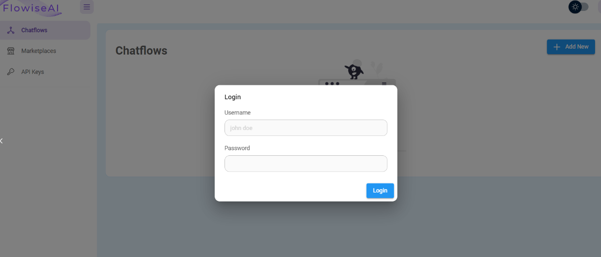
- 聊天流级别

	想象一下，您构建了一个聊天流，并且您只希望某些人能够访问它并与之交互。您可以通过为特定聊天流分配 API 密钥来实现这一点。

	- API 密钥

		在仪表板中，导航到 API Keys 部分，您应该能够看到创建的 `DefaultKey`。您还可以添加或删除任何键。
		
		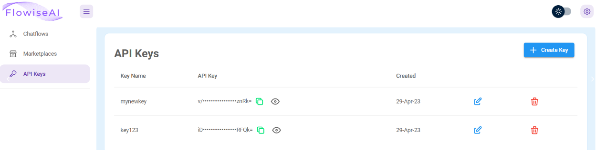
	- Chatflow(聊天流)

		导航到 Chatflow，可以选择要用于保护 Chatflow 的 API 密钥。
		
		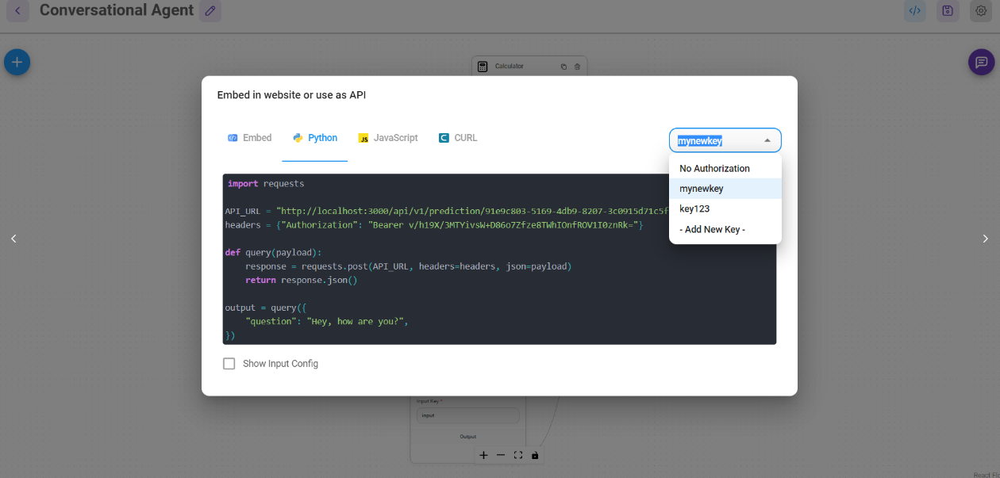
		
		分配 API 密钥后，只有在授权标头提供了 HTTP 调用期间指定的正确 API 密钥时，才能访问聊天流 API。

			"Authorization": "Bearer <your-api-key>"
		使用 POSTMAN 调用 API 的示例

		

### 7.1 设置用户名和密码
要启用应用程序级别身份验证，请将 `FLOWISE_USERNAME` 和添加 `FLOWISE_PASSWORD` 到 `.env` ,该文件应该与 `docker-compose.yml` 同级目录

	FLOWISE_USERNAME=user
	FLOWISE_PASSWORD=1234
	

## 8 如何使用
现在您已经使用 Flowise 上的聊天界面测试了Chatflow ，您希望将其 “export” 以便能够与其他应用程序一起使用。

Flowise 提供了 2 种方法来实现此目的：

- API
- Embed(嵌入式)

### 8.1 API
您可以使用 Chatflow 作为 API 并连接到前端应用程序。

您还可以灵活地使用 `overrideConfig` 属性覆盖输入配置。

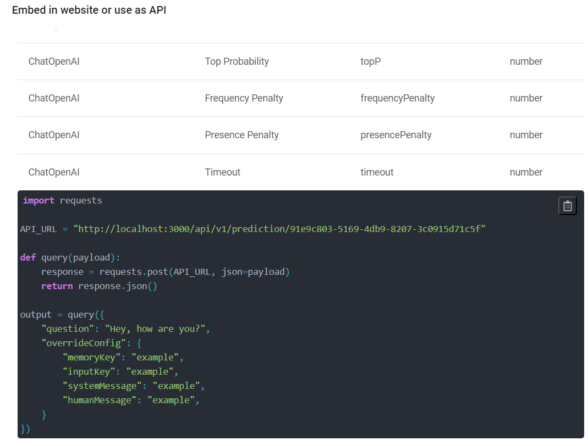

- 示例

	1个使用 Postman 调用 API 的示例：

	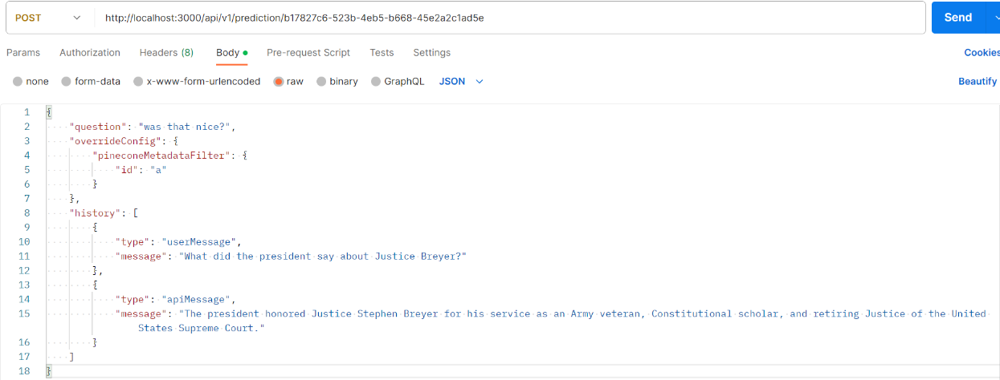

	key|描述|类型|必需的
	---|---|---|---
	question|用户提问|string|yes
	overrideConfig|覆盖现有的配置|object|no
	history|向流程提供历史消息列表|array|no

如果 Chatflow 包含 [Document Loader/文档加载器](https://docs.flowiseai.com/document-loaders)，则 API 看起来会略有不同。不使用 JSON 正文传递，而是使用表单数据。这允许您将任何文件上传到 API。

注意：用户有责任确保文件类型与文档加载器的预期文件类型兼容。例如，如果正在使用文本文件加载器，您应该只上传带有 .txt 扩展名的文件。

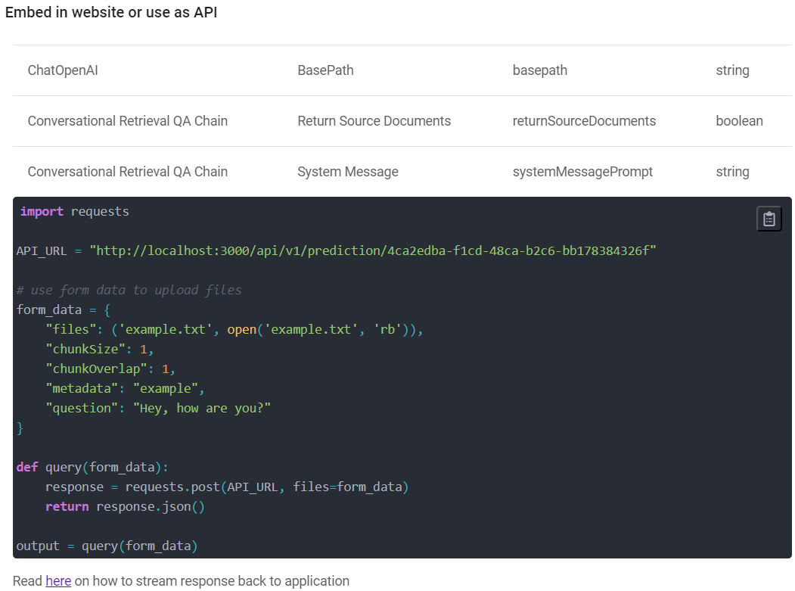

- 示例

	使用 Postman 调用 API 的示例 `form-data`：

	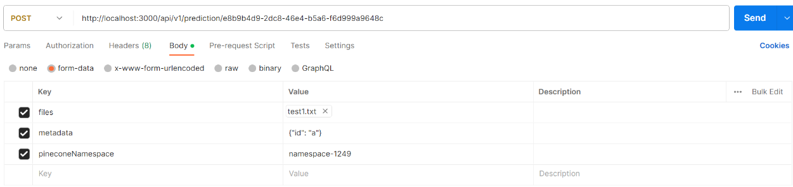

- [观看如何连接到 `Bubble`](https://www.youtube.com/watch?v=kOwmPe8aLAA)

	Bubble 是一个无代码构建任何网络应用程序平台
	
	[https://bubble.io/](https://bubble.io/)

- [观看如何连接到 `FlutterFlow`](https://www.youtube.com/watch?v=iI84yym473Q&t=1s)

	FlutterFlow 也是一个无代码构建任何网络应用程序平台

	[https://flutterflow.io/](https://flutterflow.io/)

### 8.2 Streaming
当最终节点是 `Chain` 或 `OpenAI Function Agent` 时，Flowise 还支持流回前端应用程序。

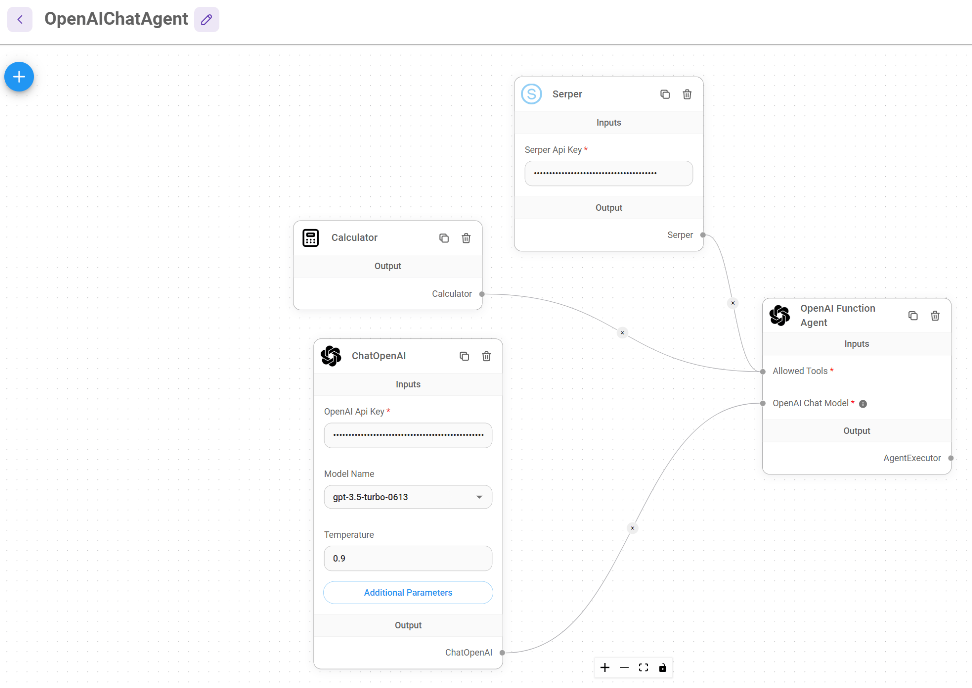
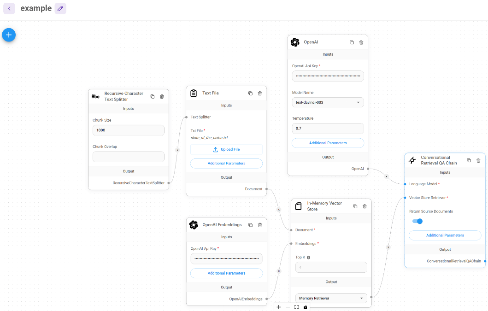

1. 将 `socket.io-client` 安装到您的前端应用程序

		yarn add socket.io-client
	或使用 npm

		npm install socket.io-client
	有关更多安装选项，请参阅[官方手册](https://socket.io/docs/v4/client-api/)
2. 导入它

		import socketIOClient from 'socket.io-client'
3. 建立连接

		const socket = socketIOClient("http://localhost:3000") //flowise url
4. 监听连接

		import { useState } from 'react'
		​
		const [socketIOClientId, setSocketIOClientId] = useState('');
		​
		socket.on('connect', () => {
		  setSocketIOClientId(socket.id)
		});
5. 发送查询 `socketIOClientId`

		async function query(data) {
		    const response = await fetch(
		        "http://localhost:3000/api/v1/prediction/<chatflow-id>",
		        {
		            method: "POST",
		            body: data
		        }
		    );
		    const result = await response.json();
		    return result;
		}
		​
		query({
		  "question": "Hey, how are you?",
		  "socketIOClientId": socketIOClientId
		}).then((response) => {
		    console.log(response);
		});
6. 监听 token 流

		socket.on('start', () => {
		  console.log('start');
		});
		​
		socket.on('token', (token) => {
		  console.log('token:', token);
		});
		​
		socket.on('sourceDocuments', (sourceDocuments) => {
		  console.log('sourceDocuments:', sourceDocuments);
		});
		​
		socket.on('end', () => {
		  console.log('end');
		});
7. 断开连接

		socket.disconnect();
		
### 8.3 嵌入
您还可以将聊天小部件嵌入到您的网站中。

只需将提供的嵌入代码复制粘贴到 `<body>` html 文件标记中的任意位置即可。

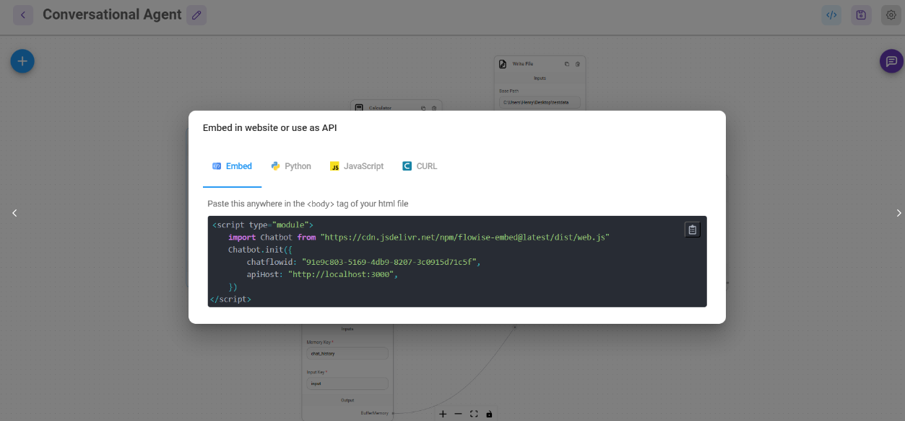

观看如何做到这一点：

[点击观看](https://github-production-user-asset-6210df.s3.amazonaws.com/26460777/237432016-c128829a-2d08-4d60-b821-1e41a9e677d0.mp4)

您还可以自定义自己的嵌入式聊天小部件 UI 并传递 `chatflowConfig` JSON 对象来覆盖现有配置。参见 [配置列表](https://github.com/FlowiseAI/FlowiseChatEmbed#configuration)。

要修改嵌入式聊天小部件的完整源代码，请按照以下步骤操作：

1. 分叉 [FlowiseChatEmbed](https://github.com/FlowiseAI/FlowiseChatEmbed) 存储库
2. 然后您可以进行任何代码更改并将其推送到分叉存储库。最常见的要求之一是删除 Flowise [标识](https://github.com/HenryHengZJ/FlowiseChatEmbed-Test/blob/main/src/components/Bot.tsx#L337)。
3. 然后您可以将其用作嵌入式聊天，如下所示：

	替换 `username` 为您的 Github 用户名和 `forked-repo` 您的分叉存储库。

		

	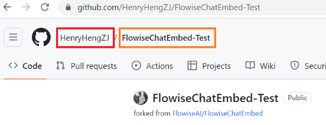

		

## 9 部署
Flowise 可以部署到任何云服务。以下是一些常用的云提供商：

- [Render](https://docs.flowiseai.com/deployment/render)
- [Railway](https://docs.flowiseai.com/deployment/railway)
- [Replit](https://docs.flowiseai.com/deployment/replit)

AWS、Azure、GCP、DigitalOcean 等云提供商的设置技术性稍强一些：

- [AWS](https://docs.flowiseai.com/deployment/aws)
- [Azure](https://docs.flowiseai.com/deployment/azure)
- [DigitalOcean](https://docs.flowiseai.com/deployment/digital-ocean)
- [GCP](https://docs.flowiseai.com/deployment/gcp)
- [Kubernetes-Helm](https://artifacthub.io/packages/helm/cowboysysop/flowise)	​			
## 10 环境变量
Flowise 支持不同的环境变量来配置您的实例， 您可以在文件夹`packages/server` 内的  `.env` 文件中指定以下变量。请参阅 [.env.example](https://github.com/FlowiseAI/Flowise/blob/main/packages/server/.env.example) 文件。
	
变量|描述|类型|默认
---|---|---|---
PORT|端口号|Number|	3000
FLOWISE_USERNAME|用户名|	String|	
FLOWISE_PASSWORD|密码|String|	
DEBUG|将日志打印到终端/控制台|Boolean|	
LOG_PATH|日志文件的存储位置|String|`/Flowise/packages/server`
LOG_LEVEL|要保存的记录器的不同日志级别|Enum String: `error`,`info`, `verbose`, `debug`|`info`
DATABASE_PATH|本地数据库存储位置|String| `your-home-dir/.flowise`
APIKEY_PATH|APIKEY保存路径|String|`/Flowise/packages/server`
SECRETKEY_PATH|保存加密密钥(用于加密/解密凭据)的位置|String| `/Flowise/packages/server`
PASSPHRASE|用于创建加密密钥的秘密短语|String|`MYPASSPHRASE`
EXECUTION_MODE| 预测是在自己的进程中运行还是在主进程中运行|Enum String: `child`, `main`|`main`
TOOL_FUNCTION_BUILTIN_DEP|NodeJS内置模块用于工具功能|String|
TOOL_FUNCTION_EXTERNAL_DEP|用于工具功能的外部模块|String|
				
### 10.1 执行模式
当 `EXECUTION_MODE` 设置为 `child ` 时，每个预测都会生成一个新的 [nodejs 子进程](https://nodejs.org/api/child_process.html)。这些子进程可以同时运行，证明了多核功能。然而，额外的进程需要更多的资源（CPU/RAM）。

当 EXECUTION_MODE 设置为 `main ` 时，每个预测都将在主线程中运行。缺点是不能充分利用多 CPU。

我们建议一般使用 `main` 模式，除非您有多个必须同时执行的密集预测任务。
### 10.2 内置和外部依赖项
出于安全原因，默认情况下工具功能仅允许某些依赖项。通过设置以下环境变量可以解除内置和外部模块的限制：

- `TOOL_FUNCTION_BUILTIN_DEP`：对于内置模块
- `TOOL_FUNCTION_EXTERNAL_DEP`：对于来自 `Flowise/node_modules` 目录的外部模块

		# 允许使用所有内置模块
		export TOOL_FUNCTION_BUILTIN_DEP=*
		​
		# 只允许内置模块使用 fs
		export TOOL_FUNCTION_BUILTIN_DEP=fs
		​
		# 只允许外部模块使用 crypto 和 fs
		export TOOL_FUNCTION_BUILTIN_DEP=crypto,fs
		​
		# 允许使用 axios,moment 外部 npm 模块。
		export TOOL_FUNCTION_EXTERNAL_DEP=axios,moment
		
### 10.3 调试和日志
- `DEBUG`：如果设置为 `true`，会将日志打印到终端/控制台：

	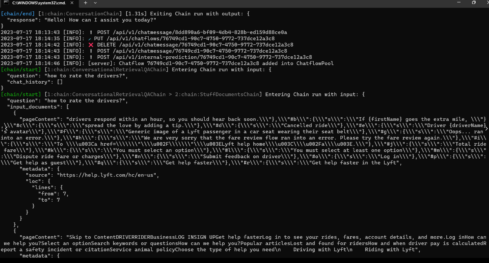
- `LOG_LEVEL`：要保存的记录器的不同日志级别。可以是 `error、info、verbose` 或 `debug`.默认情况下，它设置为 `info`,仅`logger.info` 保存到日志文件中。如果您想获得完整的详细信息，请设置为 `debug`。

	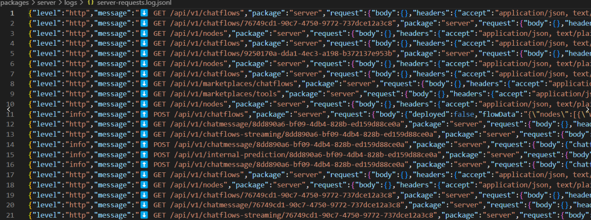
	
	server-requests.log.jsonl - 记录发送到 Flowise 的每个请求
	
	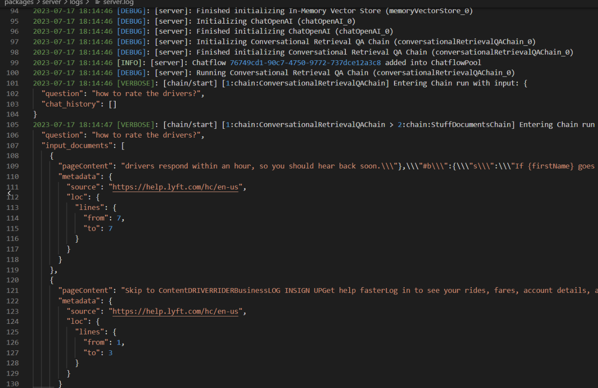
	server.log - 记录 Flowise 上的一般操作

	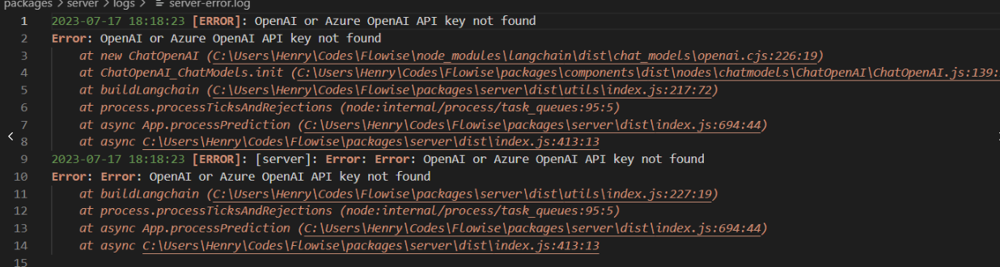
	server-error.log - 使用堆栈跟踪记录错误

### 10.4 NPM
您可以在使用 npx 运行 Flowise 时设置所有这些变量。例如：

	npx flowise start --PORT=3000 --DEBUG=true
### 10.5 Docker
您可以在 `docker` 文件夹内的 `.env` 文件中设置所有这些变量。请参阅文件 [.env.example](https://github.com/FlowiseAI/Flowise/blob/main/docker/.env.example)。

## 11 文件装载机
即将推出
## 12 聊天模型 Chat Models
聊天模型将消息列表作为输入，并返回模型生成的消息作为输出。这些模型（例如gpt-3.5-turbo或gpt4）比其前身 Completions 模型（例如 text-davincii-003 ）更强大且更便宜。

以下是 Flowise 中可用的一些聊天模型：

### 12.1 聊天本地 AI 设置
[LocalAI](https://github.com/go-skynet/LocalAI) 是一个直接替代 REST API，与本地推理的 OpenAI API 规范兼容。它允许您使用消费级硬件在本地或本地运行 LLM（不仅如此），支持与 ggml 格式兼容的多个模型系列。

要在 Flowise 中使用 ChatLocalAI，请按照以下步骤操作：

- 1 获取代码

		git clone https://github.com/go-skynet/LocalAI
		cd LocalAI
- 2 拷贝模型到 models 目录
	
		cp your-model.bin models/

	例如：
	从 [gpt4all.io](gpt4all.io) 下载模型之一
	
		# 下载 gpt4all-j 模型到 models 目录
		wget https://gpt4all.io/models/ggml-gpt4all-j.bin -O models/ggml-gpt4all-j
	
	在该 `/models` 文件夹中，您应该能够在其中看到下载的模型：
	
	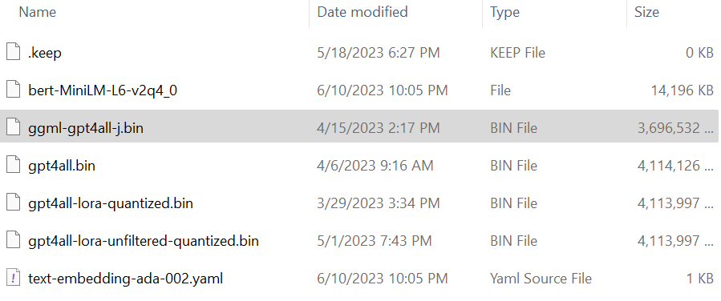
	
	请参阅[此处](https://localai.io/model-compatibility/index.html)了解支持的型号列表。
- 3 启动

		docker-compose up -d --pull always
- 4 现在可以在 localhost:8080 访问 API

		# Test API
		curl http://localhost:8080/v1/models
		# {"object":"list","data":[{"id":"ggml-gpt4all-j.bin","object":"model"}]}

### 12.2 Flowise 设置
将新的 ChatLocalAI 组件拖放到画布上

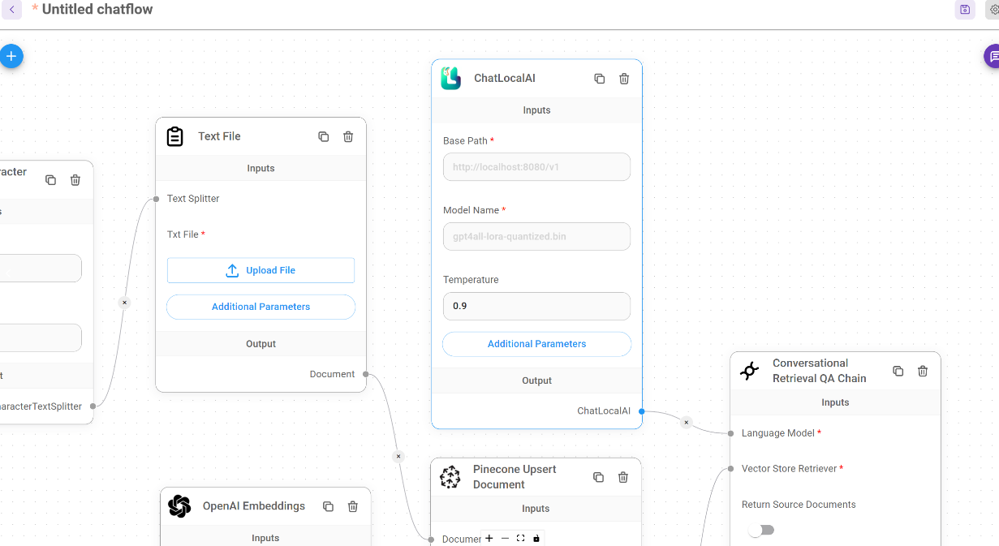

填写字段：

- `Base Path` 

	来自 LocalAI 的基本 url，例如 [http://localhost:8080/v1](http://localhost:8080/v1)
- `Model Name`

	您要使用的型号。请注意，它必须位于 LocalAI 目录的  `/models` 文件夹内。例如：`ggml-gpt4all-j.bin`

就是这样！有关更多信息，请参阅 LocalAI [docs](https://localai.io/basics/getting_started/index.html)。

## 13 Embeddings 嵌入式
嵌入式可用于创建文本数据的数字表示。这种数字表示很有用，因为它可以用来查找相似的文档。

以下是 Flowise 中可用的一些嵌入模型：
### ​13.1 LocalAI 嵌入​式安装
[LocalAI](https://github.com/go-skynet/LocalAI) 是一个直接替代 REST API，与本地推理的 OpenAI API 规范兼容。它允许您使用消费级硬件在本地或本地运行 LLM（不仅如此），支持与 ggml 格式兼容的多个模型系列。

要在 Flowise 中使用 LocalAI Embeddings，请按照以下步骤操作：

1. 下载项目

		git clone https://github.com/go-skynet/LocalAI
		cd LocalAI
2. LocalAI 提供 [API endpoint](https://localai.io/api-endpoints/index.html#applying-a-model---modelsapply) 来下载/安装模型。在此示例中，我们将使用 BERT Embeddings 模型：

	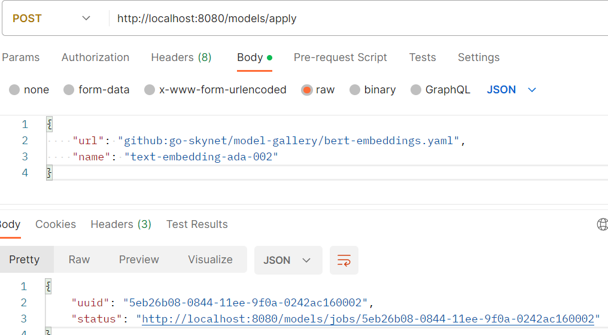
3. 在该 `/models` 文件夹中，您应该能够在其中看到下载的模型：

	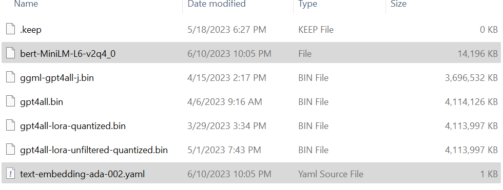
4.  您现在可以测试嵌入：

		curl http://localhost:8080/v1/embeddings -H "Content-Type: application/json" -d '{
		    "input": "Test",
		    "model": "text-embedding-ada-002"
		  }'
5. 响应应如下所示：

	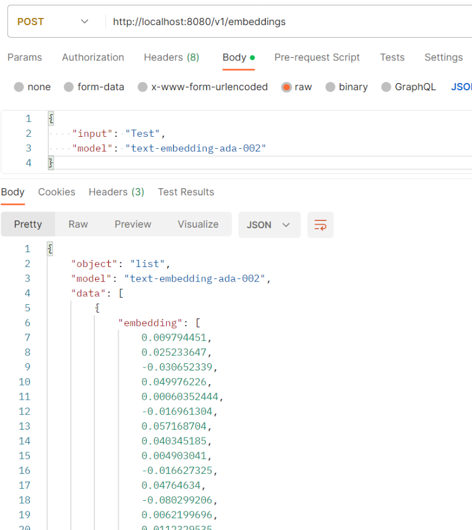

### 13.2 Flowise 设置
将新的 LocalAIEmbeddings 组件拖放到画布上：

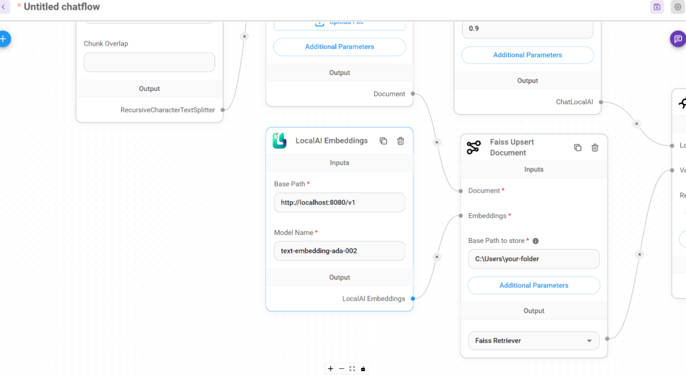

填写字段：

- `Base Path`

	来自 LocalAI 的基本 url，例如 [http://localhost:8080/v1](http://localhost:8080/v1)
- `Model Name`

	您要使用的型号。请注意，它必须位于 LocalAI 目录的  `/models` 文件夹内。例如：`text-embedding-ada-002`

就是这样！有关更多信息，请参阅 LocalAI [docs](https://localai.io/models/index.html#embeddings-bert)。
​
## ​14 记忆
记忆可以让你与人工智能聊天，就好像人工智能拥有之前对话的记忆一样。

	人类：嗨，我是鲍勃
	AI：你好，鲍勃！很高兴认识你。今天我能为您提供什么帮助？
	人类：我叫什么名字？
	AI：正如您之前提到的，您的名字是鲍勃。
​
在幕后，这些对话存储在数组或数据库中并作为上下文提供给 LLM。例如：

	You are an assistant to a human, powered by a large language model trained by OpenAI.
	​
	Whether the human needs help with a specific question or just wants to have a conversation about a particular topic, you are here to assist.
	​
	Current conversation:
	{history}
有不同类型的存储内存的方法：

- Buffer Memory(缓冲存储器)
- Buffer Window Memory(缓冲窗口内存)
- Conversation Summary Memory(对话总结记忆)
- Zep Memory(Zap 记忆)

### 14.1 泽普记忆
[Zep](https://github.com/getzep/zep) 是 LLM 应用程序的长期记忆存储。它存储、总结、嵌入、索引和丰富 LLM 应用程序/聊天机器人历史记录，并通过简单、低延迟的 API 公开它们。

当您使用 Flowise 作为 API 并希望 AI 记住不同用户之间的对话时，它适合。您可以使用 `sessionId` 来实现这一点。

####  14.1.1 部署 Zep
可以轻松的将 Zep 部署到 [Render](https://render.com/)、[Flyio](https://fly.io/) 等云服务。[如果想在本地部署，请按照这个快速指南](https://github.com/getzep/zep#quick-start)启动 docker 容器。

在此示例中，我们将部署到渲染。

1. 前往 [Zep Repo](https://github.com/getzep/zep#quick-start) 并单击“部署到渲染”
2. 这将带您进入渲染的蓝图页面，然后只需单击创建新资源

	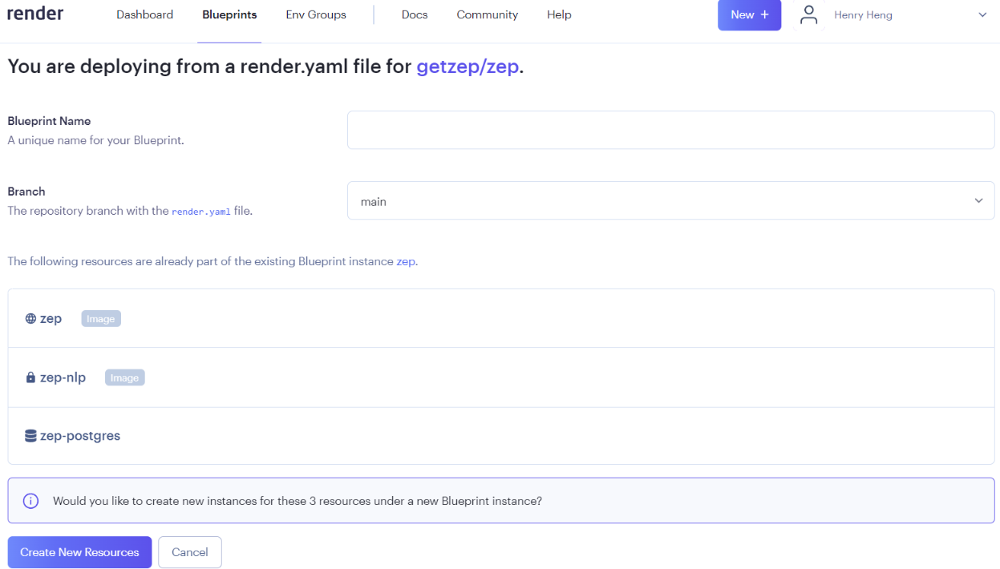
3. 部署完成后，您应该会在仪表板上看到创建的 3 个应用程序

	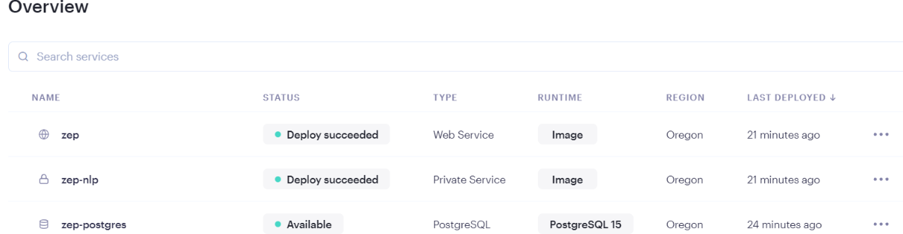
4. 只需单击第一个名为 `zep` 的按钮并复制部署的 URL

	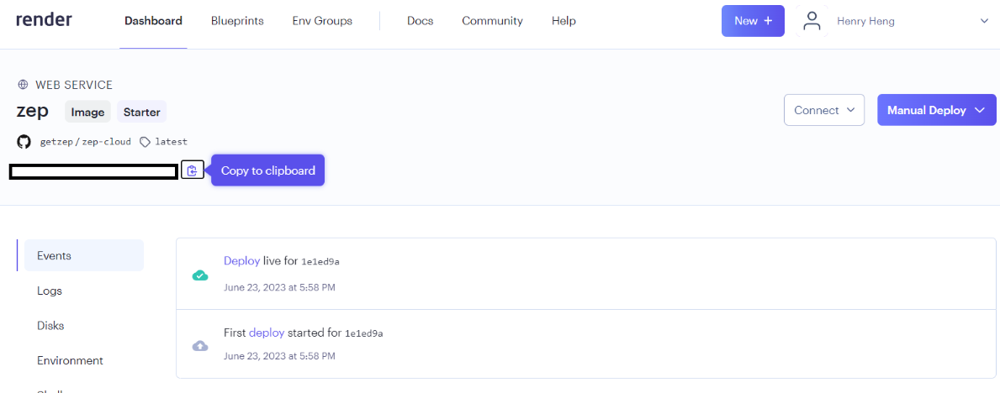

#### 14.1.2 在 Flowise UI 中使用
1. 返回 Flowise 应用程序，只需创建一个新画布或使用市场中的模板之一。在此示例中，我们将使用简单对话链

	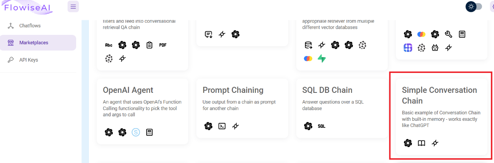
2. 用 Zep 内存替换缓冲内存。然后将 `Base URL` 替换为您在上面复制的 `Zep URL`

	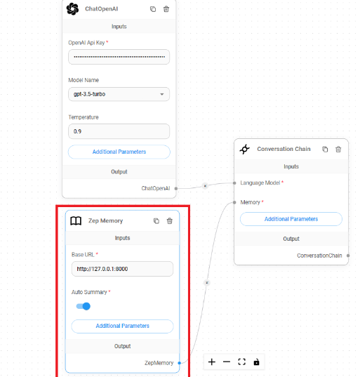
3. 保存聊天流并进行测试以查看对话是否被记住。

	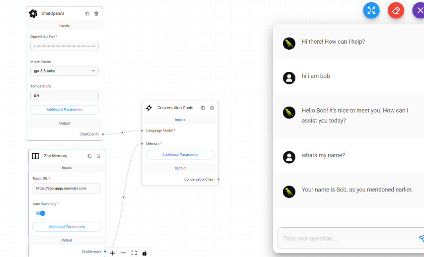
4. 现在尝试清除聊天记录，看看它是否还记得之前的对话

	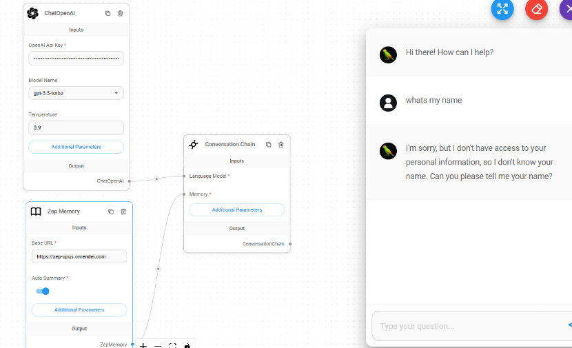

默认情况下，第一个聊天消息 ID 将用作 `Zep Memory` 的 `sessionId` ，让 AI 记住对话。

清除聊天记录后，所有聊天消息都将被删除。当用户提出新问题时，系统会使用新 ID 保存一条新聊天消息。第一条新聊天消息的 id 将用作新的`sessionId` 。从上图可以看出，清除聊天记录后，它不会记住用户名。

#### 14.1.3 在 Flowise API 中使用
要用作 API，特别是当多个用户与流程交互时，您可以使用 `sessionId` 来区分每个用户之间的对话。

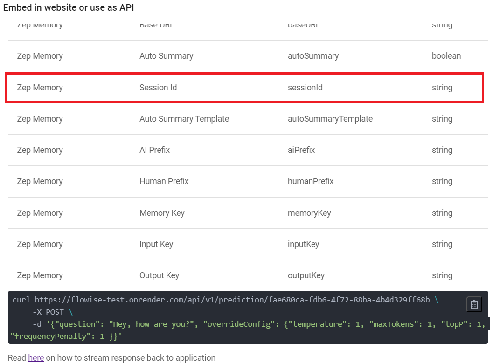
例如，在前端应用程序中，您可以使用 `userid` 和 `timestamp` 的组合动态生成 `sessionId` 。当用户从前端应用程序清除聊天时，您可以生成一个具有相同用户 ID的新 `sessionId` 和 新的 时间戳。这将开始一个新的聊天会话，没有以前的对话记忆。

POST 调用示例：

## 15 工具
工具是代理可以用来与世界交互的功能。这些工具可以是通用实用程序（例如搜索）、其他链，甚至其他代理。

请参阅[此处](https://github.com/FlowiseAI/Flowise/tree/main/packages/components/nodes/tools)了解 Flowise 当前支持的工具列表。
### 15.1 定制工具
#### 15.1.1 问题
函数通常接受结构化输入数据。假设您希望 LLM 能够调用 Airtable Create Record [API](https://airtable.com/developers/web/api/create-records)，正文参数必须以特定方式构建。例如：

	"records": [
	  {
	    "fields": {
	      "Address": "some address",
	      "Name": "some name",
	      "Visited": true
	    }
	  }
	]
理想情况下，我们希望 LLM 返回正确的结构化数据，如下所示：

	{
	  "Address": "some address",
	  "Name": "some name",
	  "Visited": true
	}
因此我们可以提取该值并将其解析为 API 所需的正文。然而指示 LLM 输出精确的模式是很困难的。

借助新的 [OpenAI 函数调用](https://openai.com/blog/function-calling-and-other-api-updates) 模型，现在一切都成为可能。`gpt-4-0613` 和`gpt-3.5-turbo-0613` 经过专门培训以返回结构化数据。该模型将智能地选择输出一个包含参数的 JSON 对象来调用这些函数。

#### 15.1.2 教程
目标：让代理自动获取股票价格变动，检索相关股票新闻，并向 Airtable 添加新记录。

让我们开始吧🚀
#### 15.1.3 创建工具
我们需要 3 个工具来实现目标：
	
- 获取股价变动

	使用以下详细信息创建一个新工具（您可以根据需要进行更改）：
	
	- Name `get_stock_movers`
	- Description `获取价格/成交量变动最大的股票，例如活跃股、上涨股、下跌股等。`
	
	描述是一个重要的部分，因为 ChatGPT 依靠它来决定何时使用该工具。
	
	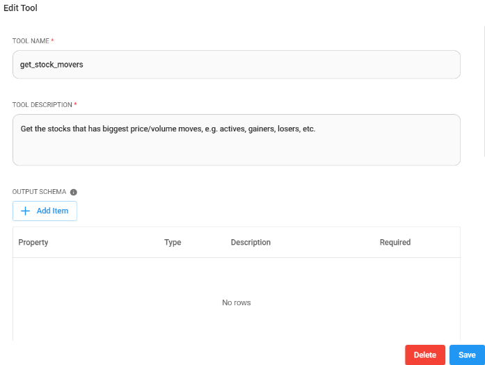
	
	- JavaScript 函数

		我们将使用 [morning-star](https://rapidapi.com/apidojo/api/morning-star) `/market/v2/get-movers` API 来获取数据。首先，您必须单击“订阅测试”（如果您还没有这样做），然后复制代码并将其粘贴到 JavaScript 函数中。 
		
		- `const fetch = require('node-fetch');` 在顶部添加以导入库。您可以导入任何内置的 NodeJS[模块](https://www.w3schools.com/nodejs/ref_modules.asp)和 [外部库](https://github.com/FlowiseAI/Flowise/blob/main/packages/components/src/utils.ts#L289)。
		- 最后返回 `result`。
	
			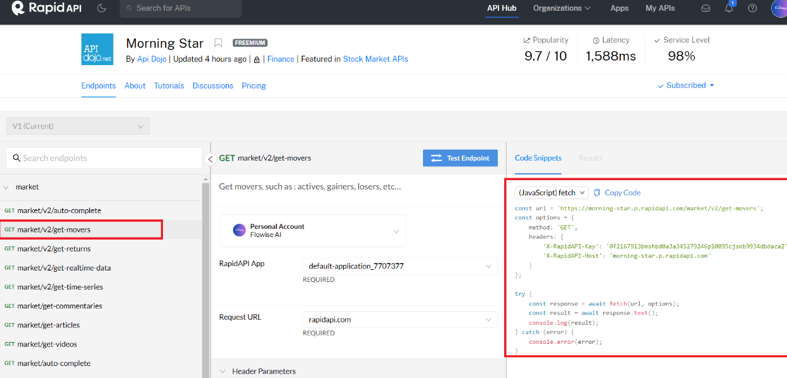
		- 最终代码应该是：
		
				const fetch = require('node-fetch');
				const url = 'https://morning-star.p.rapidapi.com/market/v2/get-movers';
				const options = {
					method: 'GET',
					headers: {
						'X-RapidAPI-Key': 'replace with your api key',
						'X-RapidAPI-Host': 'morning-star.p.rapidapi.com'
					}
				};
				​
				try {
					const response = await fetch(url, options);
					const result = await response.text();
					console.log(result);
					return result;
				} catch (error) {
					console.error(error);
					return '';
				}
		- 现在可以保存它	
- 获取股票新闻

	使用以下详细信息创建一个新工具（您可以根据需要进行更改）：
	
	- 名称： get_stock_news
	- 描述：获取股票的最新消息
	- 输出架构：
		- Property: performanceId
		- Type: string
		- Description

			股票的 id，API 中称为 `performanceID`
		- Required: true
	
	输出架构告诉 ChatGPT 以 JSON 对象的形式返回什么。在本例中，我们期望一个如下所示的 JSON 对象：
	
		{ "performanceId": "SOME TICKER" }
	
	
	- JavaScript 函数

		我们将使用 [morning-star](https://rapidapi.com/apidojo/api/morning-star) ` /news/list` API 来获取数据。
		
		- 首先，您必须单击“订阅测试”（如果您还没有这样做），然后复制代码并将其粘贴到 JavaScript 函数中。
			- 添加 `const fetch = require('node-fetch');` 在顶部添加以导入库。您可以导入任何内置的 NodeJS [模型](https://www.w3schools.com/nodejs/ref_modules.asp)和 [外部库](https://github.com/FlowiseAI/Flowise/blob/main/packages/components/src/utils.ts#L289)。
			- 最后返回 `result `。
		- 接下来，将硬编码的 url 查询参数 PerformanceId: `0P0000OQN8` 替换为 Output Schema 中指定的属性变量 `$performanceId`
		- 您可以通过在变量名称前面附加前缀 `$` ，将输出架构中指定的任何属性用作 JavaScript 函数中的变量。
	
			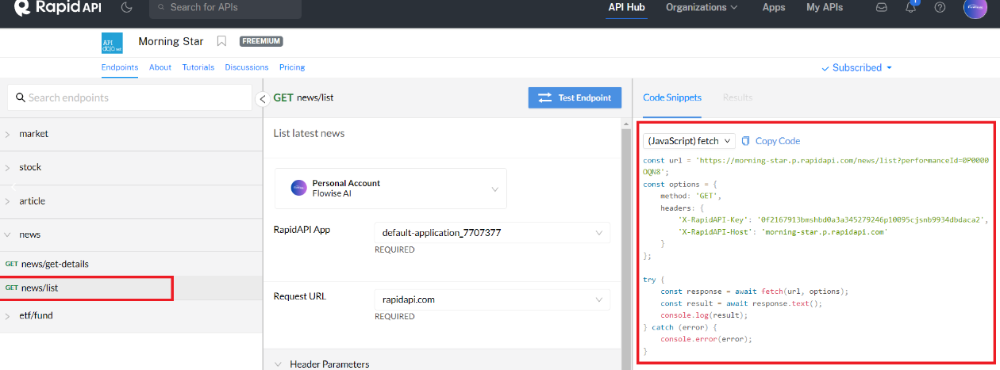
		- 最终代码：
	
				const fetch = require('node-fetch');
				const url = 'https://morning-star.p.rapidapi.com/news/list?performanceId=' + $performanceId;
				const options = {
					method: 'GET',
					headers: {
						'X-RapidAPI-Key': 'replace with your api key',
						'X-RapidAPI-Host': 'morning-star.p.rapidapi.com'
					}
				};
				​
				try {
					const response = await fetch(url, options);
					const result = await response.text();
					console.log(result);
					return result;
				} catch (error) {
					console.error(error);
					return '';
				}
		- 现在可以保存它
- 添加 Airtable 记录

	使用以下详细信息创建一个新工具（您可以根据需要进行更改）：

	- Name: `add_airtable`
	- Description: 将股票、新闻摘要和价格变动添加到 Airtable
	- 输出架构：
		- Property: stock
		- Type: string
		- Description: 股票行情
		- Required: true
		
		- Property: move
		- Type: string
		- Description: 价格变动百分比
		- Required: true
		
		- Property: news_summary
		- Type: string
		- Description: 股票新闻摘要
		- Required: true

ChatGPT 将返回一个如下所示的 JSON 对象：

	{ "stock": "SOME TICKER", "move": "20%", "news_summary": "Some summary" }

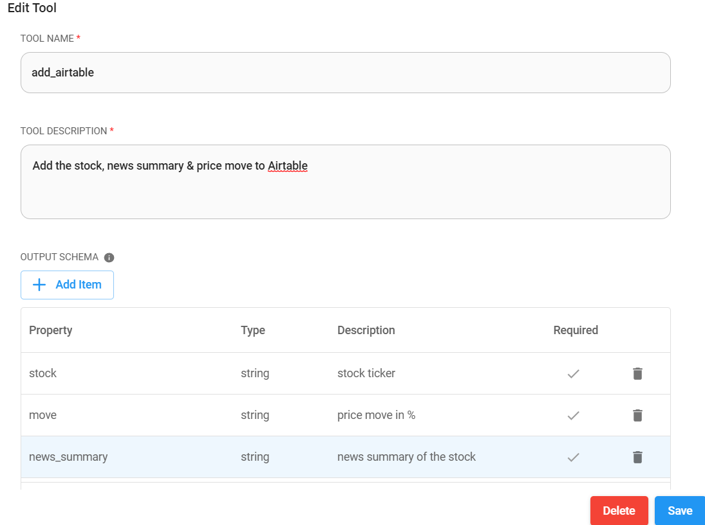

- JavaScript 函数：我们将使用 [Airtable Create Record API](https://airtable.com/developers/web/api/create-records) 在现有表中创建新记录。[这里](https://www.highviewapps.com/kb/where-can-i-find-the-airtable-base-id-and-table-id/)找到 tableId 和 baseId 。[还需要创建个人 token ，在此处](https://www.highviewapps.com/kb/how-do-i-create-an-airtable-personal-access-token/)了解操作方法。
- 最终代码应如下所示。注意我们如何传入 `$stock` , `$move` 和 `$news_summary` 作为变量：

		const fetch = require('node-fetch');
		const baseId = 'your-base-id';
		const tableId = 'your-table-id';
		const token = 'your-token';
		​
		const body = {
			"records": [
				{
					"fields": {
						"stock": $stock,
						"move": $move,
						"news_summary": $news_summary,
					}
				}
			]
		};
		​
		const options = {
			method: 'POST',
			headers: {
				'Authorization': `Bearer ${token}`,
				'Content-Type': 'application/json'
			},
			body: JSON.stringify(body)
		};
		​
		const url = `https://api.airtable.com/v0/${baseId}/${tableId}`
		​
		try {
			const response = await fetch(url, options);
			const text = await response.text();
			return text;
		} catch (error) {
			console.error(error);
			return '';
		}
- 现在可以保存它
	
您应该会看到创建了 3 个工具

#### 15.1.4 创建流程
您可以使用市场上的 `OpenAI Function Agent` 模板并将工具替换为 `Custom Tool` 。选择您创建的工具。 

	注：OpenAI Function Agent 目前仅支持 0613 型号。
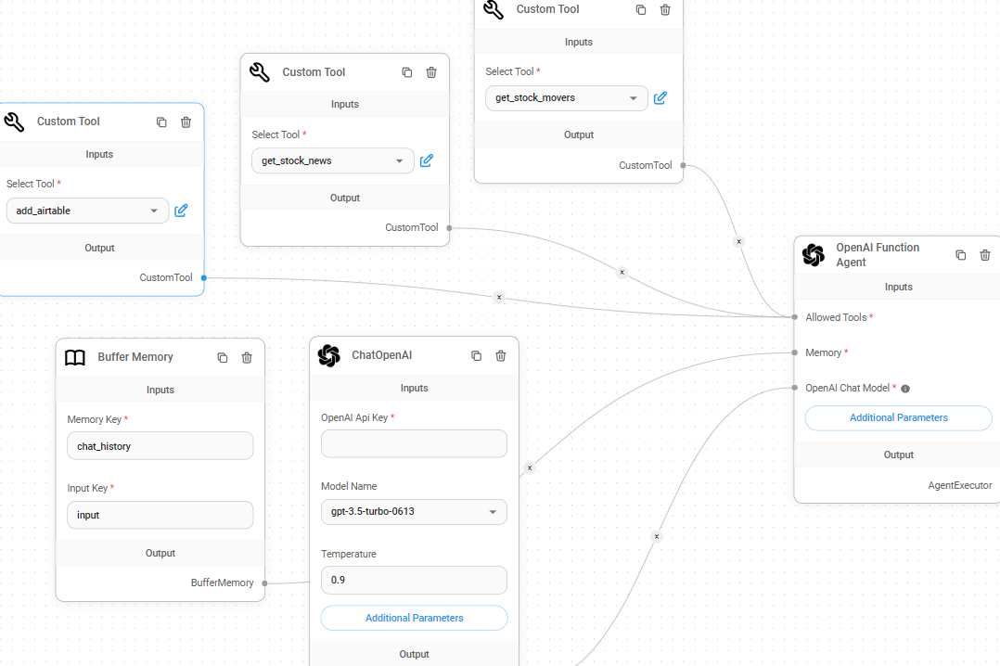

- 保存聊天流并开始测试。对于初学者，
	- 人提问
	
			今天价格变动最大的股票是什么？
	- AI 回答
			
			今天价格变动最大的股票是 Overstock.com (OSTK)，价格变动为 17.47%。
- 然后，您可以跟进另一个问题来获取该特定股票的新闻：
	- 人提问

			该股票的最新消息有哪些可能导致价格变动？
	- AI 回答		

			以下是可能导致价格变动的 Overstock.com (OSTK) 最新消息：

			1. 标题：“Overstock 股价飙升，成功以 2150 万美元竞购 Bed Bath & Beyond 资产” 来源：MarketWatch 发布日期：2023 年 6 月 22 日 摘要：成功竞购 Bed Bath & Beyond 资产后，Overstock.com 股价大幅上涨2150万。
			
			2. 标题：“考虑在 Meta Platforms、Overstock.com、沃尔玛、家得宝或联合包裹服务公司中交易期权或股票吗？” 来源：美通社 发布日期：2023 年 6 月 22 日 摘要：这篇新闻文章讨论了投资者可能考虑的潜在交易选项和股票，包括 Overstock.com。
			
			请注意，这些新闻文章仅供参考，可能不是价格变动的唯一原因。始终建议在做出任何投资决定之前进行彻底的研究和分析。
- 最后，您可以要求 ChatGPT 将新记录添加到 Airtable：
	- 人提问

			您可以向 Airtable 添加包含股票行情、价格变动和新闻摘要的记录吗？
	- AI 回答
	
			我已向 Airtable 添加了一条记录，其中包含以下详细信息：

			股票代码：OSTK 价格变动：17.47% 新闻摘要：Overstock.com 成功竞购价值 2150 万美元的 Bed Bath & Beyond 资产后，其股价大幅上涨。
​
 瞧！这样您就可以创建自己的自定义工具并将其与 OpenAI Function Agent 一起使用！

#### 15.1.5 附加依赖项
您可以将任何内置 NodeJS [模块](https://www.w3schools.com/nodejs/ref_modules.asp) 和支持的 [外部库](https://github.com/FlowiseAI/Flowise/blob/main/packages/components/src/utils.ts#L289) 导入到 `JavaScript Function`中。

1. 要导入任何不受支持的库，您可以轻松地将新的 npm 包添加到 `package.jsoninpackages/components` 文件夹中。

		cd Flowise && cd packages && cd components
		yarn add <your-library>
		cd .. && cd ..
		yarn install
		yarn build
2. 然后，将导入的库添加到 `TOOL_FUNCTION_EXTERNAL_DEP` 环境变量中。参考更多细节。
3. 启动应用程序
	
		yarn start
4. 然后，您可以在 JavaScript 函数中使用新添加的库，如下所示：

		const axios = require('axios')

### 15.2 Zapier NLA
#### 15.2.1 先决条件
1. [登录](https://zapier.com/app/login)或 [注册](https://zapier.com/sign-up) Zapier
2. [链接](https://nla.zapier.com/dev/start/) 到 NLA 开发提供商。
3. 在[授权页](https://nla.zapier.com/credentials/) 激活你的 APIKEY 

#### 15.2.2 设置
##### 15.2.2.1 Zapier NLA
1. 前往行动 [Zapier Actions](https://nla.zapier.com/dev/actions/)

	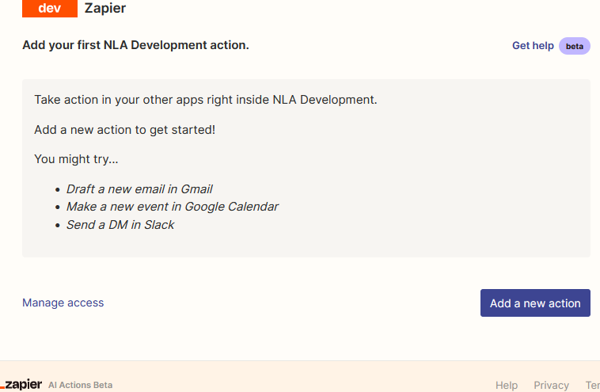
2. 单击添加新 Actions

	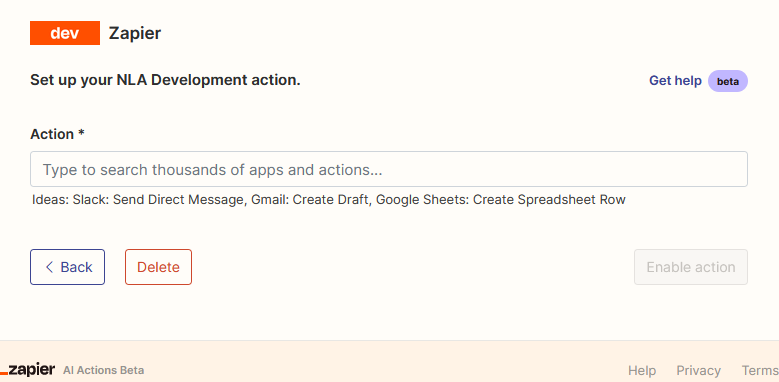
3. 输入 `Zoho Mail: Send Email` “操作”字段，然后选择或连接新帐户

	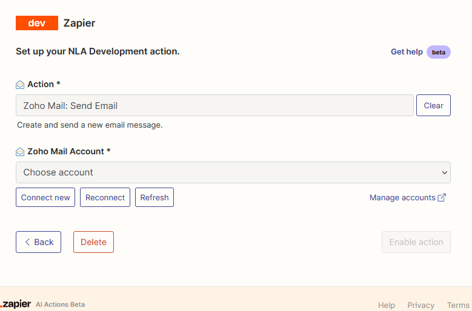
4. 将所有内容保留为默认值，然后单击 `Enable action`

	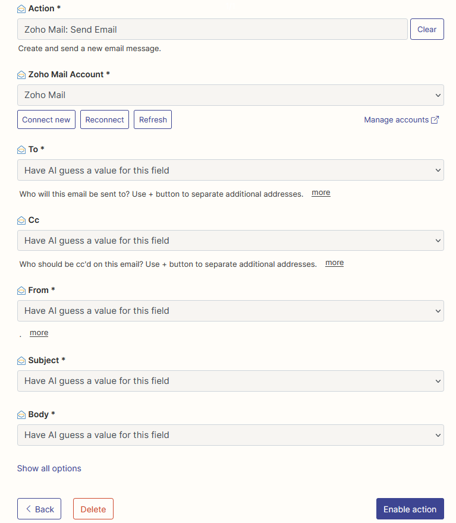

##### 15.2.2.2 Flowise
1. 转到 `Marketplaces` ，滚动到最底部并单击 `Zapier NLA`

	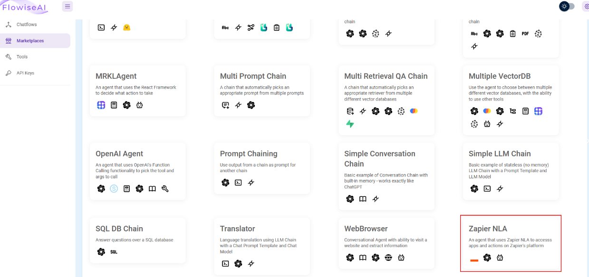
2. 单击使用模板

	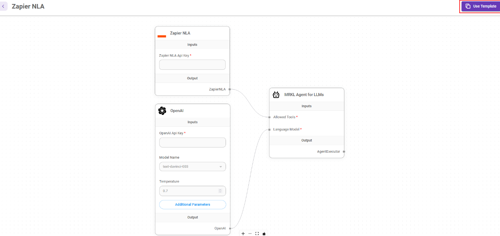
3. 填写必填字段 `OpenAI Api Key` 和 `Zapier NLA API Key` ，单击 `Save Chatflow`

	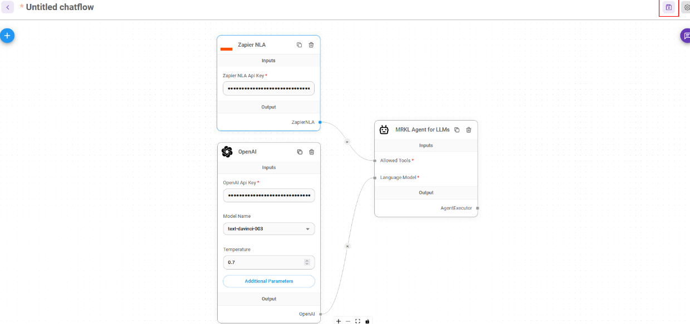
4. 要求 MRKL 代理执行操作

		Send a Zoho email to chungyau.ong@flowiseai.com, body content is Testing Zapier NLA.
		
	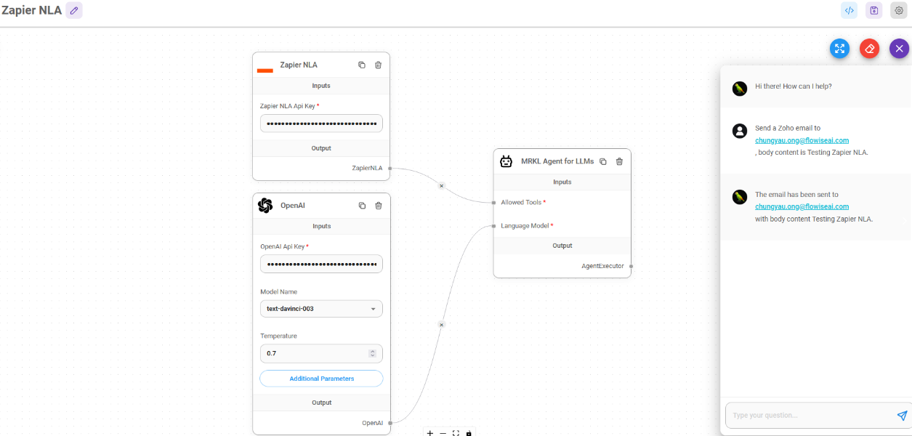	
5. 瞧 [🎉](https://emojipedia.org/party-popper/)，您应该会看到电子邮件已到达您的 Zoho 邮箱

	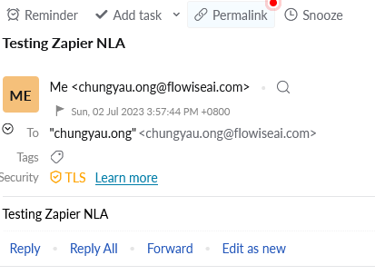
		
#### 15.2.3 资源
- [​LangChainNLA](https://js.langchain.com/docs/modules/agents/tools/zapier_agent)
- [nla.zapier](https://nla.zapier.com/start/)

## 16 向量数据库
尽快
### 16.1 Pinecone
#### 16.1.1 先决条件
1. 注册一个 [松果帐户](https://www.pinecone.io/)
2. 单击创建您的第一个索引

	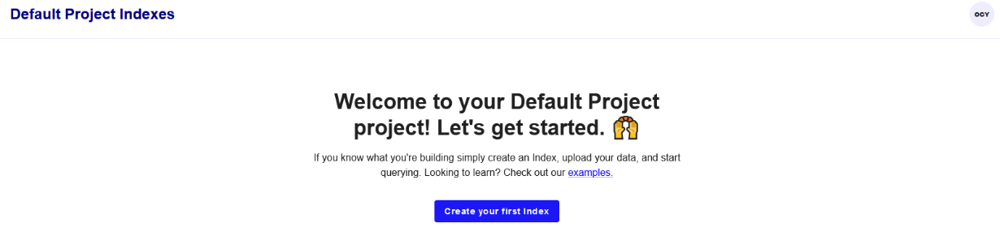
3. 输入必填字段
	- `Index Name`

		要创建的索引的名称。（例如 elon-musk）
	- `Dimensions` 

		要插入索引中的向量的大小。（例如1536）

	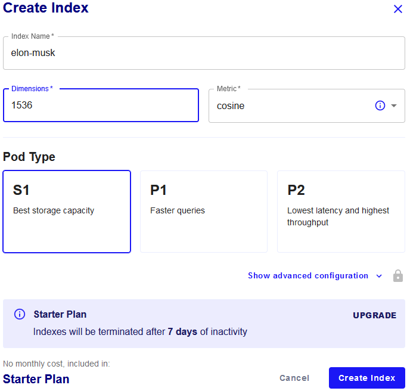
4. 单击创建索引

#### 16.1.2 设置
1. 获取/创建您的 API 密钥
 
	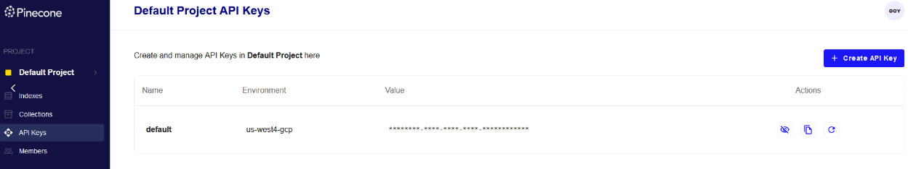
2. 将每个详细信息（ API 密钥、环境、索引名称）复制并粘贴到 `Pinecone Upsert 文档节点` 或 `Pinecone 加载现有索引节点`
中​​
	
	
3. 文档可以与 [document-loaders](https://docs.flowiseai.com/document-loaders) 类别下的任何节点连接 
4. 嵌入可以与 [embeddings](https://docs.flowiseai.com/embeddings) 类别下的任何节点连接

#### 16.1.3 资源
- [​LangChain JS pinecone](https://js.langchain.com/docs/modules/indexes/vector_stores/integrations/pinecone)
- [pinecone  Node.JS](https://docs.pinecone.io/docs/node-client)
​
### 16.2 Supabase
#### 16.2.1 先决条件
1. 注册 [Supabase](https://supabase.com/) 帐户
2. 单击 New project

	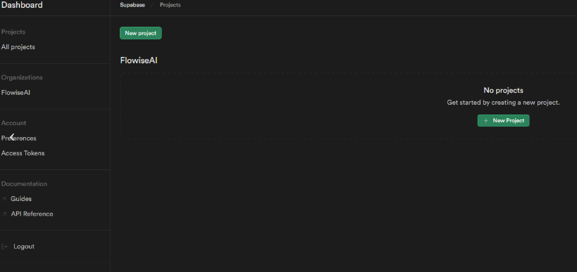
3. 输入必填字段
	- `Name`，要创建的项目名称。（例如 Flowise）
	- `Database`，postgres 数据库的密码。（例如单击“生成密码”）

	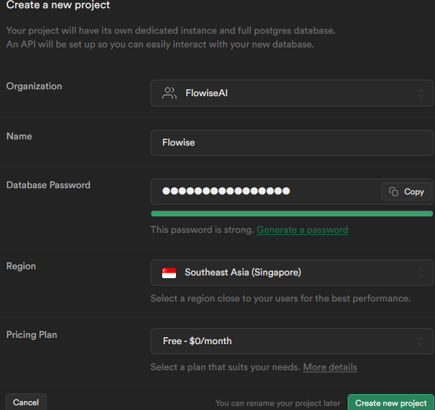
4. 点击 `Create new project` 并等待项目完成设置
5. 单击 SQL 编辑器

	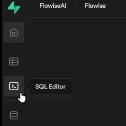
6. 单击 `New query`

	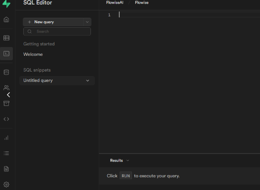
7. 复制并粘贴 [query](https://js.langchain.com/docs/modules/indexes/vector_stores/integrations/supabase#create-a-table-and-search-function-in-your-database)并通过 `Ctrl + Enter` 或单击`RUN`
	- `Table name` 文档
	- `Query name` match_documents

			-- Enable the pgvector extension to work with embedding vectors
			create extension vector;
			​
			-- Create a table to store your documents
			create table documents (
			  id bigserial primary key,
			  content text, -- corresponds to Document.pageContent
			  metadata jsonb, -- corresponds to Document.metadata
			  embedding vector(1536) -- 1536 works for OpenAI embeddings, change if needed
			);
			​
			-- Create a function to search for documents
			create function match_documents (
			  query_embedding vector(1536),
			  match_count int DEFAULT null,
			  filter jsonb DEFAULT '{}'
			) returns table (
			  id bigint,
			  content text,
			  metadata jsonb,
			  similarity float
			)
			language plpgsql
			as $$
			#variable_conflict use_column
			begin
			  return query
			  select
			    id,
			    content,
			    metadata,
			    1 - (documents.embedding <=> query_embedding) as similarity
			  from documents
			  where metadata @> filter
			  order by documents.embedding <=> query_embedding
			  limit match_count;
			end;
			$$;
​
​	

#### 16.2.2 设置
1. 单击 `Project Settings`

	
2. 获取您的项目 URL 和 API 密钥

	
3. 将每个详细信息（ API 密钥、URL、表名称、查询名称）复制并粘贴到Supabase Upsert 文档节点或Supabase 加载现有节点
​​
​​	
4. 文档可以与 [document-loaders](https://docs.flowiseai.com/document-loaders) 类别下的任何节点连接
5. 嵌入可以与 [embeddings](https://docs.flowiseai.com/embeddings) 类别下的任何节点连接

#### 16.2.3资源
- [LangChainSupabase](https://js.langchain.com/docs/modules/indexes/vector_stores/integrations/supabase)
- [Supabase文章](https://supabase.com/blog/openai-embeddings-postgres-vector)
​
​
### 16.3 ​Chroma
#### 16.3.1 先决条件
1. 下载并安装 [docker](https://www.docker.com/)和[Git](https://git-scm.com/)
2. 使用您的终端克隆 [chroma repo](https://github.com/chroma-core/chroma)

		git clone https://github.com/chroma-core/chroma.git
			
3. 将目录路径更改为克隆的 Chroma
	
		cd chroma
4. 运行 docker compose 构建 Chroma 镜像和容器

		docker-compose up -d --build

#### 16.3.2 设置
1. 将集合名称输入 `Chroma Upsert Document` 节点或 `Chroma Load Existing Index` 节点。（例如埃隆·马斯克）
​​
​​			
2. 文档可以与 [document-loaders](https://docs.flowiseai.com/document-loaders) 类别下的任何节点连接
3. 嵌入可以与 [embeddings](https://docs.flowiseai.com/embeddings) 类别下的任何节点连接

#### 16.3.3 资源
- [LangChain JS chroma](https://js.langchain.com/docs/modules/indexes/vector_stores/integrations/chroma)
- [Chroma Getting Started](https://docs.trychroma.com/getting-started)

## ​17 第三方平台集成
Flowise可以在第三方平台上使用。以下是一些使用示例：

- [zapier-zaps](https://docs.flowiseai.com/3rd-party-platform-integration/zapier-zaps)

### 17.1 zapier-zaps

#### 17.1.1 先决条件
1. [登录](https://zapier.com/app/login)或[注册](https://zapier.com/sign-up)Zapier
2. 请参阅[部署](https://docs.flowiseai.com/deployment)以创建 Flowise 的云托管版本。

#### 17.1.2 设置
1. 前往 [zapier-zaps](https://zapier.com/app/zaps)
2. 单击创建

			

#### 17.1.3 接收触发消息
1. 单击或搜索Discord

			
2. 选择作为事件发布到频道(New Message Posted to Channel)的新消息，然后单击继续

	
3. 登录您的 Discord 帐户

	
4. 将 `Zapier Bot` 添加到您的首选服务器

	
5. 授予适当的权限并单击授权，然后单击继续

	
	
6. 选择您喜欢的与 Zapier Bot 交互的渠道，然后单击继续

	
7. 向您在步骤 8 中选择的频道发送消息

	
8. 单击测试触发器

	
9. 选择您的消息，然后单击“继续”以选择记录

	

#### 17.1.4 过滤掉 Zapier 机器人的消息
1. 单击或搜索过滤器

	
2. 将过滤器配置为如果收到来自 Zapier Bot 的消息则不继续，然后单击继续

	

#### 17.1.5 FlowiseAI 生成结果消息
1. 点击 + ，点击或搜索 FlowiseAI

	
2. 选择将预测(Make Prediction)作为事件，然后单击继续

	
3. 单击“登录”并插入您的详细信息，然后单击 `Yes, Continue to FlowiseAI`

	
	
4. 选择 Discord 中的内容和您的 Flow ID，然后单击继续

	
5. 单击“测试操作”并等待结果

	

#### 17.1.6 发送结果消息
1. 单击+ ，单击或搜索 Discord

	
2. 选择将频道消息( Send Channel Message)作为事件发送，然后单击继续

	
3. 选择您登录的 Discord 帐户，然后单击“继续”

	
4. 为通道选择您喜欢的通道并从 FlowiseAI 中为消息文本选择文本和字符串源（如果可用），然后单击继续

	
5. 单击测试操作

	
6. 瞧你应该会看到消息到达你的 Discord 频道

	
7. 最后，重命名您的 Zap 并发布它

	

## 18 迁移手册
### 18.1 v1.3.0 迁移指南
在 v1.3.0 中，我们引入了凭证(Credentials)。

凭证允许用户将所有第 3 方 API 密钥存储到数据库中，并且可以轻松地在各个节点上重复使用，而不必每次都复制粘贴。

凭证通过使用密码创建的加密密钥进行加密。只有有权访问密钥的用户才能加密/解密凭证。此外，解密的凭据永远不会发送回客户端，以避免网络欺骗。

以下是帮助您迁移到 v1.3.0 的一些重要指南：

1. 设置 `PASSPHRASE` 环境变量。这用于生成用于加密/解密您的凭据的加密密钥
2.  设置 `SECRETKEY_PATH` 环境变量。要保留加密密钥，请指定保存加密密钥的位置。

	典型的 `.env` 文件应如下所示：
	
		PORT=3000
		PASSPHRASE=MYPASSPHRASE
		DATABASE_PATH=/root/.flowise
		APIKEY_PATH=/root/.flowise
		SECRETKEY_PATH=/root/.flowise
		LOG_PATH=/root/.flowise/logs
3. 节点版本。如果版本过时，节点右上角会显示警告消息。这意味着节点上有新的更改，您应该从菜单列表中删除并重新添加它。

	

就是这样！如果您遇到任何问题，请告诉我们。升级愉快！

## 19 用例
有关如何使用 Flowise 的一些一般用例。
### 19.1 网页抓取 QnA
假设您有一个网站（可以是商店、电子商务网站、博客），并且您希望废弃该网站的所有相关链接，并让 GPT 回答您网站上的任何问题。在本教程中，我们将介绍如何实现这一目标。

#### 19.1.1 更新插入流程
此流程用于将网站中的所有信息更新插入矢量数据库，然后让 LLM 通过从矢量数据库查找来回答用户的问题。

您可以从市场模板中找到名为 -对话检索 QA 链(Conversational Retrieval QA Chain)的示例流程。

在这里，我们将使用 `Cheerio Web Scraper` 节点从给定的 URL 中抓取链接。还将 `RecursiveTextSplitter` 替换为 `HtmlToMarkdown` 以进行更清晰的数据准备。


如果您不指定任何内容，默认情况下只会抓取给定的 URL 页面。如果要爬网其余相关链接，请单击“其他参数(Additional Parameters)”。

- 获取相对链接方法(Get Relative Links Method )- 如何抓取所有相对链接、网页抓取(Web Crawl)或站点地图(Sitemap)
- 获取相对链接限制(Get Relative Links Limit) - 抓取多少个链接，设置 0 抓取全部


当您打开聊天并开始提问时，所有链接都将被抓取并插入到矢量数据库（在本例中为 Pinecone）。

从控制台/终端，您可以看到所有正在抓取的链接：


导航到 Pinecone 仪表板，您将能够看到在流程中指定的命名空间下添加新向量。


- 需要记住的几件事
	- 设置流程后，当用户开始从 UI 或 API 或嵌入式聊天询问第一个问题时，文档只会更新插入一次。
	- 文件将 `不是` 每当用户提出另一个问题时再次插入。
	- 这 `仅有` 的文档再次更新插入的条件是当流配置（例如不同的文件、不同的模型、不同的向量数据库索引等）发生更改时，您必须再次保存聊天流。
	- 换句话说，我们存储流状态，如果完成了新的保存，我们检查是否 `existing state == new state`，如果不是，则执行更新插入，如果是，则忽略。
	- 但是，有时您可能想要更改某些设置（例如元数据），但不希望再次执行另一个更新插入。
	- 因此，通常建议创建另一个流程来从向量存储加载现有索引。

#### 19.1.2 加载现有索引流 Load Existing Index Flow
此流程用于从向量存储加载现有索引/集合，通常是在将文档更新插入到该特定索引/集合之后。


如果您已从 upsert 流程中指定了命名空间或元数据，请记住在 Pinecone 节点中的“附加参数 (Additional Parameters)”下也在此指定。


建议为会话检索 QA 链(Conversational Retrieval QA Chain)指定系统消息。例如，您可以指定 AI 的名称、回答的语言、未找到答案时的响应（以防止产生幻觉）。

	I want you to act as a document that I am having a conversation with. Your name is "AI Assistant". You will provide me with answers from the given info. If the answer is not included, say exactly "Hmm, I am not sure." and stop after that. Refuse to answer any question not about the info. Only answer in English. Never break character.

	我想让你作为一个文件，我正在与之对话。你的名字是“AI助手”。你会为我提供答案从给定的信息。如果答案不包括在内，确切地说“嗯，我不确定”，然后停止。拒绝回答任何与信息无关的问题。只能用英语回答。永远不要破坏角色。
	
就是这样！你可以开始提问🤔


您还可以打开“返回源文档”选项以返回 AI 响应来源的文档块列表。


相同的逻辑可以应用于任何文档用例，而不仅限于网络抓取。

如果您对如何提高性能有任何建议，我们非常乐意提供您的贡献！

## 报错
- 错误1
	- 错误

		模板创建好后，点击聊天报错
		
		- 服务端

				docker-flowise-1  | 2023-07-20 04:36:35 [INFO]: Starting Flowise...
				docker-flowise-1  | 2023-07-20 04:36:35 [INFO]: ⚡️ [server]: Flowise Server is listening at 3000
				docker-flowise-1  | 2023-07-20 04:36:35 [INFO]: 📦 [server]: Data Source has been initialized!
				docker-flowise-1  | 2023-07-20 04:37:29 [INFO]: ⬆️ POST /api/v1/chatmessage/50ffa6f5-e4f4-4e36-b688-b8c8664aadcb
				docker-flowise-1  | 2023-07-20 04:37:29 [INFO]: ⬆️ POST /api/v1/internal-prediction/50ffa6f5-e4f4-4e36-b688-b8c8664aadcb
				docker-flowise-1  | 2023-07-20 04:37:29 [INFO]: [server]: Chatflow 50ffa6f5-e4f4-4e36-b688-b8c8664aadcb added into ChatflowPool
				docker-flowise-1  | 2023-07-20 04:38:29 [INFO]: ⬆️ POST /api/v1/chatmessage/50ffa6f5-e4f4-4e36-b688-b8c8664aadcb
				docker-flowise-1  | 2023-07-20 04:40:06 [ERROR]: [server]: Error: Network Error
		- 游览器

			
		- 检查
			- 尝试检查 OpenAI 的链接情况
	
					curl https://api.openai.com/v1/models \
					  -H "Authorization: Bearer $OPENAI_API_KEY" \
					  -H "OpenAI-Organization: org-tZI2bdC09kpvMXStXOfOI2z5"
			- 无响应
	- 修复 
		- 更换海外主机
	
				....
				   {
				      "id": "text-davinci-003",
				      "object": "model",
				      "created": 1669599635,
				      "owned_by": "openai-internal",
				      "permission": [
				        {
				          "id": "modelperm-jepinXYt59ncUQrjQEIUEDyC",
				          "object": "model_permission",
				          "created": 1688551385,
				          "allow_create_engine": false,
				          "allow_sampling": true,
				          "allow_logprobs": true,
				          "allow_search_indices": false,
				          "allow_view": true,
				          "allow_fine_tuning": false,
				          "organization": "*",
				          "group": null,
				          "is_blocking": false
				        }
				      ],
				      "root": "text-davinci-003",
				      "parent": null
				    },
				....		  	
										

## 参考
- [Install Docker Engine on Ubuntu](https://docs.docker.com/engine/install/ubuntu/)
- [Flowise](https://github.com/FlowiseAI/Flowise)
- [flowiseai-docs](https://docs.flowiseai.com/)				
				
				
				
