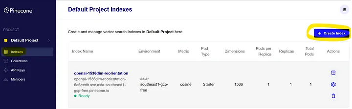
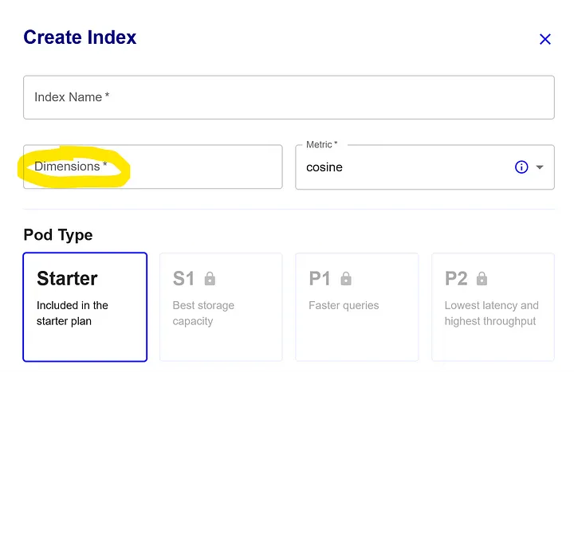
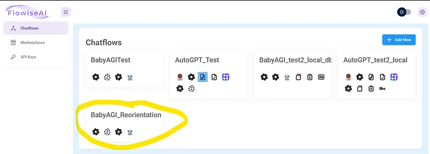
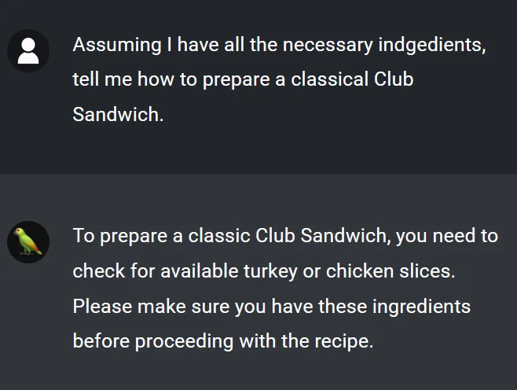
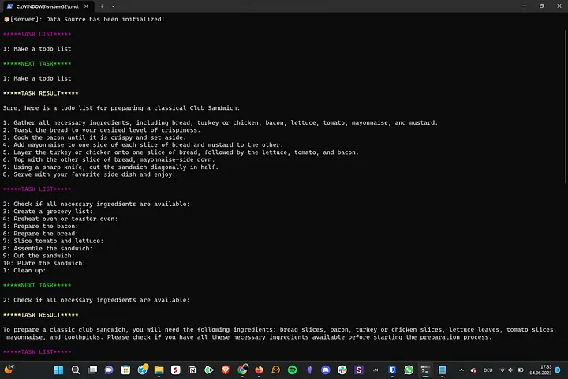

# 无代码使用 AI agent 作为职业教练（使用 Flowise 和 BabyAGI）
## 动机和用例
我听说过 LangChain 作为一种链接生成人工智能领域各种组件的工具，并且还用它在 “真正的” Python 代码中进行了首次实验。但当我在 Flowise 上看到第一个视频时，我惊讶于社区如此之快地再次提出了一个“视觉包装器”，使整个过程更容易为更广泛的受众所接受。

本文展示了如何以一种相当简单、无代码的方式，即使对于（相对）非技术人员来说，也可以利用最新一代人工智能语言模型的惊人力量。

所选用例是支持职业重新定位的职业指导。之所以选择这个主题，是因为它是一个相当实用的主题，并且具有一定的相关性，可以让读者产生共鸣。

## 技术设置及要求
### 一般考虑因素
我上面说过 “没有代码”。尽管如此，该设置仍然可能看起来很复杂，因为它涉及多个必须协同工作的组件。特别是，该过程需要

- Flowise
- openAI 的聊天组件
- openAI 的嵌入组件
- Pinecone 将嵌入存储在向量数据库中

如果这对你来说听起来很“技术”……没关系，你不需要费心。考虑“嵌入”大型语言模型的自然语言。而且，就像在现实世界中一样：如果您想与某人交谈，您最好说他/她的语言。因此，要使用 chatGPT，您首先需要将您提供给它的所有内容翻译成它自己的语言。而且因为语言太奇怪了（根据我目前的理解，0 到 1 之间的 1536 个流点数字存储为“向量”……），你最好记住你输入的内容或询问 chatGPT 的翻译……。您可以通过将这些翻译存储在 “向量数据库” 中来完成此操作。

	这正是 Pinecone：一个在线向量数据库。
就成本而言，Pincone 的基本使用是免费的。您可以注册，但无需为初学者留下任何付款信息。有很多文章如何做到这一点。你可以参考下面的资料，但我在这里就不详细介绍了。

另一方面，openAI 会立即要求您留下付款信息。但这没关系（只要您名下有一张信用卡），因为如果您考虑模型背后的计算工作量和能力，成本确实很低（……但很高兴知道还有其他选择！！！） 。同样在这里：有很多教程/描述如何注册并获取您的 `openAI-API-key`。您可以搜索它或参考资源部分。

除了技术设置要求之外，如果您有`当前 CV 的纯文本版本`，那么对于给定的用例，它会很有用。ChatGPT（希望）没有根据您的简历进行训练，并且只“知道”它接受的训练内容。因此，为了让 chatGPT（以及 BabyAGI agent ）能够了解有关您的简历的任何信息（从而了解您职业重新定位的出发点），您必须将您的简历作为提示的一部分提供给它。

### 技术选择
openAI 作为 LLM 和 Pinecone 作为向量数据库都有替代方案。如何在在线环境中安装 Flowise 有许多不同的部署选项。我选择了
#### 首先 Flowise
- 有一个替代的 “LangChain GUI 包装器”，它 “更 Pythonic”，LangFlow，它似乎是基于 Django 的。我观看/红色了两个“视觉包装器”的一两个比较，并发现 Flowise 直观上更具吸引力，并认为冒险一下 Java 世界也没什么坏处。

#### OpenAI LLM
- 由于其易于使用和答案的质量

#### Pincone 作为向量数据库
- …因为它是我可以与 BabyAGI agent 一起使用的唯一向量数据库；
- 对于其他 agent ，我可以使用本地向量数据库 
	- 但这种尝试只会在 BabyAGI 中产生错误。我认为这是一个典型的早期错误——其他数据库很快就可以使用。

#### BabyAGI agent 
- 我还在同一用例中尝试了 AutoGPT-agent 模板。

	在许多方面，该 agent 更加灵活和强大（例如，它允许从文件上传来提供给 agent ，而不仅仅是提示；它可以在后台进行网络搜索以检索最新信息；它支持本地向量商店……当然还可以做更多事情）。
	
	但是，输出格式是 JSON 文件，需要进一步的后处理。否定了本文的“无代码”方法。

	BabyAGI 的输出将在下面进一步解释。它可能不会出现在人们怀疑的地方（详细信息如下......）。但它是简单、纯文本，可以立即被人类阅读。
#### 本地安装
- 有点像 Pincone：我很想直接使用在线托管的版本。

	[根据网上找到的文档和教程，使用 REPLIT 应该很容易做到这一点](https://docs.flowiseai.com/deployment/replit)。然而，我只是在安装过程中遇到了错误，在本地运行得非常顺利。不知道是我的原因还是 REPLIT 的一些变化——但为了快速尝试，我选择了第一个有效的解决方案——那就是本地安装。
- 话虽这么说：我确实看到了在线部署的巨大优势。Flowise 的优点之一是它提供了对使用它创建的流的 API 密钥访问。对于给定的用例，本地安装就足够了。但是，如果您想将事情提升到一个新的水平，例如让您的 AI 流与互联网上的其他服务进行交互，那么使用此 API 解决方案看起来相当容易。只是 REPLIT 中的 Flowise 安装需要适用于这种情况...... 或者您更深入地研究并选择 Docker 部署。

## 技术部分
### Flowise 安装
阅读 [Flowise 文档中本地安装的安装说明](https://docs.flowiseai.com/getting-started)，我一开始以为他们是在开玩笑，但其实就是这么简单：

- 安装最新的 [NodeJS](https://nodejs.org/en/download)
- 下载正确的安装程序（Windows、Mac、Linux）
- ....并安装它

我来自 Python，而不是 Java 世界。所以我对 NodeJS 不是太了解。但作为一个优秀的德国人，我按照指示做了…… 一切都那么顺利。

- 通过在终端 (Windows Powershell) 中输入来安装 Flowise：

		npm install -g flowise
- 在终端中输入以下命令启动 Flowise

		npx flowise start
- 输入 URL，在浏览器中打开 Flowise

		http://localhost:3000

此时，您已经看到界面了。但你还不能用它做很多事情。为了获得我们在路上的用例的 PoC，如上所述，我们仍然需要 openAI 和 Pinecone 各一个 API 密钥。

### openAI API
如上所述：有数以百万计的良好资源可以指导您（例如参见下面的资源）。您只需拥有可用于复制和粘贴的 API 密钥
### Pinecone API 和索引创建
对于注册和获取 API 密钥，与 openAI 相同。然而，它变得有点复杂：我稍后必须告诉 Flowise 与您的 Pinecone 帐户的哪个“索引”进行交互。将索引视为普通数据库中的表。

因此，您必须首先创建此索引（也称为表），以便 Flowise 确切地知道在哪里存储您（通过提示）和 agent （通过其“思考过程”）将提供的文本的上述“嵌入翻译”进入数据库。

- 在他们的网站上注册后，单击左窗格菜单中的“索引”菜单，然后单击右上角的“创建索引”按钮：

	
		
		登录后的 Pinecone 主仪表板
- 在此示例中，您已经看到创建的索引。当你创建你的时，会弹出这个窗口：

	

		Pinecone 中的索引创建弹出窗口 — 包含要填写的参数

重要的是要

- 记住/记下索引的名称和
- 将精度设置为 1536（不，不是暗指欧洲现代早期历史上宗教冲突和社会动荡的一年 - 只是上述向量的长度，恰好是 GPT 的内部语言）您很快就会
看到为什么…..

### Flowise 模板
在 Windows shell 中运行  

	npx flowise start
后，通过调用 `http://localhost:3000` 在浏览器中启动 Flowise 后，您应该看到类似这样的内容，但没有任何聊天流程：

	您帐户的 Flowise 主页
正如您从屏幕截图中看到的，我已经进行了一些实验。这里讨论的流程是 `BabyAGI_Reorientation`。安装和修改这些基本流程很容易：它们可以通过市场（左窗格）获得。您只需选择要尝试的流程，并在模板流程显示在屏幕上后立即保存它（左上角的磁盘图标）。此时，您可以为流程命名。

打开此流程应该会显示如下图片：

	Flowise 中的主流程窗口
现在您了解了您需要所有 API 密钥的用途……。您必须将它们复制并粘贴到流程组件框中的相应字段中，对于 openAI 两次，对于 Pinecone 一次。对于 Pinecone，您还需要设置环境和 Pincecone 索引名称（注册后登录后可以轻松从 Pinecone 网站检索 - 以防万一您忘记记下它们或将它们存储在密码库中） 。

从模板复制的模型可以直接用来设置我们的用例。正如人工智能模型经常出现的那样，“秘密武器”在于提示。

为了开始提示模型，您需要单击上面屏幕截图右上角的聊天图标。

提示：更改不会立即生效：在任何框中输入新数据后，您必须首先通过磁盘图标保存模型才能使这些更改生效。因此，您最好在开始对话之前单击该保存图标！

### 提示词
我使用以下提示作为介绍，并将提示后的上述纯文本简历复制并粘贴到聊天文本输入框中：

- 英文

	`As manager in a leading position, I want to reorient myself professionally. My core competences are in Finance, but I have very good skills both on the level of IT, data science, ML and AI and on the level of international mangement and coordination. The target of the reorientation is a leading position in a data-driven and growth oriented company. It can still be in the Finance domain, but is not limited to it. You should also consider other potential profiles for the new position. Devise a task list of how to best reach this target and devise a list of potential target positions that have a good fit with my CV. This CV follows now: PURE TEXT CV PASTED HERE`
- 中文

	`作为处于领导地位的经理，我想在职业上重新定位自己。我的核心能力是金融，但我在信息技术、数据科学、机器学习和人工智能以及国际管理和协调方面都有很好的技能。重新定位的目标是成为一家数据驱动、增长型公司的领先地位。它仍然可以在财务领域，但不限于此。您还应该考虑新职位的其他潜在人才。制定一份如何最好地实现这一目标的任务清单，并制定一份与我的简历非常契合的潜在目标职位清单。此简历现在如下：此处粘贴了纯文本简历`

不言而喻：这个提示需要根据个人情况进行调整，以确定 agent 的目标。

影响 agent 输出的其他重要设置是

- ChatOpenAI 盒子中的温度(temperature)

	一种“偶然因素”，决定着 chatGPT 在其下一个单词预测中与“计算上最可能的输出”的接近程度。该值应介于 0 和 1 之间 
	
	- 1 是因为最高值会出现较大偏差和令人惊讶的答案，
	- 而 0 则意味着“坚持教科书答案”
- BabyAGI 框中的任务循环(task loops)

	您允许 BabyAGI 通过它根据提示总结的任务列表的最大迭代次数。简单的等式：循环越多，细节越多（无论好坏，例如，如果 chatGPT 开始“产生幻觉”）

### 结果
#### 输出格式
最大的惊喜是输出格式：一开始我非常失望，因为不仅花了很长时间才在聊天对话中显示结果，而且对提示的最终答案在各个方面也都令人印象深刻。直到我发现实际的回答过程（比结果本身重要得多）并不显示在聊天对话框中，而只显示在 shell/终端中。

换句话说：您需要离开基于浏览器的 GUI，返回 shell 并从那里复制并粘贴文本，才能看到 BabyAGI 得出结果的最重要的“思维过程”。

我尝试了另一个更直观的示例提示来证明这一点：

- 提示：

		“假设我有所有必要的原料，请告诉我如何准备经典的俱乐部三明治。”
- 结果：

		“要准备经典的俱乐部三明治，您需要检查是否有可用的火鸡或鸡肉片。在继续制作食谱之前，请确保您拥有这些原料。”

确实令人印象深刻。

然而，在终端/shell中，发生了以下“思考过程”来产生这个结果：

- 任务列表

	1：制作待办事项列表
- 下一个任务

	1：制作待办事项列表 
- 任务结果

	当然，这是准备经典俱乐部三明治的待办事项列表：
	
	1. 收集所有必要的原料，包括面包、火鸡或鸡肉、培根、生菜、番茄、蛋黄酱和芥末。
	2. 将面包烤至您想要的松脆程度。
	3. 将培根煮至酥脆，放在一边。
	4. 在每片面包的一侧添加蛋黄酱，在另一侧添加芥末。
	5. 将火鸡或鸡肉铺在一片面包上，然后铺上生菜、番茄和培根。
	6. 上面放上另一片面包，蛋黄酱面朝下。
	7. 使用锋利的刀，将三明治对角切成两半。
	8. 与您最喜欢的配菜一起享用！
- 任务清单
	1. 清理：
	2. 检查是否准备好所有必要的原料：
	3.  创建购物清单：
	4. 预热烤箱或烤箱：
	5. 准备培根：
	6. 准备面包：
	7. 将番茄和生菜切片：
	8. 组装三明治：
	9. 切三明治：
	10. 将三明治装盘：
- 下一个任务

现在看来，这对于解决提示中制定的任务来说似乎更有帮助！

因为这是我在使用 Flowise 时发现的一个非常重要的问题，这里还有两个屏幕截图：

屏幕截图 1 显示聊天输出：

屏幕截图 2 显示了 shell 中生成的文本输出：

坦率地说，我不知道这（仍然）是一个错误还是故意不在聊天对话中显示“思考过程”……但只要人们可以访问信息，我就可以在这个早期阶段接受这一点。重要的是：同样的逻辑也适用于具有上述提示的专业重新定位的更抽象用例。

### 用例“专业重新定位”的输出内容
并非一切都是完美的 —— agent 的“思考过程”产生了很多噪音或开销。但即使 agent 输出中的噪声与信息之比在 7:3 或 8:2 范围内，剩余的信息也提供了令人信服的质量以及如何处理手头任务的有价值的想法和见解。

第一次迭代立即为手头的用例生成了一个非常有用的列表，我将其视为“靶心”：

- 任务结果
	- 确定职业目标和重新定位的目标行业。
	- 研究并与目标行业的公司和专业人士建立联系。
	- 更新简历和专业简介以突出相关技能和经验。
	- 发展个人品牌和在线形象以展示专业知识。
	- 参加相关行业活动和会议，了解最新情况并建立联系。
	- 考虑接受额外的教育或认证以增强技能。
	- 申请相关职位空缺并参加面试以获得新职位。
- 潜在目标职位
	1. 首席数据官
	2. 运营副总裁
	3. 商业智能总监
	4. 数字化转型主管
	5. 战略与分析总监
	6. 创新及科技主管
	7. 高级业务分析师
	8. 财务规划与分析总监
	9. IT 运营总监
	10. 首席战略官
- 下一个任务

	在进一步的迭代中，BabyAGI 尝试一一解决上面的7个任务结果。通过多次“解决”此任务，而不是继续进行列表中的下一项，最终会陷入第 3 点（相关技能和经验）。

	这可以通过在第 3 点之后用剩余列表重新提示 agent 来解决。

	- 上述第 1) 点（确定职业目标……）的迭代结果产生了以下信息：
		- 下一个任务
	
			1：研究和分析与所需职位和职业目标相符的潜在公司和职位空缺。
		- 任务结果
			- 确定感兴趣的领域：首先确定您想要探索的金融领域的兴趣。满足您所需标准的一些领域包括数据分析、数字化转型和战略。
			- 研究公司：研究位于您选择的地点的这些感兴趣领域的公司。列出吸引您眼球的公司名单，并研究它们的财务状况、文化和愿景。
			- 确定职位空缺：查看其网站上的职位发布或使用专门针对金融就业市场的招聘委员会。寻找与您的技能和经验相匹配的关键词，例如数据分析、战略、数字化转型等。
			- 定制您的申请：定制您的简历和求职信，以突出工作所需的专业知识领域。使用与您的工作相关的关键词，并突出您在金融和相关领域的成就。重点介绍变革管理、流程优化以及与高层领导合作的示例。展示您如何为之前工作的发展做出贡献以及您的经验如何可转移。
			- 准备面试：列出常见的面试问题并准备答案，突出您最相关的经历以及它们与新工作机会的关系。列出您在面试期间向公司提出的问题。
			- 后续：面试结束后，向面试官发送一封感谢信，表达您对该职位的兴趣并重申您的资格。
- 下一个任务

	我想说，非常有用的东西。

	“思考过程” 结束时的最后一个相当详细的示例以及一些重新提示：
- 下一个任务
	
	1：开发个人网站或作品集，向潜在雇主展示技能、过去的工作、教育和经验。

	- 任务结果
		
		感谢您的请求。根据目标和之前完成的任务，以下是一些解决剩余任务的结论性列表
		
		- 创建个人品牌和在线形象：
			- 创建一个具有专业外观的网站或作品集，展示您的技能、过去的工作、教育、经验和成就。
			- 使用 LinkedIn、Twitter 和 Facebook 等社交媒体平台来宣传您的个人品牌并与行业专业人士互动。
			- 定期使用与您的行业相关的内容更新您的个人资料，例如文章、博客文章和见解。
		- 确定相关的网络研讨会、会议和研讨会：
			- 订阅行业新闻通讯、博客和网站，了解最新的行业趋势。
			- 使用在线搜索引擎和活动目录（例如 Eventbrite 和 Meetup）来查找您所在行业的相关活动和会议。
			- 优先参加可以与行业专业人士建立联系并获得与您的职业目标相关领域知识的活动。
		- 在行业协会中担任领导职务：
			- 研究并加入与您所在领域相关的行业协会。
			- 参加会议和活动，与其他专业人士联系并了解行业相关问题和法规。
			- 寻找机会志愿担任领导角色，例如在委员会或董事会任职，以扩大您的专业网络并获得领导经验。
		- 在 LinkedIn 上创建有针对性的营销活动：
			- 制定清晰的个人品牌信息，突出您独特的技能、经验和资格。
			- 使用 LinkedIn 的定位功能来接触目标行业的潜在雇主和决策者。
			- 结合使用文本、图像和视频来创建引人入胜的营销活动，展示您的个人品牌和价值主张。
		- 确定与您的领域相关的在线论坛和讨论组：
			- 在社交媒体平台、Slack 和其他专业网络网站上加入与您的领域相关的在线论坛和讨论组。
			- 通过分享见解、提出问题和参与讨论来参与对话。
			- 寻找在线论坛之外与行业同行建立联系的机会，例如参加网络研讨会或会议。
		- 与您所在领域的其他专业人士合作开展开源项目：
			- 在 GitHub 和 Bitbucket 等平台上寻找与您的领域相关的开源项目。
			- 加入项目团队并为项目贡献您的技能和专业知识。
			- 使用您对开源项目的参与作为您在求职以及个人网站或作品集上的技能和经验的证据。

		除了这些列表之外，我建议开发一个个人网站或作品集，向潜在雇主展示您的技能、过去的工作、教育和经验。您可以使用 WordPress、Wix 或 Squarespace 等网站构建器来创建具有专业外观的网站，突出您独特的卖点和价值主张。请务必在网站上包含您的个人品牌信息和联系信息，以便潜在雇主可以轻松与您取得联系。

		我希望这可以帮助您实现职业发展目标。如果您还有任何其他问题或疑虑，请告诉我。
- 下一个任务

	现在，这非常详细，其中包括一些我坦率地说不会想到的要点。谢谢你，agent ！

	最后，如“俱乐部三明治”案例所示，聊天框中显示的实际响应在一定程度上回答了提示问题，但相对平淡无奇：
- 任务结果

	根据您的核心能力，数据驱动、增长型公司的一些潜在目标职位包括：

	- 首席财务官或财务副总裁：在此角色中，您可以领导数据驱动和以增长为导向的公司的财务管理、预测和战略，同时利用您在财务和数据科学方面的技能。
	- 首席数据官或数据分析副总裁：在此角色中，您可以监督数据的使用以推动组织的增长，同时利用您在数据科学和 IT 方面的技能。
	- 商业智能或数据科学主管：在此角色中，您可以领导公司数据驱动战略的开发和实施，同时利用您在数据科学、机器学习和人工智能方面的技能。
	- 总经理或运营总监：在此职位上，您可以利用您在国际管理和协调以及财务方面的技能，领导跨职能团队的协调和管理。
	- 战略或企业发展总监：在此角色中，您可以领导数据驱动和以增长为导向的公司的战略规划和企业发展活动，同时利用您在财务和国际管理方面的技能。
	
	为了确定潜在的就业机会，您可以对以专注于数据驱动和增长为导向的战略而闻名的行业中的公司进行研究，例如技术、医疗保健、金融和电子商务。您还可以使用求职平台和网络来识别相关的职位发布并与潜在雇主建立联系。

任务结束

## 评估
这种 agent 方法是否完全消除了对人类对应者进行此类指导的需要？当然不是！

是否为解决职业重新定位等复杂任务做好准备和支持？当然可以！

最好的看待方式可能是将像 BabyAGI 这样的 agent 视为一种僚机，为复杂的任务和努力提供支持和支持。

对于彻底的勒德分子和那些技术上胆怯的人来说，这种方法可能还没有“准备好使用”。弄清楚所有的技术设置和要求仍然是一个挑战。然而，本文中没有一行代码，结果不言而喻。

因此，我确信使用像 wingman 这样的 agent 的准入门槛现在使用 Flowise 这样的工具比单独使用 LangChain 代码要低得多。阅读这些文字的人很可能既不是勒德分子，也不是技术上的弱者;-)

还有一个半开玩笑的评论：如果输出的结果激发了这篇文章，那么它就是一个自我参照的绝佳例子，因为这意味着从本文派生的任务列表中至少有一个框已经被检查过发布它的行为。

## 建议立即改进
在尝试 Flowise 并同时撰写本文的过程中，我看到了几个可以为 Flowise 的可用性（特别是 BabyAGI）提供“快速胜利”的要点：

- 控制并保存聊天输出

	正如所解释的，我在这个用例中使用了 BabyAGI 和 AutoGPT 模板 - 起初我认为它不起作用，因为我在聊天窗口中没有看到或看到很少的输出。后来我才意识到，文本输出出现在我用来启动 Flowise 的 Windows Power shell 中。我发现这有点奇怪。
	
	但这引出了一个问题：是否有一种方法（计划中？）将 agent 输出“分叉”到文本文件以供以后检查或处理？
	
	- AutoGPT 的答案采用 JSON 格式，并包含有关算法“思考过程”的有趣细节。
	- BabyAGI 的答案是“纯文本”。无论哪种方式，将整个agent 输出直接写入文件都会非常有趣。
- 生成的 LangChain 代码

	这将使该工具功能强大 1.000 倍。我确实看到了给定流程的 JSON 导出选项。但对于这个 JSON，人们远远无法（……好吧，至少我……）重现视觉设计流程“在幕后”生成的实际 LangChain 代码。能够复制、粘贴和修改由视觉流程设计产生的“幕后”代码将非常有用。
	
	例如，以“Loaders”为例：到目前为止，尚未在 Flowise 中实现所有 Loaders。但是，使用 Flowise 中的简单“文本”加载器就足以在结果代码中进行更改，只需将其更改为 “Obsidian” 加载器（..尚未在 Flowise 中启用），其输入选项略有不同，并且参数。

## 外表
这是我第一次接触 Flowise。对于下一次迭代，我注意到以下几点来检查进度：

- 使 BabyAGI 能够使用本地数据库（除了 Pincone 之外的其他尝试在 BabyAGI 上都失败了；它立即与来自市场的修改后的 AutoGPT 流程一起使用）
- 改进 BabyAGI 流程的输入，以便可以从文档加载 CV，而不是插入提示中（再次强调：在从市场测试修改后的 AutoGPT 流程时，这工作得非常好）
- 与其他 LLM 合作，例如保持私密性（又名：不将所有文本发送到 openAI）
- 如果我忽略了提到的 “Langchain-code-under-the-hood” 功能，或者是否添加了它，请更深入地查看
- 更详细地探索 AutoGPT 等其他 agent 如何处理此类任务：我认为特别是可以连接到 AutoGPT 客户端的大量 “工具” 可能很有趣。想象一下，例如，所讨论的 “职业指导” 的输出被转发到 LinkedIn 网络爬虫，以检索与已识别目标相对应的空缺职位，并量化自己的个人资料与职位要求之间的差距。

## 资源和链接
- OpenAI API 注册

	[https://help.socialintents.com/article/188-how-to-find-your-openai-api-key-for-chatgpt](https://help.socialintents.com/article/188-how-to-find-your-openai-api-key-for-chatgpt)
- Pinecone API 注册

	[https://www.youtube.com/watch?v=rQd9OpzS2Ow](https://www.youtube.com/watch?v=rQd9OpzS2Ow)
- 有关 Flowise 的其他 Medium 文章
	- [https://cobusgreyling.medium.com/flowise-for-langchain-b7c4023ffa71](https://cobusgreyling.medium.com/flowise-for-langchain-b7c4023ffa71)
	- [https://cobusgreyling.medium.com/flowise-is-a-graphical-user-interface-gui-for-langchain-8978ac3db634](https://cobusgreyling.medium.com/flowise-is-a-graphical-user-interface-gui-for-langchain-8978ac3db634)

## 参考
[No-Code use of an AI agent as career coach (with Flowise and BabyAGI)](https://medium.com/@syrom_85473/no-code-use-of-an-ai-agent-as-career-coach-with-flowise-and-babyagi-1c5a6a2626bd)	