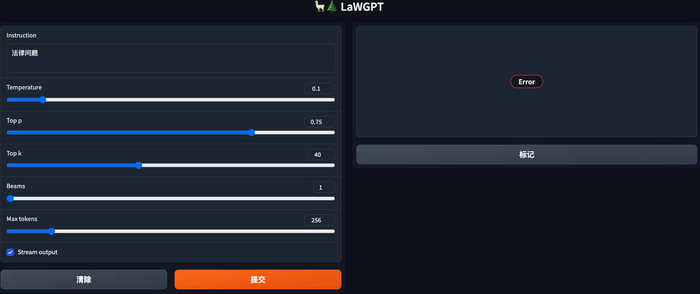
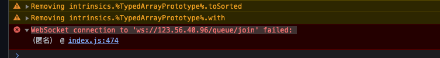

# LawGPT install
## 1 环境准备
同 SD 文档，已经安装好了 python 3.10、pip3、venv等

## 2 安装
- 下载代码
	
		git clone git@github.com:pengxiao-song/LaWGPT.git
		cd LaWGPT
- 创建 python vm 环境
		
		mkdir venv
		cd venv
		python3 -m venv .
- 进入环境

		cd bin
		source activate		
	      
	      进入虚拟机环境	
		(venv) xxxx:
- 安装
	- 返回项目目录		
	
		在进入虚拟机环境的情况下返回 LawGPT 公共目录
		
			cd ../../
	- 查看

			#(venv) pangzheng@iZ2ze4cy622i7cxe2bw7e6Z:~/sd/LaWGPT$ pwd

				/home/pangzheng/sd/LaWGPT 
	- 执行安装

			pip install -r requirements.txt
		- 安装完成提示
	
				....
				 Running setup.py install for ffmpy ... done
				  DEPRECATION: fire is being installed using the legacy 'setup.py install' method, because it does not have a 'pyproject.toml' and the 'wheel' package is not installed. pip 23.1 will enforce this behaviour change. A possible replacement is to enable the '--use-pep517' option. Discussion can be found at https://github.com/pypa/pip/issues/8559
				  Running setup.py install for fire ... done
				Successfully installed GitPython-3.1.32 accelerate-0.21.0 aiofiles-23.1.0 aiohttp-3.8.4 aiosignal-1.3.1 altair-5.0.1 annotated-types-0.5.0 anyio-3.7.1 appdirs-1.4.4 asttokens-2.2.1 async-timeout-4.0.2 attrs-23.1.0 backcall-0.2.0 bitsandbytes-0.40.0.post4 black-23.7.0 certifi-2023.5.7 charset-normalizer-3.2.0 click-8.1.5 cmake-3.26.4 contourpy-1.1.0 cycler-0.11.0 datasets-2.13.1 decorator-5.1.1 dill-0.3.6 docker-pycreds-0.4.0 exceptiongroup-1.1.2 executing-1.2.0 fastapi-0.100.0 ffmpy-0.3.0 filelock-3.12.2 fire-0.5.0 fonttools-4.41.0 frozenlist-1.4.0 fsspec-2023.6.0 gitdb-4.0.10 gradio-3.36.1 gradio-client-0.2.9 h11-0.14.0 httpcore-0.17.3 httpx-0.24.1 huggingface-hub-0.16.4 idna-3.4 ipython-8.14.0 jedi-0.18.2 jinja2-3.1.2 jsonschema-4.18.3 jsonschema-specifications-2023.6.1 kiwisolver-1.4.4 linkify-it-py-2.0.2 lit-16.0.6 markdown-it-py-2.2.0 markupsafe-2.1.3 matplotlib-3.7.2 matplotlib-inline-0.1.6 mdit-py-plugins-0.3.3 mdurl-0.1.2 mpmath-1.3.0 multidict-6.0.4 multiprocess-0.70.14 mypy-extensions-1.0.0 networkx-3.1 numpy-1.25.1 nvidia-cublas-cu11-11.10.3.66 nvidia-cuda-cupti-cu11-11.7.101 nvidia-cuda-nvrtc-cu11-11.7.99 nvidia-cuda-runtime-cu11-11.7.99 nvidia-cudnn-cu11-8.5.0.96 nvidia-cufft-cu11-10.9.0.58 nvidia-curand-cu11-10.2.10.91 nvidia-cusolver-cu11-11.4.0.1 nvidia-cusparse-cu11-11.7.4.91 nvidia-nccl-cu11-2.14.3 nvidia-nvtx-cu11-11.7.91 orjson-3.9.2 packaging-23.1 pandas-2.0.3 parso-0.8.3 pathspec-0.11.1 pathtools-0.1.2 peft-0.3.0.dev0 pexpect-4.8.0 pickleshare-0.7.5 pillow-10.0.0 platformdirs-3.8.1 prompt-toolkit-3.0.39 protobuf-4.23.4 psutil-5.9.5 ptyprocess-0.7.0 pure-eval-0.2.2 pyarrow-12.0.1 pydantic-2.0.2 pydantic-core-2.1.2 pydub-0.25.1 pygments-2.15.1 pyparsing-3.0.9 python-dateutil-2.8.2 python-multipart-0.0.6 pytz-2023.3 pyyaml-6.0 referencing-0.29.1 regex-2023.6.3 requests-2.31.0 rpds-py-0.8.10 safetensors-0.3.1 scipy-1.11.1 semantic-version-2.10.0 sentencepiece-0.1.99 sentry-sdk-1.28.1 setproctitle-1.3.2 six-1.16.0 smmap-5.0.0 sniffio-1.3.0 socksio-1.0.0 stack-data-0.6.2 starlette-0.27.0 sympy-1.12 termcolor-2.3.0 tokenize-rt-5.1.0 tokenizers-0.13.3 tomli-2.0.1 toolz-0.12.0 torch-2.0.1 tqdm-4.65.0 traitlets-5.9.0 transformers-4.31.0.dev0 triton-2.0.0 typing-extensions-4.7.1 tzdata-2023.3 uc-micro-py-1.0.2 urllib3-2.0.3 uvicorn-0.22.0 wandb-0.15.5 wcwidth-0.2.6 websockets-11.0.3 wheel-0.40.0 xxhash-3.2.0 yarl-1.9.2
	- 启动
		- 执行 
				
				在虚拟机下执行
				
				sh ./scripts/webui.sh		
				

## 下载模型和合并
可以下载运行，因为授权问题，模型分两个部分，需要合并才可以使用

- 下载HF格式的模型文件
	- [Chinese-LLaMA-7B](https://huggingface.co/Linly-AI/Chinese-LLaMA-7B/tree/main)
	- 将模型文件移动到

			models/base_models
- 下载 lora 模型
	- [legal-lora-7b](https://huggingface.co/entity303/legal-lora-7b/tree/main)
	- 将模型文件移动到

			models/lora_weights
- 下载 lawgpt 模型
	- [lawgpt-lora-7b](https://huggingface.co/entity303/lawgpt-lora-7b-v2/tree/main)
	- 将模型文件移动到

			models/lora_weights		
- 合并

	合并原版 Chinese-LLaMA-7B 模型权重和二次训练到的 legal-lora-7b 权重
	     
		在虚拟机下执行
		
		sh scripts/merge.sh
		
## 报错
- 错误1
	- 安装 cuda 114 ，网络连接出错

			CUDA SETUP: Loading binary /data/home/pangzheng/LaWGPT/venv/lib/python3.10/site-packages/bitsandbytes/libbitsandbytes_cuda114_nocublaslt.so...
			Traceback (most recent call last):
			  File "/data/home/pangzheng/LaWGPT/venv/lib/python3.10/site-packages/urllib3/connectionpool.py", line 790, in urlopen
			    response = self._make_request(
			  File "/data/home/pangzheng/LaWGPT/venv/lib/python3.10/site-packages/urllib3/connectionpool.py", line 491, in _make_request
			    raise new_e
			  File "/data/home/pangzheng/LaWGPT/venv/lib/python3.10/site-packages/urllib3/connectionpool.py", line 467, in _make_request
			    self._validate_conn(conn)
			  File "/data/home/pangzheng/LaWGPT/venv/lib/python3.10/site-packages/urllib3/connectionpool.py", line 1092, in _validate_conn
			    conn.connect()
			  File "/data/home/pangzheng/LaWGPT/venv/lib/python3.10/site-packages/urllib3/connection.py", line 635, in connect
			    sock_and_verified = _ssl_wrap_socket_and_match_hostname(
			  File "/data/home/pangzheng/LaWGPT/venv/lib/python3.10/site-packages/urllib3/connection.py", line 776, in _ssl_wrap_socket_and_match_hostname
			    ssl_sock = ssl_wrap_socket(
			  File "/data/home/pangzheng/LaWGPT/venv/lib/python3.10/site-packages/urllib3/util/ssl_.py", line 466, in ssl_wrap_socket
			    ssl_sock = _ssl_wrap_socket_impl(sock, context, tls_in_tls, server_hostname)
			  File "/data/home/pangzheng/LaWGPT/venv/lib/python3.10/site-packages/urllib3/util/ssl_.py", line 510, in _ssl_wrap_socket_impl
			    return ssl_context.wrap_socket(sock, server_hostname=server_hostname)
			  File "/usr/lib/python3.10/ssl.py", line 513, in wrap_socket
			    return self.sslsocket_class._create(
			  File "/usr/lib/python3.10/ssl.py", line 1071, in _create
			    self.do_handshake()
			  File "/usr/lib/python3.10/ssl.py", line 1342, in do_handshake
			    self._sslobj.do_handshake()
			ConnectionResetError: [Errno 104] Connection reset by peer
			
			During handling of the above exception, another exception occurred:
	- 解决

		重新运行，网络链接
		
			CUDA SETUP: Loading binary /data/home/pangzheng/LaWGPT/venv/lib/python3.10/site-packages/bitsandbytes/libbitsandbytes_cuda114_nocublaslt.so...
			Downloading (…)cial_tokens_map.json: 100%|██████████████████████████████████████████████████████████████████████████████████████████████████████████████████████████████████████████| 411/411 [00:00<00:00, 2.19MB/s]
			Downloading (…)okenizer_config.json: 100%|██████████████████████████████████████████████████████████████████████████████████████████████████████████████████████████████████████████| 727/727 [00:00<00:00, 5.37MB/s]
- 错误2
	- 方法类报错 

			CUDA SETUP: Loading binary /data/home/pangzheng/LaWGPT/venv/lib/python3.10/site-packages/bitsandbytes/libbitsandbytes_cuda114_nocublaslt.so...
			You are using the legacy behaviour of the <class 'transformers.models.llama.tokenization_llama.LlamaTokenizer'>. This means that tokens that come after special tokens will not be properly handled. We recommend you to read the related pull request available at https://github.com/huggingface/transformers/pull/24565
			Traceback (most recent call last):
			  File "/data/home/pangzheng/LaWGPT/webui.py", line 211, in <module>
			    fire.Fire(main)
			  File "/data/home/pangzheng/LaWGPT/venv/lib/python3.10/site-packages/fire/core.py", line 141, in Fire
			    component_trace = _Fire(component, args, parsed_flag_args, context, name)
			  File "/data/home/pangzheng/LaWGPT/venv/lib/python3.10/site-packages/fire/core.py", line 475, in _Fire
			    component, remaining_args = _CallAndUpdateTrace(
			  File "/data/home/pangzheng/LaWGPT/venv/lib/python3.10/site-packages/fire/core.py", line 691, in _CallAndUpdateTrace
			    component = fn(*varargs, **kwargs)
			  File "/data/home/pangzheng/LaWGPT/webui.py", line 40, in main
			    tokenizer = LlamaTokenizer.from_pretrained(base_model)
			  File "/data/home/pangzheng/LaWGPT/venv/lib/python3.10/site-packages/transformers/tokenization_utils_base.py", line 1846, in from_pretrained
			    return cls._from_pretrained(
			  File "/data/home/pangzheng/LaWGPT/venv/lib/python3.10/site-packages/transformers/tokenization_utils_base.py", line 2009, in _from_pretrained
			    tokenizer = cls(*init_inputs, **init_kwargs)
			  File "/data/home/pangzheng/LaWGPT/venv/lib/python3.10/site-packages/transformers/models/llama/tokenization_llama.py", line 128, in __init__
			    self.sp_model.Load(vocab_file)
			  File "/data/home/pangzheng/LaWGPT/venv/lib/python3.10/site-packages/sentencepiece/__init__.py", line 905, in Load
			    return self.LoadFromFile(model_file)
			  File "/data/home/pangzheng/LaWGPT/venv/lib/python3.10/site-packages/sentencepiece/__init__.py", line 310, in LoadFromFile
			    return _sentencepiece.SentencePieceProcessor_LoadFromFile(self, arg)
			TypeError: not a string
	- 解决
		
		修改启动脚本
		
			vi 	../LaWGPT/scripts/webui.sh
			
			python webui.py \
			    --load_8bit True \ <- 这里从默认 False 改成 True
			    --base_model 'minlik/chinese-alpaca-plus-7b-merged' \
			    --lora_weights 'entity303/lawgpt-lora-7b-v2' \
			    --prompt_template "law_template" \
			    --server_name "0.0.0.0" \
			    --share_gradio True \
- 错误3
	- 网络报错2

			Downloading shards:  50%|██████████████████████████████████████████████████████████████████████████████▌                                                                              | 1/2 [13:33<13:33, 813.01s/it]
			Traceback (most recent call last):
			  File "/data/home/pangzheng/LaWGPT/venv/lib/python3.10/site-packages/transformers/utils/hub.py", line 417, in cached_file
			    resolved_file = hf_hub_download(
			  File "/data/home/pangzheng/LaWGPT/venv/lib/python3.10/site-packages/huggingface_hub/utils/_validators.py", line 118, in _inner_fn
			    return fn(*args, **kwargs)
			  File "/data/home/pangzheng/LaWGPT/venv/lib/python3.10/site-packages/huggingface_hub/file_download.py", line 1291, in hf_hub_download
			    raise LocalEntryNotFoundError(
			huggingface_hub.utils._errors.LocalEntryNotFoundError: Connection error, and we cannot find the requested files in the disk cache. Please try again or make sure your Internet connection is on.
			
			During handling of the above exception, another exception occurred:
			
			Traceback (most recent call last):
			  File "/data/home/pangzheng/LaWGPT/webui.py", line 211, in <module>
			    fire.Fire(main)
			  File "/data/home/pangzheng/LaWGPT/venv/lib/python3.10/site-packages/fire/core.py", line 141, in Fire
			    component_trace = _Fire(component, args, parsed_flag_args, context, name)
			  File "/data/home/pangzheng/LaWGPT/venv/lib/python3.10/site-packages/fire/core.py", line 475, in _Fire
			    component, remaining_args = _CallAndUpdateTrace(
			  File "/data/home/pangzheng/LaWGPT/venv/lib/python3.10/site-packages/fire/core.py", line 691, in _CallAndUpdateTrace
			    component = fn(*varargs, **kwargs)
			  File "/data/home/pangzheng/LaWGPT/webui.py", line 42, in main
			    model = LlamaForCausalLM.from_pretrained(
			  File "/data/home/pangzheng/LaWGPT/venv/lib/python3.10/site-packages/transformers/modeling_utils.py", line 2610, in from_pretrained
			    resolved_archive_file, sharded_metadata = get_checkpoint_shard_files(
			  File "/data/home/pangzheng/LaWGPT/venv/lib/python3.10/site-packages/transformers/utils/hub.py", line 958, in get_checkpoint_shard_files
			    cached_filename = cached_file(
			  File "/data/home/pangzheng/LaWGPT/venv/lib/python3.10/site-packages/transformers/utils/hub.py", line 452, in cached_file
			    raise EnvironmentError(
			OSError: We couldn't connect to 'https://huggingface.co' to load this file, couldn't find it in the cached files and it looks like minlik/chinese-alpaca-plus-7b-merged is not the path to a directory containing a file named pytorch_model-00002-of-00002.bin.
			Checkout your internet connection or see how to run the library in offline mode at 'https://huggingface.co/docs/transformers/installation#offline-mode'. 
	- 修复

			重新启动
- 错误 4
	- 缺少文件

			Could not create share link. Missing file: /data/home/pangzheng/LaWGPT/venv/lib/python3.10/site-packages/gradio/frpc_linux_amd64_v0.2.
	- 解决
		1. 下载文件

				https://cdn-media.huggingface.co/frpc-gradio-0.2/frpc_linux_amd64
		2. 重命名为

				frpc_linux_amd64_v0.2
		3. 移动到地址
		
				/data/home/pangzheng/LaWGPT/venv/lib/python3.10/site-packages/gradio
- 错误5
	- ws 没有打开

		
		
			index.js:474 WebSocket connection to 'ws://123.56.40.96/queue/join' failed:  
		
	- 解决

		配置 nginx ws 
		
			  #ws-Lawgpt
			  proxy_http_version 1.1;
			  proxy_set_header Upgrade $http_upgrade;
			  proxy_set_header Connection $connection_upgrade;
			  proxy_read_timeout 86400;				 			
			

							    									 				
## 参考
- [LaWGPT](https://github.com/pengxiao-song/LaWGPT)
- [合并文档](https://github.com/pengxiao-song/LaWGPT/wiki/%E6%A8%A1%E5%9E%8B%E5%90%88%E5%B9%B6)