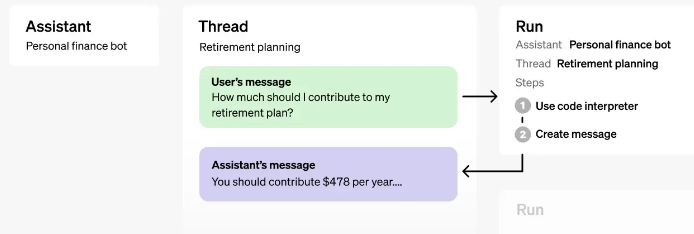
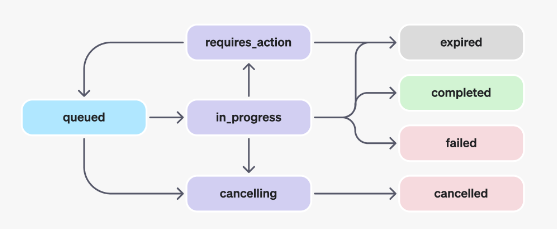
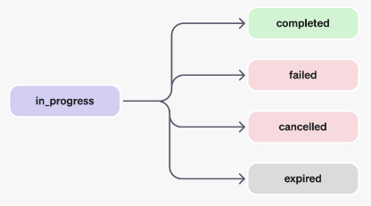

# OpenAI`4.0T`官方文档-assistants(助手)API-助手如何工作
Assistants API 旨在帮助开发人员构建能够执行各种任务的强大 AI 助手。

	Assistants API 处于测试阶段，我们正在积极努力添加更多功能。在我们的开发者论坛中分享您的反馈！
- 助手可以使用特定指令调用 OpenAI 的[模型](https://platform.openai.com/docs/models)，以调整其个性和能力。
- 助手可以`并行访问多个工具`。这些可以是 OpenAI 托管的工具（例如[代码解释器](https://platform.openai.com/docs/assistants/tools/code-interpreter)和[知识检索](https://platform.openai.com/docs/assistants/tools/knowledge-retrieval)），也可以是您构建/托管的工具（通过[函数调用](https://platform.openai.com/docs/assistants/tools/function-calling)）。
- 助手可以访问`持久线程`。线程通过存储消息历史记录并在对话对于模型上下文长度来说太长时截断它来简化 AI 应用程序开发。您创建一个线程一次，然后只需在用户回复时将消息附加到其中即可。
- 助手可以访问多种格式的[文件](https://platform.openai.com/docs/assistants/tools/supported-files)- 作为其创建的一部分或作为助手和用户之间的线程的一部分。使用工具时，助手还可以创建文件（例如图像、电子表格等）并引用他们在创建的消息中引用的文件。

## 对象
助手对象架构图

对象|它代表什么
---|---
Assistant|使用 OpenAI 模型和调用工具的专用 AI
Thread|助手和用户之间的对话会话。线程存储消息并自动处理截断以使内容适合模型的上下文。
Message|由助手或用户创建的消息。消息可以包括文本、图像和其他文件。消息以列表形式存储在线程上。
Run|在线程上调用助手。助手使用它的配置和线程的消息通过调用模型和工具来执行任务。作为运行的一部分，助手将消息附加到线程。
Run Step|	助手在运行过程中所采取的步骤的详细列表。助手可以在运行期间调用工具或创建消息。检查运行步骤可以让您反思助手如何获得最终结果。

## 创建助手
我们建议将 OpenAI 的[最新模型](https://platform.openai.com/docs/models/gpt-4-and-gpt-4-turbo)与 Assistants API 结合使用，以获得最佳结果和与工具的最大兼容性。

首先，创建助手只需要指定 `model` 要使用的。但您可以进一步自定义助手的行为：

- 使用 `instructions` 参数来指导助手的个性并定义其目标。说明与聊天完成 API 中的系统消息类似。
- 使用该 `tools` 参数可让助手访问最多 128 个工具。您可以让它访问 OpenAI 托管的工具，例如 `code_interpreter` 和`retrieval` ，或者通过  `function` 调用来调用第三方工具。
- 使用该 `file_ids` 参数,类似  `code_interpreter` 和 `retrieval` 为工具提供文件访问权限。文件使用 `File` [上传端点](https://platform.openai.com/docs/api-reference/files/create)上传，并且必须具有 `purpose` 设置 `assistants` 要与此 API 一起使用的。

例如，要创建一个可以基于 `.csv` 文件创建数据可视化的助手，请首先上传文件。

	curl https://api.openai.com/v1/files \
	  -H "Authorization: Bearer $OPENAI_API_KEY" \
	  -F purpose="assistants" \
	  -F file="@mydata.csv"
然后用上传的文件创建助手。

	curl https://api.openai.com/v1/assistants \
	  -H 'Authorization: Bearer $OPENAI_API_KEY' \
	  -H 'Content-Type: application/json' \
	  -H 'OpenAI-Beta: assistants=v1' \
	  -d '{
	    "name": "Data visualizer",
	    "description": "You are great at creating beautiful data visualizations. You analyze data present in .csv files, understand trends, and come up with data visualizations relevant to those trends. You also share a brief text summary of the trends observed.",
	    "model": "gpt-4-1106-preview",
	    "tools": [{"type": "code_interpreter"}],
	    "file_ids": ["file-BK7bzQj3FfZFXr7DbL6xJwfo"]
	  }'
	  
每个助手最多可以附加 20 个文件，每个文件最多 512 MB。此外，您的组织上传的所有文件的大小不应超过 100GB。您可以使用我们的[帮助中心](https://help.openai.com/en/)请求增加此存储限制。

您还可以使用该 [AssistantFile](https://platform.openai.com/docs/api-reference/assistants/file-object) 对象来创建、删除或查看“助手”和“文件”对象之间的关联。请注意，删除  `AssistantFile`  并不会删除原始文件对象，它只是删除该文件与助手之间的关联。要删除文件，请使用[文件删除端点](https://platform.openai.com/docs/api-reference/files/delete)。

## 管理线程和消息
线程和消息代表助手和用户之间的对话会话。线程中可以存储的消息数量没有限制。一旦消息的大小超过模型的上下文窗口，线程将尝试包含尽可能多的适合上下文窗口的消息并删除最旧的消息。请注意，这种截断策略可能会随着时间的推移而演变。

您可以创建一个带有初始消息列表的线程，如下所示：

	curl https://api.openai.com/v1/threads \
	  -H 'Authorization: Bearer $OPENAI_API_KEY' \
	  -H 'Content-Type: application/json' \
	  -H 'OpenAI-Beta: assistants=v1' \
	  -d '{
	    "messages": [
	      {
	          "role": "user",
	          "content": "Create 3 data visualizations based on the trends in this file.",
	          "file_ids": ["file-wB6RM6wHdA49HfS2DJ9fEyrH"]
	      }
	    ]
	  }'
消息可以包含文本、图像或文件。
	
	目前，用户创建的消息不能包含图像文件，但我们计划将来添加对此的支持。
### 消息注释
助手创建的消息  `annotations` 可能包含在 `content` 对象的数组中。 注释提供有关如何注释消息中文本的信息。

注释有两种类型：

- `file_citation`

	文件引用由该 [`retrieval`](https://platform.openai.com/docs/assistants/tools/knowledge-retrieval) 工具创建，并定义对特定文件中特定引用的引用，该文件已上传并由助手用于生成响应。
- `file_path`

	文件路径注释由该工具创建 [`code_interpreter`](https://platform.openai.com/docs/assistants/tools/code-interpreter)，并包含对该工具生成的文件的引用。

当 Message 对象中存在注释时，您将在文本中看到难以辨认的模型生成的子字符串，您应该将其替换为注释。这些字符串可能看起来像`【13†source】` 或 `sandbox:/mnt/data/file.csv` 。下面是一个示例 python 代码片段，它将这些字符串替换为注释中存在的信息。

程序升级到 Python SDK v1.2，使用 `pip install --upgrade openai`

	# 检索消息对象
	message = client.beta.threads.messages.retrieve(
	  thread_id="...",
	  message_id="..."
	)
	
	# Extract the message content
	message_content = message.content[0].text
	annotations = message_content.annotations
	citations = []
	
	# 遍历注释并添加脚注
	for index, annotation in enumerate(annotations):
	    # 用脚注代替正文
	    message_content.value = message_content.value.replace(annotation.text, f' [{index}]')
	
	    # 根据注释属性收集引用
	    if (file_citation := getattr(annotation, 'file_citation', None)):
	        cited_file = client.files.retrieve(file_citation.file_id)
	        citations.append(f'[{index}] {file_citation.quote} from {cited_file.filename}')
	    elif (file_path := getattr(annotation, 'file_path', None)):
	        cited_file = client.files.retrieve(file_path.file_id)
	        citations.append(f'[{index}] Click <here> to download {cited_file.filename}')
	        # Note: File download functionality not implemented above for brevity
	
	# 在显示给用户之前，在消息末尾添加脚注
	message_content.value += '\n' + '\n'.join(citations)
	
## 运行和运行步骤
当您从线程中的用户获得所需的所有上下文时，您可以使用您选择的助手运行线程。

	curl https://api.openai.com/v1/threads/THREAD_ID/runs \
	  -H 'Authorization: Bearer $OPENAI_API_KEY' \
	  -H 'Content-Type: application/json' \
	  -H 'OpenAI-Beta: assistants=v1' \
	  -d '{
	    "assistant_id": "asst_ToSF7Gb04YMj8AMMm50ZLLtY"
	  }'
默认情况下，运行将使用 `model` 和 `tools`  配置 Assistant 对象中指定的配置，但您可以在创建运行时覆盖其中的大部分以增加灵活性

	curl https://api.openai.com/v1/threads/THREAD_ID/runs \
	  -H 'Authorization: Bearer $OPENAI_API_KEY' \
	  -H 'Content-Type: application/json' \
	  -H 'OpenAI-Beta: assistants=v1' \
	  -d '{
	    "assistant_id": "ASSISTANT_ID",
	    "model": "gpt-4-1106-preview",
	    "instructions": "additional instructions",
	    "tools": [{"type": "code_interpreter"}, {"type": "retrieval"}]
	  }'
注意：`file_ids` 在运行创建期间无法覆盖与助手关联的内容。您必须使用[修改助手](https://platform.openai.com/docs/api-reference/assistants/modifyAssistant)端点来执行此操作。
### 运行生命周期
运行对象可以有多种状态。

状态|定义
---|---
queued|当  `required_action` 首次创建运行或完成运行时，它们将转至排队状态。他们几乎应该立即转移到 `in_progress` 状态 。
in_progress|在进行中时，助手使用模型和工具来执行步骤。您可以通过检查[运行步骤](https://platform.openai.com/docs/api-reference/runs/step-object)来查看运行所取得的进度。
completed|此次运行圆满结束！您现在可以查看助手添加到线程的所有消息以及运行所采取的所有步骤。您还可以通过向线程添加更多用户消息并创建另一个运行来继续对话。
requires_action|[使用函数](https://platform.openai.com/docs/assistants/tools/function-calling)调用 `required_action` 工具时，一旦模型确定了要调用的函数的名称和参数，运行就会进入某种状态。然后，您必须运行这些函数并在运行继续之前[提交输出](https://platform.openai.com/docs/api-reference/runs/submitToolOutputs)。如果在时间戳过去之前（创建后大约 10 分钟）未提供输出 `expires_at`，则运行将转为过期状态。
expired|当函数调用输出之前未提交 `expires_at` 并且运行过期时，就会发生这种情况。此外，如果运行执行时间过长且超出 `expires_at` 中规定的时间，我们的系统将使运行过期。
cancelling|您可以尝试 `in_progress` 使用[取消运行](https://platform.openai.com/docs/api-reference/runs/cancelRun)端点取消运行。一旦尝试取消成功，运行的状态就会变为 cancelled。已尝试取消，但不保证。
cancelled|运行已成功取消。
failed|您可以通过查看Run中 的 `last_error` 对象来查看失败的原因。失败的时间戳将记录在 `failed_at` 下。
### 轮询更新
为了使运行状态保持最新，您必须定期[检索 Run 对象](https://platform.openai.com/docs/api-reference/runs/getRun)。您可以在每次检索对象时检查运行状态，以确定应用程序下一步应该执行的操作。我们计划在不久的将来添加对流的支持，以使这一切变得更简单。
### 线程锁
当运行处于 `in_progress` 终止状态但未处于终止状态时，线程将被锁定。这意味着：

- 无法将新消息添加到线程中。
- 无法在线程上创建新的运行。

### 运行步骤

运行步骤状态与运行状态具有相同含义。

运行步骤对象中的大部分有趣细节都存在于该 `step_details` 字段中。步骤详细信息可以有两种类型：

- `message_creation`：当助手在线程上创建消息时，将创建此运行步骤。
- `tool_calls`：此运行步骤是在助手调用工具时创建的。[工具指南](https://platform.openai.com/docs/assistants/tools)的相关部分介绍了有关此内容的详细信息。

## 数据访问指导
目前，通过 API 创建的助手、线程、消息和文件的范围仅限于整个组织。因此，任何拥有组织 API 密钥访问权限的人都可以读取或写入组织中的助手、线程、消息和文件。

我们强烈建议采用以下数据访问控制：

- 落实授权

	在对助手、线程、消息和文件执行读取或写入之前，请确保最终用户有权执行此操作。例如，将最终用户有权访问的对象 ID 存储在数据库中，并在使用 API 获取对象 ID 之前对其进行检查。
- 限制 API 密钥访问

	仔细考虑组织中的哪些人应该拥有 API 密钥并定期审核此列表。API 密钥支持多种操作，包括读取和修改敏感信息，例如消息和文件。
- 创建单独的帐户

	考虑为不同的应用程序创建单独的帐户/组织，以便跨多个应用程序隔离数据。
	
## 局限性
在此测试期间，我们希望在未来几周和几个月内解决一些已知的限制。当我们添加对附加功能的支持时，我们将在此页面上发布变更日志。

- 支持流输出（包括消息和运行步骤）。
- 支持通知以共享对象状态更新，而无需轮询。
- 支持 DALL·E 作为工具。
- 支持使用图像创建用户消息。
