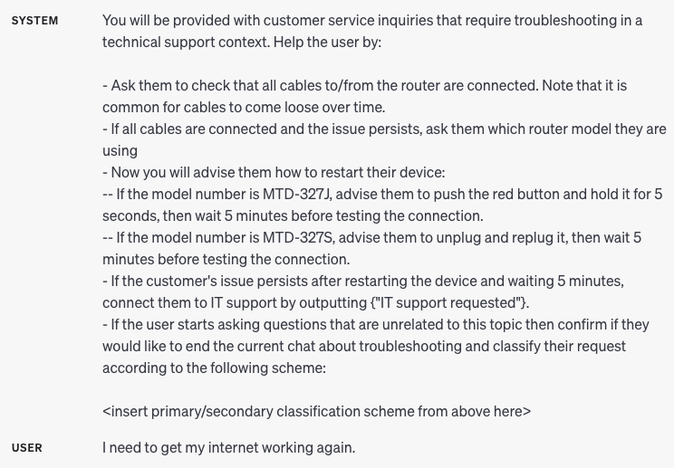

# OpenAI`4.0T`官方文档-指南-1 提示词工程
本指南分享了从 GPT-4 等大型语言模型（有时称为 GPT 模型）获得更好结果的策略和策略。有时可以组合使用此处描述的方法以获得更好的效果。我们鼓励尝试找到最适合您的方法。

此处演示的一些示例目前仅适用于我们最强大的模型 gpt-4. 一般来说，如果您发现某个模型在某项任务中失败，并且有一个功能更强大的模型可用，那么通常值得使用功能更强大的模型再次尝试。
## 获得更好结果的六项战略
### 写下清晰的指示
这些模型无法读懂你的想法。如果输出太长，请要求简短答复。如果输出太简单，请要求专家级别的写作。如果您不喜欢这种格式，请演示您希望看到的格式。模型猜测你想要什么的次数越少，你得到它的可能性就越大。

策略：

- [在您的查询中包含详细信息以获得更相关的答案](https://platform.openai.com/docs/guides/prompt-engineering/tactic-include-details-in-your-query-to-get-more-relevant-answers)
- [要求模型采用角色](https://platform.openai.com/docs/guides/prompt-engineering/tactic-ask-the-model-to-adopt-a-persona)
- [使用分隔符清楚地指示输入的不同部分](https://platform.openai.com/docs/guides/prompt-engineering/tactic-use-delimiters-to-clearly-indicate-distinct-parts-of-the-input)
- [指定完成任务所需的步骤](https://platform.openai.com/docs/guides/prompt-engineering/tactic-specify-the-steps-required-to-complete-a-task)
- [提供例子](https://platform.openai.com/docs/guides/prompt-engineering/tactic-provide-examples)
- [指定所需的输出长度](https://platform.openai.com/docs/guides/prompt-engineering/tactic-specify-the-desired-length-of-the-output)

### 提供参考文字
语言模型可以自信地发明假答案，特别是当被问及深奥的主题或引文和 URL 时。就像一张笔记可以帮助学生在考试中取得更好的成绩一样，为这些模型提供参考文本可以帮助减少作答次数。

策略：

- [指示模型使用参考文本回答](https://platform.openai.com/docs/guides/prompt-engineering/tactic-instruct-the-model-to-answer-using-a-reference-text)
- [指示模型通过引用参考文本来回答](https://platform.openai.com/docs/guides/prompt-engineering/tactic-instruct-the-model-to-answer-with-citations-from-a-reference-text)

### 将复杂的任务拆分为更简单的子任务
正如软件工程中将复杂系统分解为一组模块化组件是良好实践一样，提交给语言模型的任务也是如此。复杂的任务往往比简单的任务具有更高的错误率。此外，复杂的任务通常可以被重新定义为更简单任务的工作流程，其中早期任务的输出用于构造后续任务的输入。

策略：

- [使用意图分类来识别与用户查询最相关的指令](https://platform.openai.com/docs/guides/prompt-engineering/tactic-use-intent-classification-to-identify-the-most-relevant-instructions-for-a-user-query)
- [对于需要很长对话的对话应用，总结或过滤以前的对话](https://platform.openai.com/docs/guides/prompt-engineering/tactic-for-dialogue-applications-that-require-very-long-conversations-summarize-or-filter-previous-dialogue)
- [分段总结长文档并递归构建完整摘要](https://platform.openai.com/docs/guides/prompt-engineering/tactic-summarize-long-documents-piecewise-and-construct-a-full-summary-recursively)

###  给模型时间“思考”
如果要求将 17 乘以 28，您可能不会立即知道，但随着时间的推移仍然可以算出来。同样，模型在尝试立即回答而不是花时间找出答案时会犯更多推理错误。在给出答案之前询问 “思路链” 可以帮助模型更可靠地推理出正确答案。

策略：

- [指示模型在急于得出结论之前找出自己的解决方案](https://platform.openai.com/docs/guides/prompt-engineering/tactic-instruct-the-model-to-work-out-its-own-solution-before-rushing-to-a-conclusion)
- [使用内心独白或一系列查询来隐藏模型的推理过程](https://platform.openai.com/docs/guides/prompt-engineering/tactic-use-inner-monologue-or-a-sequence-of-queries-to-hide-the-model-s-reasoning-process)
- [询问模型在之前的过程中是否遗漏了任何内容](https://platform.openai.com/docs/guides/prompt-engineering/tactic-ask-the-model-if-it-missed-anything-on-previous-passes)

### 使用外部工具
通过向模型提供其他工具的输出来弥补模型的弱点。例如，文本检索系统（有时称为 RAG 或检索增强生成）可以告诉模型相关文档。像 OpenAI 的代码解释器这样的代码执行引擎可以帮助模型进行数学运算并运行代码。如果一项任务可以通过工具而不是语言模型更可靠或更有效地完成，那么可以卸载它以充分利用两者。

策略：

- [使用基于嵌入的搜索实现高效的知识检索](https://platform.openai.com/docs/guides/prompt-engineering/tactic-use-embeddings-based-search-to-implement-efficient-knowledge-retrieval)
- [使用代码执行来执行更准确的计算或调用外部API](https://platform.openai.com/docs/guides/prompt-engineering/tactic-use-code-execution-to-perform-more-accurate-calculations-or-call-external-apis)
- [授予模型访问特定功能的权限](https://platform.openai.com/docs/guides/prompt-engineering/tactic-give-the-model-access-to-specific-functions)

### 系统地测试变更
如果您可以衡量性能，那么提高性能就会更容易。在某些情况下，对提示的修改将在一些孤立的示例上实现更好的性能，但会导致在一组更具代表性的示例上整体性能变差。因此，为了确保更改对性能产生净积极影响，可能有必要定义一个全面的测试套件（也称为“评估”）。

战术：

- [参考黄金标准答案评估模型输出](https://platform.openai.com/docs/guides/prompt-engineering/tactic-evaluate-model-outputs-with-reference-to-gold-standard-answers)


## 策略
上面列出的每个策略都可以用特定的策略来实例化。这些策略旨在提供尝试的想法。它们绝不是完全全面的，您应该随意尝试此处未列出的创意。
### 战略1：写下清晰的说明
#### 策略：在查询中包含详细信息以获得更相关的答案
为了获得高度相关的响应，请确保请求提供任何重要的详细信息或上下文。否则，你将让模型来猜测你的意思。

更差|更好的
---|---
如何在 Excel 中添加数字？|如何在 Excel 中添加一行美元金额？我想对整张行自动执行此操作，所有总计都在右侧名为“总计”的列中结束。
谁是总统？|谁是 2021 年墨西哥总统？选举频率如何？
编写代码来计算斐波那契数列。|编写一个 TypeScript 函数来高效计算斐波那契数列。自由地注释代码以解释每部分的作用以及为什么这样编写。
总结会议记录。|用一个段落总结会议记录。然后写下演讲者的 Markdown 列表以及他们的每个要点。最后，列出发言人建议的后续步骤或行动项目（如果有）。
#### 策略：要求模型采用角色
系统消息可用于指定模型在其回复中使用的角色。

角色 | 描述
---|---
系统|当我请求帮助写一些东西时，你会回复一份文档，其中每个段落至少包含一个笑话或有趣的评论。
用户|给我的钢螺栓供应商写一封感谢信，感谢他们在短时间内准时交货。这使我们能够交付一份重要的订单。
[在游乐场体验](https://platform.openai.com/playground/p/default-playful-thank-you-note)

#### 策略：使用分隔符清楚地指示输入的不同部分
三引号、XML 标签、节标题等分隔符可以帮助划分要区别对待的文本节。

角色 | 描述
---|---
用户|用俳句总结由三引号分隔的文本。
	|"""在此插入文字"""
[在游乐场体验](https://platform.openai.com/playground/p/default-delimiters-1)

角色 | 描述
---|---
系统|您将获得两篇关于同一主题的文章（用 XML 标签分隔）。首先总结每篇文章的论点。然后指出哪一个提出了更好的论点并解释原因。
用户|<article> 在此插入第一篇文章 </article> 
      |<article> 在此插入第二篇文章 </article>

[在游乐场体验](https://platform.openai.com/playground/p/default-delimiters-2)

角色 | 描述
---|---
系统|您将获得论文摘要和建议的标题。论文标题应该让读者清楚地了解论文的主题，但也应该引人注目。如果标题不符合这些标准，请提出 5 个替代方案。
用户|摘要：在此插入摘要 
	|标题：在此插入标题

[在游乐场体验](https://platform.openai.com/playground/p/default-delimiters-3)

对于诸如此类的简单任务，使用分隔符可能不会对输出质量产生影响。然而，任务越复杂，消除任务细节的歧义就越重要。要让模型准确地理解你对他们的要求。

#### 策略：指定完成任务所需的步骤
有些任务最好指定为一系列步骤。明确地写出这些步骤可以使模型更容易遵循它们。

角色 | 描述
---|---
系统|使用以下分步说明来响应用户输入。
	|第 1 步 - 用户将为您提供三引号中的文本。用一个句子总结这段文字，并加上前缀 “Summary:”。
	|第 2 步 - 将第 1 步中的摘要翻译成西班牙语，并添加前缀“翻译：”。
用户|"""在此插入文字"""

[在游乐场体验](https://platform.openai.com/playground/p/default-step-by-step-summarize-and-translate)

#### 策略：提供例子
提供适用于所有示例的一般说明通常比通过示例演示任务的所有排列更有效，但在某些情况下提供示例可能更容易。例如，如果您打算让模型复制响应用户查询的特定风格，而这种风格很难明确描述。这称为“几次”提示。

角色 | 描述
---|---
系统|以一致的风格回答。
用户|教我耐心。
助手|河流冲刷出最深的山谷，发源于温和的泉水；最伟大的交响乐源自一个音符；最复杂的挂毯都是从一根单独的线开始的。
用户|教我有关海洋的知识。

[在游乐场体验](https://platform.openai.com/playground/p/default-chat-few-shot)

#### 策略：指定所需的输出长度
您可以要求模型生成给定目标长度的输出。目标输出长度可以根据单词、句子、段落、要点等的计数来指定。但请注意，指示模型生成特定数量的单词并不能高精度工作。该模型可以更可靠地生成具有特定数量的段落或要点的输出。

角色 | 描述
---|---
用户|用大约 50 个单词概括由三引号分隔的文本。"""在此插入文字"""

[在游乐场体验](https://platform.openai.com/playground/p/default-summarize-text-50-words)

角色 | 描述
---|---
用户|总结两段中用三引号分隔的文本。"""在此插入文字"""

[在游乐场体验](https://platform.openai.com/playground/p/default-summarize-text-2-paragraphs)

角色 | 描述
---|---
用户|将由三引号分隔的文本总结为 3 个要点。"""在此插入文字"""

[在游乐场体验](https://platform.openai.com/playground/p/default-summarize-text-3-bullet-points)

### 战略2：提供参考文本
#### 策略：指导模型使用参考文本回答
如果我们可以为模型提供与当前查询相关的可信信息，那么我们可以指示模型使用提供的信息来组成其答案。

角色 | 描述
---|---
系统|使用提供的由三重引号引起来的文章来回答问题。如果在文章中找不到答案，请写“我找不到答案”。
用户|<插入文章，每篇文章均由三引号分隔> 
	|问题：<在此处插入问题>
	
[在游乐场体验](https://platform.openai.com/playground/p/default-answer-from-retrieved-documents)

鉴于所有模型的上下文窗口都有限，我们需要某种方法来动态查找与所提出的问题相关的信息。[embeddings](https://platform.openai.com/docs/guides/embeddings/what-are-embeddings)可用于实现高效的知识检索。有关如何实现这一点的更多详细信息，请参阅策略“[使用基于嵌入的搜索来实现高效的知识检索](https://platform.openai.com/docs/guides/prompt-engineering/tactic-use-embeddings-based-search-to-implement-efficient-knowledge-retrieval)” 。

#### 策略：指示模型通过引用参考文本来回答
如果输入已补充相关知识，则可以直接要求模型通过引用所提供文档中的段落来为其答案添加引用。请注意，输出中的引用可以通过所提供文档中的字符串匹配以编程方式进行验证。

角色 | 描述
---|---
系统|您将获得一份由三重引号和一个问题分隔的文档。您的任务是仅使用提供的文档回答问题，并引用用于回答问题的文档段落。如果文档不包含回答此问题所需的信息，则只需写：“信息不足”。如果提供了问题的答案，则必须附有引文注释。使用以下格式引用相关段落（{“引用”：…}）。
用户|"""<在此处插入文档>""" 
	|问题：<在此处插入问题>

[在游乐场体验](https://platform.openai.com/playground/p/default-answer-with-citation)

### 战略3：将复杂的任务拆分为更简单的子任务
#### 策略：使用意图分类来识别与用户查询最相关的指令
对于需要大量独立指令集来处理不同情况的任务，首先对查询类型进行分类并使用该分类来确定需要哪些指令可能是有益的。这可以通过定义与处理给定类别中的任务相关的固定类别和硬编码指令来实现。该过程还可以递归地应用以将任务分解为一系列阶段。这种方法的优点是每个查询仅包含执行任务下一阶段所需的指令，与使用单个查询执行整个任务相比，这可以降低错误率。这还可以降低成本，因为较大的提示运行成本更高（[请参阅定价信息](https://openai.com/pricing)）。

例如，假设对于客户服务应用程序，查询可以有效地分类如下：


角色 | 描述
---|---
系统|我们将向您提供客户服务查询。将每个查询分为主要类别和次要类别。提供 json 格式的输出，其中包含以下键：主要和次要。
	|主要类别：计费、技术支持、帐户管理或一般查询。
	|计费二级类别： 
	|- 取消订阅或升级 
	|- 添加付款方式 
	|- 收费说明 
	|- 费用争议 
	|技术支持二级类别： 
	|- 故障排除 
	|- 设备兼容性 
	|- 软件更新 
	|帐户管理二级类别： 
	|- 密码重置 
	|- 更新个人信息 
	|- 关闭帐户 
	|-帐户安全一般查询二级类别： 
	|- 产品信息 
	|- 定价 
	|- 反馈 
	|- 与人交谈
用户|我需要让我的互联网重新工作。

[在游乐场体验](https://platform.openai.com/playground/p/default-decomposition-by-intent-classification-1)

根据客户查询的分类，可以向模型提供一组更具体的指令，以供其处理后续步骤。例如，假设客户需要“故障排除”方面的帮助。



角色 | 描述
---|---
系统|您将收到需要在技术支持环境中进行故障排除的客户服务查询。通过以下方式帮助用户： 
	|- 要求他们检查进出路由器的所有电缆是否已连接。请注意，随着时间的推移，电缆松动是很常见的。
	|- 如果所有电缆均已连接并且问题仍然存在，请询问他们正在使用哪种路由器型号 
	|- 现在您将建议他们如何重新启动其设备： 
	|-- 如果型号是 MTD-327J，建议他们按红色按钮并按住 5 秒钟，然后等待 5 分钟后再测试连接。
	|-- 如果型号是 MTD-327S，建议他们拔下并重新插入，然后等待 5 分钟再测试连接。
	|- 如果客户的问题在重新启动设备并等待 5 分钟后仍然存在，请通过输出 {“IT 支持请求”} 将他们连接到 IT 支持。
	|- 如果用户开始询问与此主题无关​​的问题，请确认他们是否愿意结束当前有关故障排除的聊天，并根据以下方案对他们的请求进行
	|分类：<在此处插入上面的主要/次要分类方案>
用户|我需要让我的互联网重新工作。

[在游乐场体验](https://platform.openai.com/playground/p/default-decomposition-by-intent-classification-2)

请注意，模型已被指示发出特殊字符串来指示对话状态何时发生变化。这使我们能够将我们的系统变成一个状态机，其中状态决定注入哪些指令。通过跟踪状态、哪些指令与该状态相关，以及可选地允许从该状态进行哪些状态转换，我们可以为用户体验设置护栏，而使用不太结构化的方法很难实现这一点。

#### 策略：对于需要很长对话的对话应用，总结或过滤之前的对话
由于模型具有固定的上下文长度，因此用户和助手之间的对话（其中整个对话都包含在上下文窗口中）无法无限期地继续。

解决此问题有多种解决方法，其中之一是总结对话中的先前回合。一旦输入的大小达到预定的阈值长度，这可能会触发总结部分对话的查询，并且先前对话的摘要可以作为系统消息的一部分包括在内。或者可以在整个对话过程中在后台异步总结之前的对话。

另一种解决方案是动态选择与当前查询最相关的对话的先前部分。参见策略“  [使用基于嵌入的搜索实现高效的知识检索](https://platform.openai.com/docs/guides/prompt-engineering/tactic-use-embeddings-based-search-to-implement-efficient-knowledge-retrieval)”。

#### 策略：分段总结长文档并递归构建完整摘要
由于模型具有固定的上下文长度，因此它们不能用于总结长于上下文长度减去单个查询中生成的摘要长度的文本。

要总结一个很长的文档（例如一本书），我们可以使用一系列查询来总结文档的每个部分。章节摘要可以连接和总结，生成摘要的摘要。这个过程可以递归地进行，直到总结整个文档。如果有必要使用前面部分的信息来理解后面的部分，那么另一个有用的技巧是在总结该点的内容时，在书中任何给定点之前包含文本的运行摘要。OpenAI在之前的研究中已经使用 GPT-3 的变体研究了这种总结书籍的过程的有效性。

策略：给模型时间“思考”
策略：指示模型在急于得出结论之前找出自己的解决方案
有时，当我们明确指示模型在得出结论之前从第一原理进行推理时，我们会得到更好的结果。假设我们想要一个模型来评估学生对数学问题的解决方案。解决这个问题最明显的方法是简单地询问模型学生的解决方案是否正确。

系统
确定学生的解决方案是否正确。
用户
问题陈述：我正在建造一个太阳能发电装置，我需要帮助解决财务问题。- 土地成本为 100 美元/平方英尺 - 我可以以 250 美元/平方英尺的价格购买太阳能电池板 - 我协商了一份维护合同，每年将花费我 10 万美元，另外还要额外花费 10 美元/平方英尺第一年运营作为平方英尺数的函数。学生的解决方案：设 x 为装置的尺寸（以平方英尺为单位）。1. 土地成本：100x 2. 太阳能电池板成本：250x 3. 维护成本：100,000 + 100x 总成本：100x + 250x + 100,000 + 100x = 450x + 100,000
助手
该学生的解决方案是正确的。
[在游乐场体验]()
但这位同学的解法其实并不正确！我们可以通过提示模型首先生成自己的解决方案来让模型成功注意到这一点。

系统
首先制定自己的问题解决方案。然后将你的解决方案与学生的解决方案进行比较，并评估学生的解决方案是否正确。在你自己完成问题之前，不要决定学生的解决方案是否正确。
用户
问题陈述：我正在建造一个太阳能发电装置，我需要帮助解决财务问题。- 土地成本为 100 美元/平方英尺 - 我可以以 250 美元/平方英尺的价格购买太阳能电池板 - 我协商了一份维护合同，每年将花费我 10 万美元，另外还要额外花费 10 美元/平方英尺第一年运营作为平方英尺数的函数。学生的解决方案：设 x 为装置的尺寸（以平方英尺为单位）。1. 土地成本：100x 2. 太阳能电池板成本：250x 3. 维护成本：100,000 + 100x 总成本：100x + 250x + 100,000 + 100x = 450x + 100,000
助手
设 x 为安装尺寸（以平方英尺为单位）。1. 土地成本：100x 2. 太阳能电池板成本：250x 3. 维护成本：100,000 + 10x 总成本：100x + 250x + 100,000 + 10x = 360x + 100,000 学生的解决方案不正确。他们在维护成本计算中犯了一个错误，使用了 100x 而不是 10x。第一年运营的正确总成本是 360x + 100,000。
[在游乐场体验]()
策略：使用内心独白或一系列查询来隐藏模型的推理过程
前面的策略表明，模型有时在回答特定问题之前详细推理问题很重要。对于某些应用程序，模型用于得出最终答案的推理过程不适合与用户共享。例如，在辅导应用程序中，我们可能希望鼓励学生得出自己的答案，但模型关于学生解决方案的推理过程可能会向学生揭示答案。

内心独白是一种可以用来缓解这种情况的策略。内心独白的想法是指示模型将原本对用户隐藏的部分输出放入结构化格式中，以便于解析它们。然后，在向用户呈现输出之前，将解析输出并且仅使部分输出可见。

系统
请按照以下步骤回答用户的疑问。步骤 1 - 首先找出你自己的问题解决方案。不要依赖学生的解决方案，因为它可能是不正确的。将您此步骤的所有工作用三引号 (""") 括起来。第 2 步 - 将您的解决方案与学生的解决方案进行比较，并评估学生的解决方案是否正确。将您此步骤的所有工作用三引号 ("") 括起来”）。第 3 步 - 如果学生犯了错误，请确定在不泄露答案的情况下可以给学生什么提示。将这一步的所有工作用三引号 (""") 括起来。步骤 4 - 如果学生犯了错误，请向学生提供上一步的提示（在三引号之外）。而不是写“步骤 4 - ...”写“提示：”。
用户
问题陈述：<插入问题陈述> 学生解决方案：<插入学生解决方案>
[在游乐场体验]()
或者，这可以通过一系列查询来实现，其中除了最后一个查询之外，所有查询的输出都对最终用户隐藏。

首先，我们可以要求模型自己解决问题。由于这个初始查询不需要学生的解决方案，因此可以省略。这提供了额外的优势，即模型的解决方案不会因学生尝试的解决方案而产生偏差。

用户
<插入问题陈述>
[在游乐场体验]()
接下来，我们可以让模型使用所有可用信息来评估学生解决方案的正确性。

系统
将您的解决方案与学生的解决方案进行比较，并评估学生的解决方案是否正确。
用户
问题陈述："""<插入问题陈述>""" 您的解决方案："""<插入模型生成的解决方案>""" 学生的解决方案："""<插入学生的解决方案>"""
[在游乐场体验]()
最后，我们可以让模型使用自己的分析来以乐于助人的导师的角色构建回复。

系统
你是一名数学导师。如果学生犯了错误，请以不透露答案的方式向学生提供提示。如果学生没有犯错，只需给他们一个鼓励性的评论。
用户
问题陈述："""<插入问题陈述>""" 您的解决方案："""<插入模型生成的解决方案>""" 学生的解决方案："""<插入学生的解决方案>""" 分析："""<插入模型从上一步生成的分析>"""
[在游乐场体验]()
策略：询问模型在之前的过程中是否遗漏了任何内容
假设我们正在使用一个模型来列出与特定问题相关的来源的摘录。列出每个摘录后，模型需要确定是否应该开始编写另一个摘录或者是否应该停止。如果源文档很大，模型通常会过早停止并且无法列出所有相关摘录。在这种情况下，通过使用后续查询提示模型查找之前传递中错过的任何摘录，通常可以获得更好的性能。

系统
您将获得一份由三重引号分隔的文档。你的任务是选择与以下问题相关的摘录：“人工智能历史上发生了哪些重大的范式转变。” 确保摘录包含解释它们所需的所有相关上下文 - 换句话说，不要提取缺少重要上下文的小片段。提供 JSON 格式的输出，如下所示： [{"excerpt": "..."}, ... {"excerpt": "..."}]
用户
"""<在此插入文档>"""
助手
[{"excerpt": "模型在这里写一个摘录"}, ... {"excerpt": "模型在这里写另一个摘录"}]
用户
还有更多相关摘录吗？注意不要重复摘录。还要确保摘录包含解释它们所需的所有相关上下文 - 换句话说，不要提取缺少重要上下文的小片段。
[在游乐场体验]()
策略：使用外部工具
策略：使用基于嵌入的搜索实现高效的知识检索
如果作为输入的一部分提供，模型可以利用外部信息源。这可以帮助模型生成更明智和最新的响应。例如，如果用户询问有关特定电影的问题，则将有关电影的高质量信息（例如演员、导演等）添加到模型的输入中可能会很有用。嵌入可用于实现高效的知识检索，从而可以在运行时动态地将相关信息添加到模型输入中。

文本嵌入是一个可以衡量文本字符串之间相关性的向量。相似或相关的字符串比不相关的字符串更接近。这一事实以及快速向量搜索算法的存在意味着嵌入可以用于实现高效的知识检索。特别地，文本语料库可以被分割成块，并且每个块可以被嵌入和存储。然后可以嵌入给定的查询，并且可以执行矢量搜索以从语料库中找到与查询最相关的嵌入文本块（即在嵌入空间中最接近的文本块）。

示例实现可以在OpenAI Cookbook中找到。请参阅策略“指示模型使用检索到的知识来回答查询”，了解如何使用知识检索来最大程度地减少模型编造不正确事实的可能性的示例。

策略：使用代码执行来进行更准确的计算或调用外部API
不能依赖语言模型自行准确地执行算术或长时间计算。在需要的情况下，可以指示模型编写和运行代码，而不是进行自己的计算。特别是，可以指示模型将要运行的代码放入指定的格式，例如三重反引号。产生输出后，可以提取代码并运行。最后，如果有必要，可以将代码执行引擎（即Python解释器）的输出作为下一个查询的模型的输入。

系统
您可以通过将Python 代码括在三个反引号中来编写和执行Python 代码，例如“此处代码为”。用它来执行计算。
用户
求以下多项式的所有实值根：3*x**5 - 5*x**4 - 3*x**3 - 7*x - 10。
[在游乐场体验]()
代码执行的另一个很好的用例是调用外部 API。如果模型接受了如何正确使用 API 的指导，它就可以编写使用该 API 的代码。通过向模型提供展示如何使用 API 的文档和/或代码示例，可以指导模型如何使用 API。

系统
您可以通过将 Python 代码括在三个反引号中来编写和执行它。另请注意，您可以访问以下模块来帮助用户向朋友发送消息： ```python import message message.write(to="John", message="Hey，想在下班后见面吗？")`` `
[在游乐场体验]()
警告：执行模型生成的代码本质上并不安全，任何试图执行此操作的应用程序都应采取预防措施。特别是，需要沙盒代码执行环境来限制不受信任的代码可能造成的危害。

策略：让模型访问特定功能
聊天完成 API 允许在请求中传递功能描述列表。这使得模型能够根据提供的模式生成函数参数。生成的函数参数由 API 以 JSON 格式返回，可用于执行函数调用。然后，可以将函数调用提供的输出反馈到以下请求中的模型中以关闭循环。这是使用OpenAI模型调用外部函数的推荐方式。要了解更多信息，请参阅我们的介绍性文本生成指南中的函数调用部分以及OpenAI Cookbook 中的更多函数调用示例。

策略：系统地测试变更
有时很难判断更改（例如新指令或新设计）是否使您的系统变得更好或更差。看几个例子可能会暗示哪个更好，但由于样本量较小，很难区分真正的改进或随机运气。也许这种变化有助于某些输入的性能，但会损害其他输入的性能。

评估程序（或“evals”）对于优化系统设计非常有用。好的评估是：

代表现实世界的使用情况（或至少是多样化的）
包含许多测试用例以获得更大的统计能力（有关指南，请参阅下表）
易于自动化或重复
检测差异	95% 置信度所需的样本量
30%	〜10
10%	〜100
3%	〜1,000
1%	〜10,000
输出的评估可以由计算机、人类或两者混合来完成。计算机可以使用客观标准（例如，具有单个正确答案的问题）以及一些主观或模糊标准自动进行评估，其中模型输出由其他模型查询进行评估。OpenAI Evals是一个开源软件框架，提供用于创建自动化评估的工具。

当存在一系列可能的输出被认为质量同样高时（例如，对于答案很长的问题），基于模型的评估会很有用。通过基于模型的评估可以实际评估的内容与需要人类评估的内容之间的界限是模糊的，并且随着模型变得更加强大而不断变化。我们鼓励进行实验，以确定基于模型的评估对您的用例的效果如何。

策略：参考黄金标准答案评估模型输出
假设已知问题的正确答案应参考一组特定的已知事实。然后我们可以使用模型查询来计算答案中包含多少必需的事实。

例如，使用以下系统消息：

系统
您将获得由三引号分隔的文本，该文本应该是问题的答案。检查答案中是否直接包含以下信息： - 尼尔·阿姆斯特朗是第一个登上月球的人。- 尼尔·阿姆斯特朗 (Neil Armstrong) 首次在月球上行走的日期是 1969 年 7 月 21 日。对于每个点，请执行以下步骤： 1 - 重述该点。2 - 提供最接近这一点的答案的引文。3 - 考虑不知道主题的阅读引文的人是否可以直接推断出该点。在做出决定之前解释一下原因或原因。4 - 如果 3 的答案是“是”，则写“是”，否则写“否”。最后，计算有多少个“是”答案。将此计数提供为 {"count": <在此处插入计数>}。
这是一个满足这两点的示例输入：

系统
<在上面插入系统消息>
用户
"""尼尔·阿姆斯特朗因成为第一个踏上月球的人类而闻名。这一历史性事件发生在 1969 年 7 月 21 日，阿波罗 11 号任务期间。"""
[在游乐场体验]()
以下是仅满足一个点的示例输入：

系统
<在上面插入系统消息>
用户
“”“尼尔·阿姆斯特朗走下登月舱时创造了历史，成为第一个在月球上行走的人。”“”
[在游乐场体验]()
这是一个不满足任何条件的示例输入：

系统
<在上面插入系统消息>
用户
“69 年夏天，一次伟大的航行，阿波罗 11 号，像传奇之手一样大胆。阿姆斯特朗迈出一步，历史展开，“一小步，”他说，为了一个新世界。”“”
[在游乐场体验]()
这种基于模型的评估有许多可能的变体。考虑以下变体，它跟踪候选答案和黄金标准答案之间的重叠类型，并且还跟踪候选答案是否与黄金标准答案的任何部分相矛盾。

系统
使用以下步骤响应用户输入。在继续之前充分重申每个步骤。即“第一步：原因...”。步骤 1：逐步推理所提交答案中的信息与专家答案相比是否是：不相交、相等、子集、超集或重叠（即存在交集，但不是子集/超集）。第2步：逐步推理提交的答案是否与专家答案的任何方面相矛盾。步骤 3：输出一个 JSON 对象，结构如下：{"type_of_overlap": "disjoint" or "equal" or "subset" or "superset" or "overlapping", "contradiction": true or false}
这是一个示例输入，其答案不合格，但与专家答案并不矛盾：

系统
<在上面插入系统消息>
用户
问题：“”“尼尔·阿姆斯特朗最著名的事件是什么？它发生在哪一天？假设 UTC 时间。”“”提交的答案：“”“他没有在月球上行走过吗？”“”专家解答: """尼尔·阿姆斯特朗最著名的是第一个登上月球的人。这一历史性事件发生在 1969 年 7 月 21 日。"""
[在游乐场体验]()
这是一个示例输入，其答案与专家答案直接矛盾：

系统
<在上面插入系统消息>
用户
问题：“”“尼尔·阿姆斯特朗最著名的事件是什么？它发生在哪一天？假设 UTC 时间。”“”提交的答案：“”“1969 年 7 月 21 日，尼尔·阿姆斯特朗成为第二个在上面行走的人继巴兹·奥尔德林之后登上月球。"""专家解答："""尼尔·阿姆斯特朗最著名的是第一个登上月球的人。这一历史性事件发生在 1969 年 7 月 21 日。"""
[在游乐场体验]()
下面是一个带有正确答案的示例输入，它还提供了比必要的更多的细节：

系统
<在上面插入系统消息>
用户
问题：“”“尼尔·阿姆斯特朗最著名的事件是什么？它发生在哪一天？假设 UTC 时间。”“”提交的答案：“”“1969 年 7 月 21 日大约 02:56 UTC，尼尔·阿姆斯特朗成为第一个人类踏上月球表面，标志着人类历史上的一项里程碑式的成就。”“”专家解答：“”“尼尔·阿姆斯特朗最著名的是第一个登上月球的人。这一历史性事件发生在7月21日， 1969年。
[在游乐场体验]()
其他资源
如需更多灵感，请访问OpenAI Cookbook，其中包含示例代码以及第三方资源的链接，例如：

提示库和工具
提示指南
视频课程
关于高级提示以提高推理能力的论文