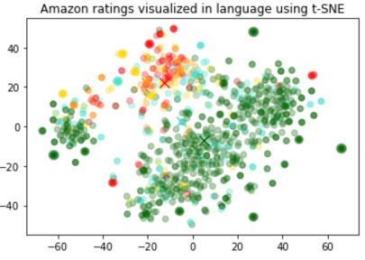
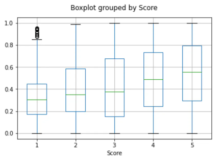
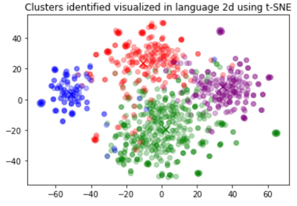

# OpenAI`4.0T`官方文档-能力-3 Embeddings
## 什么是Embeddings？
OpenAI 的文本 Embeddings 衡量文本字符串的相关性。Embeddings 通常用于：

- 搜索（结果按与查询字符串的相关性排名）
- 聚类（文本字符串按相似性分组）
- 推荐（推荐具有相关文本字符串的项目）
- 异常检测（识别出相关性很小的异常值）
- 多样性测量（分析相似性分布）
- 分类（文本字符串按最相似的标签进行分类）

我们很高兴地宣布，新的 [Assistants API ](https://platform.openai.com/docs/assistants)具有检索功能和内置消息历史记录管理功能。如果您不想自己制作和存储 Embeddings，请查看[Assistants API](https://platform.openai.com/docs/assistants) 以了解更多信息。

Embeddings 是浮点数的向量（列表）。两个向量之间的距离衡量它们的相关性。距离小表明相关性高，距离大表明相关性低。

请访问我们的[定价页面](https://openai.com/api/pricing/)，了解Embeddings 定价。请求根据发送的[输入中的 token 数量](https://platform.openai.com/docs/api-reference/embeddings/create#embeddings/create-input)进行计费。

要查看 Embeddings 的实际效果，请查看我们的代码示例

- 分类
- 主题聚类
- 搜索
- 建议

## 如何获得 Embeddings
要获得 Embeddings，请将文本字符串以及 Embeddings 模型 ID 的选择（例如）发送到 [Embeddings API 端点](https://platform.openai.com/docs/api-reference/embeddings) `text-embedding-ada-002`。响应将包含一个 Embeddings，您可以提取、保存和使用它。

请求示例：

- 示例
	- curl 获取 Embeddings
	
			curl https://api.openai.com/v1/embeddings \
			  -H "Content-Type: application/json" \
			  -H "Authorization: Bearer $OPENAI_API_KEY" \
			  -d '{
			    "input": "Your text string goes here",
			    "model": "text-embedding-ada-002"
			  }'
	- 响应示例：

			{
			  "data": [
			    {
			      "embedding": [
			        -0.006929283495992422,
			        -0.005336422007530928,
			        ...
			        -4.547132266452536e-05,
			        -0.024047505110502243
			      ],
			      "index": 0,
			      "object": "embedding"
			    }
			  ],
			  "model": "text-embedding-ada-002",
			  "object": "list",
			  "usage": {
			    "prompt_tokens": 5,
			    "total_tokens": 5
			  }
			}
请参阅 [OpenAI Cookbook](https://cookbook.openai.com/)中 的更多 Python 代码示例。

使用 OpenAI Embeddings时，请牢记其[局限性和风险](https://platform.openai.com/docs/guides/embeddings/limitations-risks)。

## Embeddings 模型
OpenAI 提供了一个第二代 Embeddings 模型（在模型 ID 中用  `-002` 表示）和 16 个第一代模型（在模型 ID 中用 `-001` 表示）。

我们建议对几乎所有用例使用 `text-embedding-ada-002`。它更好、更便宜、使用更简单。[阅读博客文章](https://openai.com/blog/new-and-improved-embedding-model)公告。

模型生成|分词器|最大输入token数|知识截止
---|---|---|---
V2|cl100k_base|8191|2021年9月
V1|GPT-2/GPT-3|2046|2020年8月

使用按输入 token 定价，每 1000 个token 0.0004 美元，或每美元约 3,000 个页面（假设每页约 800 个token）：

模型|每美元的粗糙页数|[BEIR](https://paperswithcode.com/sota/zero-shot-text-search-on-beir)搜索评估的示例性能
---|---|---|
text-embedding-ada-002|	3000|53.9
\*-davinci-\*-001|6|52.8
\*-curie-\*-001|60|50.9
\*-babbage-\*-001|240|50.4
\*-ada-\*-001|300|49.0

### 第二代模型
型号名称|分词器|最大输入token数|输出尺寸
---|---|---|---|
text-embedding-ada-002|cl100k_base|8191|1536

### 第一代机型（不推荐）
[详情](https://platform.openai.com/docs/guides/embeddings)

## 用例
这里我们展示了一些有代表性的用例。我们将在以下示例中使用[亚马逊美食评论数据集](https://www.kaggle.com/snap/amazon-fine-food-reviews)。
### 获取 Embeddings
该数据集包含截至 2012 年 10 月亚马逊用户留下的总共 568,454 条食品评论。

- 出于说明目的，我们将使用 1,000 条最新评论的子集。
- 评论是英文的，往往是正面的或负面的。
- 每条评论都有 ProductId、UserId、Score、评论标题（摘要）和评论正文（文本）。例如：

产品编号|用户身份|分数|概括|文本
---|---|---|---|---|
B001E4KFG0|A3SGXH7AUHU8GW|5|优质狗粮|我买了好几个活力罐头...
B00813GRG4|A1D87F6ZCVE5NK|1|不像广告宣传的那样|产品到达时标记为 Jumbo Salted Peanut...

我们将把评论摘要和评论文本合并成一个组合文本。

该模型将对组合文本进行编码并输出单个向量 Embeddings。

[从数据集中获取Embeddings](https://cookbook.openai.com/examples/get_embeddings_from_dataset)
程序升级到 Python SDK v1.2，使用 `pip install --upgrade openai`

	from openai import OpenAI
	client = OpenAI()
	
	def get_embedding(text, model="text-embedding-ada-002"):
	   text = text.replace("\n", " ")
	   return client.embeddings.create(input = [text], model=model)['data'][0]['embedding']
	
	df['ada_embedding'] = df.combined.apply(lambda x: get_embedding(x, model='text-embedding-ada-002'))
	df.to_csv('output/embedded_1k_reviews.csv', index=False)

要从保存的文件加载数据，您可以运行以下命令：

程序升级到 Python SDK v1.2，使用 `pip install --upgrade openai`

	import pandas as pd
	
	df = pd.read_csv('output/embedded_1k_reviews.csv')
	df['ada_embedding'] = df.ada_embedding.apply(eval).apply(np.array)

### 二维数据可视化
[Visualizing_embeddings_in_2D.ipynb](https://cookbook.openai.com/examples/visualizing_embeddings_in_2d)

Embeddings的大小随着底层模型的复杂性而变化。为了可视化这些高维数据，我们使用 t-SNE 算法将数据转换为二维。

我们根据评论者给出的星级评分对各个评论进行着色：

- 1星：红色
- 2星：深橙色
- 3星级：黄金
- 4 星级：绿松石
- 5星：深绿色

可视化似乎产生了大约 3 个集群，其中一个集群大多是负面评论。

程序升级到 Python SDK v1.2，使用 `pip install --upgrade openai`

	import pandas as pd
	from sklearn.manifold import TSNE
	import matplotlib.pyplot as plt
	import matplotlib
	
	df = pd.read_csv('output/embedded_1k_reviews.csv')
	matrix = df.ada_embedding.apply(eval).to_list()
	
	# Create a t-SNE model and transform the data
	tsne = TSNE(n_components=2, perplexity=15, random_state=42, init='random', learning_rate=200)
	vis_dims = tsne.fit_transform(matrix)
	
	colors = ["red", "darkorange", "gold", "turquiose", "darkgreen"]
	x = [x for x,y in vis_dims]
	y = [y for x,y in vis_dims]
	color_indices = df.Score.values - 1
	
	colormap = matplotlib.colors.ListedColormap(colors)
	plt.scatter(x, y, c=color_indices, cmap=colormap, alpha=0.3)
	plt.title("Amazon ratings visualized in language using t-SNE")

### Embeddings 作为 ML 算法的文本特征编码器
[Regression_using_embeddings.ipynb](https://cookbook.openai.com/examples/regression_using_embeddings)

Embeddings 可以用作机器学习模型中的通用自由文本特征编码器。如果一些相关输入是自由文本，那么结合 Embeddings 将提高任何机器学习模型的性能。Embeddings 还可以用作 ML 模型中的分类特征编码器。如果分类变量的名称有意义且数量众多（例如职位名称），那么这会增加最大的价值。对于此任务，相似性 Embeddings 通常比搜索 Embeddings 表现更好。

我们观察到，通常 Embeddings 表示非常丰富且信息密集。例如，使用 SVD 或 PCA 降低输入维度，即使降低 10%，通常也会导致特定任务的下游性能变差。

该代码将数据分为训练集和测试集，将由以下两个用例使用，即回归和分类。

程序升级到 Python SDK v1.2，使用 `pip install --upgrade openai`

	from sklearn.model_selection import train_test_split
	
	X_train, X_test, y_train, y_test = train_test_split(
	    list(df.ada_embedding.values),
	    df.Score,
	    test_size = 0.2,
	    random_state=42
	)
#### 使用 Embeddings 特征进行回归
Embeddings 提供了一种预测数值的优雅方法。在此示例中，我们根据评论者的评论文本来预测评论者的星级。由于 Embeddings 中包含的语义信息很高，因此即使评论很少，预测也不错。

我们假设分数是 1 到 5 之间的连续变量，并允许算法预测任何浮点值。ML 算法最小化了预测值与真实分数的距离，并实现了 0.39 的平均绝对误差，这意味着预测平均偏差不到半颗星。

程序升级到 Python SDK v1.2，使用 `pip install --upgrade openai`

	from sklearn.ensemble import RandomForestRegressor
	
	rfr = RandomForestRegressor(n_estimators=100)
	rfr.fit(X_train, y_train)
	preds = rfr.predict(X_test)
### 使用 Embeddings 特征进行分类
[Classification_using_embeddings.ipynb](https://cookbook.openai.com/examples/classification_using_embeddings)

这次，我们不会让算法预测 1 到 5 之间的任何值，而是尝试将评论的确切星级数分为 5 个桶，范围从 1 到 5 颗星。

训练后，模型学习预测 1 星和 5 星评论的效果比更细致的评论（2-4 星）要好得多，这可能是由于更极端的情绪表达。

	from sklearn.ensemble import RandomForestClassifier
	from sklearn.metrics import classification_report, accuracy_score
	
	clf = RandomForestClassifier(n_estimators=100)
	clf.fit(X_train, y_train)
	preds = clf.predict(X_test)
### 零样本分类
[零样本分类_with_embeddings.ipynb](https://cookbook.openai.com/examples/zero-shot_classification_with_embeddings)

我们可以使用 Embeddings 进行零样本分类，而无需任何标记的训练数据。对于每个类，我们 Embeddings 类名称或类的简短描述。为了以零样本的方式对一些新文本进行分类，我们将其 Embeddings 与所有类Embeddings 进行比较，并预测相似度最高的类。

程序升级到 Python SDK v1.2，使用 `pip install --upgrade openai`

	from openai.embeddings_utils import cosine_similarity, get_embedding
	
	df= df[df.Score!=3]
	df['sentiment'] = df.Score.replace({1:'negative', 2:'negative', 4:'positive', 5:'positive'})
	
	labels = ['negative', 'positive']
	label_embeddings = [get_embedding(label, model=model) for label in labels]
	
	def label_score(review_embedding, label_embeddings):
	   return cosine_similarity(review_embedding, label_embeddings[1]) - cosine_similarity(review_embedding, label_embeddings[0])
	
	prediction = 'positive' if label_score('Sample Review', label_embeddings) > 0 else 'negative'
### 获取用户和产品 Embeddings 以进行冷启动推荐
[User_and_product_embeddings.ipynb](https://cookbook.openai.com/examples/user_and_product_embeddings)

我们可以通过对所有评论进行平均来获得用户 Embeddings。类似地，我们可以通过对有关该产品的所有评论进行平均来获得产品 Embeddings。为了展示这种方法的实用性，我们使用 5 万条评论的子集来覆盖每个用户和每个产品的更多评论。

我们在单独的测试集上评估这些 Embeddings 的有用性，其中我们将用户和产品 Embeddings 的相似性绘制为评级的函数。有趣的是，基于这种方法，即使在用户收到产品之前，我们也可以比随机更好地预测他们是否喜欢该产品。

程序升级到 Python SDK v1.2，使用 `pip install --upgrade openai`

	user_embeddings = df.groupby('UserId').ada_embedding.apply(np.mean)
	prod_embeddings = df.groupby('ProductId').ada_embedding.apply(np.mean)
### 聚类
[Clustering.ipynb](https://cookbook.openai.com/examples/clustering)

聚类是理解大量文本数据的一种方法。Embeddings 对于此任务很有用，因为它们提供了每个文本的语义上有意义的向量表示。因此，以无监督的方式，聚类将揭示数据集中隐藏的分组。

在这个例子中，我们发现了四个不同的集群：一个专注于狗粮，一个专注于负面评论，两个专注于正面评论。

程序升级到 Python SDK v1.2，使用 `pip install --upgrade openai`

	import numpy as np
	from sklearn.cluster import KMeans
	
	matrix = np.vstack(df.ada_embedding.values)
	n_clusters = 4
	
	kmeans = KMeans(n_clusters = n_clusters, init='k-means++', random_state=42)
	kmeans.fit(matrix)
	df['Cluster'] = kmeans.labels_

### 使用 Embeddings 的文本搜索
[Semantic_text_search_using_embeddings.ipynb](https://cookbook.openai.com/examples/semantic_text_search_using_embeddings)

为了检索最相关的文档，我们使用查询的Embeddings向量与每个文档之间的余弦相似度，并返回得分最高的文档。

程序升级到 Python SDK v1.2，使用 `pip install --upgrade openai`

	from openai.embeddings_utils import get_embedding, cosine_similarity
	
	def search_reviews(df, product_description, n=3, pprint=True):
	   embedding = get_embedding(product_description, model='text-embedding-ada-002')
	   df['similarities'] = df.ada_embedding.apply(lambda x: cosine_similarity(x, embedding))
	   res = df.sort_values('similarities', ascending=False).head(n)
	   return res
	
	res = search_reviews(df, 'delicious beans', n=3)
### 使用 Embeddings 进行代码搜索
[Code_search.ipynb](https://cookbook.openai.com/examples/code_search)

代码搜索的工作方式与基于Embeddings的文本搜索类似。我们提供了一种从给定存储库中的所有 Python 文件中提取 Python 函数的方法。然后由 `text-embedding-ada-002` 模型对每个函数进行索引。

为了执行代码搜索，我们使用相同的模型将查询Embeddings到自然语言中。然后我们计算生成的查询Embeddings和每个函数Embeddings之间的余弦相似度。余弦相似度最高的结果最相关。

程序升级到 Python SDK v1.2，使用 `pip install --upgrade openai`

	from openai.embeddings_utils import get_embedding, cosine_similarity
	
	df['code_embedding'] = df['code'].apply(lambda x: get_embedding(x, model='text-embedding-ada-002'))
	
	def search_functions(df, code_query, n=3, pprint=True, n_lines=7):
	   embedding = get_embedding(code_query, model='text-embedding-ada-002')
	   df['similarities'] = df.code_embedding.apply(lambda x: cosine_similarity(x, embedding))
	
	   res = df.sort_values('similarities', ascending=False).head(n)
	   return res
	res = search_functions(df, 'Completions API tests', n=3)
### 使用 Embeddings 的建议
[Recommendation_using_embeddings.ipynb](https://cookbook.openai.com/examples/recommendation_using_embeddings)

由于 Embeddings 向量之间的距离越短表示相似性越高，因此 Embeddings 对于推荐很有用。

下面，我们举例说明一个基本的推荐器。它接受一个字符串列表和一个“源”字符串，计算它们的 Embeddings，然后返回字符串的排名，从最相似到最不相似排列。作为一个具体示例，下面链接的笔记本将此函数的一个版本应用于AG 新闻数据集（采样到 2,000 条新闻文章描述），以返回与任何给定源文章最相似的前 5 篇文章。

程序升级到 Python SDK v1.2，使用 `pip install --upgrade openai`

	def recommendations_from_strings(
	   strings: List[str],
	   index_of_source_string: int,
	   model="text-embedding-ada-002",
	) -> List[int]:
	   """返回给定字符串的最近邻居。"""
	
	   # 获取所有字符串的 embeddings
	   embeddings = [embedding_from_string(string, model=model) for string in strings]
	
	   # 获取源字符串的 embedding
	   query_embedding = embeddings[index_of_source_string]
	
	   # 获取源嵌入和其他嵌入之间的距离(来自 embeddings_utils.py 的函数)
	   distances = distances_from_embeddings(query_embedding, embeddings, distance_metric="cosine")
	
	   # 获取最近邻居的索引(来自 embeddings_utils.py 的函数)
	   indices_of_nearest_neighbors = indices_of_nearest_neighbors_from_distances(distances)
	   return indices_of_nearest_neighbors
   
## 限制和风险
我们的 Embeddings 模型可能不可靠，或者在某些情况下会带来社会风险，并且在没有缓解措施的情况下可能会造成损害。
### 社会偏见
局限性：这些模型编码了社会偏见，例如通过对某些群体的刻板印象或负面情绪。

我们通过运行 SEAT（[May et al, 2019](https://arxiv.org/abs/1903.10561)）和 Winogender（[Rudinger et al, 2018](https://arxiv.org/abs/1804.09301)）基准测试发现了我们的模型存在偏差的证据。这些基准由 7 项测试组成，用于衡量模型在应用于性别名称、地区名称和一些刻板印象时是否包含隐性偏见。

例如，我们发现，与非裔美国人的名字相比，我们的模型更强烈地将（a）欧洲裔美国人的名字与积极情绪联系起来，以及（b）与黑人女性的负面刻板印象。

这些基准在几个方面受到限制：（a）它们可能无法推广到您的特定用例，（b）它们仅测试一小部分可能的社会偏见。

	这些测试是初步的，我们建议针对您的特定用例运行测试。
这些结果应被视为该现象存在的证据，而不是您的用例的明确特征。请参阅我们的[使用政策](https://openai.com/policies/usage-policies)以获取更多详细信息和指导。

如果您有任何疑问，请通过[聊天联系我们的支持团队](https://help.openai.com/en/)；我们很乐意就此提供建议。
### 对最近发生的事件视而不见
	局限性：模型缺乏 2020年8月之后发生的事件的知识。
我们的模型是在包含截至 8/2020 年现实世界事件的一些信息的数据集上进行训练的。如果您依赖代表最近事件的模型，那么它们可能表现不佳。
## 经常问的问题
### 在 Embeddings 字符串之前如何知道它有多少个 token？
在 Python 中，您可以使用 OpenAI 的 tokenizer 将字符串拆分为标记 tiktoken。

示例代码：

程序升级到 Python SDK v1.2，使用 `pip install --upgrade openai`

	import tiktoken
	
	def num_tokens_from_string(string: str, encoding_name: str) -> int:
	    """Returns the number of tokens in a text string."""
	    encoding = tiktoken.get_encoding(encoding_name)
	    num_tokens = len(encoding.encode(string))
	    return num_tokens
	
	num_tokens_from_string("tiktoken is great!", "cl100k_base")

对于像 `text-embedding-ada-002` 的第二代 Embeddings 模型，请使用 `cl100k_base` 编码。

更多详细信息和示例代码请参阅 OpenAI Cookbook 指南 [如何使用 tiktoken 计算 token](https://cookbook.openai.com/examples/how_to_count_tokens_with_tiktoken)。

### 如何快速检索 K 个最近的 Embeddings 向量？
为了快速搜索许多向量，我们建议使用向量数据库。您可以在 GitHub 上的 Cookbook 中找到使用[矢量数据库](https://cookbook.openai.com/examples/vector_databases/readme)和 OpenAI API 的示例。

矢量数据库选项包括：

- [Chroma](https://cookbook.openai.com/examples/vector_databases/chroma/using_chroma_for_embeddings_search)

	一个开源 Embeddings 商店
- [Elasticsearch](https://cookbook.openai.com/examples/vector_databases/elasticsearch/readme)

	一种流行的搜索/分析引擎和矢量数据库
- [Milvus](https://cookbook.openai.com/examples/vector_databases/milvus/getting_started_with_milvus_and_openai)

	一个为可扩展的相似性搜索而构建的矢量数据库
- [Pinecone](https://cookbook.openai.com/examples/vector_databases/pinecone/readme)

	一个完全托管的矢量数据库
- [Qdrant](https://cookbook.openai.com/examples/vector_databases/qdrant/getting_started_with_qdrant_and_openai)

	矢量搜索引擎
- [Redis](https://cookbook.openai.com/examples/vector_databases/redis/readme) 

	作为向量数据库
- [Typesense](https://cookbook.openai.com/examples/vector_databases/typesense/readme)

	快速开源矢量搜索
- [Weaviate](https://cookbook.openai.com/examples/vector_databases/weaviate/readme)

	一个开源矢量搜索引擎
- [Zilliz](https://cookbook.openai.com/examples/vector_databases/zilliz/getting_started_with_zilliz_and_openai)

	数据基础设施，由 Milvus 提供支持

### 我应该使用哪个距离函数？
我们推荐[余弦相似度](https://en.wikipedia.org/wiki/Cosine_similarity)。距离函数的选择通常并不重要。

OpenAI Embeddings 标准化为长度 1，这意味着：

- 仅使用点积即可稍微更快地计算余弦相似度
- 余弦相似度和欧氏距离将导致相同的排名

### 我可以在线分享我的 Embeddings 吗？
客户拥有我们模型的输入和输出，包括 Embeddings 的情况。您有责任确保您输入到我们的 API 的内容不违反任何适用的法律或我们的[使用条款](https://openai.com/policies/terms-of-use)。