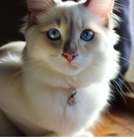
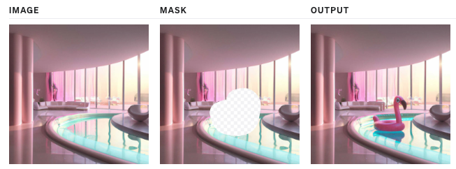
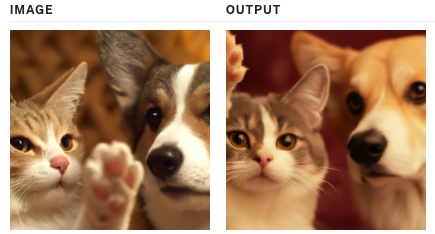

# OpenAI`4.0T`官方文档-能力-5 图像生成
了解如何使用 API 中的 DALL·E 生成或操作图像。

	想要在 ChatGPT 中生成图像？前往 chat.openai.com。
## 介绍
Images API 提供了三种与图像交互的方法：

- 根据文本提示从头开始创建图像（DALL·E 3 和 DALL·E 2）
- 根据新的文本提示，通过让模型替换预先存在的图像的某些区域来创建图像的编辑版本（仅限 DALL·E 2）
- 创建现有图像的变体（仅限 DALL·E 2）

本指南涵盖了使用这三个 API 端点的基础知识以及有用的代码示例。要尝试 DALL·E 3，请前往 [ChatGPT](https://chat.openai.com/)。要试用 DALL·E 2，请查看 [DALL·E 预览应用程序](https://labs.openai.com/)。

## 用法
### 世代
[图像生成](https://platform.openai.com/docs/api-reference/images/create) 端点允许您根据文本提示创建原始图像。使用 DALL·E 3 时，图像的尺寸可以为

- 1024x1024
- 1024x1792 
- 或 1792x1024 像素

默认情况下，图像按质量生成 `standard`，但使用 DALL·E 3 时，您可以设置 `quality: "hd"` 增强细节。方形、标准质量的图像生成速度最快。

您可以使用 DALL·E 3 一次请求 1 个图像（通过发出并行请求来请求更多图像），或者使用带有 [n 参数](https://platform.openai.com/docs/api-reference/images/create#images/create-n)的 DALL·E 2 一次最多请求 10 个图像。

- 生成图像

		curl https://api.openai.com/v1/images/generations \
		  -H "Content-Type: application/json" \
		  -H "Authorization: Bearer $OPENAI_API_KEY" \
		  -d '{
		    "model": "dall-e-3",
		    "prompt": "a white siamese cat",
		    "n": 1,
		    "size": "1024x1024"
		  }'
- [DALL·E 3 的新增功能](https://cookbook.openai.com/articles/what_is_new_with_dalle_3)

	在 OpenAI Cookbook 中探索 DALL·E 3 的新增功能

### 提示词
随着 DALL·E 3 的发布，该模型现在采用提供的默认提示，并出于安全原因自动重写它，并添加更多细节（更详细的提示通常会产生更高质量的图像）。

虽然目前无法禁用此功能，但您可以通过在提示中添加以下内容来使用提示来使输出更接近您请求的图像：

	I NEED to test how the tool works with extremely simple prompts. DO NOT add any detail, just use it AS-IS:。

更新后的提示在数据响应  `revised_prompt` 对象的字段中可见。

## 示例 DALL·E 3 
- 提示词

		A photograph of a white Siamese cat.
		一张白色暹罗猫的照片。
- 生成
	
	

使用 [response_format](https://platform.openai.com/docs/api-reference/images/create#images/create-response_format) 参数，每个图像都可以作为 URL 或 Base64 数据返回。URL 将在一小时后过期。

### 编辑（仅限 DALL·E 2）
[图像编辑](https://platform.openai.com/docs/api-reference/images/create-edit)端点也称为“修复”，允许您通过上传图像和指示应替换哪些区域的蒙版来编辑或扩展图像。蒙版的透明区域指示应编辑图像的位置，并且提示应描述完整的新图像，`而不仅仅是擦除的区域`。此端点可以实现类似于我们 [DALL·E 预览应用程序](https://labs.openai.com/editor)中的编辑器的体验。

- 编辑图像

		curl https://api.openai.com/v1/images/edits \
		  -H "Authorization: Bearer $OPENAI_API_KEY" \
		  -F image="@sunlit_lounge.png" \
		  -F mask="@mask.png" \
		  -F model="dall-e-2" \
		  -F prompt="A sunlit indoor lounge area with a pool containing a flamingo" \
		  -F n=1 \
		  -F size="1024x1024"

		
提示：

	a sunlit indoor lounge area with a pool containing a flamingo
	阳光明媚的室内休息区，设有包含火烈鸟的游泳池

上传的图像和蒙版必须都是大小小于4MB的方形PNG图像，并且尺寸必须相同。生成输出时不会使用遮罩的非透明区域，因此它们不一定需要与原始图像匹配，如上面的示例。

### 变体（仅限 DALL·E 2）
[图像变体](https://platform.openai.com/docs/api-reference/images/create-variation)端点允许您生成给定图像的变体。

- 生成图像变体

		curl https://api.openai.com/v1/images/variations \
		  -H "Authorization: Bearer $OPENAI_API_KEY" \
		  -F image='@corgi_and_cat_paw.png' \
		  -F model="dall-e-2" \
		  -F n=1 \
		  -F size="1024x1024"

	
与编辑端点类似，输入图像必须是大小小于 4MB 的方形 PNG 图像。

### 内容审核
提示和图像根据我们的[内容政策](https://labs.openai.com/policies/content-policy)进行过滤，当提示或图像被标记时返回错误。
## 特定于语言的提示
### 使用内存中的图像数据
上面指南中的 Python 示例使用该 `open` 函数从磁盘读取图像数据。在某些情况下，您可能会将图像数据存储在内存中。以下是使用存储在对象中的图像数据的 API 调用示例 `BytesIO`：

程序升级到 Python SDK v1.2，使用 `pip install --upgrade openai`

	from io import BytesIO
	from openai import OpenAI
	client = OpenAI()
	
	# 这是包含图像数据的 BytesIO 对象
	byte_stream: BytesIO = [your image data] 
	byte_array = byte_stream.getvalue()
	response = client.images.create_variation(
	  image=byte_array,
	  n=1,
	  model="dall-e-2",
	  size="1024x1024"
	)
### 对图像数据进行操作
在将图像传递给 API 之前对其执行操作可能很有用。`PIL` 这是一个用于调整图像大小的示例：

程序升级到 Python SDK v1.2，使用 `pip install --upgrade openai`
	
	from io import BytesIO
	from PIL import Image
	from openai import OpenAI
	client = OpenAI()
	
	#从磁盘读取映像文件并调整其大小
	image = Image.open("image.png")
	width, height = 256, 256
	image = image.resize((width, height))
	
	# 将图像转换为 BytesIO 对象
	byte_stream = BytesIO()
	image.save(byte_stream, format='PNG')
	byte_array = byte_stream.getvalue()
	
	response = client.images.create_variation(
	  image=byte_array,
	  n=1,
	  model="dall-e-2",
	  size="1024x1024"
	)

### 错误处理
由于输入无效、速率限制或其他问题，API 请求可能会返回错误。这些错误可以通过语句来处理`try...except`，错误详细信息可以在 `e.error`：

程序升级到 Python SDK v1.2，使用 `pip install --upgrade openai`

	import openai
	from openai import OpenAI
	client = OpenAI()
	
	try:
	  response = client.images.create_variation(
	    image=open("image_edit_mask.png", "rb"),
	    n=1,
	    model="dall-e-2",
	    size="1024x1024"
	  )
	  print(response.data[0].url)
	except openai.OpenAIError as e:
	  print(e.http_status)
	  print(e.error)