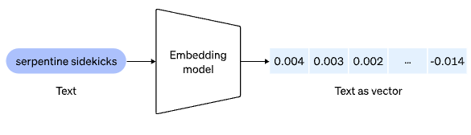
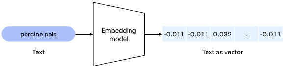
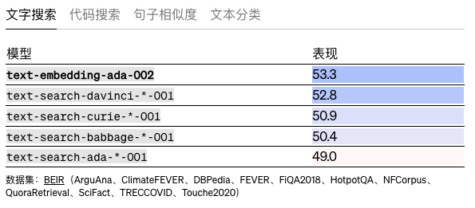
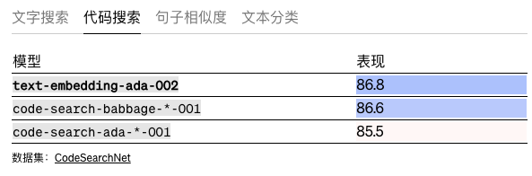
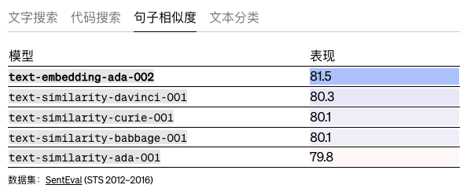
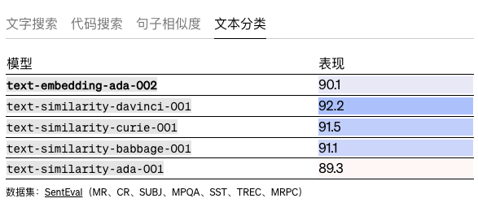

# 新的和改进的 embedding 模型
我们很高兴地宣布推出一种新的 embedding 模型，该模型功能更强大、更具成本效益且更易于使用。

新模型 `text-embedding-ada-002` 取代了用于文本搜索、文本相似性和代码搜索的五个独立模型，并且在大多数任务上优于我们之前最强大的模型 Davinci，同时价格降低了 99.8%。

embedding 是转换为数字序列的概念的数字表示，这使得计算机可以轻松理解这些概念之间的关系。自从  OpenAI/[embeddings](https://openai.com/blog/introducing-text-and-code-embeddings/)端点首次推出以来 ，许多应用程序已经合并了 embedding 来个性化、推荐和搜索内容。

您可以使用我们的 [OpenAI Python Library](https://github.com/openai/openai-python) 通过两行代码查询新模型的 [/embeddings](https://beta.openai.com/docs/api-reference/embeddings) 端点，就像使用以前的模型一样：

    
	import openai
	response = openai.Embedding.create(
	  input="porcine pals say",
	  model="text-embedding-ada-002"
	)
	
	print(response)
	{
	  "data": [
	    {
	      "embedding": [
	        -0.0108,
	        -0.0107,
	        0.0323,
	        ...
	        -0.0114
	      ],
	      "index": 0,
	      "object": "embedding"
	    }
	  ],
	  "model": "text-embedding-ada-002",
	  "object": "list"
	}

## 模型改进
- 性能更强

	`text-embedding-ada-002` 在文本搜索、代码搜索和句子相似性任务上优于所有旧的 `embedding` 模型并在文本分类上获得可比的性能。对于每个任务类别，我们[评估](https://arxiv.org/abs/2201.10005)旧 embedding 中使用的数据集上的模型 。

	
	
	
	
	
	
	
- 能力的统一

	我们通过将上面  显示的五个独立模型（`text-similarity\text-search-query\text-search-doc\code-search-text\code-search-code`）合并为一个新模型，显着简化了/embeddings 端点的接口。这种单一表示在不同的文本搜索、句子相似性和代码搜索基准测试中比我们之前的 embedding 模型表现得更好。
- 更长的上下文

	新模型的上下文长度增加了四倍，从 2048 增加到 8192，使得处理长文档更加方便。
- 较小的 embedding 尺寸

	新的 `embedding` 只有 1536 个维度，是 `davinci-001`  embedding 大小的八分之一，使得新的 embedding 在使用矢量数据库时更具成本效益。
- 降价

	与同尺寸的旧型号相比，我们将新 embedding 型号的价格降低了 90%。新型号以低于旧达芬奇型号 99.8% 的价格实现了更好或相似的性能。

总的来说，新的 embedding 模型对于自然语言处理和代码任务来说是一个更强大的工具。我们很高兴看到我们的客户将如何使用它在各自领域创建更强大的应用程序。

## 局限性
新 `text-embedding-ada-002` 模型在 `SentEval ` 线性探测分类基准上的表现并不出色 。`text-similarity-davinci-001` 对于需要在 embedding 向量之上训练轻量级线性层以进行分类预测的任务，我们建议将新模型与新模型进行比较 `text-similarity-davinci-001` 并选择能够提供最佳性能的模型。

检查 embedding 文档中的[限制和风险部分](https://beta.openai.com/docs/guides/embeddings/limitations-risks)，了解我们 embedding 模型的一般限制。

## embedding API 的实际应用示例
- [Kalendar AI](https://beta.openai.com/docs/guides/embeddings/limitations-risks) 是一款销售推广产品，它使用embedding 从包含 3.4 亿个人资料的数据集中将正确的销售推介与正确的客户相匹配。这种自动化依赖于客户资料 embedding 和销售推介之间的相似性来对最合适的匹配进行排名，与旧方法相比，消除了 `40-56%` 不需要的定位。
- 在线工作空间公司 [Notion 将使用 OpenAI 的新 embedding 来改进 Notion 搜索](https://www.notion.so/)，超越当今的关键字匹配系统。

## 参考
[new-and-improved-embedding-model](https://openai.com/blog/new-and-improved-embedding-model)