# 跟 ChatGPT 学数学：理解向量点积和余弦相似度
如何理解 “通过计算两个向量的点积可以知道它们之间的相似度。“

那么怎么理解上面这句话呢？ChatGPT 的解释总结

	点积（Dot Product）是一种数学运算，用于衡量两个向量的相似度。当两个向量完全相同时，点积会达到最大值。当两个向量垂直时，点积为0。点积的结果受向量长度的影响，所以在比较相似度时，常常会将向量单位化。通过点积，可以量化两个向量的相似度，这在各种应用场景中（如自然语言处理、图像识别等）都非常有用。

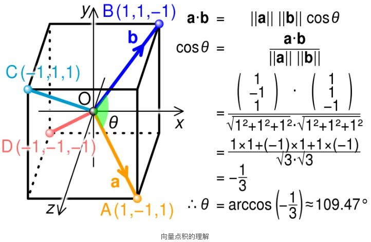

解释很笼统，是这么个道理，但是还是有很多疑问，比如：

- 怎么理解这里的相似？
- 为啥要用点积衡量相似度？
- 怎么理解多维向量？
- 向量是怎么得出来的？
- 具体计算步骤是怎么样的？
- 应用场景有哪些？

## 怎么理解相似？
首先来看第一个问题，怎么理解这里向量的相似？两个向量的相似度并不是类似于数字的相等，而是更多地关注于两个向量是否“指向”相同或相似的方向。在不同的应用场景下，相似度的概念也可能有所不同，但通常包括以下几个方面：

- 方向

	向量的方向是相似度最直观的一面。在二维或三维空间里，你可以直观地想象两个向量是否大致指向同一方向。如果两个向量之间的夹角趋近于0度，那么它们就被认为是非常相似的。
- 长度

	向量的长度（或模）也可以是衡量相似度的一个因素，尤其是在需要考虑“强度”或“大小”的场合。然而，在很多应用中，例如文本相似度计算，通常会忽略向量长度的影响，只考虑方向。
- 度量方法

	不同的度量方法会给出不同类型的相似性信息。除了点积外，还有余弦相似度、欧氏距离、曼哈顿距离等多种方法。

	- 点积

		如前所述，主要衡量方向和长度。
	- 余弦相似度(Cosine Similarity)

		只考虑方向，不考虑长度。是点积的一个归一化版本。
	- 欧氏距离

		衡量两点之间的“距离”，而非方向。

在不同的应用领域，相似度的解释和重要性也会有所不同。例如，在自然语言处理中，词向量的相似度常用于衡量词语的语义相似性；在推荐系统中，可能用于衡量用户或物品的相似性。

概括一下就是，两个向量的相似度是一个多面的概念，`取决于你关注的是方向、长度，还是其他特性`，以及你所处的具体应用场景。

## 为啥用点积衡量？
好了，了解了什么是相似，那么这里就有另一个问题，为啥要用点积来衡量？点积有以下几个重要性质，使其适用于衡量向量间的相似度：

- 夹角的度量

	点积与两向量之间的夹角有关。当两个向量的方向完全相同（即夹角为0度）时，点积最大。反之，当两个向量正交（即夹角为90度）时，点积为零。
- 长度的影响

	点积同时考虑了向量的长度和方向。因此，长的、方向相似的向量会有更大的点积。
- 计算简便

	点积计算相对简单，只涉及基础的算术运算，这使得它在大规模数据处理中非常实用。
- 可解释性

	点积的结果可以轻易地通过夹角和长度进行解释，这在许多应用场景（如自然语言处理、推荐系统等）中是有用的。
- 线性性质

	点积满足分配律和结合律，这意味着它可以轻易地应用于更复杂的数学结构和算法中。

因此，通过计算两个向量的点积，我们可以快速有效地获得它们之间的相似度信息。

## 怎么理解多维?
前面说的向量，不是 2 维和 3 维空间里的向量，其实可以扩展到更高维度。多维向量的相似度实际上是对高维空间中两点关系的一种量化，`与二维或三维空间的概念在本质上是相同的`，只不过更难以直观地想象。在多维空间中，我们依然可以使用点积、余弦相似度、欧氏距离等方法来计算向量的相似度。

多维向量的点积是所有维度上对应元素相乘然后求和，这个值反映了两个向量在多维空间中的相似程度。数学表达式与低维空间中的相同。假设我们有两个 n 维向量 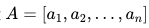和 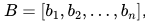，点积定义为：

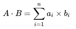

每个向量的范数（长度）定义为：

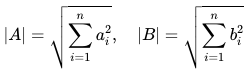

之间的夹角 θ 的余弦值定义为：

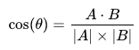

这个定义在二维、三维以及任何更高维的向量空间中都是成立的，因为它是基于向量点积和范数（向量的长度）的基础性质来定义的，而这些性质在所有维度中都是一致的。

在机器学习、数据挖掘、自然语言处理等多种应用场景下，多维向量的相似度计算都起着关键作用。例如，在文本分类、推荐系统、图像识别等问题中，都会用到这些相似度或距离计算方法。

因此，即使在多维空间中，我们依然可以通过这些方法有效地量化向量间的相似度或差异性。只是与低维空间相比，高维空间更容易受到“维度灾难”（Curse of Dimensionality）的影响，这可能会让某些距离或相似度计算方法在应用上变得不那么直观或有效。
## 怎么找到合适的向量？
其实对于自然语言处理或者其他领域来说，计算向量点积和余弦相似度从来不是难点，难点在于找出一组合适的高维向量，能够提取出关键信息，从而通过计算它们的点积来评估相似性。生成向量的方法有很多，比如：

- 基于词袋模型（Bag-of-Words）
	- 词频（TF）

		仅使用词频（Term Frequency）来表示文本。
	- TF-IDF（Term Frequency-Inverse Document Frequency）

		使用词频（TF）和逆文档频率（IDF）的乘积来表示文本。
- 基于词嵌入（Word Embeddings）
	- Word2Vec

		利用神经网络模型来构建高维的词向量。
	- GloVe（Global Vectors for Word Representation）

		通过全局统计信息来构建词向量。
	- FastText

		与 Word2Vec 类似，但考虑了词内的子结构（如字符 n-grams）。
- 基于语言模型
	- BERT（Bidirectional Encoder Representations from Transformers）

		使用 Transformer 模型，并考虑了上下文信息。
	- GPT（Generative Pre-trained Transformer）

		类似于 BERT，但通常用于生成任务。

选择哪种方法取决于具体的应用场景、可用资源以及所需的准确性。通常，更复杂的方法（如 BERT 或 GPT）能提供更高的准确性，但计算成本也更高。

## 具体计算步骤
向量点积和余弦相似度具体是怎么计算呢？下图是一个简单示例，有两个3维向量，

	A=[2,4,3]
和 

	B=[1,3,2]

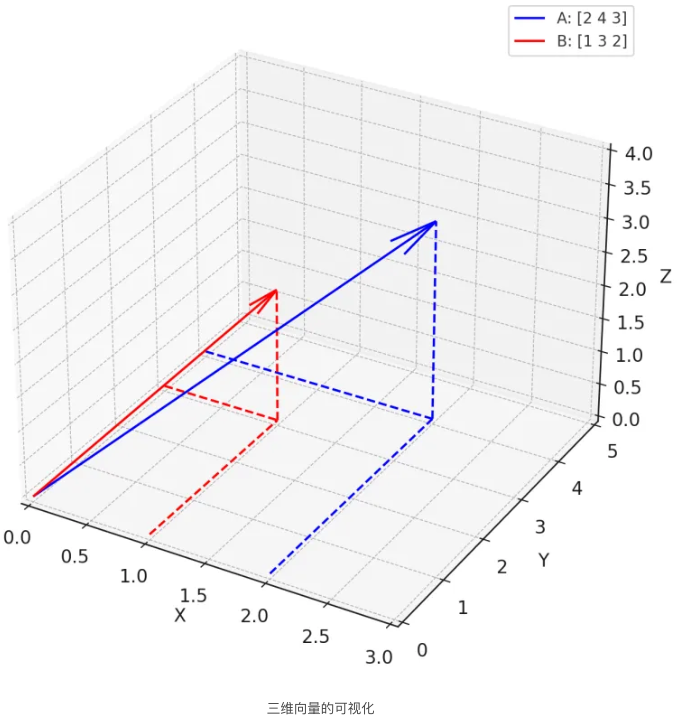

### 人工计算
给定两个 n- 维向量 ，它们的点积计算公式为：

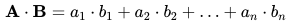

在这个例子中：

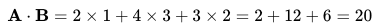

余弦相似度是通过计算两个向量的点积并将其归一化得到的，具体计算公式为：

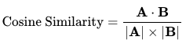

其中 |A|和|B| 是两个向量的模（长度），可以通过以下公式计算：

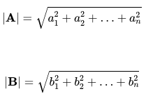

在这个例子中，余弦相似度计算如下：

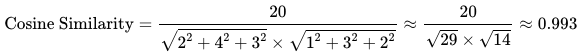

点积为20，这是一个相对较大的值，说明两个向量在多维空间中有很好的对齐性。余弦相似度接近1（最大值为1），表示两个向量几乎指向相同的方向。

### 程序实现计算
实际中，都是通过程序直接来计算的。下面例子中，我们用 Python 随机生成两个 100 维的向量，计算它们的点积和余弦相似度。

	import numpy as np
	
	# 随机生成两个 100 维的向量
	vector1 = np.random.rand(100)
	vector2 = np.random.rand(100)
	
	# 计算点积
	dot_product = np.dot(vector1, vector2)
	
	# 计算余弦相似度
	cos_similarity = dot_product / (np.linalg.norm(vector1) * np.linalg.norm(vector2))
	
	dot_product, cos_similarity

## 应用场景
最后来看看点积有哪些应用场景。在自然语言处理（NLP）领域，点积和余弦相似度有着广泛的应用。下面是一些具体的例子：

- 文本相似性和文档检索

	通过计算文档或句子的词向量（通常是TF-IDF或词嵌入向量）的点积或余弦相似度，可以快速找出内容相似的文档或句子。这在信息检索、文档分类和聚类等任务中非常有用。
- 词义相似性

	词嵌入技术（如Word2Vec、GloVe等）生成的词向量可以用点积或余弦相似度来衡量词义的相似性或相关性。
- 机器翻译

	在序列到序列的模型，比如 Transformer 中，注意力机制经常使用点积来计算不同词或短语之间的关联强度。
- 情感分析

	在情感分析中，可以通过计算文本与预定义情感词的点积或余弦相似度，来评估文本的情感倾向。

这些只是点积和余弦相似度在自然语言处理中应用的一部分，其实还有更多的用途和扩展。

通过和 ChatGPT 不断沟通，和对它回答的一些验证，慢慢对向量的点积和余弦相似度有了一个比较清晰的认识，看来后面可以跟着老师学更多数学知识了。