# rundiffusion 云环境启动步骤
## 1 充值
- 点击个人信息

	
- 点击添加

	
- 跳转 stripe

	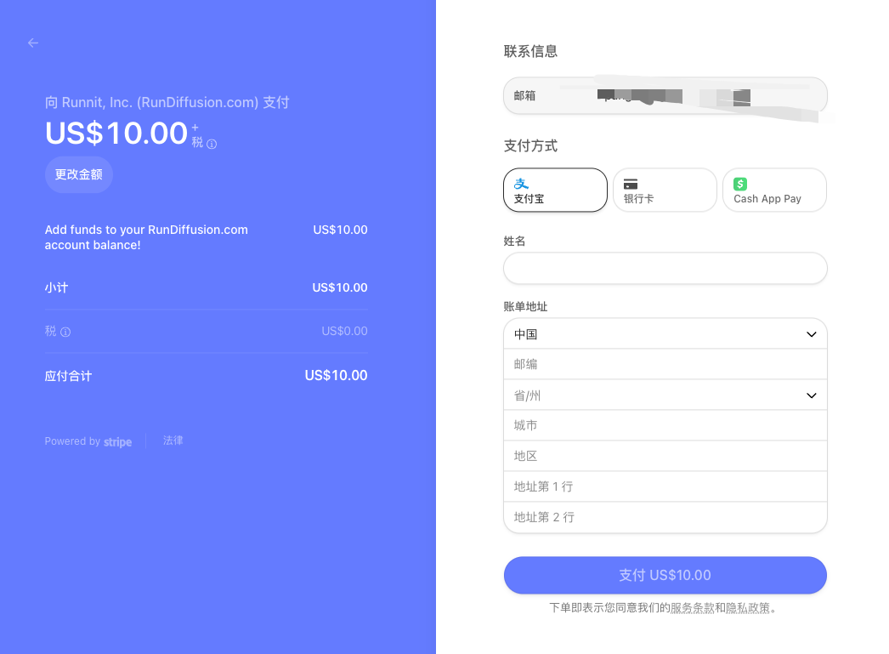	
	
## 2 步骤
- 登录界面

	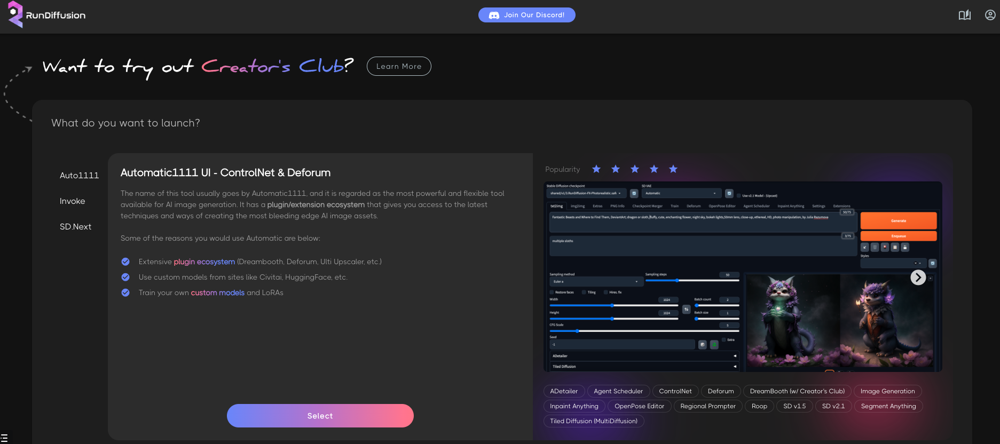
- 选择环境(默认选择 webui)

	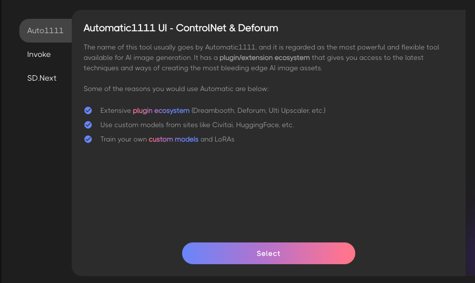
- 选择虚拟机环境
	- 第一步选择硬件

		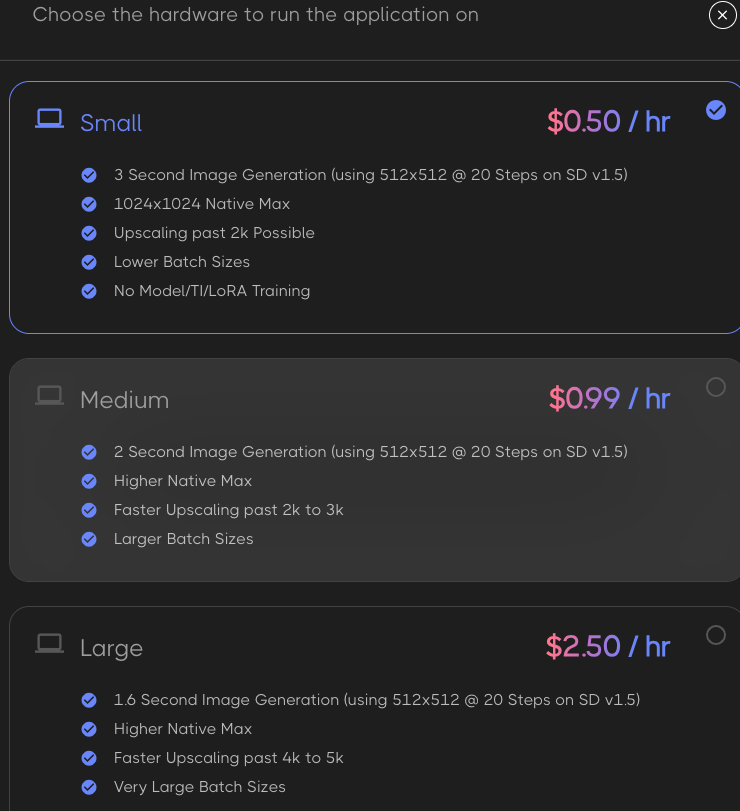
	- 第二步选择服务版本

		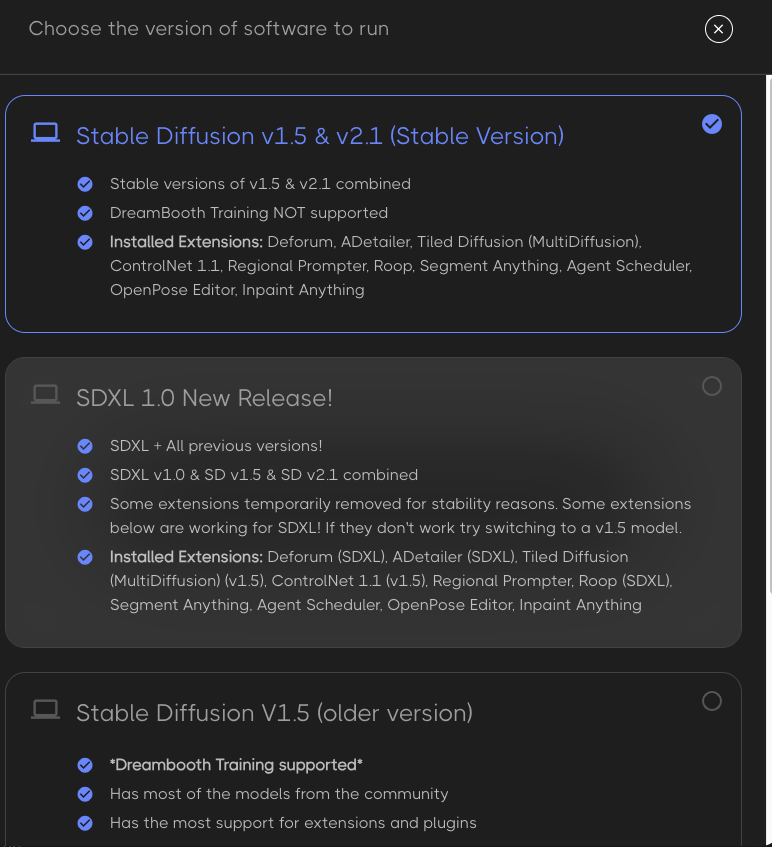
	- 第三步选择会话类型

		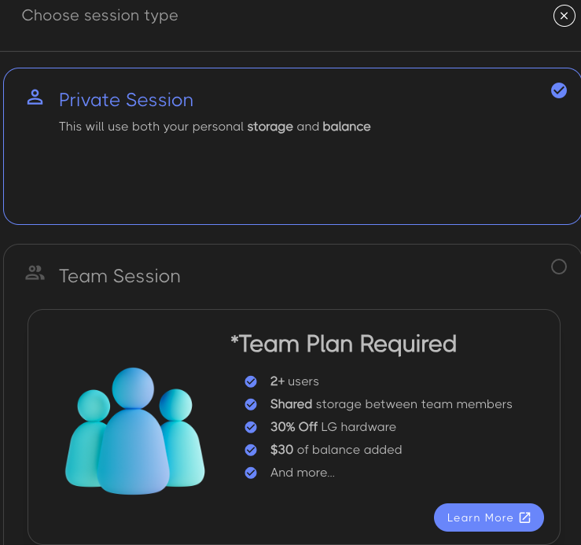
	- 第四步选择存储类型

		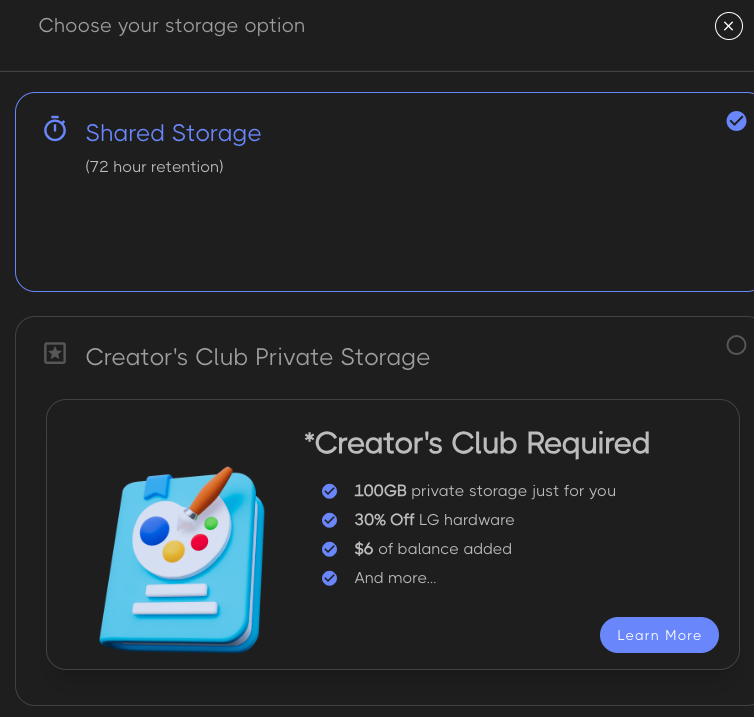	
- 确认设置 SD 虚拟机环境
	- 设置选择环境
		- 应用
		- 硬件
		- 模型版本
		- 虚拟机类型
		- 存储 

		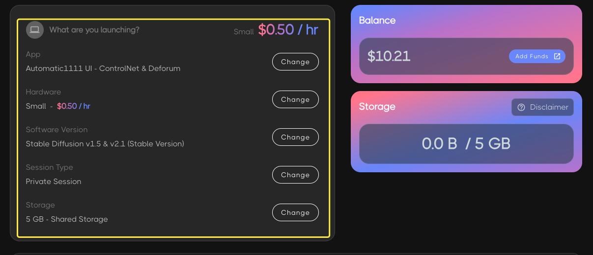 	
	- 余额/已使使用存储空间

		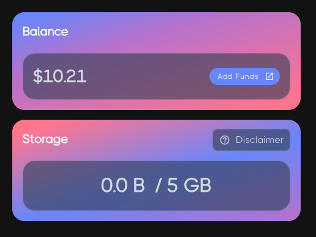 
	- 设置启动参数
		- 预计运行时间
		- 时间计费

		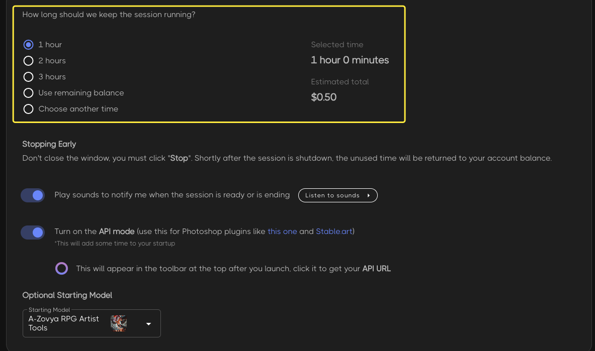 
	- 启动和停止提示
		- 语音提示
		- 是否打开 API 模式
			- 打开 api url 显示在顶部       			
		- 选择模型

		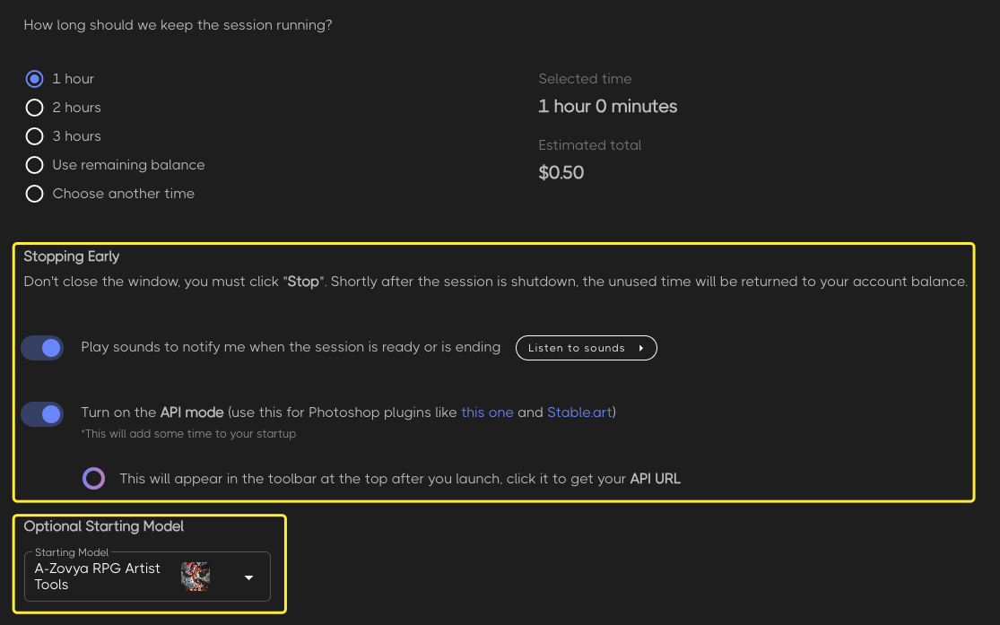 
	- 服务声明

		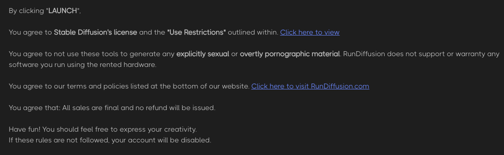
- 异步起动界面
	- 提示
	- 问卷
	- 起动过程
	- 加入 Discord

	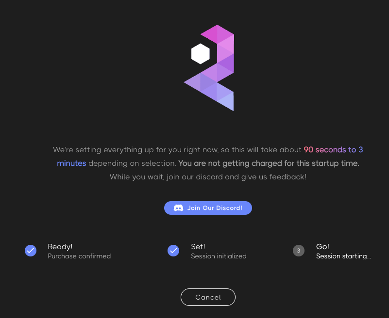
		
## 3 使用界面
该页面由 Top 操作栏和 SD 和 文件游览器服务 2个服务组合而成，而 SD 和文件游览器服务均使用 iframe 嵌入
### 3.1 RunDiffusion 页面 top 栏操作
- 扩展按钮

	调节一些设置，查看余额等

	
- 关闭按钮

	提示服务关闭
	
	
	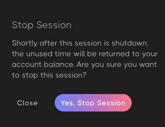
	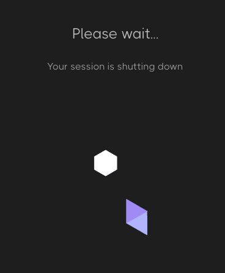
- Learn RunDiffusion 按钮

	跳转学习页面
	
	
- 隐藏/显示 file browser 抽屉按钮

		
- 跳转 file browser 页面服务按钮

	
- 查看当前启动实例按钮

	
	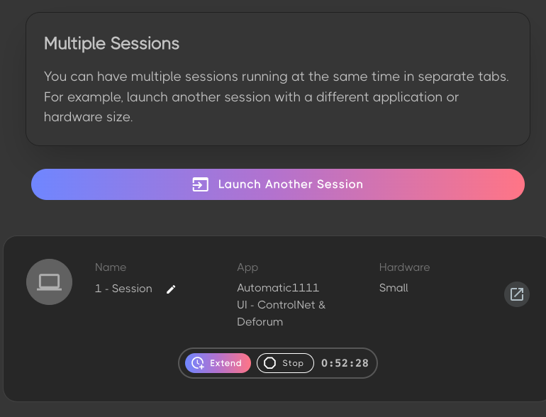
		
### 3.2 SD 界面 

### 3.3 File Browser
主机文件服务，第一次打开会跳出登录账户密码

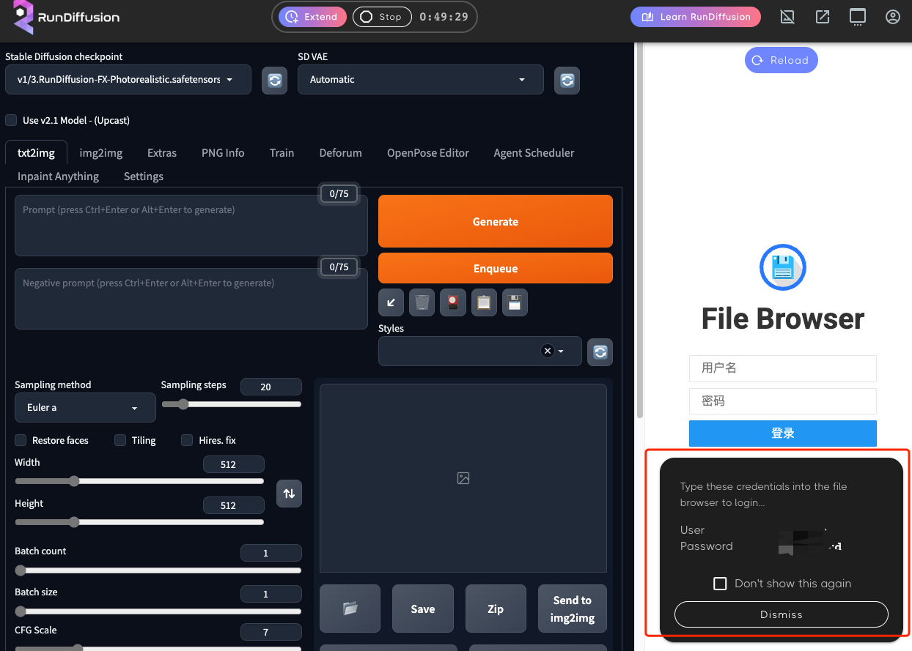 

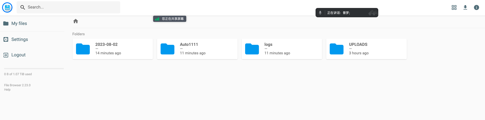 

	

	 		  	

	