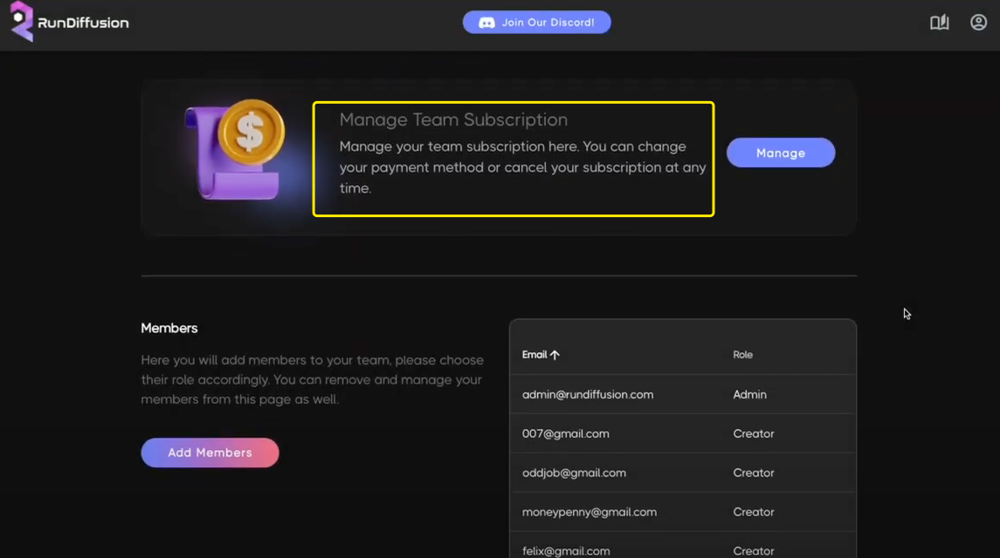
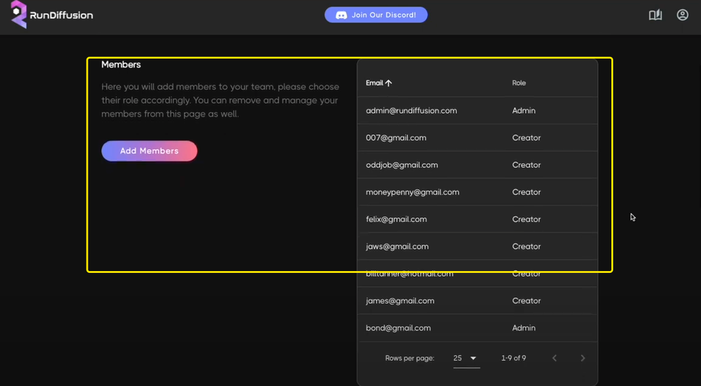
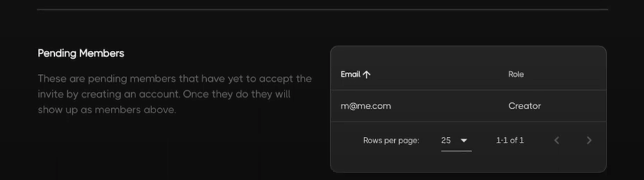
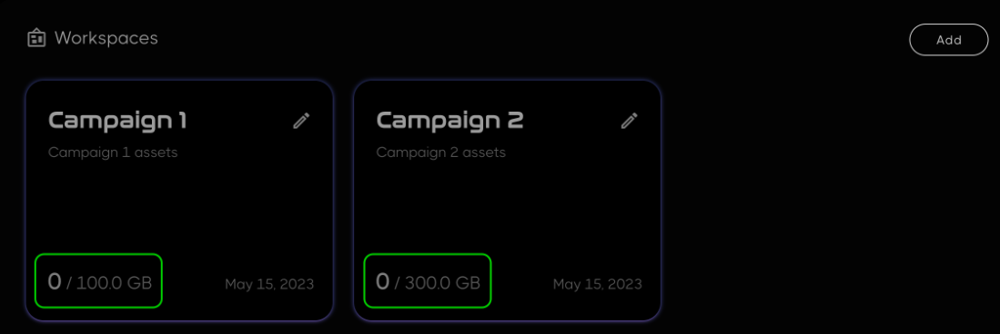
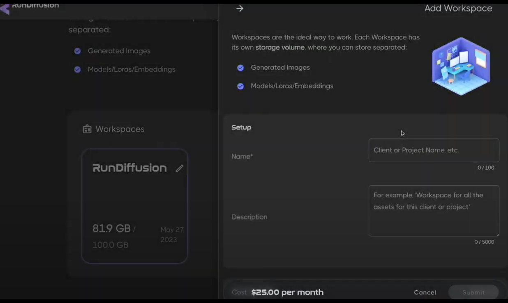
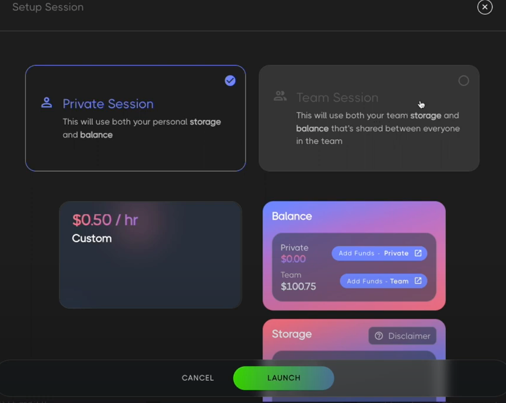
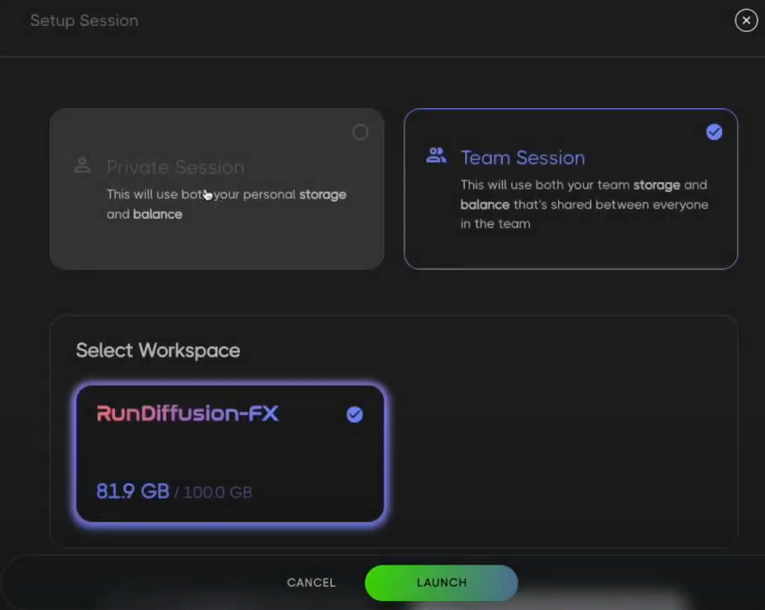
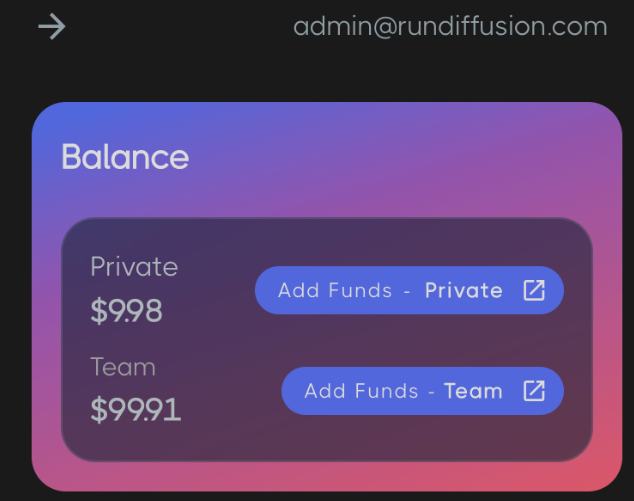

# RunDiffusion 功能分析
## 高级功能
### 团队功能
- 管理团队订阅

	在这里管理您的团队订阅。您可以随时更改您的支付方式或取消订阅。

	
- 成员列表+添加

	在这里您将添加成员到您的团队，请相应地选择他们的角色。您也可以从这个页面删除和管理您的会员。
	
	
- 待定成员

	这些是尚未通过创建帐户接受邀请的待定成员。一旦他们这样做，他们将显示为成员以上。
	
	
- 工作空间

	工作区是理想的工作方式。每个工作区都有自己的存储卷，您可以在其中分别存储:
	
	- 生成图片存储
	- 模型存储

	附注:目前不支持删除工作区或更改其存储量。此功能将很快可用，所以在此期间，您可以在我们的 Discord 提交一张票来支持这些功能  
- 添加工作空间

	具有“管理员”角色的团队成员可以添加新的“工作区”，每月每 50GB 12.50 美元。基本团队计划附带一个工作区 100GB。您需要多个工作区的原因有很多，也许您需要将您的客户或项目分开，因为您的组织需要或只是为了您的方便。
	
	
	
	添加
	
	
	
	- 空间名称*
	- 空间描述
	- 设置存储大小
		- 最大 1GB
- 设置工作空间

	启动服务时，设置存储空间来加载

	- 个人

		  
	- 团队
	
		团队中的每个人现在都可以开始“团队Session”，这将：

		- 使用团队余额中的资金
		- 使用选定的“工作区”存储（订阅后您将获得一个 100GB 工作区，但当然您可以添加更多！）

		 
- 团队余额
	
	团队中的每个人都可以在开始“团队Session”时访问团队余额。只有具有“管理员”角色的团队成员才能使用与您的个人资金付款方式分开的付款方式增加团队余额的资金。 		 
	
		

sduser
Password

		
## 分析
- [Introducing the RunDiffusion Team Plan](https://youtu.be/KkOci0wBtXk)
- [https://learn.rundiffusion.com/team-plan/#:~:text=How%20to%20Use%20Your%20Team%20Plan](https://learn.rundiffusion.com/team-plan/)			