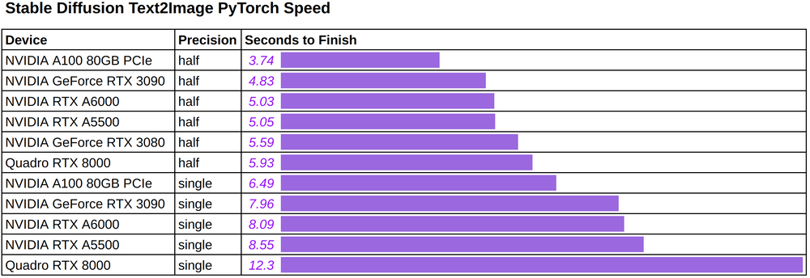
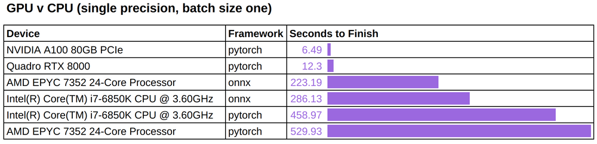
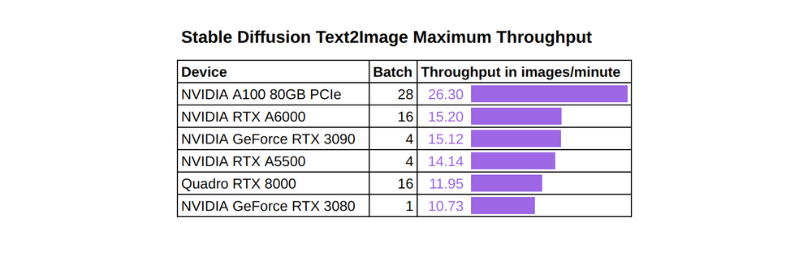
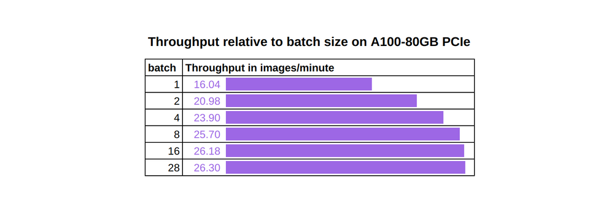
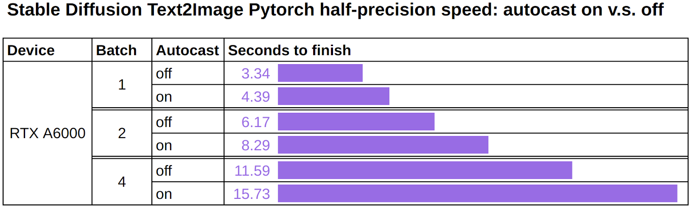
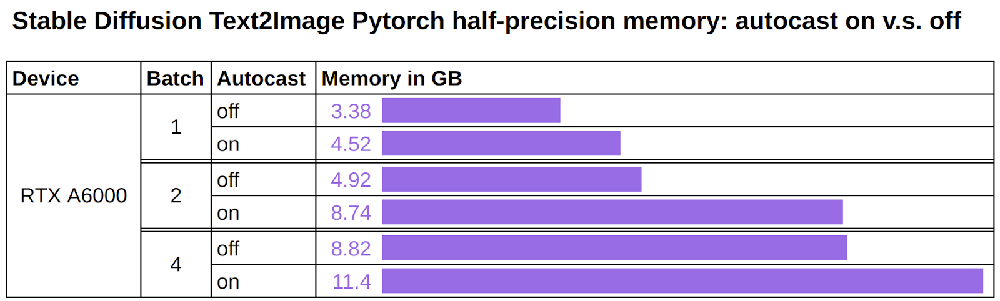
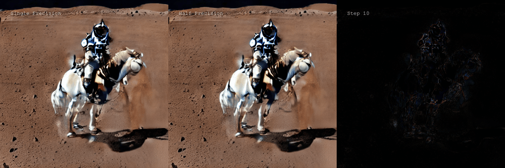
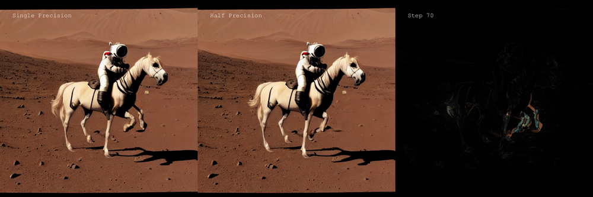

# GPU： Stable Diffusion的推理基准
运行最先进的文本到图像模型需要什么？游戏卡可以完成这项工作，还是我应该买一个花哨的 A100？如果我只有一个 CPU 怎么办？

为了阐明这些问题，我们提出了在不同 GPU 和 CPU 上[Stable Diffusion](https://huggingface.co/CompVis/stable-diffusion)的[推理基准](https://github.com/LambdaLabsML/lambda-diffusers/tree/eole/benchmarking#benchmarking-inference)。这些是我们的发现：

- 许多消费级 GPU 可以做得很好，因为 stable diffusion 只需要大约 5 秒和 5 GB 的 VRAM 即可运行。
- 在输出单张图像的速度方面，最强大的 Ampere GPU (A100) 仅比 3080 快 33%（或 1.85 秒）。
- 通过将批量大小推到最大，与 3080 相比，A100 可以提供 2.5 倍的推理吞吐量。

我们的基准测试使用文本提示作为输入并输出分辨率为 `512x512` 的图像。我们使用 [Huggingface diffusion](https://github.com/huggingface/diffusers) 的库中的模型实现，并从速度、内存消耗、吞吐量和输出图像的质量方面分析推理性能。我们研究了硬件（GPU 模型、GPU 与 CPU）和软件（单精度与半精度、pytorch 与 onnxruntime）的不同选择如何影响推理性能。

作为参考，我们将为以下 GPU 设备提供基准测试结果：A100 80GB PCIe、RTX3090、RTXA5500、RTXA6000、RTX3080、RTX8000。有关在您自己的环境中运行这些实验的详细信息，请参阅“[重现实验](https://lambdalabs.com/blog/p/5c60a332-7422-4b62-9d06-7b31a8912d0d/#reproducing-the-experiments)”部分。

最后但并非最不重要的一点是，我们很高兴看到社区进展得如此之快。例如，“[切片注意力](https://huggingface.co/docs/diffusers/main/en/optimization/fp16#sliced-attention-for-additional-memory-savings)”技巧可以进一步将 VRAM 成本降低到“低至 3.2 GB”，但会降低推理速度约 10%。我们还期待在不久的将来它变得更加稳定后，使用 CUDA 设备测试 [ONNX 运行时](https://github.com/huggingface/diffusers/issues/489)。

## 速度
下图展示了使用（任意）文字提示：“a photo of an astronaut interviewing a horse on mars”，使用不同的硬件和精度生成单个图像时的推理速度。

- Stable Diffusion Text2Image 速度（以秒为单位）

	

	我们发现：

	- 在我们测试的 Ampere GPU（包括消费级 3080 卡到旗舰 A100 80GB 卡）中，生成单个输出图像的时间介于 3.74 到 5.59 秒之间。
	- 半精度将 Ampere GPU 的时间缩短了约 40%，将上一代 RTX8000 GPU 的时间缩短了 52%。

	我们认为，由于使用 `TF32`，Ampere GPU 从半精度获得了相对“较小”的加速。对于不熟悉 `TF32` 的读者，[它是一种 19 位格式](https://blogs.nvidia.com/blog/2020/05/14/tensorfloat-32-precision-format/)，已被用作 PyTorch 和 TensorFlow 等主要深度学习框架的 Ampere GPU 上的默认单精度数据类型。可以预期半精度对 FP32 的加速会更大，因为它是一种真正的 32 位格式。

	我们在 CPU 设备上运行这些相同的推理作业，以便了解在 GPU 设备上观察到的性能。

- Stable Diffusion Text2Image GPU 与 CPU

	
	
	我们注意到：

	- GPU 的速度明显更快——根据精度提高一到两个数量级。
	- `onnxruntime` 可以将 CPU 推理时间减少大约 40% 到 50%，具体取决于 CPU 的类型。
	
	附带说明一下，ONNX 运行时目前没有对 Huggingface diffusers [CUDA 后端支持](https://github.com/huggingface/diffusers/issues/489)，我们在初步 `CUDAExecutionProvider` 测试中也没有观察到有意义的加速。我们期待在 ONNX 运行时针对 stable diffusion 进行[更优化](https://github.com/huggingface/diffusers/issues/489#issuecomment-1261577250)后进行更彻底的基准测试。

## 内存
我们还测量了运行 stable diffusion 的内存消耗。

- Stable Diffusion Text2Image Memory (GB)

	

观察到所有测试 GPU 的内存使用情况是一致的：

- 运行批量大小为 1 的单精度推理大约需要 7.7 GB GPU 内存。
- 运行批量大小为 1 的半精度推理大约需要 4.5 GB GPU 内存。

## 吞吐量
到目前为止，我们已经测量了单个输入的处理速度，这对于不能容忍哪怕是最轻微的延迟的在线应用程序来说是至关重要的。但是，一些（离线）应用程序可能会关注“吞吐量”，它衡量在固定时间内处理的数据总量。

我们的吞吐量基准将每个 GPU 的批量大小推到最大，并测量它们每分钟可以处理的图像数量。最大化批量大小的原因是保持张量核心繁忙，以便计算可以主导工作负载，避免任何非计算瓶颈并最大化吞吐量。

我们在 pytorch 中以半精度运行一系列吞吐量实验，并使用可用于每个 GPU 的最大批量大小：

- Stable Diffusion Text2Image 吞吐量（图像/分钟）

	

	我们注意到：

	- 再一次，A100 80GB 是表现最好的并且具有最高的吞吐量。
	- A100 80GB 与其他卡在吞吐量方面的差距可以用这张卡上可以使用的更大的最大批量大小来解释。
作为一个具体的例子

	作为一个具体的例子，下图显示了当我们将批量大小从 1 更改为 28（最大但不会导致内存不足错误）时，A100 80GB 的吞吐量如何增加 64%。有趣的是，当 batch size 达到一定值时，增加不是线性的并且变平，此时GPU上的张量核心已经饱和，GPU内存中的任何新数据都必须排队才能获得他们自己的计算资源。

- Stable Diffusion Text2Image 批量大小与吞吐量（图像/分钟）

	

## 自动铸造
Hugging Face 团队对其[Stable Diffusion 进行的更新声称](https://github.com/huggingface/diffusers/pull/511)，删除自动投射可将 pytorch 的半精度推理速度提高约 25%。

- 使用自动

		  with autocast("cuda"):
		   image = pipe(prompt).images[0] 
	
- 关闭自动：

		image = pipe(prompt).images[0] 

我们在 NVIDIA RTX A6000 上重现了该实验，并且能够验证速度和内存使用方面的性能提升。我们预计其他支持半精度的设备也会有类似的改进。

- 处理速度对比

	
- 占用内存对比

	

总之：不要将自动投射与 FP16 结合使用。	

## 精确
我们很好奇半精度是否会降低输出图像的质量。为了测试这一点，我们修复了文本提示以及“latents 潜在”输入，并将它们提供给单精度模型和半精度模型。随着步数的增加，我们运行了 100 次推理。每次运行都会保存两个模型的输出以及它们的差异图。

- 单精度与超过 100 步的半精度

	

我们的观察是，单精度输出和半精度输出之间确实存在明显的差异，尤其是在早期步骤中。差异通常会随着步数的增加而减少，但可能不会消失。

有趣的是，这种差异可能并不意味着半精度输出中的伪影。例如，在步骤 70 中，下图显示了半精度在单精度输出中没有产生伪影（额外的前腿）：

- 单精度 v 步 70 的半精度

	
	
## 重现实验
您可以使用 [Lambda Diffusers](https://github.com/LambdaLabsML/lambda-diffusers) 存储库来重现本文中提供的结果。

- 设置

	在运行基准测试之前，请确保您已完成存储库[安装步骤](https://lambdalabs.com/blog/README.md#installation)。

	然后，您需要设置 huggingface 访问令牌：

	- 在 HuggingFace 上创建用户帐户并生成访问令牌。
	- 将您的 huggingface 访问令牌设置为 ACCESS_TOKEN 环境变量：

			export ACCESS_TOKEN=<hf_...>
- 用法
	- 启动 `benchmark.py` 脚本以将基准测试结果附加到现有 [benchmark.csv](https://lambdalabs.com/blog/benchmark.csv) 结果文件中：

			python ./scripts/benchmark.py
	- 启动 `benchmark_quality.py` 脚本来比较单精度和半精度模型的输出：

			python ./scripts/benchmark_quality.py
- 脚注
	1. 由于每次运行的文本提示和“潜在”输入都是固定的，这相当于运行了 100 步推理，并保存了每一步的中间结果。

## 参考
[All You Need Is One GPU: Inference Benchmark for Stable Diffusion](https://lambdalabs.com/blog/inference-benchmark-stable-diffusion/)
	
	
	
		