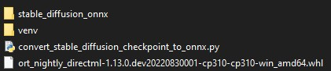
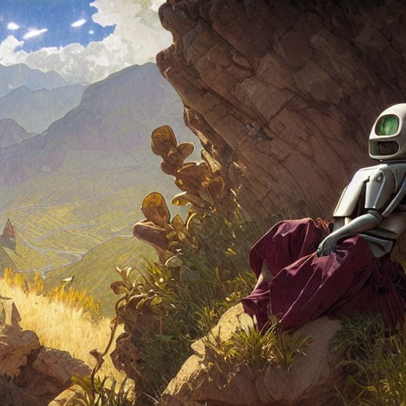

# 使用 AMD GPU 在 Windows 上运行 Stable Diffusion
Stable Diffusion 最近席卷了互联网的技术（和艺术技术）部分。这是一个开源机器学习模型，能够接收文本提示，并（通过足够的努力）生成一些真正令人难以置信的输出。看到这篇文章的封面图片了吗？这是由经过大量 My Little Pony 艺术训练的 Stable Diffusion 版本生成的。我用于该图像的提示是 `kirin, pony, sumi-e, painting, traditional, ink on canvas, trending on artstation, high quality, art by sesshu.`。

不幸的是，在目前的状态下，它依赖于 Nvidia 的 CUDA 框架，这意味着它只有在拥有 Nvidia GPU 的情况下才能开箱即用。

但是，不要害怕。因为 Stable Diffusion 既 a) 开源又 b) 友好，所以它已经看到了绝对的热潮，一些有进取心的人已经完成了一些工作，使其可用于 AMD GPU，甚至适用于 Windows 用户。

## 要求
在开始之前，您需要以下内容：

- 具有至少 6GB 显存的相当强大的 AMD GPU。我使用的是 8GB 的​​ AMD Radeon RX 5700 XT，它的功能几乎不足以在我的 CPU 上运行它。
- 一个工作的 Python 安装。您至少需要 3.7 版。 v3.7、v3.8、v.39 和 v3.10 应该都可以工作。
- 下载大约 6 GB 机器学习模型数据的毅力。
- [Hugging Face](https://huggingface.co/)帐户。来吧，去注册一个，它是免费的。
- Git 的有效安装，因为 Hugging Face 登录过程出于某种原因将其凭据存储在那里。

## 过程
我假设您没有或很少有 Python 经验。我唯一的假设是您已经安装了它，并且当您从命令行运行 `python --version` 和 `pip --version` 时，它们会做出适当的响应。
### 准备工作区
在开始之前，请在某处创建一个新文件夹。我将我的命名为 `stable-diffusion`。名字无所谓。

创建后，在您最喜欢的 shell（我自己是 PowerShell 粉丝）中打开一个命令行并导航到您的新文件夹。我们将创建一个虚拟环境来安装一些包。

在那里，运行以下命令：

	python -m venv ./virtualenv
这将使用 venv 包创建一个名为 `virtualenv` 的虚拟环境。 现在，您需要激活它。 运行以下命令：

	# For PowerShell
	./virtualenv/Scripts/Activate.ps1

	# rem For cmd.exe
	virtualenv\Scripts\activate.bat
现在，您通过 `pip` 安装或通过 python 运行的任何东西都只会在我们命名为 virtualenv 的环境的上下文中安装或运行。 如果你想离开它，你可以随时运行 `deactivate`。

好的。 一切准备就绪，让我们开始安装我们需要的东西。

### 安装依赖
我们需要一些 Python 包，所以我们将使用 pip 将它们安装到虚拟环境中，如下所示：

	pip install diffusers==0.3.0
	pip install transformers
	pip install onnxruntime
现在，我们需要下载 Microsoft 的 DirectML Onnx 运行时构建。不幸的是，在撰写本文时，他们的稳定包都不是最新的足以满足我们的需要。因此，我们需要 

- a) [从源代码编译或](https://github.com/microsoft/onnxruntime) 
- b) 使用他们预编译的 nightly 包之一。

	因为构建运行时的工具链比本指南假设的要复杂一些，所以我们将使用选项 b)。前往 [https://aiinfra.visualstudio.com/PublicPackages/_artifacts/feed/ORT-Nightly/PyPI/ort-nightly-directml/overview/1.13.0.dev20220908001](https://aiinfra.visualstudio.com/PublicPackages/_artifacts/feed/ORT-Nightly/PyPI/ort-nightly-directml/overview/1.13.0.dev20220908001) （或者，如果你是可疑的类型，你可以去 [https://aiinfra.visualstudio.com/PublicPackages/_artifacts/feed/ORT-Nightly](https://aiinfra.visualstudio.com/PublicPackages/_artifacts/feed/ORT-Nightly) 并自己在 `ort-nightly-directml` 下获取最新的）。

无论哪种方式，下载与您安装的 Python 版本相对应的包：`ort_nightly_directml-1.13.0.dev20220913011-cp37-cp37m-win_amd64.whl `用于 Python 3.7，`ort_nightly_directml-1.13.0.dev20220913011-cp38-cp38-win_amd64.whl` 用于 Python 3.8，你明白了。

下载后，使用 pip 进行安装。

	pip install pathToYourDownloadedFile/ort_nightly_whatever_version_you_got.whl --force-reinstall
请注意 `--force-reinstall` 标志！该软件包将覆盖一些以前安装的依赖项，但如果您不允许它这样做，那么事情将无法进一步发挥作用。

### 获取和转换 Stable Diffusion 模型
首先，我们将下载一个小实用程序脚本，它会自动下载 Stable Diffusion model 模型，将其转换为 Onnx 格式，并将其放在有用的地方。继续下载 [https://raw.githubusercontent.com/huggingface/diffusers/main/scripts/convert_stable_diffusion_checkpoint_to_onnx.py](https://raw.githubusercontent.com/huggingface/diffusers/main/scripts/convert_stable_diffusion_checkpoint_to_onnx.py) （即复制内容，将它们放入文本文件，并将其另存为 `convert_stable_diffusion_checkpoint_to_onnx.py`）并将其放在下一个到您的 virtualenv 文件夹。

现在是 [Hugging Face](https://huggingface.co/) 帐户发挥作用的时候了。Stable Diffusion 模型托管在这里，您需要一个 API 密钥才能下载它。注册后，您可以通过访问网站找到您的 API 密钥，单击右上角的个人资料图片 -> Settings -> Access Tokens.。

获得令牌后，通过运行以下命令对您的 shell 进行身份验证：

	huggingface-cli.exe login
并在出现提示时粘贴您的令牌。

注意：如果堆栈跟踪出现错误，底部看起来像这样：	

	File "C:\Python310\lib\subprocess.py", line 1438, in _execute_child
	    hp, ht, pid, tid = _winapi.CreateProcess(executable, args,
	FileNotFoundError: [WinError 2] The system cannot find the file specified
...那么这可能意味着您没有安装 Git。 `huggingface-cli` 工具使用 Git 来存储登录凭据。

完成后，我们可以运行实用程序脚本。

	python convert_stable_diffusion_checkpoint_to_onnx.py --model_path="CompVis/stable-diffusion-v1-4" --output_path="./stable_diffusion_onnx"
`--model_path` 是 Hugging Face 上查找模型的路径。 `--output_path` 是本地文件系统上放置现在 Onnx 的模型的路径。

坐下来放松一下——这就是 6GB 下载发挥作用的地方。 根据您的连接速度，这可能需要一些时间。

...完毕？ 好的。 现在，您应该有一个名为 `stable_diffusion_onnx ` 的文件夹，其中包含稳定 `stable_diffusion_onnx` 化版本。

您的文件夹结构现在应该如下所示：

## 运行 Stable Diffusion
现在，您只需要编写一点 Python 代码。 让我们创建一个新文件，并将其命名为 `text2img.py`。 在里面写下以下内容

	from diffusers import StableDiffusionOnnxPipeline
	pipe = StableDiffusionOnnxPipeline.from_pretrained("./stable_diffusion_onnx", provider="DmlExecutionProvider")
	
	prompt = "A happy celebrating robot on a mountaintop, happy, landscape, dramatic lighting, art by artgerm greg rutkowski alphonse mucha, 4k uhd'"
	
	image = pipe(prompt).images[0] 
	image.save("output.png")
注意我们传递给 `StableDiffusionOnnxPipeline.from_pretrained()` 的第一个参数。` “./stable_diffusion_onnx”`。 这是我们刚刚创建的 Onnx 化模型的文件路径。 并且提供者需要是 `“DmlExecutionProvider”` 才能真正指示 Stable Diffusion 使用 DirectML，而不是 CPU。

保存后，您可以使用 `python .\text2img.py` 运行它。

完成后，您将拥有一个名为 `output.png` 的图像，该图像有望接近您在提示时要求的内容！

## 钟声和口哨声
现在，这是最低限度的，特别是如果您想自定义的不仅仅是提示符。 我编写了一个带有更多自定义功能的小脚本，并给自己写了一些注释，我想有些人可能会觉得有帮助。 它看起来像这样：

	from diffusers import StableDiffusionOnnxPipeline
	import numpy as np
	
	def get_latents_from_seed(seed: int, width: int, height:int) -> np.ndarray:
	    # 1 is batch size
	    latents_shape = (1, 4, height // 8, width // 8)
	    # Gotta use numpy instead of torch, because torch's randn() doesn't support DML
	    rng = np.random.default_rng(seed)
	    image_latents = rng.standard_normal(latents_shape).astype(np.float32)
	    return image_latents
	
	pipe = StableDiffusionOnnxPipeline.from_pretrained("./stable_diffusion_onnx", provider="DmlExecutionProvider")
	"""
	prompt: Union[str, List[str]],
	height: Optional[int] = 512,
	width: Optional[int] = 512,
	num_inference_steps: Optional[int] = 50,
	guidance_scale: Optional[float] = 7.5, # This is also sometimes called the CFG value
	eta: Optional[float] = 0.0,
	latents: Optional[np.ndarray] = None,
	output_type: Optional[str] = "pil",
	"""
	
	seed = 50033
	# Generate our own latents so that we can provide a seed.
	latents = get_latents_from_seed(seed, 512, 512)
	prompt = "A happy celebrating robot on a mountaintop, happy, landscape, dramatic lighting, art by artgerm greg rutkowski alphonse mucha, 4k uhd"
	image = pipe(prompt, num_inference_steps=25, guidance_scale=13, latents=latents).images[0]
	image.save("output.png")
使用这个脚本，我可以传入任意种子值，轻松自定义高度和宽度，并且在三引号注释中，我添加了一些关于 `pipe() `函数接受哪些参数的注释。我的计划是将所有这些包装到一个参数解析器中，这样我就可以将所有这些参数传递到脚本中，而不必修改源文件本身，但我稍后会这样做。

## 一些最后的笔记
- 据我所知，这仍然比在 Nvidia 硬件上运行要慢一些！我没有任何确切的数字可以分享，只有观察，这似乎比使用类似规格的 Nvidia 硬件的人慢 3 到 8 倍。
- 目前 Onnx 流水线不支持批处理，所以不要尝试向它传递多个提示，否则会很伤心。
- 所有这一切都在以极快的速度发生变化，所以我完全预计这篇博文的大约一半会在几周后过时。预计必须自己做一些跑腿工作。对不起！
- 关于如何在 Reddit 上使用 Stable Diffusion 有一个很好的[指南](https://www.reddit.com/r/StableDiffusion/comments/x41n87/how_to_get_images_that_dont_suck_a/)，其中介绍了每个参数的含义、它如何影响输出的基础知识，并提供了关于如何获得更好输出的提示。

## 结束的想法
所以希望，现在你的 AMD Windows 机器可以生成一些 AI 驱动的图像。正如我之前所说，我预计这些信息中的大部分将在两周后过时。如果我有时间和兴趣，我可能会尝试保持更新这篇文章，但这在很大程度上取决于它的发展方式，以及我自己的空闲时间。走着瞧！

## 参考
[Running Stable Diffusion on Windows with an AMD GPU](https://www.travelneil.com/stable-diffusion-windows-amd.html)

