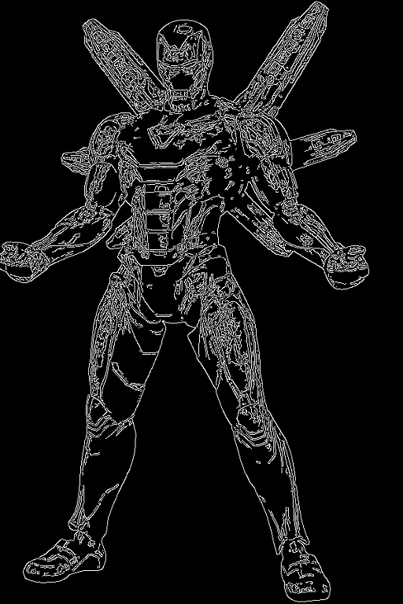
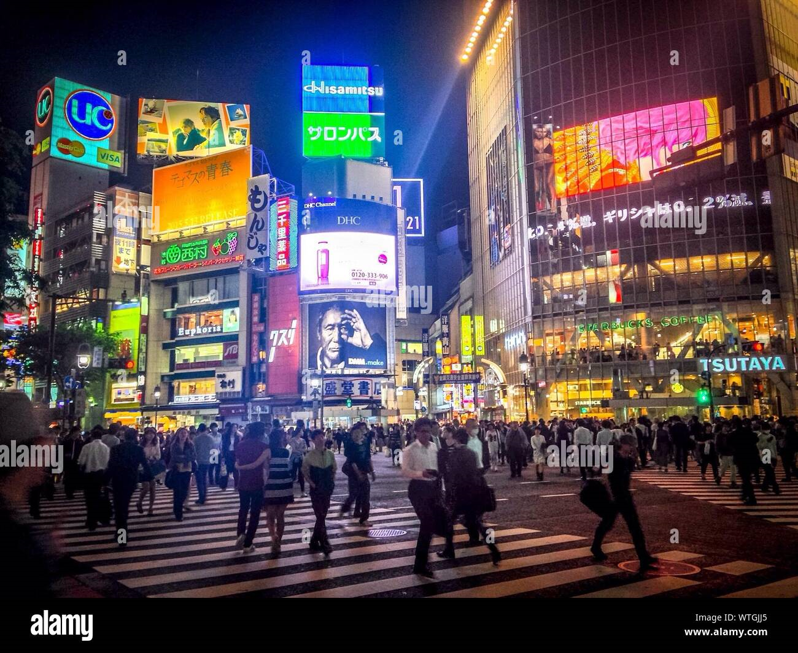
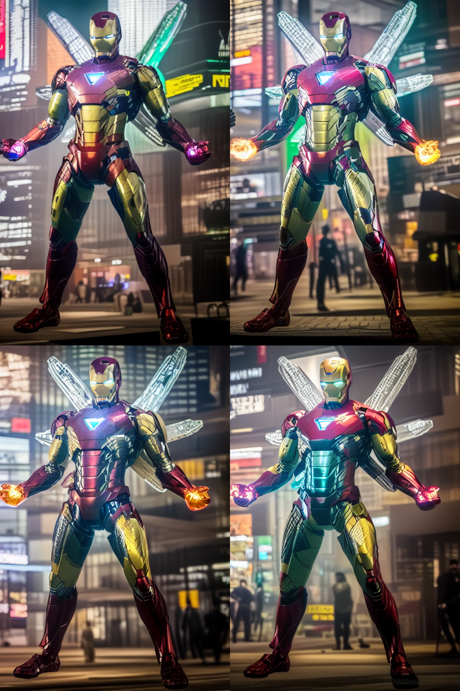
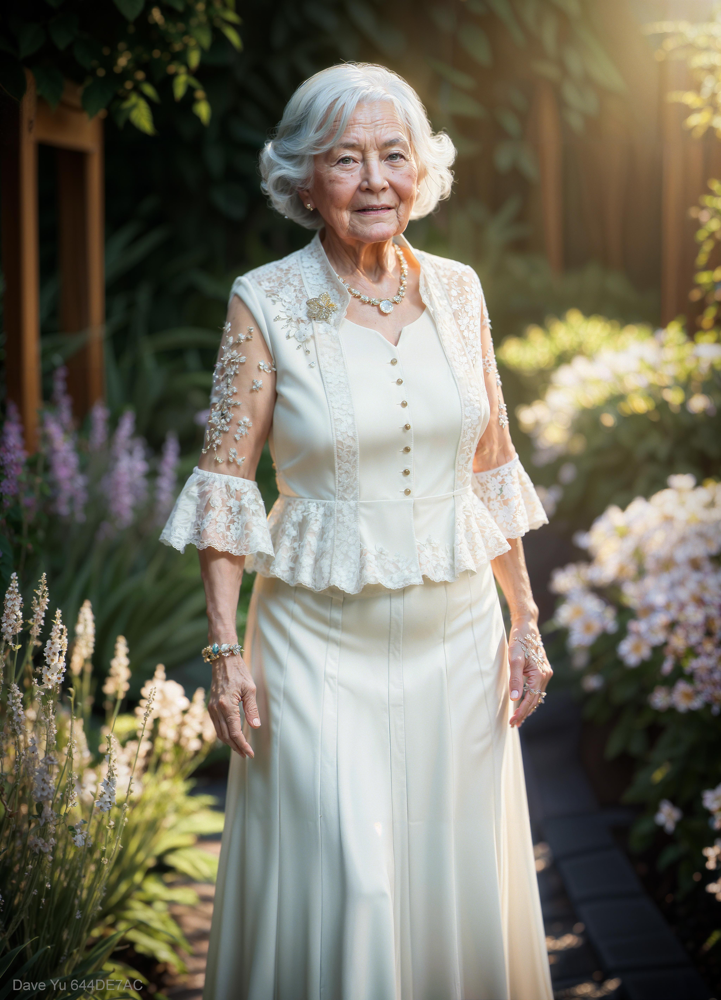
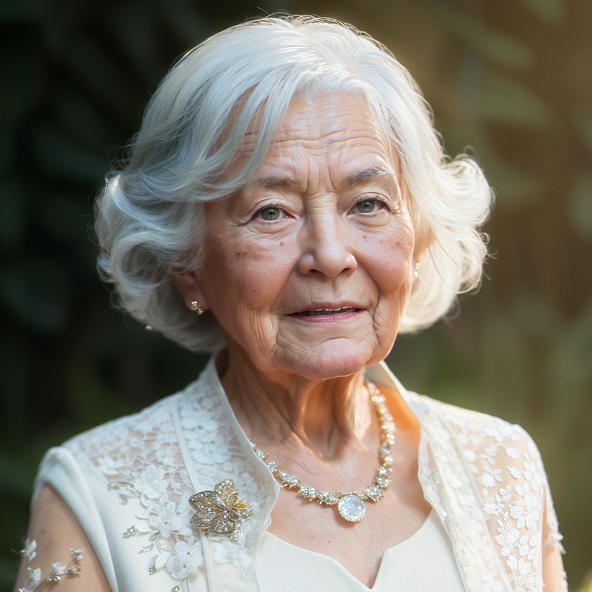
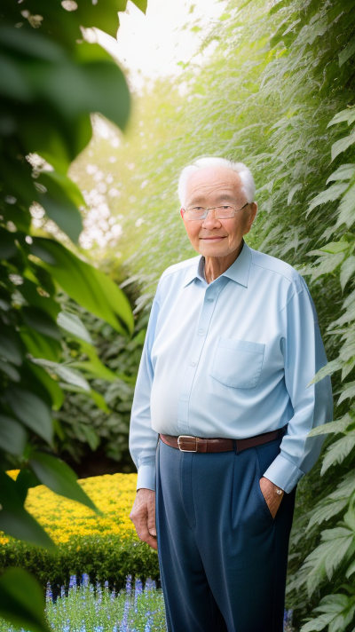
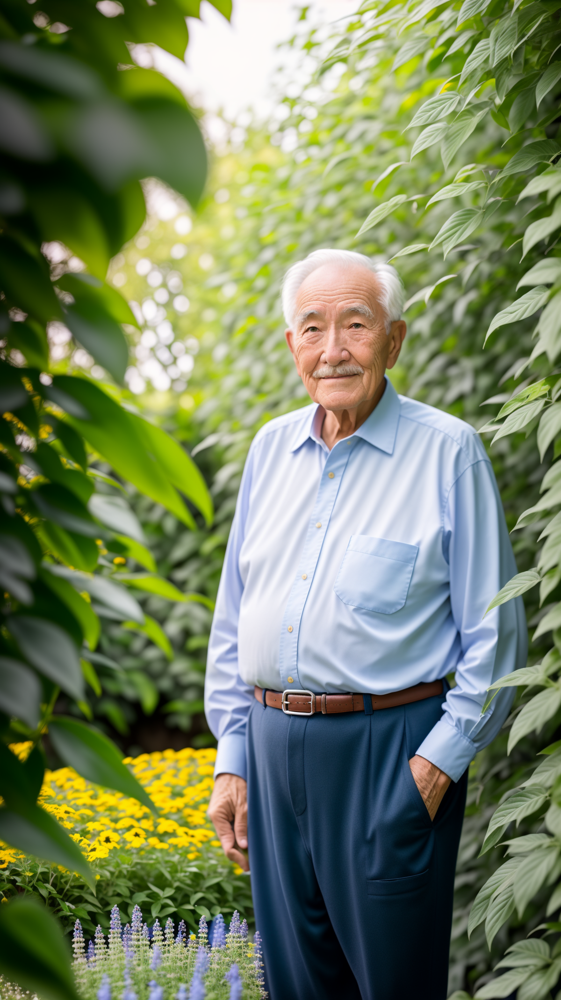
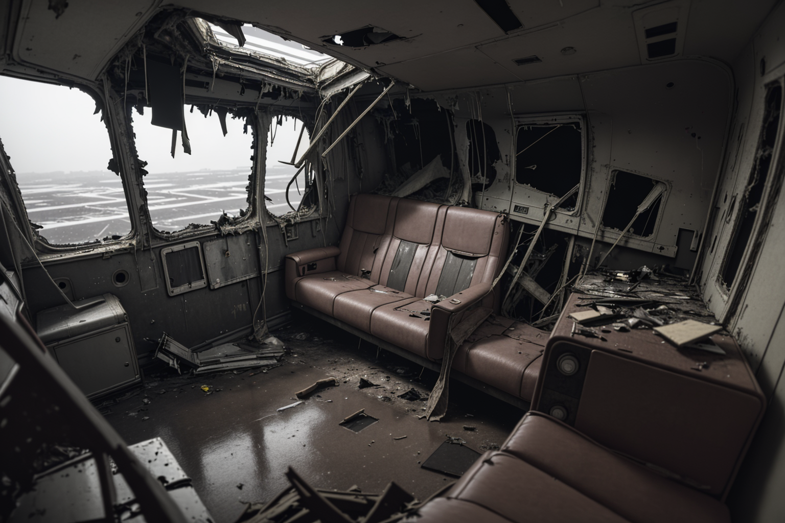

# ControlNet-v1-1-nightly 官方手册
## 简介
这是 ControlNet 1.1 的正式版本。ControlNet 1.1 与 ControlNet 1.0 具有完全相同的体系结构。

我们承诺在 ControlNet 1.5 之前我们不会更改神经网络架构（至少，希望我们永远不会更改网络架构）。也许这是 ControlNet 1.1 中最好的消息。

ControlNet 1.1 包括所有以前的模型，具有改进的稳健性和结果质量。添加了几个新模型。

请注意，我们仍在努力将其 [更新为 A1111](https://github.com/Mikubill/sd-webui-controlnet/issues/736)。

在我们确保一切正常后，这个 repo 将被合并到 [ControlNet](https://github.com/lllyasviel/ControlNet) 。

请注意，我们现在正在积极编辑此页面。当 ControlNet 1.1 准备就绪时，此页面中的信息将更加详细和最终确定。

## 这个 Github Repo 不是 A1111 扩展
请不要将此 repo 的 URL 复制到您的 A1111 中。

如果你想在 A1111 中使用 ControlNet 1.1，你只需要安装 [https://github.com/Mikubill/sd-webui-controlnet](https://github.com/Mikubill/sd-webui-controlnet)，并且只需按照该页面中的说明进行操作即可。

该项目用于研究用途和学术实验。同样，不要将 `ControlNet-v1-1-nightly` 安装到 A1111 中。
## 如何在 A1111 中使用 ControlNet 1.1？
A1111 Beta 测试开始。

A1111插件是 [https://github.com/Mikubill/sd-webui-controlnet](https://github.com/Mikubill/sd-webui-controlnet)

请注意，如果您使用 A1111，则只需按照上述链接中的说明进行操作即可。（如果您使用 A1111，则可以忽略此页面中的所有安装步骤。）

对于不熟悉 A1111 的研究者： A1111 插件支持任意数量的 ControlNets、任意社区模型、任意 LoRAs、任意采样方式的任意组合！我们绝对应该尝试一下！

请注意，我们对 “Multi-ControlNet” 的官方支持仅限于 A1111。如果您想同时使用多个 ControlNet，请将 Automatic1111 与 [Multi-ControlNet](https://github.com/Mikubill/sd-webui-controlnet#Multi-ControlNet) 一起使用。ControlNet 项目完美支持组合多个 ControlNet，并且所有生产就绪的 ControlNet 都经过了与多个 ControlNet 组合的广泛测试。
## 型号规格
从 ControlNet 1.1 开始，我们开始使用标准 ControlNet 命名规则 (SCNNRs) 来命名所有模型。我们希望这个命名规则能够提升用户体验。

ControlNet 1.1 包括 14 个模型（11 个生产就绪模型和 3 个实验模型）：

	control_v11p_sd15_canny
	control_v11p_sd15_mlsd
	control_v11f1p_sd15_depth
	control_v11p_sd15_normalbae
	control_v11p_sd15_seg
	control_v11p_sd15_inpaint
	control_v11p_sd15_lineart
	control_v11p_sd15s2_lineart_anime
	control_v11p_sd15_openpose
	control_v11p_sd15_scribble
	control_v11p_sd15_softedge
	control_v11e_sd15_shuffle
	control_v11e_sd15_ip2p
	control_v11f1e_sd15_tile
可以从的 [HuggingFace 模型页面](https://huggingface.co/lllyasviel/ControlNet-v1-1/tree/main)下载所有这些模型。所有这些模型都应该放在`models` 文件夹中。

您需要下载 Stable Diffusion 1.5 模型 [v1-5-pruned.ckpt](https://huggingface.co/runwayml/stable-diffusion-v1-5/tree/main) 并将其放在 `models`文件夹中。

我们的 python 代码将自动下载其他注释器模型，如 HED 和 OpenPose。不过，如果您想手动下载这些，您可以[从此](https://huggingface.co/lllyasviel/Annotators/tree/main)处下载所有其他注释器模型。所有这些模型都应该放在文件夹 `annotator/ckpts` 中。

安装：

	conda env create -f environment.yaml
	conda activate control-v11
请注意，如果您使用 8GB GPU，则需要在 `config.py` 中设置 `save_memory = True`。

## ControlNet 1.1 depth ***
用深度图控制 SD。

- 模型文件

		control_v11f1p_sd15_depth.pth
- 配置文件

		control_v11f1p_sd15_depth.yaml

训练数据：Midas depth（分辨率256/384/512）+ Leres Depth（分辨率256/384/512）+ Zoe Depth（分辨率256/384/512）。多分辨率的多深度图生成器作为数据增强。

可接受的预处理器：Depth_Midas、Depth_Leres、Depth_Zoe。该模型非常稳健，可以处理来自渲染引擎的真实深度图。

	python gradio_depth.py
随机种子 ``12345`（`a handsome man`）Non-cherry-picked 批次测试：

### depth 1.1 的更新
- 之前 cnet 1.0 的训练数据集存在几个问题，包括
	- 一小部分灰度人像被复制了数千次（！！），导致之前的模型有点可能生成灰度人像；
	- 某些图像质量低下、非常模糊或有明显的 JPEG 伪影；
	- 由于我们数据处理脚本的错误导致一小部分图片出现配对提示错误。新模型修复了训练数据集的所有问题，在很多情况下应该更合理。
- 新的深度模型是一个相对无偏的模型。它没有通过某种特定的深度估计方法以某种特定类型的深度进行训练。它不会过度适合一个预处理器。这意味着该模型将在不同的深度估计、不同的预处理器分辨率甚至 3D 引擎创建的真实深度下更好地工作。
- 一些合理的数据增强应用于训练，如随机左右翻转。
- 该模型从深度 1.0 恢复，它应该在深度 1.0 运行良好的所有情况下运行良好。如果没有，请打开图像问题，我们将查看您的案例。Depth 1.1 在 depth 1.0 的许多失败案例中效果很好。
- 如果您使用具有 384 预处理器分辨率的 Midas 深度（webui 插件中的“深度”），则深度 1.0 和 1.1 之间的差异应该很小。但是，如果您尝试其他预处理器分辨率或其他预处理器（如 leres 和 zoe），深度 1.1 预计会比 1.0 好一点。

## ControlNet 1.1 normalbae  ***
使用法线贴图控制 SD。

- 模型文件
	- control_v11p_sd15_normalbae.pth
- 配置文件
	- control_v11p_sd15_normalbae.yaml

训练数据：[Bae](https://github.com/baegwangbin/surface_normal_uncertainty) 的法线图估计方法。

可接受的预处理器：

- normal_bae

	只要法线贴图遵循 [ScanNet](http://www.scan-net.org/) 的协议，该模型就可以接受来自渲染引擎的法线贴图。也就是说，您的法线贴图的颜色应该看起来像[这张图片](https://raw.githubusercontent.com/baegwangbin/surface_normal_uncertainty/main/figs/readme_scannet.png)的第二列。

请注意，此方法比 ControlNet 1.0 中的 normal-from-midas 方法合理得多。以前的方法将被放弃。

	python gradio_normalbae.py
随机种子 12345（`a man made of flowers`）的Non-cherry-picked 批次测试：

随机种子 12345（`room`）的Non-cherry-picked 批次测试：

### Normal 1.1 的更新
- 这个 Normal 1.1 更合理，因为预处理器经过训练可以使用相对正确的协议（NYU-V2 的可视化方法）来估计法线贴图。这意味着法线 1.1 可以解释来自渲染引擎的真实法线贴图，只要颜色正确（蓝色在前面，红色在左边，绿色在上面）。
- 在我们的测试中，这个模型是健壮的，可以达到与深度模型相似的性能。在之前的 CNET 1.0 中，Normal 1.0 并不是很常用。但是这个 Normal 2.0 有了很大的改进，并且有可能被更频繁地使用。

## ControlNet 1.1 Canny ***
使用 Canny Maps 控制 SD。

- 模型文件
	- control_v11p_sd15_canny.pth
- 配置文件
	- control_v11p_sd15_canny.yaml

训练数据：具有随机阈值的 Canny。

可接受的预处理器：Canny。

我们修复了之前训练数据集中的几个问题。

	python gradio_canny.py
随机种子 12345（`dog in a room`）的Non-cherry-picked 批次测试：

### Canny 1.1 的更新：
- 之前 cnet 1.0 的训练数据集存在几个问题，包括
	- 一小部分灰度人像被复制了数千次（！！），导致之前的模型有点可能生成灰度人像；
	- 某些图像质量低下、非常模糊或有明显的 JPEG 伪影；
	- 由于我们数据处理脚本的错误导致一小部分图片出现配对提示错误。
	- 新模型修复了训练数据集的所有问题，在很多情况下应该更合理。
- 因为 Canny 模型是最重要的（也许是最常用的）ControlNet 模型之一，所以我们用一个基金在一台机器上用 8 块 Nvidia A100 80G batchsize 8×32=256 训练了 3 天，花费 72×30= 2160 美元（8 个 A100 80G，每小时 30 美元）。该模型从 Canny 1.0 恢复。
- 一些合理的数据增强应用于训练，如随机左右翻转。
- 尽管很难评估 ControlNet，但我们发现 Canny 1.1 比 Canny 1.0 更健壮，视觉质量也更高。

## ControlNet 1.1 MLSD ***
用 M-LSD 直线控制 SD。

- 模型文件
	- control_v11p_sd15_mlsd.pth
- 配置文件
	- control_v11p_sd15_mlsd.yaml

训练数据：M-LSD 线。

可接受的预处理器：MLSD。

我们修复了之前训练数据集中的几个问题。该模型从 ControlNet 1.0 恢复并使用 A100 80G 的 200 GPU 小时进行训练。

	python gradio_mlsd.py
随机种子 12345（“room”）的Non-cherry-picked 批次测试：

### MLSD 1.1 的更新：
- 之前 cnet 1.0 的训练数据集存在几个问题，包括
	- 一小部分灰度人像被复制了数千次（！！），导致之前的模型有点可能生成灰度人像；
	- 某些图像质量低下、非常模糊或有明显的 JPEG 伪影；
	- 由于我们数据处理脚本的错误导致一小部分图片出现配对提示错误。
	- 新模型修复了训练数据集的所有问题，在很多情况下应该更合理。
- 我们通过使用 MLSD 查找其中包含超过 16 条直线的图像，增加了 300K 个图像，从而扩大了训练数据集。
- 一些合理的数据增强应用于训练，如随机左右翻转。
- 从 MLSD 1.0 恢复并继续使用 A100 80G 的 200 GPU 小时进行训练。

## ControlNet 1.1 Scribble 涂鸦
用涂鸦控制 SD。

- 模型文件
	- control_v11p_sd15_scribble.pth
- 配置文件
	- control_v11p_sd15_scribble.yaml

训练数据：合成的涂鸦。

可接受的预处理器：

- 合成涂鸦（Scribble_HED、Scribble_PIDI 等）
- 或手绘涂鸦。

我们修复了之前训练数据集中的几个问题。该模型从 ControlNet 1.0 恢复并使用 A100 80G 的 200 GPU 小时进行训练。

	# 测试合成涂鸦
	python gradio_scribble.py
	# 交互式手绘涂鸦
	python gradio_interactive.py
随机种子 12345（`man in library`）的Non-cherry-picked 批次测试：

随机种子 12345 的Non-cherry-picked 批测试（交互式，`the beautiful landscape`）：

### Scribble 1.1 的更新：
- 之前 cnet 1.0 的训练数据集存在几个问题，包括
	- 一小部分灰度人像被复制了数千次（！！），导致之前的模型有点可能生成灰度人像；
	- 某些图像质量低下、非常模糊或有明显的 JPEG 伪影；
	- 由于我们数据处理脚本的错误导致一小部分图片出现配对提示错误。
	- 新模型修复了训练数据集的所有问题，在很多情况下应该更合理。
- 我们发现用户有时喜欢画很粗的涂鸦。因此，我们使用更积极的随机形态变换来合成涂鸦。即使涂鸦相对较粗（训练数据的最大宽度为 512 画布中的 24 像素宽度的涂鸦，但即使对于更宽的涂鸦，它似乎也能正常工作；最小宽度为 1 像素，该模型应该也能正常工作).
- 从 Scribble 1.0 恢复，继续使用 A100 80G 的 200 GPU 小时。

## ControlNet 1.1 softedge 软边缘
使用软边控制 SD。

- 模型文件
	- control_v11p_sd15_softedge.pth
- 配置文件
	- control_v11p_sd15_softedge.yaml

训练数据：SoftEdge_PIDI、SoftEdge_PIDI_safe、SoftEdge_HED、SoftEdge_HED_safe。

可接受的预处理器：SoftEdge_PIDI、SoftEdge_PIDI_safe、SoftEdge_HED、SoftEdge_HED_safe。

与以前的模型相比，该模型有了显着改进。所有用户应尽快更新。

ControlNet 1.1 中的新功能：现在我们添加了一种名为“SoftEdge_safe”的新型软边缘。这是因为 HED 或 PIDI 倾向于在软估计中隐藏原始图像的损坏灰度版本，而这种隐藏模式会分散 ControlNet 的注意力，从而导致不良结果。解决方案是使用预处理将边缘图量化为多个级别，以便完全删除隐藏的模式。实现在 [annotator/util.py 的第 78 行](https://github.com/lllyasviel/ControlNet-v1-1-nightly/blob/4c9560ebe7679daac53a0599a11b9b7cd984ac55/annotator/util.py#L78)。

性能可以大致记为

- 鲁棒性

		SoftEdge_PIDI_safe > SoftEdge_HED_safe >> SoftEdge_PIDI > SoftEdge_HED
- 最高结果质量

		SoftEdge_HED > SoftEdge_PIDI > SoftEdge_HED_safe > SoftEdge_PIDI_safe

考虑到权衡，我们建议默认使用 SoftEdge_PIDI。在大多数情况下，它工作得很好。

	python gradio_softedge.py
随机种子12345（`a handsome man`）Non-cherry-picked批次测试：

### Soft Edge 1.1 的更新：
- Soft Edge 1.1 在以前的 ControlNet 中称为 HED 1.0。
- 之前 cnet 1.0 的训练数据集存在几个问题，包括
	- 一小部分灰度人像被复制了数千次（！！），导致之前的模型有点可能生成灰度人像；
	- 某些图像质量低下、非常模糊或有明显的 JPEG 伪影；
	- 由于我们数据处理脚本的错误导致一小部分图片出现配对提示错误。
	- 新模型修复了训练数据集的所有问题，在很多情况下应该更合理。
- Soft Edge 1.1 明显（几乎 100% 的情况下）优于 HED 1.0。这主要是因为 HED 或 PIDI 估计器倾向于将损坏的原始图像的灰度版本隐藏在软边缘图中，而之前的模型 HED 1.0 过度拟合以恢复隐藏的损坏图像而不是执行边界感知扩散。Soft Edge 1.1 的训练使用了 75% 的“安全”过滤来去除此类隐藏的损坏灰度图像内部控制图。这使得 Soft Edge 1.1 非常强大。在实际测试中，Soft Edge 1.1 与深度模型一样可用，并且有可能被更频繁地使用。

## ControlNet 1.1 Segmentation 分段
用语义分割控 SD。

- 模型文件
	- control_v11p_sd15_seg.pth
- 配置文件
	- control_v11p_sd15_seg.yaml

训练数据：COCO + ADE20K。

可接受的预处理器：Seg_OFADE20K (Oneformer ADE20K)、Seg_OFCOCO (Oneformer COCO)、Seg_UFADE20K (Uniformer ADE20K)，或手动创建的掩码。

现在该模型可以接收 ADE20K 或 COCO 两种类型的注释。我们发现识别分段协议对于 ControlNet 编码器来说是微不足道的，并且训练多个分段协议的模型可以带来更好的性能。

	python gradio_seg.py
使用随机种子 12345（ADE20k 协议，“house”）的Non-cherry-picked 批次测试：

使用随机种子 12345 的Non-cherry-picked 批次测试（COCO 协议，“house”）：

### 分段 1.1 的更新：
- 支持 COCO 协议。之前的 Segmentation 1.0 支持大约 150 种颜色，但是 Segmentation 1.1 支持 coco 另外182种颜色。
- 从分段 1.0 恢复。所有以前的输入应该仍然有效。

## ControlNet 1.1 Openpose 姿势
使用 Openpose 控制 SD。

- 模型文件
	- control_v11p_sd15_openpose.pth
- 配置文件
	- control_v11p_sd15_openpose.yaml

该模型经过训练，可以接受以下组合：

- Openpose body
	- 身体姿势 
- Openpose hand
	- 手姿势 
- Openpose face
	- 脸姿势 
- Openpose body + Openpose hand
	- 身体和手姿势 
- Openpose body + Openpose face
	- 身体和脸姿势 
- Openpose hand + Openpose face
	- 手和脸姿势 
- Openpose body + Openpose hand + Openpose face
	- 全部姿势 

然而，提供所有这些组合太复杂了。我们建议只为用户提供两种选择：

- `Openpose` = Openpose body
	- 身体姿势 
- `Openpose Full` = Openpose body + Openpose hand + Openpose face
	- 全部姿势 

您可以尝试演示：

	python gradio_openpose.py
随机种子 12345（`man in suit`）的Non-cherry-picked 批次测试：

Non-cherry-picked batch test with random seed 12345（野外多人，`handsome boys in the party`）：

### Openpose 1.1 的更新：

- 这个模型的改进主要是基于我们对 OpenPose 的改进实现。我们仔细回顾了 pytorch 的 OpenPose 和 CMU 的 c++ openpose 的区别。现在处理器应该更准确，尤其是手。处理器的改进导致了 Openpose 1.1 的改进。
- 支持更多输入（手和脸）。
- 之前 cnet 1.0 的训练数据集存在几个问题，包括
	- 一小部分灰度人像被复制了数千次（！！），导致之前的模型有点可能生成灰度人像；
	- 某些图像质量低下、非常模糊或有明显的 JPEG 伪影；
	- 由于我们数据处理脚本的错误导致一小部分图片出现配对提示错误。
	- 新模型修复了训练数据集的所有问题，在很多情况下应该更合理。

## ControlNet 1.1 Lineart线稿
用线稿控制 SD。

- 模型文件
	- control_v11p_sd15_lineart.pth
- 配置文件
	- control_v11p_sd15_lineart.yaml

该模型是在 `awacke1/Image-to-Line-Drawings`  上训练的。预处理器可以从图像（`Lineart` 和 `Lineart_Coarse`）生成详细或粗略的线稿。该模型经过足够的数据增强训练，可以接收手动绘制的线稿。

	python gradio_lineart.py
随机种子 12345 的Non-cherry-picked 批次测试（详细的艺术线条提取器，`bag`）：

随机种子 12345 的Non-cherry-picked 批次测试（粗线条提取器，`Michael Jackson's concert`）：

使用随机种子 12345 的Non-cherry-picked 批次测试（使用手动绘制的线稿，`wolf `）：

## ControlNet 1.1 Anime Lineart 动漫线稿
用动漫艺术线条控制 SD。

- 模型文件
	- control_v11p_sd15s2_lineart_anime.pth
- 配置文件
	- control_v11p_sd15s2_lineart_anime.yaml

培训数据和实施细节：（已删除说明）。

该模型可以将真实的动漫线条图或提取的线条图作为输入。

一些重要的通知：

- 您需要一个文件 `anything-v3-full.safetensors` 来运行演示。我们不会提供文件。请自行在 Internet 上查找该文件。
- 该模型使用 3x token 长度和 clip skip 2 进行训练。
- 这是一个长提示模型。除非您使用 LoRA，否则长提示的结果会更好。
- 此型号不支持猜测模式。

演示：

	python gradio_lineart_anime.py
Non-cherry-picked batch test with random seed 12345 (`1girl, in classroom, skirt, uniform, red hair, bag, green eyes`):

随机种子12345Non-cherry-picked批次测试（`1girl，saber，at night，sword，green eyes，golden hair，stocking`）：

Non-cherry-picked batch test with random seed 12345（提取线图，`1girl, Castle, silver hair, dress, Gemstone, cinematic lighting, mechanical hand, 4k, 8k, extremely detailed, Gothic, green eye`）：

## ControlNet 1.1 Shuffle洗牌
通过内容随机播放控制 SD。

- 模型文件
	- control_v11e_sd15_shuffle.pth
- 配置文件
	- control_v11e_sd15_shuffle.yaml

演示：

	python gradio_shuffle.py
该模型经过训练以重组图像。[我们使用随机流来打乱图像并控制稳定扩散来重组图像](https://github.com/lllyasviel/ControlNet-v1-1-nightly/blob/main/github_docs/annotator.md#content-reshuffle)。

随机种子 12345（“hong kong”）的 Non-cherry-picked 批次测试：

在右侧的 6 张图像中，左上角的图像是“打乱”的图像。其他都是输出。

事实上，由于 ControlNet 被训练来重组图像，我们甚至不需要打乱输入——有时我们可以只使用原始图像作为输入。

这样，这个 ControlNet 可以通过提示或者其他 ControlNet 的引导来改变图像风格。

请注意，此方法与 CLIP 视觉或其他一些模型无关。

这是一个纯 ControlNet。

随机种子 12345（`iron man`）的Non-cherry-picked 批次测试：

随机种子 12345（`spider man`）的Non-cherry-picked 批次测试：

## ControlNets 组合使用（仅限 A1111）
- 源图像（未使用）：

	
- Canny 图像（输入）：

	
- Shuffle 图像（输入）：

	
- 输出：

	

（来自：[Mikubill/sd-webui-controlnet#736](https://github.com/Mikubill/sd-webui-controlnet/issues/736#issuecomment-1509986321)（评论））

如果您实施自己的推理，则很重要：

请注意，此 ControlNet 需要在 ControlNet 编码器输出和 SD Unet 层之间添加全局平均池

	x = torch.mean(x, dim=(2, 3), keepdim=True)
并且 ControlNet 必须仅放在 cfg 规模的条件侧。我们建议使用 yaml 文件中的

	global_average_pooling
项来控制此类行为。经过最近的一些研究/实验，我们计划在未来支持更多类型的程式化方法。

## ControlNet 1.1 Instruct Pix2Pix 指导 
使用 Instruct Pix2Pix 控制 SD。

- 模型文件
	- control_v11e_sd15_ip2p.pth
- 配置文件
	- control_v11e_sd15_ip2p.yaml

演示：

	python gradio_ip2p.py
这是一个在 [Instruct Pix2Pix 数据集](https://github.com/timothybrooks/instruct-pix2pix)上训练的控制网络。

不同于官方的 Instruct Pix2Pix，这个模型是用50%的指令提示和50%的描述提示来训练的。例如，`a cute boy` 是描述提示，而 `make the boy cute` 是指令提示。

因为这是一个 ControlNet，所以你不需要为原来的 IP2P 的 double cfg tuning 而烦恼。并且该模型可以应用于任何基础模型。

此外，似乎 `make it into X` 之类的指令比 `make Y into X` 更有效。

随机种子 12345 的Non-cherry-picked 批次测试（`make it on fire`）：

使用随机种子 12345（`make it winter`）的 Non-cherry-picked 批次测试：

我们将此模型标记为 `experimental `，因为它有时需要挑选。例如，这是使用随机种子 12345（`make he iron man`）的Non-cherry-picked 批次测试：

## ControlNet 1.1 Inpaint修复
使用 Inpaint  控制 SD。

- 模型文件
	- control_v11p_sd15_inpaint.pth
- 配置文件
	- control_v11p_sd15_inpaint.yaml

演示：

	python gradio_inpaint.py
一些注意事项：

- 这个修复 ControlNet 使用 50% 的随机掩码和 50% 的随机光流遮挡掩码进行训练。这意味着该模型不仅可以支持修复应用程序，还可以处理视频光流扭曲。也许我们将来会提供一些示例（取决于我们的工作量）。
- 我们更新了渐变 (2023/5/11)，以便主 ControlNet 存储库中的独立渐变代码也不会更改未屏蔽区域。自动 1111 用户不受影响。

随机种子12345（`a handsome man`）Non-cherry-picked 批次测试：

另请参阅在自动 1111 中[使用 ControlNet Inpaint的指南](https://github.com/Mikubill/sd-webui-controlnet/discussions/1143)。

## ControlNet 1.1 Tile 磁贴
2023 年 4 月 25 日更新：之前未完成的瓷砖模型现已完成。新名称是 `control_v11f1e_sd15_tile`。“f1e”表示第一个错误修复（“f1”），实验性（“e”）。删除了之前的 `control_v11u_sd15_tile` 。如果您的型号名称是“v11u”，请更新。

用 Tile 控制 SD。

- 模型文件
	- control_v11f1e_sd15_tile.pth
- 配置文件
	- control_v11f1e_sd15_tile.yaml

演示：

	python gradio_tile.py
该模型可以以多种方式使用。总的来说，该模型有两种行为：

- 忽略图像中的细节并生成新的细节。
- 如果局部瓦片语义和提示不匹配，则忽略全局提示，并根据局部上下文引导扩散。

因为该模型可以生成新的细节并忽略现有的图像细节，所以我们可以使用该模型去除不良细节并添加细化的细节。例如，消除由图像大小调整引起的模糊。

下面是 8 倍超分辨率的示例。这是一个 64x64 的狗图像。

随机种子 12345（`dog on grassland`）的 Non-cherry-picked 批次测试：

请注意，此模型不是超分辨率模型。它忽略图像中的细节并生成新的细节。这意味着您可以使用它来修复图像中的不良细节。

例如，下面是一张被 `Real-ESRGAN` 损坏的狗图像。这是一个典型的例子，当源上下文太小时，超分辨率方法有时无法放大图像。

随机种子 12345（`dog on grassland`）的 Non-cherry-picked 批次测试：

如果你的图像已经有很好的细节，你仍然可以使用这个模型来替换图像细节。请注意，Stable Diffusion 的 I2I 可以实现类似的效果，但此模型使您更容易维护整体结构并且即使去噪强度为 1.0 也仅更改细节。

使用随机种子 12345（`Silver Armor`）的Non-cherry-picked 批次测试：

越来越多的人开始考虑采用不同的方法在拼贴处进行漫射，以便图像可以非常大（4k 或 8k）。

问题是，在 SD 中，您的提示总是会影响每个板块。

比如你的提示是 `a beautiful girl`，你把一张图片分成 4×4=16 个 block，每个 block 做 diffusion，那么你得到的是16个 `beautiful girls`，而不是`a beautiful girl`。这是一个众所周知的问题。

现在人们的解决办法是使用一些无意义的提示，比如 `"clear, clear, super clear` 来 diffusion 块。但是你可以预料，如果去污强度高，结果会很糟糕。而且由于提示很糟糕，所以内容非常随机。

ControlNet Tile 可以解决这个问题。对于给定的图块，它识别图块内部的内容并增加识别语义的影响，如果内容不匹配，它还会减少全局提示的影响。

随机种子12345（`a handsome man`）Non-cherry-picked 批次测试：

可以看到提示是 `a handsome man`，但是模型并没有在那棵树叶上画 `a handsome man` 。相反，它会相应地识别树叶涂料。

通过这种方式，ControlNet 能够更改任何稳定扩散模型的行为以在分块中执行扩散。

### ControlNet Tile 图库
注意：我们对平铺图像放大的官方支持仅限 A1111。此 repo 中的 gradio 示例不包括平铺放大脚本。请使用 A1111 扩展来执行平铺放大（使用其他平铺脚本，如 `Ultimate SD Upscale` 或 `Tiled Diffusion/VAE`）。

- 来自 [Mikubill/sd-webui-controlnet#1142](https://github.com/Mikubill/sd-webui-controlnet/discussions/1142#discussioncomment-5788601)（评论）
	- （输出，单击图像查看全分辨率）
	
		
	- （放大输出）
		- 
		- 
		- 
- 来自 [Mikubill/sd-webui-controlnet#1142](https://github.com/Mikubill/sd-webui-controlnet/discussions/1142#discussioncomment-5788617)（评论）
	- （输入）
	
		
	- （输出，单击图像查看全分辨率）
	
		
- 来自：[#50](https://github.com/lllyasviel/ControlNet-v1-1-nightly/issues/50#issuecomment-1541914890)（评论）
	- （输入）

		
	- （输出，单击图像查看完整分辨率，请注意，此示例极具挑战性）

		
- 来自 [Mikubill/sd-webui-controlnet#1142](https://github.com/Mikubill/sd-webui-controlnet/discussions/1142#discussioncomment-5796326)（评论）：
- （前）

	
- （之后，单击图像查看完整分辨率）

	

与即将推出的 Midjourney V5/V5.1 的比较。

## 注释您自己的数据
我们提供简单的 python 脚本来处理图像。

[请在此处查看渐变示例](https://github.com/lllyasviel/ControlNet-v1-1-nightly/blob/main/github_docs/annotator.md)。

## 参考
[ControlNet 1.1](https://github.com/lllyasviel/ControlNet-v1-1-nightly#model-specification)