# SD 特征
这是 Stable Diffusion web UI 的功能展示页面。
## 1 SD2 变异模型(SD2 Variation Models)
[PR](https://github.com/AUTOMATIC1111/stable-diffusion-webui/pull/8958) ([更多信息](https://github.com/Stability-AI/stablediffusion/blob/main/doc/UNCLIP.MD))

支持用于生成图像变化的 [stable-diffusion-2-1-unclip](https://huggingface.co/stabilityai/stable-diffusion-2-1-unclip) 模型。

它的工作方式与当前对 SD2.0 深度模型的支持相同。从 img2img 选项卡运行它，它从输入图像（在本例中为 CLIP 或 OpenCLIP 嵌入）中提取信息并将这些信息输入到除了文本提示之外的模型。

通常，您会将去噪强度设置为 1.0 来执行此操作，因为您实际上不希望正常的 img2img 行为对生成的图像产生任何影响。

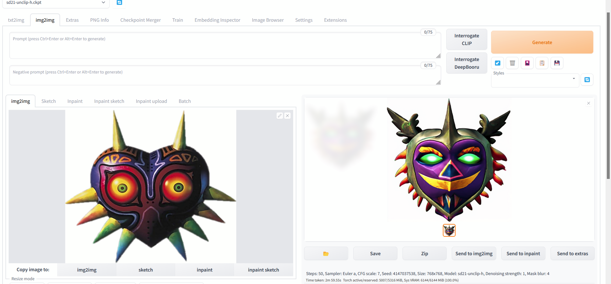

## 2 指导像素2像素(InstructPix2Pix)
- [Website](https://www.timothybrooks.com/instruct-pix2pix) 
- [Checkpoint](http://instruct-pix2pix.eecs.berkeley.edu/instruct-pix2pix-00-22000.ckpt)

img2img 选项卡完全支持检查点。不需要额外的操作。以前需要贡献者的扩展来生成图片：它不再需要，但应该仍然有效。大多数 img2img 实现都是由同一个人完成的。

要重现原始 repo 的结果，请使用 1.0 的去噪，Euler 采样器，并编辑配置以 `configs/instruct-pix2pix.yaml` 

    use_ema: true
    load_ema: true
代替：

    use_ema: false

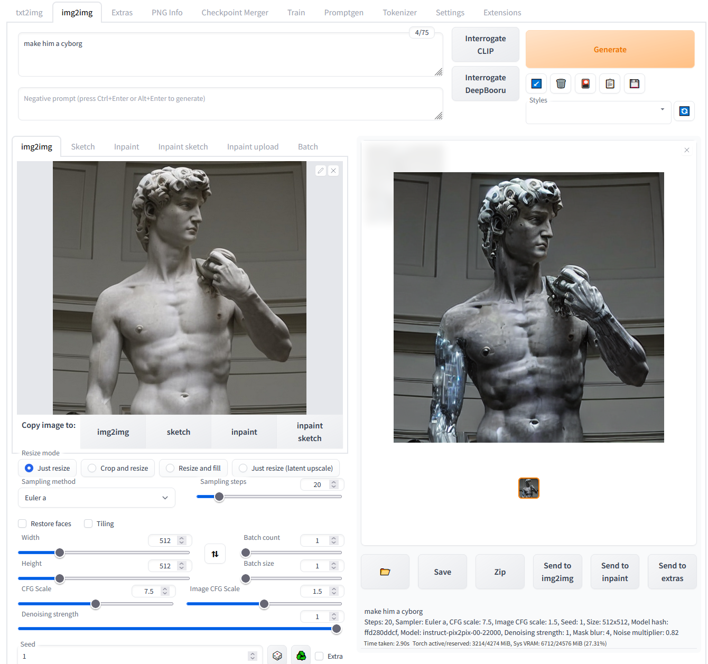

## 3 额外网络
一个带有卡片图片的按钮。它统一了多种额外的方式来将您的一代扩展到一个 UI 中。

在大生成按钮旁边找到它： 

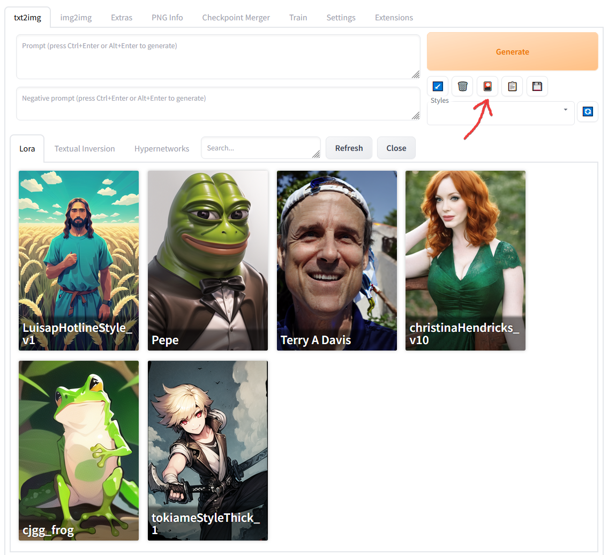

Extra networks 提供了一组卡片，每张卡片对应一个文件，其中包含您训练或从某处获取的模型的一部分。点击卡片添加模型提示，会影响生成的地方。

额外网络|目录|文件类型|如何在提示中使用
---|---|---|---
Textual Inversion	| `embeddings`|`*.pt`，images	| 嵌入的文件名
LoRA| `models/Lora` |`*.pt`,`*.safetensors` | `<lora:filename:multiplier>`
Hypernetworks|`models/hypernetworks`|`*.pt`,` *.ckpt`,`*.safetensors`|`<hypernet:filename:multiplier>`
### 3.1文本倒置 (Textual Inversion)
从 2021 年夏季开始，一种微调 CLIP 中令牌权重的方法，CLIP 是 Stable Diffusion 使用的语言模型。[作者的网站](https://textual-inversion.github.io/)。详细解释：[Textual-Inversion](https://github.com/AUTOMATIC1111/stable-diffusion-webui/wiki/Textual-Inversion)
### 3.2 LoRA
一种微调 CLIP 和 Unet 权重的方法，Stable Diffusion 使用的语言模型和实际图像降噪器，发表于 2021 年 [论文](https://arxiv.org/abs/2106.09685)。训练 LoRA 的一个好方法是使用 [kohya-ss](https://github.com/kohya-ss/sd-scripts)。

Web UI 内置了对 LoRA 的支持，但有一个由 kohya-ss 原始实现的[扩展](https://github.com/kohya-ss/sd-webui-additional-networks)。

当前，Web UI 不支持 Stable Diffusion 2.0+ 模型的 LoRA 网络。

LoRA 通过将以下文本放入任何位置来添加到提示中：`<lora:filename:multiplier>`

-  `filename` 

	是存储上带有 LoRA 的文件的名称，不包括扩展名
-  `multiplier` 

	是一个数字，通常从 0 到 1，可让您选择 LoRA 影响的强度输出。LoRA 不能添加到否定提示中。

将 `<lora:filename:multiplier>` LoRA 添加到提示中的文本  ，仅用于启用 LoRA，之后会从提示中删除，因此您不能像 `[<lora:one:1.0>|<lora:two:1.0>]` 那样对提示进行编辑。具有多个不同提示的批次将仅使用第一个提示中的 LoRA。

### 3.3 超级网络(Hypernetworks)
一种微调 CLIP 和 Unet 权重的方法，Stable Diffusion 使用的语言模型和实际图像降噪器，由我们的朋友  Novel AI  在 2022 年秋季慷慨捐赠给世界。工作方式与 LoRA 相同，除了共享某些层的权重。乘数可用于选择超网络对输出的影响程度。

将超网络添加到提示的相同规则适用于 LoRA `<hypernet:filename:multiplier>`。
## 4 另类扩散(Alt-Diffusion)
经过训练可以接受不同语言输入的模型。 [更多信息](https://arxiv.org/abs/2211.06679)。 [PR](https://github.com/AUTOMATIC1111/stable-diffusion-webui/pull/5238)。

- 从 huggingface [下载](https://huggingface.co/webui/AltDiffusion-m9/tree/main)检查点。单击向下箭头进行下载。
- 将文件放入 `models/Stable-Diffusion`

## 5 Stable Diffusion 2.0
1. 从 huggingface 下载你的检查点文件。单击向下箭头进行下载。
- 将文件放入 `models/Stable-Diffusion`
	- 768 (2.0) -（型号）
	- 768 (2.1) -（型号）
	- 512 (2.0) -（型号）

### 5.1 深度引导模型
深度引导模型仅适用于 img2img 选项卡。 [更多信息](https://github.com/Stability-AI/stablediffusion#depth-conditional-stable-diffusion)。[PR](https://github.com/AUTOMATIC1111/stable-diffusion-webui/pull/5542)

- 512 depth (2.0) - ([model+yaml](https://huggingface.co/webui/stable-diffusion-2-depth/tree/main)) - .safetensors
- 512 depth (2.0) - ([model](https://huggingface.co/stabilityai/stable-diffusion-2-depth/tree/main), [yaml](https://raw.githubusercontent.com/Stability-AI/stablediffusion/main/configs/stable-diffusion/v2-midas-inference.yaml))

### 5.2 修复模型 SD2
专为在 SD 2.0 512 基础上训练的修复模型而设计。

- 512 inpainting (2.0) - ([model+yaml](https://huggingface.co/webui/stable-diffusion-2-inpainting/tree/main)) - .safetensors

`inpainting_mask_weight` 或修复调理面膜强度也适用于此。

## 6 外涂、图像扩展、边缘扩展(Outpainting)
Outpainting 扩展了原始图像并修复了创建的空白区域。

例子：

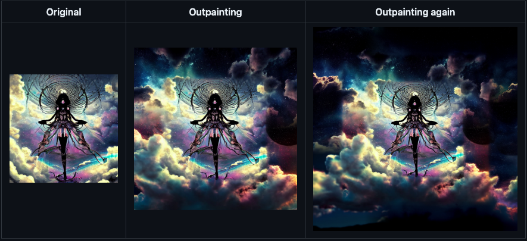

您可以在底部的 img2img 选项卡中找到该功能，位于脚本 -> Poor man's outpainting。

与正常的图像生成不同，

- Outpainting 似乎从大步数中获益良多
- 良好涂色的秘诀是与图片相匹配的良好提示
- 用于去噪(`denoising`)比例设置为最大
- CFG 的滑块可以设置大一点
- 使用 `Euler ancestral` 或 `DPM2 ancestral` 采样器的步数为 50 到 100。

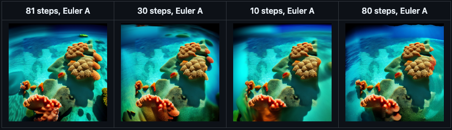
			
## 7 修复 (Inpainting)
在 img2img 选项卡中，在图像的一部分上绘制遮罩，该部分将被补漆。

修复选项：

- 在网络编辑器中自己绘制一个面具
- 在外部编辑器中删除部分图片并上传透明图片。
	- 任何稍微透明的区域都将成为蒙版的一部分。请注意，[某些编辑器](https://docs.krita.org/en/reference_manual/layers_and_masks/split_alpha.html#how-to-save-a-png-texture-and-keep-color-values-in-fully-transparent-areas)默认将完全透明的区域保存为黑色。
- 将模式（图片右下角）更改为“Upload mask”并为蒙版选择单独的黑白图像（白色=修复）。

### 7.1 修补模型
RunwayML 已经训练了一个专门为修复而设计的附加模型。这个模型接受额外的输入：没有噪声的初始图像加上蒙版并且似乎在工作上要好得多。

该模型的下载和额外信息位于： [https://github.com/runwayml/stable-diffusion#inpainting-with-stable-diffusion](https://github.com/runwayml/stable-diffusion#inpainting-with-stable-diffusion)

要使用该模型，您必须重命名检查点，使其文件名以 `inpainting.ckpt` 结尾，例如，`1.5-inpainting.ckpt`。

之后只需选择检查点，因为您通常会选择任何检查点，您就可以开始了。
### 7.2 屏蔽内容（Masked content）
屏蔽的内容字段决定了在修复之前将内容放入屏蔽区域。这并不代表最终输出，它只是查看中间过程发生了什么。

		
### 7.3 修复区域(Inpaint area)
通常，修复会将图像调整为 UI 中指定的目标分辨率。启用后 `Inpaint area: Only masked` ，仅调整遮罩区域的大小，并在处理后粘贴回原始图片。这使您可以处理大图片并以更大的分辨率渲染修复的对象。

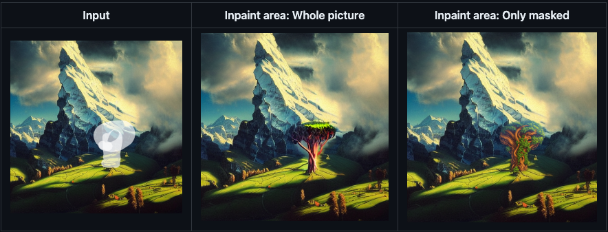	
### 7.4遮蔽模式(Masking mode)
屏蔽模式有两个选项：

- Inpaint masked - 遮罩下的区域被修复
- Inpaint not masked - 掩码下未更改，其他所有内容均已修复

### 7.5 阿尔法面具(Alpha mask)
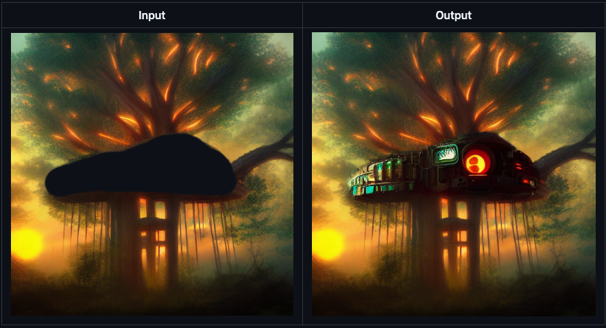		

### 7.6 彩绘(Color Sketch)
img2img 选项卡的基本着色工具。基于 Chromium 的浏览器支持滴管工具。 

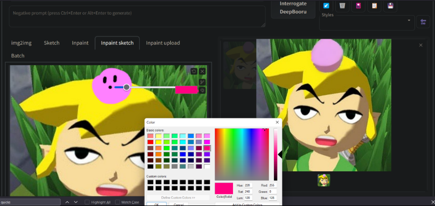	

这是在火狐上）

## 8 提示矩阵(Prompt matrix)
使用 `|` 字符分隔多个提示，系统将为它们的每个组合生成一个图像。例如，如果您使用

	a busy city street in a modern city | illustration | cinematic lighting
提示，则有四种可能的组合（始终保留提示的第一部分）：

- `a busy city street in a modern city`
- `a busy city street in a modern city, illustration`
- `a busy city street in a modern city, cinematic lighting`
- `a busy city street in a modern city, illustration, cinematic lighting`

将按此顺序生成四个图像，所有图像都具有相同的种子，每个图像都有相应的提示： 

	

您可以在底部的脚本找到该功能 -> Prompt matrix 。

## 9 SD upscale
使用 `RealESRGAN/ESRGAN` 的 upscale，然后遍历结果的图块，使用 img2img 改进它们。它还有一个选项，让您可以在外部程序中自己完成放大部分，只需使用 img2img 遍历图块。

原创想法：`https://github.com/jquesnelle/txt2imghd`。这是一个独立的实现。

要使用此功能，从脚本请选择 `SD upscale` （img2img 选项卡）。

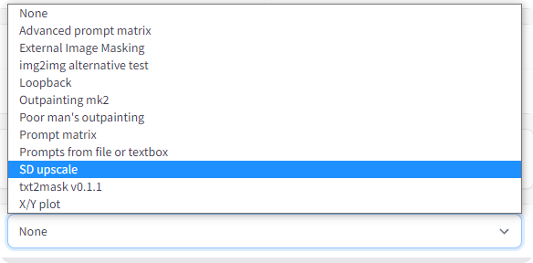	

输入图像将放大到原始宽度和高度的两倍并且 UI 的宽度和高度滑块指定各个图块的大小。由于重叠图块的大小可能非常重要：512x512 图像需要九个 512x512 的图块（因为重叠），但只需要四个 640x640 的图块。

升级的推荐参数：

- 采样方式：Euler a
- Denoising 强度：0.2，喜欢冒险可以上到 0.4

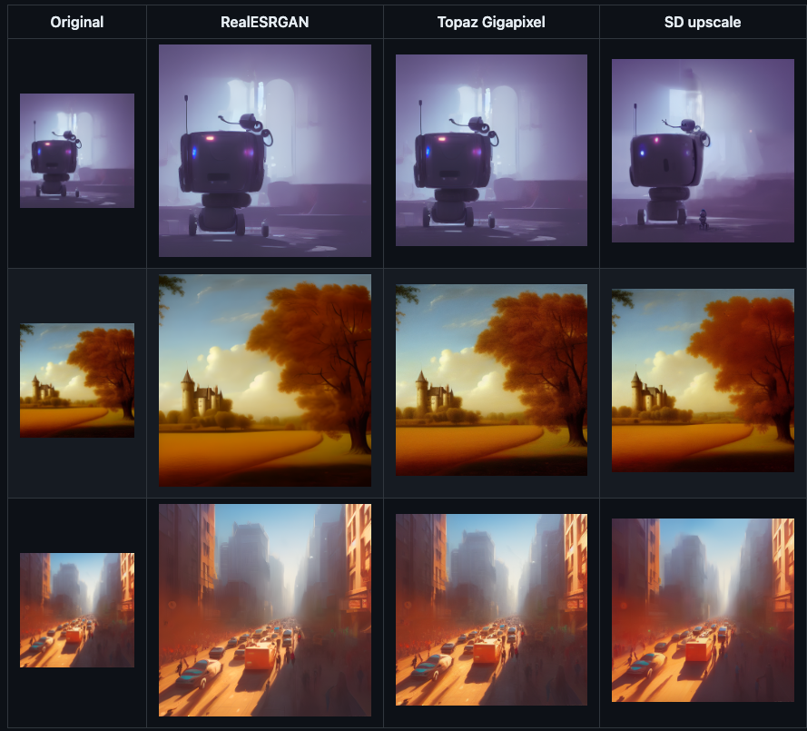	
			
## 10 无限咒语长度(Infinite prompt length) 找不到例子功能??
输入超过 Stable Diffusion 标准的 75 个标记会将咒语大小限制从 75 增加到 150。然后输入超过会进一步增加咒语大小。这是通过将咒语分成 75 个标记块，使用 CLIP 的 Transformers 神经网络独立处理每个标记，然后在输入 SD 的下一个组件 Unet 之前连接结果来完成的。

例如，一个有 120 个标记的咒语将被分成两个块：

- 第一个有 75 个
- 第二个有 45 个

两者都将被填充到 75 个标记并用开始/结束标记扩展到 77。通过 CLIP 传递这两个块后，我们将有两个形状为 `(1, 77, 768)` 的张量。将这些结果连接成`(1, 154, 768)`张量，然后毫无问题地传递给 Unet。

### 10.1 BREAK 关键字
添加 `BREAK` 关键字（必须大写）用填充字符填充当前块。在文本之后添加更多文本 `BREAK` 将开始一个新块。

## 11 注意/强调(Attention/emphasis)
在提示中使用 `()` 会增加模型对封闭词的注意力，并 `[]` 减少它。您可以组合多个修饰符：

	

备忘单：

- a `(word)` - 将关注度提高 `word` 1.1 倍
- a `((word))` - 将关注度提高 `word` 1.21 倍（= 1.1 * 1.1）
- a `[word]` - 将关注度降低 `word1.1` 倍
- a `(word:1.5)` - 将关注度提高 `word1.5` 倍
- a `(word:0.25)` - 注意力减少 `word` 4 倍 (= 1 / 0.25)
- a `\(word\)`-在提示中使用文字字符`()`

使用 `()`，可以像这样指定权重：`(text:1.4)`。如果未指定权重，则假定为 1.1。

- 指定权重仅适用于`()`
- 不适用于`[]`。

如果要 `()[]` 在提示中使用任何文字字符，请使用反斜杠对其进行转义：`anime_\(character\)`。

在 2022-09-29，添加了支持转义字符和数字权重的新实现。新实现的一个缺点是旧实现并不完美，有时会吃掉字符：

例如，“ `a (((farm))), daytime` ”，如果没有逗号，将变成“ `a farm daytime`”。

正确保留所有文本的新实现不共享此行为，这意味着您保存的种子可能会产生不同的图片。目前，设置中有一个选项可以使用旧的实现。

NAI 使用 SD 在 2022 年 9 月 29 日之前的实现，除了他们将 1.05 作为乘数并使用 `{}` 而不是 `()`. 所以转换适用：

- NAI的 `{word}` = SD的 `(word:1.05)`
- NAI的 `{{word}}` =SD的 `(word:1.1025)`
- NAI的 `[word]` = SD的 `(word:0.952)(0.952 = 1/1.05)`
- NAI的 `[[word]]` = SD的 `(word:0.907)(0.907 = 1/1.05/1.05)`

## 12 环回(Loopback)
在 img2img 中选择 `Loopback ` 脚本允许您自动将输出图像作为下一批的输入。相当于保存输出图像并用它替换输入图像。批次计数设置控制您获得的迭代次数。

通常在执行此操作时，您会自己选择许多图像中的一张用于下一次迭代，因此此功能的实用性可能值得怀疑，但我已经设法获得了一些我无法获得的非常好的输出。

示例：（精选结果）

	

来自 4chan 的匿名用户的原始图像。谢谢匿名用户。

## 13 X/Y/Z 图
创建具有不同参数的多个图像网格。X 和 Y 用作行和列，而 Z 网格用作批次维度。

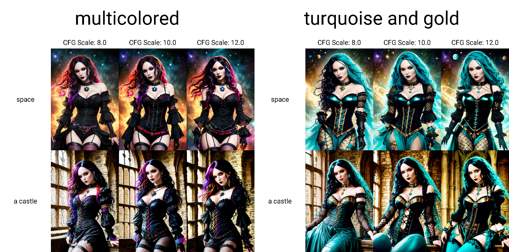	

使用 X 类型、Y 类型和 Z 类型字段选择哪些参数应由行、列和批次共享，并将这些参数以逗号分隔输入到 X/Y/Z 值字段中。

对于整数和浮点数，支持范围。例子：

- 简单范围：
	- `1-5` = 1, 2, 3, 4, 5
- 括号中增量的范围：
	- `1-5 (+2)`= 1, 3, 5
	- `10-5 (-3)`= 10, 7
	- `1-3 (+0.5)`= 1, 1.5, 2, 2.5, 3
- 方括号中包含计数的范围：
	- `1-10 [5]`= 1, 3, 5, 7, 10
	- `0.0-1.0 [6]`= 0.0、0.2、0.4、0.6、0.8、1.0

### 13.1 咒语  S/R
Prompt S/R 是 X/Y Plot 较难理解的操作模式之一。S/R 代表搜索/替换，这就是它的作用 

您输入一个单词或短语列表，它从列表中获取第一个并将其视为关键字，然后用列表中的其他条目替换该关键字的所有实例.

例如，使用咒语 `a man holding an apple, 8k clean` 和咒语 S/R `an apple, a watermelon, a gun` 你会得到三个提示：

- `a man holding an apple, 8k clean`
- `a man holding a watermelon, 8k clean`
- `a man holding a gun, 8k clean`

该列表使用与 CSV 文件中的一行相同的语法，因此如果您想在条目中包含逗号，您必须将文本放在引号中并确保引号和分隔逗号之间没有空格：

- `darkness, light, green, heat` 
	
	4 件商品 - `darkness, light, green,heat`
- `darkness, "light, green", heat` 

	错误 - 4 项 - `darkness, "light, green",heat`
- `darkness,"light, green",heat`
	
	正确 - 3 件商品 - `darkness, light, green,heat`

## 14 来自文件或文本框(命令行啊)的咒语
使用此脚本可以创建将按顺序执行的作业列表。

- 输入示例：

		--prompt "photo of sunset" 
		--prompt "photo of sunset" --negative_prompt "orange, pink, red, sea, water, lake" --width 1024 --height 768 --sampler_name "DPM++ 2M Karras" --steps 10 --batch_size 2 --cfg_scale 3 --seed 9
		--prompt "photo of winter mountains" --steps 7 --sampler_name "DDIM"
		--prompt "photo of winter mountains" --width 1024
- 示例输出：

	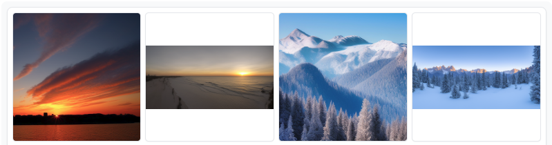	
- 支持以下参数：

	    "sd_model", "outpath_samples", "outpath_grids", "prompt_for_display", "prompt", "negative_prompt", "styles", "seed", "subseed_strength", "subseed", 
	    "seed_resize_from_h", "seed_resize_from_w", "sampler_index", "sampler_name", "batch_size", "n_iter", "steps", "cfg_scale", "width", "height", 
	    "restore_faces", "tiling", "do_not_save_samples", "do_not_save_grid"

## 15 调整大小模式(Resizeing)
在 img2img 模式下调整输入图像的大小有三个选项：

- `Just resize` 

	简单地将源图像调整为目标分辨率，导致不正确的纵横比
- `Crop and resize`

	裁剪和调整大小 - 调整源图像的大小以保持纵横比，使其占据整个目标分辨率，并裁剪突出的部分
- `Resize and fill`

	调整大小和填充 - 调整源图像的大小以保持纵横比，使其完全适合目标分辨率，并按源图像的行/列填充空白空间

例子： 

	

## 16 取样器方法选择
为 txt2img 挑出多种采样方式：

	
## 17 种子调整大小(Seed resize) 测试效果不佳
此功能允许您从不同分辨率的已知种子生成图像。通常，当您更改分辨率时，图像会完全改变，即使您保留所有其他参数（包括种子）也是如此。

	通过单击种子附近的 “Extra 额外” 复选框找到此功能。
通过调整种子大小为原始图像的分辨率，模型很可能会产生与原始图像非常相似的东西，即使分辨率不同。在下面的示

例中，最左边的图片是 512x512，其他图片是使用完全相同的参数但具有更大的垂直分辨率生成的。

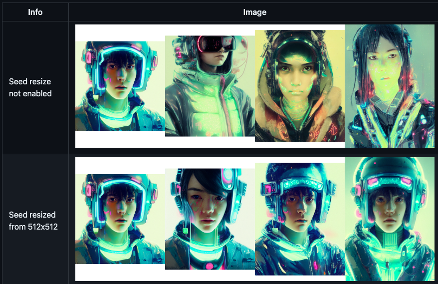	

Ancestral 采样器在这方面比其他采样器差一点。

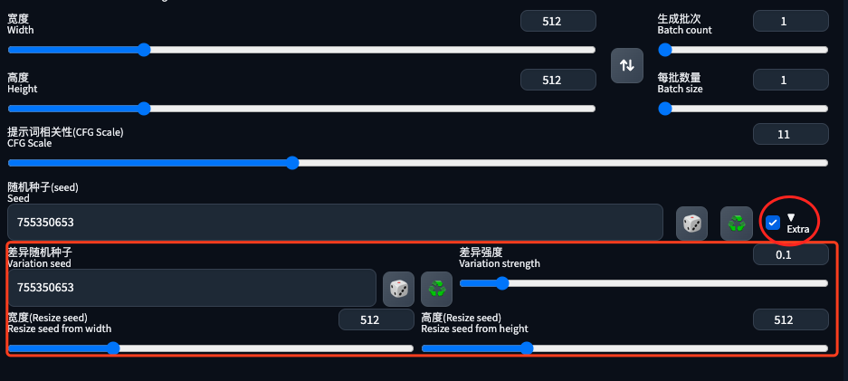	
### 17.1 变化
(`Variation strength`)变化强度滑块和变化种子(`Variation seed`)字段允许指定现有图片应更改多少以看起来像不同的图片。在最大强度下，您将获得带有变异种子的图片，至少 - 带有原始种子的图片（使用 ancestral 采样器时除外）。

	通过单击种子附近的 “Extra 额外” 复选框找到此功能。

	

## 18 样式(Styles)
按 `Save prompt as style` 按钮将当前提示写入 styles.csv，这是一个包含样式集合的文件。提示右侧的下拉框将允许您从以前保存的样式中选择任何样式，并自动将其附加到您的输入中。要删除样式，请从 styles.csv 中手动删除它并重新启动程序。

如果您在 `{prompt}` 样式中使用特殊字符串，它会将提示中当前的任何内容替换到该位置，而不是将样式附加到您的提示中。
## 19 否定提示(Negative prompt)
允许您使用另一个提示，提示模型在生成图片时应避免的事情。这是通过在采样过程中使用无条件条件的 `Negative-prompt` 而不是空字符串来实现的。

进阶解释：[Negative-prompt](https://github.com/AUTOMATIC1111/stable-diffusion-webui/wiki/Negative-prompt)

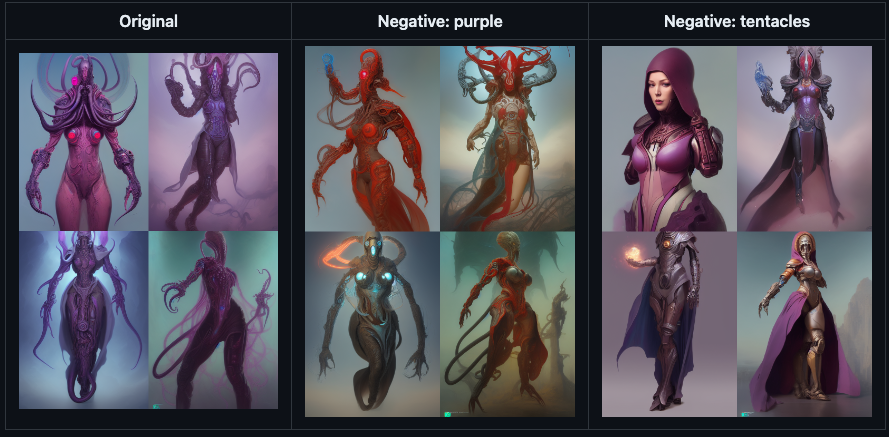	
		
## 20 CLIP 询问器（CLIP interrogator）
最初来自：[https://github.com/pharmapsychotic/clip-interrogator](https://github.com/pharmapsychotic/clip-interrogator)

CLIP 询问器允许您从图像中检索咒语。咒语不会让您重现准确的图像（有时它甚至不会很接近），但它可以是一个好的开始。

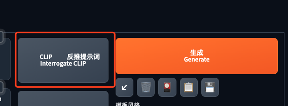	

第一次运行 `CLIP interrogator` 时，它需要下载几千兆字节的模型。

CLIP 询问器有两个部分：

- 一个是 BLIP 模型，它根据图片创建文本描述。
- 另一个是 CLIP 模型，它会从列表中挑选出与图片相关的几行。

默认情况下，只有一个列表 - 艺术家列表（来自`artists.csv`）。您可以通过执行以下操作添加更多列表：

- 在 webui 同一个地方创建 `interrogate` 目录
- 将文本文件放入其中，每行都有相关描述

有关要使用的文本文件的示例，请参阅 [https://github.com/pharmapsychotic/clip-interrogator/tree/main/clip_interrogator/data](https://github.com/pharmapsychotic/clip-interrogator/tree/main/clip_interrogator/data)。事实上，您可以直接从那里获取文件并使用它们 - 只需跳过 `artists.txt`，因为您已经有了一个艺术家列表 `artists.csv`（或者也使用它，谁会阻止您）。每个文件在最终描述中添加一行文本。如果您添加 `.top3`。到文件名，例如，`flavors.top3.txt` 该文件中最相关的三个行将被添加到提示中（其他数字也可以）。

有与此功能相关的设置：

- `Interrogate: keep models in VRAM` 

	不要在使用后从内存中卸载 Interrogate 模型。对于具有大量 VRAM 的用户。(基本建议关闭)
- `Interrogate: use artists from artists.csv`

	在询问从 `artists.csv` 添加艺术家。当您在目录中有艺术家列表时，禁用可能很有用
- `Interrogate: num_beams for BLIP`

	影响 BLIP 模型详细描述的参数（生成提示的第一部分）
- `Interrogate: minimum description length`

	BLIP 模型文本的最小长度
- `Interrogate: maximum descripton length`

	 BLIP 模型文本的最大长度
- `Interrogate: maximum number of lines in text file`

	询问器只会考虑文件中的这么多第一行。设置为 0，默认为 1500，大约是 4GB 视频卡可以处理的量。

## 21 咒语编辑
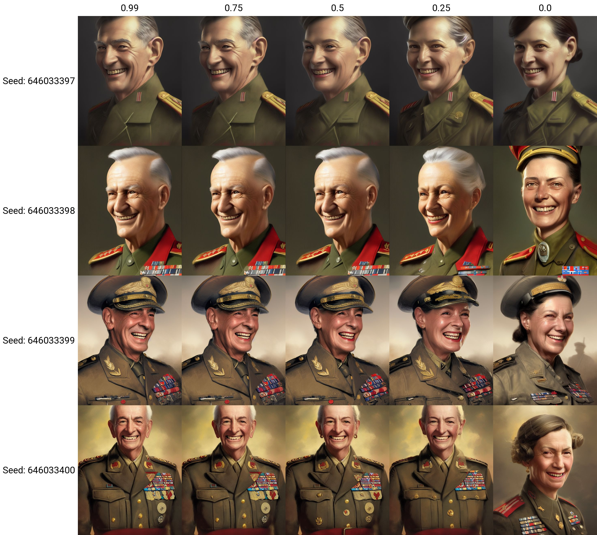	

咒语编辑允许您开始对一张图片进行采样，但在中间切换到其他图片。其基本语法是：

	[from:to:when]
其中 `from` 和 `to` 是任意文本，`when` 是一个数字，它定义了应该在采样周期中进行切换的时间。

- 越晚模型绘制 `to` 文本代替`from` 文本的能力越小。
- 如果 `when` 是一个介于 0 和 1 之间的数字，则它是进行切换之前的步数的一小部分。
- 如果它是大于零的整数，则它只是进行切换之前的步骤。

将一个咒语编辑嵌套在另一个提示编辑中确实有效。

此外：

- `[to:when]` 

	在固定数量的步骤 (`when`)后添将`to`加到咒语中
- `[from::when]`

	在固定数量的步骤 (`when`) 后从将  `from` 从咒语中删除 

例子： 

	`a [fantasy:cyberpunk:16] landscape`
	
- 开始时，模型将绘制 `a fantasy landscape`。
- 在第 16 步之后，它将切换到绘图 `a cyberpunk landscape`，从它停止的地方继续幻想。

这是一个包含多个编辑的更复杂的示例：

	fantasy landscape with a [mountain:lake:0.25] and [an oak:a christmas tree:0.75][ in foreground::0.6][ in background:0.25] [shoddy:masterful:0.5]
(采样器有 100 个步骤）

- 一开始，`fantasy landscape with a mountain and an oak in foreground shoddy`
- 在第 25 步之后，`fantasy landscape with a lake and an oak in foreground in background shoddy`
- 在第 50 步之后，`fantasy landscape with a lake and an oak in foreground in background masterful`
- 在第 60 步之后，`fantasy landscape with a lake and an oak in background masterful`
- 在第 75 步之后，`fantasy landscape with a lake and a christmas tree in background masterful`

顶部的图片是根据咒语制作的：

	Official portrait of a smiling world war ii general, [male:female:0.99], cheerful, happy, detailed face, 20th century, highly detailed, cinematic lighting, digital art painting by Greg Rutkowski's

`微笑的第二次世界大战将军的官方肖像，[男:女:0.99]，开朗，快乐，详细的脸，20 世纪，高度详细，电影照明，Greg Rutkowski 的数字艺术绘画`

数字 0.99 将替换为您在图像的列标签中看到的任何内容。

图片最后一列是 `[male:female:0.0]`，这本质上是让模型从头开始画女性，而不是从男性将军开始，这就是为什么它看起来与其他人如此不同。

### 21.1  交替词 Alternating Words
每隔一步交换的方便语法。

	[cow|horse] in a field
在第 1 步中，提示是“奶牛”。第 2 步是“马”。第 3 步是“奶牛”，依此类推。

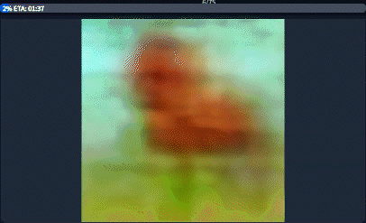

请参阅下面的更高级示例。在第 8 步，链条从“人”循环回到“牛”。

	[cow|cow|horse|man|siberian tiger|ox|man] in a field
Doggettx 在这篇 myspace.com [帖子](https://www.reddit.com/r/StableDiffusion/comments/xas2os/simple_prompt2prompt_implementation_with_prompt/) 中首先实现了咒语编辑。

## 22 高清修复 Hires. fix
一个方便的选项，可以以较低的分辨率部分渲染您的图像，放大它，然后以高分辨率添加细节。默认情况下，txt2img 以非常高的分辨率制作的图像，这使得避免使用小图片的构图成为可能。通过选中 txt2img 页面上的“Hires.fix”复选框启用。

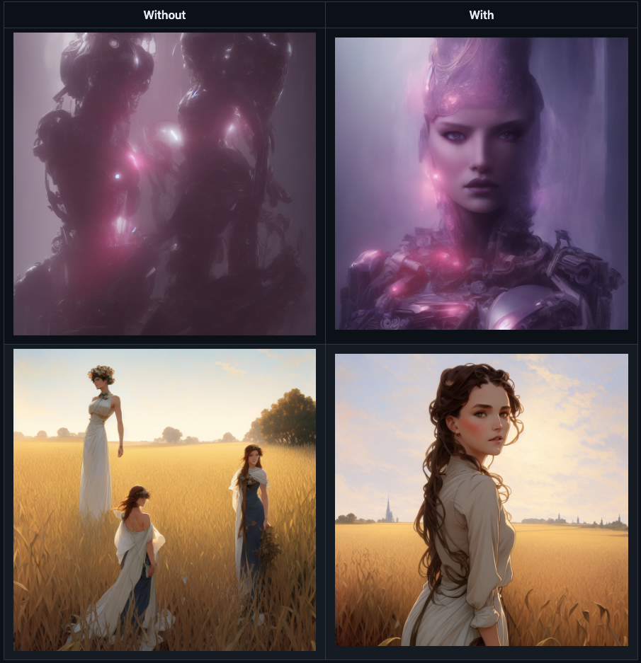	

小图片以您使用`宽度/高度` 滑块设置的任何分辨率呈现。

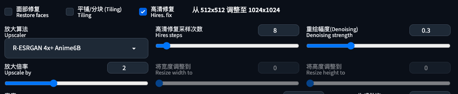	

大图片的尺寸由三个滑块控制：“缩放依据”乘数（调整缩放）、“调整宽度为” 和“调整高度为”（调整大小）。

- 如果“将宽度调整为”和“将高度调整为”为 0，则使用“缩放依据”。
- 如果“将宽度调整为”为 0，“将高度调整为” 则根据宽度和高度计算。
- 如果“将高度调整为”为 0，“将宽度调整为” 则根据宽度和高度计算。
- 如果“将宽度调整为”和“将高度调整为”均非零，则图像将至少放大到这些尺寸，并且裁剪某些部分。

### 22.1 放大算法 Upscalers  参数
下拉菜单允许您选择用于调整图像大小的放大算法类型。除了您在 extras 选项卡上可用的所有放大器之外，还有一个用于放大潜在空间图像的选项，这是SD在内部工作的方式 - 对于 3x512x512 RGB 图像，其潜在空间表示将是 4x64x64。要查看每个潜在空间放大器的作用，您可以将去噪强度设置为 0 并将 步数设置为 1 - 您将非常接近SD在放大图像上的作用。

下面是不同的放大算法模式的外观示例。

	

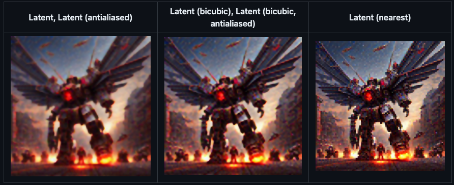
	 
抗锯齿变体是由贡献者 PRd 提供的，似乎与非抗锯齿相同。

## 23 可组咒语
允许组合多个提示的方法。使用大写字母 AND 组合提示

	a cat AND a dog
	
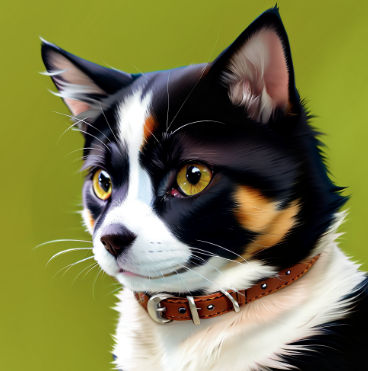

	a cat :1.2 AND a dog
	
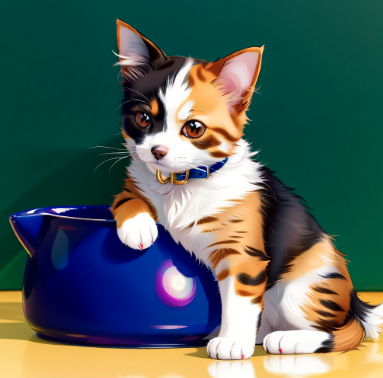

支持提示权重：

	a cat :1.2 AND a dog AND a penguin :2.2 
默认权重值为 1。它对于将多个嵌入组合到结果中非常有用：

	creature_embedding in the woods:0.7 AND arcane_embedding:0.5 AND glitch_embedding:0.2

使用低于 0.1 的值几乎没有效果。`a cat AND a dog:0.03` 将产生基本等同

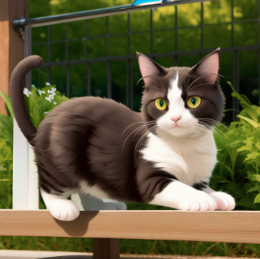

的输出 `a cat`

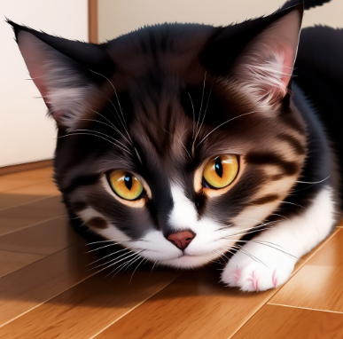

通过继续将更多提示附加到您的总数，这对于生成微调的递归变体可能很方便。

	creature_embedding on log AND frog:0.13 AND yellow eyes:0.08

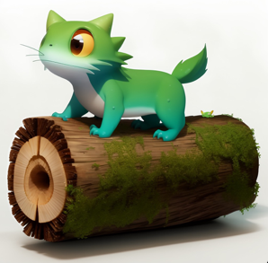

## 24 Interrupt 中断
按中断按钮停止当前处理。

## 25 4GB显卡支持
针对具有低 VRAM 的 GPU 的优化。这应该可以在具有 4GB 内存的视频卡上生成 512x512 图像

- `--lowvram` 是 [basujindal](https://github.com/basujindal/stable-diffusion) 优化思想的重新实现。模型被分成模块，GPU 内存中只保留一个模块；当另一个模块需要运行时，前一个模块将从 GPU 内存中删除。

	这种优化的本质使处理运行速度变慢——与我的 RTX 3090 上的正常操作相比慢了大约 10 倍。
- `--medvram` 是另一个优化，它应该通过不在同一批中处理有条件和无条件去噪来显着减少 VRAM 使用。

这种优化的实现不需要对原始的 SD 代码进行任何修改。

## 26 面部修复 Face restoration
让您使用 [GFPGAN](https://github.com/TencentARC/GFPGAN) 或 [CodeFormer](https://github.com/sczhou/CodeFormer) 改善图片中的面部。每个选项卡中都有一个用于使用面部修复的复选框，还有一个单独的选项卡，只允许您在任何图片上使用面部修复，并带有一个滑块来控制效果的可见程度。您可以在设置中选择这两种方法。

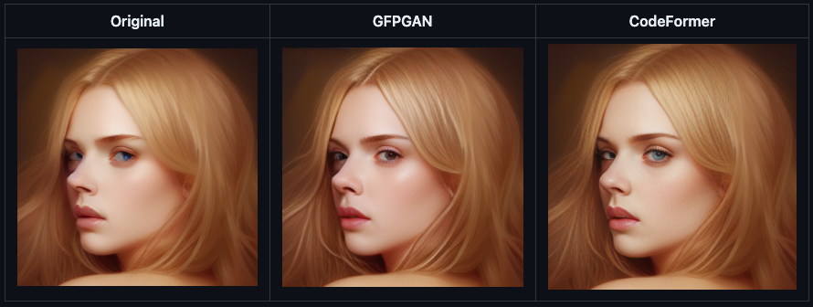
		
## 27 检查点合并
一位匿名捐助者慷慨捐赠的指南。

包含其他信息的完整指南在这里：[https://imgur.com/a/VjFi5uM](https://imgur.com/a/VjFi5uM)
## 28 保存
单击输出图下的按钮列表中的保存按钮，生成的图像将保存到设置中指定的目录中；生成参数将附加到同一目录中的 csv 文件

- 位置
	
	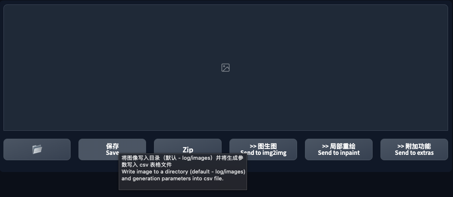
- 配置

	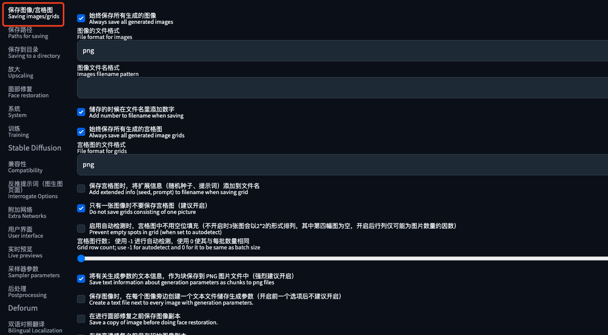

## 29 加载中
Gradio 的 loading graphic 对神经网络的处理速度有非常负面的影响。当带渐变的选项卡未处于活动状态时，我的 RTX 3090 使图像速度提高约 10%。默认情况下，UI 现在隐藏加载进度动画并将其替换为静态“正在加载...”文本，从而达到相同的效果。使用

	--no-progressbar-hiding 
命令行选项恢复它并显示加载动画。
## 30 咒语验证
SD 对输入文本长度有限制。如果您的提示太长，您将在文本输出字段中收到警告，显示文本的哪些部分被截断并被模型忽略。
## 31 PNG info
读取任何 SD 生图的相关信息，将有关生成参数的信息作为文本块添加到 PNG。您可以稍后使用任何支持查看 PNG 块信息的软件查看此信息，例如：[https://www.nayuki.io/page/png-file-chunk-inspector](https://www.nayuki.io/page/png-file-chunk-inspector)
## 32设置
带有设置的选项卡允许您使用 UI 编辑超过一半的参数，这些参数以前是命令行的。设置保存到 `config.js` 文件。保留为命令行选项的设置是启动时需要的设置。
## 33 文件名格式
`Images filename pattern` 设置选项卡中的字段允许自定义生成的 `txt2img` 和 `img2img` 图像文件名。此模式定义了要包含在文件名中的生成参数及其顺序。支持的标签是：

	[steps], [cfg], [prompt], [prompt_no_styles], [prompt_spaces], [width], [height], [styles], [sampler], [seed], [model_hash], [prompt_words], [date], [datetime], [job_timestamp].

这个列表会随着新的添加而发展。您可以通过将鼠标悬停在 UI 中的 `Images filename pattern` 标签上来获取最新的支持标签列表。

模式示例

	[seed]-[steps]-[cfg]-[sampler]-[prompt_spaces]
注意“咒语”标签：`[prompt]` 将在咒语之间添加下划线，同时 `[prompt_spaces]` 保持提示完整（更容易再次复制/粘贴到 UI 中）。`[prompt_words]` 是您的提示的简化和清理版本，已用于生成子目录名称，仅包含您的提示文字（无标点符号）。

如果将此字段留空，将应用默认模式 ( `[seed]-[prompt_spaces]` )。

请注意，标签实际上在模式内部被替换了。这意味着您还可以向此模式添加非标签词，以使文件名更加明确。例如：`s=[seed],p=[prompt_spaces]`
## 34 用户脚本
如果使用选项启动程序 `--allow-code` ，则在页面底部的脚本 -> 自定义代码下，可以使用额外的脚本代码文本输入字段。它允许您输入将处理图像的 python 代码。

在代码中，使用 `p` 变量从 Web UI 访问参数，并使用 `display(images, seed, info)` 函数为 Web UI 提供输出。脚本中的所有全局变量也可以访问。

一个简单的脚本，只处理图像并正常输出：

	import modules.processing
	
	processed = modules.processing.process_images(p)
	
	print("Seed was: " + str(processed.seed))
	
	display(processed.images, processed.seed, processed.info)
## 35 界面配置
您可以在 `ui-config.json` 中更改 UI 元素的参数，它会在程序首次启动时自动创建。一些选项：

- 无线电组(radio groups)：默认选择
- 滑块(sliders)：默认值、最小值、最大值、步长
- 复选框(checkboxes)：选中状态
- 文本和数字输入(text and number inputs)：默认值

当设置为 UI 配置条目时，通常会 SD 隐藏部分的复选框最初不会这样做。

## 36 ESRGAN
可以在 Extras 选项卡以及 SD upscale 中使用 ESRGAN 模型。[论文](https://arxiv.org/abs/1809.00219) 在这里。

要使用 ESRGAN 模型，请将它们放入与 webui.py 相同位置的 ESRGAN 目录中。如果文件具有 .pth 扩展名，则该文件将作为模型加载。从[模型数据库](https://upscale.wiki/wiki/Model_Database)中获取模型。

并非数据库中的所有模型都受支持。很可能不支持所有 2x 模型。

## 37 img2img alternative test
使用 Euler diffuser 的反向解构输入图像，以创建用于构建输入提示的噪声模式。

例如，您可以使用此图像。从脚本部分选择 ` img2img alternative test`。

调整重建过程的设置：

- SD 主模型选择正确，否则会不像
	- `v1-5-pruned-emaonly.ckpt [cc6cb27103]`
- 使用场景的简短描述：`A smiling woman with brown hair.`  描述您要更改的功能会有所帮助。
	- 将其设置为您的启动提示，并在脚本设置中设置 `Original Input Prompt`。 
- 您必须使用 Euler 采样方法，因为此脚本是基于它构建的。
- 采样步数：50-60。
	- 这与脚本中的解码步骤值非常匹配，否则您会遇到麻烦。在此演示中使用 50。
- `CFG Scale`：
	- 2 或更低，对于此演示，请使用 1.8。（提示，您可以编辑 `ui-config.json`  将 `img2img/CFG Scale/step` 更改为 `.1` 而不是 `.5`。
- `Denoising strength ` 降噪强度 
	- 这很重要，将其设置为 1。
- 宽度/高度 
	- 使用输入图像的宽度/高度。
- `seed` 种子
	- 你可以忽略这个。
- `Decode steps` 解码步骤 
	- 如上所述，这应该与您的采样步骤相匹配。50 用于演示，考虑增加到 60 以获得更详细的图像。
- `Decode CFG scale` 解码 cfg 比例 
	- 低于 1 的位置是最佳点。对于演示，使用 1。

拨入以上所有内容后，您应该能够点击“生成”并返回与原始结果非常接近的结果。

在验证脚本以良好的准确度重新生成源照片后，您可以尝试更改提示的详细信息。原始图像的较大变化可能会导致图像的构图与源图像完全不同。

使用上述设置和下面提示的示例输出（红头发/图中未显示）

- `A Smiling woman with brown hair` # Original prompt

- `A Smiling woman with red hair`
- `A Smiling woman with blue hair`
- `A frowning woman with brown hair` 

最后参数

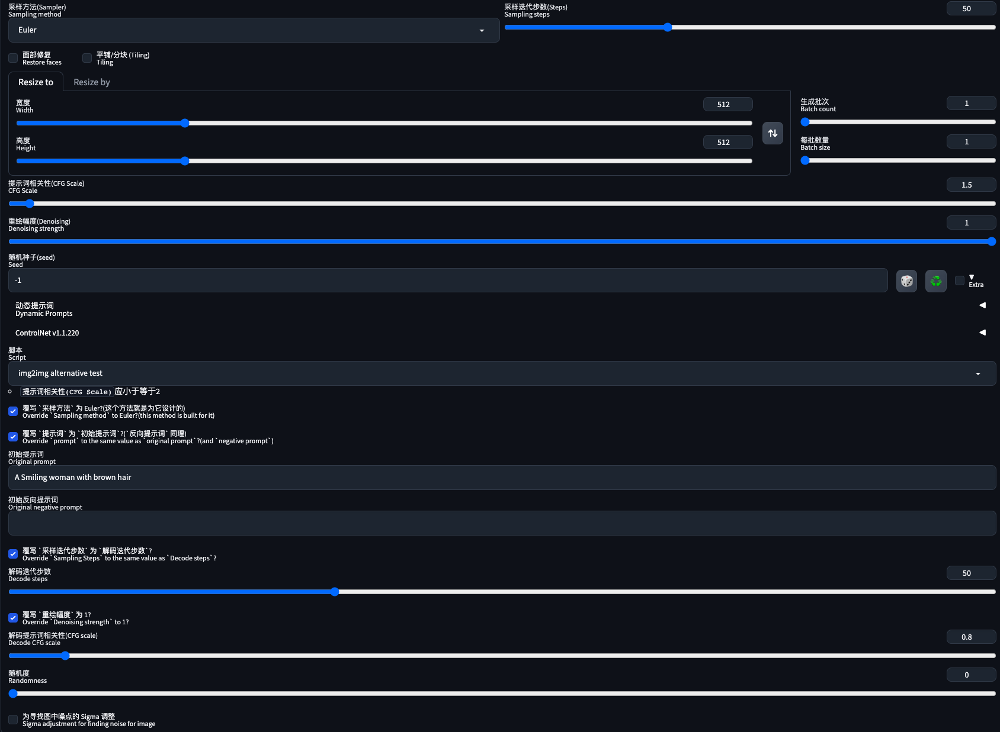

最后结果

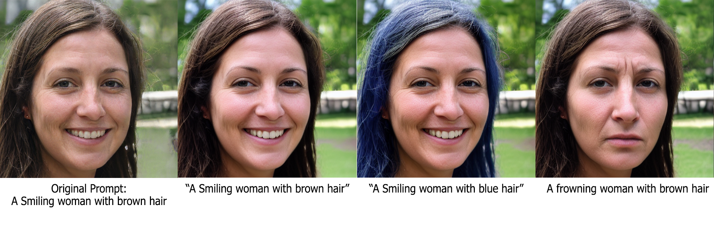

似乎完全取代了女人

- [How to use the new "discriminating" Stable Diffusion Img2Img algorithm](https://www.youtube.com/watch?v=_CtguxhezlE)
- [How to stylize images using Stable Diffusion AI](https://stable-diffusion-art.com/stylize-images/)

## 38 用户.css
在 `webui.py` 附近创建一个名为 `user.css` 的文件，并将自定义 CSS 代码放入其中。例如，这会使画廊更高：

	#txt2img_gallery, #img2img_gallery{
	    min-height: 768px;
	}
- 一个有用的咒语是您可以附加 `/?__theme=dark` 到您的 webui url 以启用内置的深色主题
，例如 (`http://127.0.0.1:7860/?__theme=dark`)
- 或者，您可以将 `--theme=dark` 添加到 `webui-user.bat` 中的 `set COMMANDLINE_ARGS=` ，例如 `set COMMANDLINE_ARGS=--theme=dark`

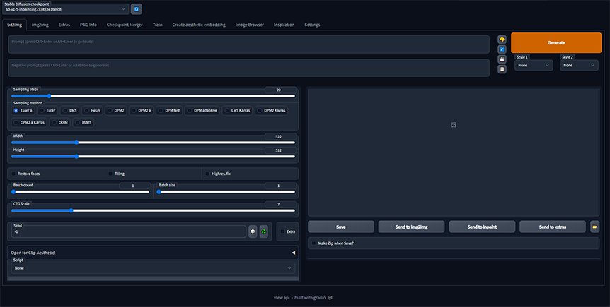

## 39 通知.mp3
如果名为的音频文件 `notification.mp3` 存在于 webui 的根文件夹中，它将在生成过程完成时播放。

作为灵感来源：

- [https://pixabay.com/sound-effects/search/ding/?duration=0-30](https://pixabay.com/sound-effects/search/ding/?duration=0-30)
- [https://pixabay.com/sound-effects/search/notification/?duration=0-30](https://pixabay.com/sound-effects/search/notification/?duration=0-30)

## 40 微调
### 40.1 剪辑跳过(Clip Skip)
这是设置中的一个滑块，它控制 CLIP 网络处理提示的时间应该多早停止。

更详细的解释：

CLIP 是一种非常先进的神经网络，可将您的提示文本转换为数字表示。神经网络可以很好地处理这种数字表示，这就是为什么 SD 的开发者选择 CLIP 作为稳定扩散图像生成方法中涉及的 3 个模型之一的原因。由于 CLIP 是一个神经网络，这意味着它有很多层。您的提示以一种简单的方式数字化，然后通过层层馈送。您在第一层之后获得提示的数字表示，将其提供给第二层，将其结果提供给第三层，依此类推，直到到达最后一层，这就是稳定版中使用的 CLIP 的输出扩散。这是 1 的滑块值。但是您可以提前停止，并使用倒数第二层的输出 - 这是 2 的滑块值。您停止得越早，

一些模型是通过这种调整进行训练的，因此设置此值有助于在这些模型上产生更好的结果。

## 参考
- [官方文档-特征](https://github.com/AUTOMATIC1111/stable-diffusion-webui/wiki/Features)