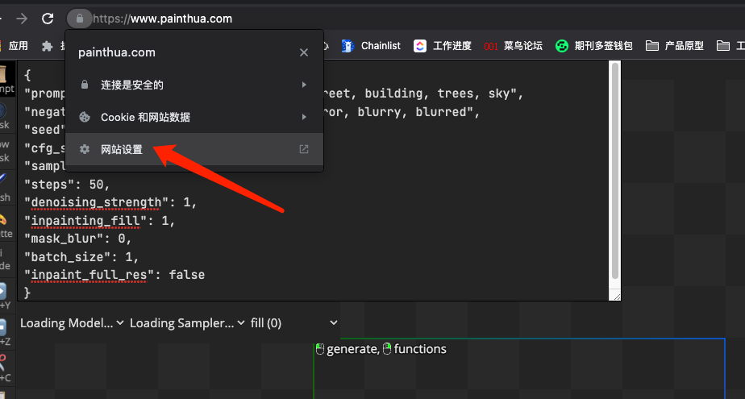
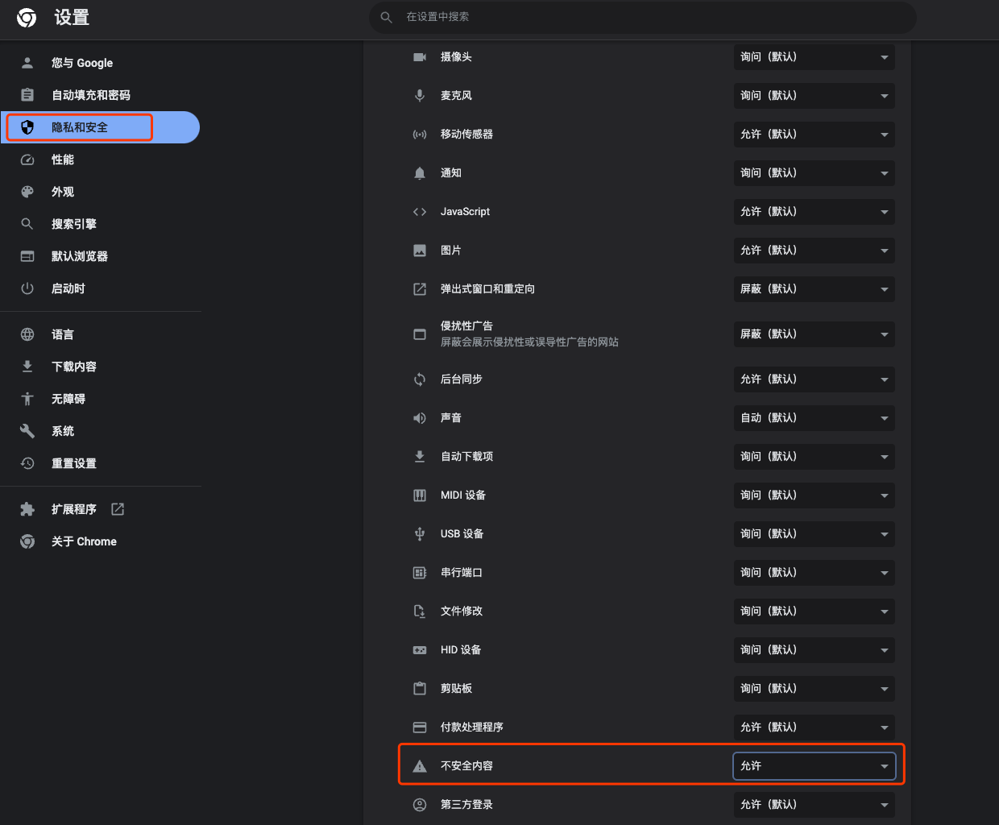
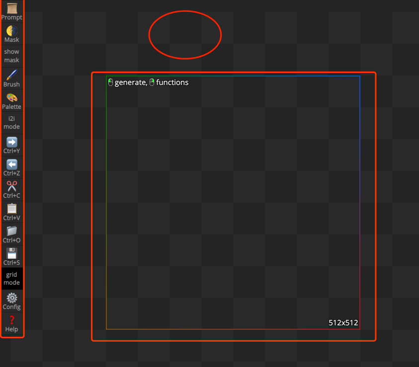
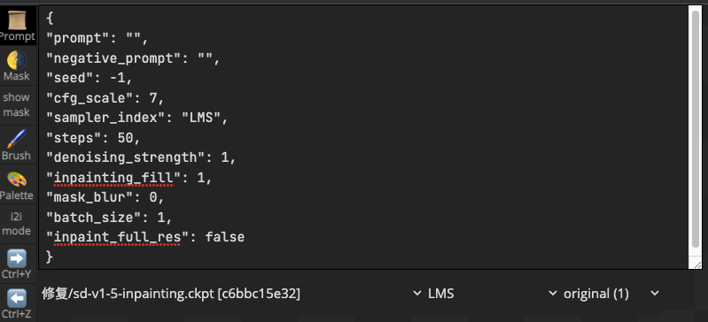
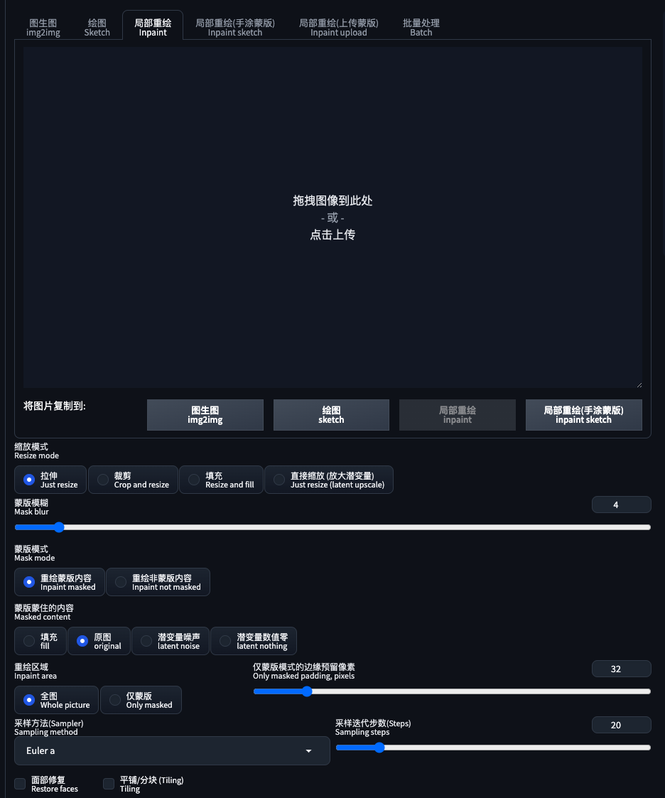
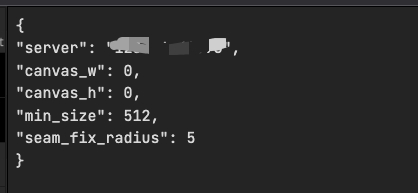

# Hua(画)
[https://www.painthua.com/#](https://www.painthua.com/#)
## 官方简介
Hua是一个结合人工智能图像编辑器，具有SD和更多功能(Hua在中文中的意思是绘画)。

- Website: [https://www.PaintHua.com](https://www.PaintHua.com)
- Discord: [https://discord.gg/y9kMYtjgFZ](https://discord.gg/y9kMYtjgFZ)
- B站视频: [https://www.bilibili.com/video/BV16e4y1a7ne](https://www.bilibili.com/video/BV16e4y1a7ne)

## 设置
- 服务端设置
	- 安装 sd webui
	- 在 webui-user.bat\webui-user.sh 中：
	
			set COMMANDLINE_ARGS=--api --port xxxxx --cors-allow-origins=https://www.painthua.com
		- 其中 `--port xxxxx` 是 10000 到 60000 之间的随机未占用端口（为了安全）。
		- 使用 `--cors-allow-origins` 更安全。
		- 打开 `PaintHua config`，把 `7860` 改成你的号码 `xxxxx`，关闭 `config`。
		- 使用 sd-v1.5-inpainting 模型 ( [https://huggingface.co/runwayml/stable-diffusion-inpainting](https://huggingface.co/runwayml/stable-diffusion-inpainting) ) 以获得最佳效果，它不擅长直接画二次元，但能修和拓展二次元（记得 `CLIP 1`，以及 Prompt 按照 SD 的写法）
		- 更多 A1111 设置：关闭 `Apply color correction to img2img results`
	- nginx 变更
		- nginx 需要取消安全设置    
- 客户端设置	
	- 使用 `--listen` 运行 A1111 以允许 LAN 访问。当连接到 127.0.0.1 以外的 IP 时，chrome  `enable mixed content` 并更改站点设置。因为该站点是 HTTPS 而 A1111 服务器是 HTTP，所以浏览器默认阻止 HTTP 请求。
		- 如何设置，参考 adobe 的
			- 打开 painthua 主页，点击进入网站设置

				 
			- 设置允许不安全内容

				 	
- 可以使用 `https://www.PaintHua.com` 进行 
	- txt2img
	- img2img
	- inpainting
	- outpainting

## 介绍
### 功能区介绍
 

这个工具一共分3个部分

- 功能区
- 画版
- 标记区/计算区

### 功能区
功能区包含主要功能

- prompt 咒语设置

	这里主要设置咒语和计算主参数，包括:种子、模型选择、采样器选择等等，参数对比 SD 的 img2img 的 inpaint 功能
	
	 
	
	 
- Mask、Show mask、Brush、palette

	这个主要用来标注想要重新修改图中元素的蒙版设置,包含
	
	- 设置显示和隐藏蒙板
	- 设置刷子的颜色
	- 设置刷子显示
	- 刷子大小调节(按住ctrl 滚动鼠标滚轮)
- i2i 模式
	
	如果点击这个模式，将忽略补全模式，也就是专注算新图  
- 操作前进后对
- 复制删除
- 操作记录
- 网格模式
- 服务器设置

	 
- 帮助
	- 隐藏功能 
	- 重置 prompt
	- 重置配置

	
## 参考
- [hua github readme](https://github.com/BlinkDL/Hua)
- [在浏览器中启用混合内容](https://experienceleague.adobe.com/docs/target/using/experiences/vec/troubleshoot-composer/mixed-content.html?lang=zh-Hans)