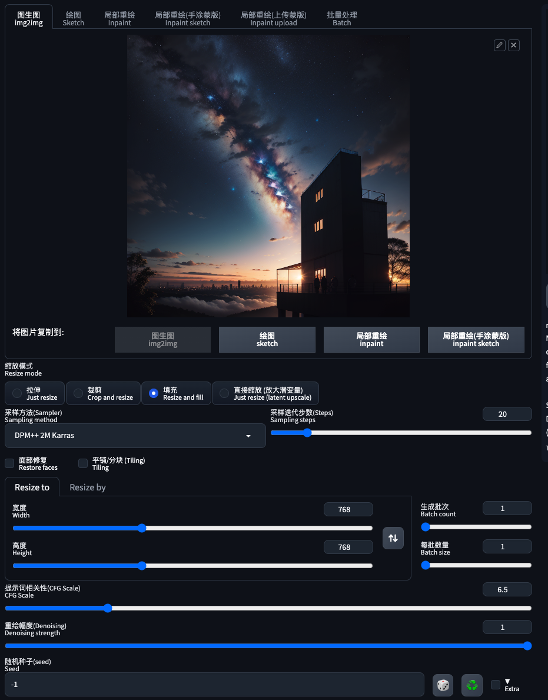
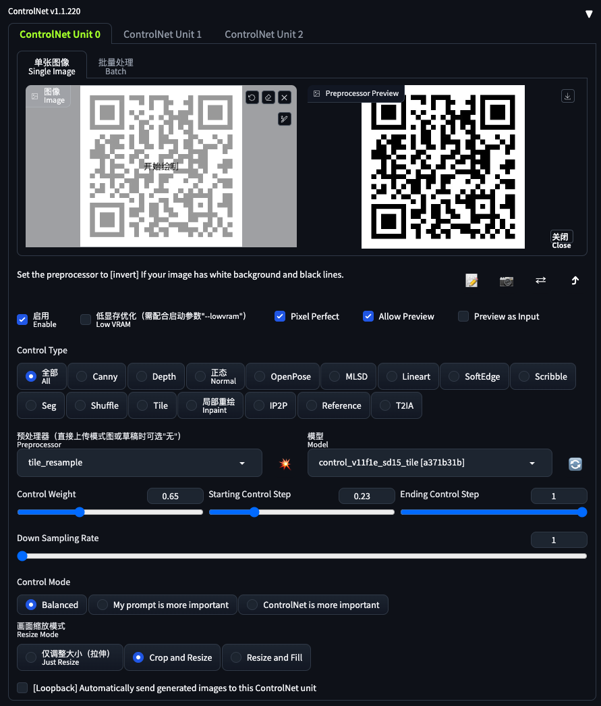
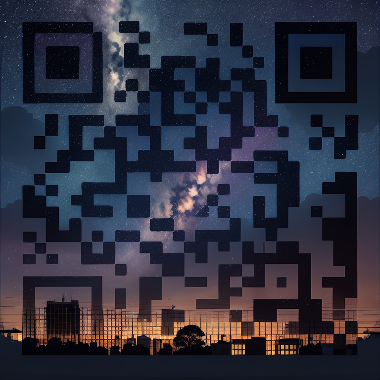
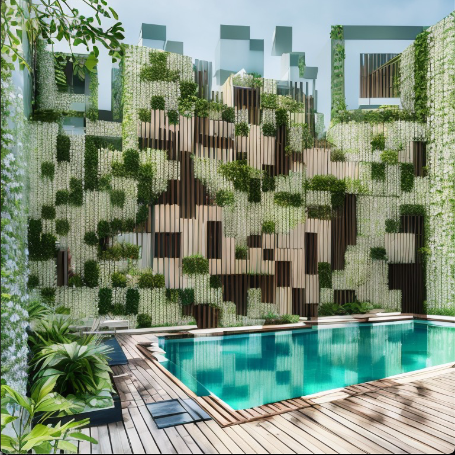

# 使用 SD 制作二维码
## 准备
- 制作一个普通二维码

	[类这种网站](https://cli.im/url?qrtype=active)

## 步骤
- 生成一张想要和二维码融合的概念图
	- 注意
		- 最好中间比较空
		- 注意二维码反差色
			- 比如黑色二维码，使用明亮的图像
			- 白色二维码使用黑色图像
- 将生成好的图和咒语导入 image2image
- 将二维码的图导入 ControlNet
- 其他参数		   
	- Model 
		- 主模型任意
		- Lora 任意
	- Steps: 20
	- Sampler: DPM++ 2M Karras
	- CFG scale: 6.5
	- Size: 768x768
	- Denoising strength: 1
	- Clip skip: 2
	- Token merging ratio: 0.6
	- ControlNet 0: "
		- 开关
			- Enable : True,  
			- pixel perfect: True,  
			- Allow Preview: True,  
		- preprocessor: tile_resample,
		- model: control_v11f1e_sd15_tile [a371b31b],
		- weight: 0.65, <- 感觉最低了
		- starting/ending: (0.23, 1),
		- control mode: Balanced,
		- resize mode: Crop and Resize, 
		- preprocessor params: (64, 1, 64)", 
- 总体参数截图

	

	
- 生成的图

	

## 参考咒语
### 建筑

- prompt

		A photo-realistic rendering of a 2 story house with greenery, pool, (Botanical:1.5), (Photorealistic:1.3), (Highly detailed:1.2), (Natural light:1.2), art inspired by Architectural Digest, Vogue Living, and Elle Decor, <lora:epiNoiseoffset_v2:1>
- Negative prompt:

		bad_pictures, (bad_prompt_version2:0.8), EasyNegative, 3d, cartoon, anime, sketches, (worst quality:2), (low quality:2), (normal quality:2), lowres, normal quality, ((monochrome)), ((grayscale)),

### 齿轮
- prompt

		A photograph from above of an assembly of complex blue and silver mechanical parts including hydraulic cylinders and gears laying on an a wooden pallet, intricate details, dramatic lighting
- Negative prompt

		poor quality, ugly, blurry, boring, text, blurry, pixelated, ugly, username, worst quality, (((watermark))), ((signature)), face, worst quality, painting, copyright, unrealistic, (((text)))
			
## 参考
- [my_attempt_on_qr_code](https://www.reddit.com/r/StableDiffusion/comments/1436nqv/my_attempt_on_qr_code/)
- [my_second_attempt_on_qr_code_finally_did_it](https://www.reddit.com/r/StableDiffusion/comments/143u5x6/my_second_attempt_on_qr_code_finally_did_it/)