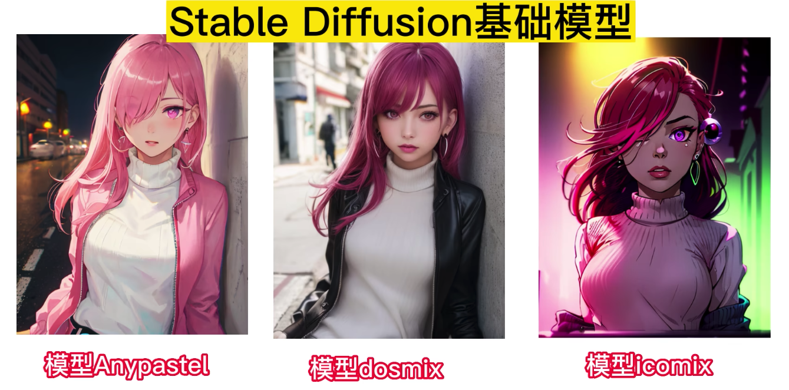
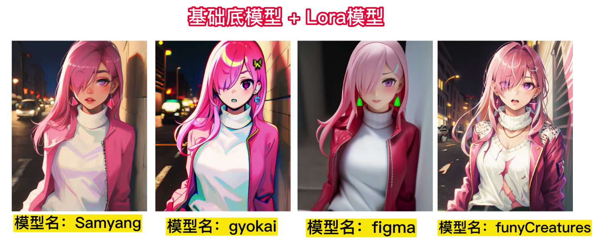

# 模型使用说明
## 模型类型说明
### 基础模型
- checkpoint

	stableDiffusion 基础底模型
	
		 
	
	- 后缀格式
		- cpkt
		- safetensors
	- 大小
		- 几个GB
	- 目录
		-  `~/stable-diffusion-webui/models/Stable-diffusion` 
	- 同时模型
		- 该类型模式同时只能加载一个
		- 可以同时增加其他辅助模型使用 

### 辅助模型
- embedding

	早期的一种小模型，对比 lora , embedding 三视图模型做的很好
	
	- 后缀格式
		- pt
	- 大小
		- 几百 KB
	- 目录
		-  `~/stable-diffusion-webui/embeddings`  
	- 同时模型
		- 可结合基础底模型使用
- Hypernetwork

	固定画风使用小模型，效果可能会比 embedding 好
	
	- 后缀格式
		- pt
	- 大小
		- 几百 KB-几GB 
	- 目录
		- `~/stable-diffusion-webui/models/hypernetworks`  
	- 同时模型
		- 可结合基础底模型使用
-  Lora

	LORA，英文全称Low-Rank Adaptation of LargeLanguage Models，直译为大语言模型的低阶适应，这是微软的研究人员为了解决大语言模型微调而开发的一项技术
	
	[Lora + civital 使用进阶教程](https://www.bilibili.com/video/BV1mL41197UM/?spm_id_from=333.788&vd_source=f6f37263151dcfb42f0a8663116bb22b)
	
		
	
	- 后缀格式
		- safetensors
	- 大小
		- 几百MB-几个GB
	- 目录
		- `~/stable-diffusion-webui/models/Lora`   
	- 同时模型
		- 可结合基础底模型使用

	Lora 进阶，模型训练分为

	- 人物训练
	- 风格训练
	- 动作训练
	- 物品训练等等
	
	对比 embedding ，模型大了很多，也就是模型信息会细腻很多

### 美化模型
- vae

	模型调优模型,主要是颜色调优
	
	- 后缀格式
		- VAE
	- 大小
		- ?
	- 目录
		- `~/stable-diffusion-webui/models/VAE`   
	- 同时模型
		- 可结合基础底模型使用

## 模型使用
### 大模型
#### 1 [DosMix](https://civitai.com/models/6250/dosmix)
辅助 VAE 模型,注意模型要自己下完了传上去，不能在服务器 wget

- https://huggingface.co/stabilityai/sd-vae-ft-mse-original/blob/main/vae-ft-mse-840000-ema-pruned.ckpt 
- 可以提升颜色
	- https://huggingface.co/AIARTCHAN/aichan_blend/tree/main/vae 

#### 2 [Disney Pixar Cartoon Type A](https://civitai.com/models/65203?modelVersionId=69832)
辅助 VAE 模型

- https://civitai.com/api/download/models/14459?type=VAE

#### 3 [ReV Animated](https://civitai.com/models/7371/rev-animated)
辅助 VAE 模型

- https://huggingface.co/WarriorMama777/OrangeMixs/blob/main/VAEs/orangemix.vae.pt
- https://huggingface.co/hakurei/waifu-diffusion-v1-4/tree/main/vae
- https://huggingface.co/NoCrypt/blessed_vae/blob/main/blessed2.vae.pt

#### 4 [Counterfeit-V3.0](https://civitai.com/models/4468/counterfeit-v30)
- Embedding 
	- [EasyNegative](https://huggingface.co/datasets/gsdf/EasyNegative/tree/main)

#### 5 [MeinaMix](https://civitai.com/models/7240/meinamix)
- 推荐参数

		Sampler: Euler a: 40~60 steps.
		Sampler: DPM++ SDE Karras: 30~60 steps.
		CFG Scale: 7.
		Resolutions: 512x768, 512x1024 for Portrait!
		Resolutions: 768x512, 1024x512, 1536x512 for Landscape!
		Hires.fix: R-ESRGAN 4x+Anime6b, with 10 steps at 0.1 up to 0.3 denoising.
		Clip Skip: 2.
		Negatives: ' (worst quality:2, low quality:2), (zombie, sketch, interlocked fingers, comic), '
- 官方 discord.

		https://discord.gg/F6yeQtEQ98
- 官方提供demo，可以查看它使用了什么 lora 模型

		https://sinkin.ai/m/vln8Nwr
- 辅助模型
	- MeinaMix V1~6
	- MeinaPastel V3
	- MeinaHentai V2
	- Night Sky YOZORA Style Model
	- PastelMix
	- Facebomb		

#### 6 [dreamshaper](https://civitai.com/models/4384/dreamshaper)
- 推荐参数
	- 照片生成 跳过了 CLIP 2（所有版本 4）
	- ENSD：基本上设置 31337
	- 所有这些具有更高分辨率的 highres.fix 或 img2img。
	- 不使用 restore faces，因为它会冲掉绘画效果
	- 第 4 版不需要 LoRA 来实现动漫风格。
	- 对于第 3 版 建议使用这些 LoRA 网络之一，权重为 0.35：
		- https://civitai.com/models/4219（戴眼镜的女孩，或者如果它说 `wanostyle`）
		- https://huggingface.co/closertodeath/dpepmkmp/blob/main/last.pt（如果它说 `mksk style`）
		- https://civitai.com/models/4982/anime-screencap-style-lora
	
### LoRa 模型
#### [blindbox](https://civitai.com/models/25995/blindbox) ***** 粘土人手办
- checkpoint 大模型
	- RevAnimated 或者你喜欢的模型
- 咒语 
	- full body,chibi, 3d rendering
- 权重 : 1

#### [Figma Anime Figures](https://civitai.com/models/7984/figma-anime-figures) 配合 blindbox 做超现实粘土人手办，增加塑料感
- checkpoint 大模型
	- AbyssOrangeMix2
- 权重: 0.6 (UNet: 0.6, TEnc: 0.25)
- 咒语
	- 现实主义的积极咒语
		- [realistic], [3d], (3dcg), ((octane render)), [fisheye]
	- 否定咒语
		- simple background, grey background
-  CLIP skip: 2
- 采样 Sampler: DPM++ SDE Karras (Euler 推荐其他模型)
- 反咒语
	- EasyNegative

#### [三视图](https://www.bilibili.com/video/BV1hs4y117qA/?spm_id_from=333.788&vd_source=f6f37263151dcfb42f0a8663116bb22b)
- checkpoint 大模型
	- RevAnimated 或者你喜欢的模型
- lora
	- blindbox
- 咒语
	- 三视图起手
		- full body,chibi, 3d rendering，multiple views     
	- 纯色背景
		- simple background,pink background 1.3
	- q版本咒语
		 - chibi
 	
## 参考
- [讲解Stable Diffusion模型运用](https://www.bilibili.com/video/BV1Yv4y1H74F/?spm_id_from=pageDriver&vd_source=f6f37263151dcfb42f0a8663116bb22b)