# textual-inversion 使用手册
## 什么是 textual-inversion
它是一个用户自己训练，适用于 novel AI 的内嵌解析词条的辅助神经网络(翻译器)的工具，来解决当前模型不支持的专属风格和人物等等，也是 stable-diffusion 推出的第一种补充训练方法，novelAI 也是用此技术，是支持所有支持 stable-diffusion 的模型。
## 训练准备工作
- 模型数据准备

	`/home/$user/stable-diffusion-webui/models/Stable-diffusion` 模型库中是否存在 pt 文件，比如 `animefull-final-pruned.vae.pt`，如果存在，需要重命名。
	
	例
	
		mv animefull-final-pruned.vae.pt exchange-animefull-final-pruned.vae.pt
	
	重命名后，重启 web-ui 项目	
- 准备训练的图片
	
	- 创建训练角色图像目录
	
		`mkdir -p /home/$user/ai-training-img/$角色名称/row`
	- 将准备的 `512*512` 像素图片放进目录(模型最少需要5张，论文是5-16，效果好要30张以上)

		虽然web-ui 支持长方形，但一样需要裁剪成同样比例
- 训练设置配置
	- `settings` 配置 
		- 点击 `settings`，查看 `Interrogate Options` 
		- 具体设置
	
			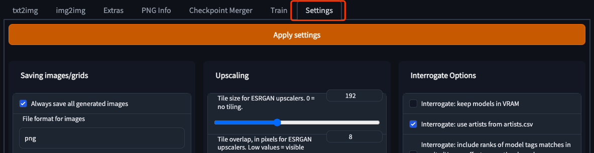  
			
			- `Interrogate: deepbooru score threshold` 
		
				控制自动识别图片来打词条的阈值，意思是保留自动识别词条百分比。这里建议设置高一点，这里默认是 `0.5` 修改成 `0.75`,也就是保留 50% 提升到 75%
				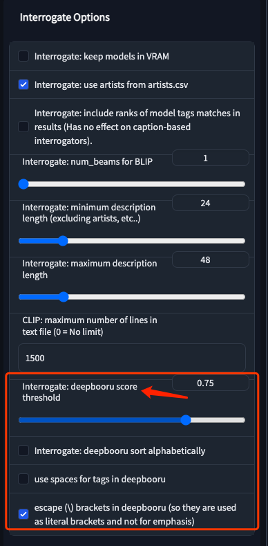  
			-  `Interrogate: deepbooru sort alphabetically`
		
				是否按字母排序预测结果，这里默认是选上的，建议取消勾选，因为词条的顺序对生图结果影响巨大，具体看词条说明文档
			- 其他参数待测试	
		- 最后点击记录
	
			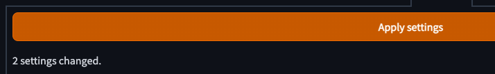  	
	- `train` 配置
		- 点击 `train` 切换到训练页面 

			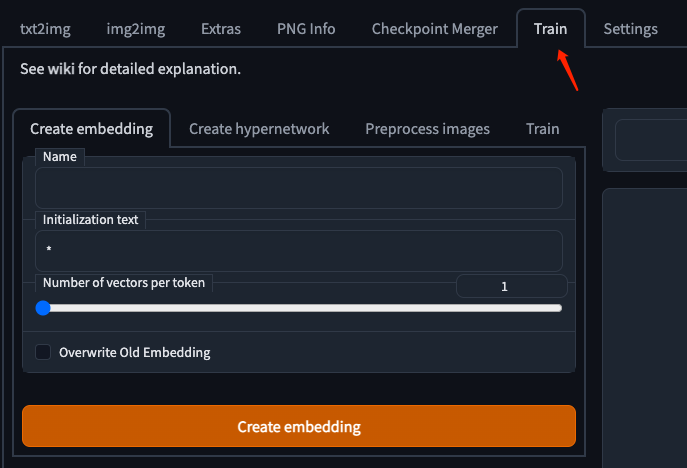 
		- 创建嵌入模型
			- `name`
				
				模型名称，建议找一个特殊叫法，防止冲突，比如 `xxxx-prompt`
				
				例
				
					Xingye-prompt
					
			- `Initialization text`

				初始化信息，这个无需更改，如果要填，仅限一词，对于人物可以是1girl或者1boy，对于画风就写style就行了
			- `Number of vectors per token`

				嵌入模型需要占用的词条数量，一般而言越高越好，但同时占据写其他描述词条的空间
				
				- 角色建议 最少2，建议8个词条
				- 风格建议 16
				- 词条最大数量是 76
			- `Overwrite Old Embedding`

				是否覆盖原先模型，我们是新建所以无需设置，如果未来重新训练，想覆盖掉原有模型，选中即可
				
			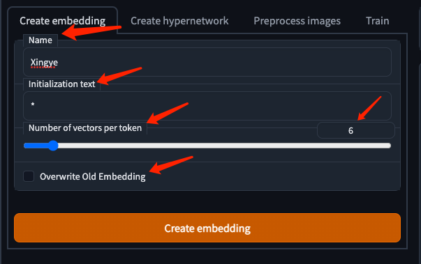 
			
			- 点击 `Create Embedding `	

				在 `stable-diffusion-webui` 的安装目录中的潜入目录下生成了一个项目 pt 的模型文件,
				
				例
				
					/home/$user/stable-diffusion-webui/embeddings/Xingye.pt
				如果  `stable-diffusion-webui`  目录没有 `embeddings ` 文件夹，请检查代码，安装，也可以尝试手动创建，但不推荐	
				 
	- 预处理
		- 点击 `Perprocess images`

			跳过 `Creat hypernetwork` 进入 `Perprocess images` 对图片进行预处理
			
			- `Source directory`

				填写训练图片目录路由，注意这个目录只有训练用图，否则就会有问题
				
				例
				
					/home/$user/ai-training-img/Xingye/raw
			- `Destination directory`

				填写数据增强后的图片存储目录路由，注意这个是 ai 最终要训练的目录
				
				- 创建
					
						mkdir -p /home/$user/ai-training-img/$角色名称/processed
				例
				
						/home/pangzheng/ai-training-img/Xingye/processed
			- `Width` && `Height`

				希望训练的图像大小，默认使用 512*512，并不是尺寸越大越好
			- `Create flipped copies`

				将图片进行镜像，训练样本数翻倍，属于数据增强处理
			- `Split oversized images`

				将长图一份为二，当前用例是 512*512，所以不点
			- `Use BLIP for caption`
			
				自动命名图像，这里不点，但如果要训练原生 Stable-diffusion 的内嵌模型，这里需要点选
			- 点击 `Preprocess`

				等待预处理完成
				
				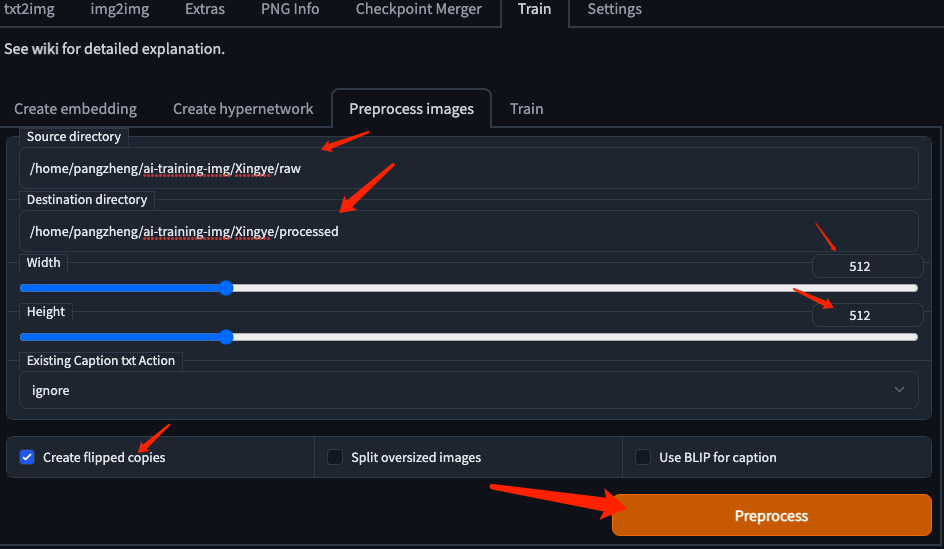 
			- 预处理结束

				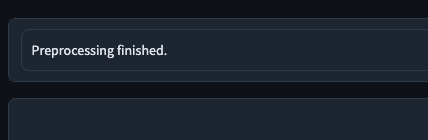 
				
## 训练
- 模型训练配置与训练
	- 点击二级 `Train` 标签

		切换到模型训练
		
		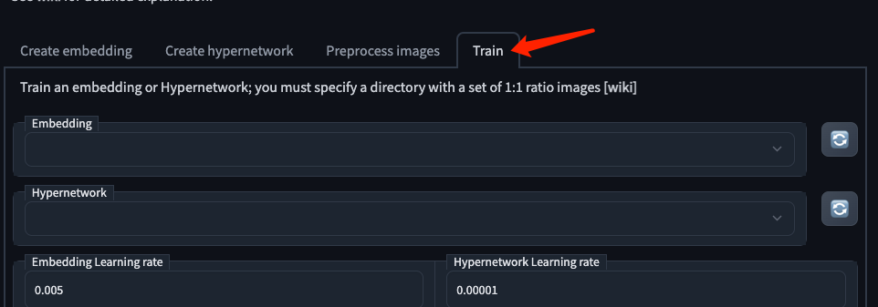 
	- `embedding` 

		一栏选择想要训练的模型,我们是需要训练 `Xingye`，所以选择 `Xingye`
		
		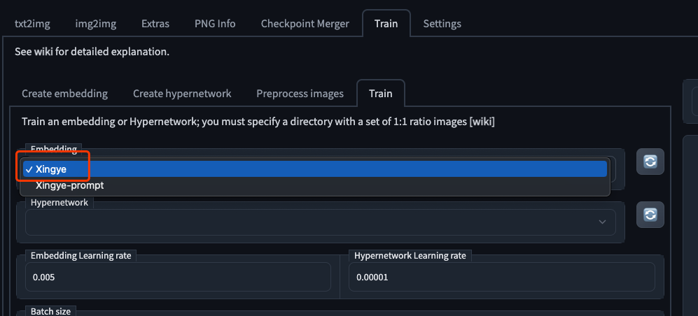 
	- `Embedding Learning rate`	

		训练速率，默认设置的 `0.005` 就 ok,想训练快设置为 `0.01` 但经常效果不佳,这里不要过低，否则效果很擦好
	- `Dataset directory`

		训练数据集，这里设置上面的预处理目录
		
		例
				
			/home/pangzheng/ai-training-img/Xingye/processed
	- `Log directory`
	
		 默认设置可以在 textual-inversion 目录中看到生成的日志和模型
	- `Prompt template file`

		训练画风或者训练对象(某人或者某物)
		
		- 画风使用 style 前缀

				style_filewords.txt
		- 对象使用 subject 前缀

				subject_filewords.txt
	-  `Width` && `Height`						 

		与预处理的时候保持一致
	- `Max steps`

		训练步数，一般来说，数据越多，步数就可以越少，如果原训练集合超50张，增强超100张，那么就可以设置500步，我们少，所以保持 1w步
		
		- 注意
			- 有的 up 说这里这里步数过多，容易造成拟合，训练画风非常明显
			- 但是有的up 说
				- 角色风格建议 15000-40000
				- 画师风格建议 40000-80000 
	- `Save an image to log directory every N steps, 0 to disable` && `Save a copy of embedding to log directory every N steps, 0 to disable`

		每个多少张生成图和模型，建议无需修改，注意随时观察训练结果，发现拟合现象及时停止调整，如果最后模型出现拟合，找到中途模型替换
	- `Save images with embedding in PNG chunks`
	
		使用 png 作为 chunks 格式，保持默认选中
	- 最后点击  `Train Embedding` 训练

		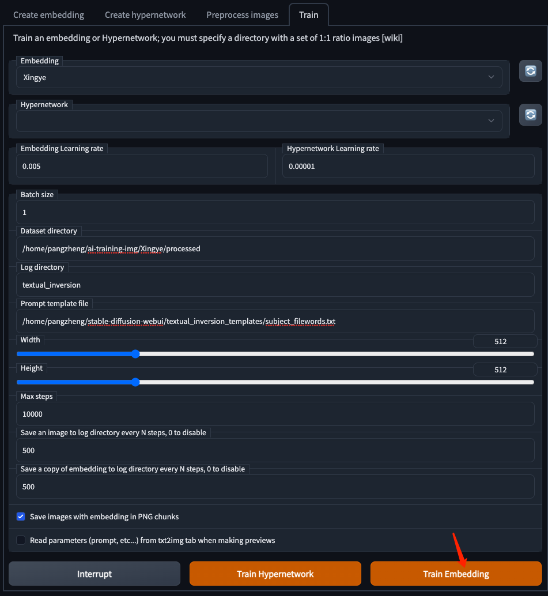 
	- 可以查看右边训练开始

		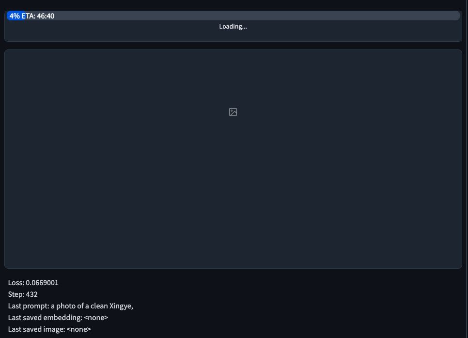
	- 也可以在控制台日志查看

		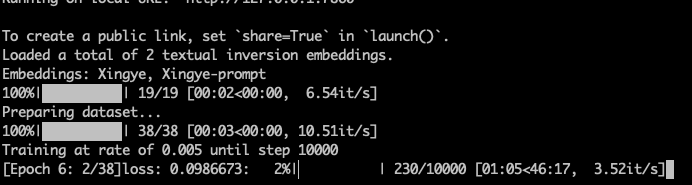	

## 训练后使用技巧
训练技术后，将 model 目录的 vue 文件改名还原，然后重启 webui。

最后测试

- 单独使用词条来测试训练效果，注意  textual-inversion 放在镜头之后，描述之前

		
- 增加风格来使用测试效果

	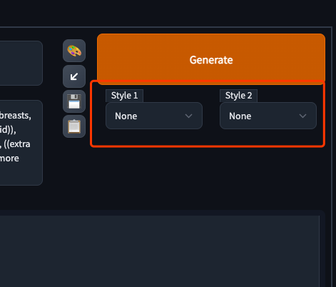
- 还可以混合多种训练的 textual-inversion 来使用

	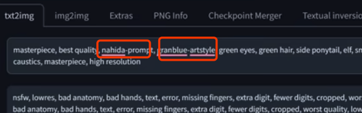
- 语句融合方式，前面占20%风格，后面的占80%

		[$textual-inversion:$textual-inversion:0.2]
	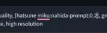
- 在使用风格词条时，
	- 可以增加 [] 中括号来减少对图像的影响，可以增加多层 [] 中括号来增加比重	- 当然也可以增加 () 小括号来增加对图像的比重，注意这里如果是 novalai 需要使用 {} 大括号	

## 注意事项
- 基础
	- 准备最新版本 webui
	- 图像库，注意尺寸要一致，建议 512*512，这里注意截图原图要高清，不要糊
	- 显存大于 8g
	- 训练集合根据不同的需求数量不同
		- 人像，最少 5  推荐 50
		- 风格，最少100，建议500
- 注意训练中可以点击 `interrupt` 中断，然后增加或删除训练图集后再训练   
- 增加参数
	- `--deepdanbooru`

		`python webui.py --deepdanbooru`，如果对自己硬件有足够信心可以加上 `--precision full`	 		

## 参考
- [【NovelAI】利用Colab来在线训练自己的tag，以Hiten画风tag为例](https://www.bilibili.com/video/BV1EK411Q7W4)  --< 简单介绍了原理，介绍比较粗略
- [【AI绘画】AI不认识人物怎么办！强大的Textual Inversion【NovelAI】](https://www.bilibili.com/video/BV1ae4y1S7v9)
- [让AI绘画生成自己喜欢的画风！Stable Diffusion风格化模型定制1分钟超快速教程！【VOICEROID教程】](https://www.bilibili.com/video/BV1H8411W7VX)
- [Textual Inversion](https://github.com/AUTOMATIC1111/stable-diffusion-webui/wiki/Textual-Inversion)	

	
			 		
			

		
		 

					
													
	
	
	

