# 进阶功能
## 0 [基础功能](https://www.bilibili.com/video/BV1KX4y1B75H/?spm_id_from=333.788&vd_source=f6f37263151dcfb42f0a8663116bb22b)
### 提示词描述方法
提示词由前到后

- 内容性提示词

	这个是根据需求，更换不同的单词课
	
	- 人物及主题特性
		- 服装穿搭
		- 发型发色
		- 五官特点
		- 面部表强
		- 肢体动作
	- 场景特征
		- 室内、室外
		- 大场景
		- 小细节
	- 环境光照
		- 黑天白天
		- 特定时段
		- 光环境
		- 天空
	- 补充 画幅视角
		- 距离
		- 人物比例
		- 观察视角
		- 镜头类型  
- 标准性提示词   

	这个是根据不同的应用场景直接使用
	
	- 画面提示词
		- 通用高画质
		- 特定分辨率
	- 画风提示词
		- 插画风
		- 二次元
		- 写实风   

### 一个通用提示词模版
- 内容性提示词
	- 描述人物
	
			(1girl:2.0), solo, nilou \(genshin impact\), solo, long hair, jewelry, blue gemstone, earrings, horns, crown, cyan satin strapless dress, white veil, neck ring, red hair, {igreen eyes},
	- 描述场景
	
			indoor, room, house, sofa, wooden filoor, plant, flowers, trees, windows,
	- 描述环境(时间光照)
	
			day, morning, sunlight, dappled sunlight, backlight, light rays, cloudy sky
	- 描述画幅视角
	
			full body, wide angle shot, depth of field
	- 其他画面要素
	
			light particles, fantasy, wind blow, maple leaf, dusty, ... (其他往后增加)
- 标准型提示词
	- 高品质标准化

			{{masterpiece}}, {best quality}, {highres}, original, reflection, unreal engine, body shadow, artstationextremely detailed CG unity 8k wallpape,
	- 画风标准化

			(illustration), (painting), (sketch), anime coloring, fantasy
	- 其他特殊要求

			exaggerated body proportions, greasy skin, realistic and delicate facial features, SFW

### [提示词权重、拆分、融合、分步](https://www.bilibili.com/video/BV1Xk4y1j7Bo/?spm_id_from=333.788&vd_source=f6f37263151dcfb42f0a8663116bb22b)
#### 权重
- 顺序权重

	哪个咒语在前，就是哪个咒语权重就会大，比如
	
	- 咒语以男孩开头
	
			1boy, forest, flower, tree, sky, a cat,  
		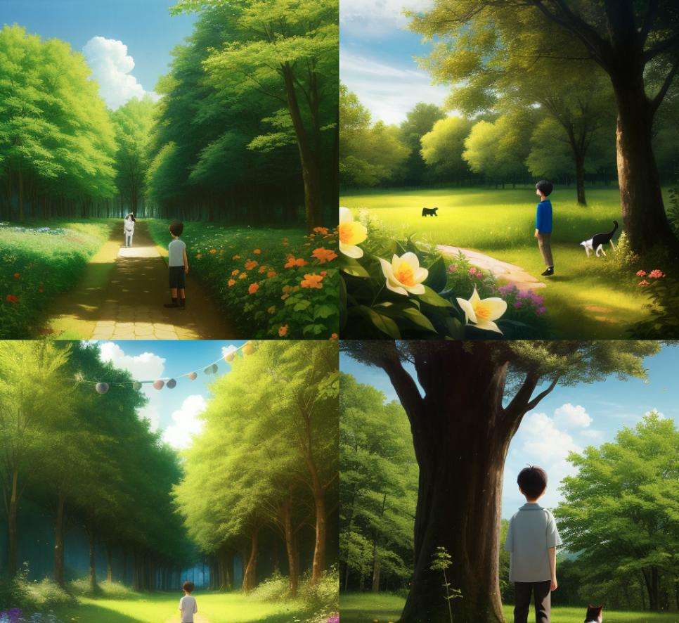
	- 再换成猫开头

			a cat,  forest, flower, tree, sky,  1boy,
		
- 符号加权重		

	除了顺序，还可以使用符号加权重，比如选中天空，按住 CMD+上箭头，就会看到天空的权重增加，从  `(xx:1.1)` 开始增加，我们先加到2倍
	
		a cat,  forest, flower, tree, (sky:2.0),  1boy,
	得到图片，天空的占图的比例就很大了	

	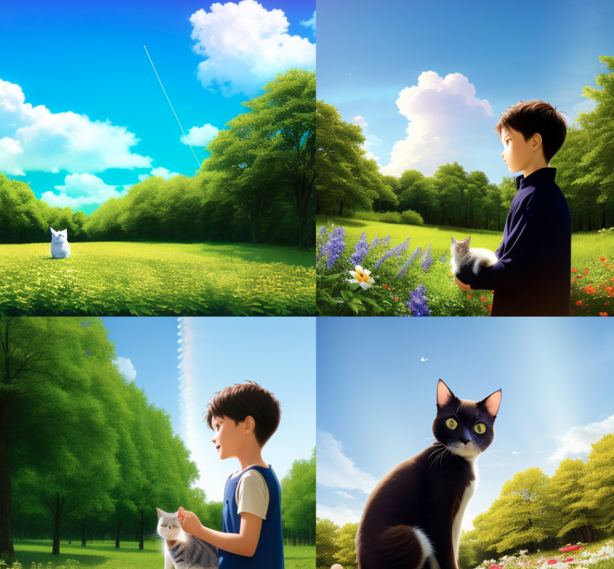
	
	下面就是其他权重符号
	
	- `(xx)` 1.1 倍
	- `((xx))` 1.21 倍
	- `(((xx)))` 1.33 倍
	- `(xx:2.0)` 2.0 倍
	- `{xx}` 1.05 倍
	- `{{xx}}` 1.025 倍 
- 减权重

	当然也可以减少权重，比如减少森林的权重，选中森林，按住 CMD+下箭头
	
		a cat,  (forest:0.1), flower, tree, sky,  1boy,
	得到图片，森林就变成1棵树了
		
	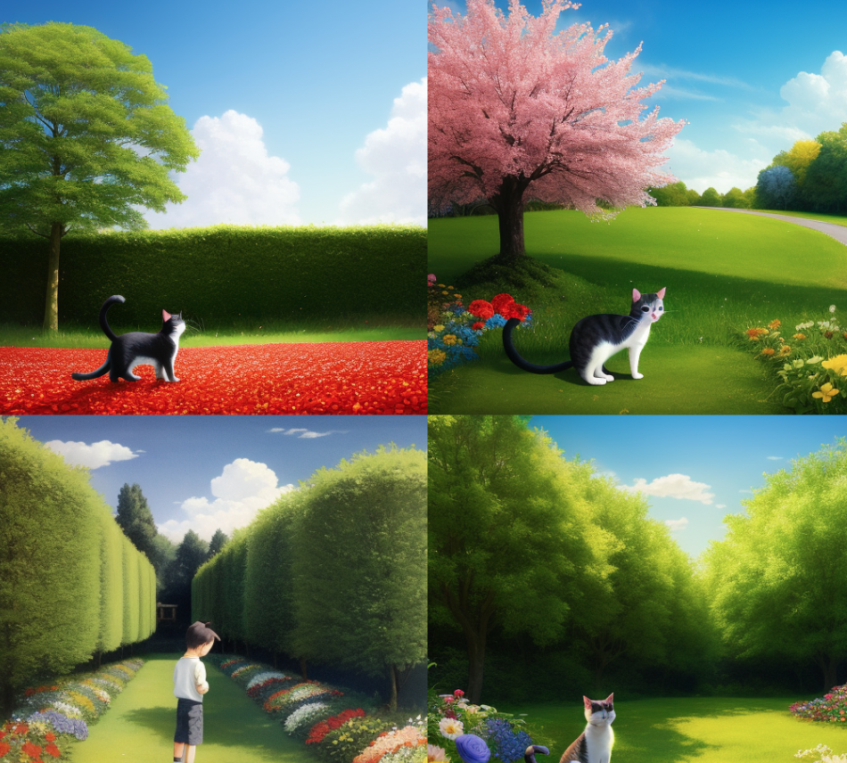
	
	下面就是其他权重符号
		
	- `(xx:0.5)` 减重1倍
	- `[xx:0.5]`减重 1.1 倍 

#### S/R 语法拆分
- 只抱苹果
	
		a boy hold an apple, a cat
	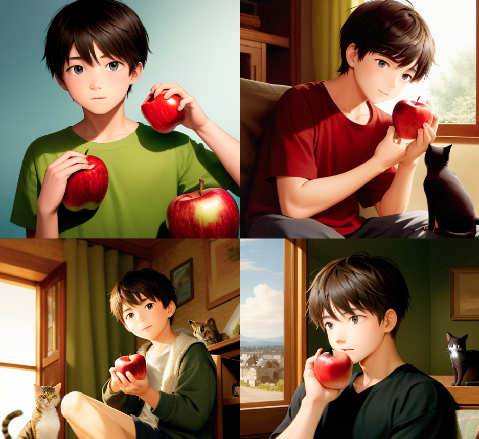		
- 抱着苹果和猫	
	
		a boy hold S/R an apple,a cat		
	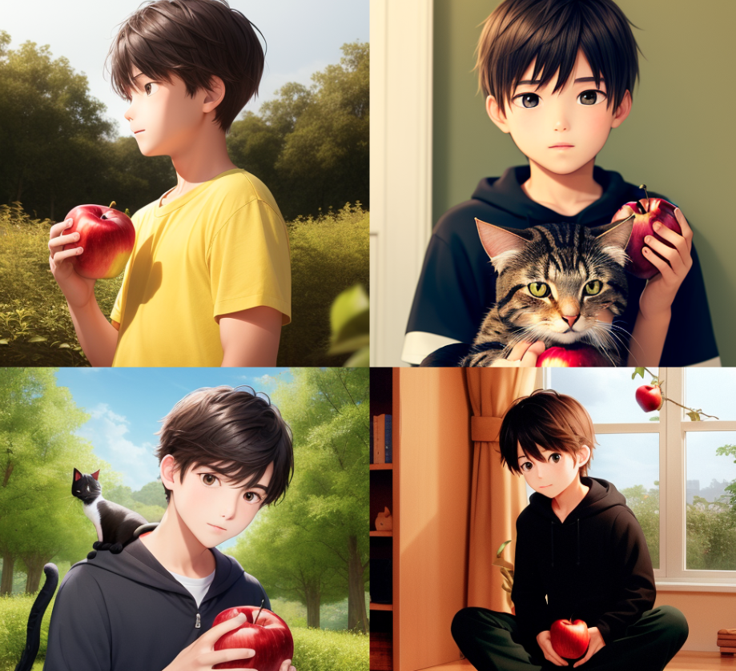	

#### 融合生成
- `AND` 组合生成(大写)
	
	比如红色和绿色混合头发，注意头发的权重在前比较容易出
	
		red hair AND  green  hair,  a boy
		
	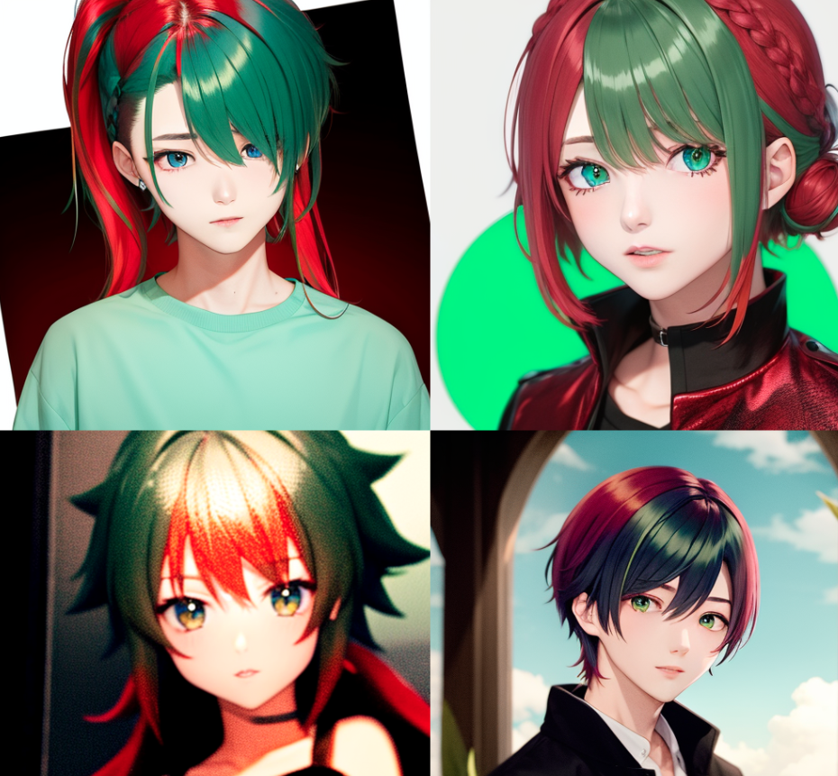		  
- `[xx|xx]` 适合名词融合

		[red hair | green  hair],  a boy 	
	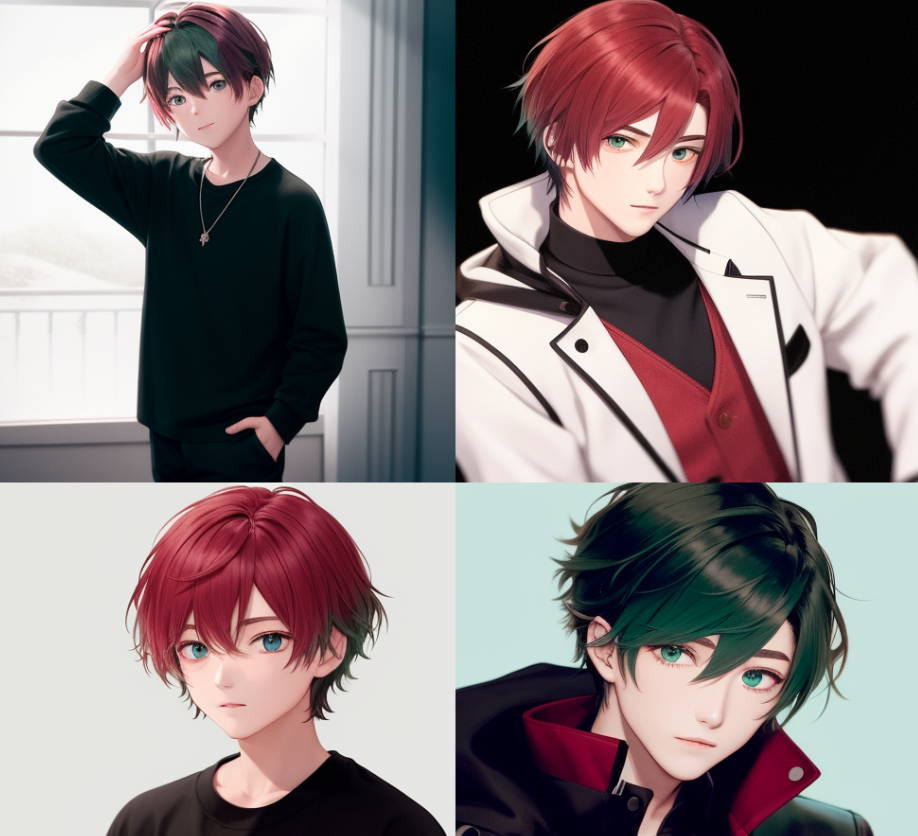
- `{xx|xx}` 适合形容词融合

	当然颜色形容词可以单独抽出来使用,也可以加权重
	
		 {(red:1.5)|green|yellow} hair,  a boy ,
	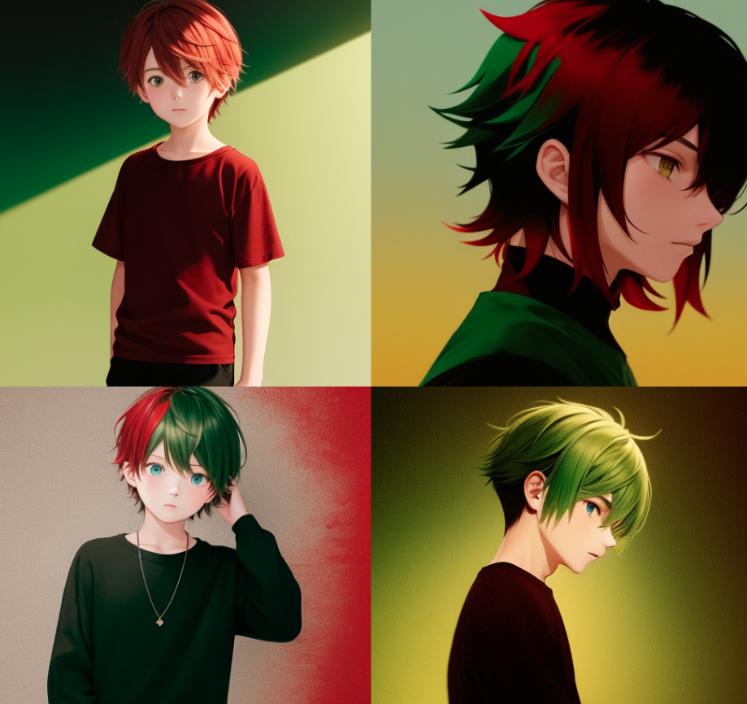

#### 分步绘制
- `[form:to:when]` 分步绘制

	前5步画红色，后面画其他两个颜色
	
		 [red:green:yellow:5] hair,  a boy ,
		 		 
- `[to:when]` 开始绘制
	- 普通
		
			a boy , forest,
			
		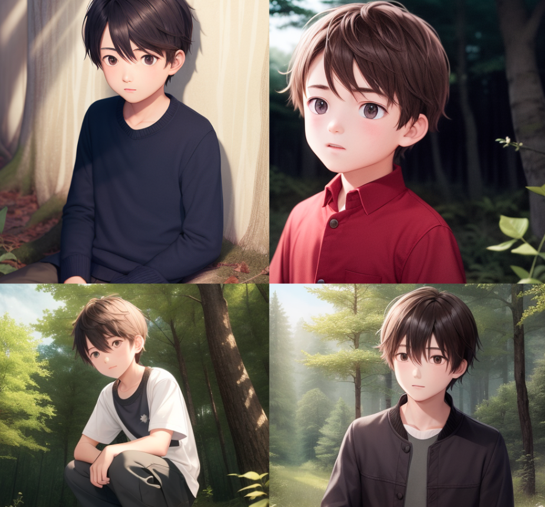	
	- 效果后

		从第10步才开始画森林，所以与普通相比，发现男孩特写镜头很多，森林元素少或者没有，因为之前被其他元素占了

			a boy , [forest:10], 
		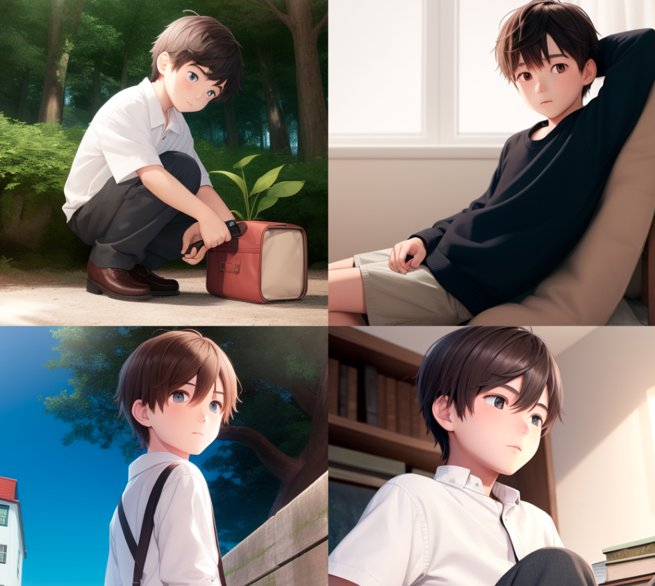	
	- 如果我们换成男孩后画

		10步以后画男孩，就发现男孩走远了，景深拉长，森林占了很大部分
		
			[a boy:10] , forest, 
		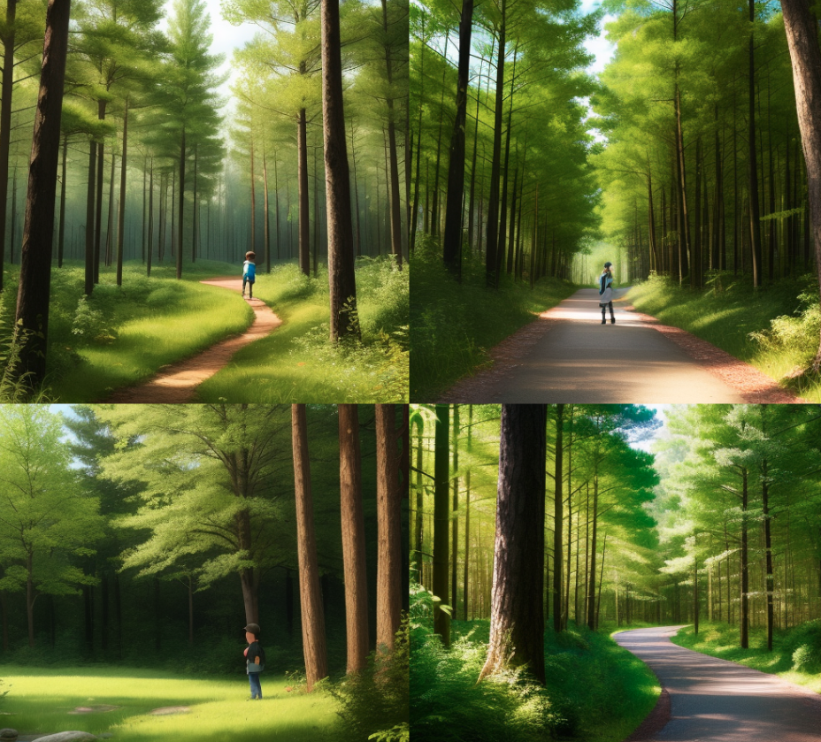				
- `[form::]` 结束绘制

		a boy , forest, [1girl::7]
	画小女孩 7步，然后就不画了，发现有的图就是把前期小女孩的元素改成其他的元素了。
	
	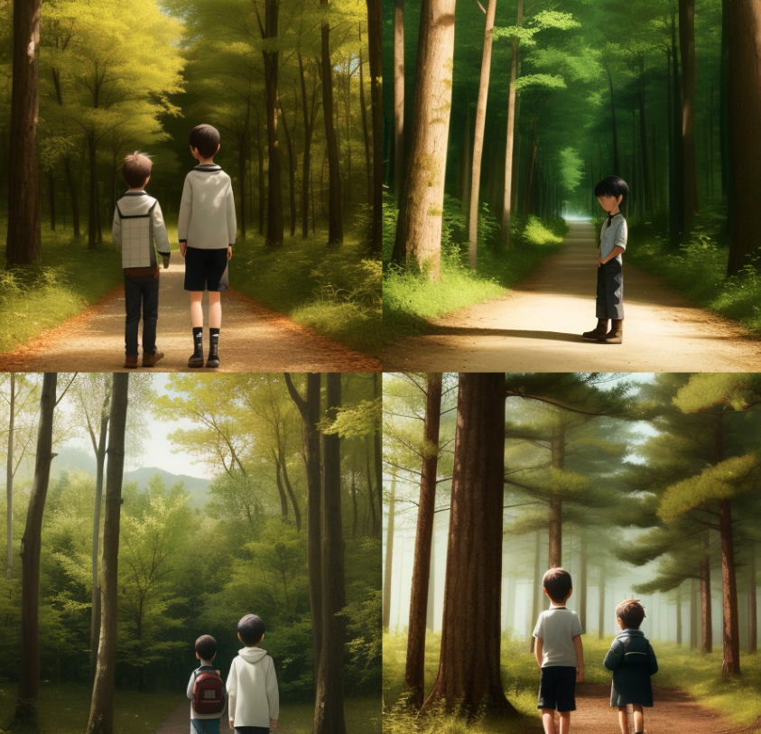

### [多彩头发](https://www.bilibili.com/video/BV1ru41147gn/?spm_id_from=333.788&vd_source=f6f37263151dcfb42f0a8663116bb22b)
- 内侧染色

		colored inner hair
- 绚彩头发

		colorful hair
- 彩虹头发
	
		rainbow hair
- 渐变发色

		gradient hair
- 挑染头发

		Pick and dye hair
- 多彩头发

		multicolored hair
- 琉璃色头发

		glass hair	 	

- 混合颜色实验

	注意把头发颜色放前面，更容易出效果，也要注意配合模型，有的模型就是没有混色，二次元比较好出，比如用 `meinamix meinav9.safetensors`
	
	- 红色头发
	
			red  hair, white background, simple background, 1girl, 
		
	- 红色+黄色

		颜色挨着，所以会有渐变色效果

			red and yellow hair, white background, simple background, 1girl, 
		
	- 红色+蓝色

		对比颜色，所以不会有渐变，而是色块比较生硬

			red and blue hair, white background, simple background, 1girl, 
		
	- 红色+蓝色+渐变

		这样就比较好看
		
			(red and blue:1.5) gradient hair, white background, simple background, 1girl, 
		
	- 3色

			red and blue and yellow hair, white background, simple background, 1girl, 
		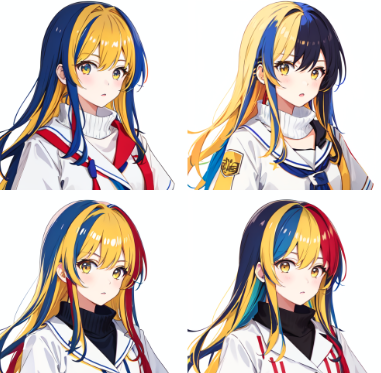
	- 拼色
		- 2色拼橘黄色
			
				[red|yellow]hair, white background, simple background, 1girl, 
			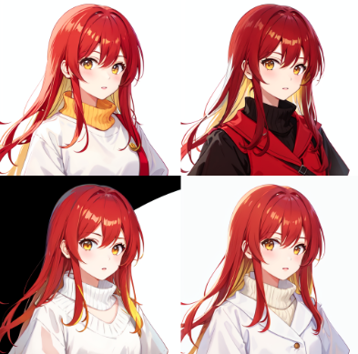
		- 3色

				[red|yellow|blue]hair, white background, simple background, 1girl, 
			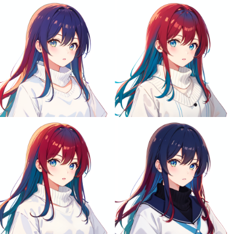
		- 3色优先级也可以调节，比如把黄色调节到第一个并再加些权重

				[(yellow:1.5)|red|blue]hair, white background, simple background, 1girl, 
			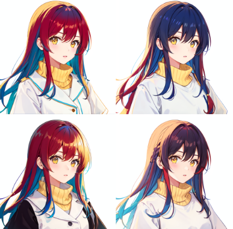	
	- AND 融合
		
		通过 AND 可以将头发的反光颜色控制下，比如蓝色融红色，蓝色就是反光，但我这个模型测试不出来
		
		- 红色融合到蓝色
	
			头发红色光源
				
				red AND blue hair, white background, simple background, 1girl, 
			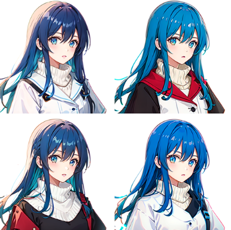
		- 蓝色融合到红色
	
			这个不知道为什么头发看不出什么蓝色光源
			
				blue AND red hair, white background, simple background, 1girl, 
			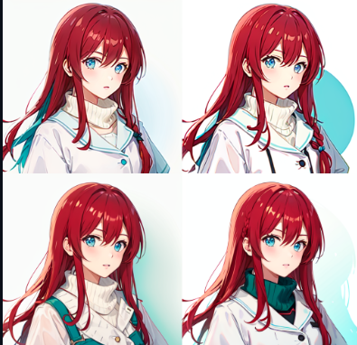

### 稳定同一个人物
- 融合法
	- Prompt 格式:
	
			[明星A:明星B:小于1的系数(如0.4)]
	- Stable Diffusion: “懂了!我先画明星A，到 40% 的时候开始画明星 B”
	- 例子

			[Keanu Reeves:Emma Watson:0.4]
- 顺序生成法
	- Prompt 格式

			[明星A|明星B|明星C]
	- Stable Diffusion:“懂了!我第1步画明星A，第2步画B，第3步画C，第4步再画A，循环下去'
	- 例子

			[Keanu Reeves Emma WatsonlMike Tyson]
- 逆向生成法(异性效果更好，同性也行)
	- Prompt
	
			a woman 个漂亮的女人 
	- Negatice prompt: 

			男明星A
	- Stable Diffusion :"懂了!我要画一个完全不像A的女人
- 意识流法(瞎编法)
	- Prompt
	
			随便编一个人名
	- Stable Diffusion:“懂了! 叫这个名字的人应该长这样

			

## 1 插件管理器
Stable Diffusion 插件是必须要用的，官方更新后增加了插件管理器，方便插件管理
### 方法步骤
- 找寻插件管理器

	
- 选择可安装,并载入，可以看见加载出来的可安装插件

	
- 选择想使用的插件点击 install 即可
- 安装完毕后，到安装中去查看，并重启 UI 即可加载插件

	
- 注意除了几个URL显示 built-in 外，网上下载的插件是可以检查插件的版本的和升级的

	

### 其他
除了使用插件管理器的安装方法，还可以从 git 下载插件包，然后放到以下目录

	/home/pangzheng/sd/stable-diffusion-webui/extensions
	
		

## 2 [放大或者精细重绘图](https://www.bilibili.com/video/BV12s4y1o7VQ/?spm_id_from=333.999.0.0&vd_source=08dea42d6a3c14cf6e6f46ae4e350391)
放大或者精细重绘图主要的用处

- 如果有一张跑图出来的样式很喜欢，但是有些地方很糊
- 或者出图小，但是我想放大到很大，比如4096

那么就需要用这个方法。

### 方法步骤
- 选用你绘图的模型
- 进入图生图界面
- 贴入你想放大的目标图
- 不要按图声称魔法语句，使用默认语句
- 配置参数
	- Resize mode
		- Just resize 或者 Just resize (latent upscale)  

			
	- Sampling method
		- DPM adaptive
		- Sampling steps
			- 42
		
		
	- resize to
		- 原图尺寸
		
		
	- Denoising strength
		- 0.2

		
	- Script
		- SD upscale

		 	
	- Upscaler
		- R-ESRGAN 4x+ Anime6B

		 
		 
		 注意这里如果没看到，请到设置中打开，后重启服务，如图
		 
		 
- 点击生成
	- 注意第一次要安装模型

			Downloading: "https://github.com/xinntao/Real-ESRGAN/releases/download/v0.2.2.4/RealESRGAN_x4plus_anime_6B.pth" to /data/home/pangzheng/stable-diffusion-webui/models/RealESRGAN/RealESRGAN_x4plus_anime_6B.pth
			
			100%|██████████| 17.1M/17.1M [17:32<00:00, 17.0kB/s] 
- 总参数

		
- 对比图
	- 制作前

			
	- 制作后

			

## 3 [打开 VAE UI 显示](https://www.bilibili.com/video/BV1es4y1271Q/?spm_id_from=333.337.search-card.all.click&vd_source=f6f37263151dcfb42f0a8663116bb22b)
VAE 是各种模型用来细调的细节模型，这里我们想在我们的 UI 上打开它，需要在设置里设置

- 跳转设置界面
- 找到 `User interface`
- 找到 `quicksettings list`

	
- 增加 `,sd_vae`	

	
- 保存设置
- 重载UI
- 打开

			

剩下可以选择喜欢的 VAE 模型了

## 4 网络加速
以 Ubuntu Server 为例
### 4.1 [安装加速客户端](https://github.com/enpenguc/linux-backup/blob/master/doc/Ubuntu%20Server%E5%AE%89%E8%A3%85shadowsocks%E5%AE%A2%E6%88%B7%E7%AB%AF.md)
- 预备

		# 如果 python-pip 没安装，则安装。安装忽略
		# 检查注意版本
		 python3.10 -m pip --version
			pip 23.1.2 from /home/pangzheng/.local/lib/python3.10/site-packages/pip (python 3.10)
		# 系统安装的pip 太老，需要代码安装
		# 卸载
		$ sudo apt-get remove python3-pip
		# 安装
		$ curl -sS https://bootstrap.pypa.io/get-pip.py | python3.10
		# 升级
		$ python3.10 -m pip install --upgrade pip
			Defaulting to user installation because normal site-packages is not writeable
			Looking in indexes: http://mirrors.cloud.aliyuncs.com/pypi/simple/
			Requirement already satisfied: pip in ./.local/lib/python3.10/site-packages (23.1.2)
- 安装 ss

		# 安装ss
		$ pip install shadowsocks
- 配置

		# 配置文件shadowsocks.json文件
		$ sudo vi /etc/shadowsocks.json

		{
		  "server": "您服务器地址",
		  "server_port": 12346,
		  "local_address": "127.0.0.1",
		  "local_port": 1080,
		  "password": "密码",
		  "timeout": 600,
		  "method": "aes-256-gcm"
		}
- 启动服务

		# 后台启动（此命令启动后，会启动一个sock5代理服务）
		$ sslocal -c /etc/shadowsocks.json -d start
		
		# 查看启动进程
		$ ps -ef | grep sslocal
		
		pangzhe+  685225       1  0 17:32 ?        00:00:00 /usr/bin/python3.10 /home/pangzheng/.local/bin/sslocal -c /etc/shadowsocks.json -d start
		pangzhe+  685255  681109  0 17:33 pts/1    00:00:00 grep --color=auto sslocal

### 4.2 [安装 socks5 转 http](https://jerry.red/327/ubuntu%E4%B8%AD%E5%B0%86socks5-%E8%BD%AC%E4%B8%BAhttp)
privoxy有将socks代理转为http代理的功能。

- 安装privoxy

		sudo apt-get install privoxy
- 配置provoxy

		sudo vim /etc/privoxy/config
- 配置内容

		.....
		forward-socks5   /               127.0.0.1:1080 .
		.....
		listen-address localhost:8118
		.....
- 重启privoxy：

		sudo service privoxy restart
- 测试

		curl -x localhost:8118 http://www.google.com 

### 4.3 配置 Git 加速
配置下面命令

	git config --global http.proxy http://127.0.0.1:8118
			
### 4.4 错误处理
- AttributeError: module 'collections' has no attribute 'MutableMapping'

	由于在 3.10 版本中更改了内部结构，因此必须使用两种不同的方式来导入此 mutablemapping 模块。导致错误
	
	- 报错
	
			$ sslocal -version
			Traceback (most recent call last):
			  File "/home/pangzheng/.local/bin/sslocal", line 5, in <module>
			    from shadowsocks.local import main
			  File "/home/pangzheng/.local/lib/python3.10/site-packages/shadowsocks/local.py", line 27, in <module>
			    from shadowsocks import shell, daemon, eventloop, tcprelay, udprelay, asyncdns
			  File "/home/pangzheng/.local/lib/python3.10/site-packages/shadowsocks/udprelay.py", line 71, in <module>
			    from shadowsocks import encrypt, eventloop, lru_cache, common, shell
			  File "/home/pangzheng/.local/lib/python3.10/site-packages/shadowsocks/lru_cache.py", line 33, in <module>
			    class LRUCache(collections.MutableMapping):
			AttributeError: module 'collections' has no attribute 'MutableMapping'
	- [解决方案](https://www.datasciencelearner.com/attributeerror-module-collections-has-no-attribute-mutablemapping/)

			vi /home/pangzheng/.local/lib/python3.10/site-packages/shadowsocks/lru_cache.py
			
			...
			class LRUCache(collections.MutableMapping):
			...
			修改成
			...
			class LRUCache(collections.abc.MutableMapping):
			...
- Shadowsocks: Undefined Symbol
	- 错误 
		
			sslocal -c /etc/shadowsocks.json -d start
			INFO: loading config from /etc/shadowsocks.json
			2023-05-20 16:35:12 INFO     loading libcrypto from libcrypto.so.1.1
			Traceback (most recent call last):
			  File "/home/pangzheng/.local/bin/sslocal", line 8, in <module>
			    sys.exit(main())
			  File "/home/pangzheng/.local/lib/python3.10/site-packages/shadowsocks/local.py", line 39, in main
			    config = shell.get_config(True)
			  File "/home/pangzheng/.local/lib/python3.10/site-packages/shadowsocks/shell.py", line 262, in get_config
			    check_config(config, is_local)
			  File "/home/pangzheng/.local/lib/python3.10/site-packages/shadowsocks/shell.py", line 124, in check_config
			    encrypt.try_cipher(config['password'], config['method'])
			  File "/home/pangzheng/.local/lib/python3.10/site-packages/shadowsocks/encrypt.py", line 44, in try_cipher
			    Encryptor(key, method)
			  File "/home/pangzheng/.local/lib/python3.10/site-packages/shadowsocks/encrypt.py", line 82, in __init__
			    self.cipher = self.get_cipher(key, method, 1,
			  File "/home/pangzheng/.local/lib/python3.10/site-packages/shadowsocks/encrypt.py", line 109, in get_cipher
			    return m[2](method, key, iv, op)
			  File "/home/pangzheng/.local/lib/python3.10/site-packages/shadowsocks/crypto/openssl.py", line 76, in __init__
			    load_openssl()
			  File "/home/pangzheng/.local/lib/python3.10/site-packages/shadowsocks/crypto/openssl.py", line 52, in load_openssl
			    libcrypto.EVP_CIPHER_CTX_cleanup.argtypes = (c_void_p,)
			  File "/usr/lib/python3.10/ctypes/__init__.py", line 387, in __getattr__
			    func = self.__getitem__(name)
			  File "/usr/lib/python3.10/ctypes/__init__.py", line 392, in __getitem__
			    func = self._FuncPtr((name_or_ordinal, self))
			AttributeError: /lib/x86_64-linux-gnu/libcrypto.so.1.1: undefined symbol: EVP_CIPHER_CTX_cleanup. Did you mean: 'EVP_CIPHER_CTX_new'?
	- [解决方案](https://www.yangyang.cloud/blog/2020/09/23/solved-shadowsocks-undefined-symbol/)
	
			sudo sudo sed -i 's/EVP_CIPHER_CTX_cleanup/EVP_CIPHER_CTX_reset/g' /home/pangzheng/.local/lib/python3.10/site-packages/shadowsocks/crypto/openssl.py

## 5 [XYZ 对比图脚本使用](https://www.bilibili.com/video/BV11P411U73m/?spm_id_from=333.788&vd_source=f6f37263151dcfb42f0a8663116bb22b)
这个 xyz 的工具，可以对比各种参数模型之间的效果
### 生成基线数据
- 使用默认咒语、模型、VAE等参数生成一张图你觉得不错的图
- 记录下 seed 号
- 然后打开脚本 XYZ
- 在 X Y Z 各轴填写需要的对比的参数类型，比如
	- x 模型
	- y VAE
	- z 采样器
- 点击右边的黄色便签获取所有参数
- 然后去掉自己不用的模型
- 点击预览次级图像

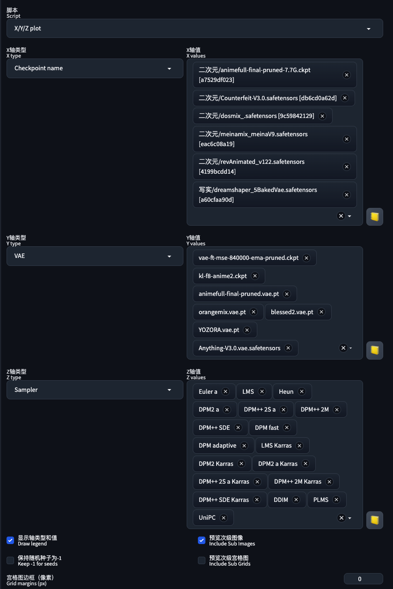 

生成后有的时候无法显示，那么也不要紧，到 `outputs/txt2img-grids` 查看

- x 横坐标模型
- y 纵坐标 VAE
- z 坐标采样器(多张)

	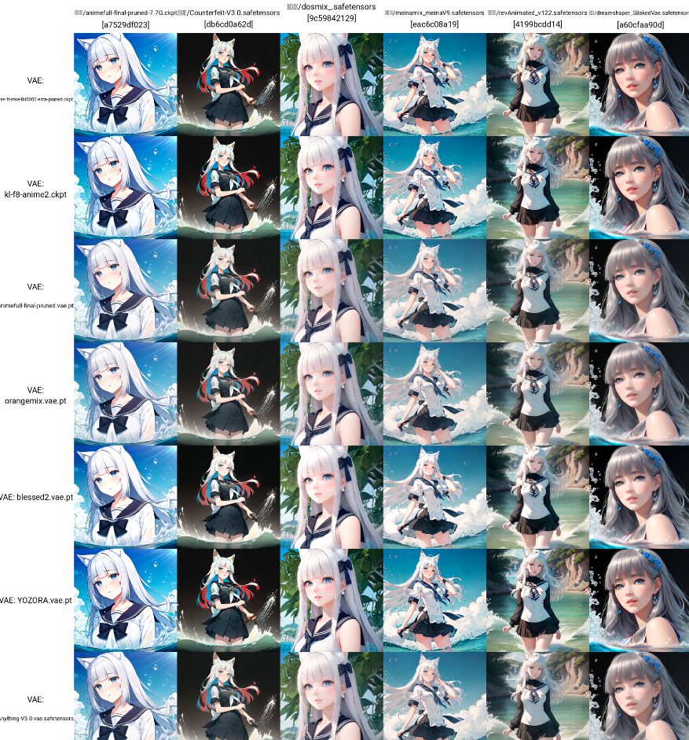 
	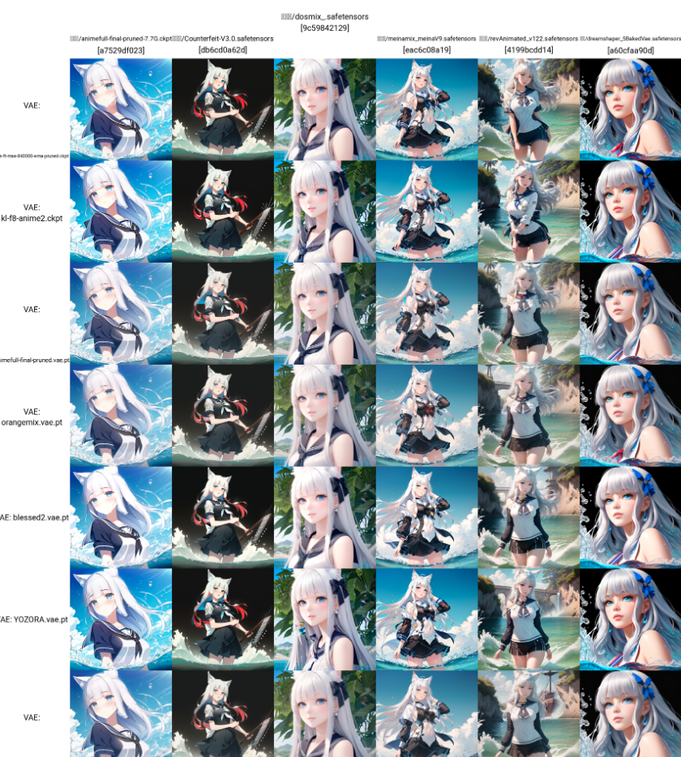 

## 6 图片信息
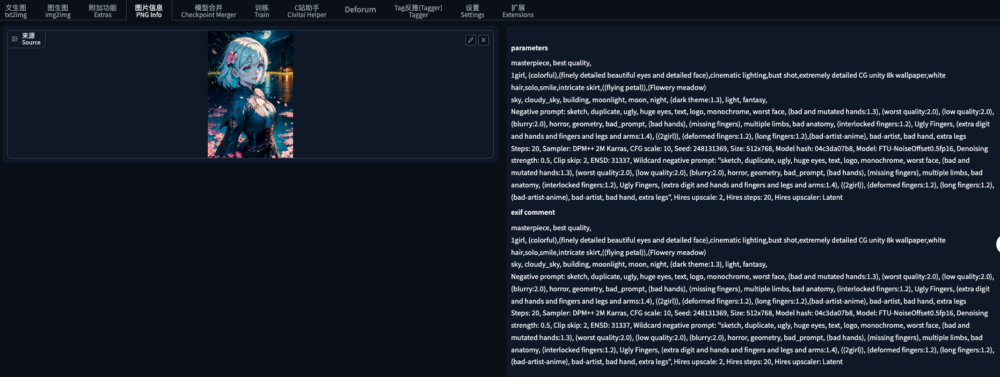 

这里可以识别所有从SD AI 生图的咒语，主要方法是从文件格式中读取隐藏咒语信息。所以是否是 AI 生成的图片，只要识别就可以知道。防止方法是需要用软件去掉 AI 咒语信息

## 7 [后期处理放大](https://www.bilibili.com/video/BV1Vm4y1t7Z5/?spm_id_from=333.788&vd_source=f6f37263151dcfb42f0a8663116bb22b)
放大或者精细重绘图主要的用处
### 方法步骤
- 进入附加功能
- 将放大图片放到单张图片中
- 放大算法
	- R-ESRGAN 4x+ Anime6B
- 其他参数不变
- 点生成

	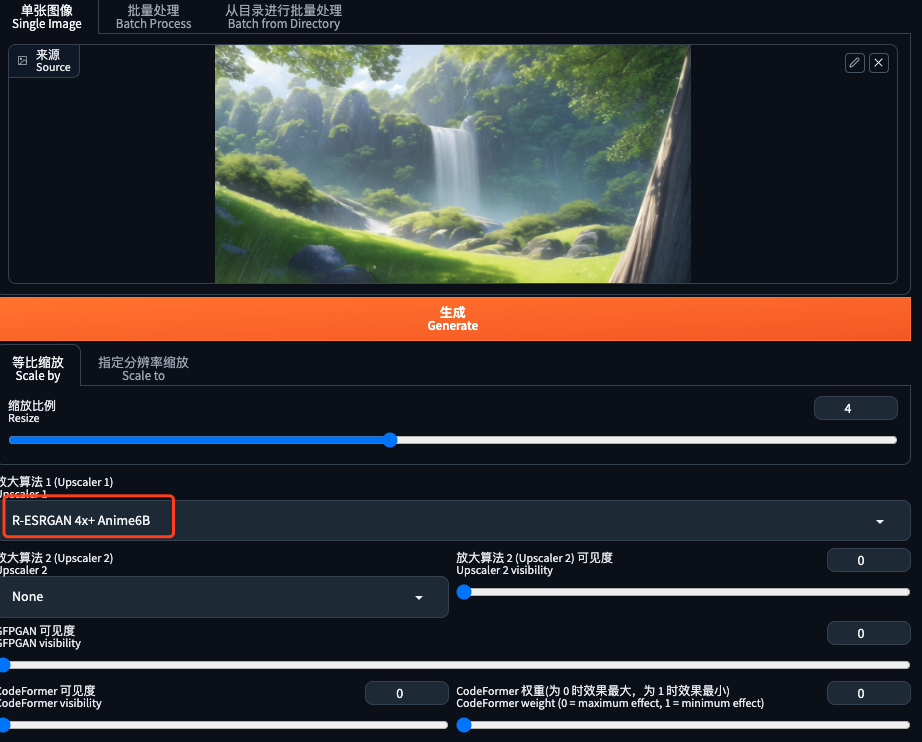  

### 对比结果
- 原图

	  
- 放大后

	  

## 8 [模版提示词](https://www.bilibili.com/video/BV1eh411M7RA/?spm_id_from=333.788&vd_source=f6f37263151dcfb42f0a8663116bb22b)
保存正向和反向提示词为模版
### 保存新提示词
- 进入图生图，输入好的提示词

	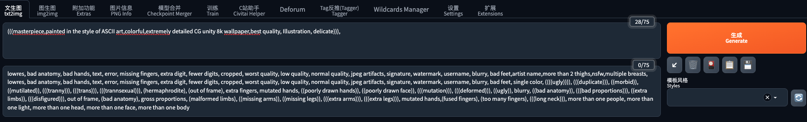
- 点击生成下保存按钮
	
	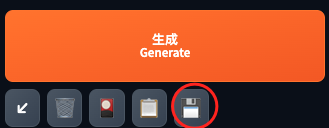
- 写下名字

	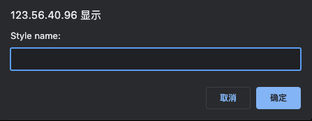
- 刷新模版查看

	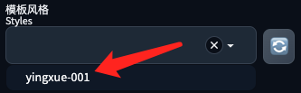

### 载入
- 选择模版			

	
- 点击载入

	
- 载入完毕

		

### 模版保存位置
	vi /home/pangzheng/sd/stable-diffusion-webui/styles.csv
### 存储格式
	name,prompt,negative_prompt
	yingxue-001,"(((masterpiece,painted in the style of ASCII art,colorful,extremely detailed CG unity 8k wallpaper,best quality, Illustration, delicate))), noon,beautiful detailed  water, yingxue-001 Standing in the water,Side Bow one's head by Taiyō Matsumoto,(solo), (fox_ears), blush,   {red|white|blue|pink}hair          , long_hair, (blunt bangs),intricately detailed face, ((mature female)), Blue eyes, expressive eyes, medium breasts, Bare breast, sailor,breeze, Splashing water droplets,","lowres, bad anatomy, bad hands, text, error, missing fingers, extra digit, fewer digits, cropped, worst quality, low quality, normal quality, jpeg artifacts, signature, watermark, username, blurry, bad feet,artist name,more than 2 thighs,nsfw,multiple breasts, lowres, bad anatomy, bad hands, text, error, missing fingers, extra digit, fewer digits, cropped, worst quality, low quality, normal quality, jpeg artifacts, signature, watermark, username, blurry, bad feet, single color, ((((ugly)))), (((duplicate))), ((morbid)), ((mutilated)), (((tranny))), (((trans))), (((trannsexual))), (hermaphrodite), (out of frame), extra fingers, mutated hands, ((poorly drawn hands)), ((poorly drawn face)), (((mutation))), (((deformed))), ((ugly)), blurry, ((bad anatomy)), (((bad proportions))), ((extra limbs)), (((disfigured))), out of frame, (bad anatomy), gross proportions, (malformed limbs), ((missing arms)), ((missing legs)), (((extra arms))), (((extra legs))), mutated hands,(fused fingers), (too many fingers), (((long neck))), more than one people, more than one light, more than one head, more than one face, more than one body"		
## 9 [Clip SKip](https://www.bilibili.com/video/BV1L24y157L4/?spm_id_from=333.337.search-card.all.click&vd_source=f6f37263151dcfb42f0a8663116bb22b)
Clip 简单来讲就是一个选择生成图片过程阶段的图片方案，因为在神经网络中，不一定最后一张是最好的，可能出现过拟合情况，具体查看[Clip原理](https://www.bilibili.com/video/BV16e4y127Kt/?spm_id_from=333.880.my_history.page.click) 
### 在 UI 层打开 Clip 控制
同 VAE 打开方式一样

- 跳转设置界面
- 找到 `User interface`
- 找到 `quicksettings list`

	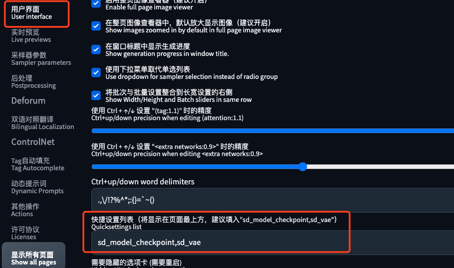
- 增加 `,CLIP_stop_at_last_layers`	

	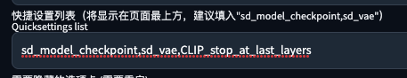
- 保存设置
- 重载UI
- 打开

	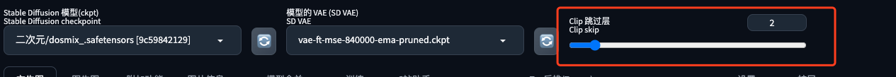		

### 选择 Clip 截断层数
- 使用 xyz 创造每层 Clip 对比画面
- x 轴选择 clip skip
- y 轴输入 clip 步数，如
	- 1,2,3,4,5,6,8,10,12

	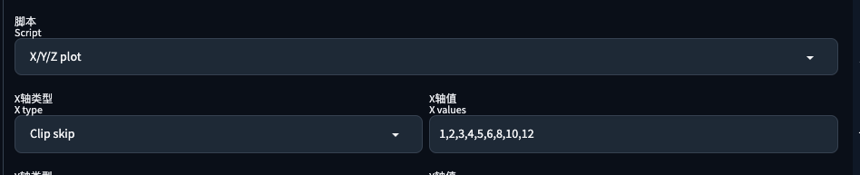	
- 点击生成

	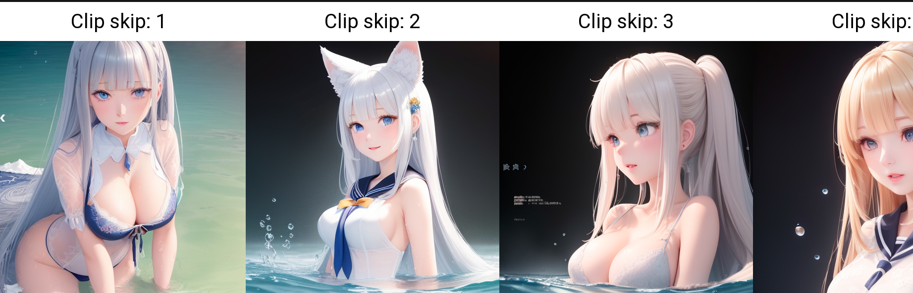
- 对比想要结果的步骤，批量生成的时候选择即可	

			
## 等待实验
- [NVIDIA CUDA® 深度神经网络库 (cuDNN) 是一个 GPU 加速的深度神经网络基元库](https://www.run.ai/guides/nvidia-cuda-basics-and-best-practices/nvidia-cudnn)
- [GPU 支持的 Ubuntu20 设置 cuda 工具包和 pytorch 安装](https://github.com/mailrocketsystems/CudaSetupUbuntu20)
- [官方说明](https://github.com/AUTOMATIC1111/stable-diffusion-webui/wiki/Features) 

									

		 		 

		 
		 
		 		   	