# 进阶功能
## 0 [基础功能](https://www.bilibili.com/video/BV1KX4y1B75H/?spm_id_from=333.788&vd_source=f6f37263151dcfb42f0a8663116bb22b)
## 1 插件管理器
Stable Diffusion 插件是必须要用的，官方更新后增加了插件管理器，方便插件管理
### 方法步骤
- 找寻插件管理器

	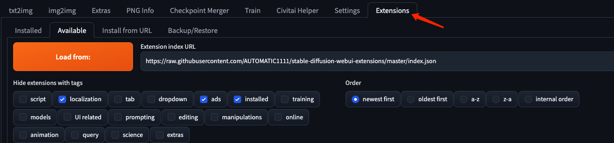
- 选择可安装,并载入，可以看见加载出来的可安装插件

	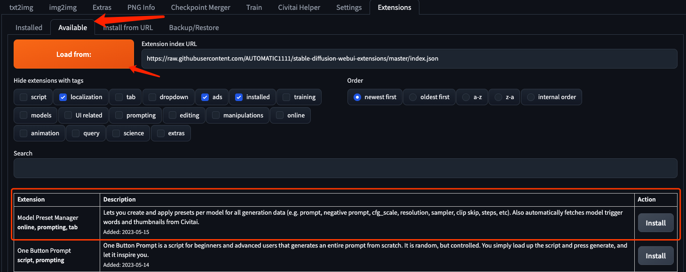
- 选择想使用的插件点击 install 即可
- 安装完毕后，到安装中去查看，并重启 UI 即可加载插件

	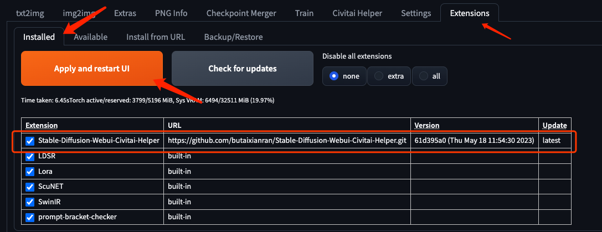
- 注意除了几个URL显示 built-in 外，网上下载的插件是可以检查插件的版本的和升级的

	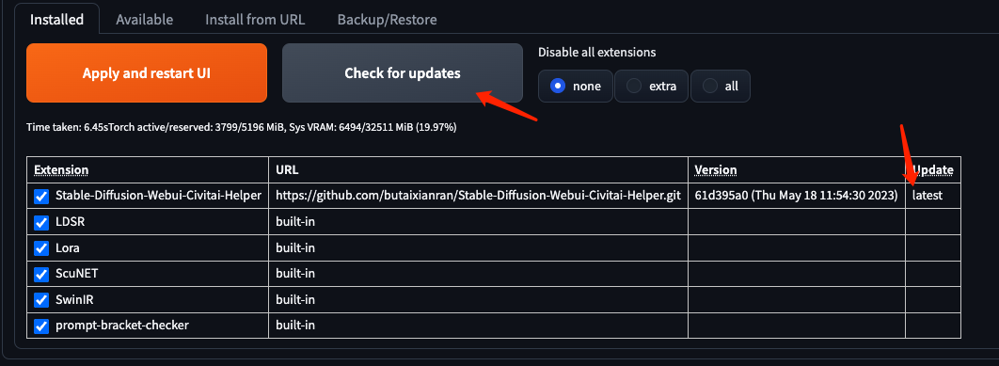

### 其他
除了使用插件管理器的安装方法，还可以从 git 下载插件包，然后放到以下目录

	/home/pangzheng/sd/stable-diffusion-webui/extensions
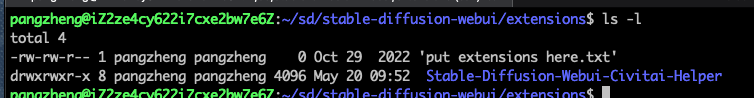	
		

## 2 [放大或者精细重绘图](https://www.bilibili.com/video/BV12s4y1o7VQ/?spm_id_from=333.999.0.0&vd_source=08dea42d6a3c14cf6e6f46ae4e350391)
放大或者精细重绘图主要的用处是

- 如果有一张跑图出来的样式很喜欢，但是有些地方很糊
- 或者出图小，但是我想放大到很大，比如4096

那么就需要用这个方法。

### 方法步骤
- 选用你绘图的模型
- 进入图生图界面
- 贴入你想放大的目标图
- 不要按图声称魔法语句，使用默认语句
- 配置参数
	- Resize mode
		- Just resize 或者 Just resize (latent upscale)  

			
	- Sampling method
		- DPM adaptive
		- Sampling steps
			- 42
		
		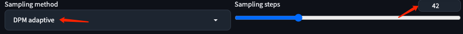
	- resize to
		- 原图尺寸
		
		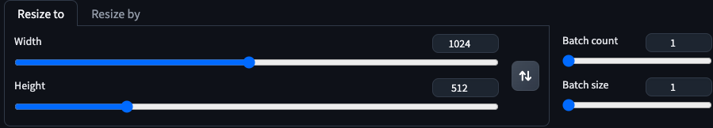
	- Denoising strength
		- 0.2

		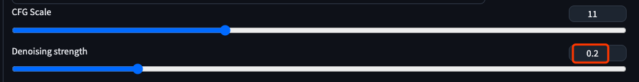
	- Script
		- SD upscale

		 	
	- Upscaler
		- R-ESRGAN 4x+ Anime6B

		 
		 
		 注意这里如果没看到，请到设置中打开，后重启服务，如图
		 
		 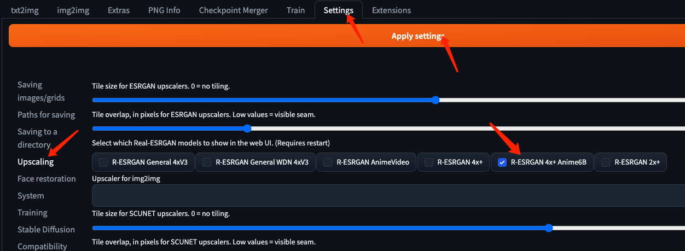
- 点击生成
	- 注意第一次要安装模型

			Downloading: "https://github.com/xinntao/Real-ESRGAN/releases/download/v0.2.2.4/RealESRGAN_x4plus_anime_6B.pth" to /data/home/pangzheng/stable-diffusion-webui/models/RealESRGAN/RealESRGAN_x4plus_anime_6B.pth
			
			100%|██████████| 17.1M/17.1M [17:32<00:00, 17.0kB/s] 
- 总参数

	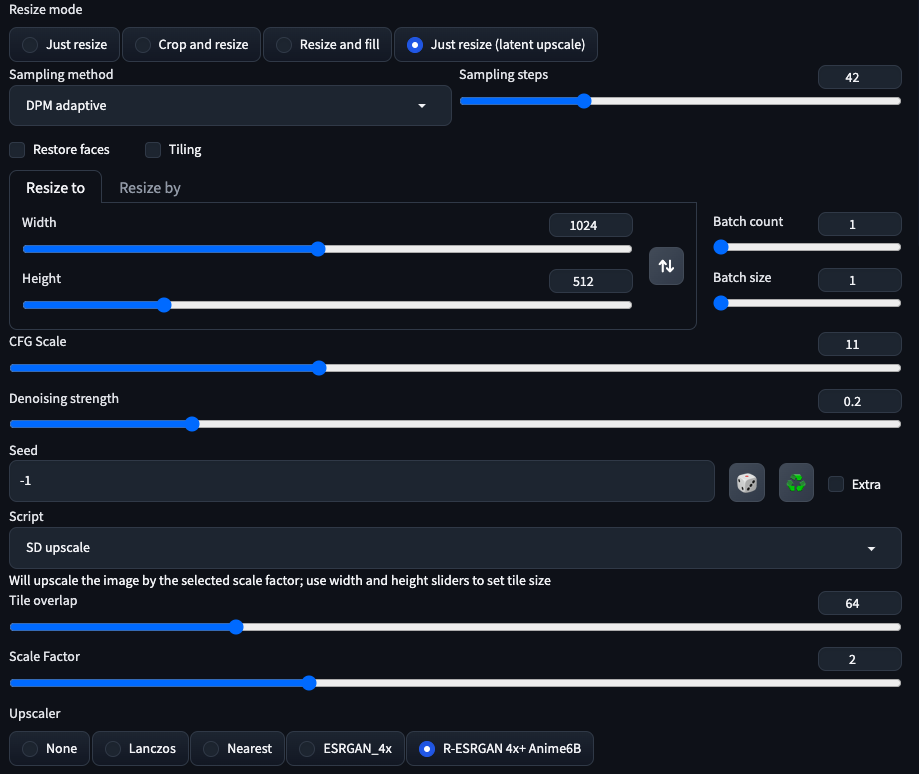	
- 对比图
	- 制作前

			
	- 制作后

			

## 3 [打开 VAE UI 显示](https://www.bilibili.com/video/BV1es4y1271Q/?spm_id_from=333.337.search-card.all.click&vd_source=f6f37263151dcfb42f0a8663116bb22b)
VAE 是各种模型用来细调的细节模型，这里我们想在我们的 UI 上打开它，需要在设置里设置

- 跳转设置界面
- 找到 `quicksettings list`

	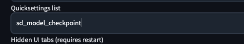
- 增加 `,sd_vae`	

	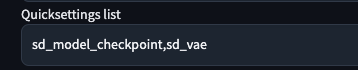
- 保存设置
- 重载UI
- 打开

	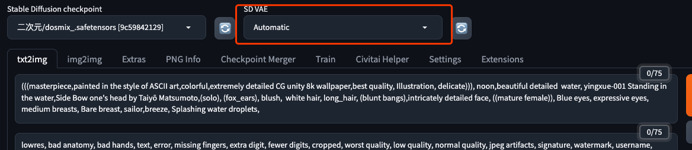		

## 4 网络加速
以 Ubuntu Server 为例
### 4.1 [安装加速客户端](https://github.com/enpenguc/linux-backup/blob/master/doc/Ubuntu%20Server%E5%AE%89%E8%A3%85shadowsocks%E5%AE%A2%E6%88%B7%E7%AB%AF.md)
- 预备

		# 如果 python-pip 没安装，则安装。安装忽略
		# 检查注意版本
		 python3.10 -m pip --version
			pip 23.1.2 from /home/pangzheng/.local/lib/python3.10/site-packages/pip (python 3.10)
		# 系统安装的pip 太老，需要代码安装
		# 卸载
		$ sudo apt-get remove python3-pip
		# 安装
		$ curl -sS https://bootstrap.pypa.io/get-pip.py | python3.10
		# 升级
		$ python3.10 -m pip install --upgrade pip
			Defaulting to user installation because normal site-packages is not writeable
			Looking in indexes: http://mirrors.cloud.aliyuncs.com/pypi/simple/
			Requirement already satisfied: pip in ./.local/lib/python3.10/site-packages (23.1.2)
- 安装 ss

		# 安装ss
		$ pip install shadowsocks
- 配置

		# 配置文件shadowsocks.json文件
		$ sudo vi /etc/shadowsocks.json

		{
		  "server": "您服务器地址",
		  "server_port": 12346,
		  "local_address": "127.0.0.1",
		  "local_port": 1080,
		  "password": "密码",
		  "timeout": 600,
		  "method": "aes-256-gcm"
		}
- 启动服务

		# 后台启动（此命令启动后，会启动一个sock5代理服务）
		$ sslocal -c /etc/shadowsocks.json -d start
		
		# 查看启动进程
		$ ps -ef | grep sslocal
		
		pangzhe+  685225       1  0 17:32 ?        00:00:00 /usr/bin/python3.10 /home/pangzheng/.local/bin/sslocal -c /etc/shadowsocks.json -d start
		pangzhe+  685255  681109  0 17:33 pts/1    00:00:00 grep --color=auto sslocal

### 4.2 [安装 socks5 转 http](https://jerry.red/327/ubuntu%E4%B8%AD%E5%B0%86socks5-%E8%BD%AC%E4%B8%BAhttp)
privoxy有将socks代理转为http代理的功能。

- 安装privoxy

		sudo apt-get install privoxy
- 配置provoxy

		sudo vim /etc/privoxy/config
- 配置内容

		.....
		forward-socks5   /               127.0.0.1:1080 .
		.....
		listen-address localhost:8118
		.....
- 重启privoxy：

		sudo service privoxy restart
- 测试

		curl -x localhost:8118 http://www.google.com 

### 4.3 配置 Git 加速
配置下面命令

	git config --global http.proxy http://127.0.0.1:8118
			
### 4.4 错误处理
- AttributeError: module 'collections' has no attribute 'MutableMapping'

	由于在 3.10 版本中更改了内部结构，因此必须使用两种不同的方式来导入此 mutablemapping 模块。导致错误
	
	- 报错
	
			$ sslocal -version
			Traceback (most recent call last):
			  File "/home/pangzheng/.local/bin/sslocal", line 5, in <module>
			    from shadowsocks.local import main
			  File "/home/pangzheng/.local/lib/python3.10/site-packages/shadowsocks/local.py", line 27, in <module>
			    from shadowsocks import shell, daemon, eventloop, tcprelay, udprelay, asyncdns
			  File "/home/pangzheng/.local/lib/python3.10/site-packages/shadowsocks/udprelay.py", line 71, in <module>
			    from shadowsocks import encrypt, eventloop, lru_cache, common, shell
			  File "/home/pangzheng/.local/lib/python3.10/site-packages/shadowsocks/lru_cache.py", line 33, in <module>
			    class LRUCache(collections.MutableMapping):
			AttributeError: module 'collections' has no attribute 'MutableMapping'
	- [解决方案](https://www.datasciencelearner.com/attributeerror-module-collections-has-no-attribute-mutablemapping/)

			vi /home/pangzheng/.local/lib/python3.10/site-packages/shadowsocks/lru_cache.py
			
			...
			class LRUCache(collections.MutableMapping):
			...
			修改成
			...
			class LRUCache(collections.abc.MutableMapping):
			...
- Shadowsocks: Undefined Symbol
	- 错误 
		
			sslocal -c /etc/shadowsocks.json -d start
			INFO: loading config from /etc/shadowsocks.json
			2023-05-20 16:35:12 INFO     loading libcrypto from libcrypto.so.1.1
			Traceback (most recent call last):
			  File "/home/pangzheng/.local/bin/sslocal", line 8, in <module>
			    sys.exit(main())
			  File "/home/pangzheng/.local/lib/python3.10/site-packages/shadowsocks/local.py", line 39, in main
			    config = shell.get_config(True)
			  File "/home/pangzheng/.local/lib/python3.10/site-packages/shadowsocks/shell.py", line 262, in get_config
			    check_config(config, is_local)
			  File "/home/pangzheng/.local/lib/python3.10/site-packages/shadowsocks/shell.py", line 124, in check_config
			    encrypt.try_cipher(config['password'], config['method'])
			  File "/home/pangzheng/.local/lib/python3.10/site-packages/shadowsocks/encrypt.py", line 44, in try_cipher
			    Encryptor(key, method)
			  File "/home/pangzheng/.local/lib/python3.10/site-packages/shadowsocks/encrypt.py", line 82, in __init__
			    self.cipher = self.get_cipher(key, method, 1,
			  File "/home/pangzheng/.local/lib/python3.10/site-packages/shadowsocks/encrypt.py", line 109, in get_cipher
			    return m[2](method, key, iv, op)
			  File "/home/pangzheng/.local/lib/python3.10/site-packages/shadowsocks/crypto/openssl.py", line 76, in __init__
			    load_openssl()
			  File "/home/pangzheng/.local/lib/python3.10/site-packages/shadowsocks/crypto/openssl.py", line 52, in load_openssl
			    libcrypto.EVP_CIPHER_CTX_cleanup.argtypes = (c_void_p,)
			  File "/usr/lib/python3.10/ctypes/__init__.py", line 387, in __getattr__
			    func = self.__getitem__(name)
			  File "/usr/lib/python3.10/ctypes/__init__.py", line 392, in __getitem__
			    func = self._FuncPtr((name_or_ordinal, self))
			AttributeError: /lib/x86_64-linux-gnu/libcrypto.so.1.1: undefined symbol: EVP_CIPHER_CTX_cleanup. Did you mean: 'EVP_CIPHER_CTX_new'?
	- [解决方案](https://www.yangyang.cloud/blog/2020/09/23/solved-shadowsocks-undefined-symbol/)
	
			sudo sudo sed -i 's/EVP_CIPHER_CTX_cleanup/EVP_CIPHER_CTX_reset/g' /home/pangzheng/.local/lib/python3.10/site-packages/shadowsocks/crypto/openssl.py
					
## 等待实验
- [NVIDIA CUDA® 深度神经网络库 (cuDNN) 是一个 GPU 加速的深度神经网络基元库](https://www.run.ai/guides/nvidia-cuda-basics-and-best-practices/nvidia-cudnn)
	- [GPU 支持的 Ubuntu20 设置 cuda 工具包和 pytorch 安装](https://github.com/mailrocketsystems/CudaSetupUbuntu20)

									

		 		 

		 
		 
		 		   	