# Zapier + GPT + RSS
## 1 先觉条件
### 1.1 需要查看 [Zapier+Flowies 消息采集分析工作流测试](https://github.com/pangzheng/BOOKS/blob/master/%E6%8A%80%E6%9C%AF/AI/Zapier/Zapier%2BFlowies%20%E6%B6%88%E6%81%AF%E9%87%87%E9%9B%86%E5%88%86%E6%9E%90%E5%B7%A5%E4%BD%9C%E6%B5%81%E6%B5%8B%E8%AF%95.md)
### 1.2 获取 RSS feed 
#### 1.2.1  CNN RSS feed
- google 搜索 cnn rss
	
	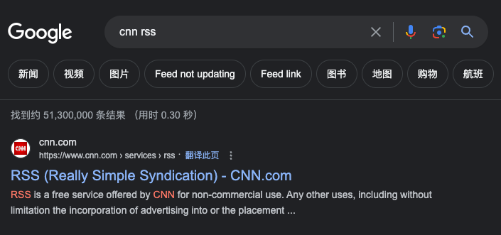
- 点击打开 cnn rss 地址，查看最新的 rss 

	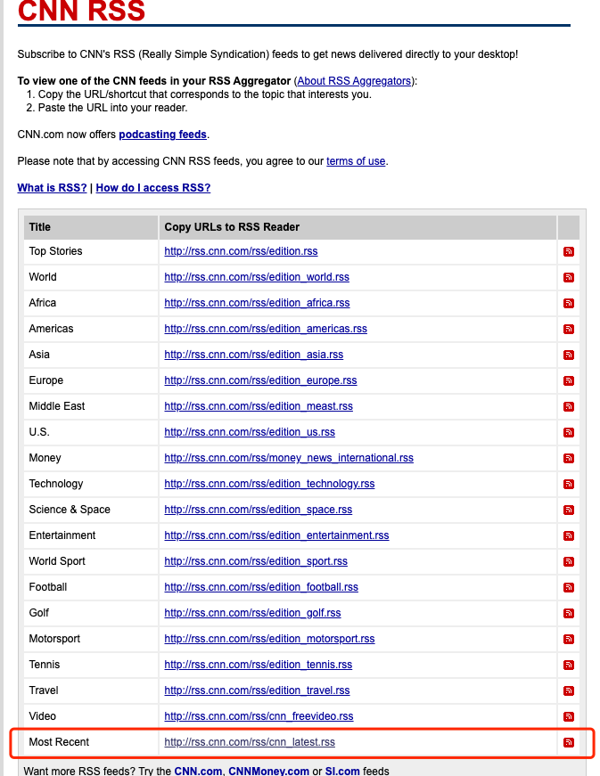
- 点击打开查看是否正常

	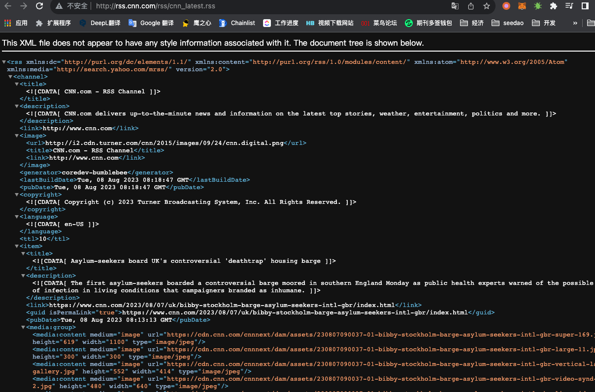
- 记录 rss 链接

		http://rss.cnn.com/rss/cnn_latest.rss

#### 1.2.2 其他 RSS feed

## 2 创建 zap 工作流			
### 2.1  设置启动
1. 前往 [zapier](https://zapier.com/app/dashboard)
2. 单击创建

	

### 2.2 创建触发器
1. 搜索 RSS 触发器
	
	
2. 选择多 feeds 触发事件

	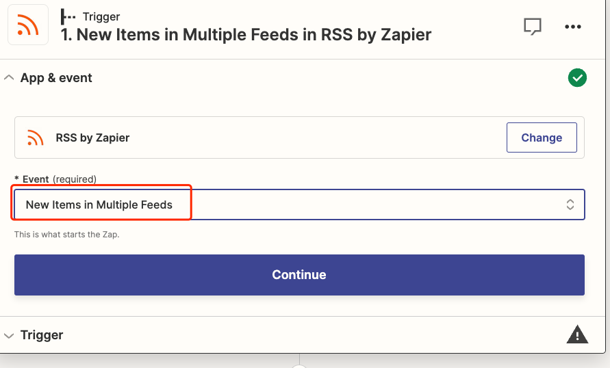
3. 将上步 rss 地址填写在这里

	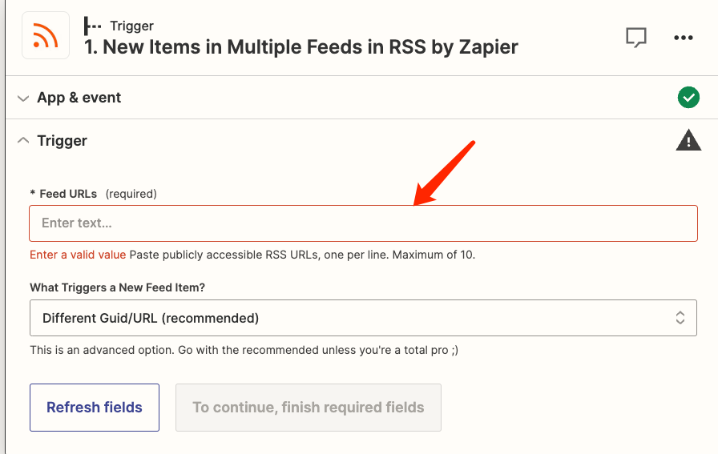
	
	填入数据
		
	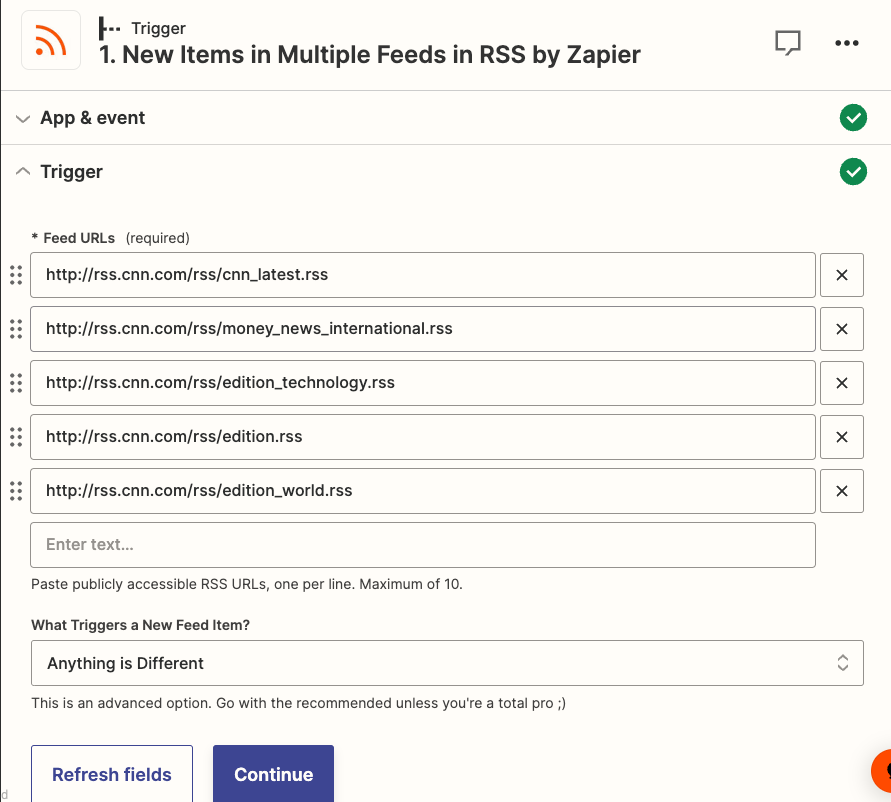
4. 设置1条新的消息来后如何处理，选择任何一条，因为我们不想漏掉任意一条

	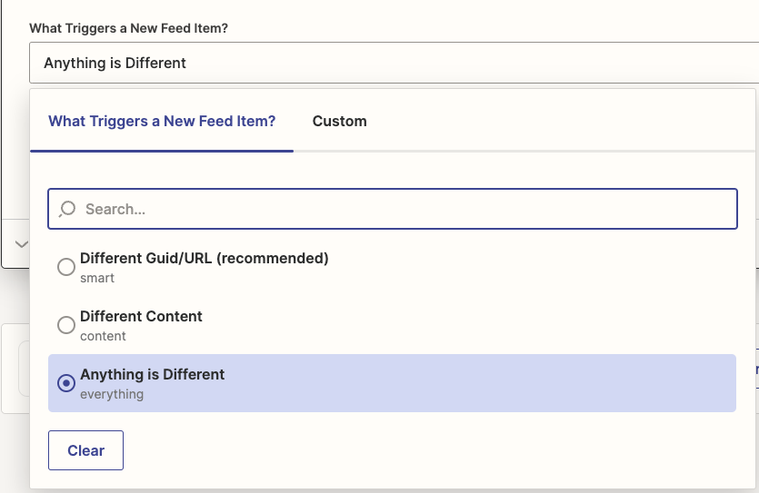
5. 点击测试

	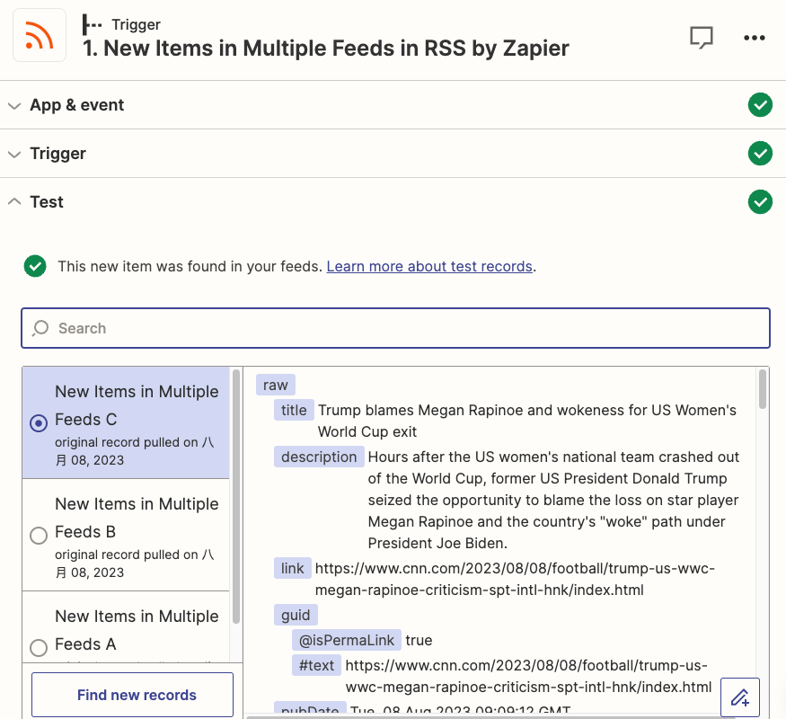
6. 数据格式

		raw
			title Trump blames Megan Rapinoe and wokeness for US Women's World Cup exit
		description Hours after the US women's national team crashed out of the World Cup, former US President Donald Trump seized the opportunity to blame the loss on star player Megan Rapinoe and the country's "woke" path under President Joe Biden.
		link https://www.cnn.com/2023/08/08/football/trump-us-wwc-megan-rapinoe-criticism-spt-intl-hnk/index.html
		guid
			@isPermaLink true
			#text https://www.cnn.com/2023/08/08/football/trump-us-wwc-megan-rapinoe-criticism-spt-intl-hnk/index.html
		pubDate Tue, 08 Aug 2023 09:09:12 GMT
		group
			content
				1
					@medium image
					@url https://cdn.cnn.com/cnnnext/dam/assets/230808143447-megan-rapinoe-super-169.jpg
					@height 619
					@width 1100
					@type image/jpeg
				2
					@medium image
					@url https://cdn.cnn.com/cnnnext/dam/assets/230808143447-megan-rapinoe-large-11.jpg
					@height 300
					@width 300
					@type image/jpeg
				3
					@medium  image
					@url https://cdn.cnn.com/cnnnext/dam/assets/230808143447-megan-rapinoe-vertical-large-gallery.jpg
					@height 552
					@width  414
					@type image/jpeg
				4
					@medium image
					@url https://cdn.cnn.com/cnnnext/dam/assets/230808143447-megan-rapinoe-video-synd-2.jpg
					@height 480
					@width 640
					@type image/jpeg
				5
					@medium image
					@url https://cdn.cnn.com/cnnnext/dam/assets/230808143447-megan-rapinoe-live-video.jpg
					@height 324
					@width 576
					@type image/jpeg
				6 	
					@medium image
					@url https://cdn.cnn.com/cnnnext/dam/assets/230808143447-megan-rapinoe-t1-main.jpg
					@height 250
					@width 250
					@type image/jpeg
				7 
					@medium image
					@url https://cdn.cnn.com/cnnnext/dam/assets/230808143447-megan-rapinoe-vertical-gallery.jpg
					@height 360
					@width 270
					@type image/jpeg
				8
					@medium image
					@url https://cdn.cnn.com/cnnnext/dam/assets/230808143447-megan-rapinoe-story-body.jpg
					@height 169
					@width 300
					@type image/jpeg
				9 	
					@medium image
					@url https://cdn.cnn.com/cnnnext/dam/assets/230808143447-megan-rapinoe-t1-main.jpg
					@height 250
					@width 250
					@type image/jpeg
				10
					@medium image
					@url https://cdn.cnn.com/cnnnext/dam/assets/230808143447-megan-rapinoe-assign.jpg
					@height 186
					@width 248
					@type image/jpeg
				11
					@medium image
					@url https://cdn.cnn.com/cnnnext/dam/assets/230808143447-megan-rapinoe-hp-video.jpg
					@height 144
					@width 256
					@type image/jpeg
		guid https://www.cnn.com/2023/08/08/football/trump-us-wwc-megan-rapinoe-criticism-spt-intl-hnk/index.html
		pubDate Tue, 08 Aug 2023 09:09:12 GMT
		link https://www.cnn.com/2023/08/08/football/trump-us-wwc-megan-rapinoe-criticism-spt-intl-hnk/index.html
		title Trump blames Megan Rapinoe and wokeness for US Women's World Cup exit
		description Hours after the US women's national team crashed out of the World Cup, former US President Donald Trump seized the opportunity to blame the loss on star player Megan Rapinoe and the country's "woke" path under President Joe Biden.
		content
		id raw:b6d616e9c1d7f05787f590f309a46fc0

### 2.3 过滤器设置
1. 点击添加过滤器

	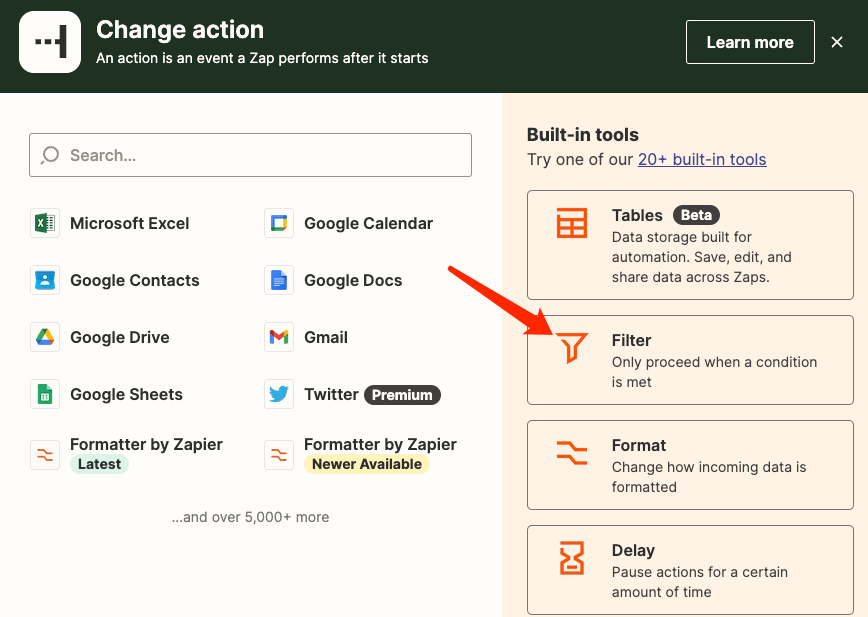
	
	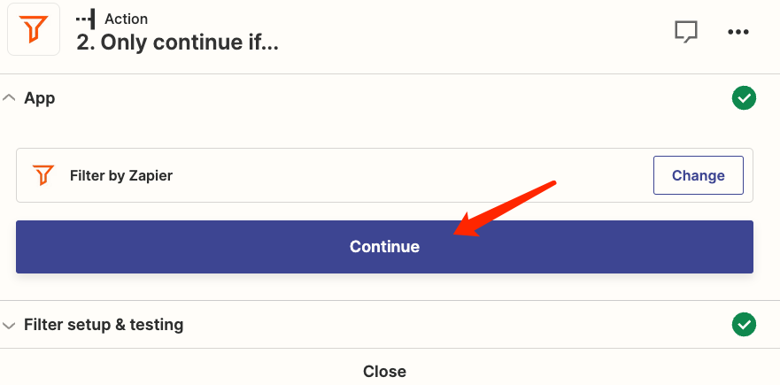
2. 设置不需要处理的信息，例子中增加乌克兰是因为如果添加了没有的数据，那么这个流程将无法测试
	- 过滤字段名
	- 过滤动作
	- 过滤值
	
	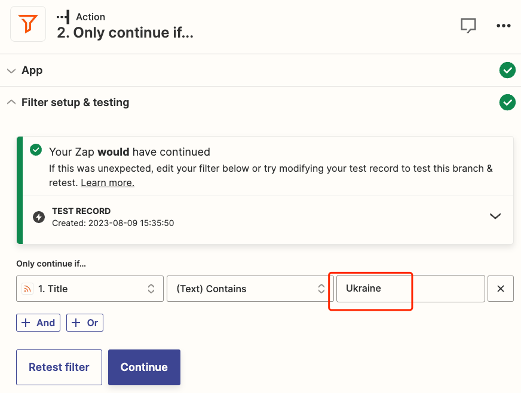

### 2.4 页面解析器
这个工具可以让我们抓取页面所有内容

1. 添加网页解析器

	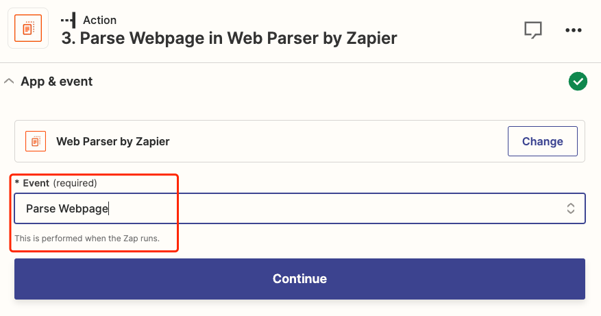
2. 分析页面

	这里从获取的 RSS 推送消息标题对应的文章内容链接，并分析
	
	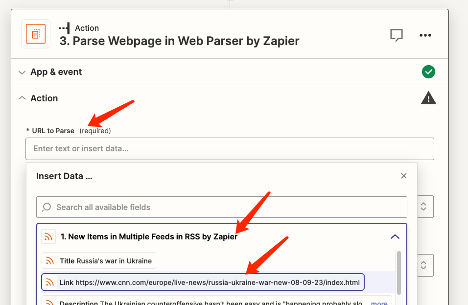	
3. 内容格式,选择 text	
					
	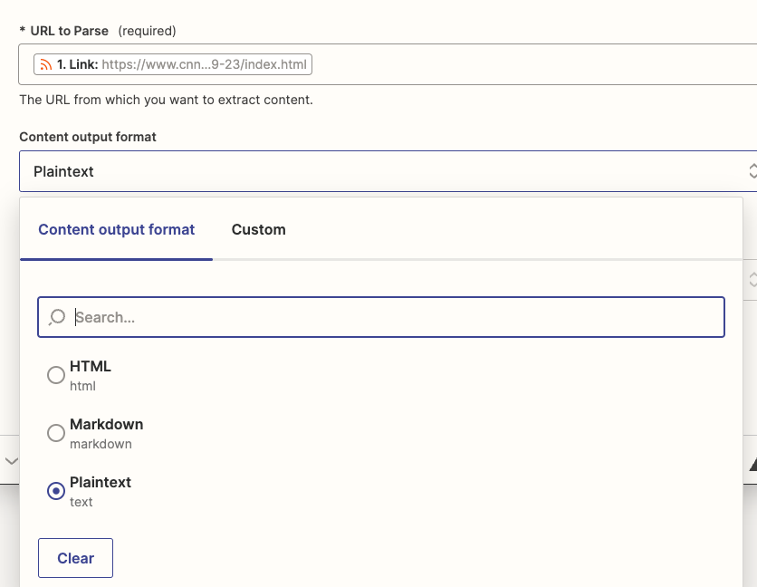
4. 抓取失败，流程将不在继续

	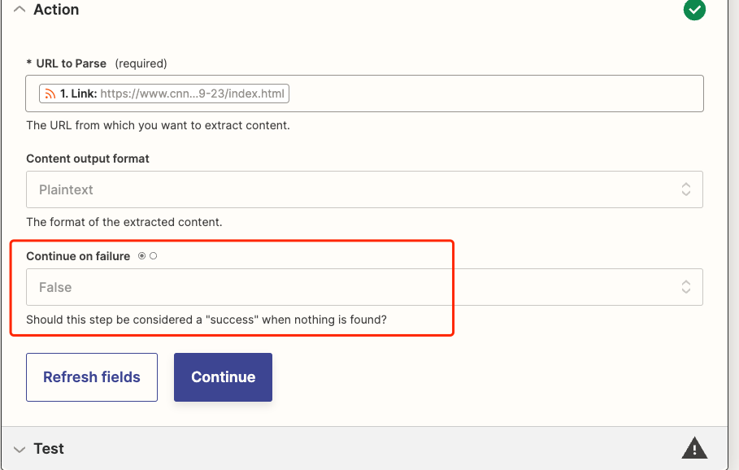		
5. 分析测试，点击 `test action`

	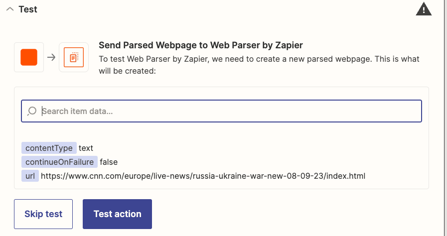
6. 测试抓取结果
	- 链接
	- 标题
	- 全文
	- 作者(可能没有)
	- 发表时间
	
	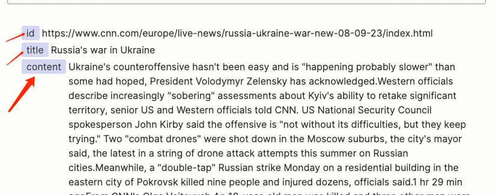
	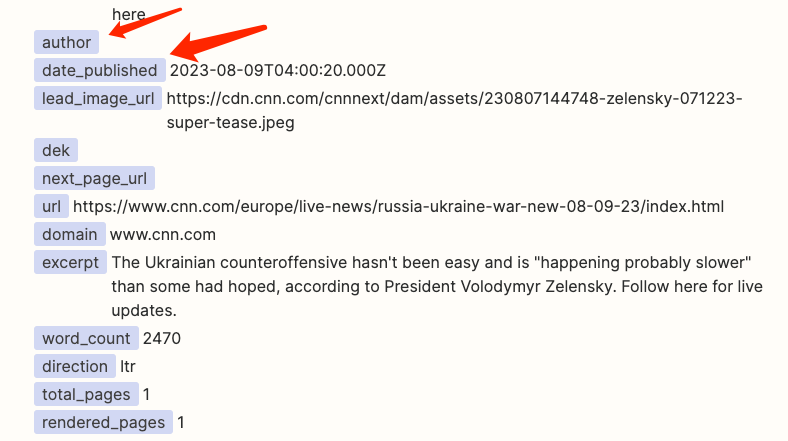	

### 2.5 添加 GPT AI 模块
1. 搜索 GPT 模块

	
2. 事件选择对话模式

	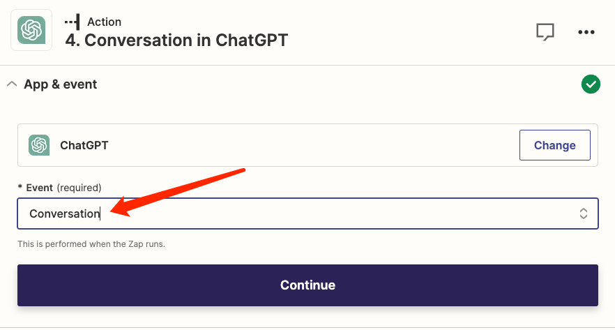	
3. 验证 GPT

	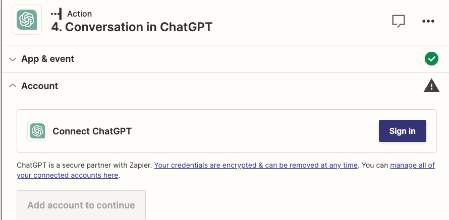
4. 填入 GPT apikey

	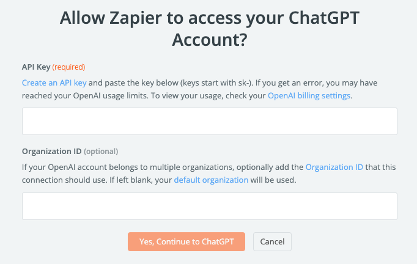
5. 验证成功

	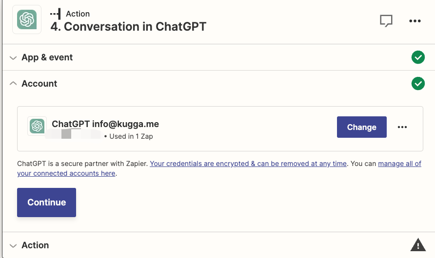
6. 设置 GPT 对话信息

	
		Based on this article: ( $选择文章内容)
		Author: ($ 选择作者字段)
		Source:($ 选择网站)
		
		Generate in a bullet list format the following:
		
		1.   Use 1-10 to analyze article  content reliability，1 is unreliable and 10 is most reliable
		2.   Use 1-10 to analyze the area security degree,with 1 being the least secure and 10 the most secure
		3.   1 sentence summary of the article, the authors name, and summarize in 3-5 words the tone of the article
		
		The above list gives the Chinese translation
	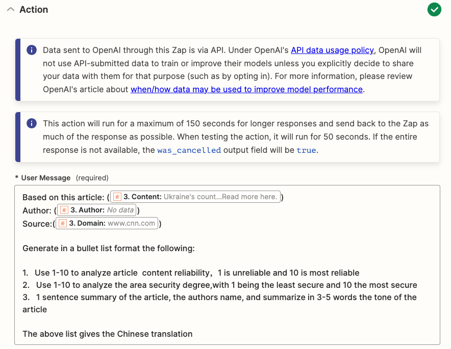
7. GPT 身份信息，这块默认

	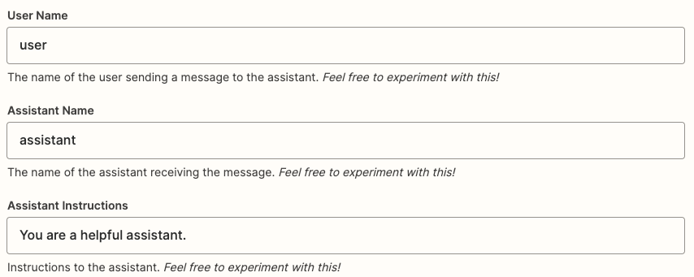
8. 模型选择最新的，当前只有 `gpt3.5-t-16k`

	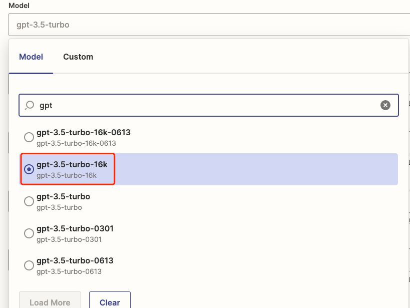
9. 记忆模块 ID，如果多个人格 AI 要区分

	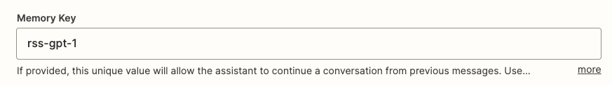
10. 其余参数默认，比如最大输出 token

	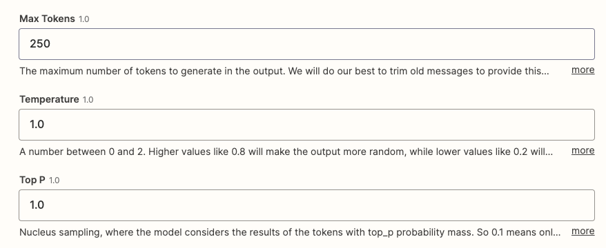
11. 整体参数如

		assistant_name assistant
		max_tokens 250
		memory_key rss-gpt-1
		model gpt-3.5-turbo-16k
		system_message You are a helpful assistant.
		temperature 1.0
		top_p 1.0
		user_message 	Based on this article: (Ukraine's counteroffensive hasn't been easy and is "happening probably slower" than some had hoped, President Volodymyr Zelensky has acknowledged.Western officials describe incre
		...said.Multiple officials said the approach of fall, when weather and fighting conditions are expected to worsen, gives Ukrainian forces a limited window to push forward.Read more here.)
						Author: ({{_GEN_1691484693854__author}})
						Source:(www.cnn.com)
		
						Generate in a bullet list format the following:
						
						1.   Use 1-10 to analyze article  content reliability，1 is unreliable and 10 is most reliable
						2.   Use 1-10 to analyze the area security degree,with 1 being the least secure and 10 the most secure
						3.   1 sentence summary of the article, the authors name, and summarize in 3-5 words the tone of the article
						
						The above list gives the Chinese translation
		user_name user						
12. 测试

	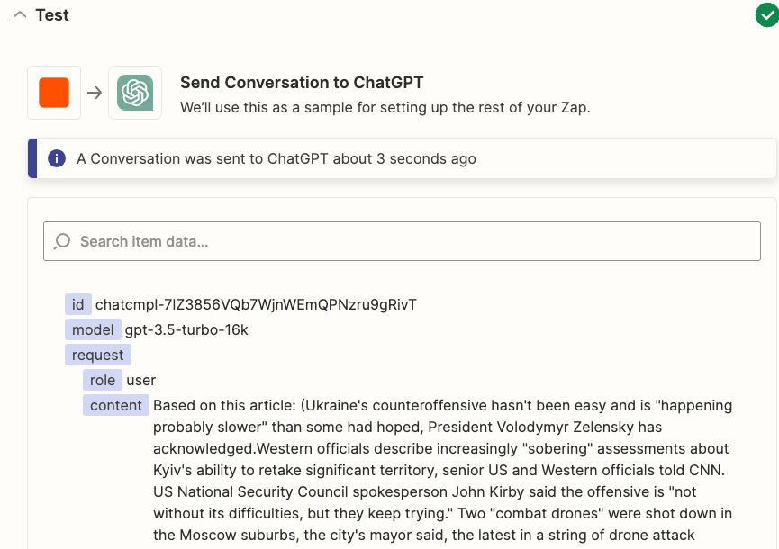	
	
	
		
## 参考
[ChatGPT and Zapier for Efficient RSS Feed Analysis | Tutorial](https://www.youtube.com/watch?v=2wQM9xmYRt0)