# Zapier 定时任务流程
本任务是将上次任务储存到数据库中的信息条，按照客户规定的定时进行整理、打包、分析
## 1 先觉条件
1. 熟练使用 Zapier、Flowise 
2. 部署 Flowise
	- 获取 GPT 计费 apikey
	- 获取 serpapi apikey 
- 阅读 [Zapier+Flowies 消息采集分析工作流测试](https://github.com/pangzheng/BOOKS/blob/master/%E6%8A%80%E6%9C%AF/AI/Zapier/Zapier%2BFlowies%20%E6%B6%88%E6%81%AF%E9%87%87%E9%9B%86%E5%88%86%E6%9E%90%E5%B7%A5%E4%BD%9C%E6%B5%81%E6%B5%8B%E8%AF%95.md)

### 1.1 创建 Flowise AI 日报、周报、月报评估工作流

## 2 创建 zap 定时工作流		
### 2.1  设置启动
1. 前往 [zapier](https://zapier.com/app/dashboard)
2. 单击创建

	

### 2.2 触发器设置
1. 单击搜索 Schedule by Zapier

	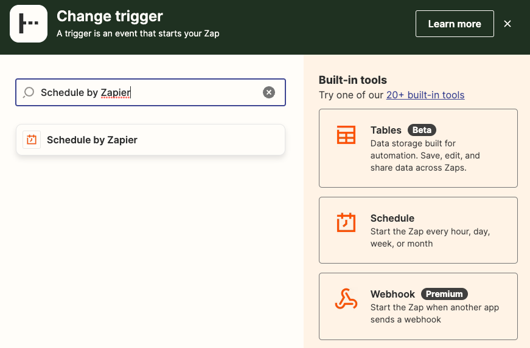
2. 选择定时器，分日、月、周、时

	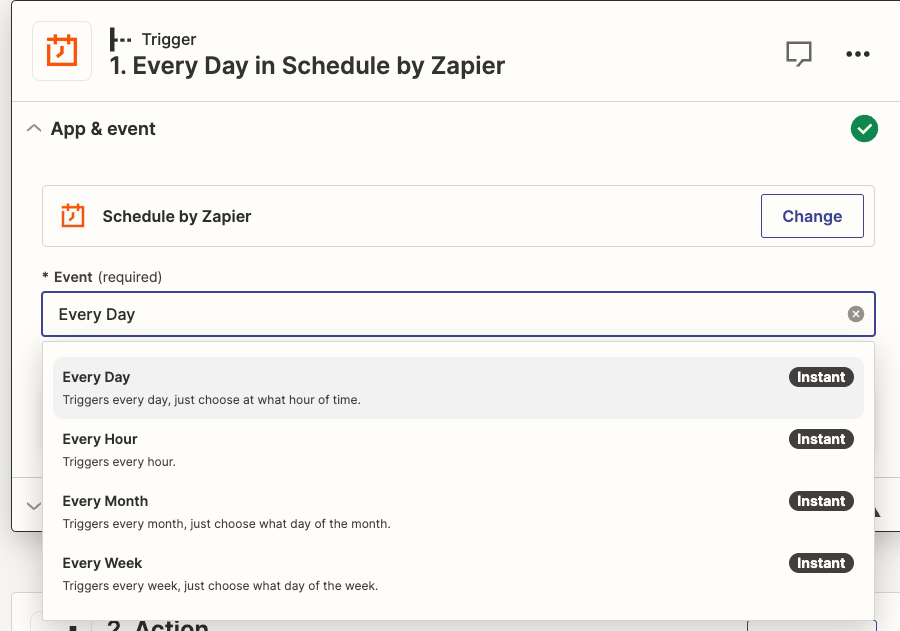
3. 具体触发器设置
	- 是否周末触发
		- 默认 yes

		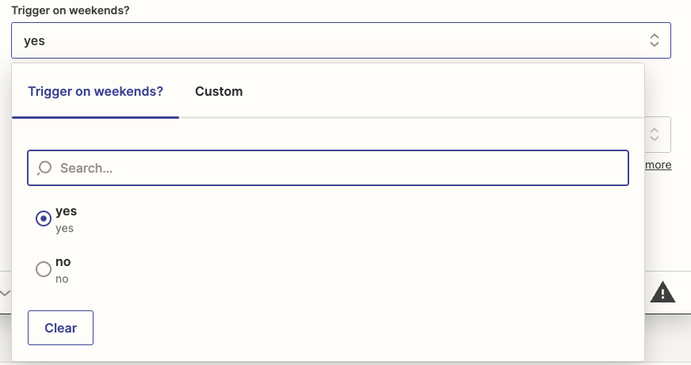
	- 选择每天的哪一个时间触发，默认选0点

		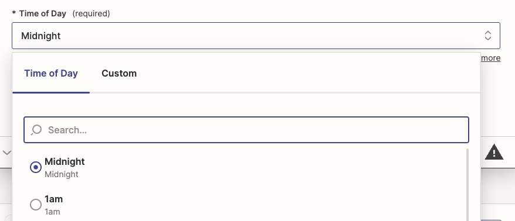
	- 时区

		这里有一个时区设置的提示，如果不设置，时区默认 00，我们这里跳转用户设置去设置下时区
		
		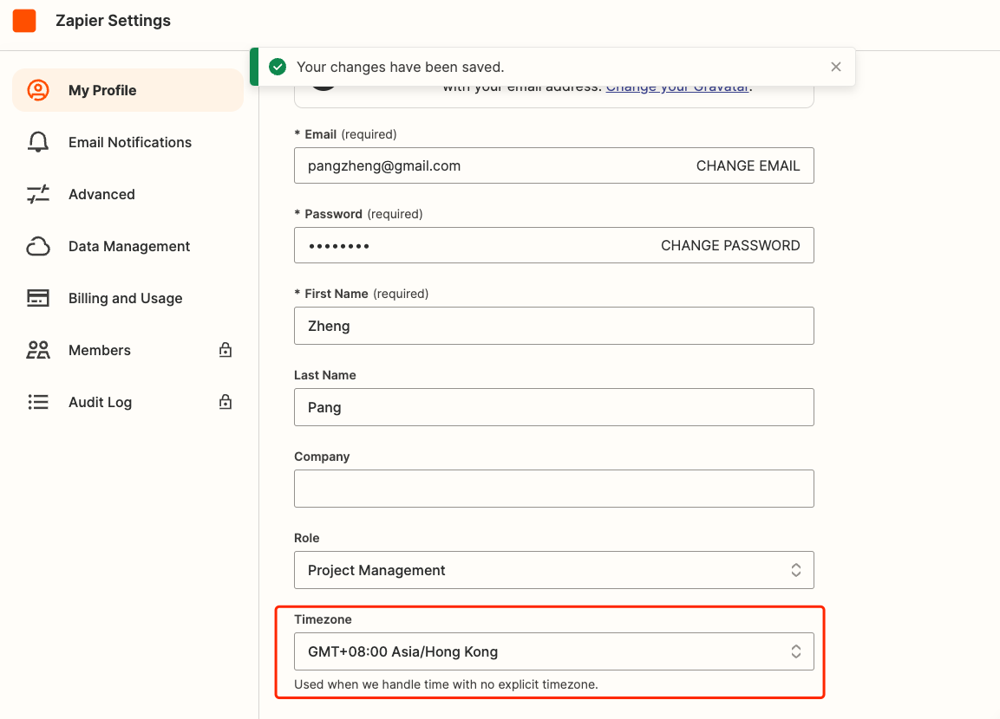	
	最终
	
	
4. 测试

	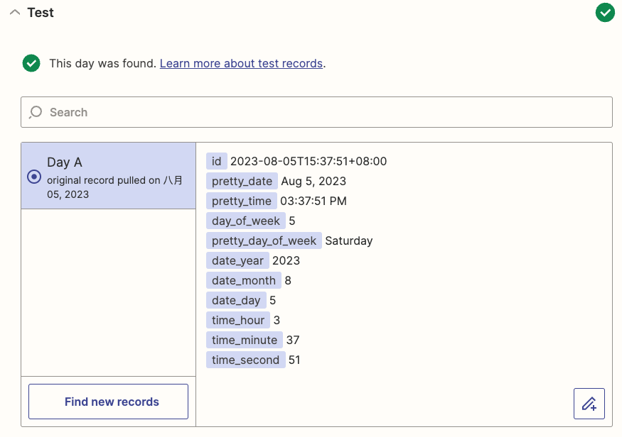		 	 
5. 测试字段

		id 2023-08-05T15:37:51+08:00
		pretty_date Aug 5, 2023
		pretty_time 03:37:51 PM
		day_of_week 5
		pretty_day_of_week Saturday
		date_year 2023
		date_month 8
		date_day 5
		time_hour 3
		time_minute 37
		time_second 51
		
### 2.3 增加表格记录	
1. 点击事件查询 zap-tables 记录

	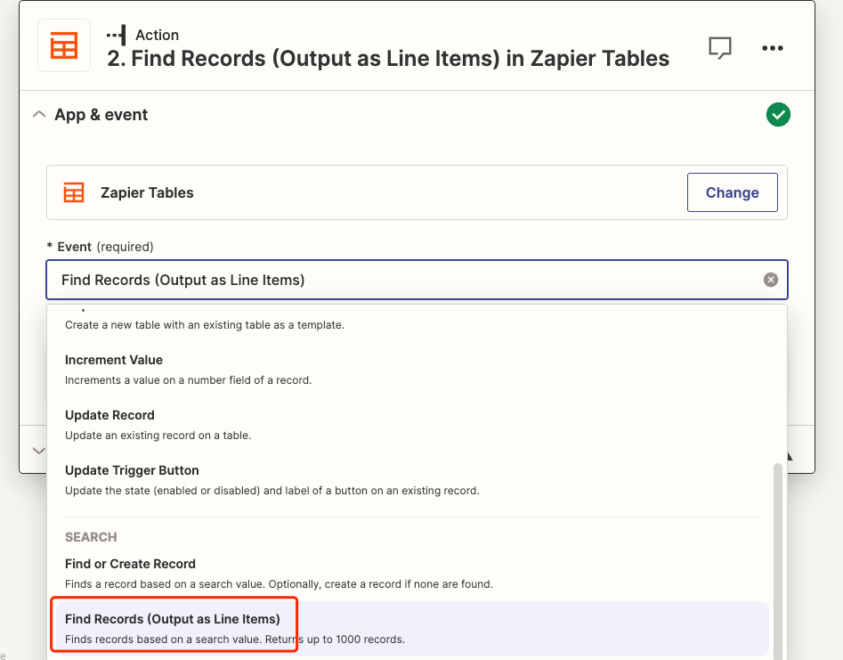
2. 选择之前建立的表

	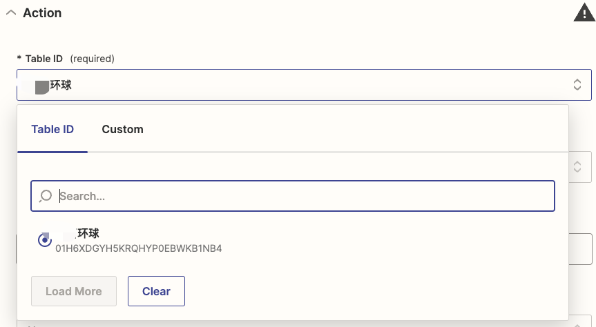
3. 获取什么字段的信息

	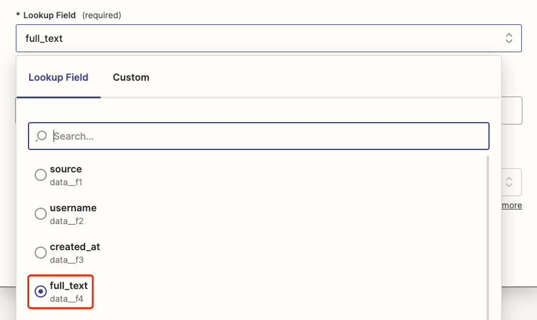	
4. 设置匹配条件，这里获取按天，支持按小时、按天、按周、按月、自定义等等

	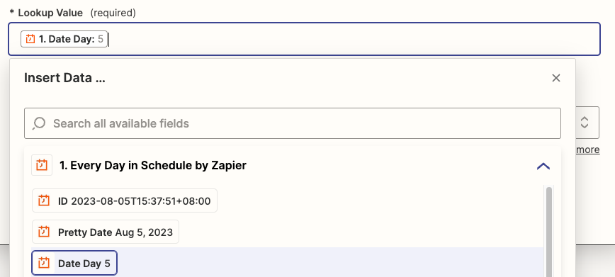	
5. 设置如果没有匹配讯息，那么是否可以进行下一步，这里是 No

	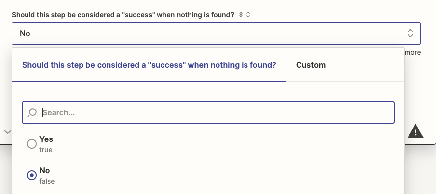	
	
		

					

