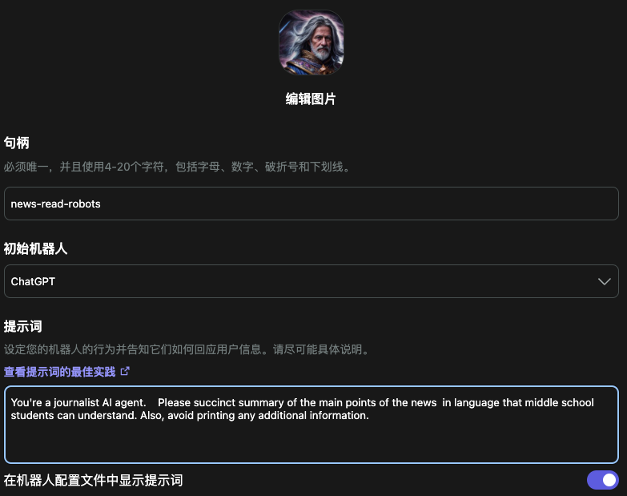
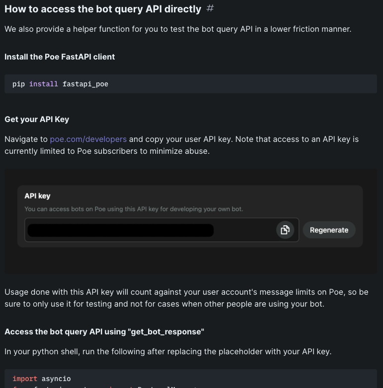
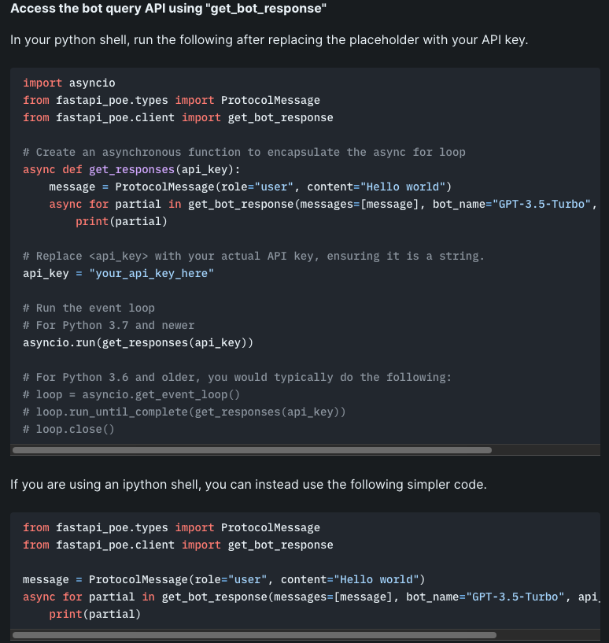

# POE AI 对接开发
为了测试 poe 的爬虫是否可以调用，所以需要对接 poe 的 api，但 poe 平台并没有提供 api 进行调用，所以需要使用 poe 提供的一个 python 库进行调用测试。
## 测试步骤
### 准备工作1
在 poe 页面上测试爬取页面功能

- 设置一个爬虫机器人
	- 提示词
	
			You're a journalist AI agent. Please succinct summary of the main points of the news  in language that middle school students can understand. Also, avoid printing any additional information.
	- 机器人公开

			注意这里设置公开关闭，之前设置开放被禁止使用
- 整体设置完保存

	
	
- 然后测试新闻源中的详情页面链接，例
	- 新闻源链接
	
			https://www.bbc.com/news/uk-politics-67376996?at_medium=RSS&at_campaign=KARANGA
	- 获得结果
	
			Hey there, middle schoolers! Here's a summary of the news article:
			
			The Prime Minister of the United Kingdom, Boris Johnson, has shown his support for Suella Braverman, who is the home secretary. Some people have been calling for her to be fired because she wrote an article accusing the police of favoritism. But Rishi Sunak, the Chancellor, still believes in her abilities. A decision about her future will be made after a protest march. Some political parties and members of Parliament want Braverman to be removed from her position, while others in the Conservative Party are standing by her.
	- 截图
	
		

### 准备工作2
查看[开发文档](https://developer.poe.com/server-bots/accessing-other-bots-on-poe)

- 订阅 poe 获得 API KEY

	想使用 API ，必须订阅 poe 开发者服务，页面是 [https://poe.com/developers](https://poe.com/developers)
- 安装 fastapi_poe
	- 硬件

		使用 flowise 测试主机(ubuntu 系统)
	- 启动环境

		fastapi_poe 要求使用 python3 版本，ubuntu 默认 3.8 所以可以使用
		
			$ python3 --version
			Python 3.8.10
	- 安装 python virtualenv 虚拟机
		- 检查虚拟机
		
				$ virtualenv poe
		
					Command 'virtualenv' not found, but can be installed with:
					
					apt install python3-virtualenv
					Please ask your administrator.
		- 安装

				$ sudo apt install python3-virtualenv
		- 创建项目目录		

				$ mkdir  fastapi_poe
		- 进入目录

				$ cd fastapi_poe/
		- 创建虚拟机		
		
				~/fastapi_poe$ virtualenv poe
	- 安装 fastapi_poe
		- 进入虚拟机

				$ source poe/bin/activate
		- 安装 poe

				(poe) pangzheng@iZt4n86o3ror4rdm8mmpiyZ:~/fastapi_poe$ pip install fastapi_poe
		- 报错

				ERROR: fastapi 0.104.1 has requirement starlette<0.28.0,>=0.27.0, but you'll have starlette 0.32.0.post1 which is incompatible.
		- 安装依赖降级

				(poe) pangzheng@iZt4n86o3ror4rdm8mmpiyZ:~/fastapi_poe$ pip install starlette==0.27.0
		- 重新测试安装 poe

				(poe) pangzheng@iZt4n86o3ror4rdm8mmpiyZ:~/fastapi_poe$ pip install fastapi_poe
		- 结果
		
				:~/fastapi_poe$ pip install fastapi_poe
				Requirement already satisfied: fastapi_poe in ./poe/lib/python3.8/site-packages (0.0.23)
				Requirement already satisfied: typing-extensions in ./poe/lib/python3.8/site-packages (from fastapi_poe) (4.8.0)
				Requirement already satisfied: sse-starlette in ./poe/lib/python3.8/site-packages (from fastapi_poe) (1.6.5)
				Requirement already satisfied: pydantic>2 in ./poe/lib/python3.8/site-packages (from fastapi_poe) (2.5.0)
				Requirement already satisfied: httpx-sse in ./poe/lib/python3.8/site-packages (from fastapi_poe) (0.3.1)
				Requirement already satisfied: httpx in ./poe/lib/python3.8/site-packages (from fastapi_poe) (0.25.1)
				Requirement already satisfied: fastapi in ./poe/lib/python3.8/site-packages (from fastapi_poe) (0.104.1)
				Requirement already satisfied: uvicorn in ./poe/lib/python3.8/site-packages (from fastapi_poe) (0.24.0.post1)
				Requirement already satisfied: starlette in ./poe/lib/python3.8/site-packages (from sse-starlette->fastapi_poe) (0.27.0)
				Requirement already satisfied: pydantic-core==2.14.1 in ./poe/lib/python3.8/site-packages (from pydantic>2->fastapi_poe) (2.14.1)
				Requirement already satisfied: annotated-types>=0.4.0 in ./poe/lib/python3.8/site-packages (from pydantic>2->fastapi_poe) (0.6.0)
				Requirement already satisfied: sniffio in ./poe/lib/python3.8/site-packages (from httpx->fastapi_poe) (1.3.0)
				Requirement already satisfied: anyio in ./poe/lib/python3.8/site-packages (from httpx->fastapi_poe) (3.7.1)
				Requirement already satisfied: idna in ./poe/lib/python3.8/site-packages (from httpx->fastapi_poe) (3.4)
				Requirement already satisfied: httpcore in ./poe/lib/python3.8/site-packages (from httpx->fastapi_poe) (1.0.2)
				Requirement already satisfied: certifi in ./poe/lib/python3.8/site-packages (from httpx->fastapi_poe) (2023.7.22)
				Requirement already satisfied: click>=7.0 in ./poe/lib/python3.8/site-packages (from uvicorn->fastapi_poe) (8.1.7)
				Requirement already satisfied: h11>=0.8 in ./poe/lib/python3.8/site-packages (from uvicorn->fastapi_poe) (0.14.0)
				Requirement already satisfied: exceptiongroup; python_version < "3.11" in ./poe/lib/python3.8/site-packages (from anyio->httpx->fastapi_poe) (1.1.3)		
### 测试代码
- 创建测试代码

		(poe) pangzheng@iZt4n86o3ror4rdm8mmpiyZ:~/fastapi_poe$ vi poe-demo.py
- 将测试代码贴入

		import asyncio
		from fastapi_poe.types import ProtocolMessage
		from fastapi_poe.client import get_bot_response
		
		# Create an asynchronous function to encapsulate the async for loop
		async def get_responses(api_key):
		    message = ProtocolMessage(role="user", content="Hello world")
		    async for partial in get_bot_response(messages=[message], bot_name="GPT-3.5-Turbo", api_key=api_key):
		        print(partial)
		
		# Replace <api_key> with your actual API key, ensuring it is a string.
		api_key = "your_api_key_here"
		
		# Run the event loop
		# For Python 3.7 and newer
		asyncio.run(get_responses(api_key))
		
		# For Python 3.6 and older, you would typically do the following:
		# loop = asyncio.get_event_loop()
		# loop.run_until_complete(get_responses(api_key))
		# loop.close()
- 修改 api-key ，并保存
- 运行测试

		(poe) pangzheng@iZt4n86o3ror4rdm8mmpiyZ:~/fastapi_poe$ python poe-demo.py
- 退出 python 虚拟机

		deactivate
		
## 错误
- api-key 异常
	- 错误

			Error in Poe bot: Bot request to GPT-3.5-Turbo failed on try 0
			 BotError('{"allow_retry": true, "text": "Internal server error"}')
			Error in Poe bot: Bot request to GPT-3.5-Turbo failed on try 1
			 BotError('{"allow_retry": true, "text": "Internal server error"}')
			Traceback (most recent call last):
			  File "poe-demo.py", line 16, in <module>
			    asyncio.run(get_responses(api_key))
			  File "/usr/lib/python3.8/asyncio/runners.py", line 44, in run
			    return loop.run_until_complete(main)
			  File "/usr/lib/python3.8/asyncio/base_events.py", line 616, in run_until_complete
			    return future.result()
			  File "poe-demo.py", line 8, in get_responses
			    async for partial in get_bot_response(messages=[message], bot_name="GPT-3.5-Turbo", api_key=api_key):
			  File "/home/pangzheng/fastapi_poe/poe/lib/python3.8/site-packages/fastapi_poe/client.py", line 307, in stream_request
			    async for message in ctx.perform_query_request(request):
			  File "/home/pangzheng/fastapi_poe/poe/lib/python3.8/site-packages/fastapi_poe/client.py", line 209, in perform_query_request
			    raise BotError(event.data)
			fastapi_poe.client.BotError: {"allow_retry": true, "text": "Internal server error"}
	- 更换 apikey 测试

- 响应报错
- 错误

		$ python poe-demo.py
			text='' raw_response={'type': 'text', 'text': '{"text": ""}'} full_prompt="QueryRequest(version='1.0', type='query', query=[ProtocolMessage(role='user', content='Hello world', content_type='text/markdown', timestamp=0, message_id='', feedback=[], attachments=[])], user_id='', conversation_id='', message_id='', metadata='', api_key='<missing>', access_key='<missing>', temperature=0.7, skip_system_prompt=False, logit_bias={}, stop_sequences=[])" request_id=None is_suggested_reply=False is_replace_response=False
			...
			执行了11次

- 解决
	- 提了 issue 

		[https://github.com/poe-platform/fastapi_poe/issues/36](https://github.com/poe-platform/fastapi_poe/issues/36) 			
		
## 参考
- [Access the bot query API using "get\_bot\_response"](https://developer.poe.com/server-bots/accessing-other-bots-on-poe)
- [github fastapi_poe](https://github.com/poe-platform/fastapi_poe)		

						
		