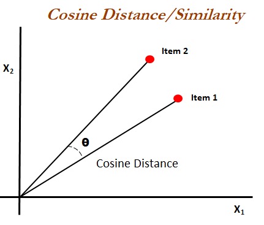
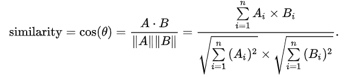
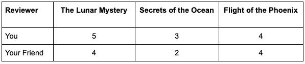
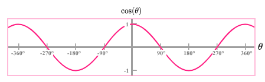
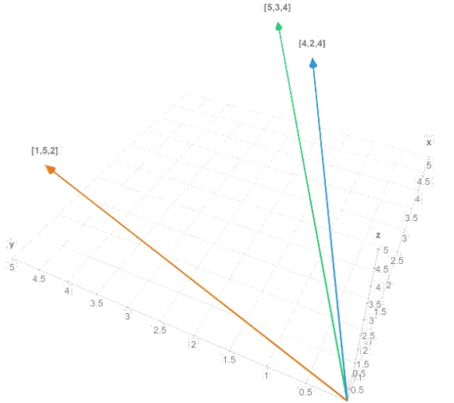

# 余弦相似度算法与ES向量数据库
## 概述
余弦相似度算法是一种用来衡量两个物体（比如文本或者图像）之间相似程度的方法。想象一下，每个物体都可以表示成空间中的一个点，而这两个点之间的距离可以告诉我们它们有多相似。但不是测量直线距离，余弦相似度测量的是它们之间的角度。角度越小，意味着方向越相似，也就是说它们越相似。

- [wiki 解释](https://zh.wikipedia.org/wiki/%E4%BD%99%E5%BC%A6%E7%9B%B8%E4%BC%BC%E6%80%A7)

	余弦相似性通过测量两个向量的夹角的余弦值来度量它们之间的相似性。0度角的余弦值是1，而其他任何角度的余弦值都不大于1；并且其最小值是-1。从而两个向量之间的角度的余弦值确定两个向量是否大致指向相同的方向。两个向量有相同的指向时，余弦相似度的值为1；两个向量夹角为90°时，余弦相似度的值为0；两个向量指向完全相反的方向时，余弦相似度的值为-1。这结果是与向量的长度无关的，仅仅与向量的指向方向相关。余弦相似度通常用于正空间，因此给出的值为0到1之间。
	
	注意这上下界对任何维度的向量空间中都适用，而且余弦相似性最常用于高维正空间。例如在信息检索中，每个词项被赋予不同的维度，而一个文档由一个向量表示，其各个维度上的值对应于该词项在文档中出现的频率。余弦相似度因此可以给出两篇文档在其主题方面的相似度。

	另外，它通常用于文本挖掘中的文件比较。此外，在数据挖掘领域中，会用到它来度量集群内部的凝聚力。
	
		

- 算法公式	
		

### 向量描述的例子
cosine similarity 在 ES 向量搜索配置 [dense vector](https://www.elastic.co/guide/en/elasticsearch/reference/current/dense-vector.html) 相似性是其中一个选择
	
三本书，1-5的等级对他们进行评分
	

	
那么向量表示就为 `[5,3,4]` 和 `[4,2,4]`

## 余弦相似度的定义
余弦相似度是衡量多维空间中两个非零向量之间角度余弦的度量。稍后将了解其确切含义，但现在只需理解该值越接近 1，向量就越相似。 余弦相似度是有效的，因为它捕获向量的方向(或”方句”)而不是它们的大小，这使得它对数据模式的相似性敏感，而对向量的大小不敏感。

在数学上，它计算余弦相似度。请注意，执行余弦相似度的最有效方法是将所有向量标准化为单位长度，并改为使用 `dot_product`。仅当需要保留原始向量且无法提前对其进行标准化时，才应使用余弦。文档 _score 的计算方式为 

	(1 + cosine(query, vector))/2
余弦相似度不允许向量具有零幅度因为在这种情况下未定义余弦

	
从余弦的曲线我们可以看到，当向量的角度为 0 时，余弦的值为最大 `1`。但凡有一些偏差，那么它的值就会变小(0-1)。

### 例子
还是刚才的例子，向量值为  `[5,3,4]` 和 `[4,2,4]`，使用余弦相似度，就可以量化这些向量的相似程度。

余弦相似度将返回 `-1` 到 `1` 之间的值; 值越接近 1表示相似度越高。

示例中，计算余弦相似度得到的值为 `0.9899`，这表明你和你的朋友对书籍的品味非常相似。

如果你有另一个朋友的评分为 `1,5.21` ，则余弦相似度将为 `0.7230`，表明品味不太相似。

[math3d.org](https://www.math3d.org/vectors) 网站可以提供一种可视化二维和三维向量的有用方法。通过我们简单的示例向量，我们可以看到 `[5,3,4]` 和 `[4,2,4]` 之间的角度小于 `[5,3,4]`  和 `[1,5,2]` 之间的角度:

	

## 余弦相似度的优点
余弦相似度是一种广泛使用的度量，在各种应用中具有多种优势，例如 `文本分析`、`推荐系统等`。
以下是一些使其成为测量向量之间相似性的首选的主要优点。

- 不依赖于规模而变化

	余弦相似度是不依赖于规模而变化，这意味着它不受向量大小的影响。 这在你只想关注向量的方向性而不是它们的长度的情况下特别有用。无论向量中的值是数千万还是数百万，余弦相似度都将保持不变，从而使其在不同尺度上具有通用性。
- 降维

	使用余弦相似度的另一个优点是它与主成分分析(`PCA`)和分布随机邻域嵌入(`t-SNE`) 等技术的兼容性。由于它以角度而不是距离来衡量相似性，因此你可以减少向量的维度，而不会显着影响余弦相似性度量。
- 简单高效

	计算余弦相似度的公式很简单
	
	- 余弦公式

			
	- 以上面的例子做参考
	
			
	- 结果
		- 向量 A 与 B 的余弦相似度约为 0.99
		- 向量 A 与 C 的余弦相似度约为 0.72
		- 所以向量 A 与 B 相似度大于向量 A 与 C 
- 角度测量

	与其他基于距离的相似性度量不同，余弦相似性考虑了向量之间的角度，提供了更直观的相似性感觉。 角度越小表示相似度越高，并且度量范围在 -1 和 1 之间，使解释更容易。
- 广泛应用于文本分析

	余弦相似度在文本分析领域特别流行。当文档转换为嵌入向量时，余弦相似度有效地捕获了不同文档之间的“角度”，突出了内容的相关程度。

通过考虑这些优势，就可以清楚为什么余弦相似度是各种机器学习和 数据科学应用中的流行选择。

## 数据分析和 NLP 的重要性
余弦相似度在数据分析和自然语言处理等领域非常宝贵。在 NLP 中，它经常用于

- 文本挖掘
- 情感分析
- 和文档聚类等任务。

该指标有助于比较两段文本以了解它们的语义相似性，这对于做出`准确的推荐` 或 `分类` 至关重要

## 余弦相似度与其他相似度度量有何不同
有多种方法可以测量数据集之间的相似性，

- `欧几里得距离`是另一种常用的度量标准。

	`欧几里德距离`关注的是空间中两点之间的直线距离，
- 而余弦相似度关注的是两个向量之间的角度。 

	这使得余弦相似性在捕获两组数据之间的模式相似性方面更加稳健，即使它们的大小不同

如果我们想得到`欧几里得`的直线距离，我们可以在 [dense vector](https://www.elastic.co/guide/en/elasticsearch/reference/current/dense-vector.html) 数据类型里设置 `similarity: 12 norm`

例如，如果两个文档具有相同的单词但频率不同，则 `欧几里得距离` 可能会由于幅度 (频率)的差异而认为它们完全不同。然而，余弦相似度会更有效地捕获它们的相似度，因为它对单词的频率不太敏感，而更关注它们在文档中的存在或不存在。

- 余弦相似度的“近亲”是 `点积相似度`。

	它通常在矢量已经归一化(其大小为 1)时使用，从而避免除以其大小的乘积(始终为 1!)的计算步骤。 许多向量嵌入模型输出归一化向量，使点积相似度计算更快。

如果我们想得到点击 `dot_product` 相似度，我们可以在 [dense vector](https://www.elastic.co/guide/en/elasticsearch/reference/current/dense-vector.html) 里设置 `simliarity: dot product`

## 通过 Elasticsearch 上的向量搜索将余弦相似度实践
综上所述，余弦相似度提供了一种稳健、有效的相似度测量方法，具有广泛的应用，特别是在 NLP 和数据分析领域。 它关注向量的方向而不是大小，这使其与`欧几里得距离` 等其他相似性度量区分开来。无论你是在分析文本数据、提出建议还是进行复杂的数据分析，了解余弦相似度的细微差别都会非常有益。

详细阅读文章 

- [“Elasticsearch: 如何部署 NLP: 文本嵌入和向量搜索”](https://elasticstack.blog.csdn.net/article/details/124920166)。
- 对于之前的评分向量例子，以参考文章 [Elasticsearch: 基于 Vector 的打分](https://elasticstack.blog.csdn.net/article/details/103651068)。

## 余弦相似度在 ES 中的力量
了解更关于 Elasticsearch 在向量搜索领域里的应用，请详细阅读

- ["Elastic: 开发者上手指南”](https://elasticstack.blog.csdn.net/article/details/102728604)中的 `“NLP-自然语言处理及向量搜索”`章节。\
- 更多阅读: 

	[Elasticsearch: 如何使用 Elasticsearch 和 Python 构建面部识别系统](https://elasticstack.blog.csdn.net/article/details/115627926)

## 余弦相似度计算改进版版
余弦相似度一些不足之处。以下是五种改进版本：

- 带 `TF-IDF` 权重的余弦相似度

	这个版本考虑了词项在文档中的重要性，根据它们在文档集合中出现的频率来赋予它们不同的权重。
- 带 `BM25` 权重的余弦相似度

	这个版本是基于 BM25 算法优化的，BM25 算法考虑了查询词在文档中的分布情况以及它们在全局中的出现频率，然后根据这些因素给每个词项赋予不同的权重。
- 带 `LDA` 主题模型的余弦相似度

	这个版本使用 LDA 主题模型将文档表示为多个主题的混合，然后计算主题之间的余弦相似度。
- 带 `LSI/LDA` 降维的余弦相似度

	这个版本使用 `LSI` 或 `LDA` 降维方法将高维向量压缩到低维空间，然后计算压缩后的向量之间的余弦相似度。
- 带词向量模型的余弦相似度

	这个版本使用预训练的词向量模型将文档表示为向量，然后计算向量之间的余弦相似度。

## 7 种相似算法的简单介绍和对比余弦算法的优缺点
- 欧几里得距离

	像直尺量距离一样，直接测两点间的直线距离。优点是简单直观，缺点是可能不适用于高维数据。
- 曼哈顿距离

	像走城市街区那样，只能横着或竖着走。适合网格状结构，但不总是最短路径。
- 切比雪夫距离

	只看横纵坐标差的最大值。像国际象棋中的国王移动，适用于某些特定场景。
- 明可夫斯基距离

	这是一个“通用配方”，调整参数可以变成欧几里得或曼哈顿距离。
- 海明距离

	计算两个字符串不同位置的数量。适合比较长度相同的字符串。
- 余弦相似度

	比较方向而不是大小。像比较两本书的内容是否相似，适合文本分析。
- Jaccard 相似度

	比较两个集合共同元素的占比。适合比较共享属性。

对于比较两段文字的相关性，余弦相似度是一个很好的选择，因为它专注于比较内容的方向性，而不是具体的词频，能更好地捕捉文本间的语义相关性。

## 余弦相似度与数据维度的关系
在数据科学和机器学习中，

- 所谓的“高维向量”通常指的是具有很多特征或属性的向量。

	具体来说，如果一个向量有几十、几百甚至更多的维度（也就是特征），那么它就被视为高维向量。例如，文本数据通过某些自然语言处理技术转换成的向量通常是高维的。
- 相反，低维向量则包含较少的特征，比如只有两维或三维。

	这种向量在可视化和理解上更为直观。例如，普通的几何点或物理空间中的向量就是低维的

余弦相似度本身对数据的维度没有特别的要求。它可以应用于低维度数据，也可以应用于高维度数据，如文本数据经过处理后生成的向量。但在处理高维度数据时，可能会遇到“维度灾难”，即随着维度的增加，计算量大幅增加，同时数据的稀疏性也会增加。

为了优化高维度数据的处理，可以采用以下策略：

- 降维

	使用 PCA（主成分分析）、t-SNE 或自编码器等方法减少数据的维度。
- 特征选择

	选择最有代表性的特征，去除冗余或不重要的特征。
- 向量嵌入

	对于文本数据，使用像 `Word2Vec` 或 `BERT` 这样的预训练模型生成更有效的低维度嵌入向量。

## 参考
- [wiki 余弦相似性](https://zh.wikipedia.org/wiki/%E4%BD%99%E5%BC%A6%E7%9B%B8%E4%BC%BC%E6%80%A7)
- [余弦相似度是一种常见的相似度计算方法，但它也有一些不足之处。以下是五种改进版本](https://zhuanlan.zhihu.com/p/618309895)
- [距离相似度计算总结（欧式距离、余弦相似度、杰卡德、互信息等18种）](https://zhuanlan.zhihu.com/p/354289511)
- GPT 4.5T