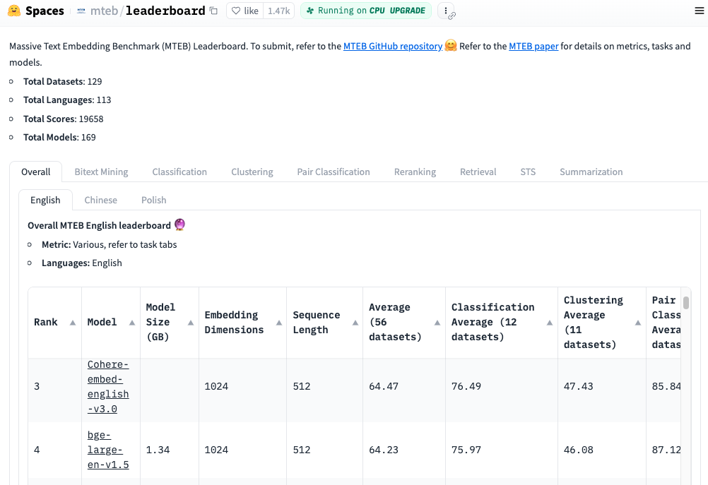
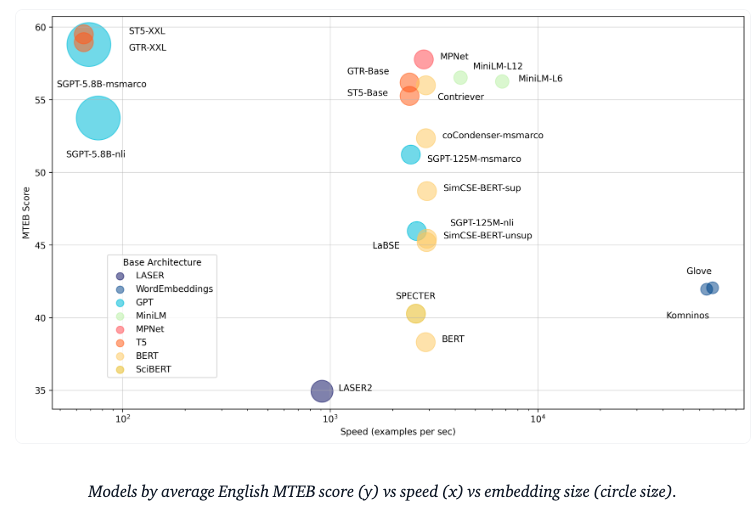

# MTEB: 海量文本 Embedding 基准
MTEB 是衡量文本 Embedding 模型在不同 Embedding 任务上的性能的大型基准

[排行榜](https://huggingface.co/spaces/mteb/leaderboard)提供了各种任务中最佳文本 Embedding 模型的整体视图。

[论文](https://arxiv.org/abs/2210.07316)提供了 MTEB 中任务和数据集的背景知识，并分析了排行榜结果!

[Github 存储库](https://github.com/embeddings-benchmark/mteb)包含用于基准测试并将您选择的任何模型提交到排行榜的代码

## 为什么要使用文本 Embedding
文本 Embedding 是文本的向量表示，对语义信息进行编码。由于机器需要数值输入来执行计算，因此文本 Embedding 是许多下游 NLP 应用程序的重要组成部分。例如，Google 使用文字 Embedding 来[驱动他们的搜索引擎](https://cloud.google.com/blog/topics/developers-practitioners/find-anything-blazingly-fast-googles-vector-search-technology)。文本 Embedding 还可用于通过[聚类在大量文本中查找模式](https://txt.cohere.ai/combing-for-insight-in-10-000-hacker-news-posts-with-text-clustering/)或作为文本分类模型的输入，例如在我们最近的 [SetFit](https://huggingface.co/blog/setfit) 工作中。然而，文本 Embedding 的质量高度依赖于所使用的 Embedding 模型。 MTEB 旨在帮助您找到适合各种任务的最佳 Embedding 模型!

## MTEB
- Massive

	MTEB 包含8项任务的56个数据集，目前在排行榜上汇总了 > 2000 个结果。
- Multilingual

	MTEB包含多达112种不同的语言!我们已经基准的 Bit text 挖掘，分类和 STS 的多语言模型
- Extensible

	无论是新任务，数据集，指标，或排行榜的补充，任何贡献是非常受欢迎的。查看GitHub存储库以提交到[排行榜](https://github.com/embeddings-benchmark/mteb#leaderboard)或[解决未解决](https://github.com/embeddings-benchmark/mteb/issues)的问题。我们希望您加入我们寻找最佳文本Embedding模型的旅程!
	

MTEB 中的任务和数据集概述多语言数据集以紫色阴影标记

## 模型
对于 MTEB 的初始基准测试，我们专注于声称具有最先进结果的模型和 Hub 上流行的模型。这就导致了变压器的高代表性

我们将模型分为以下三个属性，以简化为您的任务寻找最佳模型的过程

-  Maximum speed

	[Glove](https://huggingface.co/sentence-transformers/average_word_embeddings_glove.6B.300d)等型号提供了高速度，但缺乏上下文感知，导致平均 MTEB 分数较低
- Speed and performance

	速度和性能[all-mpnet-base-v2](https://huggingface.co/sentence-transformers/all-mpnet-base-v2)或[all-MiniLM-L6-v2](https://huggingface.co/sentence-transformers/all-MiniLM-L6-v2)速度稍慢，但性能显著增强，在速度和性能之间实现了良好的平衡
- Maximum performance

	最高性能的多亿参数模型，如[ST5-XXL](https://huggingface.co/sentence-transformers/sentence-t5-xxl)，[GTR-XXL](https://huggingface.co/sentence-transformers/gtr-t5-xxl)或[SGPT-5.8B-msmarco](https://huggingface.co/Muennighoff/SGPT-5.8B-weightedmean-msmarco-specb-bitfit)在 MTEB 上占主导地位。他们也倾向于生成更大的 Embedding，如[SG PT-5.8 B-msarco](https://huggingface.co/Muennighoff/SGPT-5.8B-weightedmean-msmarco-specb-bitfit)，它生成4096个维度的 Embedding，需要更多的存储空间!

模型的性能因任务和数据集的不同而有很大差异，因此我们建议您在决定使用哪种模型之前先查看[排行榜](https://huggingface.co/spaces/mteb/leaderboard)的各个选项卡!

## 对您的模型进行基准测试
使用 MTEB 库，您可以对任何生成 Embedding 的模型进行基准测试，并将其结果添加到公共排行榜中。让我们看一个简单的例子！

- 首先，安装库：

		pip install mteb
- 接下来，在数据集上对模型进行基准测试，例如 [Banking77](https://huggingface.co/datasets/mteb/banking77) 上的 [komninos 词Embedding](https://huggingface.co/sentence-transformers/average_word_embeddings_komninos) 

		from mteb import MTEB
		from sentence_transformers import SentenceTransformer
		
		model_name = "average_word_embeddings_komninos"
		model = SentenceTransformer(model_name)
		
		evaluation = MTEB(tasks=["Banking77Classification"])
		results = evaluation.run(model, output_folder=f"results/{model_name}")

这应该会生成一个文件

	results/average_word_embeddings_komninos/Banking77Classification.json
现在，您可以将结果添加到 Hub 上任何模型的 README.md 元数据中，从而将结果提交到排行榜。

运行我们的[自动脚本](https://github.com/embeddings-benchmark/mteb/blob/main/scripts/mteb_meta.py)生成元数据：

	python mteb_meta.py results/average_word_embeddings_komninos
该脚本将生成一个 `mteb_metadata.md` 文件，如下所示：

	---
	tags:
	- mteb
	model-index:
	- name: average_word_embeddings_komninos
	  results:
	  - task:
	      type: Classification
	    dataset:
	      type: mteb/banking77
	      name: MTEB Banking77Classification
	      config: default
	      split: test
	      revision: 0fd18e25b25c072e09e0d92ab615fda904d66300
	    metrics:
	    - type: accuracy
	      value: 66.76623376623377
	    - type: f1
	      value: 66.59096432882667
	---

现在将元数据添加到集线器上任何模型的 README.md 顶部，如下所示[SGPT-5.8B-msmarco](https://huggingface.co/Muennighoff/SGPT-5.8B-weightedmean-msmarco-specb-bitfit/blob/main/README.md) 排行榜模型，刷新后会出现在

## 餐卡
[MTEB: Massive Text Embedding Benchmark](https://huggingface.co/blog/mteb)