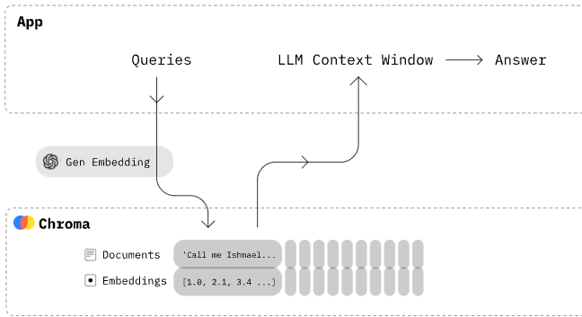

# chroma
Chroma 是开源嵌入数据库。Chroma 通过为 LLM 提供可插入的知识、事实和技能，让构建 LLM 应用程序变得容易.使用内存构建 Python 或 JavaScript LLM 应用程序的最快方法！

## 什么是嵌入？
- [阅读 OpenAI 的指南](https://platform.openai.com/docs/guides/embeddings/what-are-embeddings)
- 文字

	嵌入某些内容会将其从图像/文本/音频转换为数字列表。🖼️ 或 📄 => [1.2, 2.1, ....]。此过程使机器学习模型“可以理解”文档。
- 以此类推

	嵌入代表了文档的本质。这使得具有相同本质的文档和查询彼此“接近”，因此易于查找。
- 技术

	嵌入是文档在深度神经网络层的潜在空间位置。对于专门训练来嵌入数据的模型，这是最后一层。
- 一个小例子

	如果您在照片中搜索“旧金山著名的桥梁”。通过嵌入此查询并将其与照片及其元数据的嵌入进行比较 - 它应该返回金门大桥的照片。

嵌入数据库（也称为向量数据库）存储嵌入，并允许您按最近邻居进行搜索，而不是像传统数据库那样按子字符串进行搜索。默认情况下，Chroma 使用[Sentence Transformers](https://docs.trychroma.com/embeddings#default-sentence-transformers)为您嵌入，但您也可以使用 OpenAI 嵌入、Cohere（多语言）嵌入或您自己的嵌入。

Chroma 为您提供以下工具：

- 存储嵌入及其元数据
- 嵌入文档和查询
- 搜索嵌入

特征

- 简单：完全类型、完全测试、完全记录==幸福
- 集成：🦜️🔗 LangChain（python 和 js），🦙 LlamaIndex以及更多内容
- 开发、测试、生产：在 Python Notebook 中运行的相同 API，可扩展到您的集群
- 功能丰富：查询、过滤、密度估计等
- 免费和开源：Apache 2.0 许可

ChatGPT用例  例如，"Chat your data"用例：

- 将文档添加到您的数据库。您可以传入您自己的嵌入、嵌入函数，或者让 Chroma 为您嵌入它们。
- 用自然语言查询相关文档。
- 将文档撰写到 LLM 的上下文窗口中，例如 GPT3 进行额外的总结或分析。

Chroma 优先考虑：

- 简单性和开发人员生产力
- 搜索之上的分析
- 它也恰好非常快

Chroma 由 `Python` 客户端 SDK、`JavaScript/TypeScript` 客户端 SDK 和服务器应用程序组成。查看 [Colab 演示](https://colab.research.google.com/drive/1QEzFyqnoFxq7LUGyP1vzR4iLt9PpCDXv?usp=sharing)。（是的，它可以在笔记本中运行 😄）

Chroma 已获得 [Apache 2.0 许可](https://github.com/chroma-core/chroma/blob/main/LICENSE)

在 Python 中，Chroma 可以运行 `in-memory` 或以 `client/server`（alpha）模式运行。

	pip install chromadb
在 JavaScript 中，Chroma 在模式下运行 `client/server` 并与 Python 后端对话。

	npm install --save chromadb # yarn add chromadb

## 开始使用
### Python
Chroma 是一个用于构建带有嵌入的 AI 应用程序的数据库。它内置了您开始使用所需的一切，并在您的计算机上运行。托管版本即将推出！

1. pip 安装

		pip install chromadb

	* 由于 pytorch，chromadb 目前不支持 Python 3.11
2. 获取 Chroma

		import chromadb
		chroma_client = chromadb.Client()
3. 创建

	集合是您存储嵌入、文档和任何其他元数据的地方。您可以创建一个具有以下名称的集合：

		collection = chroma_client.create_collection(name="my_collection")
4. 添加一些文本文档到集合

	Chroma 将存储您的文本，并自动处理标记化、嵌入和索引。

		collection.add(
		    documents=["This is a document", "This is another document"],
		    metadatas=[{"source": "my_source"}, {"source": "my_source"}],
		    ids=["id1", "id2"]
		)
	如果您已经自己生成了嵌入，则可以直接将它们加载到：

		collection.add(
		    embeddings=[[1.2, 2.3, 4.5], [6.7, 8.2, 9.2]],
		    documents=["This is a document", "This is another document"],
		    metadatas=[{"source": "my_source"}, {"source": "my_source"}],
		    ids=["id1", "id2"]
		)
5. 查询

	您可以使用查询文本列表来查询集合，Chroma 将返回最n相似的结果。就是这么简单！

		results = collection.query(
		    query_texts=["This is a query document"],
		    n_results=2
		)
在 [PyPI 上查找 chromadb](https://pypi.org/project/chromadb/)

### JS
1. npm 安装

		npm install --save chromadb # yarn add chromadb
2. 获取 Chroma

		const {ChromaClient} = require('chromadb');
		const client = new ChromaClient();

	要连接到 Chroma 的后端 - 您需要连接到 Chroma 的托管版本，或者在本地计算机上运行它。如果你能跑，`docker-compose up -d --build` 你就能跑 Chroma。

		git clone https://github.com/chroma-core/chroma.git
		cd chroma
		docker-compose up -d --build

	如果您遇到构建问题，请在活跃的[社区 Discord](https://discord.gg/MMeYNTmh3x) 中寻求帮助。大多数问题都会在几分钟内得到解决。
3. 创建

	集合是您存储嵌入、文档和任何其他元数据的地方。您可以创建一个具有以下名称的集合：

	对于此示例，我们希望从文本生成嵌入。OpenAI 的 `ada-002`模型很受欢迎、免费且注册快速。获取您的 API 密钥并返回。Chroma 的 API 是多态的（它可以在浏览器或服务器端运行），但 OpenAIs 不是。因此，在服务器端运行此示例。

		警告
	`与前端系统交互时，请采取措施保护您的 API。`

		const {OpenAIEmbeddingFunction} = require('chromadb');
		const embedder = new OpenAIEmbeddingFunction({openai_api_key: "your_api_key"})
		const collection = await client.createCollection({name: "my_collection", embeddingFunction: embedder})
4. 添加一些文本文档到

	Chroma 将存储您的文本，并自动处理标记化、嵌入和索引。
	
		await collection.add({
		    ids: ["id1", "id2"],
		    metadatas: [{"source": "my_source"}, {"source": "my_source"}],
		    documents: ["This is a document", "This is another document"],
		}) 
	如果您已经自己生成了嵌入，则可以直接将它们加载到：
	
		await collection.add({
		    ids: ["id1", "id2"],
		    embeddings: [[1.2, 2.3, 4.5], [6.7, 8.2, 9.2]],
		    where: [{"source": "my_source"}, {"source": "my_source"}],
		    documents: ["This is a document", "This is another document"]
		}) 
5. 查询

	您可以使用查询文本列表来查询集合，Chroma 将返回最n相似的结果。就是这么简单！

		const results = await collection.query({
		    nResults: 2, 
		    queryTexts: ["This is a query document"]
		}) 

在 [npm 上查找 chromadb](https://www.npmjs.com/package/chromadb) 。
	
默认情况下，Chroma 中存储的数据是短暂的，因此可以轻松创建脚本原型。让 Chroma 持久化很容易，这样您就可以重复使用您创建的每个集合，并在以后向其中添加更多文档。当您启动客户端时，它会自动加载您的数据，并在您关闭客户端时自动保存。查看[使用指南](https://docs.trychroma.com/usage-guide)了解更多信息。

## 使用指南
### js
请阅读原文
### Python
#### 启动持久 Chroma
	import chromadb
您可以将 Chroma 配置为从本地计算机保存和加载。数据将自动保留并在启动时加载（如果存在）。
	
	client = chromadb.PersistentClient(path="/path/to/save/to")
Chromapath 将在磁盘上存储其数据库文件，并在启动时加载它们。

	一次使用一个客户端
	许多客户端加载和保存到同一路径可能会导致奇怪的行为，包括数据删除。作为一般做法，在应用程序中创建一次 Chroma 客户端，然后将其传递，而不是创建许多客户端。
客户端对象有一些有用的便捷方法。

	client.heartbeat() #返回纳秒级心跳。用于确保客户端保持连接。
	client.reset() # 清空并完全重置数据库。⚠️这是破坏性的，不可逆转的。
#### 客户端/服务器
Chroma 还可以配置为使用磁盘数据库，这对于内存无法容纳的较大数据很有用。要在客户端服务器模式下运行 Chroma，请运行 docker 容器：

	docker-compose up -d --build
然后更新您的 chroma 客户端以指向 docker 容器。默认：localhost:8000

	import chromadb
	chroma_client = chromadb.HttpClient(host='localhost', port=8000)
就是这样！Chroma 的 API 将 client-server 在仅进行此更改的模式下运行。
#### 使用 Python 纯 http
如果您在客户端-服务器模式下运行 Chroma。您可能不需要完整的 Chroma 库，而只需要客户端计算机上的客户端库。在这种情况下，您可以安装该`chromadb-client` 软件包。该软件包是服务器的轻量级 HTTP 客户端，具有最小的依赖足迹。

	pip install chromadb-client
	
	import chromadb
	from chromadb.config import Settings
	# 客户端连接到chromadb的示例设置
	client = chromadb.HttpClient(host='localhost', port=8000)

请注意，该 `chromadb-client` 包是完整 Chroma 库的子集，并不包含所有依赖项。如果您想使用完整的 Chroma 库，您可以安装该 `chromadb` 软件包。最重要的是，没有默认的嵌入函数。如果您添加没有嵌入的文档，则必须手动指定嵌入函数并为其安装依赖项。

#### 使用集合`collection`
Chroma 允许您使用原语管理嵌入集合 。

- 创建、检查和删除

	Chroma 在 url 中使用集合名称，因此命名它们有一些限制：

	- 名称的长度必须介于 3 到 63 个字符之间。
	- 名称必须以小写字母或数字开头和结尾，并且其间可以包含点、破折号和下划线。
	- 名称不得包含两个连续的点。
	- 该名称不能是有效的 IP 地址。

	Chroma 集合是使用名称和可选的嵌入函数创建的。如果您提供嵌入函数，则每次获取集合时都必须提供它。

		collection = client.create_collection(name="my_collection", embedding_function=emb_fn)
		collection = client.get_collection(name="my_collection", embedding_function=emb_fn)
	`警告`
	
	`如果您稍后希望这样做 get_collection，则必须使用创建集合时提供的嵌入函数来执行此操作`

	嵌入函数将文本作为输入，并执行标记化和嵌入。如果没有提供嵌入函数，Chroma 将默认使用[句子转换器](https://www.sbert.net/index.html)。

	您可以了解有关🧬 [嵌入函数](https://docs.trychroma.com/embeddings)以及如何创建自己的函数的更多信息。

	可以使用 `.get_collection` 检索现有集合 ，并使用 `.delete_collection` 删除。您还可以使用`.get_or_create_collection` 来获取集合（如果存在），或者创建它（如果不存在）。

		collection = client.get_collection(name="test") # 按名称从现有集合获取集合对象。如果未找到，将引发异常。		collection = client.get_or_create_collection(name="test") # 按名称从现有集合获取集合对象。如果它不存在，那就创造它。		client.delete_collection(name="my_collection") # 删除集合和所有关联的嵌入、文档和元数据。⚠️这是破坏性的，不可逆转的
	集合有一些有用的便捷方法。

		collection.peek() # 返回集合中前10项的列表
		collection.count() # 返回集合中的项数
		collection.modify(name="new_name") #重命名集合
- 改变距离函数

	`create_collection` 还带有一个可选 `metadata` 参数，可用于通过设置 `hnsw:space` 的值来自定义嵌入空间的距离方法。

		 collection = client.create_collection(
		        name="collection_name",
		        metadata={"hnsw:space": "cosine"} # l2 默认
		    )
	`hnsw:space` 有效选项为  
	
	- `l2`
	- `ip`
	- `cosine`
	- 默认值为`l2`

	每个方程可以在 [Hnswlib 的文档](https://github.com/nmslib/hnswlib/tree/master#python-bindings)中找到。
- 将数据添加到一个集合

	使用 `.add` 向 Chroma 添加数据 。

	原始文件：

		collection.add(
		    documents=["lorem ipsum...", "doc2", "doc3", ...],
		    metadatas=[{"chapter": "3", "verse": "16"}, {"chapter": "3", "verse": "5"}, {"chapter": "29", "verse": "11"}, ...],
		    ids=["id1", "id2", "id3", ...]
		)
	如果 Chroma 传递了 `documents ` 的列表，它将自动标记化并使用集合的嵌入函数嵌入它们（如果在集合创建时未提供任何内容，则将使用默认值）。Chroma 也会存储它们 `documents` 本身。如果文档太大而无法使用所选的嵌入函数进行嵌入，则会引发异常。

	每个文档必须有一个唯一的关联 `id`. 尝试使用 `.add` 相同的 ID 两次将导致仅存储初始值。`metadata` 可以为每个文档提供可选的字典列表，以存储附加信息并启用过滤。

	或者，您可以直接提供关联文档的列表 `embeddings`，Chroma 将存储关联文档而不嵌入它们本身。

		collection.add(
		    documents=["doc1", "doc2", "doc3", ...],
		    embeddings=[[1.1, 2.3, 3.2], [4.5, 6.9, 4.4], [1.1, 2.3, 3.2], ...],
		    metadatas=[{"chapter": "3", "verse": "16"}, {"chapter": "3", "verse": "5"}, {"chapter": "29", "verse": "11"}, ...],
		    ids=["id1", "id2", "id3", ...]
		)

	如果提供的维度 `embeddings` 与集合的维度不同，则会引发异常。

	您还可以将文档存储在其他地方，只需向 Chroma 提供 `embeddings` 和`metadata`的列表即可 。您可以使用 `ids ` 将嵌入与存储在其他地方的文档关联起来。

		collection.add(
		    embeddings=[[1.1, 2.3, 3.2], [4.5, 6.9, 4.4], [1.1, 2.3, 3.2], ...],
		    metadatas=[{"chapter": "3", "verse": "16"}, {"chapter": "3", "verse": "5"}, {"chapter": "29", "verse": "11"}, ...],
		    ids=["id1", "id2", "id3", ...]
		)
- 查询集合

	可以使用 `.query` 方法以多种方式查询 Chroma 集合。

	可以通过一组 `query_embeddings`进行查询 

		collection.query(
		    query_embeddings=[[11.1, 12.1, 13.1],[1.1, 2.3, 3.2], ...],
		    n_results=10,
		    where={"metadata_field": "is_equal_to_this"},
		    where_document={"$contains":"search_string"}
		)

	查询将按顺序返回 `n_results` 与每个最接近的匹配 `query_embedding`  项。可以提供 `where` 可选的过滤字典来按 `metadata ` 与每个文档关联的过滤。此外，还可以提供 `where_document` 可选的过滤字典来按文档内容进行过滤。

	如果提供的维度 `query_embeddings` 与集合的维度不同，则会引发异常。

	还可以通过一组 `query_texts` 查询 。Chroma 将首先使用 `query_text` 集合的嵌入函数嵌入每个元素，然后使用生成的嵌入执行查询。

		collection.query(
		    query_texts=["doc10", "thus spake zarathustra", ...],
		    n_results=10,
		    where={"metadata_field": "is_equal_to_this"},
		    where_document={"$contains":"search_string"}
		)
	您还可以使用 `.get` 从集合中检索 `id`项目。

		collection.get(
		    ids=["id1", "id2", "id3", ...],
		    where={"style": "style1"}
		)

	`.get` 还支持 `where` 和 `where_document` 过滤器。如果没有 `ids` 提供，它将返回集合中与 `where` 和 `where_document` 过滤器匹配的所有项目。

	- 选择返回哪些数据

		使用 `get` 或 `query` 时，您可以使用 include 参数来指定要返回的数据 - `embeddings `、 `metadatas ` 、`documents ` 中的任何一个，对于查询，`distances`。
		
		默认情况下，Chroma 将返回结果的 `documents`，`metadatas`。 如果是查询，则返回 `distances` 结果的 。`embeddings` 出于性能考虑，默认情况下将其排除，并且始终返回 `ids`。您可以通过将包含的字段名称数组传递给查询或 `get` 方法的 `contains` 参数来指定要返回其中的哪一个。

			# 仅获取文档和ID
			collection.get(
			    include=["documents"]
			)
			
			collection.query(
			    query_embeddings=[[11.1, 12.1, 13.1],[1.1, 2.3, 3.2], ...],
			    include=["documents"]
			)
- 使用 `Where` 过滤器

	Chroma 支持按内容过滤查询 `document`和 `metadata`。 `where` 过滤器用于按 `metadata` 过滤，`where_document` 过滤器用于按 `document` 内容过滤。

	- 按 `metadata ` 过滤

		为了过滤元数据，您必须为 `where` 查询提供过滤字典。字典必须具有以下结构：

			{
			    "metadata_field": {
			        <Operator>: <Value>
			    }
			}
		过滤元数据支持以下运算符：
		
		- `$eq` - 等于（字符串、整数、浮点数）
		- `$ne` - 不等于（字符串、整数、浮点数）
		- `$gt` - 大于（int，float）
		- `$gte` - 大于或等于（int、float）
		- `$lt` - 小于（整数，浮点数）
		- `$lte` - 小于或等于（int、float）
		
		使用 `$eq` 运算符相当于使用 `where` 过滤器。

			{
			    "metadata_field": "search_string"
			}
			
			#等同于
			
			{
			    "metadata_field": {
			        "$eq": "search_string"
			    }
			}
		`笔记`

			其中过滤器仅搜索键存在的嵌入。如果你搜索 collection.get(where={"version": {"$ne": 1}}). 没有密钥的元数据 version 将不会被返回。
- 按文档内容过滤

	为了过滤文档内容，您必须为 `where_document` 查询提供过滤字典。字典必须具有以下结构：

		# Filtering for a search_string
		{
		    "$contains": "search_string"
		}
- 使用逻辑

	您还可以使用逻辑运算符 `$and` 和 `$or` 来组合多个过滤器。

	- 运算 `$and` 符将返回与列表中所有过滤器匹配的结果。

			{
			    "$and": [
			        {
			            "metadata_field": {
			                <Operator>: <Value>
			            }
			        },
			        {
			            "metadata_field": {
			                <Operator>: <Value>
			            }
			        }
			    ]
			}
	- 运算 `$or` 符将返回与列表中任何过滤器匹配的结果。

			{
			    "$or": [
			        {
			            "metadata_field": {
			                <Operator>: <Value>
			            }
			        },
			        {
			            "metadata_field": {
			                <Operator>: <Value>
			            }
			        }
			    ]
			}

- 更新集合数据

	集合中项目的任何属性都可以使用 进行更新 `.update` 。

		collection.update(
		    ids=["id1", "id2", "id3", ...],
		    embeddings=[[1.1, 2.3, 3.2], [4.5, 6.9, 4.4], [1.1, 2.3, 3.2], ...],
		    metadatas=[{"chapter": "3", "verse": "16"}, {"chapter": "3", "verse": "5"}, {"chapter": "29", "verse": "11"}, ...],
		    documents=["doc1", "doc2", "doc3", ...],
		)
	如果 `id` 在集合中未找到，则会记录错误并忽略更新。如果 `documents` 没有提供相应的 `embeddings`，则嵌入将使用集合的嵌入函数重新计算。

	如果提供的维度 `embeddings` 与集合的维度不同，则会引发异常。

	Chroma 还支持 `upsert` 更新现有项目或添加它们（如果尚不存在）的操作。

		collection.upsert(
		    ids=["id1", "id2", "id3", ...],
		    embeddings=[[1.1, 2.3, 3.2], [4.5, 6.9, 4.4], [1.1, 2.3, 3.2], ...],
		    metadatas=[{"chapter": "3", "verse": "16"}, {"chapter": "3", "verse": "5"}, {"chapter": "29", "verse": "11"}, ...],
		    documents=["doc1", "doc2", "doc3", ...],
		)
	如果 `id` 集合中不存在 ，则将根据 `add` 来创建相应的项目。具有现有 `id` 的项目将按照 `update` 进行更新。
- 从集合删除数据

	Chroma 支持使用删除 `id` 集合中的项目 `.delete`。与每个项目关联的嵌入、文档和元数据将被删除。⚠️ 当然，这是破坏性操作，并且无法撤消。

		collection.delete(
		    ids=["id1", "id2", "id3",...],
		    where={"chapter": "20"}
		)

	`.delete` 还支持 `where` 滤镜。如果没有 `ids` 提供，它将删除集合中与 `where` 过滤器匹配的所有项目。

### 身份验证
您可以将 Chroma 配置为仅在服务器/客户端模式下使用身份验证。

支持的身份验证方法：

身份验证方法|基本身份验证（抢占式）|静态APItoken
---|---|---
描述| [RFC 7617](https://www.rfc-editor.org/rfc/rfc7617) `user:password` 带有 base64 编码标头的 `Authorization` 基本身份验证 
状态|Alpha	
服务器端支持|✅Alpha|✅Alpha
客户端/Python|✅	
客户端/JS|➖|➖

#### 基本认证
- 服务器设置
	- 生成服务器端

		`安全实践`
	
		良好的安全实践是安全地存储密码。在下面的示例中，我们使用 bcrypt（目前 Chroma 服务器端身份验证中唯一支持的哈希）对明文密码进行哈希处理。

			docker run --rm --entrypoint htpasswd httpd:2 -Bbn admin admin > server.htpasswd
- 运行服务器
	- 创建一个 `.chroma_env` 包含以下内容的文件：

			CHROMA_SERVER_AUTH_CREDENTIALS_FILE="/chroma/server.htpasswd"
			CHROMA_SERVER_AUTH_CREDENTIALS_PROVIDER='chromadb.auth.providers.HtpasswdFileServerAuthCredentialsProvider'
			CHROMA_SERVER_AUTH_PROVIDER='chromadb.auth.basic.BasicAuthServerProvider'
	- 运行

			docker-compose --env-file ./.chroma_env up -d --build
- 客户端设置

		import chromadb
		from chromadb.config import Settings
	
		client = chromadb.HttpClient(
		  settings=Settings(chroma_client_auth_provider="chromadb.auth.basic.BasicAuthClientProvider",chroma_client_auth_credentials="admin:admin"))
		client.heartbeat()  #这应该可以在有或没有身份验证的情况下正常工作 - 这是一个公共端点（This should work with or without authentication - it is a public endpoint）
		
		client.get_version()  # 这个端点可以在有或没有身份验证的情况下正常工作，因为它是一个公共端点。		
		client.list_collections()  # 这是一个受保护的端点，需要进行身份验证才能访问

#### 静态 API token身份
- token

		token 必须是字母数字 ASCII 字符串。token 区分大小写。
- 服务器设置
	- 安全说明

			静态 API token身份验证的当前实现仅支持基于 ENV 的token。
- 运行服务器
	- 创建一个 `.chroma_env`包含以下内容的文件：

			CHROMA_SERVER_AUTH_CREDENTIALS="test-token" \
			CHROMA_SERVER_AUTH_CREDENTIALS_PROVIDER='chromadb.auth.token.TokenConfigServerAuthCredentialsProvider'
			CHROMA_SERVER_AUTH_PROVIDER='chromadb.auth.token.TokenAuthServerProvider'
	- 运行

			docker-compose --env-file ./.chroma_env up -d --build
- 客户端设置

		import chromadb
		from chromadb.config import Settings
		
		client = chromadb.HttpClient(
		    settings=Settings(chroma_client_auth_provider="chromadb.auth.token.TokenAuthClientProvider",
		                      chroma_client_auth_credentials="test-token"))
		client.heartbeat()  # 这应该可以在有或没有身份验证的情况下正常工作 - 这是一个公共端点
		
		client.get_version()  # 这个端点可以在有或没有身份验证的情况下正常工作，因为它是一个公共端点。
		
		client.list_collections()  #这是一个受保护的端点，需要进行身份验证才能访问。

## 嵌入式
### js
请阅读原文
### Python
嵌入式是表示任何类型数据的人工智能原生方式，使其非常适合使用各种人工智能驱动的工具和算法。它们可以表示文本、图像，很快还可以表示音频和视频。创建嵌入的选项有很多，无论是在本地使用已安装的库，还是通过调用 API。

Chroma 围绕流行的嵌入提供程序提供轻量级包装器，使您可以轻松地在应用程序中使用它们。您可以在创建 Chroma 集合时设置嵌入函数，该函数将自动使用，也可以您自己直接调用它们。

要获取 Chroma 的嵌入函数，请导入该 `chromadb.utils.embedding_functions` 模块。

	from chromadb.utils import embedding_functions
#### 默认：all-MiniLM-L6-v2 
默认情况下，Chroma 使用 [Sentence Transformers](https://www.sbert.net/) `all-MiniLM-L6-v2` 模型来创建嵌入。该嵌入模型可以创建可用于各种任务的句子和文档嵌入。此嵌入功能在您的计算机上本地运行，并且可能需要您下载模型文件（这将自动发生）。

	default_ef = embedding_functions.DefaultEmbeddingFunction()

`提示`

嵌入函数可以链接到一个集合，每当您调用 `add、update、query`或 `upsert` 时都会使用该集合。您也可以直接使用它们，这可以方便地进行调试。

	val = default_ef("foo")
	-> [ [0.05035809800028801, 0.0626462921500206, -0.061827320605516434...] ]
#### Sentence Transformers(文本潜入向量库)
Chroma 还可以使用任何 [Sentence Transformers](https://www.sbert.net/) 模型来创建嵌入。

	sentence_transformer_ef = embedding_functions.SentenceTransformerEmbeddingFunction(model_name="all-MiniLM-L6-v2")
您可以传入一个可选 `model_name` 参数，它可以让您选择要使用的 Sentence Transformers 模型。默认情况下，Chroma 使用 `all-MiniLM-L6-v2`. 您可以在此处查看[所有可用型号的列表](https://www.sbert.net/docs/pretrained_models.html)。
#### OpenAI
Chroma 为 OpenAI 的嵌入 API 提供了一个方便的包装器。该嵌入功能在 OpenAI 的服务器上远程运行，并且需要 API 密钥。您可以通过在 OpenAI [注册帐户](https://openai.com/api/)来获取 API 密钥。

此嵌入功能依赖于 `openai` python 包，您可以使用 `pip install openai`

	openai_ef = embedding_functions.OpenAIEmbeddingFunction(
	                api_key="YOUR_API_KEY",
	                model_name="text-embedding-ada-002"
	                )
要在其他平台（例如 Azure）上使用 OpenAI 嵌入模型，您可以使用 `api_base` 和 `api_type`参数：

	openai_ef = embedding_functions.OpenAIEmbeddingFunction(
	                api_key="YOUR_API_KEY",
	                api_base="YOUR_API_BASE_PATH",
	                api_type="azure",
	                model_name="text-embedding-ada-002"
	            )
您可以传入一个可选 `model_name` 参数，它可以让您选择要使用的 OpenAI 嵌入模型。默认情况下，Chroma 使用 `text-embedding-ada-002`. 您可以在此处查看[所有可用型号的列表](https://platform.openai.com/docs/guides/embeddings/what-are-embeddings)。
#### Cohere
Chroma 还为 Cohere 的嵌入 API 提供了一个方便的包装器。此嵌入功能在 Cohere 的服务器上远程运行，并且需要 API 密钥。您可以通过在 [Cohere](https://dashboard.cohere.ai/welcome/register)注册帐户来获取 API 密钥。

此嵌入功能依赖于 `cohere` python 包，您可以使用 `pip install cohere`.

	cohere_ef  = embedding_functions.CohereEmbeddingFunction(api_key="YOUR_API_KEY",  model_name="large")
	cohere_ef(texts=["document1","document2"])
您可以传入一个可选 `model_name` 参数，它可以让您选择要使用的 Cohere 嵌入模型。默认情况下，Chroma 使用 `large` 模型。您可以在此处 `Get embeddings` 查看[可用型号](https://docs.cohere.ai/reference/embed)。

多语言模型

	cohere_ef  = embedding_functions.CohereEmbeddingFunction(
	        api_key="YOUR_API_KEY", 
	        model_name="multilingual-22-12")
	
	multilingual_texts  = [ 'Hello from Cohere!', 'مرحبًا من كوهير!', 
	        'Hallo von Cohere!', 'Bonjour de Cohere!', 
	        '¡Hola desde Cohere!', 'Olá do Cohere!', 
	        'Ciao da Cohere!', '您好，来自 Cohere！',
	        'कोहेरे से नमस्ते!'  ]
	
	cohere_ef(texts=multilingual_texts)
有关多语言模型的更多信息，您可以阅读[此处](https://docs.cohere.ai/docs/multilingual-language-models)。
#### Instructor models
[Instructor 嵌入库](https://github.com/HKUNLP/instructor-embedding)是另一种选择，尤其是在具有支持 cuda 的 GPU 的计算机上运行时。它们是 OpenAI 的一个很好的本地替代品（请参阅[大规模文本嵌入基准排名](https://huggingface.co/blog/mteb)）。嵌入功能需要 InstructorEmbedding 包。要安装它，请运行 `pip install InstructorEmbedding`.

有三种型号可供选择。默认值为 `hkunlp/instructor-base`，为了获得更好的性能，您可以使用 `hkunlp/instructor-large` 或 `hkunlp/instructor-xl`。您还可以指定是使用 `cpu`（默认）还是 `cuda`. 例如：

	#uses base model and cpu
	ef = embedding_functions.InstructorEmbeddingFunction() 
或者

	ef = embedding_functions.InstructorEmbeddingFunction(
	model_name="hkunlp/instructor-xl", device="cuda")
请记住，large 和 xl 型号分别为 1.5GB 和 5GB，最适合在 GPU 上运行。
#### Google PalLM API
Google PaLM API 目前处于私人预览版，但如果您参与此预览版，则可以通过 `GooglePalmEmbeddingFunction`.

要使用 PaLM 嵌入 API，您必须 `google.generativeai` 安装 Python 包并拥有 API 密钥。使用方法：

	palm_embedding = embedding_functions.GooglePalmEmbeddingFunction(
	    api_key=api_key, model=model_name)
#### HuggingFace
Chroma 还为 HuggingFace 的嵌入 API 提供了一个方便的包装器。此嵌入功能在 HuggingFace 的服务器上远程运行，并且需要 API 密钥。您可以通过在 HuggingFace [注册帐户](https://huggingface.co/) 来获取 API 密钥。

此嵌入功能依赖于 `requests` python 包，您可以使用 `pip install requests`.

	huggingface_ef = embedding_functions.HuggingFaceEmbeddingFunction(
	    api_key="YOUR_API_KEY",
	    model_name="sentence-transformers/all-MiniLM-L6-v2"
	)
您可以传入一个可选 `model_name` 参数，它可以让您选择要使用的 HuggingFace 模型。默认情况下，Chroma 使用 `sentence-transformers/all-MiniLM-L6-v2`. 您可以在此处查看所有可用型号的[列表](https://huggingface.co/models)。
#### 自定义嵌入
您可以创建自己的嵌入函数以与 Chroma 一起使用，它只需要实现 `EmbeddingFunction` 协议即可。

	from chromadb import Documents, EmbeddingFunction, Embeddings
	
	class MyEmbeddingFunction(EmbeddingFunction):
	    def __call__(self, texts: Documents) -> Embeddings:
	        # embed the documents somehow
	        return embeddings

我们欢迎贡献！如果您创建了一个您认为对其他人有用的嵌入函数，请考虑提交[拉取请求](https://github.com/chroma-core/chroma)以将其添加到 Chroma 的 `embedding_functions` 模块中。

## API 文档
### js
请阅读原文
### Python
#### 初始化客户端 - python
- 内存中 Chroma

		import chromadb
		client = chromadb.Client()
- 内存中 Chroma，可保存/加载到磁盘

	在此模式下，Chroma 将在会话之间保留数据。
	
	- 加载时 - 它将加载您指定的目录中的数据。
	- 当您添加数据时 - 它将保存到该目录。

			import chromadb
			client = chromadb.PersistentClient(path="/path/to/data")
- 像客户端一样运行 chroma 来与后端服务

	对于许多用例来说，内存数据库并不能解决这个问题。运行 `docker-compose up -d --build` 以在 Docker 中运行持久后端。只需更新您的 API 初始化，然后像以前一样使用 API。

		import chromadb
		chroma_client = chromadb.HttpClient(host="localhost", port=8000)

#### 客户端端方法
- 与集合相关的方法

	集合命名
	
	集合的命名要求与 AWS s3 存储桶类似，因为它们在 REST API 的 URL 中使用。这是完整的列表。

		# 列出所有集合
		client.list_collections()
		
		# 创建新的集合
		collection = client.create_collection("testname")
		
		# 读取现有集合
		collection = client.get_collection("testname")
		
		# 获取集合，如果不存在，则创建
		collection = client.get_or_create_collection("testname")
		
		# 删除一个集合
		client.delete_collection("testname")		
- 实用方法
	
		# 重置整个数据库-这*不能*撤消!
		client.reset()
		
		# 返回时间戳以检查服务是否启动
		client.heartbeat()

#### 集群方法
	#更改集合的名称或元数据
	collection.modify(name="testname2")
	
	# 获取集合中的项数
	collection.count()
	
	# 每次向集合添加一个新项
	collection.add(
	    embeddings=[1.5, 2.9, 3.4],
	    metadatas={"uri": "img9.png", "style": "style1"},
	    documents="doc1000101",
	    ids="uri9",
	)
	# 或者更多，多达10万以上!
	collection.add(
	    embeddings=[[1.5, 2.9, 3.4], [9.8, 2.3, 2.9]],
	    metadatas=[{"style": "style1"}, {"style": "style2"}],
	    ids=["uri9", "uri10"],
	)
	collection.add(
	    documents=["doc1000101", "doc288822"],
	    metadatas=[{"style": "style1"}, {"style": "style2"}],
	    ids=["uri9", "uri10"],
	)
	
	# 更新集合中的项
	collection.update()
	
	# 插入项目。新项目将被添加，现有项目将被更新
	collection.upsert(
	    ids=["id1", "id2", "id3", ...],
	    embeddings=[[1.1, 2.3, 3.2], [4.5, 6.9, 4.4], [1.1, 2.3, 3.2], ...],
	    metadatas=[{"chapter": "3", "verse": "16"}, {"chapter": "3", "verse": "5"}, {"chapter": "29", "verse": "11"}, ...],
	    documents=["doc1", "doc2", "doc3", ...],
	)
	
	# 从集合中获取项
	collection.get()
	
	# 方便，从一个集合中获得前5件物品
	collection.peek()
	
	# 是否最近邻搜索来查找相似的嵌入或文档，支持过滤
	collection.query(
	    query_embeddings=[[1.1, 2.3, 3.2], [5.1, 4.3, 2.2]],
	    n_results=2,
	    where={"style": "style2"}
	)
	
	# 删除对像
	collection.delete()
	
## 集成文档
### js
请阅读原文
### Python
- LangChain
	- [LangChain + Chroma](https://blog.langchain.dev/langchain-chroma/)
	- [Harrison](https://github.com/hwchase17/chroma-langchain) 的 chroma-langchain 演示存储库
		- [对文档进行问答](https://github.com/hwchase17/chroma-langchain/blob/master/qa.ipynb)- ( [Replit 版本](https://replit.com/@swyx/LangChainChromaStarter#main.py))
		- [使用 Chroma 作为持久数据库](https://github.com/hwchase17/chroma-langchain/blob/master/persistent-qa.ipynb)
	- 教程
		- [Chroma 和 LangChain 教程](https://github.com/grumpyp/chroma-langchain-tutorial)

			该演示展示了如何使用其 API 从英语维基百科中提取数据。该项目还演示了如何对数据块进行矢量化并使用 OpenAI 嵌入模型获得嵌入。
	- [创建一个基于语音的 ChatGPT 克隆](https://betterprogramming.pub/how-to-create-a-voice-based-chatgpt-clone-that-can-search-on-the-internet-24d7f570ea8)，可以在互联网和本地文件上搜索
	- [LangChain Chroma 文档](https://python.langchain.com/en/latest/modules/indexes/vectorstores.html?highlight=chroma#langchain.vectorstores.Chroma)
- 🦙羊驼索引

	以前称为 GPT 索引

	- `LlamaIndex` [矢量商店](https://gpt-index.readthedocs.io/en/latest/how_to/integrations/vector_stores.html)页面
	- 演示
		- [https://github.com/jerryjliu/llama_index/blob/main/docs/examples/vector_stores/ChromaIndexDemo.ipynb](https://github.com/jerryjliu/llama_index/blob/main/docs/examples/vector_stores/ChromaIndexDemo.ipynb)
		- [Llamahub 上的 Chroma 加载器](https://llamahub.ai/l/chroma)

## 迁移
当前新建，没有迁移问题
## 部署
	注意
	Chroma Server 目前处于 Alpha 阶段。我们正在努力将 Chroma 从内存中面向单进程的库转移到分布式生产级数据库！
	
	alpha <- 当前
	技术预览 - 大约 1 个月后，由全新后端提供支持
	全面生产
	GA-一般可用性

### ☁️ 部署
您还可以在长期运行的服务器上部署 Chroma，并远程连接到它。

有许多可能的配置，但为了方便起见，我们提供了一个非常简单的 AWS CloudFormation 模板来尝试将 Chroma 部署到 AWS 上的 EC2。
#### 托管 Chroma
我们希望提供托管 Chroma，并且需要您的帮助。

填写调查问卷以跳过候补名单。将于 2023 年第三季度推出。
#### 简单的在 AWS 上部署
⚠️ Chroma 及其底层数据库需要至少 2GB RAM，这意味着它不适合作为 AWS 免费套餐的一部分提供的 1GB 实例。该模板使用 `t3.smallEC2`实例，每小时费用约为 2 美分，即一个月 15 美元。如果您遵循这些说明，AWS 将向您收取相应费用。

⚠️ 这个基本堆栈不支持任何类型的身份验证；任何知道您的服务器 IP 的人都可以添加和查询嵌入。为了保护此端点，您需要将其放在 AWS API Gateway 后面或添加您自己的身份验证代理。

⚠️ 默认情况下，此模板将所有数据保存在单个卷上。当您删除或替换它时，数据将消失。对于重要的生产用途（具有高可用性、备份等），请阅读并理解 CloudFormation 模板并将其用作您所需的基础，或联系 Chroma 团队寻求帮助。

- 第 1 步：获取 AWS

	您将需要一个 AWS 账户。您可以使用已有的，也可以[创建一个新](https://aws.amazon.com/)的。
- 第 2 步：获取授权

	在此示例中，我们将使用 AWS 命令​​行界面。[配置](https://docs.aws.amazon.com/cli/latest/userguide/getting-started-prereqs.html) AWS CLI 的方法有多种 ，但出于这些示例的目的，我们假设您已 获得 [AWS 访问密钥](https://docs.aws.amazon.com/IAM/latest/UserGuide/id_credentials_access-keys.html) 并将使用环境变量来配置 AWS。

	导出 shell 中的环境变量： `AWS_ACCESS_KEY_ID` 和 `AWS_SECRET_ACCESS_KEY`

		export AWS_ACCESS_KEY_ID=****************
		export AWS_SECRET_ACCESS_KEY=**********************
	您还可以使用环境变量将 AWS 配置为使用您选择的区域 `AWS_REGION`：

		export AWS_REGION=us-east-1
- 第 3 步：运行 CloudFormation

	Chroma 将每个版本的 Cloudformation 模板发布到 S3。

	要使用 AWS CloudFormation 启动模板，请运行以下命令行调用：

		aws cloudformation create-stack --stack-name my-chroma-stack --template-url https://s3.amazonaws.com/public.trychroma.com/cloudformation/latest/chroma.cf.json
	如果您愿意，请替换 `--stack-name my-chroma-stack ` 为不同的堆栈名称。

	等待几分钟服务器启动，Chroma 就可以使用了！您可以使用 AWS 控制台或使用以下命令获取新 Chroma 服务器的公共 IP 地址：

		aws cloudformation describe-stacks --stack-name my-chroma-stack --query 'Stacks[0].Outputs'
- 第 4 步：自定义堆栈（可选）

	CloudFormation 模板允许您传递特定的键/值对来覆盖堆栈的各个方面。可用的键有：

	- `InstanceType` - 要运行的 AWS 实例类型（默认值 `t3.small`：）
	- `KeyName`- 要使用的 AWS EC2 密钥对，允许通过 SSH 访问实例（默认值：无）

	要使用 AWS CLI 设置 CloudFormation 堆栈的参数，请使用 `--parameters` 命令行选项。参数必须使用格式指定`ParameterName={parameter},ParameterValue={value}`。
	
	例如，以下命令启动一个与上面类似的新堆栈，但在 `m5.4xlargeEC2` 实例上，并添加一个名为 KeyPair 的名称 `mykey`，以便任何拥有关联私钥的人都可以通过 SSH 连接到计算机：
	
		aws cloudformation create-stack --stack-name my-chroma-stack --template-url https://s3.amazonaws.com/public.trychroma.com/cloudformation/latest/chroma.cf.json \
		    --parameters ParameterKey=KeyName,ParameterValue=mykey \
		                 ParameterKey=InstanceType,ParameterValue=m5.4xlarge
- 步骤 5：配置 Chroma 库

	当您启动 Chroma 客户端库以实际使用 Chroma 时，您所需要做的就是将其配置为使用服务器的 IP 地址和端口 8000。您可以通过两种方式执行此操作：

	- 使用环境

			export CHROMA_API_IMPL=rest
			export CHROMA_SERVER_HOST=<server IP address>
			export CHROMA_SERVER_HTTP_PORT=8000
	- code

			import chromadb
			from chromadb.config import Settings
			chroma = chromadb.HttpClient(host=<server IP address>, port=8000)
- 第 6 步：清理（可选） 

	要销毁堆栈并删除所有 AWS 资源，请使用 AWS CLI `delete-stack` 命令。

		aws cloudformation delete-stack --stack-name my-chroma-stack

	⚠️ 这将破坏 Chroma 数据库中的所有数据，除非您拍摄了快照或以其他方式进行了备份。

- 排错

	如果您在创建 `ChromaInstanceSecurityGroup` 时收到错误消息`No default VPC for this user`，请前往AWS VPC 部分并为您的用户创建默认 VPC	

## 遥测
Chroma 包含收集匿名使用信息的遥测功能。
### 为什么
我们使用这些信息来帮助我们了解 Chroma 的使用方式，帮助我们确定新功能和错误修复工作的优先顺序，并帮助我们提高 Chroma 的性能和稳定性。
### 选择
`anonymized_telemetry` 在您的客户端设置中设置 `false` 为选择退出遥测。

	from chromadb.config import Settings
	client = chromadb.Client(Settings(anonymized_telemetry=False))
### 你追踪什么
我们只会跟踪有助于我们做出产品决策的使用详细信息，特别是：

- Chroma版本和环境
- 集合命令 `add`  或 `delete`. 我们跟踪集合的匿名 uuid 以及添加或删除的项目数量。

我们不会收集个人身份信息或敏感信息，例如：用户名、主机名、文件名、环境变量或正在测试的系统的主机名。

要查看我们跟踪的事件列表，您可以参考[代码](https://github.com/chroma-core/chroma/blob/main/chromadb/telemetry/events.py)

### 遥测信息存储在哪里
我们使用  [Posthog](https://posthog.com/) 来存储和可视化遥测数据。

Posthog 是一个用于产品分析的开源平台。在 [posthog.com](https://posthog.com/) 或 [github.com/posthog](https://github.com/posthog/posthog) 上了解有关 Posthog 的更多信息
## 故障排除
此页面列出了常见的陷阱或问题以及如何解决它们。

如果您没有看到此处列出的问题，另请搜索 [Github Issues](https://github.com/chroma-core/chroma/issues)。
### 使用 `.get` 或 `.query`，嵌入 `None`
这实际上并不是一个错误。嵌入物很大且很重，难以送回。大多数应用程序不使用底层嵌入，因此默认情况下，chroma 不会发送它们。

要将它们发回：add 

	include=["embeddings", "documents", "metadatas", "distances"]
到您的查询以返回所有信息。

例如：

	results = collection.query(
	    query_texts="hello",
	    n_results=1,
	    include=["embeddings", "documents", "metadatas", "distances"],
	)

- 笔记

		我们可能会更改None为其他内容，以便更清楚地传达未退回的原因。

### 您的索引将重置回只有少量记录
用户报告说他们正在使用 Chroma，高兴地添加数据，然后他们去检查 `count()` 或 `query()`，只有一个项目或一小部分数据在 Chroma 中。

Chroma 有 3 个客户端：`Ephemeral`、`Persistent`和 `Http`（即将推出）。和 `Ephemeral` 客户 `Persistent` 端应被视为单例。

- 问题这是常见的情况
	1. 创建一个新的 Chroma 客户端，#1 保存到 ./db，并添加 10 个项目。
	- 创建另一个新的 Chroma 客户端，#2 保存到 ./db，并添加 10 个以上项目。将此称为 B。
	- Chroma 不会在客户端之间锁定数据库，每个客户端都维护自己的锁定结构，因此这些客户端可以相互覆盖。
- 解决办法

	不要同时使用多个客户端 `Ephemeral`或`Persistent` 创建一个客户端并将其用于您的所有操作。
- 笔记

	我们可以添加额外的逻辑来警告是否多个内存中客户端使用相同的路径。

### 构建错误 `pip install chromadb`
如果您在设置过程中遇到类似的错误

	Failed to build hnswlib
	ERROR: Could not build wheels for hnswlib, which is required to install pyproject.toml-based projects
尝试社区中的以下一些提示：

- 如果出现错误：`clang: error: the clang compiler does not support '-march=native'`，请设置此 ENV 变量，`export HNSWLIB_NO_NATIVE=1`
- 如果在 Mac 上，安装/更新 xcode 开发工具，`xcode-select --install`
- 如果在 Windows 上，请尝试以下[步骤](https://github.com/chroma-core/chroma/issues/250#issuecomment-1540934224)

### SQLite
Chroma 要求 SQLite > 3.35，如果您遇到 SQLite 版本太低的问题，请尝试以下操作。

1. 安装最新版本的 Python 3.10，有时较低版本的 python 与旧版本的 SQLite 捆绑在一起。
- 如果您使用的是 Linux 系统，则可以安装 pysqlite3-binary，`pip install pysqlite3-binary` 然后在运行 Chroma 之前按照此处的步骤覆盖默认的 sqlite3 库。或您可以从头开始编译 SQLite，并将 python 安装中的库替换为此处记录的最新版本。
- 如果您使用的是 Windows，则可以从 [https://www.sqlite.org/download.html](https://www.sqlite.org/download.html) 手动下载最新版本的 SQLite ，并将 python 安装的 DLL 文件夹中的 DLL 替换为最新版本。你可以通过运行 python `os.path.dirname(sys.executable)`  来找到你的python安装路径。
- 如果您使用基于 Debian 的 Docker 容器，较旧的 Debian 版本没有最新的 SQLite，请使用 `bookworm` 或更高版本。

## python 文档
### 客户端
- EphemeralClient

		def EphemeralClient(settings: Settings = Settings()) -> API
	创建 Chroma 的内存实例。这对于测试和开发很有用，但不建议用于生产。
- PersistentClient

		def PersistentClient(path: str = "./chroma",
                     settings: Settings = Settings()) -> API
	创建保存到磁盘的 Chroma 持久实例。这对于测试和开发很有用，但不建议用于生产。

	- 参数
		- `path- Chroma` 数据保存目录。默认为“./chroma”。
- HttpClient

		def HttpClient(
		    host: str = "localhost",
		    port: str = "8000",
		    ssl: bool = False,
		    headers: Dict[str, str] = {},
		    settings: Settings = Settings()) -> API

	创建连接到远程 Chroma 服务器的客户端。这支持许多客户端连接到同一服务器，并且是在生产中使用 Chroma 的推荐方法。

	- 参数
		- `host` Chroma 服务器的主机名。默认为“本地主机”。
		- `port`- Chroma 服务器的端口。默认为“8000”。
		- `ssl`- 是否使用 SSL 连接 Chroma 服务器。默认为 False。
		- `headers` 发送到 Chroma 服务器的标头字典。默认为 {}。
- Client

		def Client(settings: Settings = __settings) -> API
	返回正在运行的 chroma.API 实例

### 客户端方法
	class API(Component, ABC)
- heartbeat

		def heartbeat() -> int
	获取自纪元以来的当前时间（以纳秒为单位）。用于检查服务器是否存活。

	- 返回
		- `int`- 自纪元以来的当前时间（以纳秒为单位）
- list_collections

		def list_collections() -> Sequence[Collection]
	列出所有集合。

	- 返回
		- `Sequence[Collection]`- 收藏列表
	- 例子

			client.list_collections()
			# [collection(name="my_collection", metadata={})]
- create_collection

		def create_collection(name: str,
		                      metadata: Optional[CollectionMetadata] = None,
		                      embedding_function: Optional[EmbeddingFunction] = ef.
		                      DefaultEmbeddingFunction(),
		                      get_or_create: bool = False) -> Collection
	使用给定名称和元数据创建一个新集合。

	- 参数
		- `name`- 要创建的集合的名称。
		- `metadata`- 与集合关联的可选元数据。
		- `embedding_function`- 用于嵌入文档的可选功能。如果未提供，则使用默认嵌入函数。
		- `get_or_create`- 如果为 True，则返回现有集合（如果存在）。
	- 返回
		- `Collection`- 新创建的集合。
	- Raises
		- `ValueError`- 如果集合已经存在并且 get_or_create 为 False。
		- `ValueError`- 如果集合名称无效。
	- 例子

			client.create_collection("my_collection")
			# collection(name="my_collection", metadata={})
			
			client.create_collection("my_collection", metadata={"foo": "bar"})
			# collection(name="my_collection", metadata={"foo": "bar"})
- get_collection

		def get_collection(
		    name: str,
		    embedding_function: Optional[EmbeddingFunction] = ef.
		    DefaultEmbeddingFunction()
		) -> Collection

	获取具有给定名称的集合。

	- 参数
		- `name` - 要获取的集合的名称
		- `embedding_function` - 用于嵌入文档的可选功能。如果未提供，则使用默认嵌入函数。
	- 返回
		- `Collection` - 收藏
	- Raises
		- `ValueError`- 如果集合不存在
	- 例子

			client.get_collection("my_collection")
			# collection(name="my_collection", metadata={})
- get_or_create_collection

		def get_or_create_collection(
		    name: str,
		    metadata: Optional[CollectionMetadata] = None,
		    embedding_function: Optional[EmbeddingFunction] = ef.
		    DefaultEmbeddingFunction()
		) -> Collection
	获取或创建具有给定名称和元数据的集合。

	- 参数
		- `name`- 要获取或创建的集合的名称
		- `metadata`- 与集合关联的可选元数据
		- `embedding_function`- 用于嵌入文档的可选功能
	- 返回
		
		集合 
	- 例子

			client.get_or_create_collection("my_collection")
			# collection(name="my_collection", metadata={})
- delete_collection

		def delete_collection(name: str) -> None
	删除具有给定名称的集合。
	
	- 参数
		- `name`- 要删除的集合的名称。
	- Raises 
		- `ValueError`- 如果集合不存在。
	- 例子

			client.delete_collection("my_collection")
- reset

		def reset() -> bool
	重置数据库。这将删除所有集合和条目。

	- 返回
		- `bool` - 如果数据库重置成功则为 true。
- get_version

		def get_version() -> str
	获取 Chroma 版本。

	- 返回
		- `str`- Chroma 版本
- get_settings

		def get_settings() -> Settings	
	获取用于初始化客户端的设置。
	
	- 返回
		- `Settings`- 用于初始化客户端的设置。

### 集合对象
	class Collection(BaseModel)
- count

		def count() -> int
	添加到数据库的嵌入总数
	
	- 返回
		- `int`- 添加到数据库的嵌入总数
- add
	
		def add(ids: OneOrMany[ID],
		        embeddings: Optional[OneOrMany[Embedding]] = None,
		        metadatas: Optional[OneOrMany[Metadata]] = None,
		        documents: Optional[OneOrMany[Document]] = None) -> None
	将嵌入添加到数据存储。
	
	- 参数
		- `ids`- 您要添加的嵌入的 ID
		- `embeddings`- 要添加的嵌入。如果为“无”，则将使用为集合设置的 embedding_function 根据文档计算嵌入。可选。
		- `metadatas`- 与嵌入关联的元数据。查询时，您可以过滤此元数据。可选。
		- `documents`- 与嵌入关联的文档。可选。
	- 返回
		
		None 
	- Raises
		- `ValueError`- 如果您不提供嵌入或文档
		- `ValueError`- 如果 ids、嵌入、元数据或文档的长度不匹配
		- `ValueError`- 如果你不提供嵌入函数并且不提供嵌入
		- `ValueError`- 如果您同时提供嵌入和文档
		- `ValueError`- 如果您提供的 ID 已存在
- get

		def get(ids: Optional[OneOrMany[ID]] = None,
		        where: Optional[Where] = None,
		        limit: Optional[int] = None,
		        offset: Optional[int] = None,
		        where_document: Optional[WhereDocument] = None,
		        include: Include = ["metadatas", "documents"]) -> GetResult

	从数据存储中获取嵌入及其关联数据。如果没有 ids 或提供了过滤器，则返回所有嵌入，直到从偏移量开始的限制。

	- 参数
		- `ids` - 要获取的嵌入的 id. 可选
		- `where` - 用于过滤结果的 Where 类型字典。例如 `{"color" : "red", "price": 4.20}`。可选
		- `limit` - 要返回的文件数量。可选。
		- `offset`- 开始返回结果的偏移量。对于有限制的分页结果很有用。可选。
		- `where_document` - 用于按文档过滤的 WhereDocument 类型字典。例如 `{$contains: {"text": "hello"}}`。可选。
		- `include` - 结果中包含的内容的列表。可以包含 `"embeddings", "metadatas", "documents"`. ID 始终包含在内。默认为 `["metadatas", "documents"]`. 可选。
	- 返回
		- `GetResult`- 包含结果的 GetResult 对象。
- peek

		def peek(limit: int = 10) -> GetResult

	获取数据库中的前几个结果达到限制

	- 参数
		- `limit`- 要返回的结果数。
	- 返回
		- `GetResult`- 包含结果的 GetResult 对象。
- query

		def query(
		        query_embeddings: Optional[OneOrMany[Embedding]] = None,
		        query_texts: Optional[OneOrMany[Document]] = None,
		        n_results: int = 10,
		        where: Optional[Where] = None,
		        where_document: Optional[WhereDocument] = None,
		        include: Include = ["metadatas", "documents",
		                            "distances"]) -> QueryResult
	获取提供的 query_embeddings 或 query_texts 的 n_results 个最近邻嵌入。

	- 参数
		- `query_embeddings` - 获得近邻的嵌入。可选。
		- `query_texts`- 要获取其近邻的文档文本。可选。
		- `n_results` - 为每个 query_embedding 或 query_texts 返回的邻居数量。可选。
		- `where` - 用于过滤结果的Where类型字典。例如{"color" : "red", "price": 4.20}。可选。
		- `where_document` - 用于按文档过滤的WhereDocument 类型字典。例如{$contains: {"text": "hello"}}。可选。
		- `include` - 结果中包含的内容的列表。可以包含 `"embeddings", "metadatas", "documents", "distances"`。ID 始终包含在内。默认为`["metadatas", "documents", "distances"]`. 可选。
	- 返回
		- `QueryResult`- 包含结果的 QueryResult 对象。
	- Raises
		- `ValueError`- 如果您不提供 query_embeddings 或 query_texts
		- `ValueError`- 如果您同时提供 query_embeddings 和 query_texts
- modify

		def modify(name: Optional[str] = None,
		           metadata: Optional[CollectionMetadata] = None) -> None
	修改集合名称或元数据

	- 参数
		- `name` - 集合的更新名称。可选。
		- `metadata` - 集合的更新元数据。可选。
	- 返回

		None
- update

		def update(ids: OneOrMany[ID],
		           embeddings: Optional[OneOrMany[Embedding]] = None,
		           metadatas: Optional[OneOrMany[Metadata]] = None,
		           documents: Optional[OneOrMany[Document]] = None) -> None
	更新提供的 id 的嵌入、元数据或文档。
	
	- 参数 
		- `ids` - 要更新的嵌入的 id
		- `embeddings` - 要添加的嵌入。如果为“无”，则将使用为集合设置的 embedding_function 根据文档计算嵌入。可选。
		- `metadatas`- 与嵌入关联的元数据。查询时，您可以过滤此元数据。可选。
		- `documents`- 与嵌入关联的文档。可选。
	- 返回
		
		None 
- upsert

		def upsert(ids: OneOrMany[ID],
		           embeddings: Optional[OneOrMany[Embedding]] = None,
		           metadatas: Optional[OneOrMany[Metadata]] = None,
		           documents: Optional[OneOrMany[Document]] = None) -> None
	更新提供的 id 的嵌入、元数据或文档，如果不存在则创建它们。

	- 参数
		- `ids`- 要更新的嵌入的 id
		- `embeddings`- 要添加的嵌入。如果为“无”，则将使用为集合设置的 embedding_function 根据文档计算嵌入。可选。
		- `metadatas`- 与嵌入关联的元数据。查询时，您可以过滤此元数据。可选。
		- `documents`- 与嵌入关联的文档。可选。
	- 返回
		
		None
- delete

		def delete(ids: Optional[IDs] = None,
		           where: Optional[Where] = None,
		           where_document: Optional[WhereDocument] = None) -> None
	根据 ids 和/或 where 过滤器删除嵌入

	- 参数 
		- `ids`- 要删除的嵌入的 id
		- `where`- 用于过滤删除的 Where 类型字典。例如 `{"color" : "red", "price": 4.20}`。可选。
		- `where_document` - 一个 WhereDocument 类型的 dict，用于按文档内容过滤删除。例如 `{$contains: {"text": "hello"}}`。可选。
	- 返回

		None
		

## 参考
[官方 docs ](https://docs.trychroma.com/)		