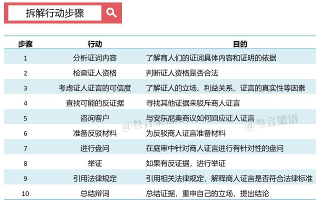
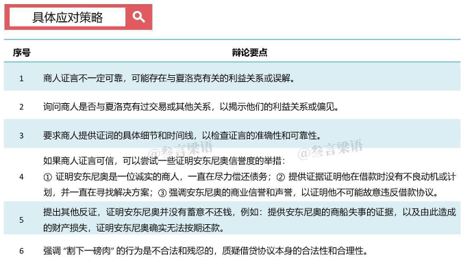

   
## ChatGPT在法律领域可以如何应用？
想象一下，我们只需要输入简单的案件信息，ChatGPT就可以自动化处理文件、审查合同、分析案例、提供智能化法律咨询，这将大大提高法律服务的效率和准确性。

- 普通用户

	可以轻松获取法律知识的帮助，比如打工人跟HR谈判时更有理可依，生意人签合同时更高效便捷，创业者创建公司和管理团队时也有法可循。
- 律师

	可以利用ChatGPT自动化处理各种文件，比如撰写法律文书、法律报告、案件摘要等，还可以梳理案件关键信息、辩论方向和应对策略等。   
	
### GPT 设计的应用
- ChatGPT如何设计法律应用
	- Q:假设你是一名产品经理，你会如何设计一款法律层面应用的APP?
	- A
		- 自动化信息处理
			- 自动处理文件
			- 合同审查
			- 案例分析
			- 智能化法律咨询
		- 提供辅助决策
			- 识别案件信息
			- 提供法律依据
			- 梳理辩论方向
			- 提出应对策略
		- 建立案例库
			- 建立案例库和知识库，为用户提供更全面、深入的法律知识支持
		- 专家咨询服务
			- 提供专家咨询服务解决复杂或特殊的法律问题
		- 共享平台
			- 建立一个共享平台让律师之间可以互相交流和分享自己的经验和观点
- GPT 优势
	- 拆解行动步骤，梳理初步思路

		
	- 结合具体场景，给出应对策略

		
	- 法庭辩论应变

		ChatGPT可以自行生成模拟对话，帮助我们进行辩论预演，重新审视辩论的逻辑性
	- 梳理案件逻辑
		- ChatGPT的准确性和高效率，可以帮助律师快速找到辩论方向；
		- ChatGPT的智能化和自适应性，可以帮助律师应对不同的案件发展情况；
		- ChatGPT的交互性和模拟对话功能，可以帮助律师充分理解案件。

## 成本估算
 【全部压中】 openai降本 增效 和我们之前走访调研预测的时间结果一致：

- 1）6.14 发布更高效 更低成本的 版本！分别是Gpt-4-0613，gpt-3.5-turbo-0613，gpt-3.5-turbo-16k，Text-embedding-ada-002（b端客户用得最多的调优模型）
- 2）不同的版本降成本比例不同，这是公司的商业抉择：
	- 最低的ada 嵌入模型降本75%；
	- 用户最多的gpt-3.5-turbo降了25%
	- 出了一个和gpt4-16k平替版，gpt-3.5-turbo-16k 的价格为每 1K 输入令牌 0.003 美元，降本 95%！
        
   点评：和我上周开电话会议 结果差不多，上周我去预测的6.14号宣布全面接入排队企业，实现了！预测降本70-90%，这个数据基本吻合。

   周末问了一圈海外业务接gpt的公司，他们大部分准备用gpt-3.4-turbo-16k，这个平替版，成本比gpt4 的3.14便宜95%，功能损失可以接受。国内有好几家都在对接
   
   
   		
##  参考
- [ChatGPT的应用场景畅想二（法律篇）](https://m.sohu.com/a/660853445_114819)			
	  
