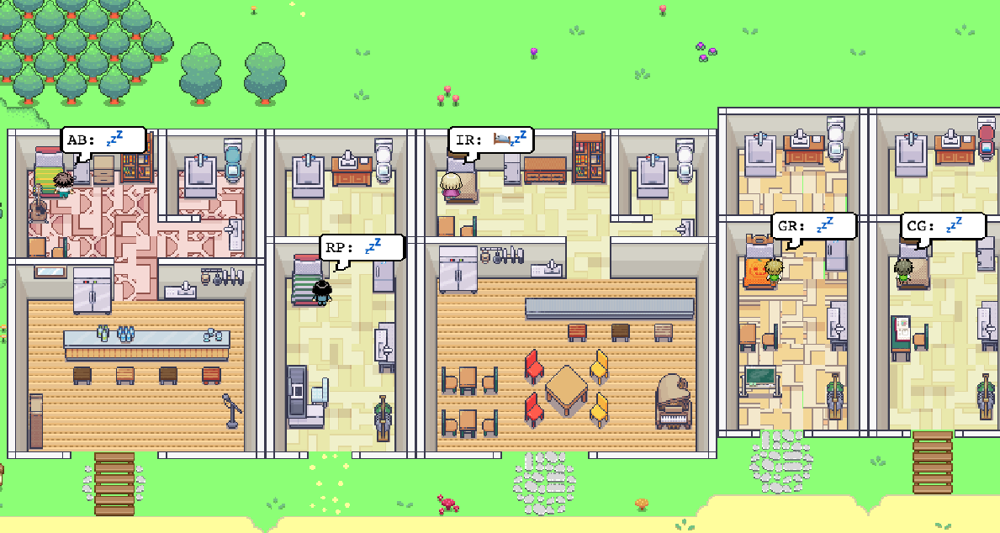
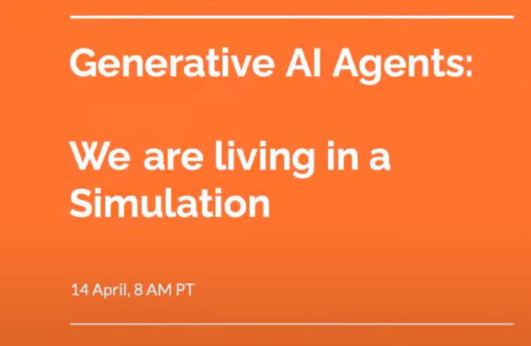
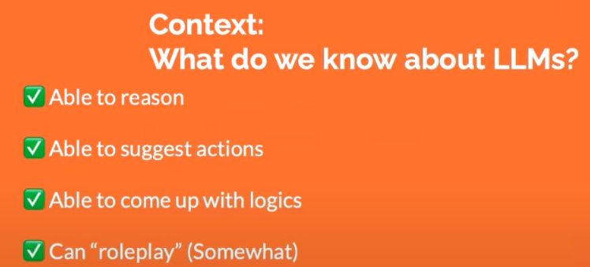
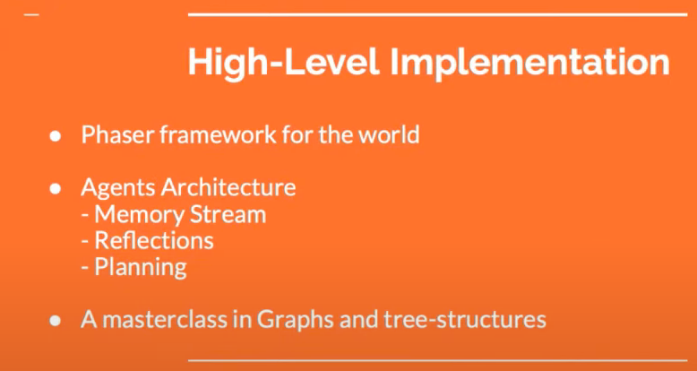
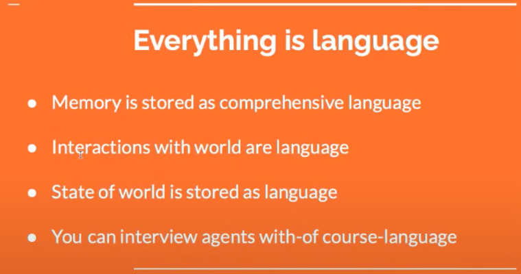

# AI 代理模拟人类交互行为
## 项目介绍
斯坦福大学和google进行了一个非常有趣的思想实验并生成了一个相当受欢迎的论文。

## 实验项目目标
通过 GPT 3.5 API  实现 

- 制作一个模拟人生活世界
- 实现 25个 代理模拟
- 代理与世界的交互
- 代理与代理的交互

## 实验使用开发工具
- [https://phaser.io/](https://phaser.io/)
- LLM-GPT 3.5
	- 问题1

		大约在 10 条消息后，模型会偏离它记忆的数据，就好像失去了从哪里开始的记忆 

## 实验的一些数据统计
- 调用 GPT 接口，花费了几千美元

## [项目视频介绍](https://www.youtube.com/watch?v=xWnhHu5MibY)
### 创建一个 AI 生活的模拟世界？

### 关于 LLM 我们知道些什么？

- 能够推理
- 能够提出行动建议
- 能够提出逻辑
- 可以"角色扮演"

### 论文是什么？

- 制作一个代理(模拟人)生活世界(受到模拟人生启发的小镇)
- 实现 25个 代理模拟
- 代理与世界的交互的细节
- 代理与代理的交互的细节

### 高级实现细节

- 世界来源于 phaser 框架
- 代理体系结构

	需要和人类一样有记忆，需要和人类一样有反射和计划能力，所以框架需要实现这些
	
	- 内存流
	- 反射
	- 规划
- 图与树结构中的一个主类

	举个例子，根节点描述整个世界，子节点描述区域(例如，房子、咖啡馆、商店)，叶节点描述对象(例如，桌子、书架) ，如果对象被占用，那么就让树去更新该节点的状态。这样实现是为了更加精细的控制在没有内存的情况下，实现与代理交谈。
	
	比如问中午12点30分，会做什么，代理可能会说会吃饭。但如果实现了记忆，它就不会再吃饭了，因为之前它已经吃过饭了。

### 一切都是语言(对话)	

这个最酷的地方就是通过语言，在游戏中通过 NPC 自己的交互发生一切而且可以通过构建更复杂的数据结构完成一些，并且可以通过 GPT 3.5 可以理解这一切。比如人类没有告诉代理天气热要从冰箱里拿饮料，而 GPT 可以理解

- 记忆存储用综合语言
	- 记忆有点类似列表，结构类似下面的结构。
	- 记忆会记录每个代理人在每隔几个时间戳的活动，比如步行到厨房喝水、活着步行到洗手间

			[MEM_IBJ](-Timestamp,-Comprehensive) 
- 与世界互动用语言
- 世界状态存储用语言
- 当然还可以使用语言采访代理

## [实验 Demo](http://reverie.herokuapp.com/arXiv_Demo/#) 说明
这是页面是主题为“Generative Agents: Interactive Simulacra of Human Behavior”论文的模拟数据重播。

### 页面功能说明
第一级页面包含6个部分

- 第一级部分A

	
	
	- 1 播放器
	
		可以从这里看到数据在游戏引擎内播放的结果，包含
		
		- 世界信息，如
			- 小镇地图
				- 房屋(有功能，比如咖啡馆、超市、图书馆)
					- 家具
		- 代理信息
			- 头像
			- 描述信息
				- 名称简写
				- 当前活动缩图
					
					通过当前动作，可以知道每个人当前在想什么和做什么   
	- 2 项目描述
	- 3 播放器当前播放的时间
	- 4 播放器操作开关
- 第一级部分B

	
	
	- 5 代理列表

		包含 25 个代理的状态，可以看到他们在分别在做什么和想什么
		
		具体代理在醒来，可能会创建什么任务列表，管理员会先在代理人描述的时候写好一些，然后递归生成一个任务列表
		
		- 头像
		- 名称缩写
		- 当前活动缩图
	- 6 选中单个代理的信息，包含
		
		- 头像
		- 全名
		- 详情按钮(切换到二级页面)
		- 当前活动描述
		- 坐标
		- 当前对话
	
	
			
	
## 参考
- [Generative Agents: Interactive Simulacra of Human Behavior](https://www.youtube.com/watch?v=xWnhHu5MibY)
- [实验 Demo](http://reverie.herokuapp.com/arXiv_Demo/#)