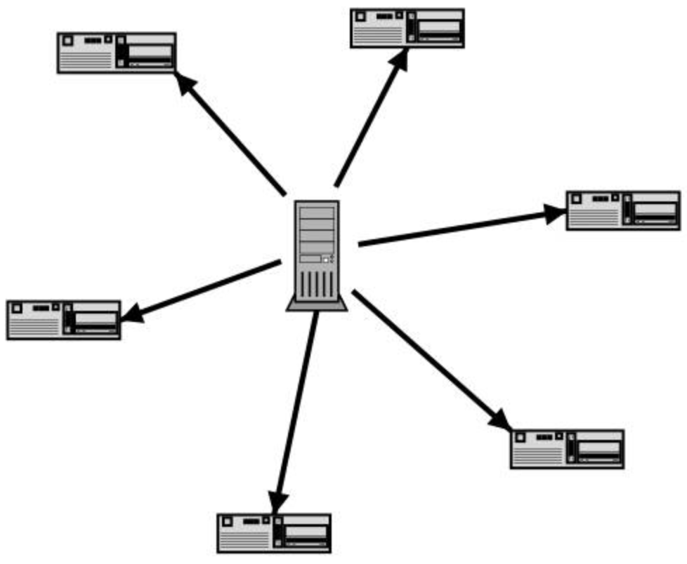
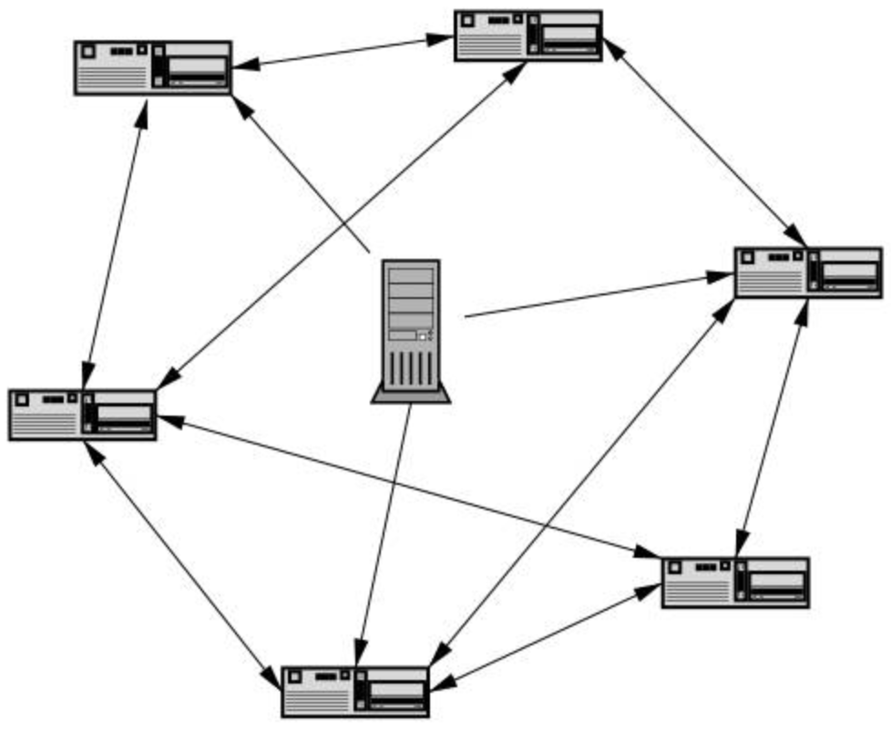

# BitTorrent 原理
## 介绍
BT是目前最热门的下载方式之一，它的全称为 “BitTorrent” 简称 “BT”，中文全称“比特流”,其创始人为布拉姆·科恩。是一个 p2p 软件,在下载的同时，也在为其他用户提供数据上传 upload，因为是节点和节点之间的相互传输，所以不会随着下载客户端数的增加而降低下载速度。解决了中心化带宽问题。

- 传统中心化服务
	
	
	
	在传统下载方式中，一般是把文件由服务器端传送到客户端，例如FTP，HTTP，PUB等等。由于是从一台服务器下载，服务器所提供的带宽是一定的，因而下载人越多速度越慢。但是这样就出现了一个问题，随着用户的增多，对带宽的要求也随之增多，用户过多就会造成瓶颈，很多的服务器会都有用户人数或下载速度限制，这样就给用户造成了不良影响。
- p2p

	
	
	用 BT 下载反而是用户越多，下载越快，这是因为 BT 用的是一种传销的方式来达到共享的。BT 首先在上传端把一个文件分成了 Z 个部分，甲在服务器随机下载了第 N 各部分，乙在服务器随机下载了第 M 个部分，这样甲的 BT 就会根据情况到乙的电脑上去下载乙已经下载好的 M 部分，乙的 BT 就会根据情况到甲的电脑上去下载甲已经下载好的 N 部分，这样就不但减轻了服务器端的负荷，也加快了用户方（甲乙）的下载速度，效率也提高了。
	
	更同样减少了地域之间的限制。比如说丙要连到服务器去下载的话可能才几K，但是要是到甲和乙的电脑上去下载就快得多了。所以说用的人越多，下载的人越多，大家也就越快，BT 的优越性就在这里。
	
	- 由于 BT 之间的数据传输是双向的，这有效降低了对发布者宽带的依赖。
	- 和另一款常见的P2P软件电驴不同，BT协议中没有采用对使用者按上传下载比和登陆顺序及是否能收到入站请求来综合排序进行上传。
	- BT 在大部分时间会不断比较其他 BT 客户端向己方传输数据的速度，并优先上传给向己方传输数据较快的客户端
	
## BT 与运营商	
虽然 BT 协议就有效的使用互联网带宽，但很多电信服务商抱怨 BT 传输占用了过多带宽，影响了网络上的其他应用（如对网络性能要求很高的网上语音，网上点播），来自全球各大电信服务商的统计都显示，BT传输已经占到网上所有数据传输的 70% 以上，不少电信服务商已经采取了单方面的行动来对 BT 传输进行限制，从较温和的数据传输优先度调整到对侦测到 BT 传输直接进行屏蔽，电信服务商称这是为了保护其他用户的权益，大多 BT 使用者认为电信服务商的这种做法违反了他们和服务商签订的服务协议，认为既然带宽不够用，电信服务商就有义务对设备进行改良。

为了应对电信服务商对 BT 传输的限制，主流 BT 软件已经做出了不少改进，以绕开电信服务商的限制，普遍使用的方法包括，

- 通过以 torrent 文件为基础的客户端身份认证
- 对数据进行 `Diffie-Hellman` 密钥加密来防止被电信服务商侦测
- 使用 DHT 分布式网络作为 Tracker 服务器的补充，随机选择传输端口。

由于 BT 在发布和传播上的优点，有很多侵权内容也通过 BT 发布，被告涉嫌鼓励侵权内容的发布和下载，全球最大的 BT 发布和资源索引站点 NOVA 已经被迫关闭，包括 MPAA 和 RIAA 在内的版权保护团体正在对更多的 BT 站点采取行动，大多数 BT 使用者和开发者则认为控告 BT 站点是不明智的，就好比卖菜刀的不应该为有人用菜刀行凶的行为负责一样，BT 站点本身不应该为侵权行为负责。
	
## 种子文件的作用
torrent 文件本质上是文本文件，包含 Tracker 信息和文件信息两部分。

- Tracker 信息

	主要是 BT 下载中需要用到的 Tracker 服务器的地址和针对 Tracker 服务器的设置
- 文件信息

	根据对目标文件的计算生成的，计算结果根据 BitTorrent 协议内的 B 编码规则进行编码。它的主要原理是需要把提供下载的文件虚拟分成大小相等的块，块大小必须为 2k 的整数次方（由于是虚拟分块，硬盘上并不产生各个块文件），并把每个块的索引信息和 Hash 验证码写入 `.torrent` 文件中；所以，`.torrent` 文件就是被下载文件的“索引”。

## 制作种子步骤
- 原始文件或文件夹中数据的 SHA1 值，比如一个 1G 的文件，如果按 1M 每块进行分块，则会被分为了 1000 块，种子文件中就会有这 1000 个数据块的"指纹值=SHA1 的 hash 值"，这个占据了种子文件的绝大部分空间。这些值的目的是为了下载的过程中进行数据校验，确保数据被下载正常，防止恶意数据攻击。
- 指定一个或者多个 Tracker 的地址如 `http://www.a.com:8080/announce` 种子文件里面一般也会存储了这个信息，这个其实也尤为重要。
- 原始文件或者文件夹内每个文件的名字，方便下载文件时，磁盘上直接命名好跟原始数据一样的目录结构、文件名
- 一些辅助和可扩展的信息，比如可以配置一个 P2P 的 http 地址辅助下载，比如制作软件的名字、备注……。
- 上面信息生成后，种子文件会把验证数据以及文件名等关键信息，再进行一次 Hash，生成一个新的 SHA1 值，作为种子文件的 HASH 值，也就是这个种子命名的一个唯一的 hash 值，也有的在 magnet 这种磁力链接中可以看到这个值，这就是种子文件的唯一标记。
- 种子文件可以用记事本打开，但可能看到乱码。这个文件的编码遵循了 bencode 编码规则。

## 下载步骤
客户端要下载文件内容，需要先得到相应的种子文件

- BT 客户端使用种子文件解析得到 Tracker 地址，然后连接 Tracker 服务器。
- Tracker 服务器收到请求后把这个客户端的公网地址记录在一个列表上，同时返回下载客户端这个文件，这里面包含 200 以下个ip，注意客户端每5分钟会和 tracker 节点通讯同步最新数据。如果太久，将被从这里列表中移除。
- 客户端根据列表尝试连接这些 ip,并根据种子文件，两者分别对方告知自己已经有的块，然后交换对方没有的数据。
- 每下载完一个块，需要使用 sha1 算出下载块的 Hash 验证码与种子文件中的对比，如果一样则说明块正确，不一样则需要重新下载这个块，来实现续传功能。
- 注意这里一般会有一个 http 服务器辅助下载节点，可以看成和其他节点一样。

## 下载算法优化
为了防止下载完成后关掉下载任务，提供较少量数据给其他用户，非官方 BitTorrent 协议中存在超级种子的算法。这种算法允许文件发布者分几步发布文件，发布者不需要一次提供文件所有内容，而是慢慢开放的下载内容的比例，延长下载时间。此时，速度快的人由于未下载完必须提供给他人数据。由此往往造成用户卡在任务的 99%,下载和上传比例为1:3。

对客户端的一些优化

- 侦测上传速度，来限制下载。
- 使用非默认的监听端口，放置被服务商屏蔽了。
- 使用防火墙的用户需要在防火墙上打开监听端口
- 使用路由器的用户一般需要通过端口映射，或者 DMZ 功能，或者 UPNP 功能，来使入站请求能到达 BT。
- 即使完成了下载，尽量延缓 BT 上传或者关闭
	

## 得到 peer
到那里下载，这就要寻找有谁提供的种子上传了，这里 BT 是通过 WEB 服务器来实现的，首先 BT 会通过分析 .torrent 来得到下面一串网址

	http://btfans.3322.org:6969/announce?info_hash=%CDg%D4%19%AD%96%9D%93%03%DB%E4%FFXA%C6%5D%043%17O&peer_id=%00%00%00%00%00%00%00%00%00%00%00%00%A3E%E0%9BeB%90d&port=6882&uploadED=0&downloadED=0&left=19171922&event=startED

- http://BTfans.3322.org:6969/announce 

	是发布服务器的地址
- info_hash

	torrent 文件中的 info 部分的 Sha 校验码，WEB 通过它在发布列表找到对应的纪录
- peer_id 

	自身的标识，它是12个0和当前时间+全球的唯一标识码（GUID）的Sha校验的前八位，共20位
- port 

	提供上传的 port
- IP 

	ip地址，没有的话服务器会自己找到
- uploadED\downloadED

	上传和下载了多少，服务器可以用它来做流量分析
- left 

	还要下载多少个字节
- event

	状态，告诉服务器你是准备开始下载，还是停止，还是下载完成了

以上这个操作默认 5 分钟做一次，或由服务器设定

## track 服务器
服务器中有一个 track 程序来管理这些请求

- 得到这一串代码后就会用 `info_hash` 来查找列表，找到就可以下载，找不到就无法下载。
- 接着它会反连（NatCheck）你的 IP 和 Port 这样就可以知道你是内网用户还是共网用户(如果是内网用户，连不通，因为它会连到你的服务器上，你的服务器当然没有这个端口啦）
- 然后服务器返回现在正在下载这个文件的所有公网用户的 IP 和 port ，类：

		d8:intervali1800e5eersld2:ip14:xxx.xxx.xx.xxx7eerid20:00180531904b7e3abdd74orti6881eeee

	- interval 1800
	
		告诉 BT 隔多少秒来查询一次这里是 30 分钟
- 最后如果是公网用户它会把下载用户提交的 IP 和 Port 放到`info_hash` 对应的列表中，这样其它人也可以找到它进行下载了

## 下载
得到这些 peer IP 后，BT 就可以找到对应的 IP 下载，BT 会到所有的 peer 去寻找自己要下载的东西，不是一定要到 seed 下载。BT 每找到一个 peer 就和建立一个 Socket 来下载，所以下载的人越多，速度就越快。

## 内网用户可以做Send的原理
上面说到服务器只会返回公网的 ip 的，那内网用户怎么可以做 Send 呢，这是因为 BT 是一个主动连接的软件（即使你已经下载完了，也不也会主动连接他人）下面是一个仿真流程：

1. 内网用户开始做 seed，
- 服务器收到请求，由于是第一个所以也没有 peer 返回
- 公网用户提交请求，由于 seed 是内网用户所以也没有 peer 返回，等待下载，但服务器会把它的 IP 放到列表中
- 内网经过 interval 时间间隔后，再向服务器放出请求，得到上面得公网 IP
- 得到公网 IP 后，内网马上进行连接
- 公网用户建立连接，数据开始传输(注意现在是公网用户做服务器，内网用户做客户端)
- 其它内网用户去上面公网用户下载数据

所以，内网用户做 seed 一定要有公网用户得参与，否则其它内网用户无法下载。如果全部是内网用户，那个所有连接都不会成立，当然这是比较极端的情况。

以上可见，内网用户不能和内网用户连接，其它用户无法从服务器查到内网用户，所以无法主动连接内网用户，内网用户只能每隔一段时间从服务器找到公网用户一个个进行连接，再提供管道下载。

由于中国很多用户的是内网用户(从服务器上查回来的 peer 还没试过超过10个的)，所以内网用户用 BT 的确要比公网用户要慢很多。

## 迅雷下载原理分析
迅雷的工作原理"多资源超线程技术"基于网格原理，能够将网络上存在的服务器和计算机资源进行有效的整合。实际上还是传统的下载技术，只不过这种下载技术综合应用 HTTP、FTP 传输协议。

- 将文件的文件进行分块、分片下载
- 还可以将文件等分，然后去不同地址下载
- 在这些传统下载中穿插 P2P 技术，也就是一种新的盗链技术

特点

1. 多点下载

	收集网上的所有下载地址以便多点下载。迅雷收集所有用户名和密码的下载地址，然后供其他人使用。这就是“盗链”
- 使用类似 BT 的 P2P 下载技术。

	迅雷启动后，会在系统背后启动两个线程 Thunder.exe 和 Issue
	
	- 这两个线程和 BT 一样，共享本地硬盘上的文件，让其它迅雷用户下载
- 收集用户提供的资源。
	- 用户在电影网站上得到一个下载地址(A)，用迅雷下载。这个下载地址就会被上传到迅雷服务器上；
	- 又有一个用户在另一个网站上下载同一部电影，迅雷的服务器又得到另一个下载地址(B)。
	- 迅雷服务器就会把相同文件的下载地址(A，B)集合在一起，形成一个资源，而那两个用迅雷下载这两个电影的用户也算上，就会有四个下载点。
	- 当又有用户在别的地方准备下载相同的电影的时候，迅雷就会在数据库里比较，找出相同的资源(其它下载点也就是原先收集到的)，提供给那个准备下载的用户下载，这个用户就会同时有多个下载点来下载而达到速度的飞升。而这个用户当然也不可能只是享受高速的下载，他同时也会上传了他下载的那部份数据(BT原理)。
	- 迅雷解决死链问题（死链是服务器地址发生变化，无法找到当前地址包括：协议死链和内容死链），迅雷记载每一个用户的下载记录，只要迅雷打开，它就会上传用户下载过的文件文件
- p2sp
	- 用户首先从 Web 服务器上获得下载文件的种子文件，种子文件中包含下载文件名及数据部分的哈希值，还包含一个或者多个的索引(Tracker)服务器地址。
	- 客户端向索引服务器发一个超文本传输协议(HTTP)的GET请求，并把它自己的私有信息和下载文件的哈希值放在GET的参数中；
	- 索引服务器根据请求的哈希值查找内部的数据字典，随机地返回正在下载该文件的一组节点，客户端连接这些节点，下载需要的文件片段。
	- 将索引服务器的文件下载过程简单地分成两个 部分：
		- 与索引服务器通信的HTTP，与其他客户端通信并传输数据的协议，称为BitTorrent对等协议。
		- BitTorrent协议也处在不断变化，可以通过数据报协议(UDP)和DHT的方法获得可用的传输节点信息，而不是仅仅通过原有的 HTTP

所以，当一个用户用迅雷下载时，就会连上迅雷服务器，查找资源，如果是热门的文件，迅雷就能返回大量的下载点，供这个用户下载。从而达到下载速度的提升。

## 电驴和 bt 的区别
其实跟 ED 也十分相似，ED 跟 BT 不同的地方有

- ED 要连上一个固定 server，而 BT 没有固定 server,只要分享者制作出该分享档案的 `.torrent` 档公布出来便可
- BT--种子seed越多速度越快
- ED 全局性分享，而 BT 支持独立团体性的分享(可做到速度保证)
- ED 知道在分享者的 user name & 速度，BT 没有

比起其它的 P2P 软件，BT 有个独特的地方，它存在一个中间的 WEB 服务器，就是我们在发布的时所填写的 announce。 该服务器提供了发布的统一管理，不像其它 P2P 软件那样到处去找哪些非常不稳定的服务器

该 WEB 服务器更大的作用是内网用户可以做 Send（下面会说明原理），这是其它软件无法做到的，但不好的地方是 announce 当机的时候就无法下载了。要知道 P2P 下载关键是要人气要高，announce 停一下就搞到人气全没有了。

## 参考
- [BT原理分析](https://blog.csdn.net/it_man/article/details/6602771)
- [BitTorrent协议](https://baike.baidu.com/item/BitTorrent/142795?fromtitle=BitTorrent%E5%8D%8F%E8%AE%AE&fromid=10961364)
- [BT种子的技术原理是什么？就是.torrent文件该如何理解？](https://blog.csdn.net/dianliang01/article/details/80663068)