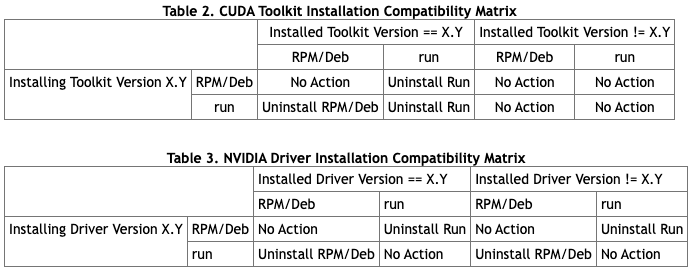
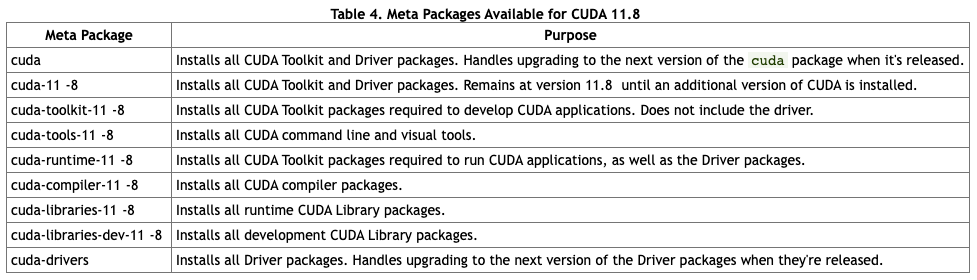
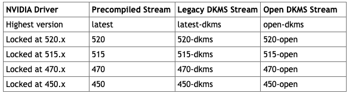
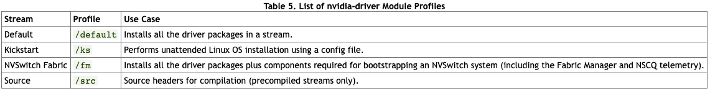
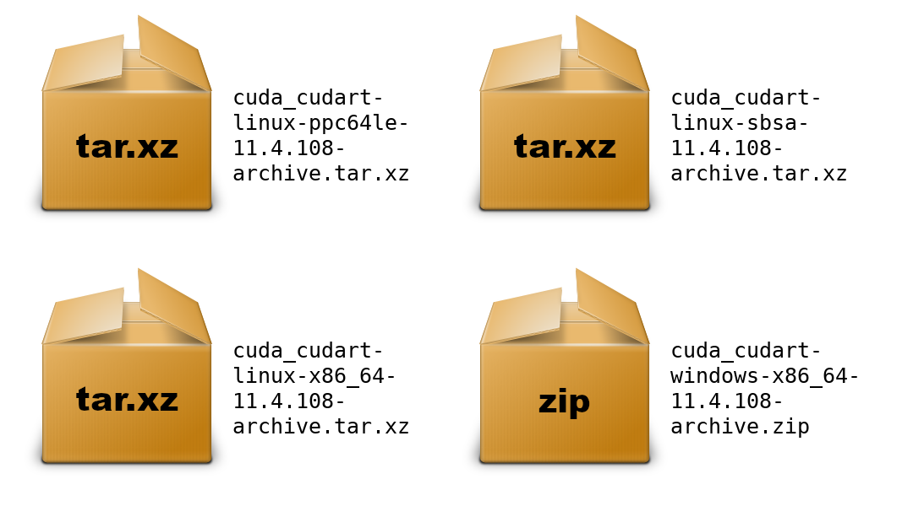
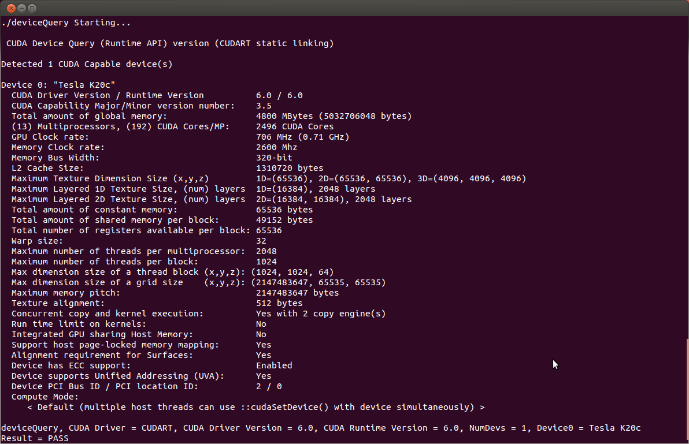
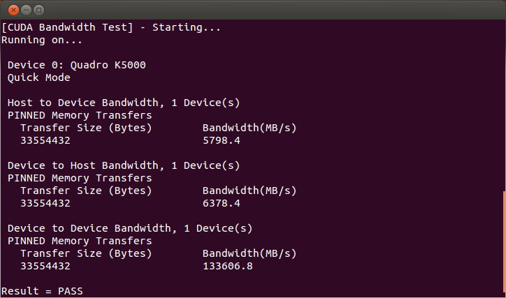

# 适用于 Linux 的 NVIDIA CUDA 安装指南(仅 rocky linux)
Linux 上 CUDA 工具包的安装说明。

## 1. 简介
CUDA® 是由 NVIDIA® 发明的并行计算平台和编程模型。它通过利用图形处理单元 (GPU) 的强大功能来显着提高计算性能。

CUDA 的开发考虑了几个设计目标：

- 为标准编程语言（如 C）提供一小组扩展，可以直接实现并行算法。使用 CUDA C/C+++，程序员可以专注于算法的并行化任务，而不是花时间在它们的实现上。
- 支持应用程序同时使用 CPU 和 GPU 的异构计算。应用程序的串行部分在 CPU 上运行，并行部分卸载到 GPU。因此，CUDA 可以逐步应用于现有应用程序。 CPU 和 GPU 被视为具有自己的内存空间的独立设备。此配置还允许在 CPU 和 GPU 上同时进行计算，而不会争用内存资源。

支持 CUDA 的 GPU 拥有数百个内核，可以共同运行数千个计算线程。这些内核具有共享资源，包括寄存器文件和共享内存。片上共享内存允许在这些内核上运行的并行任务共享数据，而无需通过系统内存总线发送数据。

本指南将向您展示如何安装和检查 CUDA 开发工具的正确运行。

### 1.1 系统要求
要在您的系统上使用 NVIDIA CUDA，您需要安装以下内容：

- 支持 CUDA 的 GPU
- 带有 gcc 编译器和工具链的受支持版本的 Linux
- CUDA 工具包（可在 [https://developer.nvidia.com/cuda-downloads](https://developer.nvidia.com/cuda-downloads) 获得）

CUDA 开发环境依赖于与主机开发环境的紧密集成，包括主机编译器和 C 运行时库，因此仅在符合此 CUDA Toolkit 版本的分发版本上受支持。

下表列出了支持的 Linux 发行版。请查看与表格相关的脚注。

表 1. CUDA 11.8 中的本机 Linux 发行版支持

Distribution|Kernel|Default GCC|GLIBC|GCC2,3|ICC3|NVHPC3|XLC3|CLANG|Arm C/C++
---|---|---|---|---|---|---|---|---|---
Rocky Linux 9.0|5.14.0-70.13.1|11.2.1|2.34|11|2021|22.3|NO|14.0|NO
Rocky Linux 8.y (y<=6)|4.18.0-372.9.1|8.5.0|2.28|11|2021|22.3|NO|14.0|NO

#### (1) 以下注意事项适用于 CUDA 支持的内核版本：
- 有关 Red Hat Enterprise Linux (RHEL) 支持的特定内核版本，请访问 [https://access.redhat.com/articles/3078](https://access.redhat.com/articles/3078)
- 在 [https://www.suse.com/support/kb/doc/?id=000019587](https://www.suse.com/support/kb/doc/?id=000019587) 上提供了内核版本列表，包括 SUSE Linux Enterprise Server (SLES) 的发布日期。
- 对于 x86-64 上的 Ubuntu LTS，CUDA 11.8 支持服务器 LTS 内核（例如，18.04 的 4.15.x）。访问 [https://wiki.ubuntu.com/Kernel/Support](https://wiki.ubuntu.com/Kernel/Support) 了解更多信息。

#### (2) 请注意，从 CUDA 11.0 开始，由于 CUDA 库（例如 cuFFT 和 CUB）中的 C++11 要求，建议的最低 GCC 编译器至少为 GCC 6。
在默认情况下可能使用较旧的 GCC 工具链的发行版（例如 RHEL 7 或 CentOS 7）上，建议在 CUDA 11.0 中使用较新的 GCC 工具链。 [Red Hat Developer Toolset](https://developers.redhat.com/products/developertoolset/overview) 提供了较新的 GCC 工具链。对于默认发布早于 GCC 6 的编译器版本的平台，不支持使用默认编译器链接到静态 cuBLAS 和 cuDNN。
#### (3) 列出以下编译器的次要版本：GCC、ICC、NVHPC 和 XLC，作为 nvcc 的主机编译器受支持。
#### (4) L4T 提供了一个 Linux 内核和一个源自 Ubuntu 20.04 的示例根文件系统。有关详细信息，请访问 [https://developer.nvidia.com/embedded/jetson-linux](https://developer.nvidia.com/embedded/jetson-linux)。
### 1.2 操作系统支持政策
- CUDA 支持 Ubuntu 18.04.x、Ubuntu 20.04.x、Ubuntu 22.04.x、RHEL 7.x、RHEL 8.x、RHEL 9.x、CentOS 7.x、Rocky Linux 8.x、Rocky Linux 9.x、 SUSE SLES 15.x 和 OpenSUSE Leap 15.x 将持续到为每个操作系统定义的标准 EOSS。请参阅这些操作系统的支持生命周期以了解它们的支持时间表。
- CUDA 支持单个和最新的 Debian 发行版本。有关 Debian 发布时间表，请访问 [https://wiki.debian.org/DebianReleases](https://wiki.debian.org/DebianReleases)。
- CUDA 支持单一和最新的 Fedora 发行版本。有关 Fedora 发布时间表，请访问 [https://docs.fedoraproject.org/en-US/releases/](https://docs.fedoraproject.org/en-US/releases/)。
- CUDA 支持单个和最新的 KylinOS 发布版本。详情请访问 [https://www.kylinos.cn/](https://www.kylinos.cn/)。

请参阅这些受支持操作系统的支持生命周期，以了解其支持时间表并相应地计划迁移到新版本。

### 1.3.关于本文档
本文档适用于熟悉 Linux 环境和从命令行编译 C 程序的读者。您不需要以前的 CUDA 经验或并行计算经验。注意：本指南仅涵盖在安装了 X Windows 的系统上的安装。

注意：本文档中的许多命令可能需要超级用户权限。在大多数 Linux 发行版上，这将要求您以 root 身份登录。对于已启用 sudo 包的系统，请对所有必要的命令使用 sudo 前缀。

## 2. 预安装操作
在 Linux 上安装 CUDA 工具包和驱动程序之前必须采取一些措施：

- 验证系统是否具有支持 CUDA 的 GPU。
- 验证系统正在运行受支持的 Linux 版本。
- 验证系统是否安装了 gcc。
- 验证系统是否安装了正确的内核头文件和开发包。
- 下载 NVIDIA CUDA 工具包。
- 处理冲突的安装方法。

注意：您可以通过运行带有 `-override` 标志的安装程序来覆盖安装时先决条件检查。请记住，使用 NVIDIA CUDA 工具包仍然需要先决条件。

### 2.1 验证您拥有支持 CUDA 的 GPU
要验证您的 GPU 是否支持 CUDA，请转到您的发行版的等效系统属性，或者从命令行输入：

	lspci | grep -i nvidia
如果您没有看到任何设置，请通过在命令行输入  `update-pciids`（通常在 /sbin 中找到）来更新 Linux 维护的 PCI 硬件数据库，然后重新运行之前的 `lspci `命令。

如果您的显卡来自 NVIDIA 并且它在 [https://developer.nvidia.com/cuda-gpus](https://developer.nvidia.com/cuda-gpus) 中列出，则您的 GPU 支持 CUDA。

CUDA 工具包的发行说明还包含受支持产品的列表。
### 2.2 验证您拥有受支持的 Linux 版本
CUDA 开发工具仅在某些特定的 Linux 发行版上受支持。这些在 CUDA Toolkit 发行说明中列出。

要确定您正在运行的发行版和版本号，请在命令行中键入以下内容：

	uname -m && cat /etc/*release
您应该看到类似于以下内容的输出，针对您的特定系统进行了修改：

- rocky
	
		x86_64
		Rocky Linux release 8.6 (Green Obsidian)
		NAME="Rocky Linux"
		VERSION="8.6 (Green Obsidian)"
		ID="rocky"
		ID_LIKE="rhel centos fedora"
		VERSION_ID="8.6"
		PLATFORM_ID="platform:el8"
		PRETTY_NAME="Rocky Linux 8.6 (Green Obsidian)"
		....
`x86_64` 行表示您在 64 位系统上运行。其余部分提供有关您的分布的信息。

### 2.3 验证系统是否安装了 gcc
使用 CUDA Toolkit 进行开发需要 `gcc` 编译器。运行 CUDA 应用程序不需要它。它通常作为 Linux 安装的一部分进行安装，并且在大多数情况下，使用受支持的 Linux 版本安装的 gcc 版本将正常工作。

要验证系统上安装的 gcc 版本，请在命令行中键入以下内容：

	gcc --version
如果显示错误消息，您需要从 Linux 发行版安装开发工具或从 Web 获取 `gcc` 版本及其随附的工具链。
### 2.4 验证系统是否安装了正确的内核头文件和开发包
CUDA 驱动程序要求在安装驱动程序时以及在重建驱动程序时安装内核运行版本的内核头文件和开发包。例如，如果您的系统运行内核版本 3.17.4-301，则还必须安装 3.17.4-301 内核头文件和开发包。

虽然 Runfile 安装不执行包验证，但如果当前未安装这些包的版本，驱动程序的 RPM 和 Deb 安装将尝试安装内核头文件和开发包。但是，它将安装这些软件包的最新版本，该版本可能与您系统使用的内核版本匹配，也可能不匹配。因此，最好在安装 CUDA 驱动程序之前以及在更改内核版本时手动确保安装了正确版本的内核头文件和开发包。

您的系统正在运行的内核版本可以通过运行以下命令找到：

	uname -r
这是在安装 CUDA 驱动程序之前必须安装的内核头文件和开发包的版本。该命令将在下面多次使用以指定要安装的软件包的版本。

	请注意，以下是内核使用的常见情况。更高级的情况，例如自定义内核分支，应该确保它们的内核头文件和源代码与它们正在运行的内核构建相匹配。
注意：如果您执行的系统更新更改了正在使用的 linux 内核的版本，请确保重新运行以下命令以确保您安装了正确的内核头文件和内核开发包。否则，CUDA 驱动程序将无法与新内核一起使用。

- Fedora/RHEL 8/Rocky Linux 8

	当前运行的内核的内核头文件和开发包可以安装

		sudo dnf install kernel-devel-$(uname -r) kernel-headers-$(uname -r)
	如果当前运行的内核版本没有匹配的 kernel-headers 和 kernel-devel 包，您可能需要使用这些包的先前发布的版本。 有关详细信息，请参阅 [https://bugzilla.redhat.com/show_bug.cgi?id=1986132](https://bugzilla.redhat.com/show_bug.cgi?id=1986132)。
	
### 2.5 安装 MLNX_OFED(rocky linux 不支持)
如果您打算使用 GPUDirectStorage (GDS)，则必须安装 CUDA 包和 MLNX_OFED 包。

可以使用 CUDA 打包指南安装 GDS 包。按照 [MLNX_OFED 要求和安装中的说明进行操作](https://docs.nvidia.com/gpudirect-storage/troubleshooting-guide/index.html#mofed-req-install)。

GDS 支持两种不同的模式：GDS（默认/完全性能模式）和兼容模式。它们的安装说明略有不同。由于软件依赖性限制，兼容模式是某些发行版支持的唯一模式。

完全 GDS 支持仅限于以下 Linux 发行版：

	Ubuntu 18.04、20.04
	RHEL 8.3、RHEL 8.4
	
### 2.6 选择安装方法
CUDA Toolkit 可以使用两种不同的安装机制进行安装：特定于发行版的包（RPM 和 Deb 包）或独立于发行版的包（运行文件包）。

- 独立于发行版的软件包的优点是可以在更广泛的 Linux 发行版上工作，但不会更新发行版的本机软件包管理系统。
- 特定于发行版的包与发行版的本机包管理系统接口。建议尽可能使用特定于发行版的软件包。

注意：不为 x86_64 版本以外的体系结构提供独立安装程序。对于本机开发和交叉开发，必须使用特定于发行版的安装程序安装该工具包。有关详细信息，请参阅 [CUDA 跨平台安装部分](https://docs.nvidia.com/cuda/cuda-installation-guide-linux/index.html#cross-installation)。

### 2.7.下载 NVIDIA CUDA 工具包
NVIDIA CUDA 工具包可从 [https://developer.nvidia.com/cuda-downloads](https://developer.nvidia.com/cuda-downloads) 获得。

选择您使用的平台并下载 NVIDIA CUDA Toolkit。

CUDA 工具包包含创建、构建和运行 CUDA 应用程序所需的 CUDA 驱动程序和工具，以及库、头文件和其他资源。

- 下载验证

	可以通过将发布在 [https://developer.download.nvidia.com/compute/cuda/11.8.0/docs/sidebar/md5sum.txt](https://developer.download.nvidia.com/compute/cuda/11.8.0/docs/sidebar/md5sum.txt) 的 MD5 校验和与下载文件的校验和进行比较来验证下载。如果任一校验和不同，则下载的文件已损坏，需要再次下载。

要计算下载文件的 MD5 校验和，请运行以下命令：
	
	md5sum <文件>

### 2.8. 地址自定义 xorg.conf，如果适用
该驱动程序依赖于 `/etc/X11/xorg.conf` 中自动生成的 `xorg.conf `文件。 如果存在定制的 `xorg.conf `文件，则此功能将被禁用，驱动程序可能无法工作。 您可以尝试删除现有的 `xorg.conf `文件，或将 `/etc/X11/xorg.conf.d/00-nvidia.conf ` 的内容添加到 `xorg.conf` 文件中。 `xorg.conf` 文件很可能需要对具有非平凡 GPU 配置的系统进行手动调整。

### 2.9 处理冲突的安装方法
在安装 CUDA 之前，应卸载任何可能冲突的先前安装。 这不会影响之前未安装 CUDA 的系统，或保留了安装方法的系统（RPM/Deb 与 Runfile）。 具体见下表。

表 2. CUDA 工具包安装兼容性表

- 使用以下命令卸载 Toolkit 运行文件安装：

		sudo /usr/local/cuda-X.Y/bin/cuda-uninstaller
- 使用以下命令卸载驱动程序运行文件安装：
	
		sudo /usr/bin/nvidia-uninstall
- 使用以下命令卸载 RPM/Deb 安装：

		sudo dnf remove <package_name> # RHEL 8 / Rocky Linux 8
		
## 3.包管理器安装
基本说明可在快速入门指南中找到。 请继续阅读以获取更[详细的说明](https://docs.nvidia.com/cuda/cuda-quick-start-guide/index.html#linux)。
### 3.1 概述
使用 RPM 或 Debian 软件包进行安装与系统的软件包管理系统交互。 使用 RPM 或 Debian 本地 repo 安装程序时，下载的软件包包含存储在本地文件系统 `/var/` 中的存储库快照。 这样的包只通知包管理器在哪里可以找到实际的安装包，但不会安装它们。

如果启用了在线网络存储库，RPM 或 Debian 软件包将在安装时使用软件包管理器自动下载：`apt-get、dnf、yum` 或 `zypper`。

特定于发行版的说明详细说明了如何安装 CUDA：

- [RHEL 8 / Rocky Linux 8](https://docs.nvidia.com/cuda/cuda-installation-guide-linux/index.html#redhat8-installation)

最后，详细介绍了一些有用的[包管理器功能](https://docs.nvidia.com/cuda/cuda-installation-guide-linux/index.html#package-manager-additional)。

这些说明仅用于本机开发。 对于跨平台开发，请参阅 [CUDA 跨平台环境部分](https://docs.nvidia.com/cuda/cuda-installation-guide-linux/index.html#cross-platform)。

注意：`nvidia-fs、libnvidia_nscq` 和 `fabricmanager` 等可选组件默认不安装，需要根据需要单独安装。

### 3.2 RHEL 7 / CentOS 7
### 3.3 RHEL 8 / Rocky 8
#### 3.3.1  准备 RHEL 8 / Rocky 8
- 1 执行[安装前操作](https://docs.nvidia.com/cuda/cuda-installation-guide-linux/index.html#pre-installation-actions)。
- 2 满足第三方包依赖：
	-  满足 DKMS 依赖：NVIDIA 驱动 RPM 包依赖于其他外部包，例如 DKMS 和 `libvdpau`。 这些软件包仅在第三方存储库中可用，例如 EPEL。 在安装 NVIDIA 驱动程序 RPM 包之前，必须将任何此类第三方存储库添加到包管理器存储库数据库中，否则缺少依赖项将阻止安装继续进行。
要启用 EPEL：

			sudo dnf install https://dl.fedoraproject.org/pub/epel/epel-release-latest-8.noarch.rpm
	- 启用可选存储库：

		仅在 RHEL 8 Linux 上，执行以下步骤以启用可选存储库。

		- 在 x86_64 系统上：

				subscription-manager repos --enable=rhel-8-for-x86_64-appstream-rpms
				subscription-manager repos --enable=rhel-8-for-x86_64-baseos-rpms
				subscription-manager repos --enable=codeready-builder-for-rhel-8-x86_64-rpms 
		- 在 POWER9 系统上：

				subscription-manager repos --enable=rhel-8-for-ppc64le-appstream-rpms
				subscription-manager repos --enable=rhel-8-for-ppc64le-baseos-rpms
				subscription-manager repos --enable=codeready-builder-for-rhel-8-ppc64le-rpms
- 3 删除过时的签名密钥：

		sudo rpm --erase gpg-pubkey-7fa2af80*
- 4 选择安装方法：[本地 repo](https://docs.nvidia.com/cuda/cuda-installation-guide-linux/index.html#redhat8-installation-local) 或[网络 repo](https://docs.nvidia.com/cuda/cuda-installation-guide-linux/index.html#redhat8-installation-network)

#### 3.3.2 RHEL 8 / Rocky 8 的本地存储库安装
- 1 在文件系统上安装本地存储库：

		sudo rpm --install cuda-repo-<distro>-X-Y-local-<version>*.<arch>.rpm
		
#### 3.3.3 RHEL 8 / Rocky 8 的网络 repo 安装
- 1 启用网络 repo：

		sudo dnf config-manager --add-repo https://developer.download.nvidia.com/compute/cuda/repos/$distro/$arch/cuda-$distro.repo
	例	

		sudo dnf config-manager --add-repo https://developer.download.nvidia.com/compute/cuda/repos/rhel8/x86_64/cuda-rhel8.repo

	其中 `$distro/$arch` 应替换为以下之一：

	- rhel8/cross-linux-sbsa
	- rhel8/ppc64le
	- rhel8/sbsa
	- rhel8/x86_64
- 2 安装新的 CUDA 公共 GPG 密钥：

	CUDA 存储库（基于 RPM 的发行版）的新 GPG 公钥是 [d42d0685](https://developer.download.nvidia.com/compute/cuda/repos/fedora32/x86_64/D42D0685.pub)。

	在全新安装 RHEL 时，dnf 包管理器将在首次安装包时提示用户接受新密钥。在出现提示时表明您接受更改。

	对于升级，您还必须获取更新的 .repo 条目：

		sudo dnf config-manager --add-repo https://developer.download.nvidia.com/compute/cuda/repos/$distro/$arch/cuda-$distro.repo
- 3 清理 Yum 存储库缓存：

		sudo dnf clean expire-cache
		
#### 3.3.4 RHEL 8 / Rocky 8 的通用说明
这些说明适用于本地和网络安装。

- 1 安装 CUDA SDK：

		sudo dnf module install nvidia-driver:latest-dkms
		sudo dnf install cuda
- 2 安装 GPUDirect 文件系统：

		sudo dnf install nvidia-gds
- 3 如有必要，添加 libcuda.so 符号链接

	`libcuda.so` 库安装在 `/usr/lib{,64}/nvidia` 目录中。 对于使用` libcuda.so` 的预先存在的项目，在 `/usr/lib{,64}` 目录中添加来自 `libcuda.so` 的符号链接可能很有用。

- 4 重启系统：

		sudo reboot
- 5 执行[安装后操作](https://docs.nvidia.com/cuda/cuda-installation-guide-linux/index.html#post-installation-actions)。
				 
### 3.4. RHEL 9 / Rocky 9
### 3.5. KylinOS 10
### 3.6. Fedora
### 3.7. SLES
### 3.8. OpenSUSE
### 3.9. WSL
### 3.10. Ubuntu
### 3.11. Debian

### 3.12 附加包管理器功能
以下是用户可以利用的包管理器的一些附加功能。
#### 3.12.1 可用套餐
推荐的安装包是 `cuda` 包。该软件包将安装原生开发所需的全套其他 CUDA 软件包，并应涵盖大多数场景。

`cuda` 包安装所有可用的包，用于本地开发。这包括编译器、调试器、分析器、数学库等等。对于 x86_64 平台，这还包括 Nsight Eclipse Edition 和可视化分析器。它还包括 NVIDIA 驱动程序包。

在支持的平台上，`cuda-cross-aarch64` 和 `cuda-cross-ppc64el` 软件包分别将跨平台开发所需的所有软件包安装到 ARMv8 和 POWER8。还安装了目标架构的显示驱动程序包的库和头文件，以实现驱动程序应用程序的交叉编译。 `cuda-cross-<arch>` 软件包不安装本机显示驱动程序。

上述软件包安装的软件包也可以通过显式指定其名称来单独安装。可用包的列表可以通过以下方式获得：

	yum --disablerepo="*" --enablerepo="cuda*" list available    # RedHat
	dnf --disablerepo="*" --enablerepo="cuda*" list available    # Fedora
	zypper packages -r cuda                                      # OpenSUSE & SLES
	cat /var/lib/apt/lists/*cuda*Packages | grep "Package:"      # Ubuntu
#### 3.12.2 适用于 Linux x86_64 .deb/.rpm 的可选 32 位软件包
这些软件包提供诸如 Steam（流行的游戏应用商店/启动器）、较旧的视频游戏和一些计算应用程序所需的 32 位驱动程序库。

- For Debian 11

		sudo dpkg --add-architecture i386
		sudo apt-get update
		sudo apt-get install libcuda1-i386 nvidia-driver-libs-i386
- For Ubuntu

		sudo dpkg --add-architecture i386
		sudo apt-get update
		sudo apt-get install libnvidia-compute-<branch>:i386 libnvidia-decode-<branch>:i386 \
		 libnvidia-encode-<branch>:i386 libnvidia-extra-<branch>:i386 libnvidia-fbc1-<branch>:i386 \
		 libnvidia-gl-<branch>:i386
		 
	其中 <branch> 是驱动程序版本，例如 495。
- For Fedora and RHEL8:

		sudo dnf install nvidia-driver-cuda-libs.i686 nvidia-driver-devel.i686 \
		 nvidia-driver-libs.i686 nvidia-driver-NvFBCOpenGL.i686 nvidia-driver-NVML.i686
	注意：没有模块化配置文件支持。
- 对于 openSUSE/SLES：

	无需额外安装，nvidia-glG05 软件包已经包含 32 位库
	
#### 3.12.3. 包升级
cuda 包指向 CUDA 工具包的最新稳定版本。 当有新版本可用时，使用以下命令升级工具包和驱动程序

	sudo yum install cuda                                        # RHEL7
	sudo dnf upgrade cuda                                        # Fedora/RHEL8
	sudo zypper install cuda                                     # OpenSUSE & SLES
	sudo apt-get install cuda                                    # Ubuntu
`cuda-cross-<arch>` 软件包也可以以相同的方式升级。cuda-drivers 包指向 CUDA 存储库中可用的最新驱动程序版本。 当有新版本可用时，使用以下命令升级驱动程序：

	sudo yum install nvidia-driver-latest-dkms                   # RHEL7
	sudo yum install cuda-drivers                                # RHEL7
	sudo dnf module update nvidia-driver:latest-dkms             # RHEL8/Fedora
	sudo zypper install cuda-drivers nvidia-gfxG04-kmp-default   # OpenSUSE & SLES
	sudo apt-get install cuda-drivers                            # Ubuntu
某些桌面环境（例如 GNOME 或 KDE）会在有新软件包可用时显示通知警报。

为避免任何自动升级，并将工具包安装锁定到 X.Y 版本，请安装 `cuda-X-Y` 或 `cuda-cross-<arch>-X-Y` 包。

支持并排安装。 例如，要同时安装 `X.Y CUDA Toolkit` 和 `X.Y+1 CUDA Toolki`t，请安装 `cuda-X.Y` 和 `cuda-X.Y+1` 包。

#### 3.12.4 元包
元包是 RPM/Deb/Conda 包，不包含（或很少）文件，但有多个依赖项。 当您可能不知道所需软件包的详细信息时，它们用于安装许多 CUDA 软件包。 以下是元包列表。

表 4. 可用于 CUDA 11.8 的元包

## 4.驱动安装
本部分适用于想要安装特定驱动程序版本的用户。

- For Debian and Ubuntu

		sudo apt-get install cuda-drivers-<branch>
	例
		
		sudo apt-get install cuda-drivers-418
- For OpenSUSE and SLES:

		sudo zypper install cuda-drivers-<branch>
	例

		sudo zypper install cuda-drivers-450

	这使您可以在指定的分支中获得最高版本。
- For Fedora and RHEL8:

		sudo dnf module install nvidia-driver:<stream>/<profile>
		
	其中 profile 默认为“default”，无需指定。
		
	- 示例 dkms 流：`450-dkms` 或 `latest-dkms`
	- 预编译流示例：`450` 或 `latest`

	注意：预编译流仅在 RHEL8 x86_64 上受支持。

	要在 Fedora 和 RHEL8 上卸载或更改流：

		sudo dnf module remove --all nvidia-driver
		sudo dnf module reset nvidia-driver

## 5. NVIDIA 开放 GPU 内核模块
NVIDIA Linux GPU 驱动程序包含几个内核模块：

- nvidia.ko
- nvidia-modeset.ko
- nvidia-uvm.ko
- nvidia-drm.ko
- nvidia-peermem.ko

从 515 驱动程序发布系列开始，提供了这些内核模块的两种“风格”：

- `Proprietary` - 这是 NVIDIA 历来提供的风味。
- `Open-source` - 发布的内核模块是双重许可的 MIT/GPLv2。 这些是从 515 版开始的新功能。随着每个驱动程序的发布，开放内核模块的源代码将在 [https://github.com/NVIDIA/open-gpu-kernel-modules](https://github.com/NVIDIA/open-gpu-kernel-modules) 上发布，并且将在 [https://download.nvidia.com/XFree86/](https://download.nvidia.com/XFree86/) 上提供 

验证您的 NVIDIA GPU 至少是 Turing 或更新一代。

	lspci | grep VGA
可以通过以下方式启用对 GeForce 和 Quadro SKU 的实验性支持：

	echo "options nvidia NVreg_OpenRmEnableUnsupportedGpus=1" | sudo tee /etc/modprobe.d/nvidia-gsp.conf
要安装 NVIDIA Open GPU 内核模块，请按照以下说明进行操作。

- CUDA 运行文件

	将 CLI 参数传递给 CUDA 运行文件以选择加入 NVIDIA Open GPU Kernel Modules：

		sh cuda_<release>_<version>_linux.run -m=kernel-open
- Debian
	- 安装 NVIDIA Open GPU 内核模块包：

			sudo apt-get install nvidia-kernel-open-dkms
	- 安装其余的 NVIDIA 驱动程序包：

			sudo apt-get install cuda-drivers
- Fedora

	安装 NVIDIA Open GPU Kernel Modules 包和其余的 NVIDIA 驱动程序包：
	
		sudo dnf module install nvidia-driver:open-dkms
- KylinOS 10

	安装 NVIDIA Open GPU Kernel Modules 包和其余的 NVIDIA 驱动程序包：

		sudo dnf module install nvidia-driver:open-dkms
- RHEL 9 / Rocky 9

	安装 NVIDIA Open GPU Kernel Modules 包和其余的 NVIDIA 驱动程序包：
	
		sudo dnf module install nvidia-driver:open-dkms
- RHEL 8 / Rocky 8

	安装 NVIDIA Open GPU Kernel Modules 包和其余的 NVIDIA 驱动程序包：
	
		sudo dnf module install nvidia-driver:open-dkms
- RHEL 7 / CentOS 7
	- 安装 NVIDIA Open GPU 内核模块包：

			sudo yum install kmod-nvidia-open-dkms
	- 安装其余的 NVIDIA 驱动程序包（nvidia-settings 除外）：

			sudo yum install nvidia-driver-latest-dkms
	- 安装 nvidia 设置：

			sudo yum install cuda-drivers
- OpenSUSE / SLES
	- 安装 NVIDIA Open GPU 内核模块包：

			sudo zypper install nvidia-open-gfxG05-kmp-default
	- 安装其余的 NVIDIA 驱动程序包：

			sudo zypper install cuda-drivers
- Ubuntu
	- 安装 NVIDIA Open GPU 内核模块包：

			sudo apt-get install nvidia-kernel-open-520
	- 安装其余的 NVIDIA 驱动程序包：

			sudo apt-get install cuda-drivers-520
			
## 6. 预编译流
预编译流提供了一种简化安装过程的可选方法。

预编译流的优点：

- 预编译：驱动程序和/或内核更新后启动速度更快
- 预测试：内核和驱动程序组合已经过验证
- 删除 gcc 依赖项：无需编译器安装
- 删除 dkms 依赖项：不需要启用 EPEL 存储库
- 删除 kernel-devel 和 kernel-headers 依赖项：如果缺少匹配的包，则不会出现黑屏

使用预编译驱动程序时，启用了 dnf 包管理器插件，用于清理陈旧的 .ko 文件。为了防止系统损坏，NVIDIA dnf 插件还可以防止升级到尚未存在预编译驱动程序的内核。这可能会延迟安全修复程序的应用，但可以确保始终使用经过测试的内核和驱动程序组合。在该升级情况下，dnf 会显示警告：

	NOTE:  Skipping kernel installation since no NVIDIA driver kernel module package
	 kmod-nvidia-${driver}-${kernel} ... could be found
GitHub 上提供了打包模板和说明，允许您为自定义内核和衍生 Linux 发行版维护自己的预编译内核模块包：[NVIDIA/yum-packaging-precompiled-kmod](https://github.com/NVIDIA/yum-packaging-precompiled-kmod)

要在 RHEL 8 或 RHEL 9 上使用新的驱动程序包：

- 首先，确保启用 Red Hat 存储库：
	- RHEL 8：

			subscription-manager repos --enable=rhel-8-for-x86_64-appstream-rpms
			subscription-manager repos --enable=rhel-8-for-x86_64-baseos-rpms
	- RHEL 9：

			subscription-manager repos --enable=rhel-9-for-x86_64-appstream-rpms
			subscription-manager repos --enable=rhel-9-for-x86_64-baseos-rpms
- 根据所需的驱动程序选择以下四个选项之一：
	- `latest` 总是更新到最高版本的驱动程序（预编译）：

			sudo dnf module install nvidia-driver:latest
	- `<id>` 将驱动程序更新锁定到指定的驱动程序分支（预编译）：

			sudo dnf module install nvidia-driver:<id> 

		注意：将` <id>` 替换为适当的驱动程序分支流，例如 520、515、470 或 450。
	- `latest-dkms` 总是更新到最高版本的驱动程序（非预编译）：

			sudo dnf module install nvidia-driver:latest-dkms
		注意：这是默认流。
	- `<id>-dkms` 将驱动程序更新锁定到指定的驱动程序分支（非预编译）：

			sudo dnf module install nvidia-driver:<id>-dkms  
		注意：有效流包括 520-dkms、515-dkms、470-dkms 和 450-dkms。

### 6.1 预编译流支持矩阵
此表显示每个驱动程序支持的预编译和旧 DKMS 流。

在模块流之间切换之前，首先重置：

	sudo dnf module reset nvidia-driver
注意：这也是分支锁定流之间的升级所必需的。或者：

	sudo dnf moduleswitch-tonvidia-driver:<stream>
### 6.2. 模块化配置文件
模块化配置文件可与任何受支持的模块化流一起使用，并允许使用其他用例。 这些模块化配置文件在 RHEL8 和 Fedora 上可用。

例子

	sudo dnf module nvidia-driver:<stream>/default
	sudo dnf module nvidia-driver:<stream>/ks
	sudo dnf module nvidia-driver:<stream>/fm
	sudo dnf module nvidia-driver:<stream>/src	
您可以使用 BASH 花括号扩展安装多个模块化配置文件，例如：

	sudo dnf module install nvidia-driver:latest/{default,src} 
请参阅开发人员博客中的 [https://developer.nvidia.com/blog/streamlining-nvidia-driver-deployment-on-rhel-8-with-modularity-streams](https://developer.nvidia.com/blog/streamlining-nvidia-driver-deployment-on-rhel-8-with-modularity-streams) 和 [https://developer.download.nvidia.com/compute /cuda/repos/rhel8/x86_64/precompiled/](https://developer.download.nvidia.com/compute/cuda/repos/rhel8/x86_64/precompiled/) 了解更多信息。

## 7. Kickstart 安装
### 7.1. RHEL 8 / Rocky Linux 8
- 启用 EPEL 存储库：

		repo --name=epel --baseurl=http://download.fedoraproject.org/pub/epel/8/Everything/x86_64/
- 启用 CUDA 存储库：

		repo --name=cuda-rhel8 --baseurl=https://developer.download.nvidia.com/compute/cuda/repos/rhel8/x86_64/
- 在 `ks.cfg` 文件的 packages 部分，确保您使用的是 `/ks` 配置文件和 `:latest-dkms` 流：
	
		@nvidia-driver:latest-dkms/ks
- 执行[安装后操作](https://docs.nvidia.com/cuda/cuda-installation-guide-linux/index.html#post-installation-actions)。

### 7.2. RHEL 9 / Rocky Linux 9
- 启用 EPEL 存储库：

		repo --name=epel --baseurl=http://download.fedoraproject.org/pub/epel/9/Everything/x86_64/
- 启用 CUDA 存储库：

		repo --name=cuda-rhel9 --baseurl=https://developer.download.nvidia.com/compute/cuda/repos/rhel9/x86_64/
- 在 `ks.cfg` 文件的 packages 部分，确保您使用的是 `/ks` 配置文件和 `:latest-dkms` 流：

		@nvidia-driver:latest-dkms/ks
- 执行[安装后操作](https://docs.nvidia.com/cuda/cuda-installation-guide-linux/index.html#post-installation-actions)。

## 8.运行文件安装
基本说明可在[快速入门](https://docs.nvidia.com/cuda/cuda-quick-start-guide/index.html#linux)指南中找到。请继续阅读以获取更详细的说明。

本节介绍使用独立安装程序时 CUDA 的安装和配置。独立安装程序是一个“.run”文件，是完全独立的。

### 8.1 概述
Runfile 安装通过基于 ncurses 的交互式界面安装 NVIDIA 驱动程序和 CUDA 工具包。

下面列出了[安装步骤](https://docs.nvidia.com/cuda/cuda-installation-guide-linux/index.html#runfile-installation)。还提供了有关[禁用 Nouveau 驱动程序](https://docs.nvidia.com/cuda/cuda-installation-guide-linux/index.html#runfile-nouveau)的特定于发行版的说明以及[验证设备节点创建](https://docs.nvidia.com/cuda/cuda-installation-guide-linux/index.html#runfile-verifications)的步骤。

最后，下面详细介绍了安装程序和[卸载步骤](https://docs.nvidia.com/cuda/cuda-installation-guide-linux/index.html#runfile-uninstallation)的[高级选项](https://docs.nvidia.com/cuda/cuda-installation-guide-linux/index.html#runfile-advanced)。

Runfile 安装不包括对跨平台开发的支持。对于跨平台开发，请参阅 [CUDA 跨平台环境](https://docs.nvidia.com/cuda/cuda-installation-guide-linux/index.html#cross-platform)部分。
### 8.2.安装
- 执行[安装前操作](https://docs.nvidia.com/cuda/cuda-installation-guide-linux/index.html#pre-installation-actions)。
- [禁用 Nouveau 驱动程序](https://docs.nvidia.com/cuda/cuda-installation-guide-linux/index.html#runfile-nouveau)。
- 重新启动进入文本模式（运行级别 3）。

	这通常可以通过在系统内核引导参数的末尾添加数字“3”来实现。

	由于尚未安装 NVIDIA 驱动程序，文本终端可能无法正确显示。暂时将“nomodeset”添加到系统的内核启动参数可能会解决此问题。

	有关如何进行上述引导参数更改的信息，请参阅系统的引导加载程序文档。

	需要重新启动才能完全卸载 Nouveau 驱动程序并防止加载图形界面。在加载 Nouveau 驱动程序或图形界面处于活动状态时，无法安装 CUDA 驱动程序。
- 确认未加载 Nouveau 驱动程序。如果仍然加载了 Nouveau 驱动程序，请查阅发行版的文档以查看是否需要进一步的步骤来禁用 Nouveau。
- 运行安装程序并按照屏幕上的提示进行操作：

		sudo sh cuda_<version>_linux.run

	安装程序将提示以下内容：

	- EULA 接受
	- CUDA 驱动安装
	- CUDA Toolkit 安装、位置和 `/usr/local/cuda` 符号链接

	该工具包的默认安装位置是` /usr/local/cuda-11.8`：

	`/usr/local/cuda` 符号链接指向安装 CUDA Toolkit 的位置。此链接允许项目使用最新的 CUDA 工具包，而无需更新任何配置文件。

	安装程序必须以足够的权限执行才能执行某些操作。当当前权限不足以执行操作时，安装程​​序将要求用户输入密码以尝试使用 root 权限进行安装。导致安装程序尝试以 root 权限安装的操作是：

	- 安装 CUDA 驱动程序
	- 将 CUDA Toolkit 安装到用户无权写入的位置
	- 创建 `/usr/local/cuda` 符号链接

	如上所示，使用 `sudo` 运行安装程序将授予安装到需要 root 权限的目录的权限。使用 sudo 运行安装程序时创建的目录和文件将具有 root 所有权。

	如果安装驱动程序，安装程序还会询问是否应安装 openGL 库。如果用于显示的 GPU 不是 NVIDIA GPU，则不应安装 NVIDIA openGL 库。否则非NVIDIA GPU的显卡驱动使用的openGL库会被覆盖，GUI无法工作。如果执行静默安装，应使用 `--no-opengl-libs ` 选项来防止安装 openGL 库。有关详细信息，请参阅[高级选项](https://docs.nvidia.com/cuda/cuda-installation-guide-linux/index.html#runfile-advanced)部分。

	如果用于显示的 GPU 是 NVIDIA GPU，则可能需要修改 X 服务器配置文件 `/etc/X11/xorg.conf`。在某些情况下，`nvidia-xconfig` 可用于自动生成适用于系统的 `xorg.conf` 文件。对于非标准的系统，例如有多个 GPU 的系统，建议手动编辑 `xorg.conf` 文件。有关更多信息，请参阅 `xorg.conf` 文档。

	注意：安装 Mesa 可能会覆盖之前由 NVIDIA 驱动程序安装的 `/usr/lib/libGL.so`，因此安装这些库后可能需要重新安装 NVIDIA 驱动程序。
- 重启系统重新加载图形界面：

		sudo reboot
- 验证[设备节点](https://docs.nvidia.com/cuda/cuda-installation-guide-linux/index.html#runfile-verifications)是否已正确创建。
- 执行[安装后操作](https://docs.nvidia.com/cuda/cuda-installation-guide-linux/index.html#post-installation-actions)。	

### 8.3 禁用 Nouveau
要安装显示驱动程序，必须首先禁用 Nouveau 驱动程序。每个 Linux 发行版都有不同的方法来禁用 Nouveau。

如果以下命令打印任何内容，则会加载 Nouveau 驱动程序：

	lsmod | grep nouveau
#### 8.3.1.Fedora
- 在 `/usr/lib/modprobe.d/blacklist-nouveau.conf` 创建一个文件，内容如下：

		blacklist nouveau
		options nouveau modeset=0
- 重新生成内核 initramfs：

		sudo dracut --force
- 运行以下命令：

		sudo grub2-mkconfig -o /boot/grub2/grub.cfg
- 重新启动系统。

#### 8.3.2. RHEL/Rocky 和 ​​KylinOS
- 在 `/etc/modprobe.d/blacklist-nouveau.conf` 创建一个文件，内容如下：

		blacklist nouveau
		options nouveau modeset=0
- 重新生成内核 initramfs：

		sudo dracut --force
#### 8.3.3. OpenSUSE
- 在 `/etc/modprobe.d/blacklist-nouveau.conf `创建一个文件，内容如下：

		blacklist nouveau
		options nouveau modeset=0
- 重新生成内核 initrd：

		sudo update-initramfs -u
		
#### 8.3.4. SLES
由于 SLES 上未安装 Nouveau，因此无需执行任何禁用 Nouveau 的操作。
#### 8.3.5  WSL
由于未在 WSL 上安装 Nouveau，因此无需执行任何禁用 Nouveau 的操作。
#### 8.3.6. Ubuntu
- 在 `/etc/modprobe.d/blacklist-nouveau.conf` 创建一个文件，内容如下：

		blacklist nouveau
		options nouveau modeset=0
- 重新生成内核 initramfs：

		sudo update-initramfs -u
		
#### 8.3.7. Debian
- 在 `/etc/modprobe.d/blacklist-nouveau.conf` 创建一个文件，内容如下：

		blacklist nouveau
		options nouveau modeset=0
- 重新生成内核 initramfs：

		sudo update-initramfs -u

### 8.4. 设备节点验证
检查设备文件 `/dev/nvidia*` 是否存在并具有正确的 (0666) 文件权限。 CUDA 驱动程序使用这些文件与 NVIDIA 驱动程序的内核模式部分进行通信。 使用 NVIDIA 驱动程序的应用程序，例如 CUDA 应用程序或 X 服务器（如果有），如果这些文件丢失，通常会使用与 NVIDIA 驱动程序捆绑在一起的 setuid `nvidia-modprobe` 工具自动创建这些文件。 但是，某些系统不允许 setuid 二进制文件，因此如果这些文件不存在，您可以使用以下启动脚本手动创建它们：

	#!/bin/bash
	
	/sbin/modprobe nvidia
	
	if [ "$?" -eq 0 ]; then
	  # Count the number of NVIDIA controllers found.
	  NVDEVS=`lspci | grep -i NVIDIA`
	  N3D=`echo "$NVDEVS" | grep "3D controller" | wc -l`
	  NVGA=`echo "$NVDEVS" | grep "VGA compatible controller" | wc -l`
	
	  N=`expr $N3D + $NVGA - 1`
	  for i in `seq 0 $N`; do
	    mknod -m 666 /dev/nvidia$i c 195 $i
	  done
	
	  mknod -m 666 /dev/nvidiactl c 195 255
	
	else
	  exit 1
	fi
	
	/sbin/modprobe nvidia-uvm
	
	if [ "$?" -eq 0 ]; then
	  # Find out the major device number used by the nvidia-uvm driver
	  D=`grep nvidia-uvm /proc/devices | awk '{print $1}'`
	
	  mknod -m 666 /dev/nvidia-uvm c $D 0
	else
	  exit 1
	fi

### 8.5 高级选项
行动|选项|解释
---|---|---
Silent Installation 静默安装|`--silent`|任何静默安装都是必需的。 根据下面提供的选项执行安装，无需进一步的用户输入和最少的命令行输出。 静默安装对于编写 CUDA 安装脚本很有用。 使用此选项意味着接受 EULA。 以下标志可用于自定义安装期间采取的操作。 如果以非 root 权限运行，则必须至少传递 --driver、--uninstall 和 --toolkit 之一。
||`--driver`| 安装 CUDA 驱动
||`--toolkit`|安装 CUDA Toolkit 工具集.
||`--toolkitpath=<path>`|将 CUDA Toolkit 安装到 <path> 目录。 如果未提供，则使用默认路径 `/usr/local/cuda-11.8`。
||`--defaultroot=<path>`|将库安装到 <path> 目录。 如果未提供 <path>，则使用分发的默认路径。 这仅适用于安装在 CUDA Toolkit 路径之外的库。
| Extraction |`	--extract=<path>`|将以下内容提取到 <path>：驱动程序运行文件、工具包的原始文件到 <path>。当想要使用驱动程序安装程序提供的一个或多个命令行选项安装驱动程序时，这一点特别有用，这些选项未在此安装程序中公开。
|Overriding Installation Checks 覆盖安装检查| `--override`|忽略编译器、第三方库和工具包检测检查，这些检查会阻止安装 CUDA 工具包。
|No OpenGL Libraries|`	--no-opengl-libs`|防止驱动程序安装 NVIDIA 的 GL 库。 对于显示器由非 NVIDIA GPU 驱动的系统很有用。 在这样的系统中，NVIDIA 的 GL 库可能会阻止 X 正确加载。
|No man pages|`	--no-man-page`|不要将手册页安装在 `/usr/share/man` 下
|Overriding Kernel Source| `--kernel-source-path=<path>`|告诉驱动程序安装在构建 NVIDIA 内核模块时使用 <path> 作为内核源目录。 对于内核源安装到非标准位置的系统是必需的
|Running nvidia-xconfig|`--run-nvidia-xconfig`|告诉驱动程序安装运行 nvidia-xconfig 以更新系统 X 配置文件，以便使用 NVIDIA X 驱动程序。 预先存在的 X 配置文件将被备份。
|No nvidia-drm kernel module|`--no-drm`|不要安装 nvidia-drm 内核模块。 此选项应仅用于解决在不需要提供的功能的系统上构建或安装 nvidia-drm 内核模块的故障
|Custom Temporary Directory Selection 自定义临时目录选择|`--tmpdir=<path>`|在 <path> 而不是`/tmp` 中执行任何临时操作。 在 `/tmp` 无法使用的情况下很有用（不存在、已满、使用 'noexec' 挂载等）。
|Show Installer Options 显示安装程序选项 | `--help` | 将命令行选项列表打印到标准输出。
### 8.6. 卸载
要卸载 CUDA Toolkit，请运行工具包 `bin` 目录中提供的卸载脚本。 默认情况下，它位于 `/usr/local/cuda-11.8/bin`：

	sudo /usr/local/cuda-11.8/bin/cuda-uninstaller
要卸载 NVIDIA 驱动程序，请运行 `nvidia-uninstall`：

	sudo /usr/bin/nvidia-uninstall
要启用 Nouveau 驱动程序，请删除在[禁用 Nouveau](https://docs.nvidia.com/cuda/cuda-installation-guide-linux/index.html#runfile-nouveau) 部分中创建的黑名单文件，然后按照该部分中的说明重新生成内核 initramfs/initrd。

## 9. Conda 安装
本节介绍使用 Conda 安装程序时 CUDA 的安装和配置。 Conda 软件包可在 [https://anaconda.org/nvidia](https://anaconda.org/nvidia) 获得。
### 9.1 Conda 概述
Conda 安装会安装 CUDA Toolkit。 下面列出了安装步骤。
### 9.2. 安装
要使用 Conda 执行所有 CUDA Toolkit 组件的基本安装，请运行以下命令：

	conda install cuda -c nvidia
### 9.3. 卸载
要使用 Conda 卸载 CUDA Toolkit，请运行以下命令：

	conda remove cuda
### 9.4 安装以前的 CUDA 版本
在特定 CUDA 版本下发布的所有 Conda 软件包都标有该发布版本。 要安装以前的版本，请在安装命令中包含该标签，例如：

	conda install cuda -c nvidia/label/cuda-11.3.0

## 10. pip wheels
NVIDIA 提供 Python Wheels 用于通过 pip 安装 CUDA，主要用于将 CUDA 与 Python 结合使用。这些包旨在用于运行时使用，目前不包括开发人员工具（这些可以单独安装）。

请注意，使用这种安装方法，CUDA 安装环境是通过 pip 管理的，并且必须额外注意设置您的主机环境以在 pip 环境之外使用 CUDA。
### 10.1 先决条件
要安装 Wheels，您必须首先安装 `nvidia-pyindex` 包，这是设置 pip 安装以从 NVIDIA NGC PyPI 存储库获取其他 Python 模块所必需的。如果您的 pip 和 setuptools Python 模块不是最新的，则使用以下命令升级这些 Python 模块。如果这些 Python 模块已过期，则本节后面的命令可能会失败。

	python3 -m pip install --upgrade setuptools pip wheel
您现在应该可以安装 `nvidia-pyindex` 模块了。

	python3 -m pip install nvidia-pyindex
如果您的项目正在使用 `requirements.txt` 文件，那么您可以将以下行添加到您的 `requirements.txt `文件中，作为安装 `nvidia-pyindex` 包的替代方法：

	--extra-index-url https://pypi.ngc.nvidia.com
### 10.2 程序
安装 CUDA 运行时包：

	python3 -m pip install nvidia-cuda-runtime-cu11
或者，使用以下命令安装下面列出的其他软件包：

	python3 -m pip install nvidia-<library>

### 10.3 Metapackages
以下 Metapackages 将在 Linux 上为指定的 CUDA 版本安装最新版本的命名组件。 “cu11”应读作“cuda11”。

	nvidia-cuda-runtime-cu11
	nvidia-cuda-cupti-cu11
	nvidia-cuda-nvcc-cu11
	nvidia-nvml-dev-cu11
	nvidia-cuda-nvrtc-cu11
	nvidia-nvtx-cu11
	nvidia-cuda-sanitizer-api-cu11
	nvidia-cublas-cu11
	nvidia-cufft-cu11
	nvidia-curand-cu11
	nvidia-cusolver-cu11
	nvidia-cusparse-cu11
	nvidia-npp-cu11
	nvidia-nvjpeg-cu11
安装以下包

	nvidia-nvml-dev-cu118
	nvidia-cuda-nvcc-cu118
	nvidia-cuda-runtime-cu118
	nvidia-cuda-cupti-cu118
	nvidia-cublas-cu118
	nvidia-cuda-sanitizer-api-cu118
	nvidia-nvtx-cu118
	nvidia-cuda-nvrtc-cu118
	nvidia-npp-cu118
	nvidia-cusparse-cu118
	nvidia-cusolver-cu118
	nvidia-curand-cu118
	nvidia-cufft-cu118
	nvidia-nvjpeg-cu118

## 11. Tarball 和 Zip 存档可交付成果
为了满足不断增长的客户群的需求，他们需要替代安装程序打包格式，以及输入社区 CI/CD 系统、tarball 和每个组件的 zip 存档的方法。

这些 tarball 和 zip 存档在 [https://developer.download.nvidia.com/compute/cuda/redist/](https://developer.download.nvidia.com/compute/cuda/redist/) 上提供。

这些 .tar.xz 和 .zip 档案不会替换现有的软件包，例如 .deb、.rpm、runfile、conda 等，并且不适合一般使用，因为它们不是安装程序。 然而，这种标准化方法将取代现有的 .txz 档案。

对于每个版本，都会提供一个 JSON 清单，例如 `redistrib_11.4.2.json`，它对应于 CUDA 11.4.2 版本标签（CUDA 11.4 更新 2），其中包括发布日期、每个组件的名称、许可证名称、相对 URL 对于每个平台和校验和。

建议包维护者在重新分发之前检查每个组件的提供的许可证。 下一节将提供使用 CMake 和 Bazel 构建系统的开发人员的说明。

### 11.1 解析再分发 JSON
以下 JSON 清单示例包含每个组件的密钥：名称、许可证、版本和平台数组，其中包括每个存档的 relative_path、sha256、md5 和大小（字节）。

	{
	    "release_date": "2021-09-07",
	    "cuda_cudart": {
	        "name": "CUDA Runtime (cudart)",
	        "license": "CUDA Toolkit",
	        "version": "11.4.108",
	        "linux-x86_64": {
	            "relative_path": "cuda_cudart/linux-x86_64/cuda_cudart-linux-x86_64-11.4.108-archive.tar.xz",
	            "sha256": "d08a1b731e5175aa3ae06a6d1c6b3059dd9ea13836d947018ea5e3ec2ca3d62b",
	            "md5": "da198656b27a3559004c3b7f20e5d074",
	            "size": "828300"
	        },
	        "linux-ppc64le": {
	            "relative_path": "cuda_cudart/linux-ppc64le/cuda_cudart-linux-ppc64le-11.4.108-archive.tar.xz",
	            "sha256": "831dffe062ae3ebda3d3c4010d0ee4e40a01fd5e6358098a87bb318ea7c79e0c",
	            "md5": "ca73328e3f8e2bb5b1f2184c98c3a510",
	            "size": "776840"
	        },
	        "linux-sbsa": {
	            "relative_path": "cuda_cudart/linux-sbsa/cuda_cudart-linux-sbsa-11.4.108-archive.tar.xz",
	            "sha256": "2ab9599bbaebdcf59add73d1f1a352ae619f8cb5ccec254093c98efd4c14553c",
	            "md5": "aeb5c19661f06b6398741015ba368102",
	            "size": "782372"
	        },
	        "windows-x86_64": {
	            "relative_path": "cuda_cudart/windows-x86_64/cuda_cudart-windows-x86_64-11.4.108-archive.zip",
	            "sha256": "b59756c27658d1ea87a17c06d064d1336576431cd64da5d1790d909e455d06d3",
	            "md5": "7f6837a46b78198402429a3760ab28fc",
	            "size": "2897751"
	        }
	    }
	}
在 [https://developer.download.nvidia.com/compute/redist/redistrib-v2.schema.json ](https://developer.download.nvidia.com/compute/redist/redistrib-v2.schema.json) 提供了 JSON 模式。

[GitHub](https://github.com/NVIDIA/build-system-archive-import-examples/blob/main/parse_redist.py) 上提供了解析这些 JSON 清单的示例脚本：

- 下载每个档案
- 验证 SHA256 校验和
- 提取档案
- 展平为折叠的目录结构

### 11.2. 将压缩包导入 CMake
将这些 tarball 导入 CMake 构建系统的推荐模块是通过 [FindCUDAToolkit](https://cmake.org/cmake/help/latest/module/FindCUDAToolkit.html)（3.17 和更高版本）。

注意：不推荐使用 FindCUDA 模块。

可以使用` CUDAToolkit_ROOT` 环境变量指定提取位置的路径。 例如 `CMakeLists.txt` 和命令，请参阅 cmake/1_FindCUDAToolkit/。

对于旧版本的 CMake，ExternalProject_Add 模块是一种替代方法。 例如 CMakeLists.txt 文件和命令，请参见 [cmake/2_ExternalProject/](https://github.com/NVIDIA/build-system-archive-import-examples/blob/main/cmake/1_FindCUDAToolkit)。
### 11.3. 将压缩包导入 Bazel
将这些 tarball 导入 Bazel 构建系统的推荐方法是使用 [http_archive](https://docs.bazel.build/versions/main/repo/http.html) 和 [pkg_tar](https://docs.bazel.build/versions/main/be/pkg.html#pkg_tar)。

例如，请参阅 [bazel/1_pkg_tar/](https://github.com/NVIDIA/build-system-archive-import-examples/blob/main/bazel/1_pkg_tar)。

## 12. CUDA 跨平台环境
跨平台开发仅在 Ubuntu 系统上受支持，并且仅通过 Package Manager 安装过程提供。

我们建议选择 Ubuntu 18.04 作为您的跨平台开发环境。此选择有助于防止主机/目标不兼容，例如 GCC 或 GLIBC 版本不匹配。
### 12.1. CUDA 跨平台安装
作为本机 [Ubuntu 安装](https://docs.nvidia.com/cuda/cuda-installation-guide-linux/index.html#ubuntu-installation)的一部分，可能已经执行了以下某些步骤。可以安全地跳过这些步骤。

这些步骤应该在 x86_64 主机系统上执行，而不是在目标系统上执行。要在目标系统上安装本机 CUDA Toolkit，请参阅本机 [Ubuntu](https://docs.nvidia.com/cuda/cuda-installation-guide-linux/index.html#ubuntu-installation) 安装部分。

- 执行安装前操作。
- 安装存储库元数据包：

		sudo dpkg -i cuda-repo-cross-<identifier>_all.deb 
	其中` <identifier>` 表示操作系统、体系结构和/或包的版本。
- 更新 Apt 存储库缓存：

		sudo apt-get update
- 安装适当的跨平台 CUDA 工具包：
	- 对于 aarch64：

			sudo apt-get install cuda-cross-aarch64
	- 对于 QNX：

			sudo apt-get install cuda-cross-qnx
- 执行[安装后操作](https://docs.nvidia.com/cuda/cuda-installation-guide-linux/index.html#post-installation-actions)。

### 12.2. CUDA 跨平台示例
CUDA 示例现在位于 [https://github.com/nvidia/cuda-samples](https://github.com/nvidia/cuda-samples)，其中包括获取、构建和运行示例的说明
## 13. 安装后操作
必须手动执行安装后操作。这些操作分为强制、推荐和可选部分。
### 13.1.强制性行动
安装后必须执行一些操作，然后才能使用 CUDA 工具包和驱动程序。
#### 13.1.1.环境设置
`PATH` 变量需要包含 `export PATH=/usr/local/cuda-11.8/bin${PATH:+:${PATH}}`。 Nsight Compute 已移动到 `/opt/nvidia/nsight-compute/` 仅在 rpm/deb 安装方法中。使用` .run` 安装程序时，它仍然位于 `/usr/local/cuda-11.8/` 下。

将此路径添加到 `PATH` 变量：

	export PATH=/usr/local/cuda-11.8/bin${PATH:+:${PATH}}
另外，使用 runfile 安装方式时，`LD_LIBRARY_PATH` 变量在64位系统上需要包含 `/usr/local/cuda-11.8/lib64` ，在32位系统上需要包含 `/usr/local/cuda-11.8/lib`

- 要更改 64 位操作系统的环境变量：

		export LD_LIBRARY_PATH=/usr/local/cuda-11.8/lib64\
		                         ${LD_LIBRARY_PATH:+:${LD_LIBRARY_PATH}}
- 要更改 32 位操作系统的环境变量：

		export LD_LIBRARY_PATH=/usr/local/cuda-11.8/lib\
		                         ${LD_LIBRARY_PATH:+:${LD_LIBRARY_PATH}}
请注意，当使用带有运行文件安装方法的自定义安装路径时，上述路径会发生变化。

#### 13.1.2. POWER9 设置
### 13.2.建议的操作
建议采取其他措施来验证安装的完整性。
#### 13.2.1.安装持久性守护程序
NVIDIA 在 Linux 上提供了一个用户空间守护程序，以支持跨 CUDA 作业运行的驱动程序状态的持久性。守护程序方法为这个问题提供了比持久性模式更优雅、更健壮的解决方案。有关 NVIDIA Persistence Daemon 的更多详细信息，请参阅[此处](http://docs.nvidia.com/deploy/driver-persistence/index.html#persistence-daemon)的文档。

NVIDIA Persistence Daemon 可以通过运行以下命令以 root 用户身份启动：

	/usr/bin/nvidia-persistenced --verbose
此命令应在启动时运行。有关如何自动执行此操作的详细信息，请参阅您的 Linux 发行版的 init 文档。
#### 13.2.2.安装可写样本
CUDA 示例现在位于 [https://github.com/nvidia/cuda-samples](https://github.com/nvidia/cuda-samples)，其中包括获取、构建和运行示例的说明。
#### 13.2.3.验证安装
在继续之前，重要的是验证 CUDA 工具包可以找到并与支持 CUDA 的硬件正确通信。为此，您需要编译并运行位于 [https://github.com/nvidia/cuda-samples](https://github.com/nvidia/cuda-samples) 中的一些示例程序。

注意：确保 PATH 以及（如果使用运行文件安装方法）[正确设置](https://docs.nvidia.com/cuda/cuda-installation-guide-linux/index.html#environment-setup) LD_LIBRARY_PATH 变量。

- 13.2.3.1.验证驱动程序版本

	如果您安装了驱动程序，请验证是否加载了正确版本的驱动程序。如果您没有安装驱动程序，或者正在使用未通过内核模块加载驱动程序的操作系统，例如 L4T，请跳过此步骤。

	驱动加载完成后，执行命令即可找到驱动版本

		cat /proc/driver/nvidia/version
	请注意，此命令不适用于 iGPU/dGPU 系统。
- 13.2.3.2 运行二进制文件

	编译后，从 [https://github.com/nvidia/cuda-samples](https://github.com/nvidia/cuda-samples) 找到并运行 `deviceQuery`。如果正确安装和配置了 CUDA 软件，`deviceQuery` 的输出应该类似于图 1 中所示的。

	图 1. deviceQuery CUDA 示例的有效结果

	
	您的系统上的确切外观和输出行可能会有所不同。 重要的结果是找到了一个设备（第一个突出显示的行），该设备与您系统上的设备匹配（第二个突出显示的行），并且测试通过了（最后一个突出显示的行）。

	如果安装了支持 CUDA 的设备和 CUDA 驱动程序，但` deviceQuery` 报告不存在支持 CUDA 的设备，这可能意味着` /dev/nvidia*` 文件丢失或权限错误。

	在启用 `SELinux `的系统上，您可能需要暂时禁用此安全功能才能运行 `deviceQuery`。 为此，请键入：
	
		setenforce 0
	从命令行作为超级用户。

	运行 `bandwidthTest` 程序可确保系统和支持 CUDA 的设备能够正确通信。 其输出如图 2 所示。

	图 2. bandwidthTest CUDA 示例的有效结果
					
	
	请注意，支持 CUDA 的设备描述的测量值因系统而异。重要的一点是您获得了测量结果，并且倒数第二行（图 2 中）确认所有必要的测试都通过了。

	如果测试未通过，请确保您的系统上有支持 CUDA 的 NVIDIA GPU，并确保它已正确安装。

	如果您在链接步骤中遇到困难（例如找不到库），请参阅 [https://github.com/nvidia/cuda-samples](https://github.com/nvidia/cuda-samples) 中的 Linux 发行说明。

#### 13.2.4.安装 Nsight Eclipse 插件
为了安装 Nsight Eclipse 插件，提供了一个安装脚本：

	/usr/local/cuda-11.8/bin/nsight_ee_plugins_manage.sh install <eclipse-dir>
有关详细信息，请参阅 [Nsight Eclipse 插件安装指南](https://docs.nvidia.com/cuda/nsightee-plugins-install-guide/index.html)。
### 13.3.可选操作
其他选项不是使用 CUDA 工具包所必需的，但可用于提供附加功能。
#### 13.3.1.安装第三方库
一些 CUDA 示例使用了默认情况下可能未安装在您的系统上的第三方库。这些示例尝试在构建时检测任何所需的库。

如果未检测到库，它会自行放弃并警告您缺少哪个库。要构建和运行这些示例，您必须安装缺少的库。如果使用 RPM 或 Deb cuda-samples-11-8 软件包，则可以安装这些依赖项。如果未安装这些依赖项，请按照以下说明进行操作。

- RHEL 7 / CentOS 7

		sudo yum install freeglut-devel libX11-devel libXi-devel libXmu-devel \
		    make mesa-libGLU-devel freeimage-devel
- RHEL 8 / Rocky Linux 8

		sudo dnf install freeglut-devel libX11-devel libXi-devel libXmu-devel \
		    make mesa-libGLU-devel freeimage-devel
- RHEL 9 / Rocky Linux 9

		sudo dnf install freeglut-devel libX11-devel libXi-devel libXmu-devel \
		                    make mesa-libGLU-devel freeimage-devel
- KylinOS 10

		sudo dnf install freeglut-devel libX11-devel libXi-devel libXmu-devel \
		                    make mesa-libGLU-devel freeimage-devel
- Fedora

		sudo dnf install freeglut-devel libX11-devel libXi-devel libXmu-devel \
		    make mesa-libGLU-devel freeimage-devel
- SLES

		sudo zypper install libglut3 libX11-devel libXi6 libXmu6 libGLU1 make
- OpenSUSE

		sudo zypper install freeglut-devel libX11-devel libXi-devel libXmu-devel \
		    make Mesa-libGL-devel freeimage-devel
- Ubuntu

		sudo apt-get install g++ freeglut3-dev build-essential libx11-dev \
		    libxmu-dev libxi-dev libglu1-mesa libglu1-mesa-dev libfreeimage-dev
- Debian

		sudo apt-get install g++ freeglut3-dev build-essential libx11-dev \
		    libxmu-dev libxi-dev libglu1-mesa libglu1-mesa-dev libfreeimage-dev
	
#### 13.3.2.安装 cuda-gdb 的源代码
必须明确选择 `cuda-gdb` 源以使用 runfile 安装方法进行安装。安装过程中，在组件选择页面，展开组件“CUDA Tools 11.0”，选择 `cuda-gdb-src` 进行安装。默认情况下未选中。

要使用 RPM 和 Debian 安装方法获取 cuda-gdb 的源代码副本，必须安装`cuda-gdb-src` 包。

源代码作为 tarball 安装在 `/usr/local/cuda-11.8/extras` 目录中。
#### 13.3.3.选择 CUDA 的活动版本
对于依赖符号链接 `/usr/local/cuda` 和 `/usr/local/cuda-MAJOR` 的应用程序，您可能希望使用提供的替代方法更改为不同的安装版本的 CUDA。

要显示 CUDA 的活动版本和所有可用版本：

	update-alternatives --display cuda
要显示给定主要 CUDA 版本的活动次要版本：

	update-alternatives --display cuda-11
要更新 CUDA 的活动版本：

	sudo update-alternatives --config cuda
	
## 14. 高级设置
## 15. 常见问题
- 如何将 Toolkit 安装在不同的位置？

	Runfile 安装会在交互式安装过程中询问您希望将 Toolkit 安装在哪里。如果使用非交互式安装进行安装，您可以使用 --toolkitpath 参数更改安装位置：

		./runfile.run --silent \
		                --toolkit --toolkitpath=/my/new/toolkit
	无法使用包管理器直接将 RPM 和 Deb 包安装到自定义安装位置。有关详细信息，请参阅[高级设置](https://docs.nvidia.com/cuda/cuda-installation-guide-linux/index.html#advanced-setup)部分中的“使用包管理器安装方法将 CUDA 安装到特定目录”方案。
- 为什么我在尝试构建 CUDA 应用程序时看到"nvcc: No such file or directory”？

	您的 PATH 环境变量设置不正确。确保您的 PATH 包含安装 Toolkit 的 bin 目录，通常是 `/usr/local/cuda-11.8/bin`。

		export PATH=/usr/local/cuda-11.8/bin${PATH:+:${PATH}}
- 为什么我在尝试运行使用 CUDA 库的 CUDA 应用程序时看到“error while loading shared libraries: <lib name>: cannot open shared object file: No such file or directory"”？

	您的 `LD_LIBRARY_PATH` 环境变量设置不正确。确保您的 LD_LIBRARY_PATH 包含您安装工具包的 lib 和/或 lib64 目录，通常是 `/usr/local/cuda-11.8/lib{,64}`：
	
		export LD_LIBRARY_PATH=/usr/local/cuda-11.8/lib\
		                         ${LD_LIBRARY_PATH:+:${LD_LIBRARY_PATH}}
- 为什么在 Ubuntu 上更新我的存储库元数据时会看到多个“404 Not Found”错误？

	添加外部架构后会出现这些错误，因为 apt 正在尝试查询系统的 sources.list 文件中列出的每个存储库中的每个架构。不为新添加的体系结构托管包的存储库将出现此错误。虽然嘈杂，但错误本身并没有害处。有关如何修改 sources.list 文件以防止这些错误的详细信息，请参阅[高级设置](https://docs.nvidia.com/cuda/cuda-installation-guide-linux/index.html#advanced-setup)部分。
- 我如何告诉 X 忽略 GPU 仅用于计算？

	为确保 X 不使用某个 GPU 进行显示，您需要指定要使用哪个其他 GPU 进行显示。有关详细信息，请参阅[高级设置](https://docs.nvidia.com/cuda/cuda-installation-guide-linux/index.html#advanced-setup)部分中的“使用特定 GPU 渲染显示”场景。
- 为什么 cuda-repo 包不安装 CUDA 工具包和驱动程序？

	使用 RPM 或 Deb 时，下载的包是存储库包。这样的包只通知包管理器在哪里可以找到实际的安装包，但不会安装它们。

	有关更多详细信息，请参阅[包管理器安装](https://docs.nvidia.com/cuda/cuda-installation-guide-linux/index.html#package-manager-overview)部分。
- 如何让 CUDA 在配备 iGPU 和运行 Ubuntu14.04 的 dGPU 的笔记本电脑上工作？

	安装 CUDA 后，将 `/etc/X11/xorg.conf` 中的 intel 设备的驱动程序值设置为“modesetting”，如下所示：

		Section "Device"
		    Identifier "intel"
		    Driver "modesetting"
		    ...
		EndSection
	要防止 Ubuntu 恢复 xorg.conf 中的更改，请编辑 `/etc/default/grub` 以将 “nogpumanager” 添加到 GRUB_CMDLINE_LINUX_DEFAULT。

	在重新启动之前运行以下命令来更新 grub：

		sudo update-grub
- 如果执行系统更新后显示不加载或 CUDA 不工作，我该怎么办？

	系统更新可能包括更新的 Linux 内核。在许多情况下，将安装新的 Linux 内核，而无需正确更新所需的 Linux 内核头文件和开发包。为确保 CUDA 驱动程序在执行系统更新时继续工作，请重新运行 [Kernel Headers and Development Packages](https://docs.nvidia.com/cuda/cuda-installation-guide-linux/index.html#verify-kernel-packages) 部分中的命令。

	此外，在 Fedora 上，安装新的 Linux 内核时，Akmods 框架有时会无法正确重建 NVIDIA 内核模块包。发生这种情况时，通常手动调用 Akmods 并通过在虚拟控制台中运行以下命令重新生成模块映射文件，然后重新启动就足够了：

		sudo akmods --force
		sudo depmod
	您可以通过同时按 `ctrl+alt+f2` 来访问虚拟控制台。
- 如何使用网络存储库安装版本低于 367 的 CUDA 驱动程序？

	要使用网络存储库安装低于 367 的版本的 CUDA 驱动程序，需要将所需的包显式安装在所需的版本上。例如，要安装 352.99，而不是安装版本 352.99 的 cuda-drivers 元包，您需要安装版本 352.99 的所有必需的 cuda-drivers 包。
- 如何使用网络存储库安装较旧的 CUDA 版本？

	根据您的系统配置，您可能无法使用 cuda 元包安装旧版本的 CUDA。为了安装特定版本的 CUDA，您可能需要指定通常由 cuda 元包在您要安装的版本上安装的所有包。

	如果您使用 yum 安装旧版本的某些软件包，则依赖项可能无法按预期解决。在这种情况下，您可能需要将 “--setopt=obsoletes=0” 传递给 yum 以允许安装在您尝试安装的更高版本中已过时的软件包。
- 为什么在 SUSE 上安装会安装 Mesa-dri-nouveau 依赖项？

	此依赖项来自 SUSE 存储库，不应影响 NVIDIA 驱动程序或 CUDA 工具包的使用。要禁用此依赖项，您可以使用以下命令锁定该包：

		sudo zypper al Mesa-dri-nouveau
- 如何处理“处理时遇到错误：glx-diversions”？

	在干净的 .deb 安装后尝试卸载 CUDA 时，有时会发生这种情况。运行以下命令：

		sudo apt-get install glx-diversions --reinstall
		sudo apt-get remove nvidia-alternative

	然后从 [Removing CUDA Toolkit and Driver](https://docs.nvidia.com/cuda/cuda-installation-guide-linux/index.html#removing-cuda-tk-and-driver) 重新运行命令。
	
## 16. 其他注意事项
现在您已经安装了支持 CUDA 的硬件和 NVIDIA CUDA 工具包，您可以检查并享受众多包含的程序。要开始使用 CUDA 来加速您自己的应用程序的性能，请参阅位于 `/usr/local/cuda-11.8/doc` 中的 CUDA C++ 编程指南。

CUDA 工具包中包含许多有用的开发工具，可在您开发 CUDA 程序时为您提供帮助，例如 NVIDIA® Nsight™ Eclipse Edition、NVIDIA Visual Profiler、CUDA-GDB 和 CUDA-MEMCHECK。

有关编程问题的技术支持，请咨询并参与 [https://developer.nvidia.com/cuda/](https://developer.nvidia.com/cuda/) 上的开发人员论坛。
## 17. 驱动模块风格切换
使用以下步骤在系统上的 NVIDIA 驱动程序传统和开放模块风格之间切换。

注意：将 XXX 替换为 NVIDIA 驱动程序分支编号，例如 515 或 520。

- Fedora、RHEL 9 / Rocky Linux 9、RHEL 8 / Rocky Linux 8 和 Kylin OS
	- 从旧版切换到开放：

			sudo dnf module switch-to nvidia-driver:XXX-open
	- 从开放切换到传统：

			sudo dnf module switch-to nvidia-driver:XXX-dkms
- Ubuntu
- Debian
- OpenSUSE
- SLES
- RHEL 7 / CentOS 7

## 18. 删除 CUDA 工具包和驱动程序
按照以下步骤从您的系统中正确卸载 CUDA Toolkit 和 NVIDIA 驱动程序。 这些步骤将确保卸载干净。

- KylinOS 10
- RHEL 9 / Rocky Linux 9
- RHEL 8 / Rocky Linux 8
	- 要删除 CUDA 工具包：

			sudo dnf remove "cuda*" "*cublas*" "*cufft*" "*cufile*" "*curand*" \
				 "*cusolver*" "*cusparse*" "*gds-tools*" "*npp*" "*nvjpeg*" "nsight*"
	- 要删除 NVIDIA 驱动程序：

			sudo dnf module remove --all nvidia-driver 
	- 重置模块流：

			sudo dnf module reset nvidia-driver
- RHEL 7 / CentOS 7
- Fedora
- OpenSUSE / SLES
- Ubuntu and Debian

## Nvidia VDPAU 功能集
### 接口的功能范围
VDPAU 允许视频程序访问 GPU 上的专用视频解码 ASIC，以将部分视频解码过程和视频后处理从 CPU 卸载到 GPU。 [7]

目前，能够通过 VDPAU 卸载到 GPU 上的部分是运动补偿 (mo comp)、逆离散余弦变换 (iDCT)、VLD（可变长度解码）和 MPEG-1、MPEG-2、MPEG-4 的去块 ASP（MPEG-4 第 2 部分）、H.264/MPEG-4 AVC 和 VC-1、WMV3/WMV9 编码视频。[4] 其中哪些特定编解码器可以卸载到 GPU 取决于 GPU 硬件的生成版本。

Nvidia VDPAU 功能集[32] 是 GPU 的不同硬件世代，支持不同级别的 (Nvidia PureVideo) 硬件解码能力。对于特征集 A、B 和 C，最大视频宽度和高度为 2048 像素，最小宽度和高度为 48 像素，并且所有编解码器当前限制为最多 8192 个宏块（VC-1/WMV9 为 8190）。部分加速意味着在 CPU 上执行 VLD（比特流）解码，GPU 仅执行 IDCT、运动补偿和去块。完全加速意味着 GPU 执行所有 VLD、IDCT、运动补偿和去块。

- 功能集 A

	支持 H.264 的完全加速和 MPEG-1、MPEG-2、VC-1/WMV9 的部分加速
- 功能集 B

	支持 MPEG-1、MPEG-2、VC-1/WMV9 和 H.264 的完全加速。

	请注意，所有功能集 B 硬件都无法解码以下宽度的 H.264：769-784、849-864、929-944、1009-1024、1793-1808、1873-1888、1953-1968、2033-2048 像素。
- 功能集 C

	支持 MPEG-1、MPEG-2、MPEG-4 Part 2（又名 MPEG-4 ASP）、VC-1/WMV9 和 H.264 的完全加速。

	MPEG-4 Part 2 不支持全局运动补偿和数据分区。
- 功能集 D

	与功能集 C 类似，但增加了对分辨率高达 4032 × 4080 的 H.264 和分辨率高达 4032 × 4048 像素的 MPEG-1/MPEG-2 的解码支持。
- 功能集 E

	与功能集 D 类似，但增加了对分辨率高达 4096 × 4096 的 H.264 和分辨率高达 4080 × 4080 像素的 MPEG-1/MPEG-2 的支持。具有 VDPAU 功能集 E 的 GPU 支持增强的错误隐藏模式，该模式在解码损坏的视频流时提供更强大的错误处理。 [33]
- 功能集 F

	推出专用 HEVC Main（8 位）、Main 10（10 位）和 VP9 Profile 0（8 位）视频解码，分辨率高达 4096 × 2304 像素。 [34]
- 功能集 G

	添加了对 HEVC Main 12（12 位）和 VP9 Profile 2（12 位）视频解码的硬件支持。 [34]
- 功能集 H

	功能集 H 能够对 8192x8192（8k 分辨率）H.265/HEVC 视频流进行硬件加速解码。 [35]
- 功能集 I

	类似于特征集 H .[34]
- 特征集 J

	功能集 J 添加了 HEVC 444 解码支持。 [34]
- 特征集 K

	功能集 K 能够对 8192x8192（8k 分辨率）AV1 MAIN Profile 视频流进行硬件加速解码[34]

## 参考
- [NVIDIA CUDA Installation Guide for Linux](https://docs.nvidia.com/cuda/cuda-installation-guide-linux/index.html#conda)
- [VDPAU](https://en.wikipedia.org/wiki/VDPAU#Nvidia_VDPAU_Feature_Sets)			

	

