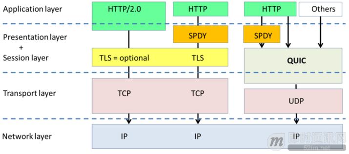
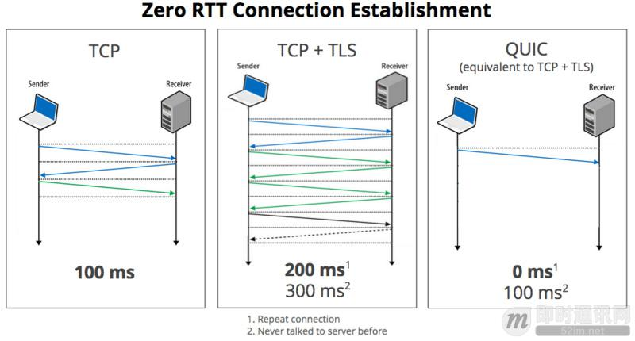
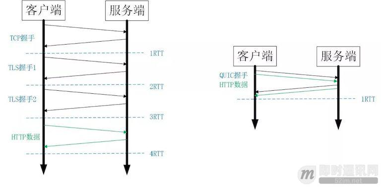
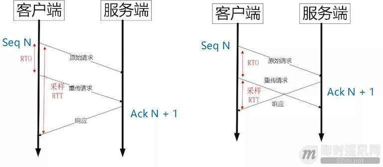

# QUIC 基础
## 问题
从上个世纪 90 年代互联网开始兴起一直到现在，大部分的互联网流量传输只使用了几个网络协议。

- IPv4 进行路由
- TCP 进行连接层面的流量控制
- SSL/TLS 协议实现传输安全
- HTTP 进行应用数据的传输

而且近三十年来，这几个协议的发展都非常缓慢，改进如下

- TCP 主要是拥塞控制算法的改进
- SSL/TLS 基本上停留在原地，几个小版本的改动主要是密码套件的升级，TLS1.3[3] 是一个飞跃式的变化，但截止到今天，还没有正式发布。
- IPv4 虽然有一个大的进步，实现了 IPv6

随着移动互联网快速发展以及物联网的逐步兴起，网络交互的场景越来越丰富，网络传输的内容也越来越庞大，用户对网络传输效率和 WEB 响应速度的要求也越来越高。

产生当前方案和用户需求产生矛盾：

- 协议历史悠久导致中间设备僵化

	可能是 TCP 协议使用得太久，也非常可靠。所以很多中间设备，包括防火墙、NAT 网关，整流器等出现了一些约定俗成的动作。

	比如有些防火墙只允许通过 TCP  80 和 443，不放通其他端口。NAT 网关在转换网络地址时重写传输层的头部，有可能导致双方无法使用新的传输格式。整流器和中间代理有时候出于安全的需要，会删除一些它们不认识的选项字段。

	TCP 协议本来是支持端口、选项及特性的增加和修改。但是由于 TCP 协议和知名端口及选项使用的历史太悠久，中间设备已经依赖于这些潜规则，所以对这些内容的修改很容易遭到中间环节的干扰而失败。

	而这些干扰和硬性规定导致很多在 TCP 协议上的优化变得小心谨慎，步履维艰。
- 依赖于操作系统的实现导致协议本身僵化；

	TCP 是由操作系统在内核栈层面实现的，应用程序只能使用，不能直接修改。虽然应用程序的更新迭代非常快速和简单。但是 TCP 的迭代却非常缓慢，原因就是操作系统升级很麻烦。

	现在移动终端更加流行，但是移动端部分用户的操作系统升级依然可能滞后数年时间。PC 端的系统升级滞后得更加严重，windows xp 现在还有大量用户在使用，尽管它已经存在快 20 年。

	服务端系统不依赖用户升级，但是由于操作系统升级涉及到底层软件和运行库的更新，所以也比较保守和缓慢。

	这也就意味着即使 TCP 有比较好的特性更新，也很难快速推广。比如 TCP Fast Open。虽然 2013 年就被提出了，但是 Windows 很多系统版本依然不支持它。
- 建立连接的握手延迟大；

	不管是 HTTP1.0/1.1 还是 HTTPS，HTTP2，都使用了 TCP 进行传输。HTTPS 和 HTTP2 还需要使用 TLS 协议来进行安全传输。

	这就出现了两个握手延迟：

	- 1）TCP 三次握手导致的 TCP 连接建立的延迟；
	- 2）TLS 完全握手需要至少 2 个 RTT 才能建立，简化握手需要 1 个 RTT 的握手延迟。
	
	对于很多短连接场景，这样的握手延迟影响很大，且从根本上无法消除。
- 队头阻塞。

	队头阻塞主要是 TCP 协议的可靠性机制引入的。TCP 使用序列号来标识数据的顺序，数据必须按照顺序处理，如果前面的数据丢失，后面的数据就算到达了也不会通知应用层来处理。
	
	另外 TLS 协议层面也有一个队头阻塞，因为 TLS 协议都是按照 record 来处理数据的，如果一个 record 中丢失了数据，也会导致整个 record 无法正确处理。
	
	概括来讲，TCP 和 TLS1.2 之前的协议存在着结构性的问题，如果继续在现有的 TCP、TLS 协议之上实现一个全新的应用层协议，依赖于操作系统、中间设备还有用户的支持。部署成本非常高，阻力非常大。
		
## 什么是 QUIC
Quic 全称 quick udp internet connection [1]，“快速 UDP 互联网连接”，（和英文 quick 谐音，简称“快”）是由 Google 提出的使用 udp 进行多路并发传输的协议。

QUIC 协议选择了 UDP，因为 UDP 本身没有连接的概念，不需要三次握手，优化了连接建立的握手延迟，同时在应用程序层面实现了 TCP 的可靠性，TLS 的安全性和 HTTP2 的并发性，只需要用户端和服务端的应用程序支持 QUIC 协议，完全避开了操作系统和中间设备的限制。

## 优势
Quic 对比传统架构的 http2+tcp+tls，相比现在广泛应用的 http2+tcp+tls 协议有如下优势：

- 减少了 TCP 三次握手及 TLS 握手时间
- 改进的拥塞控制
- 避免队头阻塞的多路复用
- 连接迁移
- 前向冗余纠错

### 网络层对比

### 延迟对比

## 核心特性
### 1 连接建立延时低
什么是 0RTT，两层含义：

- 传输层 0RTT 就能建立连接
- 加密层 0RTT 就能建立加密连接

0RTT 建连可以说是 QUIC 相比 HTTP2 最大的性能优势。

传统 tcp+tls+http 如上图左边是 HTTPS 的一次完全握手的建连过程，需要 3 个 RTT。就算是 Session Resumption，也需要至少 2 个 RTT。

QUIC 建立在 UDP 的基础上,同时又实现了 0RTT 的安全握手，所以在大部分情况下，只需要 0 个 RTT 就能实现数据发送，在实现前向加密的基础上，并且 0RTT 的成功率相比 TLS 的 Sesison Ticket 要高很多。

### 2 改进的拥塞控制
TCP 的拥塞控制实际上包含了四个算法：

- 慢启动
- 拥塞避免
- 快速重传
- 快速恢复

QUIC 协议当前默认使用了 TCP 协议的 Cubic 拥塞控制算法，同时也支持 CubicBytes, Reno, RenoBytes, BBR, PCC 等拥塞控制算法。

从拥塞算法本身来看，QUIC 只是按照 TCP 协议重新实现了一遍，那么 QUIC 协议到底改进在哪些方面呢？主要有如下几点。

- 算法可插拔

	可插拔就是能够非常灵活地生效，变更和停止。如下方面
	
	- 应用程序层面就能实现不同的拥塞控制算法，不需要操作系统，不需要内核支持。这是一个飞跃，因为传统的 TCP 拥塞控制，必须要端到端的网络协议栈支持，才能实现控制效果。而内核和操作系统的部署成本非常高，升级周期很长，这在产品快速迭代，网络爆炸式增长的今天，显然有点满足不了需求；
	- 即使是单个应用程序的不同连接也能支持配置不同的拥塞控制。就算是一台服务器，接入的用户网络环境也千差万别，结合大数据及人工智能处理，能为各个用户提供不同的但又更加精准更加有效的拥塞控制。比如 BBR 适合，Cubic 适合；
	- 应用程序不需要停机和升级就能实现拥塞控制的变更，在服务端只需要修改一下配置，reload 一下，完全不需要停止服务就能实现拥塞控制的切换。
	
	STGW 在配置层面进行了优化，可以针对不同业务，不同网络制式，甚至不同的 RTT，使用不同的拥塞控制算法。
- 单调递增的 Packet Number

	TCP 为了保证可靠性，使用了基于字节序号的 Sequence Number 及 Ack 来确认消息的有序到达。

	QUIC 同样是一个可靠的协议，它使用 Packet Number 代替了 TCP 的 sequence number，并且每个 Packet Number 都严格递增，也就是说就算 Packet N 丢失了，重传的 Packet N 的 Packet Number 已经不是 N，而是一个比 N 大的值。而 TCP 呢，重传 segment 的 sequence number 和原始的 segment 的 Sequence Number 保持不变，也正是由于这个特性，引入了 Tcp 重传的歧义问题。
		

	如图所示 RTO 发生后，根据重传的 Packet Number 就能确定精确的 RTT 计算。如果 Ack 的 Packet Number 是 N+M，就根据重传请求计算采样 RTT。如果 Ack 的 Pakcet Number 是 N，就根据原始请求的时间计算采样 RTT，没有歧义性。
		
	但是单纯依靠严格递增的 Packet Number 肯定是无法保证数据的顺序性和可靠性。QUIC 又引入了一个 Stream Offset 的概念。
		
	即一个 Stream 可以经过多个 Packet 传输，Packet Number 严格递增，没有依赖。但是 Packet 里的 Payload 如果是 Stream 的话，就需要依靠 Stream 的 Offset 来保证应用数据的顺序。如错误! 未找到引用源。所示，发送端先后发送了 Pakcet N 和 Pakcet N+1，Stream 的 Offset 分别是 x 和 x+y。
		
	假设 Packet N 丢失了，发起重传，重传的 Packet Number 是 N+2，但是它的 Stream 的 Offset 依然是 x，这样就算 Packet N + 2 是后到的，依然可以将 Stream x 和 Stream x+y 按照顺序组织起来，交给应用程序处理。

