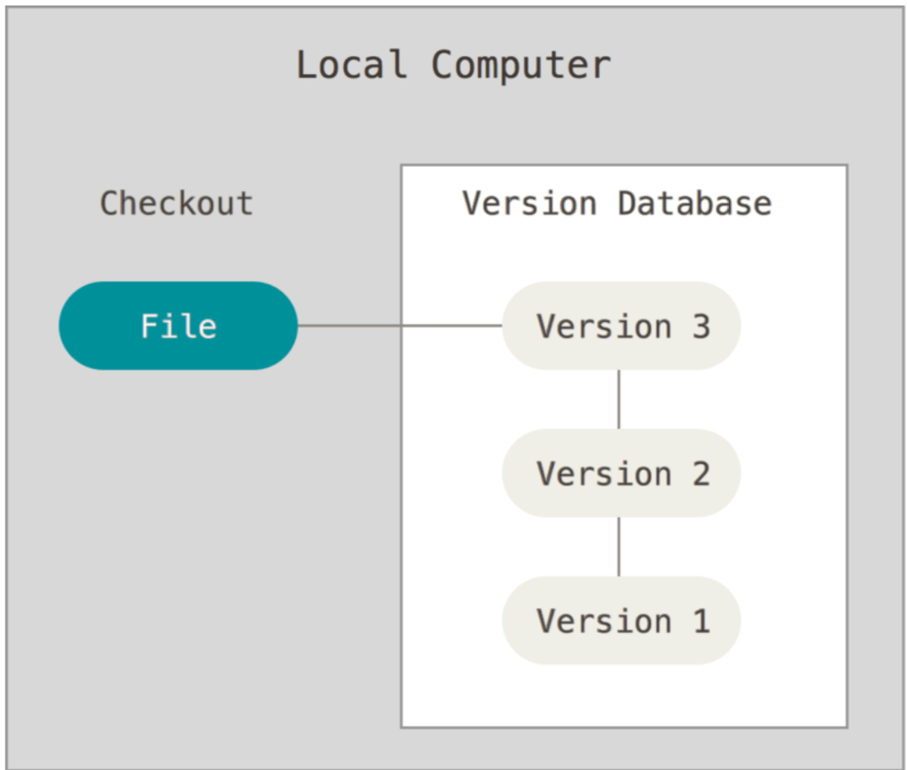
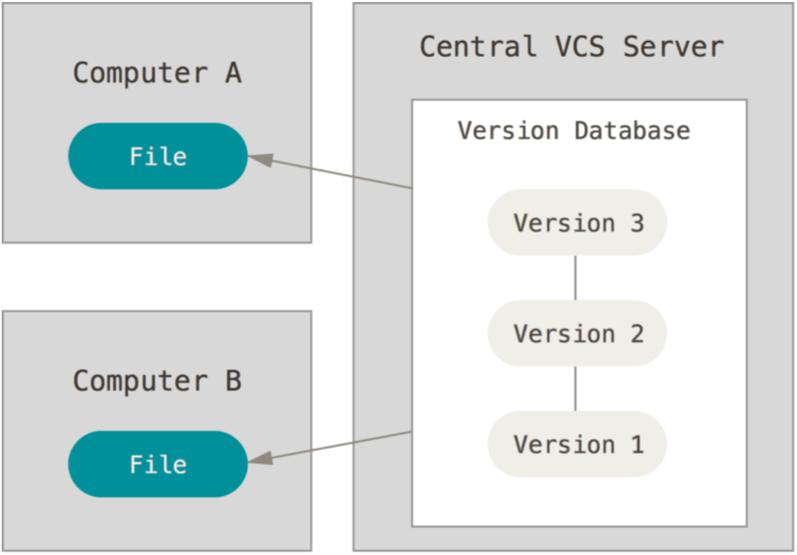
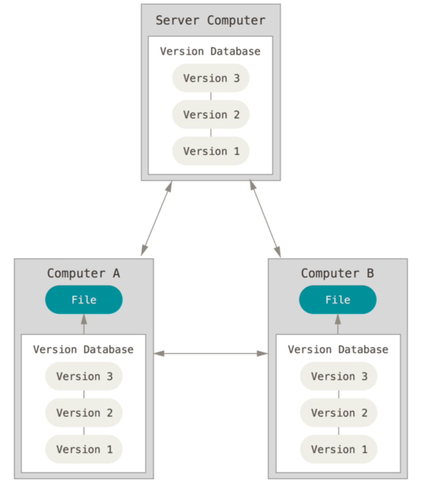
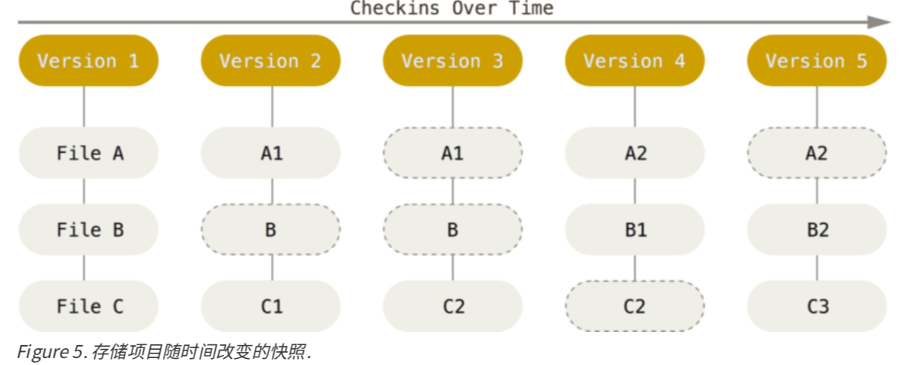
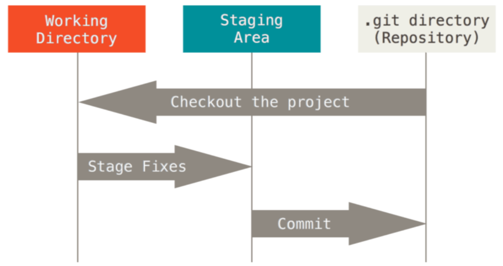

# GIT 基础学习
版本管理软件的进化分3个阶段

- 本地管理

	解决版本管理问题
	
- 远程管理

	解决多人版本管理问题
	
- 分布式管理

	解决多人版本管理高可用问题
	
	
## git 解决的问题
- 速度
- 简单的设计
- 对非线性开发模式的强力支持(允许成千上万个并行开发的分支)
- 完全分布式
- 有能力高效管理类似 Linux 内核一样的超大规模项目(速度和数据量)

## Git 基础
### 直接记录快照，而非差异比较	
Git 把数据看作是对小型文件系统的一组快照。 每次提交、更新或在 Git 中保存项目状态时，它主要对当时的全部文件制作一个快照并保存这个快照的索引。 为了高效， 如果文件没有修改，Git 不再重新存储该文件，而是只保留一个链接指向之前存储的文件。 Git 更像是数据的一个快照流。

### 近乎所有操作都是本地执行(效率高，提供离线能力)
因为 git 本地存储了所有的版本数据，所以在 Git 中的绝大多数操作都只需要访问本地文件和资源，一般不需要来自网络上其它计算机的信息。因为在本地磁盘上就有项目的完整历史，所以大部分操作看起来瞬间完成。
### Git 保证完整性(计算校验和)
Git 用以计算校验和的机制叫做 SHA-1 散列(hash，哈希)。这是一个由 40 个十六进制字符(0-9 和 a-f)组成的字符串，基于 Git 中文件的内容或目录结构计算出来。 SHA-1 哈希看起来是这样:

	24b9da6552252987aa493b52f8696cd6d3b00373
### Git 一般只添加数据
执行的 Git 操作，几乎只往 Git 数据库中增加数据。很难让 Git 执行任何不可逆操作，或者让它以任何方式清除数据。未提交更新时有可能丢失或弄乱修改的内容;但是一旦提交快照到 Git 中，就难以再丢失数据，特别是如果定期的推送数据库到其它仓库
### 三种状态
Git 有三种状态，文件可能处于其中之一

- 已提交(committed)
- 已修改(modified)
- 已暂存(staged)

三个工作区域的概念

- Git 仓库

	Git 仓库目录是 Git 用来保存项目的元数据和对象数据库的地方。 这是 Git 中最重要的部分，从其它计算机克隆仓库时，拷贝的就是这里的数据。
- 工作目录

	工作目录是对项目的某个版本独立提取出来的内容。 这些从 Git 仓库的压缩数据库中提取出来的文件，放在磁盘.
上供你使用或修改。
- 暂存区域

	暂存区域是一个文件，保存了下次将提交的文件列表信息，一般在 Git 仓库目录中。 有时候也被称作‘索引’，不过一般说法还是叫暂存区域。

基本的 Git 工作流程如下

1. 在工作目录中修改文件
2. 暂存文件，将文件的快照放入暂存区域
3. 提交更新，找到暂存区域的文件，将快照永久性存储到 Git 仓库目录

### 获取 git 仓库
取得 Git 项目仓库的方法。 

- 现有项目或目录下导入所有文件到 Git 中
	- 进入项目的根目录 `$ git init`,创建一个名为 .git 的子目录，这个子目录含有初始化的 Git 仓库中所有的必须文件，这些文件是 Git 仓库的骨干
	- 如果项目目录已经存在文件或文件夹(不是空文件夹)，使用 `git add` 和 `git commit` 

			$ git add . #实现对指定文件的跟踪
			$ git commit -m 'initial project version' # 执行对命令的提交

- 从一个服务器克隆一个现有的 Git 仓库

	git 使用的命令是 "clone" 而不是 "checkout"。 这是 Git 区别于其它版本控制系统的一个重要特性，Git 克隆的是该 Git 仓库服务器上的几乎所有数据，而不是仅仅复制完成工作所需要文件。 
	
	`git clone https://github.com/libgit2/libgit2`

	执行命令后会在当前目录下创建一个名为 “libgit2” 的目录，并在这个目录下初始化一个 .git 文件夹，从远程仓库拉取下所有数据放入 .git 文件夹，然后从中读取最新版本的文件的拷贝。
- 支持多种协议

	Git 支持多种数据传输协议。 
	
	-  https:// https 协议
	-  git:// ssh 协议

### 记录每次更新到仓库
当从 git 已经获取了一个项目的工作目录后，工作目录下的每一个文件都不外乎这两种状态:

- 已跟踪

	 已跟踪的文件是指那些被纳入了 版本控制的文件，在上一次快照中有它们的记录，在工作一段时间后，它们的状态可能处于未修改，已修改或已 放入暂存区。
- 未跟踪

	不存在于上次快照的记 录中，也没有放入暂存区。 

文件的生命周期

#### 检查当前文件状态
- 干净状态

			$ git status
			On branch master #分支
			nothing to commit, working directory clean

	跟踪文件在上次提交后都未被更改过并且没有出现任何处于未跟踪状态的新文件 
- 未跟踪文件

			  git status
			  On branch master
			  Untracked files:
			    (use "git add <file>..." to include in what will be committed)
			      README
			  nothing added to commit but untracked files present (use "git add" to
			  track)
	未跟踪的文件意味着Git在之前 的快照(提交)中没有这些文件;Git 不会自动将之纳入跟踪范围

#### 跟踪新文件
- 使用命令 `git add`

		git add README
- 暂存状态

		  $ git status
		  On branch master
		  Changes to be committed:
		    (use "git reset HEAD <file>..." to unstage)
		      new file:   README
	`Changes to be committed` 这行下面的，就说明是已暂存状态,文件此时此刻的版本将被留存在历史记录中
- 暂存已修改文件
	- 查看问题 

			$ git status
			  On branch master
			  Changes to be committed:
			    (use "git reset HEAD <file>..." to unstage)
			      new file:   README
			  Changes not staged for commit:
			    (use "git add <file>..." to update what will be committed)
			    (use "git checkout -- <file>..." to discard changes in working
			  directory)
			      modified:   CONTRIBUTING.md		
	CONTRIBUTING.md 出现在 Changes not staged for commit 这行下面，说明已跟踪文件的内容发生了变化，但还没有放到暂存区。 要暂存这次更新，需要再运行 git add 。这个多功能命令:
	
		- 可以用它开始跟踪新文件
		- 将已跟踪的文件放到暂存区
		- 合并时把有冲突的文件标记为已解决状态等
	- 添加修改

			  $ git add CONTRIBUTING.md
			  $ git status
			  On branch master
			  Changes to be committed:
			    (use "git reset HEAD <file>..." to unstage)
			      new file:   README
			      modified:   CONTRIBUTING.md
		现在两个文件都已暂存，下次提交时就会一并记录到仓库。如果再次修改需要重复上面的步骤

#### 状态简览
使用 `git status -s` 命令或 `git status --short` 命令，得到一种更为紧凑的格式输出 

	$ git status -s
	  M README #右边的 M 表示该文件被修改了但是还没放入暂存区
	 MM Rakefile
	 A  lib/git.rb # 添加到暂存区
	 M  lib/simplegit.rb # 左边的 M 表示该文件被修改了并放入了暂存区
	 ?? LICENSE.txt # 未跟踪
#### 忽略文件
创建一个名为 `.gitignore` 的文件，列出要忽略的文件模式。如

	$ cat .gitignore
	  *.[oa] #忽略所有以 .o 或 .a 结尾的文件
	  *~ #忽略所有以波浪符(~)结尾的文件
	  
文件 `.gitignore` 的格式规范如下:

- 所有空行或者以 # 开头的行都会被 Git 忽略。 
- 可以使用标准的 glob 模式匹配。(glob 就是正则)
- 匹配模式可以以(/)开头防止递归。
- 匹配模式可以以(/)结尾指定目录。
- 要忽略指定模式以外的文件或目录，可以在模式前加上惊叹号(!)取反。

#### 查看已暂存和未暂存的修改
可以使用 `git diff` 来查看当前文件和缓存区文件的差异，若要查看已暂存的将要添加到下次提交里的内容，可以用 `git diff --cached`或`git diff --staged` (1.6.1 及更高版本）
#### 提交更新
在缓存区准备好后，就可以进行提交了，使用 `$ git commit`

	$ git commit -m "Story 182: Fix benchmarks for speed"
	[master 463dc4f] Story 182: Fix benchmarks for speed
	2 files changed, 2 insertions(+)
	create mode 100644 README	
上面信息得到当前是在哪个分支(master)提交的，本次提交的完整 SHA-1 校验和是什么(463dc4f)，以及在本次提交中，有多少文件修订过，多少行添加和删改过。
#### 跳过使用暂存区域
git commit 加上 -a 选项，Git 就会自动把所有已经跟踪过的文件暂存 起来一并提交，从而跳过git add步骤
#### 移除文件
从 Git 中移除某个文件，就必须要从已跟踪文件清单中移除(确切地说，是从暂存区域移除)，然后提交。 可以用 `git rm` 命令完成此项工作，并连带从工作目录中删除指定的文件，这样以后就不会出现在未跟踪文件清单中了。

	$ git rm PROJECTS.md
	rm 'PROJECTS.md'
	$ git status
	On branch master
	Changes to be committed:
	(use "git reset HEAD <file>..." to unstage)
	deleted:    PROJECTS.md	  	 
下一次提交时，该文件就不再纳入版本管理了。 如果删除之前修改过并且已经放到暂存区域的话，则必须要用强制删除选项 -f

- git 已经可以匹配正则

		$ git rm log/\*.log
- 想把文件从 Git 仓库中删除(亦即从暂存区域移除)，但仍然希望保留在当前工作目录中。

		$ git rm --cached README

#### 移动文件
Git 并不显式跟踪文件移动操作

	$ git mv file_from file_to				
	$ mv README.md README
   	$ git rm README.md
   	$ git add README
#### 查看提交历史
git log 会按提交时间列出所有的更新，最近的更新排在最上面。

		$ git log
		commit ca82a6dff817ec66f44342007202690a93763949
		Author: Scott Chacon <schacon@gee-mail.com>
		Date:   Mon Mar 17 21:52:11 2008 -0700
		   changed the version numbe
		....      				
- 参数
	- 选项 `-p`，用来显示每次提交的内容差异
	- 选项 `-2` 来仅显示最近两次提交
	
		如 ` $ git log -p -2`.
	- 选项 `--stat`可以看到每次提交的简略的统计信息
	- 选项是 `--pretty` 可以指定使用不同于默认格式的方式展示提交历史。
		- `oneline` 将每个提交放在一行显示
		- 还有 `short`、`full` 和 `fuller`
		- `format` 可以定制要显示的记录格式

				$ git log --pretty=format:"%h - %an, %ar : %s"
				ca82a6d - Scott Chacon, 6 years ago : changed the version number
				085bb3b - Scott Chacon, 6 years ago : removed unnecessary test
				a11bef0 - Scott Chacon, 6 years ago : first commit 
		- 其他
	- 限制输出长度，如最近两周

			$ git log --since=2.weeks

#### 撤消操作
在任何一个阶段，都有可能想要撤消某些操作。注意，有些撤消操作是不可逆的。有时候提交完了才发现漏掉了几个文件没有添加，或者提交信息写错了。 此时，可以运行带有 `--amend` 选 项的提交命令尝试重新提交:

	$ git commit -m 'initial commit'
	$ git add forgotten_file
	$ git commit --amend
#### 取消暂存的文件
操作暂存区域与工作目录中已修改的文件，这些命令在修改文件状态的同时，也会提示如何撤消操作

	  $ git add *
	  $ git status
	  On branch master
	  Changes to be committed:
	    (use "git reset HEAD <file>..." to unstage) #使用这个命令来取消暂存
	      renamed:    README.md -> README
	      modified:   CONTRIBUTING.md
#### 撤消对文件的修改
不想保留对 CONTRIBUTING.md 文件的修改，将它还原成上次提交 时的样子。注意 `git checkout -- [file]` 是一个危险的命令。对那个文件做的任何修改都会消失,只是拷贝了另一个文件来覆盖它。 除非确实清楚不想要那个文件了，否则不要使用这个命令。

	  $ git checkout -- CONTRIBUTING.md
	  $ git status
	  On branch master
	  Changes to be committed:
	    (use "git reset HEAD <file>..." to unstage)
	      renamed:    README.md -> README

### 远程仓库使用
远程仓库是指托管在因特网或其他网络中的你的项目的版本库，管理远程仓库包括了解如何添加远程仓库、移除无效的远程仓 库、管理不同的远程分支并定义它们是否被跟踪等等。
#### 查看远程仓库
想查看已经配置的远程仓库服务器，可以运行 `git remote` 命令

	$ git clone https://github.com/schacon/ticgit
	  Cloning into 'ticgit'...
	  remote: Reusing existing pack: 1857, done.
	  remote: Total 1857 (delta 0), reused 0 (delta 0)
	  Receiving objects: 100% (1857/1857), 374.35 KiB | 268.00 KiB/s, done.
	  Resolving deltas: 100% (772/772), done.
	  Checking connectivity... done.
	$ cd ticgit
	$ git remote
	origin	      	      	
可以指定选项 -v，会显示需要读写远程仓库使用的 Git 保存的简写与其对应的 URL。
	  
	  $ git remote -v
	  origin  https://github.com/schacon/ticgit (fetch)
	  origin  https://github.com/schacon/ticgit (push)
#### 添加远程仓库
运行 `git remote add <shortname> <url>` 添加一个新的远程Git仓库

	$ git remote
	  origin
	$ git remote add pb https://github.com/paulboone/ticgit
	$ git remote -v
	  origin  https://github.com/schacon/ticgit (fetch)
	  origin  https://github.com/schacon/ticgit (push)
	  pb  https://github.com/paulboone/ticgit (fetch)
	  pb  https://github.com/paulboone/ticgit (push)
可以在命令行中使用字符串 pb 来代替整个 URL,例如，如果想拉取 Paul 的仓库中有但没有的信息，可以运行 `git fetch pb`

	  $ git fetch pb
	  remote: Counting objects: 43, done.
	  remote: Compressing objects: 100% (36/36), done.
	  remote: Total 43 (delta 10), reused 31 (delta 5)
	  Unpacking objects: 100% (43/43), done.
	  From https://github.com/paulboone/ticgit
	   * [new branch]      master     -> pb/master
	   * [new branch]      ticgit     -> pb/ticgit
现在 Paul 的 master 分支可以在本地通过 pb/master 访问到
#### 从远程仓库中抓取与拉取
从远程仓库中获得数据，可以执行: `$ git fetch [remote-name]`,还可以使用 `git pull` 和 `git clone` 来拉取数据
#### 推送到远程仓库
当分享项目时，必须将其推送到上游。 这个命令很简单:`git push [remote-name] [branch- name]。`,比如 `$ git push origin master` 就可以把代码数据备份到远端，当然只有有权限和远端无人推送的时候才生效。
#### 查看远端仓库
想要查看某一个远程仓库的更多信息，可以使用` git remote show [remote-name]` 命令，如

	$ git remote show origin
	  * remote origin
	    Fetch URL: https://github.com/schacon/ticgit
	    Push  URL: https://github.com/schacon/ticgit
	    HEAD branch: master
	    Remote branches:
	      master                               tracked
	      dev-branch                           tracked
	    Local branch configured for 'git pull':
	      master merges with remote master
	    Local ref configured for 'git push':
	      master pushes to master (up to date)
#### 远程仓库的移除与重命名
- 重名

	如果想要重命名引用的名字可以运行` git remote rename` 去修改一个远程仓库的简写名。 例如，想要将 pb 重命名为 paul,值得注意的是这同样也会修改远程分支名字

		$ git remote rename pb paul
		$ git remote
		  origin
		  paul
- 移除

	因为一些原因想要移除一个远程仓库或者某一个贡献者不再贡献了-可以使用 `git remote rm`
	
		$ git remote rm paul
		$ git remote
		origin

#### 标签
- 列出标签 

	可以使用 `$ git tag`,还可以使用特定的模式查找标签，如果只对 1.8.5 系列感兴趣
 
		$ git tag -l 'v1.8.5*'
		  v1.8.5
		  v1.8.5-rc0
		  v1.8.5-rc1
- 创建标签

	两种主要类型的标签
	
	- 轻量标签(lightweight)

		 轻量标签本质上是将提交校验和存储到一个文件中.没有保存任何其他信息。 创建轻量标签，不需要使用其他选项，只需要提供标签名字
		 
			$ git tag v1.4-lw
			$ git tag	
				...
			  v1.4-lw
  		 通过使用 `git show` 看不到额外信息
  		 
			  $ git show v1.4-lw
			  commit ca82a6dff817ec66f44342007202690a93763949
			  Author: Scott Chacon <schacon@gee-mail.com>
			  Date:   Mon Mar 17 21:52:11 2008 -0700
			      changed the version number
	- 附注标签(annotated)	

		附注标签是存储在 Git 数据库中的一个完整对象。它们是可以被校验的;其中包含打标签者的名字、电子 邮件地址、日期时间;还有一个标签信息;并且可以使用 GNU Privacy Guard (GPG)签名与验证。创建一个附注标签是很简单的。 最简单的方式是当在运行 tag 命令时指定 -a 选项，-m 选项指定了一条将会存储在标签中的信息:

			$ git tag -a v1.4 -m 'my version 1.4'
			$ git tag
			  v0.1
			  v1.3
			  v1.4	
		通过使用 `git show` 命令可以看到标签信息与对应的提交信息
		
			$ git show v1.4
			  tag v1.4
			  Tagger: Ben Straub <ben@straub.cc>
			  Date:   Sat May 3 20:19:12 2014 -0700
			  my version 1.4
			  ....	
- 后期打标签

	也可以对过去的提交打标签，如
	
		$ git log --pretty=oneline
		  ...
		  166ae0c4d3f420721acbb115cc33848dfcc2121a started write support
		  9fceb02d0ae598e95dc970b74767f19372d61af8 updated rakefile
	假设想给 “updated rakefile” 提交打一个 tag

		$ git tag -a v1.2 9fceb02
- 共享标签

	默认情况下，`git push` 命令并不会传送标签到远程仓库服务器上。 在创建完标签后必须推送标签到共享服务器上。这样从远程获取数据的人就可以得到 tag 信息。可以运行 `git push origin [tagname]`。
	
		$ git push origin v1.5
		  Counting objects: 14, done.
		  Delta compression using up to 8 threads.
		  Compressing objects: 100% (12/12), done.
	如果想要一次性推送很多标签，也可以使用带有 --tags 选项的 git push 命令

		$ git push origin --tags
- 删除标签		

	可以使用命令 `git tag -d <tagname>`
	
		$ git tag -d v1.4-lw
		  Deleted tag 'v1.4-lw' (was e7d5add)
	应该注意的是上述命令并不会从任何远程仓库中移除这个标签，你必须使用 `git push <remote> :refs/tags/<tagname>` 来更新的远程仓库
	
		$ git push origin :refs/tags/v1.4-lw
		  To /git@github.com:schacon/simplegit.git
		   - [deleted]         v1.4-lw
- 检出标签

	如果想查看某个标签所指向的文件版本，可以使用 `git checkout` 命令，虽然说这会使的仓库处于“分离 头指针(detacthed HEAD)”状态 

		$ git checkout 2.0.0	
	在“分离头指针”状态下，如果做了某些更改然后提交它们，标签不会发生变化，但新提交将不属于任何分支，并且将无法访问，如果需要进行更改——比如说你正在修复旧版本的错 误——这通常需要创建一个新分支:
	
		git checkout -b version2 v2.0.0
		  Switched to a new branch 'version2'

#### Git 别名
有一个小技巧可以使的 Git 体验更简单、容易、熟悉:别名。
Git 并不会在输入部分命令时自动推断出想要的命令。如果不想每次都输入完整的 Git 命令，可以通过 `git config` 文件来轻松地为每一个命令设置一个别名。 这里有一些例子:		  

	 $ git config --global alias.co checkout
	 $ git config --global alias.br branch
	 $ git config --global alias.ci commit
	 $ git config --global alias.st status
	 
这意味着，当要输入 `git commit` 时，只需要输入`git ci` 即可。再比如，别名 `$ git config --global alias.unstage 'reset HEAD --` 后，下面命令等价

	$ git unstage fileA
	$ git reset HEAD -- fileA
	
	
	 					      		